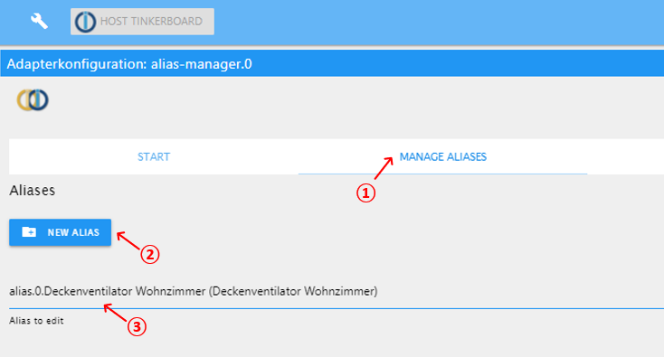

# ioBroker.alias-manager

**Tests:**: 

## alias-manager adapter for ioBroker

Manages and creates aliases.

## Quick Intro

* (1) Klick on 'MANAGE ALIASES'
* (2) To create a new alias, klick on 'NEW ALIAS' or
* (3) Select an existing alias to edit

* (1) You will then find an area with general settings of this alias, like the name or the common role
* (2) Below you will find a list with all the datapoints of the alias
* (3) You can add alias-datapoints to this list either by adding an empty one or by selecting an existing iobroker-datapoint and copy its settings to a new alias-datapoint
* (4) You can delete datapoints by clicking on the garbage-icon
* Every datapoint has several fields to configure it:
    * In the grey area you may set the name or delete the datapoint
    * In the blue area you can configure the role, the type and - optional - the unit
	* In the green area you can set optional min and max, and determine if the datapoint should be readonly (common.write is off) and if its value can be accessed (common.read is on - which will be the right setting for most cases)
	* In the red area you can: 
	    * (5) Configure the original ioBroker-datapoint, this alias-datapoint is linked to. Both (the original datapoint and the alias-datapoint) well be kept in sync.
		* (6) Furthermore you can configure conversion-functions for read and write. 
		    * Example: If you set ``val / 10`` as "Read-Function", the value of the aias-datapoint will always be 10 percent of the original datapoint. 
			* In most cases you would then like to configure ``val * 10`` as "Write-Function", to also keep this ratio, when writing to the alias-datapoint.
		* Please read more about that in the ioBroker-documenation about aliases under https://www.iobroker.net/#en/documentation/dev/aliases.md

* (1) When clicking on 'COPY ALIAS' to copy or
* (2) on 'RENAME ALIAS' to rename the alias, the following dialog field will open:

\
Here you can:
* (1) Set a new id and
* (2) Set a new common name for the alias
* (3) By clicking on 'ADD REPLACEMENT' you can add lines to the following list, where you can:
    * (4) Enter a string, that will be searched for, and replaced by (5) this string
	* With this funcion, you can quickly change the original ioBroker-datapoints, your alias-datapoints are linked to
	* Example: 
	    * You have a fan with several datapoints like ``SET``, ``ERROR`` and ``UNREACH``
		* These alias-datapoints are linked to original datapoints like ``hm-rpc.0.JEQ0698034.1.STATE``, ``hm-rpc.0.JEQ0698034.0.ERROR`` and ``hm-rpc.0.JEQ0698034.0.UNREACH``
		* Now, if your device is broken and has to be replaced by a new one, its serial number will change, lets say, for example to ASDF1234
		* To update all the links in all you alias-datapoints in one go you can search for ``hm-rpc.0.JEQ0698034`` and replace it by ``hm-rpc.0.ASDF1234``
		* This is also useful, when creating new aliases, that are similar to an old one. Just copy the alias, set a new id and name and use the replacement-function, to adjust the linked datapoints

* After changing settings, you can:
* (1) Save all changed alias-datapoints in one go by clicking on 'SAVE ALL CHANGES' or
* (2) Save only one datapoint by clicking on 'SAVE CHANGES'
* (3) Finally you can delete the entire Alias by clicking on 'DELETE ALIAS'

## Changelog

### 0.0.8 (2021-03-22)
* (sbormann) Added ability to create alias-datapoint from existing datapoint.

### 0.0.7 (2021-03-21)
* (sbormann) Fixed typos.
* (sbormann) Changed the way ioBroker-Objects are fetched (much faster).
* (sbormann) Added copy-button to datapoints.
* (sbormann) Empty fields are now removed (before they were set to null).
* (sbormann) Changed mode to onlyWWW.

### 0.0.6 (2021-01-18)
* (sbormann) Added delete datapoint.
* (sbormann) Some fixes .

### 0.0.1
* (sbormann) Initial release.

## License
MIT License

Copyright (c) 2021 Sebastian Bormann <sebastian@bormann.net>

Permission is hereby granted, free of charge, to any person obtaining a copy
of this software and associated documentation files (the "Software"), to deal
in the Software without restriction, including without limitation the rights
to use, copy, modify, merge, publish, distribute, sublicense, and/or sell
copies of the Software, and to permit persons to whom the Software is
furnished to do so, subject to the following conditions:

The above copyright notice and this permission notice shall be included in all
copies or substantial portions of the Software.

THE SOFTWARE IS PROVIDED "AS IS", WITHOUT WARRANTY OF ANY KIND, EXPRESS OR
IMPLIED, INCLUDING BUT NOT LIMITED TO THE WARRANTIES OF MERCHANTABILITY,
FITNESS FOR A PARTICULAR PURPOSE AND NONINFRINGEMENT. IN NO EVENT SHALL THE
AUTHORS OR COPYRIGHT HOLDERS BE LIABLE FOR ANY CLAIM, DAMAGES OR OTHER
LIABILITY, WHETHER IN AN ACTION OF CONTRACT, TORT OR OTHERWISE, ARISING FROM,
OUT OF OR IN CONNECTION WITH THE SOFTWARE OR THE USE OR OTHER DEALINGS IN THE
SOFTWARE.