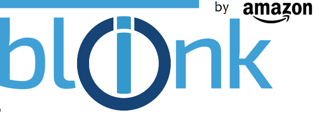

# ioBroker.blink4home

## blink4home adapter for ioBroker

Adapter für das Amazon Blink Kamera security system.
der Adapter stellt alle Werte in Datenpunkte dar. 
Arm/Disarm kann über Blockly oder JS gesetzt werden.

## Manual

Username and Passwort des Blink-Cloud accounts in Adapter Konfiguration Page eintragen.
Den Polling Intervall sollte nicht unter 5 Sek gesetzt werden.
Wenn arm/disarm über ebenfalls manuell über Datenpunkt gesetzt werden soll, einfach selbständig Schreibrechte vergeben.
für Scriptbasierte Steuerung ist das nicht nötig.

## ToDos
* Control Panel überarbeiten (Anzeige von letzen Foto, Abrufen der Videos, Arm/Disarm, Kamerabezogene Motion Detection u.a.)

## Changelog

### 0.1.1
* (Alex.0) add Control Site (under Construction)
* (Alex.0) some fixes
### 0.1.0
* (Alex.0) Beta Release 1
### 0.0.1 Inital Release
* (Alex.0) initial release

## License
MIT License

Copyright (c) 2020 Alex.0 <flashy@openuav.de>

Permission is hereby granted, free of charge, to any person obtaining a copy
of this software and associated documentation files (the "Software"), to deal
in the Software without restriction, including without limitation the rights
to use, copy, modify, merge, publish, distribute, sublicense, and/or sell
copies of the Software, and to permit persons to whom the Software is
furnished to do so, subject to the following conditions:

The above copyright notice and this permission notice shall be included in all
copies or substantial portions of the Software.

THE SOFTWARE IS PROVIDED "AS IS", WITHOUT WARRANTY OF ANY KIND, EXPRESS OR
IMPLIED, INCLUDING BUT NOT LIMITED TO THE WARRANTIES OF MERCHANTABILITY,
FITNESS FOR A PARTICULAR PURPOSE AND NONINFRINGEMENT. IN NO EVENT SHALL THE
AUTHORS OR COPYRIGHT HOLDERS BE LIABLE FOR ANY CLAIM, DAMAGES OR OTHER
LIABILITY, WHETHER IN AN ACTION OF CONTRACT, TORT OR OTHERWISE, ARISING FROM,
OUT OF OR IN CONNECTION WITH THE SOFTWARE OR THE USE OR OTHER DEALINGS IN THE
SOFTWARE.