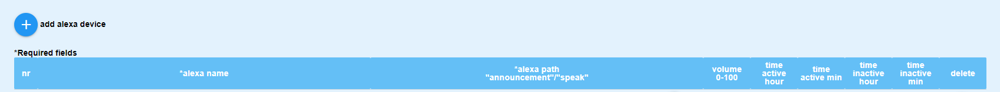
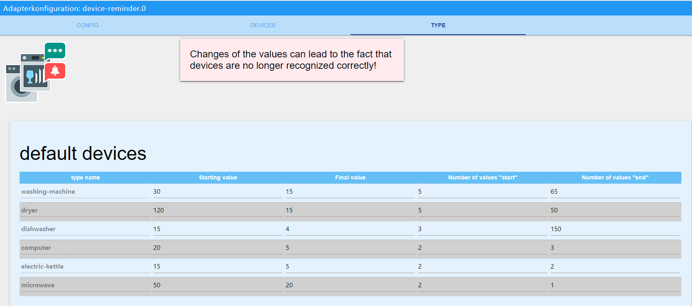

# ioBroker.device-reminder

# Adapter for monitoring the status of devices Version 1.0
This adapter can use measurement sockets to detect whether a device is switched on, in operation or has been switched off and react to this. Messages can then be issued automatically via Telegram, whatsapp, alexa, sayit, pushover and email (multiple selection per device possible). It is also possible to automatically switch off the socket after the process has been completed (also time-delayed).

# What should be considered?
The refresh interval from the "live consumption value (is called **"_energy "**)" for most devices should not be more than 10 seconds, otherwise there may be very delayed messages.
 Command in the Tasmota console : TelePeriod 10
 **Note:**
- Values below 1 watt are considered 0 watts and automatically indicate "**switched off**".
- Values above 1 watt indicate the unit as "**standby**".

# What is possible per unit?
- Notification when the unit starts
- Notification at the end of the operation of the respective device 
- Telegram notification (multiple IDs are possible) 
- Alexa notification (multiple IDs are possible) 
- WhatsApp notification (multiple IDs are possible)
- Pushover notification (multiple IDs are possible)
- Email notification (multiple IDs are possible)
- Notifications can be created freely or also specified by an external script
- Data points with the current status, live consumption and last status message sent, in order to be able to use values from this adapter in other scripts
- Units can be switched off if required (also with a time delay) when the process has been recognised as finished.
- Voice assistants can be temporarily deactivated via data point

# Instruction

## Create device

- **device name**: Freely selectable name
- **device type**: here you have to select which device it is, so that the calculations in the adapter can be carried out correctly.
- **consumption/energy**: Click on the button with the three white dots to open your object management. The data point that displays the **current live consumption** must be selected. 
- **switch on/off**: Clicking on the button with the three white dots opens your object management. The data point that switches your **socket on/off** must be selected (not mandatory).
- Start text**: Notification to be sent when the device is started (special characters are also possible). There must be no "." at the end!
- End text**: Notification to be sent when the unit has finished its operation (special characters are also possible). There must be no "." at the end!

With **Start text** and **End text** you can also get a message from an external data point. This message is read from the data point with a delay of 1 second after the status of the unit has changed. In this way, you can have a message created by an external script. The adapter automatically recognises whether a message comes from a data point or whether it was simply entered manually. To select a data point, simply click on the button with the three white dots and then select the corresponding data point. **Please note**: only either a data point **or** a manually entered message can be used!
 
 

## Create Alexa

- **alexa name**: Freely selectable name, special characters are also possible.
- **alexa "announcement"/"speak "**: The data point that lets your Alexa speak must be selected here. To select the data point, simply click on the button with the three small white dots.
- Volume 0-100**: Volume at which your Alexa should speak (from 0 - 100%).
The last 4 fields can be used to create a time period in which your Alexa is allowed to speak. By default, the period from 00:00 - 23:59 is active.
- **"active from hour "**: Start time in hours
- active from minutes Start time in minutes
- **"inactive from hour "**: End time in hours
- **"inactive from minutes "**: End time in minutes
 
 

## Create SayIt device

- **sayit name**: Freely selectable name, special characters are also possible.
- **sayit path"../text "**: Select the data point "text" in the respective sayIt device folder. The text output is sent here.
- **volume 0-100**: Volume with which your sayIt device should speak (from 0 - 100%).
- **"active from hour "**: Start time in hours
- **"active from minutes "**: Start time in minutes
- **"inactive from hour "**: End time in hours
- **"inactive from minutes "**: End time in minutes
 
 

## Create whatsapp user

- **whatsapp name**: Freely selectable name, special characters are also possible.
- **whatsapp path "sendMessage "**: select the datapoint "sendMessage" in the respective whatsapp folder. The text output is sent here.

## Create pushover user

- **name**: Freely selectable name, special characters are also possible.
- **pushover instance "**: the instance to send to
- **priority**: The priority with which the message is to be sent
- **sound**: The sound to play when Pushover receives the message.

## Create email user

- **name**: Freely selectable name, special characters are also possible.
- **sender address**: Email address from which the email is sent
- **receiver address**: Email address that is to receive the message

# Default devices

These values were determined over a period of several months and with the help of numerous testers. Changes to the values can lead to devices no longer being recorded correctly, resulting in false reports. 

# Custom-devices

These values can be customised by the user and then used. The following is the explanation:

- **starting value**: Start value in watts that must be exceeded for the device to be recognised as started.
- final value**: Final value in watts that must be undershot for the unit to be recognised as finished.
- Number of values "start "**: This indicates how often the "start value" must be exceeded **in succession**. Falling below it once will cause the start to be aborted. The average of these values must be above the start value for the unit to be recognised as started.
*Example: The value should be 10W and be exceeded 3 times in a row. 1. 15W, 2. 1W, 15W => Start phase was aborted because the second value was below 10.
- Number of values "end": This specifies how many values are to be recorded before calculating whether the unit is finished. The fewer values there are here, the less accurate the result and the risk of false reports increases. The higher the value, the more accurate the recording. The disadvantage, however, is that the finished message is sent with a long delay. End is only recognised when "number of values end" is reached and the average consumption is below the "final value".

*Short example calculation
Consumption values come in every 10 seconds. **final value** is set to 50, **values end** to 100. After the unit has been recognised as started, 100 values (*duration 100values x 10 seconds = 1000 seconds*) are recorded and only then is the average value calculated. If this value is below 50, **finished** is recognised after approx. 16.5 minutes (we remember **values end** = 100 values) and a message (if configured) goes out. If the value is above 50, nothing happens because the unit is still in operation. Each additional value now replaces the oldest and a new average is calculated after each new value.
 

# Configure Devices

  
If the "refresh" button is blue, please click on it. Only the devices for which no errors were detected will be displayed.

- **active**: Is activated by default. Here you can temporarily deactivate a device so that it no longer sends notifications.
- **device**: is created automatically
- **Alexa**: all previously created Alexas are listed here and can be added by click
- **sayit**: all previously created sayit devices are listed here and can be added by clicking on them.
- **whatsapp**: all previously created whatsapp users are listed here and can be added by clicking on them
- **pushover**: all previously created pushover users are listed here and can be added by clicking on them.
- **email**: all previously created email users will be listed here and can be added by click
- Telegram**: All available Telegram users are listed here and can be assigned to the device by clicking on them. The respective instance is indicated in the [square] brackets.

    **If no names are displayed:**
    Check whether the entry under "telegram.X.communicate.users" (the X stands for the respective instance, e.g. 0) contains the following structure: "{"ID IN NUMBERS":{"firstName": "User1"}}", if not, this can simply be adapted. The adapter searches for **firstName** as well as **userName**. You can then decide which name to send to. Only either the **firstName** or the **userName** can be selected!

- **switch off**: If selected, the socket switches off automatically after the process has been completed.
- **switch off after minutes**: A timeout in **minutes** can optionally be entered here. After the timeout has expired, the socket is switched off *if auto off is activated*. However, the end notification of the device remains unaffected by a timeout!
- abort detection**: If activated, the adapter tries to detect whether a unit has already been switched off manually before the notification and then no longer notifies.

After clicking on "**Save and close**", a folder is now created under *Objects -> device-reminder* for each newly created device in which 
- the current runtime in hh:mm:ss  
- the current runtime in milliseconds
- the current state of the device
- the current live consumption (is fetched from the *path consumption/energy*) and
- the message to the messenger
- averageConsumption (can be used as an aid to determine your own thresholds)
- do not disturb (if activated, no messages are sent via **voice assistant**)
is displayed.
 

# Support
**If you like my work :**  

 
 
 

## Changelog
<!--
	Placeholder for the next version (at the beginning of the line):
    ### __WORK IN PROGRESS__
-->

### 1.0.2 (2021-01-06)
* (xenon-s) fix name i io-package.json

### 1.0.1 (2021-01-05)
* (xenon-s) bugfix

### 1.0.0 (2021-01-05)
* (xenon-s) initial commit version 1.0

### 0.7.4 (2020-12-20)
* (xenon-s) bugfix: telegram instance was not recognised correctly
* (xenon-s) bugfix: abort detection prevented sending of notifications

### 0.7.1 (2020-12-17)
* (xenon-s) fix telegram bug
* (xenon-s) Deleted incorrect version numbers in the io package

### 0.7.0 (2020-12-10)
* (xenon-s) Data is now queried cyclically

### 0.6.2 (2020-12-04)
* (xenon-s) bugfix index_m

### 0.6.0 (2020-12-03)
* (xenon-s) bugfix: alexa speak-volume when input is empty
* (xenon-s) bugfix: telegram now shows both names, otherwise there were errors in the notifications 
* (xenon-s) add: Device status can now be configured yourself

### 0.5.4 (2020-11-28)
* (xenon-s) calculation optimised, custom / default values may have to be adjusted if they have been changed by the user

### 0.5.0 (2020-11-22)
* (xenon-s) bugfix: volume sayit
* (xenon-s) add: volume alexa
* (xenon-s) DP runtime in milliseconds

### 0.4.10 (2020-11-17)
* (xenon-s) bugfix main.js

### 0.4.0 (2020-11-11)
* (xenon-s) config page revised to simplify the input of devices
* (xenon-s) inserted a break, so that it is recognized, if a device is switched off prematurely at the device switch
* (xenon-s) bugfix: telegram users are not always recognized correctly and displayed incorrectly
* (xenon-s) adjustable values inserted at "Type
* (xenon-s) readme extended and adapted

### 0.3.0 (2020-11-07)
* (xenon-s) standby detection, even if the power outlet should not be switched off
* (xenon-s) It is now possible to get messages from an external data point and send them as start / end message
* (xenon-s) device "microwave" added

### 0.2.1 (2020-11-05)
* (xenon-s) readme adapted

### 0.2.0 (2020-11-05)
* (xenon-s) update to version 0.2: index_m completely revised and whatsapp added

### 0.1.0 (2020-10-23)
* (xenon-s) beta release

### 0.0.1 (2020-10-20)
* (xenon-s) initial commit

## License

MIT License

Copyright (c) 2020 xenon-s

Permission is hereby granted, free of charge, to any person obtaining a copy
of this software and associated documentation files (the "Software"), to deal
in the Software without restriction, including without limitation the rights
to use, copy, modify, merge, publish, distribute, sublicense, and/or sell
copies of the Software, and to permit persons to whom the Software is
furnished to do so, subject to the following conditions:

The above copyright notice and this permission notice shall be included in all
copies or substantial portions of the Software.

THE SOFTWARE IS PROVIDED "AS IS", WITHOUT WARRANTY OF ANY KIND, EXPRESS OR
IMPLIED, INCLUDING BUT NOT LIMITED TO THE WARRANTIES OF MERCHANTABILITY,
FITNESS FOR A PARTICULAR PURPOSE AND NONINFRINGEMENT. IN NO EVENT SHALL THE
AUTHORS OR COPYRIGHT HOLDERS BE LIABLE FOR ANY CLAIM, DAMAGES OR OTHER
LIABILITY, WHETHER IN AN ACTION OF CONTRACT, TORT OR OTHERWISE, ARISING FROM,
OUT OF OR IN CONNECTION WITH THE SOFTWARE OR THE USE OR OTHER DEALINGS IN THE
SOFTWARE.