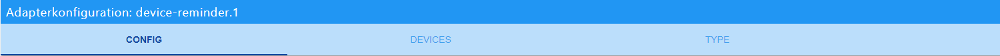

# ioBroker.device-reminder

## German readme needed?   [German readme](https://github.com/Xenon-s/ioBroker.device-reminder/blob/master/README_GER.md)
 

## Adapter for monitoring device statuses
This adapter can detect whether a device has been switched on, in operation or switched off by means of measuring sockets and react to this. Messages can then be output automatically via telegram, whatsapp, alexa and sayit (multiple selection per device possible). It is also possible to switch off the socket automatically after the process is finished (also time-delayed). (previous project from which this adapter was developed: https://github.com/Xenon-s/js.device-reminder)

## What should be considered?
The refresh interval from the "live consumption value (means **"_energy "**)" for most devices should not be more than 10 seconds, otherwise there may be very delayed messages.
 command in the Tasmota console : TelePeriod 10
 **Note:**
- Values below 1 watt are considered 0 watts and automatically indicate "**switched off**".
- Values above 1 watt indicate the unit as "**standby**".

## Which devices can be monitored at the moment?
There are default values for the following devices:
- washing machine,
- dryer,
- dishwasher,
- electric kettle,
- computer,
- microwave
These values were determined over months and should fit most devices.
 
In addition 5 custom devices are available. These can be configured by the user if required. The threshold values of all device types can also be adjusted manually.
 

## What is possible per device?
- Notification at device startup
- Notification at the end of each device startup 
- Telegram notification (multiple IDs are possible) 
- Alexa notification (multiple IDs are possible) 
- WhatsApp notification multiple IDs are possible)
- Notifications can be created freely or can be predefined by an external script
- Data points with the current state, live consumption and last sent status message, to use values from this adapter in other scripts
- Switch off devices if necessary (also time-delayed), when process has been recognized as finished 
 
 

# Instructions

First of all, all desired Devices, Alexas, etc. must be created in the Config before they can be used. When all entries are complete, you have to click on **"click here to reload "**. Only then the devices are really created and can be further configured in the tab "**DEVICES**".

## create device
First a new entry must be created using the **"+ add device "**. This creates the following table row:

- **device name**: Freely selectable name
- **device type**: here you have to select which device it is, so that the calculations in the adapter can be executed correctly
- **path consumption/energy**: Click on the button with the three white dots to open your object management. You have to select the datapoint that shows the **current live consumption**.
- **path switch on/off**: Click on the button with the three white dots to open your object management. You have to select the data point that switches your **socket on/off** (not mandatory)
- **Start text**: Notification to be sent when the device is started (special characters are also possible). There must be no "." at the end of the text !
- **End text**: Notification to be sent when the device has finished its process (special characters are also possible). There must be no "." at the end of the text !
With **start text** and **end text** you can also get a message from an external data point. This message is read from the data point with a 1 second delay after the status of the device has changed. So you can have a message created by an external script. The adapter automatically detects if a message comes from a data point or if it was simply entered manually. To select a data point, simply click on the button with the three white dots and then select the corresponding data point. **Please note**: only either a data point **or** a manually entered message can be used!
 
 

## Create Alexa

First a new entry must be created using the **"+ add alexa device "**. This creates the following table row:

- **alexa name**: Freely selectable name, also special characters are possible
- **alexa "announcement"/"speak "**: Here you **must** select the datapoint that makes your Alexa speak. To select the datapoint, just click on the button with the three little white dots.
- **volume 0-100**: *optional* here you can set a volume (default: 50). Values between 0 and 100 are possible.
The last 4 fields can be used to create a period of time during which your Alexa is allowed to speak. By default, the time period from 00:00 - 23:59 is active.
- **"time active hour "**: Start time in hours
- **"time active min "**: Start time in minutes
- "time inactive hour": End time in hours
- **"time inactive min "**: End time in minutes
 
 

## Create SayIt device

First you have to create a new entry with the **"+ add sayit device "**. This creates the following table row:

- **sayit name**: Freely selectable name, also special characters are possible
- **sayit path"../text "**: select the datapoint "text" in the respective sayIt device folder. The text output will be sent to this folder.
- **volume 0-100**: *optional* here you can set a volume (default: 50). Values between 0 and 100 are possible.
- **"time active hour "**: Start time in hours
- **"time active min "**: Start time in minutes
- "time inactive hour": End time in hours
- **"time inactive min "**: End time in minutes
 
 

## create whatsapp user

First you have to create a new entry with the **"+ add whatsapp user "**. This creates the following table line:

- **whatsapp name**: Freely selectable name, also special characters are possible
- **whatsapp path "sendMessage "**: select the datapoint "sendMessage" in the respective whatsapp folder Here the text output will be sent.
 
 

## save config
When all devices and messengers have been inserted, you have to save by pressing the Save button **click here to reload** on the page! This will update the table in the tab "**devices**". Because there were problems with the display, the table is generated with a small delay.  
*Note:* If you change the name of an existing device and then click on the **click here to reload** button, the device will be recreated in the table and must be configured accordingly (assign alexa, etc).

  
The button is only active when new devices are inserted or existing ones are changed!
 
 

# Configure Devices

## configure your own device status

- **in action**: Status to be displayed when the device is operating.
- **in standby**: Status to be displayed when the device is in standby.
- **device off**: Status to be displayed when the device is turned off.

## configure device

After clicking on the button "**click here to reload**" on the Config page, all created devices are displayed and can be further configured.

- **active**: Is activated by default. Here you can deactivate a device temporarily, so that it doesn't send any notifications anymore
- **device name**: is created automatically
- **Alexa devices**: all previously created alexas are listed here and can be added by clicking
- **sayit ID**: all previously created sayit devices are listed here and can be added by clicking
- **whatsapp User**: all previously created whatsapp users are listed here and can be added by clicking
- **Telegram username**: Here all available Telegram Users are displayed and can be assigned to the device by clicking on them. The respective instance is indicated in the [square] brackets.

    **If no names should be displayed:**
    Check, if the entry under "telegram.X.communicate.users" (the X stands for the respective instance, e.g. 0) contains the following structure: "{"ID IN NUMBERS":{"firstName": "User1"}}", if not it can be easily adjusted. The adapter searches for both **firstName** and **userName**. You can decide which name you want to use. Only either the **firstName** or the **userName** can be selected!

- **auto off**: If selected, the power outlet will automatically switch off after the process is finished
- **timer**: Here you can optionally enter a timeout in **minutes**. After the timeout has expired, the power outlet will be switched off *if auto off is activated*. The end notification of the device is not affected by a timeout!
- **abort detection**: If activated, the adapter tries to detect whether a device has already been switched off manually before the notification and then no longer reports.

After clicking on "**Save and close**", a folder is now created under *Objects -> device-reminder* for each newly created Device, in which 
- the current runtime in hh:mm:ss  
- the current runtime in milliseconds
- the current state of the device
- the current live consumption (fetched from the *path consumption/energy*) and
- the message to the messengers
- averageConsumption (Can be used as an aid to determine your own threshold values)
- do not disturb (If activated, no messages are sent via **voice assistant**.)
is displayed.
 
 

# configure device type

**Attention**: Changes of the values can lead to the fact that devices are no longer recorded correctly and thus false messages can occur. 

In the first table the "default" values are displayed. These values were determined over a period of several months and should not be adjusted. Nevertheless I explain the meaning of the single values.
- **starting value**: Start value in watt that must be exceeded to recognize the device as started
- **final value**: Final value in Watt which must be underrun, so that the device can be recognized as finished
- Number of values "start "**: Here you specify how often the "start value" **must be exceeded **in sequence**. If the value falls below this value once, the start is aborted. The average of these values must be above the start value to be recognized as started.
*Example: The value should be 10W and be exceeded 3 times in a row. 1. 15W, 2. 1W, 15W => start phase was aborted because the second value was below 10.*.
- Number of values "end "**: Here is indicated, how many values are to be recorded, before it is calculated, whether the device is finished. The less values are listed here, the more inaccurate the result is and the danger of false messages increases. The higher the value, the more accurate the recording. The disadvantage, however, is that the finished message is sent with a long delay. End is only recognized when "number of values end" is reached and the average consumption is below the "final value".
 
 

*Short example calculation:*
Consumption values come in every 10 seconds. **final value** is set to 50, **values end** to 100. 100 values (*lasts 100 values x 10 seconds = 1000 seconds*) are recorded after the device has been recognized as started and only then the average value is calculated. If the average is below 50, after about 16.5 minutes (we remember **values end** = 100 values) **finished** is recognized and a message (if configured) is sent out. If the value is above 50, nothing happens, because the device is still in operation. Every further value now replaces the oldest and a new average is calculated after every new value.
 
 

If you have read so far and still think that you need custom values, there are **5 Custom Types** available for free design.
custom-devices.png](admin/custom-devices.png)

To find out more about the function, simply read about it here at "**default devices**".

# Support
**If you like my work :**  

 
 
 

## Changelog
<!--
	Placeholder for the next version (at the beginning of the line):
    ### __WORK IN PROGRESS__
-->

### 0.7.4 (2020-12-20)
* (xenon-s) bugfix: telegram instance was not recognised correctly
* (xenon-s) bugfix: abort detection prevented sending of notifications

### 0.7.1 (2020-12-17)
* (xenon-s) fix telegram bug
* (xenon-s) Deleted incorrect version numbers in the io package

### 0.7.0 (2020-12-10)
* (xenon-s) Data is now queried cyclically

### 0.6.2 (2020-12-04)
* (xenon-s) bugfix index_m

### 0.6.0 (2020-12-03)
* (xenon-s) bugfix: alexa speak-volume when input is empty
* (xenon-s) bugfix: telegram now shows both names, otherwise there were errors in the notifications 
* (xenon-s) add: Device status can now be configured yourself

### 0.5.4 (2020-11-28)
* (xenon-s) calculation optimised, custom / default values may have to be adjusted if they have been changed by the user

### 0.5.0 (2020-11-22)
* (xenon-s) bugfix: volume sayit
* (xenon-s) add: volume alexa
* (xenon-s) DP runtime in milliseconds

### 0.4.10 (2020-11-17)
* (xenon-s) bugfix main.js

### 0.4.0 (2020-11-11)
* (xenon-s) config page revised to simplify the input of devices
* (xenon-s) inserted a break, so that it is recognized, if a device is switched off prematurely at the device switch
* (xenon-s) bugfix: telegram users are not always recognized correctly and displayed incorrectly
* (xenon-s) adjustable values inserted at "Type
* (xenon-s) readme extended and adapted

### 0.3.0 (2020-11-07)
* (xenon-s) standby detection, even if the power outlet should not be switched off
* (xenon-s) It is now possible to get messages from an external data point and send them as start / end message
* (xenon-s) device "microwave" added

### 0.2.1 (2020-11-05)
* (xenon-s) readme adapted

### 0.2.0 (2020-11-05)
* (xenon-s) update to version 0.2: index_m completely revised and whatsapp added

### 0.1.0 (2020-10-23)
* (xenon-s) beta release

### 0.0.1 (2020-10-20)
* (xenon-s) initial commit

## License

MIT License

Copyright (c) 2020 xenon-s

Permission is hereby granted, free of charge, to any person obtaining a copy
of this software and associated documentation files (the "Software"), to deal
in the Software without restriction, including without limitation the rights
to use, copy, modify, merge, publish, distribute, sublicense, and/or sell
copies of the Software, and to permit persons to whom the Software is
furnished to do so, subject to the following conditions:

The above copyright notice and this permission notice shall be included in all
copies or substantial portions of the Software.

THE SOFTWARE IS PROVIDED "AS IS", WITHOUT WARRANTY OF ANY KIND, EXPRESS OR
IMPLIED, INCLUDING BUT NOT LIMITED TO THE WARRANTIES OF MERCHANTABILITY,
FITNESS FOR A PARTICULAR PURPOSE AND NONINFRINGEMENT. IN NO EVENT SHALL THE
AUTHORS OR COPYRIGHT HOLDERS BE LIABLE FOR ANY CLAIM, DAMAGES OR OTHER
LIABILITY, WHETHER IN AN ACTION OF CONTRACT, TORT OR OTHERWISE, ARISING FROM,
OUT OF OR IN CONNECTION WITH THE SOFTWARE OR THE USE OR OTHER DEALINGS IN THE
SOFTWARE.
