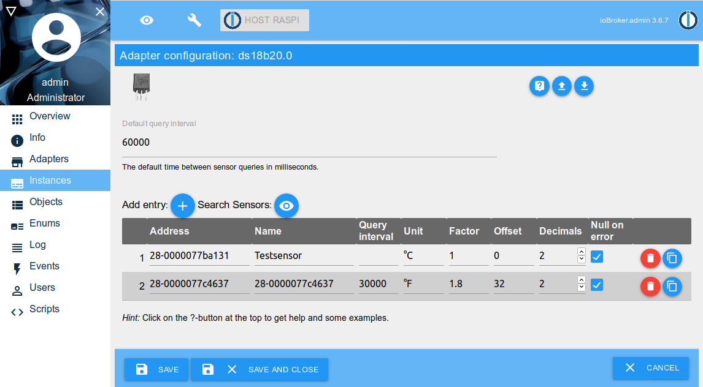
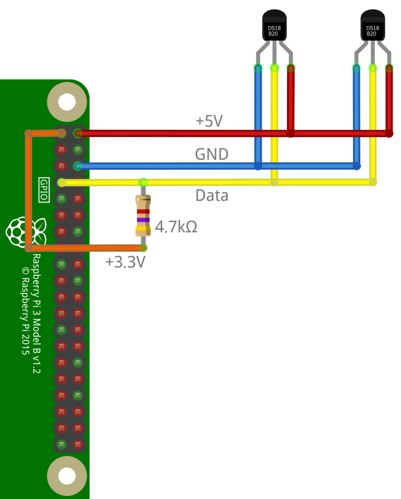

# ioBroker.ds18b20

The adapter `ds18b20` enables the direct integration of 1-wire temperature sensors of the type DS18B20 into ioBroker.

An appropriate hardware with support for the 1-wire bus is required (e.g. Raspberry Pi). Also the 1-wire bus must be properly functional on the system (sensors listed in `/sys/bus/w1/devices/`).


An example of the connection of DS18B20 sensors to a Raspberry Pi can be found below.


## Features

* Read the current temperature value
* Auto detect of the connected sensors
* Detection of errors while reading a sensor (checksum, communication error, device disconnected)
* Query interval customizable per sensor
* Rundung und Umrechnung des gemessenen Wertes pro Sensor anpassbar
* Rounding and conversion of the measured value customizable per sensor

## Installation

The adapter is currently available in the latest repository.

Alternatively, it be installed using the URL `https://github.com/crycode-de/ioBroker.ds18b20.git`.


## Configuration

In the adapter configuration, a **Default query interval** can be specified in milliseconds for all sensors. Minimum is 500.

The sensors can be added to a table manually or by **Search Sensors**.



The **Address** is the 1-wire address/ID of the sensor and determines the object ID.
As an example, a sensor with the address `28-0000077ba131` gets the object ID `ds18b20.0.sensors.28-0000077ba131`.

The **Name** is used to identity the sensor. It's freely selectable by you.

For each sensor a custom **Query interval** may be specified in milliseconds.
If this field is left blank, the default query interval will be used.
Minimum is 500.

The **Unit** defines the stored unit in the ioBroker object for the value.
Default is `°C`.

Via **Factor** and **Offset** it is possible to adjust the value read by the sensor according to the formula `value = (value * factor) + offset`.

The **Decimals** indicate how many places after the decimal point the value is rounded.
The rounding takes place after the calculation with factor and offset.

**Null on error** defines how sensor read errors are handled.
If this option is set, a `null` value be written to the sensor state on error.
If unset, the state will not be updated on errors.


### Conversion from `°C` to `°F`

To get the temperatures from the adapter in `°F` you need to use `1.8` as factor and `32` as offset.


## Actions

It is possible to trigger the instant reading of one or all sensors by writing to the state `ds18b20.0.actions.readNow`.

To trigger the reading of all sensors, write `all` to the state.

To tirgger the reading of a single sensor, write the address or ioBroker object ID of the sensor to the state.


## Using in scripts

It is possible to send commands to the adapter to read from the sensors or search for sensors.

### `readNow`

Using the commans `readNow` you can trigger the instant reading of one or all sensors.
To read all sensors, the message part can be empty or set to the string `all`.
To read a single sensor, the message part must be set to the address or ioBroker object ID of the sensor.

The commant `readNow` returns no data. It will only trigger the reading of the sensors.

```js
sendTo('ds18b20.0', 'readNow');
sendTo('ds18b20.0', 'readNow', '28-0000077ba131');
```

### `read`

Via the command `read`, a single sensor can be read.
The message part must be set to the address or ioBroker object ID of the sensor.
The value can be processed by a callback function.

```js
sendTo('ds18b20.0', 'read', '28-0000077ba131', (ret) => {
    log('ret: ' + JSON.stringify(ret));
    if (ret.err) {
        log(ret.err, 'warn');
    }
});
```

### `search`

The `search` command will run a search for all currently connected 1-wire sensors.
The found addresses of sensors will be provided to a callback function.

```js
sendTo('ds18b20.0', 'search', {}, (ret) => {
    log('ret: ' + JSON.stringify(ret));
    if (ret.err) {
        log(ret.err, 'warn');
    } else {
        for (let s of ret.sensors) {
            log('Sensor: ' + s);
        }
    }
});
```


## Adapter information
Via the `ds18b20.*.info.connection` State, each adapter instance provides information on whether all configured sensors provide data.
If the last reading of all sensors was successful, this state is `true`.
As soon as one of the sensors has an error, this state is `false`.


## DS18B20 connected to a Raspberry Pi

The connection of DS18B20 temperature sensors to a Raspberry Pi is done as shown in the following figure.
Note that the pullup resistor must be connected to +3.3V instead of +5V, as this would damage the GPIO.
In this example the GPIO.04 (BCM) is used.



To activate the 1-Wire bus on the Raspberry Pi, add the following line in the file `/boot/config.txt` and then restart the Raspberry Pi.
```
dtoverlay=w1-gpio,gpiopin=4
```

If everything works, the connected sensors will be visible under `/sys/bus/w1/devices/`.
```
$ ls -l /sys/bus/w1/devices/
total 0
lrwxrwxrwx 1 root root 0 Nov  2 11:18 28-0000077b4592 -> ../../../devices/w1_bus_master1/28-0000077b4592
lrwxrwxrwx 1 root root 0 Nov  2 11:18 28-0000077b9fea -> ../../../devices/w1_bus_master1/28-0000077b9fea
lrwxrwxrwx 1 root root 0 Nov  2 10:49 w1_bus_master1 -> ../../../devices/w1_bus_master1
```

## Changelog
### 1.1.1 (2020-01-09)
* (Peter Müller) Fixed wrong communication errror detection on some sensors.

### 1.1.0 (2019-11-11)
* (Peter Müller) Own implementation of reading the sensor data.
* (Peter Müller) Fixed bug on decimals rounding.
* (Peter Müller) 1-wire devices path is now configurable.

### 1.0.3 (2019-11-03)
* (Peter Müller) Added documentation about DS18B20 at a Raspberry Pi; Dependencies updated

### 1.0.2 (2019-10-07)
* (Peter Müller) Display error message when tried to search for sensors without adapter running.

### 1.0.1 (2019-10-01)
* (Peter Müller) Type changed to hardware, Renamed command, Added missing documentation

### 1.0.0 (2019-09-09)
* (Peter Müller) initial release

## License

Copyright (c) 2019 Peter Müller <peter@crycode.de>

### MIT License

Permission is hereby granted, free of charge, to any person obtaining
a copy of this software and associated documentation files (the
"Software"), to deal in the Software without restriction, including
without limitation the rights to use, copy, modify, merge, publish,
distribute, sublicense, and/or sell copies of the Software, and to
permit persons to whom the Software is furnished to do so, subject to
the following conditions:

The above copyright notice and this permission notice shall be
included in all copies or substantial portions of the Software.

THE SOFTWARE IS PROVIDED "AS IS", WITHOUT WARRANTY OF ANY KIND,
EXPRESS OR IMPLIED, INCLUDING BUT NOT LIMITED TO THE WARRANTIES OF
MERCHANTABILITY, FITNESS FOR A PARTICULAR PURPOSE AND
NONINFRINGEMENT. IN NO EVENT SHALL THE AUTHORS OR COPYRIGHT HOLDERS BE
LIABLE FOR ANY CLAIM, DAMAGES OR OTHER LIABILITY, WHETHER IN AN ACTION
OF CONTRACT, TORT OR OTHERWISE, ARISING FROM, OUT OF OR IN CONNECTION
WITH THE SOFTWARE OR THE USE OR OTHER DEALINGS IN THE SOFTWARE.