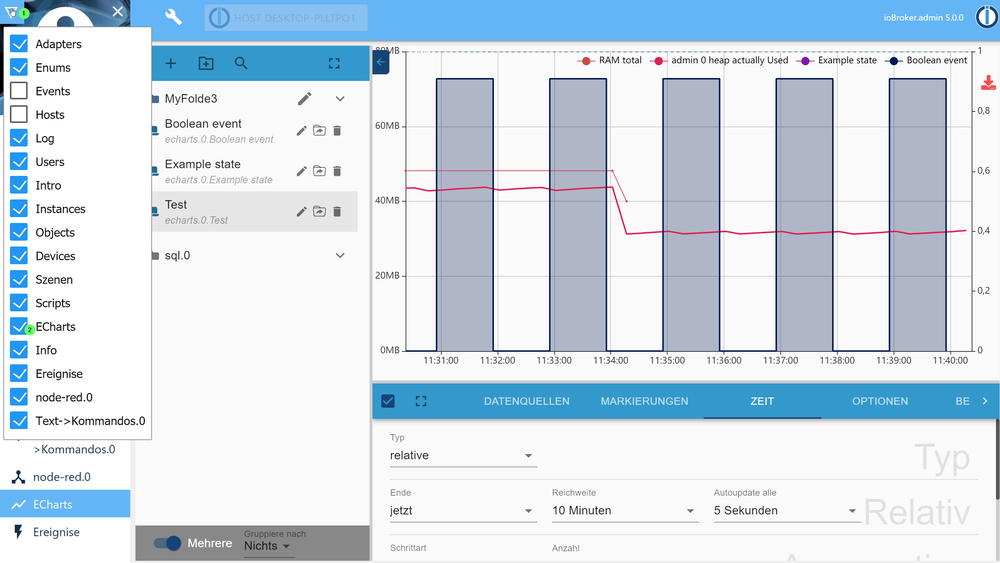

# ioBroker.echarts

[](https://www.npmjs.com/package/iobroker.echarts)
[](https://www.npmjs.com/package/iobroker.echarts)
[](https://david-dm.org/ioBroker/iobroker.echarts)
[](https://snyk.io/test/github/ioBroker/ioBroker.echarts)

[](https://nodei.co/npm/iobroker.echarts/)

## echarts adapter for ioBroker
Build useful charts in ioBroker:


## Usage
Add after restart the tab in admin:


### Server side rendering
You can render the presets on server and get it as base64 URL or save it on disk on in ioBroker DB:

```
sendTo('echarts.0', {
    renderer: 'svg',         // svg | png | jpg | pdf, default: svg
    width: 1024,             // default 1024
    height: 300,             // default 300
    height: 300,             // default 300
    title: 'ioBroker Chart', // Title of PDF document 
    quality: 0.8,            // quality of JPG
    compressionLevel: 3,     // Compression level of PNG
    filters: 8,              // Filters of PNG (Bit combination https://github.com/Automattic/node-canvas/blob/master/types/index.d.ts#L10)
    fileOnDisk: '',          // Path on disk to save the file
    fileName: '',            // Path in ioBroker DB to save the files on 'echarts.0',
    background: '',          // Background color
    theme: 'light',          // Theme type: 'light', 'dark'
}, result => {
    if (result.error) {
        console.error(result.error);
    } else {
        console.log(result.data);
    }
});
```

## Developer manual
You can debug view charts locally with: 
- cd iobroker.echarts/src-chart
- npm run start
- Browser: http://localhost:8081/adapter/echarts/tab.html?dev=true

## Todo
- widget for vis (button)
- widget for material
- show enum icons on folders or near it

<!--
	Placeholder for the next version (at the beginning of the line):
	### __WORK IN PROGRESS__
-->
## Changelog
### 0.3.1 (2020-10-31)
* (bluefox) Added the color of export button 
* (bluefox) The interpolated values are shown now
* (bluefox) Server-side rendering is implemented

### 0.2.1 (2020-10-25)
* (bluefox) GUI fixes

### 0.2.0 (2020-10-22)
* (bluefox) Implemented the grouping by category.

### 0.1.2 (2020-10-21)
* (bluefox) Added support of multiple charts

### 0.1.1 (2020-10-21)
* (bluefox) initial release

## License
MIT License

Copyright (c) 2019-2020 bluefox <dogafox@gmail.com>

Permission is hereby granted, free of charge, to any person obtaining a copy
of this software and associated documentation files (the "Software"), to deal
in the Software without restriction, including without limitation the rights
to use, copy, modify, merge, publish, distribute, sublicense, and/or sell
copies of the Software, and to permit persons to whom the Software is
furnished to do so, subject to the following conditions:

The above copyright notice and this permission notice shall be included in all
copies or substantial portions of the Software.

THE SOFTWARE IS PROVIDED "AS IS", WITHOUT WARRANTY OF ANY KIND, EXPRESS OR
IMPLIED, INCLUDING BUT NOT LIMITED TO THE WARRANTIES OF MERCHANTABILITY,
FITNESS FOR A PARTICULAR PURPOSE AND NONINFRINGEMENT. IN NO EVENT SHALL THE
AUTHORS OR COPYRIGHT HOLDERS BE LIABLE FOR ANY CLAIM, DAMAGES OR OTHER
LIABILITY, WHETHER IN AN ACTION OF CONTRACT, TORT OR OTHERWISE, ARISING FROM,
OUT OF OR IN CONNECTION WITH THE SOFTWARE OR THE USE OR OTHER DEALINGS IN THE
SOFTWARE.