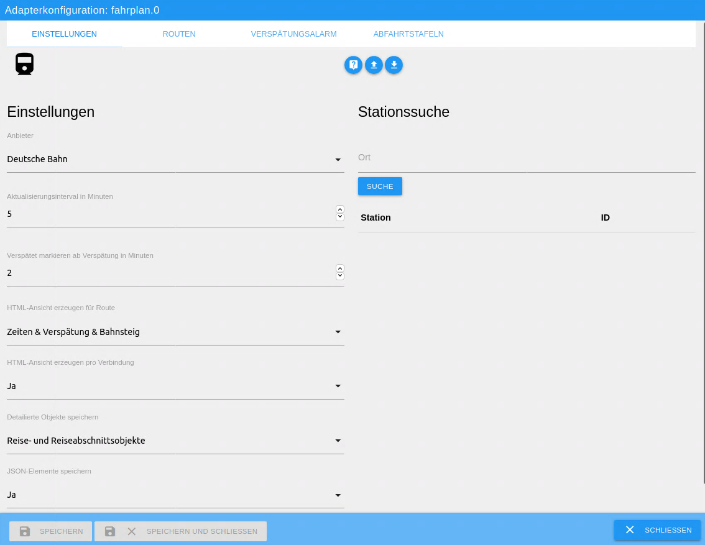

# ioBroker.fahrplan

## Fahrplan Adapter für ioBroker

### Deutsch
Dieser Adapter für ioBroker verwendet die mobile API von HAFAS verwendet. HAFAS steht für HaCon Fahrplan-Auskunfts-System und wird von vielen europäischen Verkehrsunternehmen verwendet, unter anderem auch von der Deutschen Bahn.
Der Zugriff auf HAFAS erfolgt hierbei über [HAFAS-Client](https://github.com/public-transport/hafas-client).

Der Adapter bietet hierbei drei Funktionen:

#### Fahrplan für Verbindungen (Routen)
Die gewünschten Routen müssen in der Adapterkonfiguration eingerichtet und aktiviert werden.
Über einen konfigurierbaren Intervall ruft der Adapter dann regelmäßig die Verbindungsinformationen ab.
Die nächsten drei Verbindungen werden als HTML und optional auch detailiert als Objekte in ioBroker dargestellt.
Das HTML-Objekt kann einfach in VIS eingebunden werden.

#### Benachrichtigung bei Verspätungen der Routen
Für die konfigurierten Routen kann ein Verspätungsalarm aktiviert werden. So kann beispielsweise eine Benachrichtigung via Telegram oder Alexa erfolgen, falls alle oder eine bestimmte Verbindung verspätet ist.

#### Abfahrtstafeln für Stationen
Zusätzlich bietet der Adapter eine Abfahrtstafel für konfigurierte Stationen.
Hierbei werden die nächsten drei Abfahrten einer Station abgerufen und als Objekte und HTML dargestellt.

**Dieser Adapter verwendet die Sentry Bibliotheken um automatisch Abstürze und Programmfehler an die Entwickler zu übermitteln.** 
Weitere Details und für Informationen zur Deaktivierung der Fehlerberichterstattung in der [Sentry-Plugin Dokumentation](https://github.com/ioBroker/plugin-sentry#plugin-sentry)! Sentry Reporting wird ab JS-Controller 3.0 verwendet.

### English
This adapter for ioBroker uses the mobile API of HAFAS. HAFAS is a public transport management system used by public transport providers across Europe, e.g. Deutsche Bahn.
[HAFAS-Client](https://github.com/public-transport/hafas-client) is used to access HAFAS.

The adapter provides three functions:

#### Timetable for Connections (Routes)
The desired routes has to be configured and enabled in the adapter configuration.
The Adapter retrieves the connection information by a configured interval automatically.
The next three connections are saved in ioBroker as HTML and optional as detailed objects.
The HTML-object could easily be used in VIS.

#### Notification for delays on routes
A delay notification can be activated for configured routes. For example, there can be a notification by Telegram or Alexa when all or one specific connection is delayed.

#### Departure timetable for stations
Additionally the Adapter provides a departure timetable for configured stations.
Here the next three connections are reveived and created as objects and HTML.

**This adapter uses Sentry libraries to automatically report exceptions and code errors to the developers.** 
For more details and for information how to disable the error reporting see [Sentry-Plugin Documentation](https://github.com/ioBroker/plugin-sentry#plugin-sentry)! Sentry reporting is used starting with js-controller 3.0.

## Konfiguration

### Deutsch

Die Start- und Zielorte sowie Zwischenziele müssen mit ihrer numerischen ID angegeben werden.
Eine Suchfunktion ist im Tab Einstellungen integriert.

#### Tab Einstellungen

| Einstellung                  | Beschreibung
|------------------------------|---
| Anbieter                     |  Auswahl des zu verwendenden Anbieters, aktuell DB und ÖBB
| Aktualisierungsintervall     |  Intervall in dem die Route aktualisiert werden, Angabe in Minuten
| Verspätet markieren ab       |  Verspätung in Minuten ab der die Verbindung als verspätet markiert wird. Standardmäßig werden nur Verspätungen ab zwei Minuten markiert
| HTML-Ansicht erzeugen        |  Erzeugt pro Route eine konfigurierbare HTML-Tabelle in einem Objekt
| Detailierte Objekte speichern|  Konfiguration der auszugebenden Objekte
| JSON-Elemente speichern      |  Die Rückgabe von HAFAS erfolgt als JSON, diese sollten zur Fehlerbehebung gespeichert werden

Auf der rechten Seite ist die Suchfunktion integriert. Zuerst muss ein Anbieter ausgewählt werden.
Danach kann über das Suchfeld und Drücken des Knopfs "Suche" nach einer Station gesucht werden.
Die Suchergebnisse der aktuellen Suche werden in der Tabelle angezeigt.

#### Tab Routen

Mit dem +-Button können neue Einträge zur Tabelle hinzugefügt werden.

| Einstellung                 | Beschreibung
|-----------------------------|---
| Nr                          | Die Nummer entspricht dem Unterknoten in den Objekten und wird automatisch vergeben.
| Aktiv                       | Wenn die Route aktiviert ist werden die Verbindungsinfos aktualisiert
| Von                         | Numerische ID von Startbahnhof oder Starthaltestelle (Ermittlung über Suche)
| Von (Eigener Name)          | Benutzerdefinierter Name von Startbahnhof oder Starthaltestelle, für HTML- und Verspätungstext verwendet
| Nach                        | Numerische ID von Zielbahnhof oder Zielhaltestelle (Ermittlung über Suche)
| Nach (Eigener Name)         | Benutzerdefinierter Name von Zielbahnhof oder Zielhaltestelle, für HTML- und Verspätungstext verwendet
| Via 1                       | Fahrt über bestimmten Ort angegeben als numerische ID (optional, sonst leer)
| Via 2                       | Fahrt über bestimmten Ort angegeben als numerische ID (optional, sonst leer)
| Verkehrsmittel              | Auswahl des Verkehrsmittels, z.B. Bus, S-Bahn, usw. Standardmäßig werden alle Verkehrsmittel ausgewählt
| Max. Umstiege               | Maximale Anzahl an Umstiegen. 0 für nur direkte Verbindungen.
| Abfahrten                   | Anzahl abzurufender Fahrten
| Fahrradmitnahme             | Nur Verbindungen mit Fahrradmitnahme auswählen

#### Tab Verspätungsalarm

Mit dem +-Button können neue Einträge zur Tabelle hinzugefügt werden.

| Einstellung                 | Beschreibung
|-----------------------------|---
| Nr                          | Die Nummer entspricht dem Unterknoten in den Objekten und wird automatisch vergeben.
| Aktiv                       | Wenn der Verspätungsalarm aktiviert ist wird dieser geprüft
| Route                       | Route auf die sich der Alarm beziehen soll
| Geplante Abfahrt            | Geplante Abfahrtszeit der zu prüfenden Route (Leer = Alle Verbindungen)
| Wochentag                   | Wochentage an denen die Prüfung erfolgen soll
| Benachrichtigung in Minuten | Anzahl der Minuten vor der Abfahrt, in denen benachrichtigt werden soll
| Objekt für Ausgabetext      | Angabe eines vorhandenen Objekts

Hinweis zum Ausgabetext: Hier kann neben einfachen Objekten für VIS z.B. auch das "speak"-Objekt des Alexa-Adapters oder das "reponse"-Objekt des Telegram-Adapters verwendet werden.

#### Tab Abfahrtstafeln

Mit dem +-Button können neue Einträge zur Tabelle hinzugefügt werden.

| Einstellung                 | Beschreibung
|-----------------------------|---
| Nr                          | Die Nummer entspricht dem Unterknoten in den Objekten und wird automatisch vergeben.
| Aktiv                       | Wenn der Eintrag aktiviert ist wird dieser abgerufen
| Von                         | Numerische ID von Startbahnhof oder Starthaltestelle (Ermittlung über Suche)
| Von (Eigener Name)          | Benutzerdefinierter Name von Startbahnhof oder Starthaltestelle, für HTML-Ausgabe verwendet
| Abfahrten                   | Anzahl abzurufender Abfahrten

### English

Start and Desination and stopovers has to be identified with a numeric id.
Search function for theses IDs is integrated in Tab Settings.

#### Tab Settings

| Setting                     | Description
|-----------------------------|---
| Provider                    |  Selection of public transport provider, currently DB und ÖBB
| Update interval             |  Interval for updates of the routes in minutes
| Mark delayed after Delay in |  Define minutes after a delay should be marked as delay, per default a delay is marked when the delay is larger than one minute
| Create HTML view            |  Creates per route a configurable HTML table in an object
| Save detailed objects       |  Configuration of output objects
| Save JSON elements          |  Return from HAFAS is JSON, should be saved for troubleshooting

#### Tab Routes

With +-Button new entries can be added to the table.

| Setting                     | Description
|-----------------------------|---
| Nr                          | The number match the subnode in objects and is assigned automatically
| Activ                       | Connection information is updated when route is activ
| From                        | Numeric ID of start station oder start stop
| From (Custom name)          | Custom name for start station oder start stop, used in HTML- and delay notification output
| To                          | Numeric ID of destination station oder destination stop
| From (Custom name)          | Custom name for destination station oder destination stop, used in HTML- and delay notification output
| Via 1                       | Ride over special station as numeric ID (optional, empty per default)
| Via 2                       | Ride over special station as numeric ID (optional, empty per default)
| Vehicle                     | Selection of vehicle, e.g. Bus, S-Bahn, etc. Per default all vehicles are selected
| Max. transfers              | Maximum transfers on route, 0 for direct connections only
| Departures                  | Number of departures to receive
| Bycicle                     | Select only connections where bycicles allowed

#### Tab Delay alarm

With +-Button new entries can be added to the table.

| Einstellung                 | Beschreibung
|-----------------------------|---
| Nr                          | The number match the subnode in objects and is assigned automatically
| Activ                       | Check for delay alarm is activated
| Route                       | Route concerning this delay alarm
| Planned Departure           | Planned departure of connection to be checked (Empty = All Routes)
| Weekdays                    | Weekdays when connection should be checked
| Notification in minutes     | Minutes before departure when delay alarm is active
| Object for output text      | ioBroker state for text output

Hint for "Object for output text": Simple states for usage in VIS could be used, but also "speak"-state of Alexa adapter or "response"-state of Telegram adapter.

#### Tab Departure Timetables

With +-Button new entries can be added to the table.

| Setting                     | Description
|-----------------------------|---
| Nr                          | The number match the subnode in objects and is assigned automatically
| Activ                       | Connection information is updated when item is activ
| From                        | Numeric ID of start station oder start stop
| From (Custom name)          | Custom name for start station oder start stop, used in HTML- and delay notification output
| Departures                  | Number of departures to receive

## Changelog

<!--
	Placeholder for the next version (at the beginning of the line):
	### __WORK IN PROGRESS__
-->

### 0.2.1 (2020-11-09)
* (Gaudes) Configurable number of journeys in routes
* (Gaudes) Configurable number of departures in departure timetable
* (Gaudes) Show product in departure timetable
* (Gaudes) Fix platform handling in departure timetable
* (Gaudes) Include Sentry error reporting
* (Gaudes) Update Adapter template from 1.27.0 to 1.29.0
* (Gaudes) Include Dependabot updates

### 0.2.0 (2020-09-23)
* (Gaudes) Include Departure Timetable for configured stations
* (Gaudes) Security fix for serialize-javascript
* (Gaudes) Enhanced error handling and preparation for Sentry
* (Gaudes) setObject replaced with setObjectNotExists
* (Gaudes) Update Adapter template from 1.25.0 to 1.27.0
* (Gaudes) Include Dependabot with auto-merge
* (Gaudes) Include Dependabot updates
* (Gaudes) Fix ESLINT errors
* (Gaudes) Integrate Integration and Unit Tests
* (Gaudes) Remove Travis & Snyk

### 0.1.12 (29.08.2020)
* (Gaudes) Fix station search

### 0.1.11 (28.08.2020)
* (Gaudes) Fix error with timeout

### 0.1.10 (28.08.2020)
* (Gaudes) Fix structure of classes and files
* (Gaudes) Fix language in io-package.json
* (Gaudes) Futher cleanups in code

### 0.1.9 (07.08.2020)
* (Gaudes) Fix object type for datetime objects

### 0.1.8 (05.08.2020)
* (Gaudes) Fix creation of channels

### 0.1.7 (31.07.2020)
* (Gaudes) Translations for foreign languages
* (Gaudes) Fix adapter checker E502
* (Gaudes) Configurable delay time
* (Gaudes) HTML output for journeys with section information
* (Gaudes) Fix product selection

### 0.1.6 (28.07.2020)
* (Gaudes) Fix of delay output text with custom names of stations

### 0.1.5 (27.07.2020)
* (Gaudes) Custom names for departure and arrival stations, fix of delay output text

### 0.1.4 (25.07.2020)
* (Gaudes) fix deletion of unused states and channels

### 0.1.3 (24.07.2020)
* (Gaudes) correct object types, delay notification

### 0.1.2 (19.07.2020)
* (Gaudes) quickfix ontime

### 0.1.1 (19.07.2020)
* (Gaudes) code refactoring to classes, more config options for objects and HTML

### 0.1.0 (14.07.2020)
* (Gaudes) First public alpha release

### 0.0.2 (09.07.2020)
* (Gaudes) code enhancements (refactoring, correct names for variables)

### 0.0.1 (06.07.2020)
* (Gaudes) initial release

## License
MIT License

Copyright (c) 2020 Ralf Gaudes <ralf@gaudes.net>

Permission is hereby granted, free of charge, to any person obtaining a copy
of this software and associated documentation files (the "Software"), to deal
in the Software without restriction, including without limitation the rights
to use, copy, modify, merge, publish, distribute, sublicense, and/or sell
copies of the Software, and to permit persons to whom the Software is
furnished to do so, subject to the following conditions:

The above copyright notice and this permission notice shall be included in all
copies or substantial portions of the Software.

THE SOFTWARE IS PROVIDED "AS IS", WITHOUT WARRANTY OF ANY KIND, EXPRESS OR
IMPLIED, INCLUDING BUT NOT LIMITED TO THE WARRANTIES OF MERCHANTABILITY,
FITNESS FOR A PARTICULAR PURPOSE AND NONINFRINGEMENT. IN NO EVENT SHALL THE
AUTHORS OR COPYRIGHT HOLDERS BE LIABLE FOR ANY CLAIM, DAMAGES OR OTHER
LIABILITY, WHETHER IN AN ACTION OF CONTRACT, TORT OR OTHERWISE, ARISING FROM,
OUT OF OR IN CONNECTION WITH THE SOFTWARE OR THE USE OR OTHER DEALINGS IN THE
SOFTWARE.
