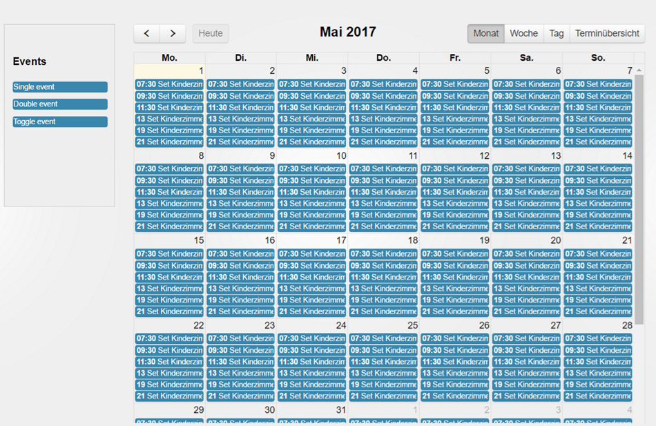

# ioBroker.fullcalendar

  

Schedules with [fullcalendar](https://fullcalendar.io).

You must not use any external resources, the scheduling is processed only in ioBroker and will be not combined with any external services like "google calender" or "iTunes".

You can control your events with calender and can plan to control them periodically.

## Changelog
### 1.0.0 (2019-11-17)
* (bluefox) Support of compact mode added

### 0.2.4 (2017-11-23)
* Translations

### 0.2.3 (2017-11-22)
* (bluefox) Fix interval settings
* (bluefox) Update fullcalendar library

### 0.2.1 (2017-09-25)
* (bluefox) Fixed error

### 0.2.0 (2017-08-06)
* (bluefox) Support of new admin

### 0.1.1 (2017-07-13)
* (bluefox) fix double event by creation

### 0.1.0 (2017-03-20)
* (bluefox) initial commit

## License
CC BY-NC 4.0

Copyright (c) 2017-2019 bluefox <dogafox@gmail.com>