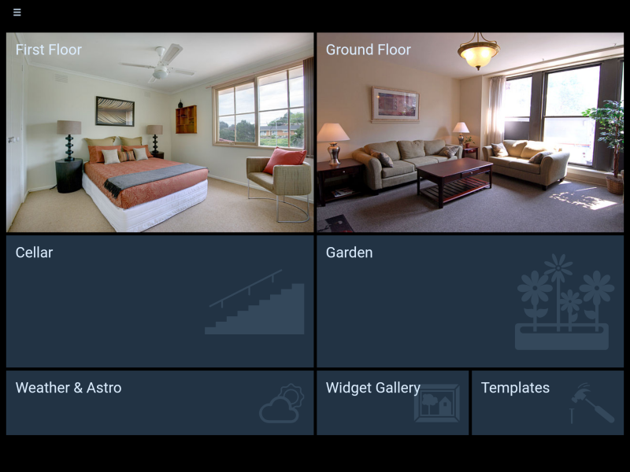
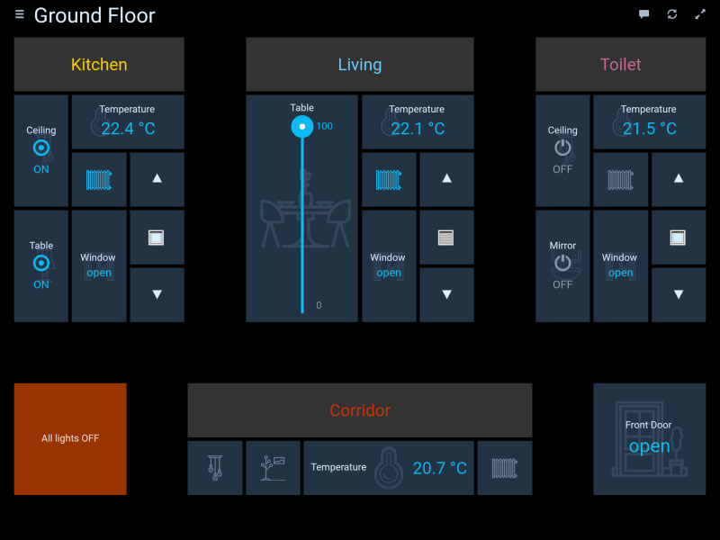
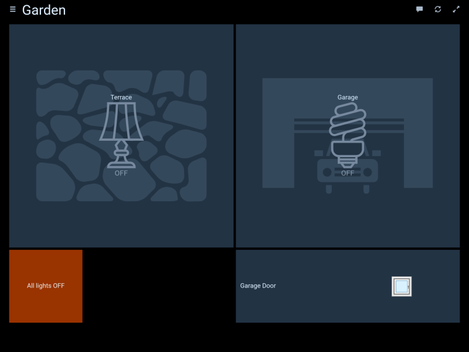
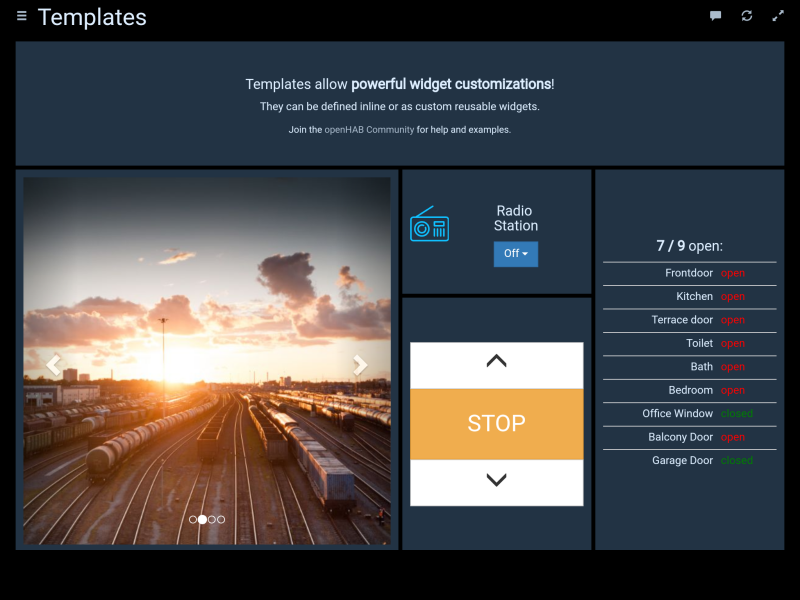

# ioBroker.habpanel

  

HABPanel is a lightweight dashboard interface for ioBroker based on OpenHAB HABpanel.

It notably features an embedded dashboard designer allowing to build interfaces easily right on the target device.

## Installation
**Important!**
This adapter cannot be installed directly from github. Only from npm.

## Getting started

- When accessing HABPanel for the first time on a new browser or device, you should be presented with a rather empty screen - follow the tutorial and begin by clicking (or tapping) on the top-right corner icon.
- You're now in edit mode, a link (_"Add new dashboard"_) appeared, as well as an _"Advanced settings"_ link.
- If you previously used HABPanel and stored some panel configurations on the server, go to _"Advanced settings"_ and click on your previous configuration - it will be instantly brought back. Or, create your first dashboard: click/tap on the _"Add new dashboard"_ link and give it a name.
- Click/tap on the dashboard tile to enter the dashboard editor
- Add your first widget: select the _"Add Widget"_ menu and choose a widget type (let's say Dummy - a simple widget displaying an item's state)
- Move the widget by drag-and-drop and resize it with the white chevron - it appears when you click on the widget
- Hit on the three dots in the widget top-right corner to bring up its context menu and choose _"Edit..."_
- Adjust some settings (name, openHAB item etc.) and confirm your changes
- Save your configuration by clicking/tapping the _Save_ button
- Click/tap _Run_ to see your dashboard in action - use your browser's back button or the arrow to go back to the drawing board
- Once you're happy with your set of dashboards, go back to _"Advanced settings"_ then click/tap on _"Save the current configuration to a new panel configuration"_; this will store it on the openHAB 2 server as described above, and make it available for reuse.

## Screenshots

## Changelog
### 0.4.3 (2020-08-22)
* (bluefox) The compatibility to socket.io 3.0.13 provided 

### 0.4.1 (2020-02-10)
* (Apollon77) compatibility to web 3.0

### 0.3.5 (2019-04-15)
* (yaming116) bugfix i18n

### 0.3.4 (2019-02-04)
* (janfromberlin) button widget did not handle primitive boolean commands
* (matthiasgasser) fix time series query start date, adapted end date

### 0.3.3 (2019-02-02)
* (janfromberlin) fix button toggle functionality for true/false

### 0.3.2 (2019-01-30)
* (foxthefox) chart and timeline functionality fixed

### 0.3.1 (2019-01-27)
* (foxthefox) chart and timeline functionality added

### 0.2.6 (2019-01-14)
* (jogibear9988) bugfix selection element

### 0.2.5 (2019-01-14)
* (jogibear9988) bugfix format strings

### 0.2.4 (2019-01-13)
* (jogibear9988) bugfix template widget

### 0.2.3 (2019-01-11)
* (jogibear9988) upgrade to current openhab version

### 0.1.7 (2017-05-20)
* (bluefox) add to welcome screen

### 0.1.6 (2017-05-15)
* (bluefox) initial commit

## License
Copyright 2017-2020 bluefox <dogafox@gmail.com>

Eclipse Public License
