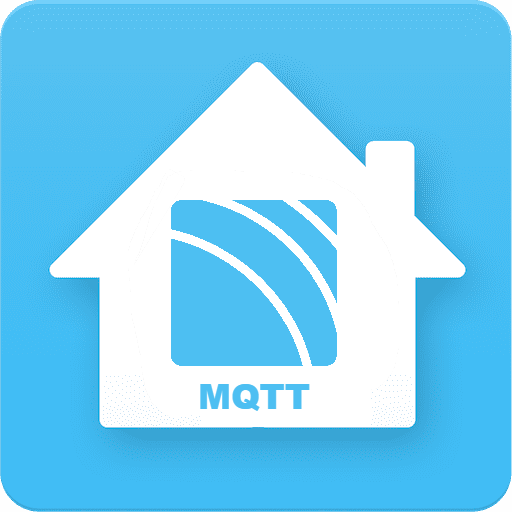
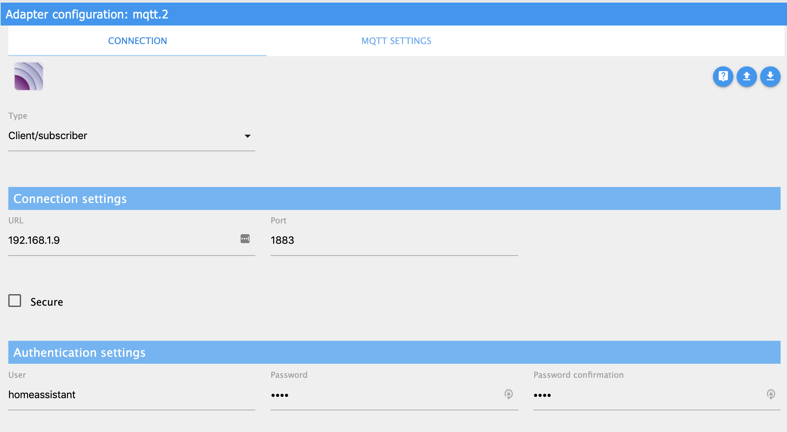

<h1>
    
    ioBroker.hass-mqtt
</h1>

  

**Tests:** Linux/Mac/Windows: 

## hass-mqtt adapter for ioBroker

This adapter can discover devices followed hass mqtt discover protocol.

## Supported Homeassistant domain

- switch
- sensor

## adapter configuration

You need create another MQTT instance works with this adapter. This MQTT instance can working as Client or Broker.

- bind mqtt instance ID: select created MQTT instance ID.
- homeassistant prefix
: The prefix defined in homeassistant MQTT protocol, default value is homeassitant.

## mqtt instance configuration

### Use as Client

In this situation, mqtt instance work as mqtt client.
You need install mqtt broker manually.

Configuration like this

### Use as Broker

In this situation, mqtt instance work as mqtt broker.
Make sure you have stopped other mqtt broker running on same host on same port.

Confinguration like this

----

## Hass-MQTT适配器

此适配器可以发现并接入局域网内符合Homeassistant规定的MQTT协议规范的设备。

## 已支持的Hass domain

- switch
- sensor

## 适配器配置

此适配器需要另行创建一个MQTT实例配合使用。MQTT实例可以是客户端或者服务器模式。

- 绑定MQTT实例ID： 选择另行创建的MQTT实例ID
- homeassistant前缀：homeassistant规定的MQTT协议的前缀，默认为homeassitant。

## MQTT实例的配置

### 工作为客户端模式

如果局域网内已经有MQTT服务器，可以创建一个mqtt客户端实力并绑定到此适配器。

配置方式如下图

### 工作为服务器模式

如果局域网内没有MQTT服务器，需要在当前主机上创建MQTT服务器。
需要注意配置的MQTT端口不可以被当前主机上的其他程序占用。

配置方式如下图

## Changelog
### 0.0.7 (2019-06-16)
* Fix multi map issue

### 0.0.6 (2019-06-13)
* fix event storm issue

### 0.0.5 (2019-05-18)
* update npm

### 0.0.4 (2019-05-18)
* select mqtt instance, not type it name

### 0.0.3
* (SchumyHao) Update admin page

### 0.0.2
* (SchumyHao) Add switch device support

### 0.0.1
* (SchumyHao) initial release

## License
MIT License

Copyright (c) 2019 SchumyHao

Permission is hereby granted, free of charge, to any person obtaining a copy
of this software and associated documentation files (the "Software"), to deal
in the Software without restriction, including without limitation the rights
to use, copy, modify, merge, publish, distribute, sublicense, and/or sell
copies of the Software, and to permit persons to whom the Software is
furnished to do so, subject to the following conditions:

The above copyright notice and this permission notice shall be included in all
copies or substantial portions of the Software.

THE SOFTWARE IS PROVIDED "AS IS", WITHOUT WARRANTY OF ANY KIND, EXPRESS OR
IMPLIED, INCLUDING BUT NOT LIMITED TO THE WARRANTIES OF MERCHANTABILITY,
FITNESS FOR A PARTICULAR PURPOSE AND NONINFRINGEMENT. IN NO EVENT SHALL THE
AUTHORS OR COPYRIGHT HOLDERS BE LIABLE FOR ANY CLAIM, DAMAGES OR OTHER
LIABILITY, WHETHER IN AN ACTION OF CONTRACT, TORT OR OTHERWISE, ARISING FROM,
OUT OF OR IN CONNECTION WITH THE SOFTWARE OR THE USE OR OTHER DEALINGS IN THE
SOFTWARE.