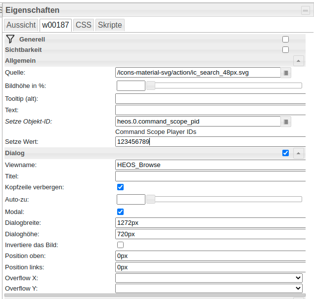

# ioBroker.heos

[](https://www.npmjs.com/package/iobroker.heos)
[](https://www.npmjs.com/package/iobroker.heos)


[](https://david-dm.org/withstu/iobroker.heos)
[](https://snyk.io/test/github/withstu/ioBroker.heos)

[](https://nodei.co/npm/iobroker.heos/)

## heos adapter for ioBroker

The adapter lets control HEOS from ioBroker

## Configuration

* **AutoPlay**: Automatically plays music after the player is connected or on unmute. Can be configured globally in configuration. If it is enabled globally you can disable it for one specific player with the state ```auto_play```.
* **Command scope**: Defines to which players the command of ```scope/[cmd]``` is send to. It can be send to all players, all leading players or to all PIDs in the comma separated state: ```heos.0.command_scope_pid```
* **Mute Regex**:
In the configuration you can activate a function to mute the player based on a regex match on the song information. That can be used to mute ads automatically. For example for Spotify you can use the following regex: ```spotify:ad:|Advertisement```.
* **ignore_broadcast_cmd**: This player state configures, if the player should ignore commands to all players e.g. player/set_mute&state=on or pressing the play button for presets/playlists

## Seek
The seek functionality is not working on all sources. Spotify and Amazon Music are supporting seeking.

## Command State

HEOS CLI specification: http://rn.dmglobal.com/euheos/HEOS_CLI_ProtocolSpecification.pdf

### HEOS Command State

* "system/connect": Try to Connect to HEOS
* "system/disconnect": Disconnect from HEOS
* "system/reconnect": Disconnect and Connect
* "system/load_sources": Reload sources
* "group/set_group?pid=<pid1>,<pid2>,...": Set group with the list of player ids e.g. "group/set_group?pid=12345678,12345679".
* "group/set_group?pid=<pid1>" : Delete existing group e.g. "group/set_group?pid=12345678"
* "group/ungroup_all" : Delete all groups
* "group/group_all" : Group all player in one group
* "player/[cmd]": Send the command to all players. e.g. player/set_mute&state=on 
* "leader/[cmd]": Send the command to all leading players. e.g. leader/set_mute&state=on
* "scope/[cmd]": Send the command to the configured scope all players, leading players or comma separated player pids in scope_pids
* "...": All other commands are tried to send to HEOS

### Player Command State

Note: Multiple commands are possible, if they are separated with the pipe e.g. set_volume&level=20|play_preset&preset=1

* "set_volume&level=0|1|..|100": Set the player volume 
* "set_play_state&state=play|pause|stop": Set the player state
* "set_play_mode&repeat=on_all|on_one|off&shuffle=on|off": Set Repeat and Shuffle mode
* "set_mute&state=on|off": Mute player
* "volume_down&step=1..10": Lower volume
* "volume_up&step=1..10": Raise volume
* "play_next": Play next
* "play_previous": Play previous
* "play_preset&preset=1|2|..|n": Play preset n
* "play_stream&url=url_path": Play URL-Stream
* "add_to_queue&sid=1025&aid=4&cid=[CID]": Play playlist with [CID] on player (aid: 1 – play now; 2 – play next; 3 – add to end; 4 – replace and play)

## SayIt
[SayIt Adapter](https://github.com/ioBroker/ioBroker.sayit) is supported.


## Material UI
[Material UI Adapter](https://github.com/ioBroker/ioBroker.material) is supported.


## VIS

### Installation
* Create following string states:
    * 0_userdata.0.heos.queue_pid
    * 0_userdata.0.heos.queue_html
    * 0_userdata.0.heos.browse_result_html

### Player View
* Open the file: [player_view.json](docs/vis/views/player_view.json)
* Replace 123456789 with the player pid
* Import view into VIS


### Presets
* Open the file: [presets_view.json](docs/vis/views/presets_view.json)
* Import view into VIS


### Queue
* Queue Widget: [queue_player_widget.json](docs/vis/views/queue_player_widget.json)
* Queue View: [queue_view.json](docs/vis/views/queue_view.json)
* Queue HTML Generation Script: [queue.js](docs/vis/scripts/queue.js)


### Browse Sources
* Browse Widget: [browse_player_widget.json](docs/vis/views/browse_player_widget.json)
* Browse View: [browse_view.json](docs/vis/views/browse_view.json)
* Browse HTML Generation Script: [browse.js](docs/vis/scripts/browse.js)




Alternative you can use the script from Uhula: https://forum.iobroker.net/post/498779


## Changelog

### 1.7.5 (2021-02-12)
* (withstu) add bit depth

### 1.7.4 (2021-02-01)
* (withstu) fix upnp init bug

### 1.7.3 (2021-02-01)
* (withstu) add upnp module and support bitrate, audio format and sample rate

### 1.7.2 (2021-01-30)
* (withstu) fix seek in groups

### 1.7.1 (2021-01-30)
* (withstu) add seek

### 1.7.0 (2021-01-29)
* (withstu) reboot not responding players
* (withstu) delete old presets and playlists

### 1.6.2 (2021-01-02)
* (withstu) fix "user not logged in" handling

### 1.6.1 (2020-11-25)
* (withstu) clear timeout and interval on unload; fix roles; remove sleep in tts module

### 1.6.0 (2020-11-22)
* (withstu) add regex mute

### 1.5.6 (2020-11-22)
* (withstu) add source images & optimize auto play

### 1.5.5 (2020-11-01)
* (withstu) update some packages and add sources event

### 1.5.4 (2020-10-24)
* (withstu) ignore invalid now playing responses

### 1.5.3 (2020-10-18)
* (withstu) minor improvements related to auto play feature

### 1.5.2 (2020-10-11)
* (withstu) improve tts stop method

### 1.5.1 (2020-10-11)
* (withstu) improve tts and don't update queue during tts

### 1.5.0 (2020-10-10)
* (withstu) add tts support and maximum volume

### 1.4.0 (2020-10-10)
* (withstu) add more play and queue settings
* (withstu) bugfixing for invalid heos responses (empty player name)

### 1.3.4 (2020-10-04)
* (withstu) remove sorting and available filter and fix browse play

### 1.3.3 (2020-10-04)
* (withstu) fix previous page button in browse feature

### 1.3.2 (2020-10-04)
* (withstu) fix preset sorting

### 1.3.1 (2020-10-03)
* (withstu) add back button to browse feature

### 1.3.0 (2020-10-03)
* (withstu) add queue and some browse improvements

### 1.2.4 (2020-09-29)
* (withstu) minor bugfix

### 1.2.3 (2020-09-29)
* (withstu) improve browse feature (add pictures and sources view)

### 1.2.2 (2020-09-28)
* (withstu) rename browse command

### 1.2.1 (2020-09-28)
* (withstu) introduce browse_result state

### 1.2.0 (2020-09-27)
* (withstu) Breaking change: restructure playlists/presets (you should delete the devices playlists, presets and sources before installation)

### 1.1.2 (2020-09-26)
* (withstu) log browse parameters

### 1.1.1 (2020-09-26)
* (withstu) add source browse feature (Click the button in the sources. You can find the possible next commands in the log.)

### 1.1.0 (2020-09-26)
* (withstu) encrypt password

### 1.0.1 (2020-09-21)
* (withstu) remove connected state, because it is included in the info channel

### 1.0.0 (2020-09-21)
* (withstu) initial release

## License
MIT License

Copyright (c) 2021 withstu <withstu@gmx.de>

derived from https://forum.iobroker.net/topic/10420/vorlage-denon-heos-script by Uwe Uhula
TTS derived from https://github.com/ioBroker/ioBroker.sonos

Permission is hereby granted, free of charge, to any person obtaining a copy
of this software and associated documentation files (the "Software"), to deal
in the Software without restriction, including without limitation the rights
to use, copy, modify, merge, publish, distribute, sublicense, and/or sell
copies of the Software, and to permit persons to whom the Software is
furnished to do so, subject to the following conditions:

The above copyright notice and this permission notice shall be included in all
copies or substantial portions of the Software.

THE SOFTWARE IS PROVIDED "AS IS", WITHOUT WARRANTY OF ANY KIND, EXPRESS OR
IMPLIED, INCLUDING BUT NOT LIMITED TO THE WARRANTIES OF MERCHANTABILITY,
FITNESS FOR A PARTICULAR PURPOSE AND NONINFRINGEMENT. IN NO EVENT SHALL THE
AUTHORS OR COPYRIGHT HOLDERS BE LIABLE FOR ANY CLAIM, DAMAGES OR OTHER
LIABILITY, WHETHER IN AN ACTION OF CONTRACT, TORT OR OTHERWISE, ARISING FROM,
OUT OF OR IN CONNECTION WITH THE SOFTWARE OR THE USE OR OTHER DEALINGS IN THE
SOFTWARE.