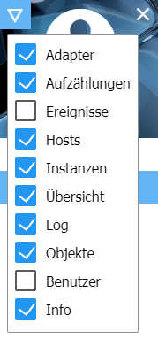
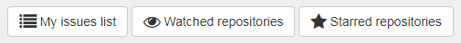
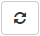
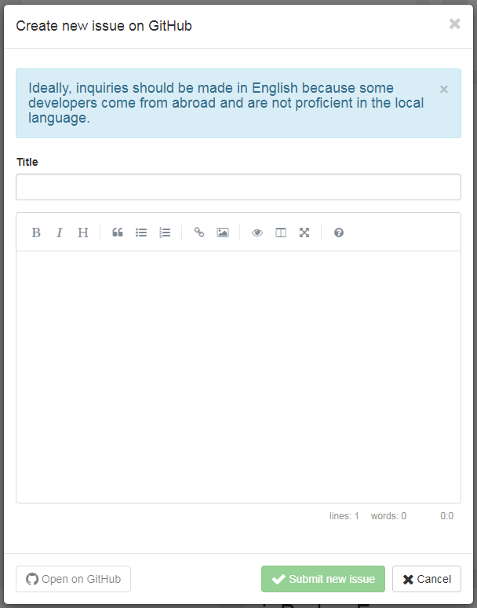
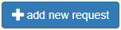
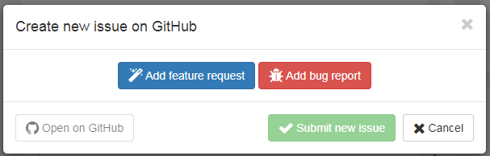
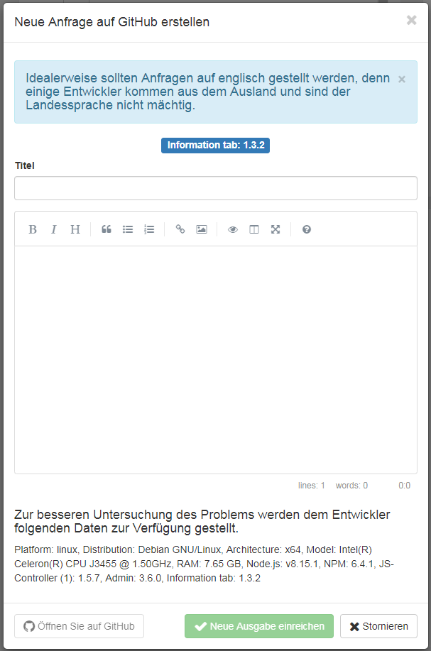
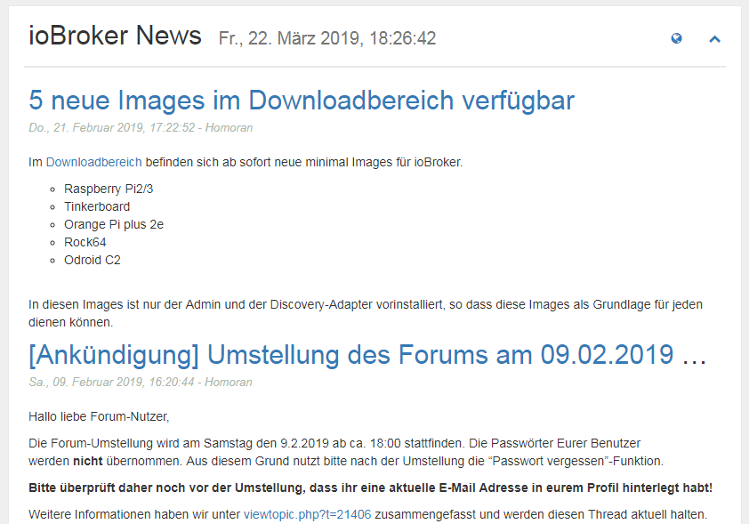
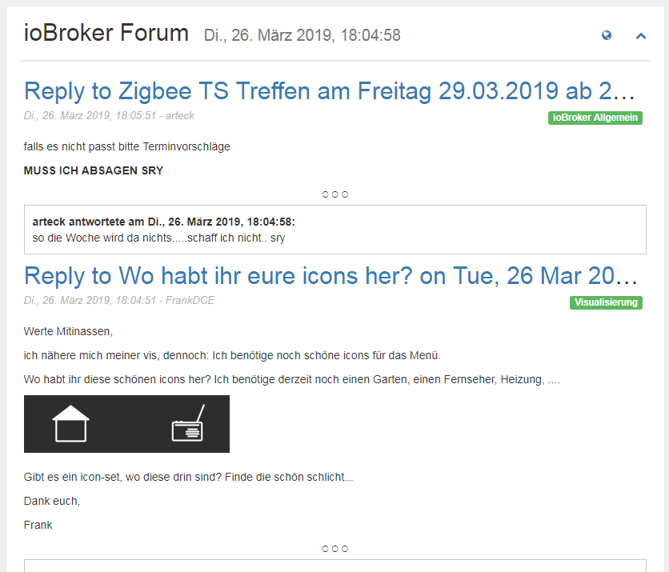

# Admin

The Info Adapter was developed to provide various information about the system, about ioBroker and relevant topics to the user. The user should get an overview of all interesting and important data and the ioBroker team will be given the opportunity to contact the user even faster, if important information is available.

# Installation


In order to see the info window in the Tab tab, you must first check it as Visible in the Admin after installation. To do this, click on the left-hand triangle in the upper left corner of the Admin window and select "Info" in the menu.

# Configuration

<p align="center">
    
</p>

* **Do not show clock** - To hide the clock at the top left.
* **Show adapter requests** - Displays the panel with the adapter requests.
    * **Adapter requests closed at startup** - The panel with the adapter requests is closed when the Info window starts.
* **View known errors** - Displays the panel with known errors and requests for installed adapters.
    * **Known errors at startup closed** - The panel with the known errors is closed when starting the info window.

* **Show News from iobroker.net** - Displays the panel with the official ioBroker news.
* **Show the latest forum entries** - Displays the panel with the last forum entries.
* **Feednami API Key** - If you call ioBroker using a host name, such as iobroker: 8081 or something like that, you need to sign up for free at Feednami to get an appropriate API key. This is not necessary for access via an IP address.

* **Show documentation** - Displays the button for the documentation.
    * **Select the required languages ​​for the documentation** - Selection of the languages ​​to be included in the documentation. (You may have to click on the name to the right to select what - default -> set language + english)

* **Search Github for Unknown Adapters (Experts)** - Displays the panel searching for unapproved adapters in the github.
    * **Sort Adapter by** - Sorts the result of the search by name, creation date or last update.
    * **reverse order** - reverses the order of the results.
    * **New adapters closed at startup** - The panel with the unknown adapters is closed when starting the info window.

* **GitHub personal access token** - To be able to create new issues or adapter requests on Github directly from ioBroker, you need a token that can be generated there. This requires a Github account.
To get the token, log in to Github, click on the user icon in the top right corner, go to "Settings", then "Developer settings"> "Personal access tokens". There, click on "Generate new token", type any name under "Token description" and select as "Scope", "repo". Then you get a token and enter it in the ioBroker. You can find more detailed instructions in English [here](https://help.github.com/en/articles/creating-a-personal-access-token-for-the-command-line).
 

* **Do not load current system data** - The current system data is not loaded cyclically.
    * **Load CPU data every x seconds** - The CPU data is cyclically loaded every 1 to 10 seconds. (0 is off - default 3)
    * **Load memory data every x seconds** - The memory data are loaded cyclically every 1 to 10 seconds. (0 is off - default 3)
    * **Load disk data every x seconds** - The hard disk data are loaded cyclically every 1 to 10 seconds. (0 is off - default 8)
    * **Load battery data every x seconds** - Load the battery data cyclically every 1 to 10 seconds. (0 is off - default 8)
    * **Load network data every x seconds** - Load network data cyclically every 1 to 10 seconds. (0 is off - default 3)
    * **Load process and user data every x seconds** - Process and user data are loaded cyclically every 1 to 10 seconds. (0 is off - default 8)

With Windows system, the cyclic loading of the system data should not happen too fast, because this causes a considerable load on the system. The default values have been selected to run without problems on most systems.

# Info Tab

The Info tab contains various information about your system and the ioBroker. The tab is divided into different blocks that can be customized. Almost all blocks can be opened or opened with one click on .

## Clock


The clock has no special function (but I have made an effort) and can be turned off at any time in the configuration.

## Github bar


In order to see this bar, you first need a Github account and must specify a token in the configuration. For more information, see under [Configuration description](#Configuration) > "GitHub Personal Access Token".

At the moment you have the possibility to see self-created issues, assigned issues and repositories that are either observed or marked with a star.

By clicking on , all comments about the issue can be displayed. The button only appears if comments are available. The total number of comments is shown in the balloon before the title of the issue.

## Messages


In order to quickly send important messages concerning ioBroker to the user, the possibility was created to create messages. These messages appear ONLY if certain conditions apply. So no messages are displayed over an adapter if it is not installed. This ensures that ONLY the users are warned, who are also affected by the problem.

The messages can be closed with one click, in the top right corner of , but they appear again as soon as the info-tab is reloaded, as long as the problem persists.

For the use of messages with other adapters such as Javascript, Telegram, Alexa, etc., they are already filtered in the object "newsfeed_filtered", stored as an array of objects.

Example:
```javascript
const messages = JSON.parse(getState('info.0.newsfeed_filtered').val);
messages.forEach(message => {
    const title = message.title;
    const text = message.content;
    const created = new Date(message.created);
    console.log(created + " " + title + " " + text);
});
```

### Messages (VIS-Widget)


For the messages a VIS widget was created, which also appears only if the messages concern the user. If there are no messages, nothing is displayed, so you do not need to extra space on the VIS surface for the messages, but simply it. in the middle of the screen.

## Documentation


We have put together a list of important links. You can find this as a drop-down list by clicking on the button at the top right "Documentation". If the button is not visible, make sure that the corresponding item in the configuration is checked.

The individual links are stored in different categories: Community, Documentation, News, Blog, Video Playlist, Development and Others

For the correctness and completeness of external links no guarantee can be given. If links are missing or incorrect, please send us an e-mail.

## Updates


If new versions of an adapter are released and you also have it installed, it will appear in this list.

From here you can directly update with a click on .
When you mouse over ![Changelog Icon] (img/changelog.png), you'll see the most important changes since your release.
Click on  to display the complete description of the adapter.

If the host - ie JS-Controller - is outdated, then an extra box appears below "New adapters" with the message that you should update the host.

## New adapters


Here all new and officially released adapters of the last 60 days are displayed.

From here you can directly install the new adapter by clicking on .
Click on  to display the complete description of the adapter.

<br>

## System information


The system information of the ioBroker system is displayed here. In the case of multi-host systems, of course, the information of the other hosts is also displayed. These data come from the JS-Controller.

The following information (per host) is provided as info:

- Operating system (linux, win32, darwin, android, aix, freebsd, openbsd or sunos)
- Architecture (arm, arm64, ia32, mips, mipsel, ppc, ppc64, s390, s90x, x32 and x64)
- CPUs (number of cores)
- Speed (processor speed)
- Model (processor model)
- RAM (approximate total memory)
- System operating time (how long has the system been running)
- Node.js (The Node.js version - if it's a newer one or your version is outdated, this information is also here)
- NPM (NPM version)
- Hard disk size (size of the hard disk where ioBroker is located)
- Hard disk free (how much space is still available)
- number of adapters (how many adapters have been released for ioBroker so far)
- Operating time (how long does the ioBroker run without a restart)
- Active instances (how many adapter instances are currently running on this host)
- host name (name of the host)

```
If any information is missing, then a recent version of the JS-Controller should be installed.
This is the dataset of the JS-Controller v1.5.7.
```

Clicking on  displays detailed information about the main system.

### System information (detailed view)


Here a lot of information about the house system is displayed and stored as an object. These can then be used by you quite comfortably. Most of the data is only read and saved when the adapter is first charged, as these do not change so easily.

Some data is also updated cyclically. How often this happens can be set in the configuration.

Keep in mind that not all information is available in every operating system, which may result in some information not being displayed.

#### System

Here the hardware data is displayed - motherboard, bios, case etc ...

#### Software

Software includes data about the operating system, installed software, running processes and logged in users.

#### Central processor

Here you can find data all about the CPU like speed, load and temperature.

**Problems with Windows:** wmic is used to detect the temperature of a Windows system. In some cases, wmic needs to be run with administrator privileges. So, if you do not get any values, try running it again with the appropriate permissions. If you still do not get any values, your system may not support this feature.

**Problems with Linux:** In some cases you need to install the Linux sensor package to measure the temperature, e.g. on DEBIAN-based systems by running:

```
$ sudo apt-get install lm-sensors
```

#### Main memory

Here is all the data to the main memory like free memory or data to the RAM bar.

#### Hard disks

All data on hard drives, partitions, raids and ROMs.

**Problems with Linux:** To be able to use the S.M.A.R.T. To see Linux status, you need to install the smartmontools. On DEBIAN-based Linux distributions, you can install it by doing the following:

```
$ sudo apt-get install smartmontools
```

#### Graphic

Data about the controller or monitor is displayed here, if available / supported.

#### Network

All data about the network connections.

#### Battery

All data about the battery, if one exists.

**Problems with Windows:** wmic is used to detect the battery status of a Windows system. In some cases, wmic needs to be run with administrator privileges. So, if you do not get any values, try running it again with the appropriate permissions. If you still do not get any values, your system may not support this feature.

## Adapter requests


All adapter requests were included in the github as an issue. Anyone who wishes for something, can enter his wish here and anyone can develop, can then pick an issue and develop an adapter from it.

In this listing a title will be displayed and by clicking on , more detailed information will be visible. Above links when the wish was created, right the current status and below a detailed description. If a developer has chosen the request, it will be listed here as "assined to".

By clicking on , you come directly to Github and can add your own wishes there.
If you click on the title of a wish, you land directly on the request of Github and may vote for it. Wishes with many votes are of course preferred.

The "Adapter requests" panel can be hidden in the configuration or displayed in the closed state when loading.

### Create new adapter request

To create a new request, you first need a Github account and must specify a token in the configuration. For more information, see under [Configuration description](#Configuration) > "GitHub Personal Access Token".


If you click on , a window appears where you have the possibility to create a title and a description of the adapter request.

As a title, always select a clear and short term such as "Panasonic TV". Then describe your wishes as accurately as possible.
If already known APIs exist for the product, you should also write this.
Any information that might help the developer increases the likelihood that the corresponding adapter will be developed quickly. If possible, please write everything in English,
because some developers come from abroad and probably they don't speek your language.

By clicking on "Submit New Issue", an issue will be created on Github. Now you can click on the blue button on the left to go directly to the issue or just close the window.

### Vote for adapter requests

With a Github account, you can also vote directly for adapter requests by clicking . If it works, the button turns green. Everyone can only vote one vote. The total number of voices is displayed in the object in front of the title.

In the overview, adapter requests that you have voted for are displayed in green and requests younger than 1 month are blue.

## My adapters


Of course, no adapters are error-free and some users may also have expansion ideas. Everything that is known about the installed adapters is collected here. You can also use this list to find out if a bug you just found is also known to the developer, because only known bugs can be fixed.

Click on , to the right of the adapter name, will open the list of known problems / requests. These can also be opened, where you will then find a detailed description.

If you click on the name of the adapter, you can go directly to the Issues list on Github and can possibly enter a new error or wish to expand.
If you click on the title of an issue, you end up directly with the message on Github and can optionally provide the developer more information, leave as a comment.
By clicking on , all comments about the issue can be displayed. The button only appears if comments are available. The total number of comments is shown in the balloon before the title of the issue.

The "Problems and errors" panel can be hidden in the configuration or displayed in the closed state when loading.

### Report wishes or errors

If you open up an adapter, you have the option to report a new error or make suggestions for improvements by clicking on . This requires a Github account and a token in the configuration. Further details can be found under [Configuration Description](#Configuration) > "GitHub Personal Access Token".


When clicking you get the opportunity to make an improvement proposal (blue) or report a bug (red). Both options allow you to enter a title and a description.


The title should give you a clear and concise description of the problem. When describing, you should not be frugal with information. Every detail can help the developer to implement the problem or desire faster. If possible, please write everything in English,
because some developers come from abroad and probably they don't speak your language.

By clicking on "Submit New Issue", an issue will be created on Github. Now you can click on the blue button on the left to go directly to the issue or just close the window.

### Mark adapter as favorite

Developers sacrifice a lot of free time to develop adapters for you. Here's your chance, provided a Guthub Token has been entered, by clicking on  to thank the developers for their work. Everyone can only vote one vote. The total number of votes will be shown in the object before the title.

In the overview, adapters that have been favored by you are displayed in green.

## ioBroker adapter on Github


The number of official adapters for ioBroker is already considerable. Of course, there are many more adapters available on the net. These are searched and displayed here.

If you open the panel with a click on , the complete description of the adapter is displayed here.

The "ioBroker adapter on Github" panel can be hidden in the configuration or displayed in the closed state when loading. You can also adjust the order of sorting.

```
WATCH OUT!!! These adapters may be in a very early stage of development.
These should not be installed on a production system.
Each installation is at your own risk!
```

## News


Every now and then, official news from the ioBroker team will be published. Here they will be displayed.

Click on  to get directly to the official ioBroker page.

The news is displayed without any problems when accessing ioBroker via IP or localhost:8081. But if you use a hostname like meinhaus.de:8081, you have to get a free API key at Feednami. To register, click [here](https://toolkit.sekando.com/docs/en/setup/hostnames) and follow the instructions.

## Forum


Here the latest entries of the forum are displayed in the selected language. If there is no forum in the language, then data will be displayed on the English forum.

Click on  to get directly to the forum.

Forum entries will be displayed without problems when accessing ioBroker via IP or localhost:8081. But if you use a hostname like meinhaus.de:8081, you have to get a free API key at Feednami. To register, click [here](https://toolkit.sekando.com/docs/en/setup/hostnames) and follow the instructions.

## Changelog
### 1.5.3 (2019-09-25)
* (ldittmar) add event calendar

### 1.5.2 (2019-09-24)
* (ldittmar) show comments for adapter requests
* (ldittmar) show closed adapter requests
* (ldittmar) check node version for messages

### 1.4.3 (2019-09-09)
* (ldittmar) change systeminformation call interval
* (ThomasBahn) News problem fixed
* (ldittmar) Update systeminformation library
* (badenbaden) Fixed russian spelling 

### 1.4.1 (2019-08-01)
* (bluefox) Removed default socket.io

### 1.3.7 (2019-04-17)
* (ldittmar) better integration to admin adapter

### 1.3.5 (2019-04-12)
* (ldittmar) add likes for Adapters
* (ldittmar) show comments for issues

### 1.3.4 (2019-04-10)
* (ldittmar) my issues and my repos
* (ldittmar) change Github API V3 to API V4
* (ldittmar) vote for adapter requests

### 1.3.2 (2019-04-06)
* (SchumyHao) Update Chinese translation
* (ldittmar) create Github issues
* (ldittmar) create new adapter requests

### 1.3.1 (2019-04-03)
* (ldittmar) charts for cpu and memory
* (ldittmar) filtered news object added

### 1.3.0 (2019-03-29)
* (ldittmar) better system information
* (ldittmar) documentation in all languages
* (ldittmar) some fixes

### 1.2.7 (2019-03-17)
* (ldittmar) little fixes
* (ldittmar) unknow adapters search new design
* (ldittmar) better design for PC monitor
* (ldittmar) unknow adapters show more informations
* (ldittmar) stable version

### 1.2.5 (2019-03-14)
* (ldittmar) show adapter requests
* (ldittmar) show bugs and issues
* (ldittmar) diyplay important links
* (ldittmar) show important popup news
* (ldittmar) vis widget for popup news

### 1.1.3 (2019-01-03)
* (ldittmar) compact mode compatibility added
* (ldittmar) add chinese support
* (ldittmar) add new forum support
* (ldittmar) add chinese forum support
* (ldittmar) move to iobroker-community-adapters

### 1.0.2 (2018-11-30)
* (ldittmar) fixed problems with Node version info in multihost system

### 1.0.1 (2018-11-27)
* (ldittmar) search for new adapters on Github
* (ldittmar) check for Node.js update
* (ldittmar) https problems with news and forum data solved
* (ldittmar) polish added as language

### 1.0.0 (2018-11-25)
* (ldittmar) full compatibility to Admin 3.x
* (ldittmar) clock can be disabled

### 0.1.0 (2018-01-02)
* (ldittmar) compatibility to Admin 3.x / beta release

### 0.0.6 (2017-12-11)
* (ldittmar) some fixes / install and update implemented

### 0.0.4 (2017-12-08)
* (ldittmar) some fixes and design correction
* (ldittmar) show informations about adapters (update/new)
* (ldittmar) show system informations

### 0.0.1 (2017-11-23)
* (ldittmar) initial commit

## License
The MIT License (MIT)

Copyright (c) 2017 - 2019 ldittmar <iobroker@lmdsoft.de>

Permission is hereby granted, free of charge, to any person obtaining a copy
of this software and associated documentation files (the "Software"), to deal
in the Software without restriction, including without limitation the rights
to use, copy, modify, merge, publish, distribute, sublicense, and/or sell
copies of the Software, and to permit persons to whom the Software is
furnished to do so, subject to the following conditions:

The above copyright notice and this permission notice shall be included in
all copies or substantial portions of the Software.

THE SOFTWARE IS PROVIDED "AS IS", WITHOUT WARRANTY OF ANY KIND, EXPRESS OR
IMPLIED, INCLUDING BUT NOT LIMITED TO THE WARRANTIES OF MERCHANTABILITY,
FITNESS FOR A PARTICULAR PURPOSE AND NONINFRINGEMENT. IN NO EVENT SHALL THE
AUTHORS OR COPYRIGHT HOLDERS BE LIABLE FOR ANY CLAIM, DAMAGES OR OTHER
LIABILITY, WHETHER IN AN ACTION OF CONTRACT, TORT OR OTHERWISE, ARISING FROM,
OUT OF OR IN CONNECTION WITH THE SOFTWARE OR THE USE OR OTHER DEALINGS IN
THE SOFTWARE.