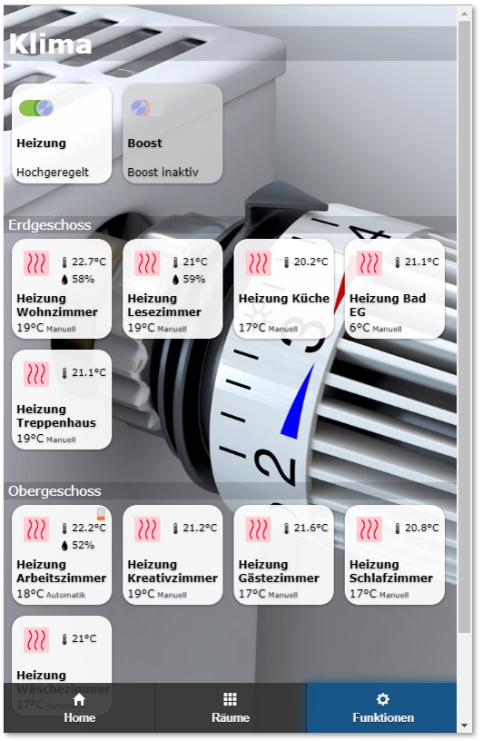
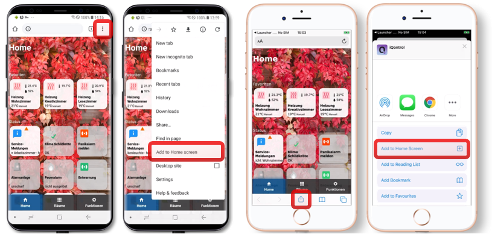
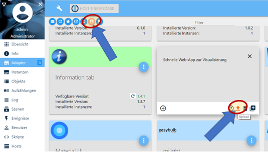
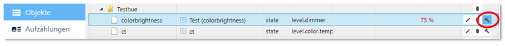

# ioBroker.iqontrol

 
 
[](https://www.npmjs.com/package/iobroker.iqontrol)
[](https://www.npmjs.com/package/iobroker.iqontrol)
[](https://david-dm.org/sbormann/iobroker.iqontrol)
[](https://snyk.io/test/github/sbormann/ioBroker.iqontrol)

[](https://nodei.co/npm/iobroker.iqontrol/)

**Tests:**

| Linux/Mac/Windows: | Cross-Browser-Checking: |
| --- | --- |
| [](https://travis-ci.org/sbormann/ioBroker.iqontrol) | [](https://www.browserstack.com) |

<!-- Windows: [](https://ci.appveyor.com/project/sbormann/ioBroker-iqontrol/) -->

\
**If you like it, please consider a donation:**
  
[](https://www.paypal.com/cgi-bin/webscr?cmd=_s-xclick&hosted_button_id=LDHZMNPXKRX2N&source=url)


****

## iqontrol adapter for ioBroker

Fast Web-App for Visualization.




Runs in any Browser.
It's fully customizable.

## Add to Homescreen
You can save it as Web-App on Homescreen and it looks and feels like a native app:



## You need...
* Nodejs 8 or higher
* Web-Adapter with one instance running the same protocol (http or https) as the admin-adapter, socket.IO set to 'integrated' and 'Force Web-Sockets' disabled
    * If this stands in conflict to other adapters, simply add another instance with the above settings - iQontrol will search the besst fitting web-adapter-instance and use it for communication
	* For connecting over *iobroker.pro-Cloud* both, admin- and web-adapter should be set to http (not https)


## Troubleshooting
* Make shure you fulfilled the 'You need...' section at top of this page
* If something doesn't work like expected after update please try the following steps:
    * Start upload of adapter:
    \
        
	* Clear browser cache
	* Restart ioBroker
* Start iQonrol with opened debugging-console of your browser (mostly you need to press F12 to open it) and look for messages in the console-window


## Forum
Visit [iobroker forum](https://forum.iobroker.net/topic/22039/neuer-adapter-visualisierung-iqontrol). 


## How to use
* Start creating views.
	You can consider views as something like a page.
* Then create devices on these views.
	Devices have a role, that determines the function of the device, which icons are used and so on.
	Depending on that role you can link several states to the device. These will give the device its functionality.
	If you select 'Link to other view' as role you can create links to other views. I suggest skinning Links to other views with the same Background, the linked view has.
	You can also try to use the Autocreate-Function to choose an existing device from the iobroker-object-tree. Autocreate tries to find out the role and to match as many states as possible.
* Afterwards you can create a toolbar, which is displayed as footer.
	Toolbar-Entrys are links to views.
	The first Toolbar-Entry will be your 'Home-View' with will be loaded at start.
* To give everything a fancy style, you can upload your own images.
	You can use your images as background-images for views, or for devices.
	Images in the folder '/usericons' can be used as icons for devices.
	The free builtin demo-wallpapers are from www.pexels.com.


## URL-Parameters
* The frontend is called via ``http[s]://<url or ip of iobroker>:<port of web adapter>/iqontrol/index.html``
    * ``<port of web adapter>`` is usually 8082
* To open a specified instance you can add ``namespace=iqontrol.<instance-number>`` as URL-parameter
* To open a specified view as homepage you can add ``home=<viewID>`` as URL-parameter

**Example:**
* ``https://192.168.1.1:8082/iqontrol/index.html?namespace=iqontrol.1&home=iqontrol.1.Views.Living-Room``
    * Note upper and lower case


## Description of roles and associated states
Every device has a role, which defines the function of the device. Every role generates a set of states, which can be linked to a corresponding io-broker state.
If you use the auto-create-function, you can choose an existing device from the io-broker-object tree.  Autocreate tries to find out the role and to match as many states as possible.
This will only work for known devices. For unknown devices, and to give devices advanced features, you can add them manually via the (+)-Button or edit the devices that were created by autocreate.
To edit the role and the states of a device, click on the pencil behind the device. You will find a short description of the roles and the used states below:

### Modifying Datapoint Configuration
You can modify the configuration of datapoints via the wrench-icon behind a datapoint in the device-configuration dialog or in objects-tab of iobroker. Here you can:
* Set Readonly-Flag
* Set Invert-Flag
* Set a datapoint id, where target values are written to (if you have different data points for the actual and the target value)
* Modify unit of datapoint, seperate for zero, singular and plural values
* Modify min and max of datapoint
* Modify type of datapoint
* Modify role of datapoint
* Set or modify a Value-List
  


  
### General states:
Every role has the following three states:
* **ADDITIONAL_INFO**: *array* - an array of datapoints, that will be displayed at the bottom of the info-dialog
* **BATTERY**: *boolean* - when true or *number* - when less than 10%, a little battery-empty-icon will be displayed
* **ERROR**: *boolean* - when true, a little exclamation-mark-icon will be displayed
* **UNREACH**: *boolean* - when true, a little wireless-icon will be displayed

Almost all roles have a STATE- and/or a LEVEL-state. In most cases this represents the main function of the device. You can assign io-broker-states of the following types to it:
* *boolean* - if possible, it will be translated to a senseful text like 'on/off', 'opened/closed' or similar. If you click on the icon of a tile it tries to toggle the boolean (for example to turn a light on or off). If it is not read-only it will generate a flip-switch in the dialog
* *number* - will be displayed with its corresponding unit and generate a slider in the dialog
* *string* - a text to be displayed
* *value-list* - the selected value will be displayed. If it is not write-protected it will generate a drop-down-menu in dialog 
    * Technically a *value-list* is a value with a corresponding translation-list, defined in the 'common.custom.iqontrol.<instance>.states', 'native.states' or 'common.states' object of the datapoint:
        ````
        "native": {
            "states": {"true": "Text for true", "false": "Text for false"},
            ...
        }
        ````
    * You can create your own value list by modifying the datapoint (wrench-icon behind the datapoint in the objects-tab of iobroker, see above)

However, not every type makes sense to every role. So the STATE of a switch for example will be a boolean in most cases, to be able to be toggled between on and off. A string may be displayed, but the switch will not be functional.

### Link to other view:
* Has no further states
* The **linked-view-property** is opened directly

###  Switch,  Fan:
* **STATE**: *boolean* - display and set on/off-state
* **POWER**: *number* - power-consumption that will be displayed in small in the upper right corner

###  Button:
* **STATE**: *any* - any desired type of state
* **SET_VALUE**: CONSTANT *string* - this is a constant (not a linked io-broker-state!) that will be assigned to the STATE if the button is pressed
* **OFF_SET_VALUE**: CONSTANT *string* - this is a constant (not a linked io-broker-state!). If defined, STATE will be resetted to this value after the in options defined time or 100ms

###  Light:
Every light may have one or both of the following states:
* **STATE**: *boolean* - show and set on/off-state
* **LEVEL**: *number* - show and set the level of the light

Optional you can define the following states:
* For coloured LEDs (HSB-color-space):
    * **HUE**: *number* - color of the light from 0-360° (hue format)
    * **SATURATION**: *number* - saturation of the light (from white to pure color)
    * **COLOR_BRIGHTNESS**: *number* - the brightness of the colored LEDs (if you have a LEVEL-State and no white LEDs, this is ignored, because brightness is controled completely by LEVEL)
* For white LEDs:
    * **CT**: *number* - color-temperature of the light, if it has two shades of white
    * **WHITE_BRIGHTNESS**: *number* - the brightness of the white LEDs (if you have a LEVEL-State and no coloured LEDs, this is ignored, because brightness is controled completely by LEVEL)
* Alternative color-spaces:
    * **ALTERNATIVE_COLORSPACE_VALUE**: *string* or *number* (depending on the chosed colorspace) - the value of the alternative colorspace
    If your device does not support using HUE, SATURATION and COLOR_BRIGHTNESS (HSB/HSV-color-space) you can use a variety of alternative colorspaces. In the device-options you can chose one of the following colorspaces:	
        * **RGB** / **#RGB**: instead of using HUE, SATURATION and COLOR_BRIGHTNESS you can use the RGB-Format (hex), optional with leading '#'
        * **RGBW** / **#RGBW**: instead of using HUE, SATURATION, COLOR_BRIGHTNESS and WHITE_BRIGHTNESS you can use the RGBW-Format (hex), optional with leading '#'
        * **RGBWWCW** / **#RGBWWCW** / **RGBCWWW** / **#RGBCWWW**: instead of HUE, SATURATION, COLOR_BRIGHTNESS, CT and WHITE_BRIGHTNESS you can use the RGBWWCW- or RGBCWWW-Format (hex, WW = warm white, CW = cold white), optional with leading '#'
        * **RGB (Hue only)** / **#RGB (Hue only)**: instead of using HUE you can use the RGB (Hue only)-Format (hex), optional with leading '#'. In this special case the RGB-Format will only accept pure saturated colors of the hue-color-circle. Mixed white is not allowed
        * **Hue for Milight**: This is the Hue-Value for Milight-Devices, with use another starting-point in the hue color-cirlce: 
            ````
    		MilightHue = modulo(66 - (hue / 3.60), 100) * 2.55; 
    		hue = modulo(-3.60 * (MilightHue/2.55 - 66), 360);
    		function modulo(n, m){ return ((n % m) + m) %m; }
            ````
	Keep in Mind: Conversion to alternative colorspace is done by frontend, so it is only active, if iQontrol is opened somewhere. Therefore you can't use it as a converter for colorspaces. To avoid conversation-loops it is recommendet to either use the original colorspace-datapoints (HUE, SATURATION, COLOR_BRIGHTNESS, CT, WHITE_BRIGHTNESS) *or* the alternative colorspace-datapoint to *replace* these datapoints. 
* Effect-Mode:
    * **EFFECT**: *value-list* - the effect to play
	* **EFFECT_NEXT**: *boolean* - if set to true, the next effect will play (as an alternative for devices that dont support EFFECT-value list)
	* **EFFECT_SPEED_UP** / **EFFECT_SPEED_DOWN**: *boolean* - if set to true, the effect will speed up/down
* Miscellaneous:
    * **POWER**: *number* - power-consumption that will be displayed in small in the upper right corner

###  Thermostat:
* **SET_TEMPERATURE**: *number* - goal-temperature
* **TEMPERATURE**: *number* - actual temperature to be displayed in small in the upper right corner
* **HUMIDITY**: *number* - actual humidity to be displayed in small in the upper right corner
* **CONTROL_MODE**: *value-list* - display and set the mode of the thermostat
* **WINDOW_OPENING_REPORTING**: *boolean* - if true, a little opened window is displayed
* **VALVE_STATES**: array of names and numbers - displays the opening of the valves that are associated with the thermostat

###  Homematic-Thermostat:
In addition to normal thermostat you can define:
* **PARTY_TEMPERATURE**: *string* - special-formatted string to define the party- or holiday-mode of homematic-thermostats
* **BOOST_STATE**: *number* - displays the remaining boost-time of homematic-thermostats

###  Temperature-Sensor,  Humidity-Sensor:
* **STATE**: *number* - temperature or humidity that will be displayed in the lower part of the device
* **TEMPERATURE**: *number* - temperature that will be displayed in small in the upper right corner
* **HUMIDITY**: *number* - humidity that will be displayed in small in the upper right corner
* The **linked-view-property** is opened directly

###  Brightness-Sensor:
* **STATE**: *number* - brightness that will be displayed in the lower part of the device
* **BRIGHTNESS**: *number* - brightness that will be displayed in small in the upper right corner
* The **linked-view-property** is opened directly

###  Motion-Sensor:
* **STATE**: *boolean* - display if motion is detected or not
* The **linked-view-property** is opened directly

###  Door,  Window:
* **STATE**: *boolean* - display if the door or window is opened or closed
    * Alternatively you can assign a *value-list*, to display additional states like 'tilted'
    * You can also assign a *string* to display any text like "3 windows open" or "all closed"
* Respect the **linked-view-property**

###  Garage Door:
* **STATE**: *boolean* - display if the door is opened or closed
    * Alternatively you can assign a *value-list*, to display additional states like 'tilted'
    * You can also assign a *string* to display any text like "3 doors open" or "all closed"
* **TOGGLE**: *boolean* - displays a 'Toggle'-Button and is set to true, if pressed

###  Door with lock:
* **STATE**: *boolean* - display if the door is opened or closed
* **LOCK_STATE**: *boolean* - display if the door is locked or unlocked
* **LOCK_STATE_UNCERTAIN**: *boolean* - if true, the STATE will be displayed in italic-font to represent that the exact position of the lock is unknown
* **LOCK_OPEN**: *boolean* - if set to true, the door will open completely

###  Blind:
* **LEVEL**: *number* - height of the blind in percentage
* **DIRECTION**: *value-list* - can be Stop, Up and Down. The values that represent Stop, Up, Down and Unknown can be configured
* **STOP**: *boolean* - is set to true, if the stop button is pressed
* **UP** / **DOWN**: *boolean* - is set to true, if the up / down button is pressed (for devices, that use UP and DOWN datapoints instead of or in addition to LEVEL). Additional you can define a value via the **UP_SET_VALUE** / **DOWN_SET_VALUE** Datapoints. If defined, this value will be sent instead of true, when the Up / Down button is pressed
* **FAVORITE_POSITION**: *boolean* - can be used to recall a favorite position. If the Favorite button (button caption can be configured in the device settings) is pressed, true will be sent to this datapoint. Additional you can define a value via the **FAVORITE_POSITION_SET_VALUE** Datapoint. If defined, this value will be sent instead of true, when the favorite button is pressed 
* **SLATS_LEVEL**: *number* - position of slats in percentage

###  Fire-Sensor:
* **STATE**: *boolean* - if true the sensor will be displayed as triggered
    * Alternatively you can assign a *value-list*, to display additional states like 'tampered'
    * You can also assign a *string* to display any text like "fire in upper floor"
* The **linked-view-property** is opened directly

###  Alarm:
* **STATE**: *boolean* - if true the sensor will be displayed as triggered
    * Alternatively you can assign a *value-list*, to display additional states like 'tampered'
    * You can also assign a *string* to display any text like "fire in upper floor"
* **CONTROL_MODE**: *value-list* - select operation mode like "Armed" and "Disarmed"
    * In device options you can define the value that represents disarmed, so the representing icon can be shown

###  Battery:
* **STATE**: *number* - battery level in percentage
* **CHARGING**: *boolean* - if true, a charging-icon is displayed
* **POWER**: *number* - power-consumption that will be displayed in small in the upper right corner
* **VOLTAGE**: *number* - voltage that will be displayed in small in the upper right corner

###  Value:
* **STATE**: *any* - any valid state to be displayed (have a look at general states-section)
* **LEVEL**: *number* - will produce a slider in dialog

###  Program:
* **STATE**: *boolean* - if set to true, the program will be started

###  Scene:
* **STATE**: *boolean* - displays, if the scene is active. If set to true, the scene will be started

###  Popup:
* **STATE**: *any* - can be used to display further information
* **URL**: CONSTANT *string* - this url will be opened as iframe inside popup
* **HTML**: CONSTANT *string* - this markup will be displayed inside the popup if no URL is specified

###  External Link:
* **STATE**: *any* - can be used to display further informations
* **URL**: CONSTANT *string* - this url will be opened


## Developing
* Have a look at [Operating Principle of Frontend](Operating%20Principle%20of%20Frontend.md)

****

## Changelog

### 0.2.8 (2019-09-27)
* (Sebastian Bormann) Further improvement of index.js for controller 2.0 compatibility.

### 0.2.7 (2019-09-27)
* (Sebastian Bormann) Fixed popup_width and popup_height.
* (Sebastian Bormann) Further improvement of main.js and index.js for controller 2.0 compatibility.
* (Sebastian Bormann) Added option showState for Button and Program.

### 0.2.6 (2019-09-24)
* (Sebastian Bormann) Processing the plain text of values is now done after rounding a number value.
* (Sebastian Bormann) Removed Icon_on for Button.
* (Sebastian Bormann) Modified main.js for controler 2.0 compatibility.

### 0.2.5 (2019-09-22)
* (Sebastian Bormann) Adjusted handling of pressure menu for iOS 13.
* (Sebastian Bormann) Added Buffer for rendering a view while pressureMenue is beeing created.
* (Sebastian Bormann) Added POWER and VOLTAGE to battery.

### 0.2.4 (2019-09-15)
* (Sebastian Bormann) Further enhancement of control-mode handling for homematic-thermostat.
* (Sebastian Bormann) Minor bugfixes.

### 0.2.3 (2019-09-15)
* (Sebastian Bormann) Further enhancement of control-mode handling for homematic-thermostat.
* (Sebastian Bormann) Added handling of alternative states-property-syntax.

### 0.2.2 (2019-09-14)
* (Sebastian Bormann) Enhanced handling of control-mode for homematic-thermostat for more compatibility.
* (Sebastian Bormann) Reduced rate of sending when moving slider for blinds and thermostats. 

### 0.2.1 (2019-09-07)
* (Sebastian Bormann) Fixed crash of Backend (interchanged index_m.html and custom_m.html).

### 0.2.0 (2019-09-06)
* (Sebastian Bormann) Added slats level to blind.

### 0.1.15 (2019-09-05)
* (Sebastian Bormann) Added step to custom dialog, wich allowes to define the resolution of value-sliders.
* (Sebastian Bormann) Values with unit % and a range from min to max of 0-1 are now scaled to 0-100.
* (Sebastian Bormann) Fixed conversion to alternative colorspace for hue lights.

### 0.1.14 (2019-09-01)
* (Sebastian Bormann) Fixed missing dropdown-menus for images after sorting or adding items to tables.
* (Sebastian Bormann) Level-Sliders will have a higher resolution for datapoints with small value ranges.

### 0.1.13 (2019-08-28)
* (Sebastian Bormann) Fixed crash of frontend.
* (Sebastian Bormann) Security updates.

### 0.1.12 (2019-08-28)
* (Sebastian Bormann) Added width and height to options for popup.
* (Sebastian Bormann) Added option to define free CSS-code to modify frontend.
* (Sebastian Bormann) Infotext-values are now displayed as plain text or rounded if numbers.
* (Sebastian Bormann) Added 'Close dialog after execution' to device options for scenes, programs and buttons.

### 0.1.11 (2019-08-26)
* (Sebastian Bormann) Bugfix for chrome opacity transition bug.
* (Sebastian Bormann) Added placeholder for default values for text inputs on options page.
* (Sebastian Bormann) Added placeholder for default icon and blank icon to device options.
* (Sebastian Bormann) Extended thermostat CONTROL_MODE by type switch.
* (Sebastian Bormann) Fixed crash when using thermostat with setpoint an non homematic-devices.
* (Sebastian Bormann) Added min and max to custom dialog.
* (Sebastian Bormann) Now you can set none as a devices background image for active devices (formerly this was copied from inactive devices for backward-compatibility-reasons).
 
### 0.1.10 (2019-08-20)
* (Sebastian Bormann) You can now define different units if value is zero or if value is one in custom dialog.
* (Sebastian Bormann) When changing an image via the new drop-down, save button will be activated now.
* (Sebastian Boramnn) Added option, to remove overlay of tile, if device is active or inactive.
* (Sebastian Bormann) Enhanced conversion function when converting booelan to number.
* (Sebastian Bormann) Fixed renaming of image files (links to used images are now also correctly renamed).
* (Sebastian Bormann) Fixed handling of spaces in image filenames.

### 0.1.9 (2019-08-18)
* (Sebastian Bormann) Modified cache manifest to remove EISDIR-errors from log.
* (Sebastian Bormann) Fixed toggle-entry in pressure menu.
* (Sebastian Bormann) Added multiple file upload to images tab.
* (Sebastian Bormann) Added check for dead links to other views when saving settings.
* (Sebastian Bormann) You can now assign external urls to background images and icons (for example to add a weather-live-map).
* (Sebastian Bormann) Removed options clickOnIconOpensDialog and clickOnTileToggles for Values and Programs as they are not switchable.
* (Sebastian Bormann) Added OFF_SET_VALUE and the option 'Return to OFF_SET_VALUE after [ms]' to button.

### 0.1.8 (2019-08-11)
* (Sebastian Bormann) Further improvements on connecting over iobroker.pro.
* (Sebastian Bormann) COLOR_BRIGHTNESS and WHITE_BRIGHTNESS are now displayed, if LEVEL is not defined on hue lights.
* (Sebastian Bormann) Added thumbnail-previews of fonts.
* (Sebastian Bormann) Added clickOnIconOpensDialog and clickOnTileToggles to device options.

### 0.1.7 (2019-08-11)
* (Sebastian Bormann) Added font-family, -size, -weight and -style to options for toolbar, headers, device-name, device-state and device-info-text.
* (Sebastian Bormann) Added icon-size, icon-background-size and icon-background-corner-size to options for toolbar.

### 0.1.6 (2019-08-08)
* (Sebastian Bormann) Next try to connect via iobroker.pro

### 0.1.5 (2019-08-06)
* (Sebastian Bormann) Added validation to options.
* (Sebastian Bormann) Extended alarm with CONTROL_MODE-datapoint and icons for disarmed, armed and triggered. 
* (Sebastian Bormann) To save memory, only used states are saved in local memory (before all used AND all updated states were saved).
* (Sebastian Bormann) Optimized socket-connectionLink to try to connect via iobroker.pro.

### 0.1.4 (2019-08-04)
* (Sebastian Bormann) Optimized fading of tiles.
* (Sebastian Bormann) Added toggle-button to blind, if no up/down button is defined.
* (Sebastian Bormann) Added detection of protocol for socket in admin.
* (Sebastian Bormann) Added confirm-flag inside custom datapoint configuration dialog to enable asking user to confirm before changing values.
* (Sebastian Bormann) Added toggle-button to garage door.

### 0.1.3 (2019-08-01)
* (Sebastian Bormann) Added seperate background image for active devices.
* (Sebastian Bormann) Fixed background-options (color and opacity) for active and inactive device tiles.
* (Sebastian Bormann) Added more space to views bottom.
* (Sebastian Bormann) Fixed invert level for blinds.
* (Sebastian Bormann) Organized options in collapsible layout.

### 0.1.2 (2019-07-29)
* (Sebastian Bormann) Added FAVORITE_POSITION (with configurable button caption) and SET_VALUE for UP, DOWN and FAVORITE_POSITION to Blinds.
* (Sebastian Bormann) Added 'No Icon' as option to icon configuration.
* (Sebastian Bormann) Addes icon to 'Link to other view'.
* (Sebastian Bormann) Added a bunch of new standard-icons.

### 0.1.1 (2019-07-28)
* (Sebastian Bormann) Added usericons.

### 0.1.0 **stable** (2019-07-27)
* (Sebastian Bormann) First stable release.
* (Sebastian Bormann) Added show timestamp to device options to chose default behaviour and a small timestamp-icon in the dialog to show and hide timestamps.
* (Sebastian Bormann) Fixed readonly handling of control mode for Homematic Thermostats.

### 0.0.49 (2019-07-27)
* (Sebastian Bormann) Added common type and common role to custom dialog.
* (Sebastian Bormann) Added pressure menu for toolbar.

### 0.0.48 (2019-07-25)
* (Sebastian Bormann) Datapoint BATTERY can now be a level - the battery-empty-icon will be shown if value is less than 10%.
* (Sebastian Bormann) Added additional colorspaces for hue lights (RGB, RGBW, RGBWWCW, RGBCWWW, Milight-Hue, RGB Hue Only).
* (Sebastian Bormann) Added Garage Door.

### 0.0.47 (2019-07-22)
* (Sebastian Bormann) Added targetValueId inside custom datapoint configuration dialog wich allowes to have different datapoints vor actual value and for target value.
* (Sebastian Bormann) Added invert-flag inside custom datapoint configuration dialog.

### 0.0.46 (2019-07-20)
* (Sebastian Bormann) Added options to device configuration dialog.
* (Sebastian Bormann) Added readonly-flag to device options.
* (Sebastian Bormann) Added invert color temperature flag to device options for lights.
* (Sebastian Bormann) Added invert flag to device options for blinds.

### 0.0.45 (2019-07-15)
* (Sebastian Bormann) Devices are now zoomed to fit screen (configurable under options).

### 0.0.44
* (Sebastian Bormann) Fixed incomplete loading of admin page with some settings.
* (Sebastian Bormann) Added datapoint-configuration via custom-dialog.

### 0.0.43
* (Sebastian Bormann) Changed initialization of socket.io to an asynchronous process to wait for connection before trying to use file-operations.
* (Sebastian Bormann) Added general datapoint ADDITIONAL_INFO to display additional datapoints at the bottom of the info-dialog.
* (Sebastian Bormann) Fixed value list type conflict.

### 0.0.42
* (Sebastian Bormann) Adjusted pathes of demo-files.

### 0.0.41
* (Sebastian Bormann) Major Change: The location of the uploaded userimages has changed, so the images can be accessed by backup-function of iobroker - the images will be moved to the new location automatically - please open admin-page for ALL instances and save the settings to adjust the filenames of used images automatically.
* (Sebastian Bormann) Inverted colortemperature-scale for hue-lights (now it uses the mired-scale = micro reciprocal degree-scale instead of kelvin).
* (Ansgar Schulte) Added Up and Down Buttons to Blinds.
* (Sebastian Bormann) When creating a directory it will be entered.
* (Sebastian Bormann) Added Effect-Section to Light
* (Sebastian Bormann) If a state is not set yet, a standard value will be used

### 0.0.40
* (Sebastian Bormann) Appended missing conn.js in admin-folder.

### 0.0.39
* (Sebastian Bormann) Now file-operations in admin should work (file and directory renaming and deleting).
* (Sebastian Bormann) Added Image-Popup in admin.
* (Sebastian Bormann) Renamed demo-images.

### 0.0.38
* (Sebastian Bormann) Again changes to forced touch for gained compatibility.

### 0.0.37
* (Sebastian Bormann) Some more little changes to forced touch.
* (Sebastian Bormann) Added option to open a view via url by adding 'home=<viewId>' to url-parameters.

### 0.0.36
* (Sebastian Bormann) Added compatibility for some android devices to forced touch.
* (Sebastian Bormann) Changed the way hue and ct is displayed for better compatibility to some devices.

### 0.0.35
* (Sebastian Bormann) Fixed crash of frontend, if a device has no role and added info to admin to chose a role.
* (Sebastian Bormann) Removed filtering of states in select-id-dialog for autocreate.
* (Sebastian Bormann) Further improvments of forced touch with force-indicator and hopefully a better compatibility with more devices.

### 0.0.34
* (Sebastian Bormann) Added forced touch menu (press hard or press long on unsupported devices), wich will give more room for extended features in future.
* (Sebastian Bormann) Linked Views can now be set for all roles and are available in the dialog and by a forced touch.
* (Sebastian Bormann) Added timestamp for Window, Door, Fire, Temperature, Humidity, Brightness and Motion.
* (Sebastian Bormann) Fixed issure 49 (state for role switch if type is number).

### 0.0.33
* (Sebastian Bormann) Added WINDOW_OPENING_REPORTING to thermostat and homematic-thermostat.
* (Sebastian Bormann) Fixed marquee not always starting correctly.

### 0.0.32
* (Sebastian Bormann) Added Battery.
* (Sebastian Bormann) Heaters are displayed as inactive, if set-value is at its minimum.
* (Sebastian Bormann) Added meta.user object to allow backup of user uploaded files via iobroker backup.
* (Sebastian Bormann) Added check for existance of common.role before rendering view.

### 0.0.31
* (Sebastian Bormann) Fixed some typos.
* (Sebastian Bormann) Enhanced colour-mixing of light with seperate brightness-datapoints for color and white.
* (Sebastian Bormann) Rewritten rendering of view as praparation for further enhancements.
* (Sebastian Bormann) Rewritten rendering of dialog as praparation for further enhancements.
* (Sebastian Bormann) Added option to colorize Device-Texts.

### 0.0.30
* (Sebastian Bormann) Fixed io-package.json

### 0.0.29
* (Sebastian Bormann) changed parts of the code to be backward-compatible to older browsers like ie 11.
* (Sebastian Bormann) Now its possible to define a value list for a data point under .native.states wich will have a greater priority than a value list under .common.states. 
* (Sebastian Bormann) Updated dependency for axios to 0.0.19 to fix a scurity issue.

### 0.0.28
* (Sebastian Bormann) Added datapoint POWER to switch, fan and light.
* (Sebastian Bormann) Fixed marquee for small info texts in the upper right corner at big screen sizes.
* (Sebastian Bormann) Added more options for configuring header-colors and device-colors (experimental state). Text-color ist not configurable yet.

### 0.0.27
* (Sebastian Bormann) Added marquee (scrolling text) for long states and device names (can be configured  in options). 
* (Sebastian Bormann) Added more toolbar-options. 
* (Sebastian Bormann) Enhanced handling of value lists. 
* (Sebastian Bormann) Disabled swiping when dialog is opened.

### 0.0.26
* (Sebastian Bormann) Added brightness to motion-sensor.
* (Sebastian Bormann) Added options tab. You can now configure colors of toolbar.
* (Sebastian Bormann) Fixed rendering of constants.
* (Sebastian Bormann) Resized the demo-wallpapers for faster loading.

### 0.0.25
* (Sebastian Bormann) Added motion-sensor.
* (Sebastian Bormann) Added description, how the frontend works: [Operating Principle of Frontend](Operating%20Principle%20of%20Frontend.md).
* (Sebastian Bormann) Added dialog for editing constants like SET_VALUE, URL or HTML.
* (Sebastian Bormann) Changed the way arrays are stored.
* (Sebastian Bormann) Added submit-button for values of type string.
* (Sebastian Bormann) Added saturation to hue-lights.
* (Sebastian Bormann) Better icons for color-temperature and brightness-sensor.

### 0.0.24
* (Sebastian Bormann) Fixed jittering on Safari while scrolling (was related to Pull2Refresh).
* (Sebastian Bormann) System language of iobroker will be loaded and used.

### 0.0.23
* (Sebastian Bormann) Rewrote how constant values (instead of linkedStates) are handeled - this is a requirement for further development.
* (Sebastian Bormann) Fixed Pull2Refresh on android devices / chrome.
* (Sebastian Bormann) Added external links
* (Sebastian Bormann) Added popups with iframes

### 0.0.22
* (watcherkb) Improved german translation.
* (BramTown) Improved german translation.
* (Sebastian Bormann) Short after another coming reconnect-events (<5s) are ignored now.

### 0.0.21
* (Sebastian Bormann) Added Pull2Refresh on mobile devices - reloads whole page when pulling down on homepage, otherwise only the acual view is reloaded.
* (Sebastian Bormann) Improved reloading on reconnect (hoepefully to get it finally good working on iOS 12.2).

### 0.0.20
* (Sebastian Bormann) New trial to get it working in iOS 12.2.

### 0.0.19
* (Sebastian Bormann) Improved reloading of page in new PWA-Mode of iOS 12.2.

### 0.0.18
* (Sebastian Bormann) Improved fetching of VALVE_STATES.
* (Sebastian Bormann) Changed Button Icon.
* (Sebastian Bormann) Added Loading-Spinner if disconnected.
* (Sebastian Bormann) Due to new iOS 12.2 PWA-Mode added visibility-check and connectivity-check.
* (Sebastian Bormann) Added role-icons to role-selectbox in edit device dialog.
* (Sebastian Bormann) Fixed missing value-list for states of the type string.

### 0.0.17
* (Sebastian Bormann) Changed description of slider (level/dimmer/value/height).

### 0.0.16
* (Sebastian Bormann) Role of device is displayed in devices-table.
* (Sebastian Bormann) VALVE_STATES is now editable via GUI (show opening of valves associated with a thermostat in percentage).
* (Sebastian Bormann) Added Role 'Button': You can define a constant SET_VALUE wich will be written to the ID that is linked with STATE if the button is pressed.
* (Sebastian Bormann) Rewritten parts of front-end to guarentee better compatibility. Boost-Mode for Homematic-Thermostat should work now.
* (Sebastian Bormann) Added state BOOST_STATE for Homematic-Thermostat - ability to display remaining boost-time if in boost-mode.
* (Sebastian Bormann) Added dessription of roles and corresponding states.
* (Sebastian Bormann) Temperature und Humidity-Sensors can now display a STATE at bottom of device, and both, TEMPERATURE and HUMIDITY, in small in the upper right corner.
* (Sebastian Bormann) Better handling of Auto-Create of Temperature- und Humidity-Sensors.
* (Sebastian Bormann) German translation: 'geöffnet' lower case.
* (Sebastian Bormann) Zigbee humidity and temperature added to auto-creation.
* (Sebastian Bormann) Fixed not scrollable selectbox at devices tab.

### 0.0.15
* (Sebastian Bormann) Improved check for value type of states.
* (Sebastian Bormann) Improved slider-tooltip to lower font-size at large numbers.

### 0.0 14
* (Sebastian Bormann) If role of state is not further specified, then check for role of parent object.

### 0.0.13
* (Sebastian Bormann) Doors and Windows now force true/false to be translated to opened/closed.
* (Sebastian Bormann) Double Entrys on WelcomeScreen/Overview removed.
* (Sebastian Bormann) States are now set with the correct value type.
* (Sebastian Bormann) Changed recognition of state types. I hope there are no new bugs now!

### 0.0.12
* (Sebastian Bormann) Check for unallowed chars in object names.
* (Sebastian Bormann) Check for duplicates in view names.
* (Sebastian Bormann) Level fires a slider in dialog - even when it has a state list (HUE again :)).
* (Sebastian Bormann) Added Blinds (Homematic) - please test it, i don't have one to test.

### 0.0.11
* (Sebastian Bormann) Added compatibility for edge and firefox. 
* (Sebastian Bormann) Again Hue bugfixes.
* (Sebastian Bormann) Removed Tooltip from Toolbar.

### 0.0.10
* (Sebastian Bormann) Added ColorTemperature. Hoepfully HUE works now? Can't test ist, because i do not own any hue lamp :)

### 0.0.9
* (Sebastian Bormann) Philips HUE added to autocreate (colortemp is not working yet!).  
* (Sebastian Bormann) LinkedView now also works on windows, doors and fire-sensor.
* (Sebastian Bormann) Added translation (thanks ldittmar!).

### 0.0.8
* (Sebastian Bormann) Added icons to image selectboxes.

### 0.0.7
* (Sebastian Bormann) Changed order of tabs
* (Sebastian Bormann) Autocreate for shelly should work now (i hope so, can't test it here)

### 0.0.6
* (Sebastian Bormann) Improved speed of select id and autocreate
* (Sebastian Bormann) Set filter to channel on autocreate

### 0.0.5
* (Sebastian Bormann) Bugfix: creation of many devices schould work now

### 0.0.4
* (Sebastian Bormann) Bugfix: copy device created just a reference to old object
* (Sebastian Bormann) Addes Toolbar-Icons

### 0.0.3
* (Sebastian Bormann) various bugfixes

### 0.0.2
* (Sebastian Bormann) first partly running version

### 0.0.1
* (Sebastian Bormann) initial release

## License
MIT License

Copyright (c) 2019 Sebastian Bormann

Permission is hereby granted, free of charge, to any person obtaining a copy
of this software and associated documentation files (the "Software"), to deal
in the Software without restriction, including without limitation the rights
to use, copy, modify, merge, publish, distribute, sublicense, and/or sell
copies of the Software, and to permit persons to whom the Software is
furnished to do so, subject to the following conditions:

The above copyright notice and this permission notice shall be included in all
copies or substantial portions of the Software.

THE SOFTWARE IS PROVIDED "AS IS", WITHOUT WARRANTY OF ANY KIND, EXPRESS OR
IMPLIED, INCLUDING BUT NOT LIMITED TO THE WARRANTIES OF MERCHANTABILITY,
FITNESS FOR A PARTICULAR PURPOSE AND NONINFRINGEMENT. IN NO EVENT SHALL THE
AUTHORS OR COPYRIGHT HOLDERS BE LIABLE FOR ANY CLAIM, DAMAGES OR OTHER
LIABILITY, WHETHER IN AN ACTION OF CONTRACT, TORT OR OTHERWISE, ARISING FROM,
OUT OF OR IN CONNECTION WITH THE SOFTWARE OR THE USE OR OTHER DEALINGS IN THE
SOFTWARE.
