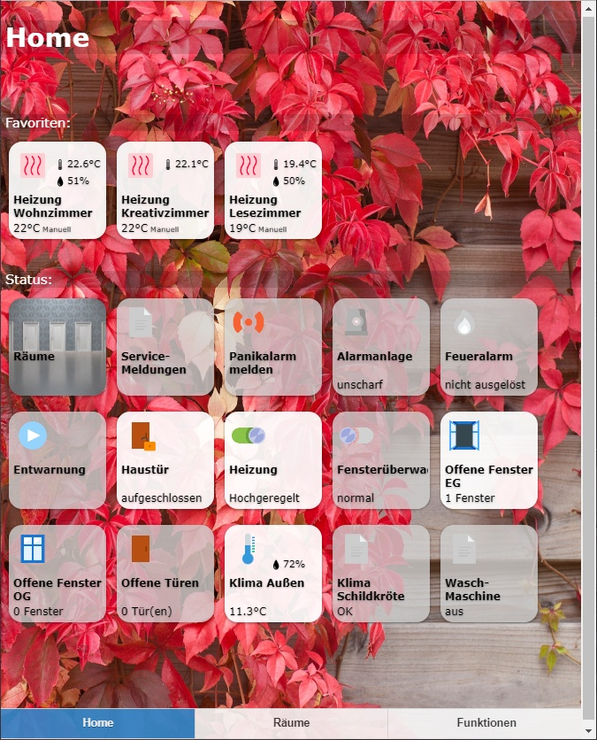

# ioBroker.iqontrol

[](https://www.npmjs.com/package/iobroker.iqontrol)
[](https://www.npmjs.com/package/iobroker.iqontrol)
[](https://david-dm.org/sbormann/iobroker.iqontrol)
[](https://snyk.io/test/github/sbormann/ioBroker.iqontrol)

[](https://nodei.co/npm/iobroker.iqontrol/)

**Tests:** Linux/Mac/Windows: [](https://travis-ci.org/sbormann/ioBroker.iqontrol)
<!-- Windows: [](https://ci.appveyor.com/project/sbormann/ioBroker-iqontrol/) -->

If you like it, please consider a donation.  
  
[](https://www.paypal.com/cgi-bin/webscr?cmd=_s-xclick&hosted_button_id=LDHZMNPXKRX2N&source=url)


## iqontrol adapter for ioBroker

Fast Web-App for Visualization.




Runs in any Browser.
You can save it as Web-App on iOS-Homescreen and it looks and feels like a native app.
It's fully customizable.


## You need...
* Nodejs 8 or higher
* socketIO has to be enabled in web-adapter


## How to use
* Start creating views.
	You can consider views as something like a page.
* Then create devices on these views.
	Devices have a role, that determines the function of the device, which icons are used and so on.
	Depending on that role you can link several states to the device. These will give the device its functionality.
	If you select 'Link to other view' as role you can create links to other views. I suggest skinning Links to other views with the same Background, the linked view has.
	You can also try to use the Autocreate-Function to choose an existing device from the iobroker-object-tree. Autocreate tries to find out the role and to match as many states as possible.
* Afterwards you can create a toolbar, which is displayed as footer.
	Toolbar-Entrys are links to views.
	The first Toolbar-Entry will be your 'Home-View' with will be loaded at start.
* To give everything a fancy style, you can upload your own images.
	You can use your images as background-images for views, or for devices.
	The free builtin demo-wallpapers are from www.pexels.com.


## Known issues
This is the first alpha-Release, so there may be a lot of bugs. But for me it runs completely stable.
However there are a few limitations:
- Uploading images (as background-images or for skinning device-buttons) works, but renaming and deleting does not work
- Creating and deleting sub-directories is also not working.
You can do these operations manually via ftp under iobroker/iobroker-data/files/iqontrol/userimages

Please feel free to comment and let me know, how to fix these issues!

Visit [iobroker forum](https://forum.iobroker.net/topic/22039/neuer-adapter-visualisierung-iqontrol). 


## Description of roles and associated states
Every device has a role, which defines the function of the device. Every role generates a set of states, which can be linked to a corresponding io-broker state.
If you use the auto-create-function, you can choose an existing device from the io-broker-object tree.  Autocreate tries to find out the role and to match as many states as possible.
This will only work for known devices. For unknown devices, and to give devices advanced features, you can add them manually via the (+)-Button or edit the devices that were created by autocreate.
To edit the role and the states of a device, click on the pencil behind the device. You will find a short description of the roles and the used states below:

### General states:
Every role has the following three states:
* **BATTERY**: *boolean* - when true, a little battery-empty-icon will be displayed
* **ERROR**: *boolean* - when true, a little exclamation-mark-icon will be displayed
* **UNREACH**: *boolean* - when true, a little wireless-icon will be displayed

Almost all roles have a STATE- and/or a LEVEL-state. In most cases this represents the main function of the device. You can assign io-broker-states of the following types to it:
* *boolean* - if possible, it will be translated to a senseful text like 'on/off', 'opened/closed' or similar. If you click on the icon of a tile it tries to toggle the boolean (for example to turn a light on or off). If it is not read-only it will generate a flip-switch in the dialog.
* *number* - will be displayed with its corresponding unit and generate a slider in the dialog.
* *string* - a text to be displayed
* *value-list* - the selected value will be displayed. If it is not write-protected it will generate a drop-down-menu in dialog. 
    * Technically a *value-list* is a value with a corresponding translation-list, defined in the 'native.states' or 'common.states' object of the datapoint:
        ````
        "native": {
            "states": {"true": "Text for true", "false": "Text for false"},
            ...
        }
        ````
    * You can create your own value list by adding the states-object to the ```` "native":{}```` part of the datapoint. This will only be read by iQontrol and has no influence to other scripts. 
    * A state-object inside of the ````"common":{}```` part will also be recognized by iQontrol, but with lower priority. If you change it here, it may have influence to other scipts. Even more it may be overwritten by the adapter that created the datapoint.

However, not every type makes sense to every role. So the STATE of a switch for example will be a boolean in most cases, to be able to be toggled between on and off. A string may be displayed, but the switch will not be functional.

### Link to other view:
* Has no further states, but it will respect the **linked-view-property**

###  Switch,  Fan:
* **STATE**: *boolean* - display and set on/off-state
* **POWER**: *number* - power-consumption that will be displayed in small in the upper right corner

###  Light:
Every light may have one or both of the following states:
* **STATE**: *boolean* - display and set on/off-state
* **LEVEL**: *number* - display and set the level of the light

Optional you can define the following states:
* For coloured LEDs (HSB-color-space):
    * **HUE**: *number* - color of the light from 0-360° (hue format)
    * **SATURATION**: *number* - saturation of the light (from white to pure color)
    * **COLOR_BRIGHTNESS**: *number* - the brightness of the colored LEDs (this is only respected, if the light has both, coloured and white LEDs. If you have only one kind of LEDs the brightness is controlled by the LEVEL-State)
* For white LEDs:
    * **CT**: *number* - color-temperature of the light, if it has two shades of white
    * **WHITE_BRIGHTNESS**: *number* - the brightness of the white LEDs (this is only respected, if the light has both, white and coloured LEDs. If you have only one kind of LEDs the brightness is controlled by the LEVEL-State)
* Alternative color-spaces **not yet implemented**:
    * **HUE_MILIGHT**: *number* - Milight uses another staring-point in the hue color-cirlce: 
        ````
		MilightHue = modulo(66 - (hue / 3.60), 100) * 2.55; 
		function modulo(n, m){ 
			return ((n % m) + m) %m;
		}
        ````
    * **RGB_HUEONLY**: *string* - instead of using HUE you can use the RGB_HUEONLY-Format (hex). In this special case the RGB-Format will only accept pure saturated colors of the hue-color-circle. Mixed white is not allowed
    * **RGB**: *string* - instead of using HUE, SATURATION and COLOR_BRIGHTNESS you can use the RGB-Format (hex)
    * **RGBW**: *string* - instead of using HUE, SATURATION, COLOR_BRIGHTNESS and WHITE_BRIGHTNESS you can use the RGBW-Format (hex)
    * **RGBWWCW**: *string* - instead of HUE, SATURATION, COLOR_BRIGHTNESS, CT and WHITE_BRIGHTNESS you can use the RGBWWCW-Format (hex)
* **POWER**: *number* - power-consumption that will be displayed in small in the upper right corner

###  Thermostat:
* **SET_TEMPERATURE**: *number* - goal-temperature
* **TEMPERATURE**: *number* - actual temperature to be displayed in small in the upper right corner
* **HUMIDITY**: *number* - actual humidity to be displayed in small in the upper right corner
* **CONTROL_MODE**: *value-list* - display and set the mode of the thermostat
* **VALVE_STATES**: array of names and numbers - displays the opening of the valves that are associated with the thermostat

###  Homematic-Thermostat:
In addition to normal thermostat you can define:
* **PARTY_TEMPERATURE**: *string* - special-formatted string to define the party- or holiday-mode of homematic-thermostats
* **BOOST_STATE**: *number* - displays the remaining boost-time of homematic-thermostats

###  Temperature-Sensor,  Humidity-Sensor:
* **STATE**: *number* - temperature or humidity that will be displayed in the lower part of the device
* **TEMPERATURE**: *number* - temperature that will be displayed in small in the upper right corner
* **HUMIDITY**: *number* - humidity that will be displayed in small in the upper right corner
* Respects the **linked-view-property**

###  Brightness-Sensor:
* **STATE**: *number* - brightness that will be displayed in the lower part of the device
* **BRIGHTNESS**: *number* - brightness that will be displayed in small in the upper right corner
* Respects the **linked-view-property**

###  Motion-Sensor:
* **STATE**: *boolean* - display if motion is detected or not
* Respects the **linked-view-property**

###  Door,  Window:
* **STATE**: *boolean* - display if the door or window is opened or closed. 
    * Alternatively you can assign a *value-list*, to display additional states like 'tilted'.
    * You can also assign a *string* to display any text like "3 windows open" or "all closed".
* Respect the **linked-view-property**

###  Door with lock:
* **STATE**: *boolean* - display if the door is opened or closed. 
* **LOCK_STATE**: *boolean* - display if the door is locked or unlocked
* **LOCK_STATE_UNCERTAIN**: *boolean* - the STATE will be displayed in italic-font, if true to represent that the exact position of the lock is unknown
* **LOCK_OPEN**: *boolean* - if set to true, the door will open completely

###  Blind:
* **LEVEL**: *number* - height of the blind in percentage
* **DIRECTION**: *value-list* - can be Stop, Up and Down
* **STOP**: *boolean* - if set to true, the blind will stop

###  Fire-Sensor:
* **STATE**: *boolean* - if true the sensor will be displayed as triggered
    * Alternatively you can assign a *value-list*, to display additional states like 'tampered'.
    * You can also assign a *string* to display any text like "fire in upper floor".
* Respects the **linked-view-property**

###  Alarm:
* **STATE**: *boolean* - if true the sensor will be displayed as triggered
    * Alternatively you can assign a *value-list*, to display additional states like 'tampered'.
    * You can also assign a *string* to display any text like "fire in upper floor".

###  Battery:
* **STATE**: *number* - battery level in percentage
* **CHARGING**: *boolean* - if true, a charging-icon is displayed

###  Value:
* **STATE**: *any* - any valid state to be displayed (have a look at general states-section)
* **LEVEL**: *number* - will produce a slider in dialog

###  Program:
* **STATE**: *boolean* - if set to true, the program will be started

###  Scene:
* **STATE**: *boolean* - displays, if the scene is active. If set to true, the scene will be started

###  Button:
* **STATE**: *any* - any desired type of state
* **SET_VALUE**: CONSTANT *string* - this is a constant (not a linked io-broker-state!) that will be assigned to the STATE if the button is pressed

###  Popup:
* **STATE**: *any* - can be used to display further information
* **URL**: CONSTANT *string* - this url will be opened as iframe inside popup
* **HTML**: CONSTANT *string* - this markup will be displayed inside the popup if no URL is specified

###  External Link:
* **STATE**: *any* - can be used to display further informations
* **URL**: CONSTANT *string* - this url will be opened


## Developing
* Have a look at [Operating Principle of Frontend](Operating%20Principle%20of%20Frontend.md)


****

# Changelog

### 0.0.32
* (Sebastian Bormann) Added Battery
* (Sebastian Bormann) Heaters are displayed as inactive, if set-value is at its minimum
* (Sebastian Bormann) Added meta.user object to allow backup of user uploaded files via iobroker backup
* (Sebastian Bormann) Added check for existance of common.role before rendering view

### 0.0.31
* (Sebastian Bormann) Fixed some typos.
* (Sebastian Bormann) Enhanced colour-mixing of light with seperate brightness-datapoints for color and white.
* (Sebastian Bormann) Rewritten rendering of view as praparation for further enhancements.
* (Sebastian Bormann) Rewritten rendering of dialog as praparation for further enhancements.
* (Sebastian Bormann) Added option to colorize Device-Texts.

### 0.0.30
* (Sebastian Bormann) Fixed io-package.json

### 0.0.29
* (Sebastian Bormann) changed parts of the code to be backward-compatible to older browsers like ie 11.
* (Sebastian Bormann) Now its possible to define a value list for a data point under .native.states wich will have a greater priority than a value list under .common.states. 
* (Sebastian Bormann) Updated dependency for axios to 0.0.19 to fix a scurity issue.

### 0.0.28
* (Sebastian Bormann) Added datapoint POWER to switch, fan and light.
* (Sebastian Bormann) Fixed marquee for small info texts in the upper right corner at big screen sizes.
* (Sebastian Bormann) Added more options for configuring header-colors and device-colors (experimental state). Text-color ist not configurable yet.

### 0.0.27
* (Sebastian Bormann) Added marquee (scrolling text) for long states and device names (can be configured  in options). 
* (Sebastian Bormann) Added more toolbar-options. 
* (Sebastian Bormann) Enhanced handling of value lists. 
* (Sebastian Bormann) Disabled swiping when dialog is opened.

### 0.0.26
* (Sebastian Bormann) Added brightness to motion-sensor.
* (Sebastian Bormann) Added options tab. You can now configure colors of toolbar.
* (Sebastian Bormann) Fixed rendering of constants.
* (Sebastian Bormann) Resized the demo-wallpapers for faster loading.

### 0.0.25
* (Sebastian Bormann) Added motion-sensor.
* (Sebastian Bormann) Added description, how the frontend works: [Operating Principle of Frontend](Operating%20Principle%20of%20Frontend.md).
* (Sebastian Bormann) Added dialog for editing constants like SET_VALUE, URL or HTML.
* (Sebastian Bormann) Changed the way arrays are stored.
* (Sebastian Bormann) Added submit-button for values of type string.
* (Sebastian Bormann) Added saturation to hue-lights.
* (Sebastian Bormann) Better icons for color-temperature and brightness-sensor.

### 0.0.24
* (Sebastian Bormann) Fixed jittering on Safari while scrolling (was related to Pull2Refresh).
* (Sebastian Bormann) System language of iobroker will be loaded and used.

### 0.0.23
* (Sebastian Bormann) Rewrote how constant values (instead of linkedStates) are handeled - this is a requirement for further development.
* (Sebastian Bormann) Fixed Pull2Refresh on android devices / chrome.
* (Sebastian Bormann) Added external links
* (Sebastian Bormann) Added popups with iframes

### 0.0.22
* (watcherkb) Improved german translation.
* (BramTown) Improved german translation.
* (Sebastian Bormann) Short after another coming reconnect-events (<5s) are ignored now.

### 0.0.21
* (Sebastian Bormann) Added Pull2Refresh on mobile devices - reloads whole page when pulling down on homepage, otherwise only the acual view is reloaded.
* (Sebastian Bormann) Improved reloading on reconnect (hoepefully to get it finally good working on iOS 12.2).

### 0.0.20
* (Sebastian Bormann) New trial to get it working in iOS 12.2.

### 0.0.19
* (Sebastian Bormann) Improved reloading of page in new PWA-Mode of iOS 12.2.

### 0.0.18
* (Sebastian Bormann) Improved fetching of VALVE_STATES.
* (Sebastian Bormann) Changed Button Icon.
* (Sebastian Bormann) Added Loading-Spinner if disconnected.
* (Sebastian Bormann) Due to new iOS 12.2 PWA-Mode added visibility-check and connectivity-check.
* (Sebastian Bormann) Added role-icons to role-selectbox in edit device dialog.
* (Sebastian Bormann) Fixed missing value-list for states of the type string.

### 0.0.17
* (Sebastian Bormann) Changed description of slider (level/dimmer/value/height).

### 0.0.16
* (Sebastian Bormann) Role of device is displayed in devices-table.
* (Sebastian Bormann) VALVE_STATES is now editable via GUI (show opening of valves associated with a thermostat in percentage).
* (Sebastian Bormann) Added Role 'Button': You can define a constant SET_VALUE wich will be written to the ID that is linked with STATE if the button is pressed.
* (Sebastian Bormann) Rewritten parts of front-end to guarentee better compatibility. Boost-Mode for Homematic-Thermostat should work now.
* (Sebastian Bormann) Added state BOOST_STATE for Homematic-Thermostat - ability to display remaining boost-time if in boost-mode.
* (Sebastian Bormann) Added dessription of roles and corresponding states.
* (Sebastian Bormann) Temperature und Humidity-Sensors can now display a STATE at bottom of device, and both, TEMPERATURE and HUMIDITY, in small in the upper right corner.
* (Sebastian Bormann) Better handling of Auto-Create of Temperature- und Humidity-Sensors.
* (Sebastian Bormann) German translation: 'geöffnet' lower case.
* (Sebastian Bormann) Zigbee humidity and temperature added to auto-creation.
* (Sebastian Bormann) Fixed not scrollable selectbox at devices tab.

### 0.0.15
* (Sebastian Bormann) Improved check for value type of states.
* (Sebastian Bormann) Improved slider-tooltip to lower font-size at large numbers.

### 0.0 14
* (Sebastian Bormann) If role of state is not further specified, then check for role of parent object.

### 0.0.13
* (Sebastian Bormann) Doors and Windows now force true/false to be translated to opened/closed.
* (Sebastian Bormann) Double Entrys on WelcomeScreen/Overview removed.
* (Sebastian Bormann) States are now set with the correct value type.
* (Sebastian Bormann) Changed recognition of state types. I hope there are no new bugs now!

### 0.0.12
* (Sebastian Bormann) Check for unallowed chars in object names.
* (Sebastian Bormann) Check for duplicates in view names.
* (Sebastian Bormann) Level fires a slider in dialog - even when it has a state list (HUE again :)).
* (Sebastian Bormann) Added Blinds (Homematic) - please test it, i don't have one to test.

### 0.0.11
* (Sebastian Bormann) Added compatibility for edge and firefox. 
* (Sebastian Bormann) Again Hue bugfixes.
* (Sebastian Bormann) Removed Tooltip from Toolbar.

### 0.0.10
* (Sebastian Bormann) Added ColorTemperature. Hoepfully HUE works now? Can't test ist, because i do not own any hue lamp :)

### 0.0.9
* (Sebastian Bormann) Philips HUE added to autocreate (colortemp is not working yet!).  
* (Sebastian Bormann) LinkedView now also works on windows, doors and fire-sensor.
* (Sebastian Bormann) Added translation (thanks ldittmar!).

### 0.0.8
* (Sebastian Bormann) Added icons to image selectboxes.

### 0.0.7
* (Sebastian Bormann) Changed order of tabs
* (Sebastian Bormann) Autocreate for shelly should work now (i hope so, can't test it here)

### 0.0.6
* (Sebastian Bormann) Improved speed of select id and autocreate
* (Sebastian Bormann) Set filter to channel on autocreate

### 0.0.5
* (Sebastian Bormann) Bugfix: creation of many devices schould work now

### 0.0.4
* (Sebastian Bormann) Bugfix: copy device created just a reference to old object
* (Sebastian Bormann) Addes Toolbar-Icons

### 0.0.3
* (Sebastian Bormann) various bugfixes

### 0.0.2
* (Sebastian Bormann) first partly running version

### 0.0.1
* (Sebastian Bormann) initial release

## License
MIT License

Copyright (c) 2019 Sebastian Bormann

Permission is hereby granted, free of charge, to any person obtaining a copy
of this software and associated documentation files (the "Software"), to deal
in the Software without restriction, including without limitation the rights
to use, copy, modify, merge, publish, distribute, sublicense, and/or sell
copies of the Software, and to permit persons to whom the Software is
furnished to do so, subject to the following conditions:

The above copyright notice and this permission notice shall be included in all
copies or substantial portions of the Software.

THE SOFTWARE IS PROVIDED "AS IS", WITHOUT WARRANTY OF ANY KIND, EXPRESS OR
IMPLIED, INCLUDING BUT NOT LIMITED TO THE WARRANTIES OF MERCHANTABILITY,
FITNESS FOR A PARTICULAR PURPOSE AND NONINFRINGEMENT. IN NO EVENT SHALL THE
AUTHORS OR COPYRIGHT HOLDERS BE LIABLE FOR ANY CLAIM, DAMAGES OR OTHER
LIABILITY, WHETHER IN AN ACTION OF CONTRACT, TORT OR OTHERWISE, ARISING FROM,
OUT OF OR IN CONNECTION WITH THE SOFTWARE OR THE USE OR OTHER DEALINGS IN THE
SOFTWARE.