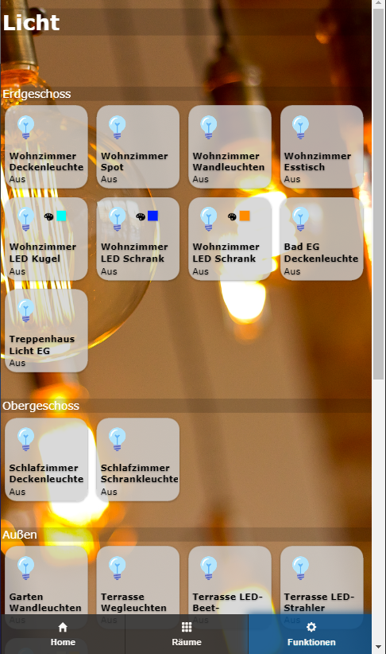
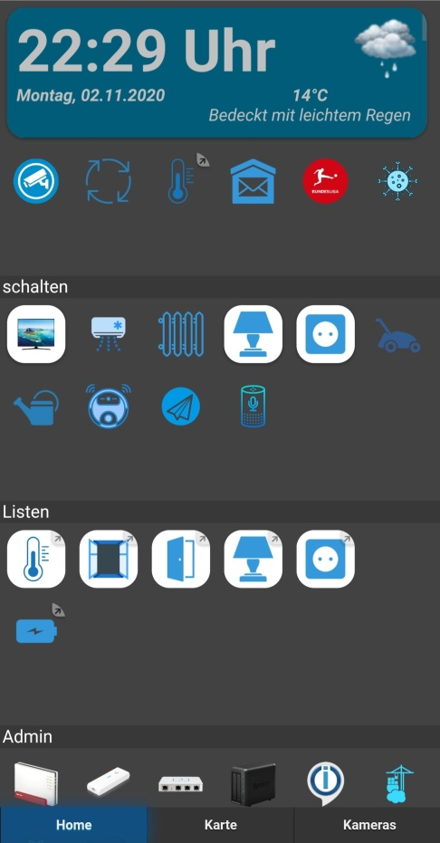
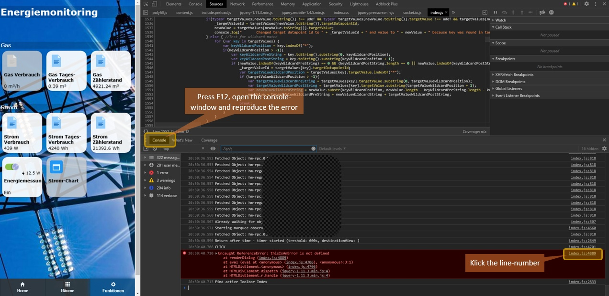

# ioBroker.iqontrol

 
 
[](https://www.npmjs.com/package/iobroker.iqontrol)
[](https://www.npmjs.com/package/iobroker.iqontrol)
[](https://david-dm.org/sbormann/iobroker.iqontrol)
[](https://snyk.io/test/github/sbormann/ioBroker.iqontrol)

[](https://nodei.co/npm/iobroker.iqontrol/)

**Tests:**

| Linux/Mac/Windows: | Cross-Browser-Checking: |
| --- | --- |
| [](https://travis-ci.org/sbormann/ioBroker.iqontrol) | [](https://www.browserstack.com) |

<!-- Windows: [](https://ci.appveyor.com/project/sbormann/ioBroker-iqontrol/) -->

\
**If you like it, please consider a donation:**
  
[](https://www.paypal.com/cgi-bin/webscr?cmd=_s-xclick&hosted_button_id=LDHZMNPXKRX2N&source=url)


****

## iqontrol adapter for ioBroker

Fast Web-App for Visualization. 


\


\


\


\


\


Runs in any Browser. 
Easy to setup, allthough it's fully customizable and responsive.

> **This adapter uses Sentry libraries to automatically report exceptions and code errors to the developers.** For more details and for information how to disable the error reporting see [Sentry-Plugin Documentation](https://github.com/ioBroker/plugin-sentry#plugin-sentry)! Sentry reporting is used starting with js-controller 3.0.


## Add to Homescreen
You can save it as Web-App on Homescreen and it looks and feels like a native app:


## You need...
* Nodejs 10 or higher
* Web-Adapter with one instance running the same protocol (http or https) as the admin-adapter, socket.IO set to 'integrated' and 'Force Web-Sockets' disabled
    * If this stands in conflict to other adapters, simply add another instance with the above settings - iQontrol will search the besst fitting web-adapter-instance and use it for communication
	* For connecting over *iobroker.pro-Cloud* both, admin- and web-adapter should be set to http (not https)

* If you experience any problems, please have a look at the [troubleshooting](#troubleshooting) section at the end of this readme


## Forum
Visit [iobroker forum](https://forum.iobroker.net/topic/22039/neuer-adapter-visualisierung-iqontrol). 


## How to use
**Don't be scared of the many options you have.**
Most things work right out of the box. You *can*, but you don't have to use all the configuration-possibilities iQontrol offers! Just start this way:
* Start creating views.
	You can consider views as something like a page.
* Then create devices on these views.
	Devices have a role, that determines the function of the device, which icons are used and so on.
	Depending on that role you can link several states to the device. These will give the device its functionality.
	If you select 'Link to other view' as role you can create links to other views. I suggest skinning Links to other views with the same Background, the linked view has.
	You can also try to use the Autocreate-Function to choose an existing device from the iobroker-object-tree. Autocreate tries to find out the role and to match as many states as possible.
* Afterwards you can create a toolbar, which is displayed as footer.
	Toolbar-Entrys are links to views.
	The first Toolbar-Entry will be your 'Home-View' with will be loaded at start.
* To give everything a fancy style, you can upload your own images.
	You can use your images as background-images for views, or for devices.
	Images in the folder '/usericons' can be used as icons for devices.
	The free builtin demo-wallpapers are from www.pexels.com.

### Use Autocreate
* You'll find a ``Autocreate Views``-Button inside the  ``Views``-Tab
* If you have well maintained ioBroker enumerations like Rooms or Functions, you can use this function to automatically build Views with the devices listed inside this enumerations
* Keep in mind, because of the large numbers of different adapters and devices inside the ioBroker-univese, the autocration feature can not maintain all devices 100% correctly. You may need to rework some of the settings by hand to get the best results. But autocreate offers you a good starting point to build your own visualization in seconds. 


## URL-Parameters
* The frontend is called via ``http[s]://<url or ip of iobroker>:<port of web adapter>/iqontrol/index.html``
    * ``<port of web adapter>`` is usually 8082
* To open a specified instance you can add ``namespace=iqontrol.<instance-number>`` as URL-parameter
* To open a specified view you can add ``renderView=<viewID>`` as URL-parameter.
    * ``<viewID>`` needs to be formatted like ``iqontrol.<instance-number>.Views.<view-name>``
	* Note: this is case-sensitive!
* To open a specified view as homepage you can add ``home=<viewID>`` as URL-parameter. This will also change the linked view of the first toolbar entry!
    * ``<viewID>`` needs to be formatted like ``iqontrol.<instance-number>.Views.<view-name>``
	* Note: this is case-sensitive!
* To open a specified dialog while loading the page you can add ``openDialog=<deviceID>`` as URL-parameter
    * ``<deviceID>`` needs to be formatted like ``iqontrol.<instance-number>.Views.<view-name>.devices.<device-number>`` where ``<device-number>`` starts from 0 (so the first device on a view is device number 0)
	* Note: this is case-sensitive!
* To set or override return after time settings, use the following parameters:
    * ``returnAfterTimeTreshold=<time in seconds>`` to set the time, after which the destination view is called. Use ``0`` to disable return after time feature.
	* ``returnAfterTimeDestiationView=<viewID>`` to set the view, which is called after the threshold. If not specified, the home view will be used.
	* These options are helpful, if you call iQontrol from an wall mounted tablet, which should automatically return to home-view after being used 
* To load the page without toolbar you can add ``noToolbar=true``
* To load the page without panel you can add ``noPanel=true``
* To load the page without toolbar and panel, swiping deactivated, no loading-spinner and with transparent loading-screen you can add ``isBackgroundView=true``

**Example:**
* ``https://192.168.1.1:8082/iqontrol/index.html?namespace=iqontrol.1&home=iqontrol.1.Views.Living-Room``
    * Note upper and lower case


## Icons and Background-Images
* You can use the inbuilt images or the images uploaded under the images tab or any free url you like
* You can also use a variable inside the image-url. This may be useful for example for weather-forecasts. Use this pattern:
    * ``path/to/firstloaded.png|anotherpath/to/{iobrokerstate|fallback}.png``
    * Example: ``./../iqontrol.meta/userimages/demo/bottle.jpg|./../iqontrol.meta/userimages/demo/{javascript.0.myimage|whitestone}.jpg`` 
	* This loads ``./../iqontrol.meta/userimages/demo/bottle.jpg`` when you open the view
	* As soon as the state of ``javascript.0.myimage`` is fetched from the server, the image will be replaced with ``./../iqontrol.meta/userimages/demo/XXX.jpg`` where ``XXX`` is the value of ``javascript.0.myimage``
	* If ``javascript.0.myimage`` has no value the fallback ``whitestone`` will be used (using the fallback is optional)

### Progress Bars
* It is possible, to use SVG-Definitions in combination with variables instead of imagefiles to display progress-bars
* There are a vew templates integrated to chose from, but you can also create your own SVGs


* See [Wiki](https://github.com/sbormann/ioBroker.iqontrol/wiki/Progress-Bars) for further informations


## Device-Names
* Just like variables in image-urls you can use variables in device-names. The syntax is almost the same:
    * ``Text while loading|Text after loading {iobrokerstate|fallback}``
	* Additionally can put the iobrokerstate into square brackets, then the plain value without its unit will be used: ``Text while loading|Text after loading {[iobrokerstate]|fallback}``
    * Example: ``Weather is loading|Weather: {javascript.0.weather|No weather data found}`` 
	* This shows ``Weather is loading`` when you open the view
	* As soon as the state of ``javascript.0.weather`` is fetched from the server, the text will be replaced by ``Weather: XXX`` where ``XXX`` is the value of ``javascript.0.weather``
	* If ``javascript.0.weather`` has no value the fallback ``No weather data found`` will be used (using the fallback is optional)


## Popup-Messages
* Every instance creates the state ``iqontrol.x.Popup.Message``
* When passing values to this state, a popup-message (or toast) will be displayed
* You can use html-tags to format the message text
* There are some additional states for further customization of the displayed popup (these must be set, before the message datapoint is set):
    * ``Duration``: This is the time in ms the message is displayed; if set to 0 the message has to be confirmed
    * ``ClickedValue`` and ``ClickedDestinationState``: If the popup is clicked by user, the value from ``ClickedValue`` will be sent to ``iqontrol.x.Popup.POPUP_CLICKED`` and, if specified, additional to the datapoint in ``ClickedDestinationState`` 
        * If no value is specified, ``true`` will be used
    * ``ButtonNames``: Here you can specify a comma separated list of buttons, that will be displayed at the bottom of the popup (for example "OK,Abort")
        * ``ButtonValues`` and ``ButtonDestinationStates``: These are comma separated lists of values that will be sent to ``iqontrol.x.Popup.BUTTON_CLICKED`` and, if specified, additional to the datapoint in ``ButtonDestinationStates``, if the user clickes the corresponding button
		    * Instead of a datapoint you can use the commands ``COMMAND:renderView`` and ``COMMAND:openDialog`` as a ButtonDestinationState, to render a view or open a dialog
			* The ButtonValue then specifies the view resp. dialog and needs to be in the format ``iqontrol.<instance-number>.Views.<view-name>`` resp. ``iqontrol.<instance-number>.Views.<view-name>.devices.<device-number>`` where ``<device-number>`` starts from 0 (so the first device on a view is device number 0)
		* If you only use one value (instead of a comma separated list), this value will be used for all buttons
		* If you leave ``ButtonValues`` empty, the name of the button will be used
		* If you only use one destination state (instead of a comma separated list), this state will be used for all buttons
        * ``ButtonCloses``: This is a comma separated list of booleans (``true``/``false``) that specify, if the popup should be closed, when the corresponding button is pressed
* Alternatively you can set these values via sendTo-command with the parameters ``PopupMessage``, ``PopupDuration``, ``PopupClickedValue`` and so on
    * Example: ``sendTo("iqontrol", "send", {PopupMessage: 'This is my message', PopupDuration: 2500, PopupClickedValue: 'messageConfirmed'});``
* You can also use blockly to send messages to iQontrol


## Widgets
* Every tile has a BACKGROUND_URL and a BACKGROUND_HTML datapoint
* Here you can define a link (via BACKGROUND_URL) to a website or place direct HTML-Code (via BACKGROUND_HTML), that will be displayed as background of the tile
* This gives you the possibility to place (interactive) content inside a tile (like clocks, FLOT-charts, tables, weather-forecasts and so on)
* By default mouse events will be directed to this content (thus you can't click the tile itself any more), but you can disable this with the option "Direct mouse events to the tile instead to the content of BACKGROUND_VIEW/URL/HTML"
* iQontrol offers an device-role "Widget" which has some predefined options set that will be mostly used when showing a website as widget. But you can achieve the same result with any other role by modifying the devices options properly.


### postMessage-Communication (for experts only)
* Technically the content of BACKGROUND_VIEW/URL/HTML is placed inside a HTML-Element called iframe, which is a website inside a website
* By enabling the option "Allow postMessage-Communication for BACKGROUND_VIEW/URL/HTML" you can enable postMessage-Communication between the website inside this iframe and iQontrol itself
* To send commands to iQontrol you can use the following javascript-command: ``window.parent.postMessage(message, "*");`` 
    * ``message`` is a javascript object of the format ``{ command: command, stateId: stateId, value: value }``
    * The following message-commands are supported:
        * ``{ command: "setWidgetState", stateId: <widgetStateId>, value: <value> }``
			* This will set the ioBroker state ``iqontrol.<instance>.Widgets.<widgetStateId>`` to the value ``<value>`` (``<value>`` can be a string, number or boolean or an object like ``{ val: <value>, ack: true|false }``)
        * ``{ command: "getWidgetState", stateId: <widgetStateId> }``
			* This will cause iQontrol to send the value of the ioBroker state ``iqontrol.<instance>.Widgets.<widgetStateId>`` (see below how to receive the answer-message)
        * ``{ command: "getWidgetStateSubscribed", stateId: <widgetStateId> }``
			* This will cause iQontrol to send the value of the ioBroker state ``iqontrol.<instance>.Widgets.<widgetStateId>`` now and every time its value changes (see below how to receive the answer-messages)
        * ``{ command: "setWidgetDeviceState", stateId: <widgetDeviceState>, value: <value> }``
			* This will set the ioBroker datapoint that is assigned to the devices STATE ``<widgetDeviceState>`` (for example the datapoint, that is assigned to LEVEL) to the value ``<value>`` (``<value>`` can be a string, number or boolean or an object like ``{ val: <value>, ack: true|false }``)
        * ``{ command: "getWidgetDeviceState", stateId: <widgetDeviceState> }``
			* This will cause iQontrol to send the value of the ioBroker datapoint, that is assigned to the devices STATE ``<widgetDeviceState>`` (for example the datapoint, that is assigned to LEVEL; see below how to receive the answer-message)
        * ``{ command: "getWidgetDeviceStateSubscribed", stateId: <widgetDeviceState> }``
			* This will cause iQontrol to send the value of the ioBroker datapoint, that is assigned to the devices STATE ``<widgetDeviceState>`` (for example the datapoint, that is assigned to LEVEL) now and every time its value changes (see below how to receive the answer-message)
        * ``{ command: "setState", stateId: <stateId>, value: <value> }``
			* This will set the ioBroker state ``<stateId>`` to the value ``<value>`` (``<value>`` can be a string, number or boolean or an object like ``{ val: <value>, ack: true|false }``)
        * ``{ command: "getState", stateId: <stateId> }``
			* This will cause iQontrol to send the value of the ioBroker state ``<stateId>`` (see below how to receive the answer-message)
        * ``{ command: "getStateSubscribed", stateId: <stateId> }``
			* This will cause iQontrol to send the value of the ioBroker state ``<stateId>`` now and every time its value changes (see below how to receive the answer-messages)
        * ``{ command: "renderView", value: <viewID> }``
			* This will instruct iQontrol to render a view, where ``<viewID>`` needs to be formatted like ``iqontrol.<instance-number>.Views.<view-name>`` (case-sensitive)
        * ``{ command: "openDialog", value: <deviceID> }``
			* This will instruct iQontrol to open a dialog, where ``<deviceID>`` needs to be formatted like ``iqontrol.<instance-number>.Views.<view-name>.devices.<device-number>`` where ``<device-number>`` starts from 0 (so the first device on a view is device number 0)
* To receive messages from iQontrol, you need to register an event-listener to the "message"-event with the javascript-command ``window.addEventListener("message", receivePostMessage, false);``
    * The function ``receivePostMessage`` receives the object ``event``
	* ``event.data`` contains the message from iqontrol, which will be an object like:
	    * event.data = ``{ command: "getState", stateId: <stateId>, value: <stateObject> }`` - this will be the answer to a getState-command or a getStateSubsribed-command and gives you the actual ``<value>``-object of the ioBroker state``<stateId>``
		* ``<stateObject>`` itself is an object like 
			````javascript
			event.data.value = {
				val: <value (rounded)>,
				unit: "<unit>",
				valFull: <value (not rounded)>,
				plainText: "<clear text of val, for example taken from valuelist>",
				min: <minimum>,
				max: <maximum>,
				step: <step-width>,
				valuelist: {<object with possible values and corresponding clear text>},
				targetValues: {<target value list>},
				ack: <true|false>,
				readonly: <true|false>,
				custom: {<object with custom settings>},
				id: <id of the iobroker datapoint>,
				from: "<source of state>",
				lc: <timestamp of last change>,
				ts: <timestamp of last actualization>,
				q: <quality of signal>,
				role: "<role of state>",
				type: "<string|number|boolean>"
			}
			````
* To instruct iQontrol to generate a widgetState under ``iqontrol.<instance>.Widgets`` you can use a meta-tag inside the head-section of the widget-website:
    * Syntax: ``<meta name="widget-datapoint" content="WidgetName.StateName" data-type="string" data-role="text" />``
	* You can further configure the datapoint by using data-type (which can be set to string, number or boolean), data-role, data-name, data-min, data-max, data-def and data-unit attributes
    * The corresponding datapoint is only then created, if the widget-website is added to a device as URL or BACKGROUND_URL	
* The same concept may be used for the URL/HTML-State, which is used to display a website inside the dialog of a device
* To create an icon for your widget place a .png file with the same filename as the widget into the widgets directory
* See below for an example widget-website:

<details>
<summary>Show example widget-website to be displayed as widget with postMessage-communication:</summary>

* You can use the following HTML code and copy it to the BACKGROUND_HTML-State of a widget (which then needs to be configured as "Constant") 
* As an alternative you can upload this code as html-file into the /userwidgets subdirectory and reference it to BACKGROUND_URL-State (which then also needs to be configured as "Constant")
* Acitvate the option "Allow postMessage-Communication for BACKGROUND_VIEW/URL/HTML"
* It will demonstrate how a two-way communication between the website and iQontrol is done
````html
<!doctype html>
<html>
<head>
	<meta http-equiv="Content-Type" content="text/html; charset=UTF-8"/>
	<meta name="widget-datapoint" content="postMessageTest.test" data-type="string" data-role="text" />
	<meta name="widget-description" content="This is a test widget. To get the WidgetDeviceState-Functions working, please set a valid iobroker-datapoint for STATE. (C) by Sebastian Bormann"/> 
	<meta name="widget-urlparameters" content="title/postMessageTest/Please enter a title">
	<meta name="widget-options" content="{'noZoomOnHover': 'true', 'hideDeviceName': 'true', 'sizeInactive': 'xwideIfInactive highIfInactive', 'iconNoPointerEventsInactive': 'true', 'hideDeviceNameIfInactive': 'true', 'hideStateIfInactive': 'true', 'sizeActive': 'xwideIfActive highIfActive', 'bigIconActive': 'true', 'iconNoPointerEventsActive': 'true', 'hideDeviceNameIfActive': 'true', 'hideStateIfActive': 'true', 'sizeEnlarged': 'fullWidthIfEnlarged fullHeightIfEnlarged', 'bigIconEnlarged': 'true', 'iconNoPointerEventsEnlarged': 'false', 'noOverlayEnlarged': 'true', 'hideDeviceNameIfEnlarged': 'true', 'hideStateIfEnlarged': 'true', 'popupAllowPostMessage': 'true', 'backgroundURLAllowPostMessage': 'true', 'backgroundURLNoPointerEvents': 'false'}"/>
 	<title>iQontrol postMessageTest</title>
</head>
<body>
	<br><br>
	<h3><span id="title">postMessageTest</span><h3>
	<button onclick="getWidgetState('postMessageTest.test')">getWidgetState postMessageTest.test</button><br>
	<button onclick="getWidgetStateSubscribed('postMessageTest.test')">getWidgetStateSubscribed postMessageTest.test</button><br>
	<button onclick="setWidgetState('postMessageTest.test', 'Hello world')">setWidgetState postMessageTest.test to 'Hello world'</button><br>
  	<br>
	<button onclick="getWidgetDeviceState('STATE')">getWidgetDeviceState STATE</button><br>
	<button onclick="getWidgetDeviceStateSubscribed('STATE')">getWidgetDeviceStateSubscribed STATE</button><br>
	<button onclick="setWidgetDeviceState('STATE', 'Hello world')">setWidgetDeviceState STATE to 'Hello world'</button><br>
  	<br>
	<button onclick="getState('system.adapter.admin.0.cpu')">getState system.adapter.admin.0.cpu</button><br>
	<button onclick="getStateSubscribed('system.adapter.admin.0.uptime')">getStateSubscribed system.adapter.admin.0.uptime</button><br>
	<button onclick="setState('iqontrol.0.Popup.Message', 'Hey, this is a test Message')">setState popup message</button><br>
  	<br>
	<button onclick="renderView('iqontrol.0.Views.Home')">renderView 'Home'</button><br>
	<button onclick="openDialog('iqontrol.0.Views.Home.devices.0')">openDialog 1st device on 'Home'</button><br>
	<br><hr>
	message sent: <span id="messageSent">-</span><br>
	<br><hr>
	message received: <span id="messageReceived">-</span><br>
	<br><hr>
	this means: <span id="thisMeans">-</span><br>
	<br><hr>
    <script type="text/javascript">
		var countSend = 0;
		var countReceived = 0;
		
		//Set title from UrlParameter
		document.getElementById('title').innerHTML = getUrlParameter('title') || "No Title set";
			
		//getWidgetState
		function getWidgetState(stateId){
			sendPostMessage("getWidgetState", stateId);
		}
      
		//getWidgetStateSubscribed (this means, everytime the state changes, an update will be received)
		function getWidgetStateSubscribed(stateId){
			sendPostMessage("getWidgetStateSubscribed", stateId);
		}
		
		//setWidgetState
		function setWidgetState(stateId, value){
			sendPostMessage("setWidgetState", stateId, value);
		}

		
		//getWidgetDeviceState
		function getWidgetDeviceState(stateId){
			sendPostMessage("getWidgetDeviceState", stateId);
		}
      
		//getWidgetDeviceStateSubscribed (this means, everytime the state changes, an update will be received)
		function getWidgetDeviceStateSubscribed(stateId){
			sendPostMessage("getWidgetDeviceStateSubscribed", stateId);
		}
		
		//setWidgetDeviceState
		function setWidgetDeviceState(stateId, value){
			sendPostMessage("setWidgetDeviceState", stateId, value);
		}
      
		
		//getState
		function getState(stateId){
			sendPostMessage("getState", stateId);
		}

		//getStateSubscribed (this means, everytime the state changes, an update will be received)
		function getStateSubscribed(stateId){
			sendPostMessage("getStateSubscribed", stateId);
		}
		
		//setState
		function setState(stateId, value){
			sendPostMessage("setState", stateId, value);
		}
      

		//renderView
		function renderView(viewId){
			sendPostMessage("renderView", null, viewId);
		}

		//openDialog
		function openDialog(deviceId){
			sendPostMessage("openDialog", null, deviceId);
		}
		
		// +++++ Default Functions +++++		
		//getUrlParameter
		function getUrlParameter(name) {
			name = name.replace(/[\[]/, '\\[').replace(/[\]]/, '\\]');
			var regex = new RegExp('[\\?&]' + name + '=([^&#]*)');
			var results = regex.exec(location.search);
			return results === null ? null : decodeURIComponent(results[1].replace(/\+/g, ' '));
		};
      
		//send postMessages
		function sendPostMessage(command, stateId, value){
			countSend++;
			message = { command: command, stateId: stateId, value: value };
			document.getElementById('messageSent').innerHTML = countSend + " - " + JSON.stringify(message);
			window.parent.postMessage(message, "*");
		}

		//receive postMessages
		window.addEventListener("message", receivePostMessage, false);
		function receivePostMessage(event) { //event = {data: message data, origin: url of origin, source: id of sending element}
			countReceived++;
			if(event.data) document.getElementById('messageReceived').innerHTML = countReceived + " - " + JSON.stringify(event.data);
			if(event.data && event.data.command) switch(event.data.command){
				case "getState":
				if(event.data.stateId && event.data.value && event.data.value.val){
					document.getElementById('thisMeans').innerHTML = "Got State " + event.data.stateId + " with value " + event.data.value.val;
				}
				break;
			}
		}	
	</script>
</body>
</html>
````
</details>

### Further configuration of widgets
* There are additional meta-tags, you can use inside the head-section of your widget-website to configure the behavior of the widget:
	* 'widget-description'
		* syntax: ``<meta name="widget-description" content="Please see www.mywebsite.com for further informations. (C) by me"/>``
		* The content will be displayed when chosing the widget as URL or BACKGROUND_URL or if you autocreate a widget
	* 'widget-urlparameters'
		* syntax: ``<meta name="widget-urlparameters" content="parameter/default value/description/type;parameter2/default value2/description2/type2"/>``
		* The user will be asked for these parameter when chosing the widget as URL or BACKGROUND_URL or autocreates a widget
		* ``type`` is optional and may be ``text`` (this is dafault), ``number``, ``checkbox``, ``color``, ``select`` or ``multipleSelect``
		    * If type is ``select`` or ``multipleSelect`` then you need to specify the possible options by adding ``/<selectOptions>``, where ``<selectOptions>`` is a string of the format ``<value1>,<caption1>/<value2>,<caption2>/...``
		    * If type is ``number`` then can specify min, max and step-width by adding ``/<numberOptions>``, where ``<numberOptions>`` is a string of the format ``<min>,<max>,<step>``
		* All these parameters will be given to the widget-website via an url-parameter-string (like ``widget.html?parameter=value&parameter2=value2``)
		* You can use these settings inside your widget-website by requesting the url-parameters with a function like this:
			````javascript
			function getUrlParameter(name) {
				name = name.replace(/[\[]/, '\\[').replace(/[\]]/, '\\]');
				var regex = new RegExp('[\\?&]' + name + '=([^&#]*)');
				var results = regex.exec(location.search);
				return results === null ? null : decodeURIComponent(results[1].replace(/\+/g, ' '));
			};
			````

	* 'widget-options'
		* syntax: ``<meta name="widget-options" content="{'noZoomOnHover': 'true', 'hideDeviceName': 'true'}"/>``
		* See the expandable section below for the possible options that can be configured by this meta-tag

<details>
<summary>Show possible options that can be configured by the meta-tag 'widget-options':</summary>

* Icons:
	* ``icon_on`` (Icon on):
		* Default: ""
	* ``icon_off`` (Icon off):
		* Default: ""
* Device Specific Options:
	* ``noVirtualState`` (Do not use a virtual datapoint for STATE (hide switch, if STATE is empty)):
		* Possible values: "true"|"false"
		* Default: "false" 
* General:
	* ``readonly`` (Readonly):
		* Possible values: "true"|"false"
		* Default: "false" 
	* ``invertUnreach`` (Invert UNREACH (use connected instead of unreach)):
		* Possible values: "true"|"false"
		* Default: "false" 
	* ``additionalControlsSectionType`` (Appereance of ADDITIONAL_CONTROLS):
		* Possible values: "none"|"collapsible"|"collapsible open"
		* Default: "collapsible"
	* ``additionalControlsCaption`` (Caption for ADDITIONAL_CONTROLS):
		* Default: "Additional Controls"
	* ``additionalInfoSectionType`` (Appereance of ADDITIONAL_INFO):
		* Possible values: "none"|"collapsible"|"collapsible open"
		* Default: "collapsible"
	* ``additionalInfoCaption`` (Caption for ADDITIONAL_INFO):
		* Default: "Additional Infos"
* BATTERY Empty Icon:
	* ``batteryActiveCondition`` (Condition):
		* Possible values: ""|"at"|"af"|"eqt"|"eqf"|"eq"|"ne"|"gt"|"ge"|"lt"|"le"
		* Default: ""
	* ``batteryActiveConditionValue`` (Condition value):
		* Default: ""
* Tile-Behaviour (general):
	* ``clickOnIconOpensDialog`` (Click on icon opens dialog (instead of toggling)):
		* Possible values: "true"|"false"
		* Default: "false" 
	* ``noZoomOnHover`` (Disable zoom-effect on hover):
		* Possible values: "true"|"false"
		* Default: "true"
	* ``hideDeviceName`` (Hide device name):
		* Possible values: "true"|"false"
		* Default: "true"
* Tile-Behaviour if device is inactive:
	* ``sizeInactive`` (Size of tile, if device is inactive):
		* Possible values: ""|"narrowIfInactive shortIfInactive"|"narrowIfInactive"|"narrowIfInactive highIfInactive"|"narrowIfInactive xhighIfInactive"|"shortIfInactive"|"shortIfInactive wideIfInactive"|"shortIfInactive xwideIfInactive"|"wideIfInactive"|"xwideIfInactive"|"highIfInactive"|"xhighIfInactive"|"wideIfInactive highIfInactive"|"xwideIfInactive highIfInactive"|"wideIfInactive xhighIfInactive"|"xwideIfInactive xhighIfInactive"|"fullWidthIfInactive aspect-1-1IfInactive"|"fullWidthIfInactive aspect-4-3IfInactive"|"fullWidthIfInactive aspect-3-2IfInactive"|"fullWidthIfInactive aspect-16-9IfInactive"|"fullWidthIfInactive aspect-21-9IfInactive"|"fullWidthIfInactive fullHeightIfInactive"|"
		* Default: "xwideIfInactive highIfInactive"
	* ``bigIconInactive`` (Show big icon, if device is inactive):
		* Possible values: "true"|"false"
		* Default: "false"
	* ``iconNoPointerEventsInactive`` (Ignore mouse events for the icon, if device is inactive):
		* Possible values: "true"|"false"
		* Default: "false"
	* ``noOverlayInactive`` (Remove overlay of tile, if device is inactive):
		* Possible values: "true"|"false"
		* Default: "true" 
	* ``hideBackgroundURLInactive`` (Hide background from BACKGROUND_VIEW/URL/HTML, if device is inactive):
		* Possible values: "true"|"false"
		* Default: "false"
	* ``hideDeviceNameIfInactive`` (Hide device name, if the device is inactive):
		* Possible values: "true"|"false"
		* Default: "false"
	* ``hideStateIfInactive`` (Hide state, if the device is inactive):
		* Possible values: "true"|"false"
		* Default: "true"	* ``
	* ``hideDeviceIfInactive`` (Hide device, if it is inactive):
		* Possible values: "true"|"false"
		* Default: "false"	* ``
* Tile-Behaviour if device is active:
	* ``sizeActive`` (Size of tile, if device is active):
		* Possible values: ""|"narrowIfActive shortIfActive"|"narrowIfActive"|"narrowIfActive highIfActive"|"narrowIfActive xhighIfActive"|"shortIfActive"|"shortIfActive wideIfActive"|"shortIfActive xwideIfActive"|"wideIfActive"|"xwideIfActive"|"highIfActive"|"xhighIfActive"|"wideIfActive highIfActive"|"xwideIfActive highIfActive"|"wideIfActive xhighIfActive"|"xwideIfActive xhighIfActive"|"fullWidthIfActive aspect-1-1IfActive"|"fullWidthIfActive aspect-4-3IfActive"|"fullWidthIfActive aspect-3-2IfActive"|"fullWidthIfActive aspect-16-9IfActive"|"fullWidthIfActive aspect-21-9IfActive"|"fullWidthIfActive fullHeightIfActive"|"
	* ``bigIconActive`` (Show big icon, if device is active):
		* Possible values: "true"|"false"
		* Default: "false"
	* ``iconNoPointerEventsActive`` (Ignore mouse events for the icon, if device is active):
		* Possible values: "true"|"false"
		* Default: "false"
	* ``noOverlayActive`` (Remove overlay of tile, if device is active):
		* Possible values: "true"|"false"
		* Default: "true"
	* ``hideBackgroundURLActive`` (Hide background from BACKGROUND_VIEW/URL/HTML, if device is active):
		* Possible values: "true"|"false"
		* Default: "false"
	* ``hideDeviceNameIfActive`` (Hide device name, if the device is active):
		* Possible values: "true"|"false"
		* Default: "false"
	* ``hideStateIfActive`` (Hide state, if the device is active):
		* Possible values: "true"|"false"
		* Default: "false"
	* ``hideDeviceIfActive`` (Hide device, if it is active):
		* Possible values: "true"|"false"
		* Default: "false"
* Tile-Behaviour if device is enlarged:
	* ``sizeEnlarged`` (Size of tile, if device is enlarged):
		* Possible values: ""|"narrowIfEnlarged shortIfEnlarged"|"narrowIfEnlarged"|"narrowIfEnlarged highIfEnlarged"|"narrowIfEnlarged xhighIfEnlarged"|"shortIfEnlarged"|"shortIfEnlarged wideIfEnlarged"|"shortIfEnlarged xwideIfEnlarged"|"wideIfEnlarged"|"xwideIfEnlarged"|"highIfEnlarged"|"xhighIfEnlarged"|"wideIfEnlarged highIfEnlarged"|"xwideIfEnlarged highIfEnlarged"|"wideIfEnlarged xhighIfEnlarged"|"xwideIfEnlarged xhighIfEnlarged"|"fullWidthIfEnlarged aspect-1-1IfEnlarged"|"fullWidthIfEnlarged aspect-4-3IfEnlarged"|"fullWidthIfEnlarged aspect-3-2IfEnlarged"|"fullWidthIfEnlarged aspect-16-9IfEnlarged"|"fullWidthIfEnlarged aspect-21-9IfEnlarged"|"fullWidthIfEnlarged fullHeightIfEnlarged"|"
	* ``bigIconEnlarged`` (Show big icon, if device is enlarged):
		* Possible values: "true"|"false"
		* Default: "true"
	* ``iconNoPointerEventsEnlarged`` (Ignore mouse events for the icon, if device is enlarged):
		* Possible values: "true"|"false"
		* Default: "false"
	* ``noOverlayEnlarged`` (Remove overlay of tile, if device is enlarged):
		* Possible values: "true"|"false"
		* Default: "false" 
	* ``tileEnlargeStartEnlarged`` (Tile is enlarged on start):
		* Possible values: "true"|"false"
		* Default: "false"
	* ``tileEnlargeShowButtonInactive`` (Show Enlarge-Button, if device is inactive):
		* Possible values: "true"|"false"
		* Default: "true" 
	* ``tileEnlargeShowButtonActive`` (Show Enlarge-Button, if device is active):
		* Possible values: "true"|"false"
		* Default: "true" 
	* ``tileEnlargeShowInPressureMenuInactive`` (Show Enlarge in Menu, if device is inactive):
		* Possible values: "true"|"false"
		* Default: "true" 
	* ``tileEnlargeShowInPressureMenuActive`` (Show Enlarge in Menu, if device is active)
		* Possible values: "true"|"false"
		* Default: "true" 
	* ``visibilityBackgroundURLEnlarged`` (Visibility of background from BACKGROUND_VIEW/URL/HTML, if device is enlarged):
		* Possible values: ""|"visibleIfEnlarged"|"hideIfEnlarged"
		* Default: ""
	* ``hideDeviceNameIfEnlarged`` (Hide device name, if the device is enlarged):
		* Possible values: "true"|"false"
		* Default: "false"
	* ``hideStateIfEnlarged`` (Hide state, if the device is enlarged):
		* Possible values: "true"|"false"
		* Default: "false"
	* ``hideIconEnlarged`` (Hide icon, if device is enlarged):
		* Possible values: "true"|"false"
		* Default: "false"
* Conditions for an Active Tile:
	* ``tileActiveStateId`` (State ID (empty = STATE/LEVEL will be used)):
		* Default: ""
	* ``tileActiveCondition`` (Condition):
		* Possible values: ""|"at"|"af"|"eqt"|"eqf"|"eq"|"ne"|"gt"|"ge"|"lt"|"le"
		* Default: ""
	* ``tileActiveConditionValue`` (Condition value):
		* Default: ""
* Timestamp:
	* ``addTimestampToState`` (Add timestamp to state):
		* Possible values: ""|"SA"|"ST"|"STA"|"SE"|"SEA"|"SE."|"SE.A"|"Se"|"SeA"|"STE"|"STEA"|"STE."|"STE.A"|"STe"|"STeA"|"T"|"TA"|"TE"|"TEA"|"TE."|"TE.A"|"Te"|"TeA"|"E"|"EA"|"E."|"E.A"|"e"|"eA"|"N"
		* Default: "N"
	* ``showTimestamp`` (Show Timestamp in dialog):
		* Possible values: ""|"yes"|"no"|"always"|"never"
		* Default: ""
* URL/HTML:
	* ``popupWidth`` (Width [px] for URL/HTML-Box):
		* Default: "" 
	* ``popupHeight`` (Height [px] for URL/HTML-Box):
		* Default: ""
	* ``popupFixed`` (Fixed (not resizable)):
		* Possible values: "true"|"false"
		* Default: "false" 
	* ``openURLExternal`` (Open URL in new window (instead of showing as box in dialog)):
		* Possible values: "true"|"false"
		* Default: "false"
	* ``popupAllowPostMessage`` (Allow postMessage-Communication for URL/HTML):
		* Possible values: "true"|"false"
		* Default: "false"
	* ``backgroundURLAllowPostMessage`` (Allow postMessage-Communication for BACKGROUND_VIEW/URL/HTML):
		* Possible values: "true"|"false"
		* Default: "false"
	* ``backgroundURLNoPointerEvents`` (Direct mouse events to the tile instead to the content of BACKGROUND_VIEW/URL/HTML):
		* Possible values: "true"|"false"
		* Default: "false"
</details>

<details>
<summary>Show example widget-website that creates a map with the above settings:</summary>

* You can upload the following HTML code as html-file into the /userwidgets subdirectory and reference it to BACKGROUND_URL-State (which then needs to be configured as "Constant")
* When adding the widget a description is displayed
* Then you are asked, if you would like to apply the contained options
* Three datapoints are created to control the position of the map: iqontrol.x.Widgets.Map.Posision.latitude, .altitude and .zoom
````html
<!doctype html>
<html style="width: 100%; height: 100%; margin: 0px;">
<head>
	<meta http-equiv="Content-Type" content="text/html; charset=UTF-8"/>
	<meta name="widget-description" content="This is a map widget, please provide coordinates at iqontrol.x.Widgets.Map.Posision. (C) by Sebastian Bormann"/> 
	<meta name="widget-options" content="{'noZoomOnHover': 'true', 'hideDeviceName': 'true', 'sizeInactive': 'xwideIfInactive highIfInactive', 'iconNoPointerEventsInactive': 'true', 'hideDeviceNameIfInactive': 'true', 'hideStateIfInactive': 'true', 'sizeActive': 'fullWidthIfActive fullHeightIfActive', 'bigIconActive': 'true', 'iconNoPointerEventsActive': 'true', 'hideDeviceNameIfActive': 'true', 'hideStateIfActive': 'true', 'sizeEnlarged': 'fullWidthIfEnlarged fullHeightIfEnlarged', 'bigIconEnlarged': 'true', 'iconNoPointerEventsEnlarged': 'false', 'noOverlayEnlarged': 'true', 'hideDeviceNameIfEnlarged': 'true', 'hideStateIfEnlarged': 'true', 'popupAllowPostMessage': 'true', 'backgroundURLAllowPostMessage': 'true', 'backgroundURLNoPointerEvents': 'false'}"/>
	<meta name="widget-datapoint" content="Map.Position.latitude" data-type="number" data-role="value.gps.latitude" />
	<meta name="widget-datapoint" content="Map.Position.longitude" data-type="number" data-role="value.gps.longitude" />
	<meta name="widget-datapoint" content="Map.Position.zoom" data-type="number" data-role="value.zoom" />
	<link rel="stylesheet" href="https://unpkg.com/leaflet@1.7.1/dist/leaflet.css" integrity="sha512-xodZBNTC5n17Xt2atTPuE1HxjVMSvLVW9ocqUKLsCC5CXdbqCmblAshOMAS6/keqq/sMZMZ19scR4PsZChSR7A==" crossorigin=""/>
	<script src="https://unpkg.com/leaflet@1.7.1/dist/leaflet.js" integrity="sha512-XQoYMqMTK8LvdxXYG3nZ448hOEQiglfqkJs1NOQV44cWnUrBc8PkAOcXy20w0vlaXaVUearIOBhiXZ5V3ynxwA==" crossorigin=""></script>
	<title>Simple iQontrol Map Widget</title>
</head>
<body style="width: 100%; height: 100%; margin: 0px;">
	<div id="mapid" style="width: 100%; height: 100%; margin: 0px;"></div>
	<script type="text/javascript">
		//Declarations
		var mapPositionLatitude;
		var mapPositionLongitude;
		var mapPositionZoom;
		var mymap = false;

		//Subscribe to WidgetDatapoints now
		sendPostMessage("getWidgetStateSubscribed", "Map.Position.latitude");
		sendPostMessage("getWidgetStateSubscribed", "Map.Position.longitude");
		sendPostMessage("getWidgetStateSubscribed", "Map.Position.zoom");

		//Initialize map (if all three parameters mapPositionLatitude, mapPositionLongitude and mapPositionZoom were received)
		if(mapPositionLatitude != null && mapPositionLongitude != null && mapPositionZoom != null){
			console.log("Init map: " + mapPositionLatitude + "|" + mapPositionLongitude + "|" + mapPositionZoom);
			mymap = L.map('mapid').setView([mapPositionLatitude, mapPositionLongitude], mapPositionZoom);        
			L.tileLayer('https://{s}.tile.openstreetmap.org/{z}/{x}/{y}.png', {
				'attribution':  'Kartendaten &copy; <a href="https://www.openstreetmap.org/copyright">OpenStreetMap</a> Mitwirkende',
				'useCache': true
			}).addTo(mymap);
		};

		//Reposition map
		function repositionMap(){
			console.log("Reposition map: " + mapPositionLatitude + "|" + mapPositionLongitude + "|" + mapPositionZoom);
			if(mymap) mymap.setView([mapPositionLatitude, mapPositionLongitude], mapPositionZoom); else console.log("   Abort, map not initialized yet");
		}

		//send postMessages
		function sendPostMessage(command, stateId, value){
			message = { command: command, stateId: stateId, value: value };
			window.parent.postMessage(message, "*");
		}

		//receive postMessages
		window.addEventListener("message", receivePostMessage, false);
		function receivePostMessage(event){ //event = {data: message data, origin: url of origin, source: id of sending element}
			if(event.data && event.data.command) switch(event.data.command){
				case "getState":
				if(event.data.stateId && event.data.value) switch(event.data.stateId){
					case "Map.Position.latitude":
					console.log("Set latitude to " + event.data.value.val);
					mapPositionLatitude = parseFloat(event.data.value.val) || 0;
					if(mymap) repositionMap();
					break;

					case "Map.Position.longitude":
					console.log("Set longitude to " + event.data.value.val);
					mapPositionLongitude = parseFloat(event.data.value.val) || 0;
					if(mymap) repositionMap();
					break;

					case "Map.Position.zoom":
					console.log("Set zoom to " + event.data.value.val);
					mapPositionZoom = parseFloat(event.data.value.val) || 0;
					if(mymap) repositionMap();
					break;
				}
				break;
			}
		}
	</script>
</body>
</html>
````
</details>

<details>
<summary>Show a more edvanced example:</summary>

* You can upload the following HTML code as html-file into the /userwidgets subdirectory and reference it to BACKGROUND_URL-State (which then needs to be configured as "Constant")
* When adding the widget a description is displayed
* A url-parameter for your title is asked
* Then you are asked, if you would like to apply the contained options
* A bunch of datapoints are created to control the position of the map and to set favorite positions
````html
<!doctype html>
<html style="width: 100%; height: 100%; margin: 0px;">
<head>
	<meta http-equiv="Content-Type" content="text/html; charset=UTF-8"/>
	<meta name="widget-description" content="This is a map widget, please provide coordinates at iqontrol.x.Widgets.Map. (C) by Sebastian Bormann"/> 
	<meta name="widget-urlparameters" content="title/My Map/Please enter a title for your map">
	<meta name="widget-options" content="{'noZoomOnHover': 'true', 'hideDeviceName': 'true', 'sizeInactive': 'xwideIfInactive highIfInactive', 'iconNoPointerEventsInactive': 'true', 'hideDeviceNameIfInactive': 'true', 'hideStateIfInactive': 'true', 'sizeActive': 'fullWidthIfActive fullHeightIfActive', 'bigIconActive': 'true', 'iconNoPointerEventsActive': 'true', 'hideDeviceNameIfActive': 'true', 'hideStateIfActive': 'true', 'sizeEnlarged': 'fullWidthIfEnlarged fullHeightIfEnlarged', 'bigIconEnlarged': 'true', 'iconNoPointerEventsEnlarged': 'false', 'noOverlayEnlarged': 'true', 'hideDeviceNameIfEnlarged': 'true', 'hideStateIfEnlarged': 'true', 'popupAllowPostMessage': 'true', 'backgroundURLAllowPostMessage': 'true', 'backgroundURLNoPointerEvents': 'false'}"/>

	<meta name="widget-datapoint" content="Map.Position.latitude" data-type="number" data-role="value.gps.latitude" />
	<meta name="widget-datapoint" content="Map.Position.longitude" data-type="number" data-role="value.gps.longitude" />
	<meta name="widget-datapoint" content="Map.Position.zoom" data-type="number" data-role="value.zoom" />

	<meta name="widget-datapoint" content="Map.Favorites.0.Position.latitude" data-type="number" data-role="value.gps.latitude" />
	<meta name="widget-datapoint" content="Map.Favorites.0.Position.longitude" data-type="number" data-role="value.gps.longitude" />
	<meta name="widget-datapoint" content="Map.Favorites.0.name" data-type="string" data-role="text" />
	<meta name="widget-datapoint" content="Map.Favorites.0.icon-url" data-type="string" data-role="url" />

	<meta name="widget-datapoint" content="Map.Favorites.1.Position.latitude" data-type="number" data-role="value.gps.latitude" />
	<meta name="widget-datapoint" content="Map.Favorites.1.Position.longitude" data-type="number" data-role="value.gps.longitude" />
	<meta name="widget-datapoint" content="Map.Favorites.1.name" data-type="string" data-role="text" />
	<meta name="widget-datapoint" content="Map.Favorites.1.icon-url" data-type="string" data-role="url" />

	<meta name="widget-datapoint" content="Map.Favorites.2.Position.latitude" data-type="number" data-role="value.gps.latitude" />
	<meta name="widget-datapoint" content="Map.Favorites.2.Position.longitude" data-type="number" data-role="value.gps.longitude" />
	<meta name="widget-datapoint" content="Map.Favorites.2.name" data-type="string" data-role="text" />
	<meta name="widget-datapoint" content="Map.Favorites.2.icon-url" data-type="string" data-role="url" />

	<meta name="widget-datapoint" content="Map.Favorites.3.Position.latitude" data-type="number" data-role="value.gps.latitude" />
	<meta name="widget-datapoint" content="Map.Favorites.3.Position.longitude" data-type="number" data-role="value.gps.longitude" />
	<meta name="widget-datapoint" content="Map.Favorites.3.name" data-type="string" data-role="text" />
	<meta name="widget-datapoint" content="Map.Favorites.3.icon-url" data-type="string" data-role="url" />

	<meta name="widget-datapoint" content="Map.Favorites.4.Position.latitude" data-type="number" data-role="value.gps.latitude" />
	<meta name="widget-datapoint" content="Map.Favorites.4.Position.longitude" data-type="number" data-role="value.gps.longitude" />
	<meta name="widget-datapoint" content="Map.Favorites.4.name" data-type="string" data-role="text" />
	<meta name="widget-datapoint" content="Map.Favorites.4.icon-url" data-type="string" data-role="url" />

	<meta name="widget-datapoint" content="Map.Favorites.5.Position.latitude" data-type="number" data-role="value.gps.latitude" />
	<meta name="widget-datapoint" content="Map.Favorites.5.Position.longitude" data-type="number" data-role="value.gps.longitude" />
	<meta name="widget-datapoint" content="Map.Favorites.5.name" data-type="string" data-role="text" />
	<meta name="widget-datapoint" content="Map.Favorites.5.icon-url" data-type="string" data-role="url" />

	<meta name="widget-datapoint" content="Map.Favorites.6.Position.latitude" data-type="number" data-role="value.gps.latitude" />
	<meta name="widget-datapoint" content="Map.Favorites.6.Position.longitude" data-type="number" data-role="value.gps.longitude" />
	<meta name="widget-datapoint" content="Map.Favorites.6.name" data-type="string" data-role="text" />
	<meta name="widget-datapoint" content="Map.Favorites.6.icon-url" data-type="string" data-role="url" />

	<meta name="widget-datapoint" content="Map.Favorites.7.Position.latitude" data-type="number" data-role="value.gps.latitude" />
	<meta name="widget-datapoint" content="Map.Favorites.7.Position.longitude" data-type="number" data-role="value.gps.longitude" />
	<meta name="widget-datapoint" content="Map.Favorites.7.name" data-type="string" data-role="text" />
	<meta name="widget-datapoint" content="Map.Favorites.7.icon-url" data-type="string" data-role="url" />

	<meta name="widget-datapoint" content="Map.Favorites.8.Position.latitude" data-type="number" data-role="value.gps.latitude" />
	<meta name="widget-datapoint" content="Map.Favorites.8.Position.longitude" data-type="number" data-role="value.gps.longitude" />
	<meta name="widget-datapoint" content="Map.Favorites.8.name" data-type="string" data-role="text" />
	<meta name="widget-datapoint" content="Map.Favorites.8.icon-url" data-type="string" data-role="url" />

	<meta name="widget-datapoint" content="Map.Favorites.9.Position.latitude" data-type="number" data-role="value.gps.latitude" />
	<meta name="widget-datapoint" content="Map.Favorites.9.Position.longitude" data-type="number" data-role="value.gps.longitude" />
	<meta name="widget-datapoint" content="Map.Favorites.9.name" data-type="string" data-role="text" />
	<meta name="widget-datapoint" content="Map.Favorites.9.icon-url" data-type="string" data-role="url" />
	<link rel="stylesheet" href="https://unpkg.com/leaflet@1.7.1/dist/leaflet.css" integrity="sha512-xodZBNTC5n17Xt2atTPuE1HxjVMSvLVW9ocqUKLsCC5CXdbqCmblAshOMAS6/keqq/sMZMZ19scR4PsZChSR7A==" crossorigin=""/>
	<script src="https://unpkg.com/leaflet@1.7.1/dist/leaflet.js" integrity="sha512-XQoYMqMTK8LvdxXYG3nZ448hOEQiglfqkJs1NOQV44cWnUrBc8PkAOcXy20w0vlaXaVUearIOBhiXZ5V3ynxwA==" crossorigin=""></script>
	<title>iQontrol Map Widget</title>
</head>
<body style="width: 100%; height: 100%; margin: 0px;">
	<div id="mapid" style="width: 100%; height: 100%; margin: 0px;"></div>
	<div id="title" style="position: absolute; top: 3px; right: 15px; z-index: 1000; font-size: smaller; font-family: helvetica; text-shadow: 0px 0px 3px white;"></div>
	<script type="text/javascript">
	//Declarations
	var mapPositionLatitude;
	var mapPositionLongitude;
	var mapPositionZoom;
	var mapFavorites = [];
	var mapMarkers = [];
	var mapMarkerIcons = [];
	var mymap = false;
	
	//Set title from UrlParameter
	document.getElementById('title').innerHTML = getUrlParameter('title') || "";

	//Subscribe to WidgetDatapoints now
	sendPostMessage("getWidgetStateSubscribed", "Map.Position.latitude");
	sendPostMessage("getWidgetStateSubscribed", "Map.Position.longitude");
	sendPostMessage("getWidgetStateSubscribed", "Map.Position.zoom");	  
	for(var i=0; i<10; i++){
		mapFavorites[i] = {};
		sendPostMessage("getWidgetStateSubscribed", "Map.Favorites." + i + ".Position.latitude");
		sendPostMessage("getWidgetStateSubscribed", "Map.Favorites." + i + ".Position.longitude");
		sendPostMessage("getWidgetStateSubscribed", "Map.Favorites." + i + ".name");
		sendPostMessage("getWidgetStateSubscribed", "Map.Favorites." + i + ".icon-url");
	}

	//Initialize and Reposition map
	function repositionMap(){
		console.log("Reposition map: " + mapPositionLatitude + "|" + mapPositionLongitude + "|" + mapPositionZoom);
		if(mymap){
			mymap.setView([mapPositionLatitude, mapPositionLongitude], mapPositionZoom);
		} else {
			if(mapPositionLatitude != null && mapPositionLongitude != null && mapPositionZoom != null){
			console.log("Init map: " + mapPositionLatitude + "|" + mapPositionLongitude + "|" + mapPositionZoom);
				mymap = L.map('mapid', {tap: false}).setView([mapPositionLatitude, mapPositionLongitude], mapPositionZoom);        
				L.tileLayer('https://{s}.tile.openstreetmap.org/{z}/{x}/{y}.png', {
					'attribution':  'Kartendaten &copy; <a href="https://www.openstreetmap.org/copyright">OpenStreetMap</a>',
					'useCache': true
				}).addTo(mymap);
			}
		}
	}

	//Set Favorites Markers
	function favoritesMarkers(favoritesIndex){
		if(mapMarkers[favoritesIndex]){
			mapMarkers[favoritesIndex].setLatLng([mapFavorites[favoritesIndex].latitude, mapFavorites[favoritesIndex].longitude]);
		} else {
			if(mapFavorites[favoritesIndex].latitude != null && mapFavorites[favoritesIndex].longitude != null && mapFavorites[favoritesIndex].name != null && mapFavorites[favoritesIndex].iconUrl != null){
				if(mapFavorites[favoritesIndex].iconUrl != "") {
					mapMarkers[favoritesIndex] = L.marker([mapFavorites[favoritesIndex].latitude, mapFavorites[favoritesIndex].longitude], {icon: mapMarkerIcons[favoritesIndex]}).addTo(mymap).bindPopup(mapFavorites[favoritesIndex].name);
				} else {
					mapMarkers[favoritesIndex] = L.marker([mapFavorites[favoritesIndex].latitude, mapFavorites[favoritesIndex].longitude]).addTo(mymap).bindPopup(mapFavorites[favoritesIndex].name);
				}
			}
		}
	}

	//Set Favorites Markers Name
	function favoritesMarkersName(favoritesIndex){
		if(mapMarkers[favoritesIndex]) mapMarkers[favoritesIndex].setPopupContent(mapFavorites[favoritesIndex].name); else favoritesMarkers(favoritesIndex);
	}

	 //Set Farovites Markers Icon
	function favoritesMarkersIcon(favoritesIndex){
		if(mapFavorites[favoritesIndex].iconUrl != "") {
			mapMarkerIcons[favoritesIndex] = L.icon({
				iconUrl: mapFavorites[favoritesIndex].iconUrl,
				iconSize:		[32, 32], // size of the icon
				shadowSize:		[32, 32], // size of the shadow
				iconAnchor:		[16, 16], // point of the icon which will correspond to marker's location
				shadowAnchor:	[16, 16], // the same for the shadow
				popupAnchor:	[0, 0]    // point from which the popup should open relative to the iconAnchor
			});
		} else {
			mapMarkerIcons[favoritesIndex] = L.Icon.Default.prototype;
		}
		if(mapMarkers[favoritesIndex]) mapMarkers[favoritesIndex].setIcon(mapMarkerIcons[favoritesIndex]); else favoritesMarkers(favoritesIndex);
	}

	//send postMessages
	function sendPostMessage(command, stateId, value){
		message = { command: command, stateId: stateId, value: value };
		window.parent.postMessage(message, "*");
	}

	//receive postMessages
	window.addEventListener("message", receivePostMessage, false);
	function receivePostMessage(event) { //event = {data: message data, origin: url of origin, source: id of sending element}
		if(event.data && event.data.command) switch(event.data.command){
			case "getState":
				if(event.data.stateId && event.data.value) switch(event.data.stateId){
					case "Map.Position.latitude":
						console.log("Set latitude to " + event.data.value.valFull);
						mapPositionLatitude = parseFloat(event.data.value.valFull) || 0;
						repositionMap();
					break;
					
					case "Map.Position.longitude":
						console.log("Set longitude to " + event.data.value.valFull);
						mapPositionLongitude = parseFloat(event.data.value.valFull) || 0;
						repositionMap();
					break;
					
					case "Map.Position.zoom":
						console.log("Set zoom to " + event.data.value.valFull);
						mapPositionZoom = parseFloat(event.data.value.valFull) || 0;
						repositionMap();
					break;
					
					default:
					if(event.data.stateId.substring(0, 14) == "Map.Favorites."){
						var favoritesIndex = parseInt(event.data.stateId.substring(14,15));
						switch(event.data.stateId.substring(16)){
							case "Position.latitude":
							console.log("Set mapFavorite " + favoritesIndex + " latitude to " + event.data.value.valFull);
							mapFavorites[favoritesIndex].latitude = parseFloat(event.data.value.valFull) || 0;
							favoritesMarkers(favoritesIndex);
							break;
							
							case "Position.longitude":
							console.log("Set mapFavorite " + favoritesIndex + " longitude to " + event.data.value.valFull);
							mapFavorites[favoritesIndex].longitude = parseFloat(event.data.value.valFull) || 0;
							favoritesMarkers(favoritesIndex);
							break;
							
							case "name":
							console.log("Set mapFavorite " + favoritesIndex + " name to " + event.data.value.val);
							mapFavorites[favoritesIndex].name = event.data.value.val || null;
							favoritesMarkersName(favoritesIndex);
							break;
							
							case "icon-url":
							console.log("Set mapFavorite " + favoritesIndex + " iconUrl to " + event.data.value.val);
							mapFavorites[favoritesIndex].iconUrl = event.data.value.val || "";
							favoritesMarkersIcon(favoritesIndex);
							break;							
						}
					}
				}
			break;
		}
	}
	
	//GetUrlParameter
	function getUrlParameter(name) {
		name = name.replace(/[\[]/, '\\[').replace(/[\]]/, '\\]');
		var regex = new RegExp('[\\?&]' + name + '=([^&#]*)');
		var results = regex.exec(location.search);
		return results === null ? null : decodeURIComponent(results[1].replace(/\+/g, ' '));
	};
	</script>
</body>
</html>
````
</details>

## Description of roles and associated states
Every device has a role, which defines the function of the device. Every role generates a set of states, which can be linked to a corresponding iobroker state.
If you use the auto-create-function, you can choose an existing device from the iobroker-object tree.  Autocreate tries to find out the role and to match as many states as possible.
This will only work for known devices. For unknown devices, and to give devices advanced features, you can add them manually via the (+)-Button or edit the devices that were created by autocreate.
To edit the role and the states of a device, click on the pencil behind the device. You will find a short description of the roles and the used states below:

### Modifying Datapoint Configuration
You can modify the configuration of datapoints via the wrench-icon behind a datapoint in the device-configuration dialog or in objects-tab of iobroker. Here you can:
* Set Readonly-Flag
* Set Invert-Flag
* Set Confirm-Flag (forces the user to confirm before a change is written to a datapoint)
* Set PIN-Code (forces the user to enter this PIN-Code before a change is written to a datapoint - but take care: this is only of low security, because the pin is checked in frontend! Use a number to display a fullscreen-pin-pad if asked for code)
* Modify unit of datapoint, separate for zero, singular and plural values
* Modify min and max of datapoint
* Set the steps that a level-slider takes when it is increased/decreased
* Modify type of datapoint
* Modify role of datapoint
* Set a target-value-id, which is a datapoint id, where target values are written to (if you have different data points for the actual and the target value)
* Set or modify a Value-List
    * Add optionally an option to value list to enter free text
* Set a target-value-list:
    * In addition to the target-value-id, you can define different datapoint-ids and target-values for different keys (keys are possible values of the original datapoint)
    * You can also use the wildcard ``*`` in the keys and in the target-values
	* Example: 
	    * Key: ``TuneIn-Playlist: *``, Target-Datapoint ID: ``alexa2.0.Echo-Devices.XYZ.Music-Provider.TuneIn-Playlist``, Target-Value: ``*``
	    * If the user enters ``TuneIn-Playlist: Ambient`` the value ``Ambient`` will be written to ``alexa2.0.Echo-Devices.XYZ.Music-Provider.TuneIn-Playlist``


  
### General states:
#### STATE and LEVEL
Almost all roles have a **STATE**- and/or a **LEVEL**-state. In most cases this represents the main function of the device. You can assign iobroker-states of the following types to it:
* *boolean* - if possible, it will be translated to a senseful text like 'on/off', 'opened/closed' or similar. If you click on the icon of a tile it tries to toggle the boolean (for example to turn a light on or off). If it is not read-only it will generate a flip-switch in the dialog
* *number* - will be displayed with its corresponding unit and generate a slider in the dialog
* *string* - a text to be displayed
* *value-list* - the selected value will be displayed. If it is not write-protected it will generate a drop-down-menu in dialog 
    * Technically a *value-list* is a value with a corresponding translation-list, defined in the 'common.custom.iqontrol.<instance>.states', 'native.states' or 'common.states' object of the datapoint:
        ````
        "native": {
            "states": {"true": "Text for true", "false": "Text for false"},
            ...
        }
        ````
    * You can create your own value list by modifying the datapoint (wrench-icon behind the datapoint in the objects-tab of iobroker, see above)
	* iQontrol will display a defined valueList as a drop down field in the dialog under the following circumstances:
	    * if type is 'numbers' and the valueList has exact as many entries, as steps between min- and max of the datapoint or
		* if type is 'boolean', but role is not 'switch' or
		* if type is 'string' or
		* if "Add option to enter free text" is activated
* If the device-tile will be displayed as active or inactive is also determined from the STATE or LEVEL-Datapoint. Furthermore, you can freely customize the behavior in the options section 'Conditions for an Active Tile'. You can even set another external datapoint that determines the state of the tile

However, not every type makes sense to every role. So the STATE of a switch for example will be a boolean in most cases, to be able to be toggled between on and off. A string may be displayed, but the switch will not be functional.

#### Further general states:
* **INFO_A** and **INFO_B**: *array* - an array of datapoints and icons, that will be cyclical displayed in the upper right side of the tile
* **ADDITIONAL_CONTROLS**: *array* - an array of datapoints, that define additional control elements that will be displayed inside info-dialog
* **ADDITIONAL_INFO**: *array* - an array of datapoints, that will be displayed at the bottom of the info-dialog
* **URL**: CONSTANT or DATAPOINT *string* - this url will be opened as iframe inside the dialog
* **HTML**: CONSTANT or DATAPOINT *string* - this markup will be displayed inside the iframe, if no URL-Datapoint is specified
* **BACKGROUND_URL**: CONSTANT or DATAPOINT *string* - this url will be shown as background of the device-tile. It is placed above the background-images, but you can configure it to be hidden, if the tile is active or inactive. Please have a further look at the widget-section of this manual
* **BACKGROUND_HTML**: CONSTANT or DATAPOINT *string* - this markup will be displayed as background of the device-tile, if no BACKGROUND_URL is specified
* **BATTERY**: *boolean* - when true or *number* - when less than 10%, a little battery-empty-icon will be displayed
    * You can further customize the behaviour of the battery-icon in the options section 'BATTERY Empty Icon'
* **ERROR**: *boolean* - when true, a little exclamation-mark-icon will be displayed
* **UNREACH**: *boolean* - when true, a little wireless-icon will be displayed
    * Behaviour can be inverted in the 'General' section of options (use connected instead of unreach)
* **ENLARGE_TILE**: *boolean* - when true, the tile will be set as enlarged. You can overwrite that by clicking the enlarge/reduce button. But everytime the state of ENLARGE_TILE changes, it will take over control of the tiles enlargement state again. If the role of ENLARGE_TILE is *button*, then every state change will toggle the enlargement state

### Link to other view:
* Has no further states
* The **linked-view-property** is opened directly

###  Switch:
* **STATE**: *boolean* - display and set on/off-state
* **POWER**: *number* - power-consumption that will be displayed in small in the upper right corner

###  Button:
* **STATE**: *any* - any desired type of state
* **SET_VALUE**: CONSTANT *string* - this is a constant (not a linked iobroker-state!) that will be assigned to the STATE if the button is pressed
* **OFF_SET_VALUE**: CONSTANT *string* - this is a constant (not a linked iobroker-state!). If defined, STATE will be resetted to this value after the in options defined time or 100ms

###  Light:
Every light may have one or both of the following states:
* **STATE**: *boolean* - show and set on/off-state
* **LEVEL**: *number* - show and set the level of the light

Optional you can define the following states:
* For colored LEDs (HSB-color-space):
    * **HUE**: *number* - color of the light from 0-360° (hue format)
    * **SATURATION**: *number* - saturation of the light (from white to pure color)
    * **COLOR_BRIGHTNESS**: *number* - the brightness of the colored LEDs (if you have a LEVEL-State and no white LEDs, this is ignored, because brightness is controled completely by LEVEL)
* For white LEDs:
    * **CT**: *number* - color-temperature of the light, if it has two shades of white
    * **WHITE_BRIGHTNESS**: *number* - the brightness of the white LEDs (if you have a LEVEL-State and no colored LEDs, this is ignored, because brightness is controled completely by LEVEL)
* Alternative colorspaces:
    * **ALTERNATIVE_COLORSPACE_VALUE**: *string* or *number* (depending on the chosen colorspace) - the value of the alternative colorspace
    If your device does not support using HUE, SATURATION and COLOR_BRIGHTNESS (HSB/HSV-colorspace) you can use a variety of alternative colorspaces. In the device-options you can chose one of the following colorspaces:	
        * **RGB** / **#RGB**: instead of using HUE, SATURATION and COLOR_BRIGHTNESS you can use the RGB-Format (hex), optional with leading '#'
        * **RGBW** / **#RGBW**: instead of using HUE, SATURATION, COLOR_BRIGHTNESS and WHITE_BRIGHTNESS you can use the RGBW-Format (hex), optional with leading '#'
        * **RGBWWCW** / **#RGBWWCW** / **RGBCWWW** / **#RGBCWWW**: instead of HUE, SATURATION, COLOR_BRIGHTNESS, CT and WHITE_BRIGHTNESS you can use the RGBWWCW- or RGBCWWW-Format (hex, WW = warm white, CW = cold white), optional with leading '#'
        * **RGB (Hue only)** / **#RGB (Hue only)**: instead of using HUE you can use the RGB (Hue only)-Format (hex), optional with leading '#'. In this special case the RGB-Format will only accept pure saturated colors of the hue-color-circle. Mixed white is not allowed
        * **Hue for Milight**: This is the Hue-Value for Milight-Devices, with use another starting-point in the hue color-cirlce: 
            ````
    		MilightHue = modulo(66 - (hue / 3.60), 100) * 2.55; 
    		hue = modulo(-3.60 * (MilightHue/2.55 - 66), 360);
    		function modulo(n, m){ return ((n % m) + m) %m; }
            ````
	Keep in Mind: Conversion to alternative colorspace is done by frontend, so it is only active, if iQontrol is opened somewhere. Therefore you can't use it as a converter for colorspaces. To avoid conversation-loops it is recommendet to either use the original colorspace-datapoints (HUE, SATURATION, COLOR_BRIGHTNESS, CT, WHITE_BRIGHTNESS) *or* the alternative colorspace-datapoint to *replace* these datapoints. 
* Effect-Mode:
    * **EFFECT**: *value-list* - the effect to play
	* **EFFECT_NEXT**: *boolean* - if set to true, the next effect will play (as an alternative for devices that dont support EFFECT-value list)
	* **EFFECT_SPEED_UP** / **EFFECT_SPEED_DOWN**: *boolean* - if set to true, the effect will speed up/down
* Miscellaneous:
    * **POWER**: *number* - power-consumption that will be displayed in small in the upper right corner

###  Fan:
* **STATE**: *boolean* - display and set on/off-state
* **LEVEL**: *number* or *value-list* - the fan-speed
* **POWER**: *number* - power-consumption that will be displayed in small in the upper right corner

###  Thermostat:
* **SET_TEMPERATURE**: *number* - goal-temperature
* **TEMPERATURE**: *number* - actual temperature to be displayed in small in the upper right corner
* **HUMIDITY**: *number* - actual humidity to be displayed in small in the upper right corner
* **CONTROL_MODE**: *value-list* - display and set the mode of the thermostat
* **WINDOW_OPENING_REPORTING**: *boolean* - if true, a little opened window is displayed
* **VALVE_STATES**: array of names and numbers - displays the opening of the valves that are associated with the thermostat

###  Homematic-Thermostat:
In addition to normal thermostat you can define:
* **PARTY_TEMPERATURE**: *string* - special-formatted string to define the party- or holiday-mode of homematic-thermostats
* **BOOST_STATE**: *number* - displays the remaining boost-time of homematic-thermostats

###  Temperature-Sensor,  Humidity-Sensor:
* **STATE**: *number* - temperature or humidity that will be displayed in the lower part of the device
* **TEMPERATURE**: *number* - temperature that will be displayed in small in the upper right corner
* **HUMIDITY**: *number* - humidity that will be displayed in small in the upper right corner
* The **linked-view-property** is opened directly

###  Brightness-Sensor:
* **STATE**: *number* - brightness that will be displayed in the lower part of the device
* **BRIGHTNESS**: *number* - brightness that will be displayed in small in the upper right corner
* The **linked-view-property** is opened directly

###  Motion-Sensor:
* **STATE**: *boolean* - display if motion is detected or not
* The **linked-view-property** is opened directly

###  Door,  Window:
* **STATE**: *boolean* - display if the door or window is opened or closed
    * Alternatively you can assign a *value-list*, to display additional states like 'tilted' (in options of windows you can define which text stands for opened, closed an tilted to display the correct icon)
    * You can also assign a *string* to display any text like "3 windows open" or "all closed" or a *number*
* The **linked-view-property** is opened directly

###  Garage Door:
* **STATE**: *boolean* - display if the door is opened or closed
    * Alternatively you can assign a *value-list*, to display additional states like 'tilted'
    * You can also assign a *string* to display any text like "3 doors open" or "all closed"
* **TOGGLE**: *boolean* - displays a 'Toggle'-Button and is set to true, if pressed

###  Door with lock:
* **STATE**: *boolean* - display if the door is opened or closed (door/window-contact)
* **LOCK_STATE**: *boolean* - display and control if the door is locked or unlocked (control is disabled, if STATE is true - because you can't lock a door, that is opened)
* **LOCK_STATE_UNCERTAIN**: *boolean* - if true, the STATE will be displayed in italic-font to represent that the exact position of the lock is unknown
* **LOCK_OPEN**: *boolean* - if set to true, the door will open completely

###  Blind:
* **LEVEL**: *number* - height of the blind in percentage
* **DIRECTION**: *value-list* - can be Stop, Up and Down. The values that represent Stop, Up, Down and Unknown can be configured
* **STOP**: *boolean* - is set to true, if the stop button is pressed
* **UP** / **DOWN**: *boolean* - is set to true, if the up / down button is pressed (for devices, that use UP and DOWN datapoints instead of or in addition to LEVEL). Additional you can define a value via the **UP_SET_VALUE** / **DOWN_SET_VALUE** Datapoints. If defined, this value will be sent instead of true, when the Up / Down button is pressed
* **FAVORITE_POSITION**: *boolean* - can be used to recall a favorite position. If the Favourite button (button caption can be configured in the device settings) is pressed, true will be sent to this datapoint. Additional you can define a value via the **FAVORITE_POSITION_SET_VALUE** Datapoint. If defined, this value will be sent instead of true, when the favorite button is pressed 
* **SLATS_LEVEL**: *number* - position of slats in percentage

###  Fire-Sensor:
* **STATE**: *boolean* - if true the sensor will be displayed as triggered
    * Alternatively you can assign a *value-list*, to display additional states like 'tampered'
    * You can also assign a *string* to display any text like "fire in upper floor"
* The **linked-view-property** is opened directly

###  Flood-Sensor:
* **STATE**: *boolean* - if true the sensor will be displayed as triggered
    * Alternatively you can assign a *value-list*, to display additional states like 'tampered'
    * You can also assign a *string* to display any text like "flood in upper floor"
* The **linked-view-property** is opened directly

###  Alarm:
* **STATE**: *boolean* - if true the sensor will be displayed as triggered
    * Alternatively you can assign a *value-list*, to display additional states like 'tampered'
    * You can also assign a *string* to display any text like "fire in upper floor"
* **CONTROL_MODE**: *value-list* - select operation mode like "Armed" and "Disarmed"
    * In device options you can define the value that represents disarmed, so the representing icon can be shown

###  Battery:
* **STATE**: *number* - battery level in percentage
* **CHARGING**: *boolean* - if true, a charging-icon is displayed
* **POWER**: *number* - power-consumption that will be displayed in small in the upper right corner
* **VOLTAGE**: *number* - voltage that will be displayed in small in the upper right corner

###  Value:
* **STATE**: *any* - any valid state to be displayed (have a look at general states-section)
* **LEVEL**: *number* - will produce a slider in dialog

###  Program:
* **STATE**: *boolean* - if set to true, the program will be started

###  Scene:
* **STATE**: *boolean* - displays, if the scene is active. Depending on the configuration of the scene (virtual group, set values for false enabled or disabled), the toggle-command will send true, false, min, 0, max or 100. There is an option to always send true (disable toggleing).

###  Media-Player / Remote Control:
* **STATE**: *string* - "play", "pause" or "stop" or *boolean* - true for play, false for stop
    * In device options you can define the value that represents play, pause and stop
* **COVER_URL**: *string* - url to cover-image
* **ARTIST, ALBUM, TITLE**: *string* - self explaining
* **TRACK_NUMBER**: *number* - self explaining
* **PREV, REWIND, PLAY, PAUSE, STOP, FORWARD, NEXT**: *boolean* - will be set to true, if the corresponding button is pressed
* **SHUFFLE, MUTE, PLAY_EVERYWHERE, EJECT, POWER_SWITCH**: *boolean* - state for corresponding function
* **REPEAT**: *boolean* - state for repeat function or *string* - 3 states can be defined via the corresponding options: value for off, repeat-all and repeat-one
* **DURATION, ELAPSED**: *number* - duration and elapsed time of actual title - used to show a seek-bar
* **VOLUME**: *number* - for volume-slider
* **SOURCE, PLAYLIST**: *value-list* - show select-menu to chose a source or a title from playlist

##### To display a *universal remote control* you can define the following states:
* **REMOTE_NUMBER**: *string* - shows a num-pad an returns the corresponding number, if a number is clicked
* **REMOTE_VOLUME_UP, REMOTE_VOLUME_UP, REMOTE_CH_UP, REMOTE_CH_DOWN**: *string* - shows buttons for volume up/down and channel up/down and returns 'volumeUp', 'volumeDown', 'chUp' or 'chDown', if the corresponding button is pressed
* **REMOTE_PAD_DIRECTION, REMOTE_PAD_BACK, REMOTE_PAD_HOME, REMOTE_PAD_MENU**: *string* - shows a trackpad for navigation and returns 
    * 'ok' if the middle of the pad is clicked, 
	* 'left', 'right', 'up' or 'down', if the edges of the pad are clicked or the pad is swiped in the corresponding direction or
	* 'back', 'home' or 'menu*, if the corresponding buttons are clicked
	* Keep in mind: You can use the Target-Value-List (accessible via the wrench-icon of each datapoint) to link from one datapoint to multiple datapoints, depending on the returned value (see Modifying Datapoints section above)
* **REMOTE_COLOR**: *string* - shows colored buttons an returns the corresponding color ('red', 'green', 'yellow' or 'blue'), if a color is clicked
* **REMOTE_ADDITIONAL_BUTTONS**: *array* - an array of buttons. The name of the button is sent to the corresponding state-id, if the button is clicked
* **REMOTE_HIDE_REMOTE**: *boolean* - if true, the complete remote control section will be hidden (for example to show it only, if a valid source is selected)

###  Popup:
* **STATE**: *any* - can be used to display further information

###  External Link:
* **STATE**: *any* - can be used to display further informations
* **URL**: CONSTANT *string* - this url will be opened

###  Widget:
This device has some special predefined size- and display-settings to show a website, that can be defined by **BACKGROUND_URL**, as a widget. With default options, a small enlarge-button will be shown on the upper right side.
* **STATE**: *any* - SPECIAL: If empty, a virtual datapoint will be created, so you can click on the icon, to activate and therefore maximize the size of the widget


****

## Troubleshooting
* Make sure you fulfilled the 'You need...' section at top of this page
* If something doesn't work like expected after update please try the following steps:
    * Start upload of adapter:
    \
        
	* Clear browser cache
	* Restart ioBroker

### If you have further problems, please provide the log from the debugging-console of your browser and screenshots of the faulty line:
* Start iQonrol with opened debugging-console of your browser (mostly you need to press <kbd>F12</kbd> to open it) 
* Switch to the console-window and reproduce the bug
* Look for messages in the console-window
* When errors appear, the number of the line, which caused the error, is listed
* Please click on this line-number and make a screenshot of the faulty line:




****
    
## Changelog

### 1.5.2 (2020-12-06)
* (sbormann) Design-Adjustments for iPhones without home button and devices with notch and rounded corners.
* (sbormann) Prevent opening of context menu when closing app.

### 1.5.1 (2020-12-01)
* (sbormann) Added url-paremeter noPanel.
* (sbormann) Changed fetching-method of ioBroker Objects.

### 1.5.0 (2020-11-24)
* (sbormann) Added Flot-Chart widget.
* (sbormann) Enhanced adding of widgets with a new settings dialog.
* (sbormann) Added some new options for widget-developers (the meta-tag url-datapoints was enhanced for example to ask for a color with a color-picker, postMessage-answeres now contain the id of the original datapoint).
* (sbormann) Removed space when using new-line-option.
* (sbormann) Added role "button" in custom dialog.
* (sbormann) Enhanced timing of repositioning dialogs after loading.
* (sbormann) Added noToolbar to URL-parameters.
* (sbormann) Added BACKGROUND_VIEW, to define a view which will be displayed as background of a tile.
* (sbormann) Added the option 'Open linked view in parent instance, if this view is used as a BACKGROUND_VIEW' and the option 'close panel after opening link' for links to other views. 
* (sbormann) Added a panel which can be placed on left side of the screen and display a BACKGROUND_VIEW/URL/HTML and is widely configurable.
* (sbormann) Added showing of swipe goals (can be hidden via option in options/miscellaneous/swiping).
* (sbormann) Fixed crash when enlarging a hidden tile.
* (sbormann) Reworked some borders and scrolling parameters.
* (sbormann) Fixed comboboxes (selecbox with progressbars in admin).
* (sbormann) Padding bottom is only applied when minimizing a tile to give enough room for scrolling to tiles top.
* (sbormann) Fixed setState to false for postMessage-Communication.
* (sbormann) Added option to define border-radius (rounded corners) of tiles.
* (sbormann) Added option to define text-shadow-color of toolbar.
* (sbormann) Added fallback to loading iframe content for non fitting mime types.

### 1.4.1 (2020-11-01)
* (sbormann) Fixed drag-sorting or tables and usage of comboboxes on mobile (touch) devices.
* (sbormann) Enhanced demo for new instances.
* (sbormann) Enhanced autocreate views function.

### 1.4.0 (2020-10-30)
* (sbormann) Added Autocreate views, which will help you create entire configurations out of ioBroker lists (for example rooms or functions).
* (sbormann) Added state ENLARGE_TILE, which can be used to trigger enlargement of tile via external datapoint.
* (sbormann) Enhanced dynamic zoom for BACKGROUND_VIEW/URL/HTML to be more accurate when resizing the tile.
* (sbormann) Drag-Sort of lists should now work on touch devices too.

### 1.3.6 (2020-10-29)
* (sbormann) Added option for transparent background.
* (sbormann) Enhanced handling of temporary states for color lights.
* (sbormann) Added option for dynamic zoom for BACKGROUND_VIEW/URL/HTML.
* (sbormann) Fixed creating of widget-datapoints.

### 1.3.5 (2020-10-27)
* (sbormann) Fix for line 6034 (capitalze).

### 1.3.4 (2020-10-27)
* (sbormann) Added clock widget.
* (sbormann) Added ability to create symbolic links instead of real copys of devices.
* (sbormann) Added options to hide INFO_A and INFO_B if device is inactive/active/enlarged.
* (sbormann) Added optional delay of cover reload for media.
* (sbormann) Added new size optione for tiles (full width with aspect ratio but limited to screen height).
* (sbormann) Added option to center tiles (options / tiles / general / tiles centered).
* (sbormann) Changed scrollbar layout.
* (sbormann) Fixed scrolling to top when clicking on a large dialog.
* (sbormann) Fixed colour lights if using alterntive_color_space.
* (sbormann) Added blank symbol.
* (sbormann) Removed up/down arrows from lists (because of sort-by-dragging not necessary any more and they broke symbolic links).
* (sbormann) Added option to apply padding to BACKGROUND_VIEW/URL/HTML.
* (sbormann) Enhanced recognition of tilted state for windows.
* (sbormann) Added backup and restore of settings and userfiles (under options / backup and restore).

### 1.3.3 (2020-10-17)
* (sbormann) Fixed applying of widget-options for newly devices that havn't been saved before.
* (sbormann) Enhanced postMessage-Communication to deliver the complete stateObject if a state is requested.
* (sbormann) Added postMessage-Communication commands getWidgetDeviceState, getWidgetDeviceStateSubscribed and setWidgetDeviceState.
* (sbormann) Drop-Down-Menus in admin-page are now bigger.
* (sbormann) Added Autocreate Widget to devices tab.
* (sbormann) Added more meta-tags for widgets.

### 1.3.2 (2020-10-12)
* (sbormann) Added icons to REMOTE_ADDITIONAL_BUTTONS of remote control.
* (sbormann) Added REMOTE_CHANNELS to display channel buttons inside remote control.
* (sbormann) Enhanced positioning of dialog if URL/HTML is set.
* (sbormann) When writing data to an iframe replace encoded cr chars.
* (sbormann) Added option to remove overlay of tile, if device is enlarged.
* (sbormann) Added possibility to add and edit html/css/js files to folder /userwidgets.
* (sbormann) Withdrawn changes to blank icons (now they catch mouse events again) - but for that added an option to optionally ignore mouse events for icons.
* (sbormann) Added option which sections of remote are opened at start.
* (sbormann) Added new postMessage-communication options for widgets and allow widgets to create datapoints unter iqontrol.x.Widgets by using a meta-tag inside html-code.

### 1.3.1 (2020-10-04)
* (sbormann) Breaking change: completely removed presssure detection and replaced it by long clicks to open context menu.
* (sbormann) Blank icons don't catch mouse and touch-events any more.
* (sbormann) Added option to disable virtual datapoint (switch) for widgetes.
* (sbormann) Fixed url-parameter home.
* (sbormann) Added collapsible sections to device options.
* (sbormann) Enhanced channel detector for autocreate devices function.
* (sbormann) Enhanced dropdown-menus on admin-page to work better on mobile devices.

### 1.2.7 (2020-09-30)
* (sbormann) Added ADDITIONAL_CONTROLS as universal datapoint to define an array of additional control items that will be displayed inside dialog.
* (sbormann) Added possibility to renderViews and openDialogs via popup-buttons and postMessage-commands for iframes.
* (sbormann) Changed behaviour of url-parameter home (this will now also change the link of the first toolbar entry) and added new url-parameter renderView.

### 1.2.6 (2020-09-27)
* (sbormann) Scroll to element when deactivating fullScreen.
* (sbormann) Enhanced picture selection drop down and rearranged some images - maybe you need to clear cache to get this working.
* (sbormann) Added INFO_A and INFO_B to display additional informations in the tile.
* (sbormann) Added possibility to hide views name.
* (sbormann) Added possibility to upload html, css and js files and added drop down menu for these files for URL- and BACKGROUND_URL-State.
* (sbormann) Added option to hide icon, if device is enlarged.
* (sbormann) Added option set visibility of BACKGROUND_VIEW/URL/HTML, if device is enlarged.

### 1.2.5 (2020-09-19)
* (sbormann) Fix for iOS 14 touch callout.
* (sbormann) Added option to show big icons if device is inactive, active or enlarged.
* (sbormann) Added forced reload to cover images.
* (sbormann) Added more tile sizes.
* (sbormann) Added options to hide device, name or state if inactive, active or enlarged.
* (sbormann) Added option direct mouse events to the tile instead to the content of BACKGROUND_VIEW/URL/HTML.
* (sbormann) Added postMessage-Communication to allow widget-websites to send commands to iQontrol and receive messages from iQontrol.
* (sbormann) Added option to disable swiping.

### 1.2.4 (2020-09-14)
* (sbormann) Ignore readonly for enlarge.
* (sbormann) Always show enlarge button, if tile is enlarged.
* (sbormann) Enhanced some styles and marquee detection.
* (sbormann) Added url-parameter to open a specified dialog on loading the page.
* (sbormann) Changed the way cover images are loaded.
* (sbormann) Added option to start with new line for devices.
* (sbormann) Tiles with no link to other view now open dialog by default.
* (sbormann) Added mouse cursor styles depending on tile actions (open dialog, toggle, link to view, external link, ...).
* (sbormann) You can now chose caption and appearance (always visible, collapsible closed, collapsible opened) of ADDITIONAL_INFO.

### 1.2.3 (2020-09-07)
* (sbormann) Now it will be automatically scrolled to tile that is switched to Screen Size.
* (sbormann) New options to set tile size for an enlarged state, which can be toggled via a new enlarge-button and via the pressure menu (both needs to be turned on in options).
* (sbormann) Modified the widget-device to use the new enlarge-button and use a blank icon by default.

### 1.2.2 (2020-09-05)
* (sbormann) Enhanced TileActiveConditions to even work, if STATE is not defined.
* (sbormann) Added option to rename section 'Additional Buttons' for remote.
* (sbormann) Arrays like REMOTE_ADDITIONAL_BUTTONS are now sortable.
* (sbormann) Enhanced handling of BACKGROUND_VIEW/URL/HTML.
* (sbormann) Added options to change caption of UP, STOP and DOWN for blinds.
* (sbormann) Disabled scrolling to top by reconnection.
* (sbormann) Added more tile size options (full width with different aspects and full screen).
* (sbormann) Fixed a bug where frontend could crash in endless loop.
* (sbormann) Added Widget to devices.

### 1.2.1 (2020-28-30)
* (sbormann) If STATE in Dialog contains (valid) HTML-Code, it is now rendered as HTML and - if state is not readonly - a HTML-Editor is shown.
* (sbormann) Added option to disable zoom-effect on mouse-over (for HTML-Widgets the zoom-effect may be disturbing).
* (sbormann) Remote is only shown, if one of the remote datapoints are defined.
* (sbormann) Added polyfil for older browsers for Array.from in shuffle.js.

### 1.2.0 (2020-28-29)
* (sbormann) Introducing different tile sizes, they can be configured in options for active and inactive state.
* (sbormann) Added BACKGROUND_URL and BACKGROUND_HTML as universal states to all devices, to display webpages as background of tiles (for FLOT, weather, security-cameras,...).
* (sbormann) Again better animations for shuffle.js.
* (sbormann) Reordered remote control sections.

### 1.1.15 (2020-08-27)
* (sbormann) Bugfixed shuffle.js (better animations, fixed hideIfInactive-Option).

### 1.1.14 (2020-08-24)
* (sbormann) Made HTML/URL-iFrame resizable (can be turned off by option).
* (sbormann) Bugfixing remote control.
* (sbormann) Added option to configure conditions for active battery-empty-icon.
* (sbormann) Dialog is now repositioned and bigger when phone is rotated to horizontal view.
* (sbormann) Breaking Change: Using now shuffle.js to reposition the tiles after resizing or orientation change. For now its only a nice effect, but this opens possibilities for future development with different tile-sizes.

### 1.1.13 (2020-08-23)
* (sbormann) Added option to remote to show vol and ch +/- inside pad.
* (sbormann) Fixed calculation of blind level.
* (sbormann) Fixed opening of external links.

### 1.1.12 (2020-08-21)
* (sbormann) Prevented selection of elements on long click for actual iOS version.
* (sbormann) Bugfixed tile active conditions for media.
* (sbormann) Renamed Media-Player to Media-Player / Remote-Control.
* (bluefox) The compatibility to socket.io 3.0.13 provided
* (sbormann) Prevented accidentally sorting of tables when clicking buttons.

### 1.1.11 (2020-08-21)
* (sbormann) Added option to define explicit conditions for a tile to be active.
* (sbormann) Added wrench icon to edit array dialog.

### 1.1.10 (2020-08-20)
* (sbormann) Added universal remote control including a track-pad to media-device.
* (sbormann) Device-Options are now sorted in categories.
* (sbormann) Collapsibles like additional informations are animated now.
* (sbormann) Added option for the device button to change the caption of the button in the dialog.
* (sbormann) Added option to open URL in new window instead of box inside dialog.
* (sbormann) Made toggeling of a state more fault tolerant if the type is not set correctly (iQontrol presumes now, it is a switch).

### 1.1.9 (2020-08-14)
* (sbormann) Enhanced popup with the ability to add buttons and confirmation messages.
* (sbormann) Fixed crash on some toolbar specifications.

### 1.1.8 (2020-08-02)
* (sbormann) Enhanced rendering of color-lights with alternative colorspace.
* (sbormann) Added rounded corners to iframe.
* (sbormann) Added sans-serif as standard font-family to iframe (may overwrite your settings - you can overwrite this by marking your own font-family css with '!important').
* (sbormann) Added sentry plugin.

### 1.1.7 (2020-07-28)
* (sbormann) Improved long press and forced touch handling.
* (sbormann) Added URL-Parameters returnAfterTimeDestiationView and returnAfterTimeTreshold.

### 1.1.6 (2020-07-24)
* (sbormann) Added some roles to recognize water and fire sensors more reliable.
* (sbormann) Added a block to blockly to send popup messages to iQontrol.
* (sbormann) Set option "Always use time instead of pressure" as standard - if you want to use ForcedTouch, disable this option.
* (sbormann) Updated some dependencies.

### 1.1.5 (2020-07-05)
* (sbormann) Made dialog movable by dragging title.
* (sbormann) Added LEVEL to fan.
* (sbormann) Fixed flickering of SVG-Background change on some devices.

### 1.1.4 (2020-07-03)
* (sbormann) Changed the way popup-iframes are created to allow execution of code inside them.
* (sbormann) Added the possibility to chose progressbars as icons and background-images for devices.
* (sbormann) Added progress-circle of remaining display-time to popup.

### 1.1.3 (2020-06-28)
* (sbormann) Added popup messagen (toast-messagen).
* (sbormann) Enhanced scenes to be able to toggle (added option to always send true, if you need the old behaviour).

### 1.1.2 (2020-06-21)
* (sbormann) Compatibility enhancements for repeat function of Media-Player.
* (sbormann) Made value-list and target-value-list sortable.
* (sbormann) Made sortable lists only draggable in y-axis.
* (sbormann) Added option to enter own value for value-lists.
* (sbormann) Added PLAY_EVERYWHERE to Media-Player.

### 1.1.1 (2020-06-16)
* (sbormann) Some fixes, styling and enhancements for Media-Player.
* (sbormann) Added option to hide play, pause and stop icon for Media-Player.
* (sbormann) Added function repeat one to Media-Player.
* (sbormann) Maquee is only restarting, if the value of a state has really changed.
* (sbormann) Fixed crash when some ids of linked views were missing.
* (sbormann) Added targetValues to custom configuration, which allows to send changes of a state to different target-datapoints.

### 1.1.0 (2020-06-13)
* (sbormann) Added Media-Player.

### 1.0.1 (2020-06-10)
* (sbormann) Fixed month for timestamps.
* (sbormann) You can now chose if values are linked states or constants.
* (sbormann) Added the ability to use variables in device-names.

### 1.0.0 (2020-06-01)
* (sbormann) Added a few captions to admin.
* (sbormann) Prevent pressure menu when scrolling and after opening menu.
* (sbormann) Corrected a few translations.

<details>
<summary>Older Changelog:</summary>

### 0.4.1 (2020-05-15)
* (sbormann) Added icons for toplight and tilted to window and enhanced window to recognize tilted position.
* (sbormann) Fixed crash when using some thermostats.
* (sbormann) New gulpfile and fixed translations.
* (sbormann) Further improvement of connection speed.
* (sbormann) Disabled context-menu on long/right-click.
* (sbormann) Revised pressure/forced touch and added option to always use time instead of pressure.

### 0.4.0 (2020-05-13)
* (sbormann) Major change using socket.io without conn.js which leads to a much faster initial connection.
* (sbormann) Improved loading and scrolling for popups.

### 0.3.7 (2020-05-06)
* (sbormann) Added more options to timestamp.

### 0.3.6 (2020-05-05)
* (sbormann) Added failback to variables
* (sbormann) Added option to add timestamp to state

### 0.3.5 (2020-04-26)
* (sbormann) Added variables to icons and backgroundimages (see readme)
* (sbormann) It is now possible to remove toolbar (the first view is then the home view)

### 0.3.3 (2020-04-19)
* (sbormann) Fixed device readonly for toggle state.
* (Sebastian Boramnn) Fixed devices with same name.
* (sbormann) Removed some old code from version <0.3.0.

### 0.3.2 (2020-04-19)
* (sbormann) Fixed loading toolbar with no entries on linked view.
* (sbormann) Fixed views with quotes in name.
* (sbormann) Fixed Flood-Sensor.

### 0.3.1 (2020-04-16)
* (sbormann) Breaking change: The complete configuration is no longer stored in ioBroker channels and states, but is fetched as one complete object, thus saving the configuration is much much faster than before.
* (sbormann) Views, devices and toolbar entries are now sortable via drag- and drop in the configuration dialog.
* (sbormann) After saving the configuration the instance ist now yellow until the configuration is completely written.
* (sbormann) Added invert UNREACH to device options.
* (sbormann) Added Flood-Sensor.
* (sbormann) Enhanced autocreation-feature by using ioBroker-Type-Detector by bluefox.
* (sbormann) Enhanced hue-lights when using alternative colorspace without white-values and changing ct.
* (sbormann) Enhanced hue-lights when using alternative colorspace to keep uppercase if needed.

### 0.2.20 (2020-04-08)
* (sbormann) If value for POWER is greater than 100, it is rounded without decimal places.
* (sbormann) Bugfixed invert-function with custom min and max.
* (sbormann) Added reload-link to loading page.
* (sbormann) Updated dependencies.

### 0.2.19 (2020-02-29)
* (sbormann) Updated dependencies.

### 0.2.18 (2020-02-29)
* (sbormann) Updated dependencies.

### 0.2.17 (2020-02-29)
* (sbormann) Added option to open dialog by clicking on tile for View, Window, Door, Fire, Temperatur, Humidity, Brightness and Motion.
* (sbormann) Added option to hide device, if it is inactive (handle with care, as you may not be able to switch it on again).

### 0.2.16 (2020-01-14)
* (sbormann) Fixed custom step for heating control.
* (sbormann) Fixed universal popup which was displayed, even when empty.

### 0.2.15 (2020-01-07)
* (sbormann) Added svg as possible image to upload.
* (sbormann) Made URL and HTML universal for nearly all devices, to display custom html code or content of an url inside the dialog (this could be used e.g. to display FLOT-graphs related to the device inside the dialog).
* (sbormann) Fixed disabled custom values with admin 3.7.6+ and js-controller <2.2.

### 0.2.14 (2019-11-12)
* (sbormann) Fixed icon-switching for thermostats.

### 0.2.13 (2019-10-23)
* (sbormann) Improved the return after time method.
* (Bluefox) Fixed translations in custom-dialog.

### 0.2.12 (2019-10-12)
* (sbormann) Improvement of homematic-thermostat for controler 2.0 compatiility.

### 0.2.11 (2019-10-07)
* (sbormann) Rewritten pincode-section to work with older browsers.
* (sbormann) Pincode now works for buttons as well.
* (sbormann) Modified the return after time function to work with older browsers.
* (sbormann) Fixed missing entrys in long pressure menus in iOS 13.

### 0.2.10 (2019-10-05)
* (Sebatian Bormann) Enhanced PIN-Code to view a num-pad when using an alphanumeric PIN.

### 0.2.9 (2019-10-02)
* (sbormann) Added optional PIN-Code to custom datapoint-configuration dialog (wrench icon).
* (sbormann) Added option to return to a view after a settable time of inactivity to settings.

### 0.2.8 (2019-09-27)
* (sbormann) Further improvement of index.js for controller 2.0 compatibility.

### 0.2.7 (2019-09-27)
* (sbormann) Fixed popup_width and popup_height.
* (sbormann) Further improvement of main.js and index.js for controller 2.0 compatibility.
* (sbormann) Added option showState for Button and Program.

### 0.2.6 (2019-09-24)
* (sbormann) Processing the plain text of values is now done after rounding a number value.
* (sbormann) Removed Icon_on for Button.
* (sbormann) Modified main.js for controler 2.0 compatibility.

### 0.2.5 (2019-09-22)
* (sbormann) Adjusted handling of pressure menu for iOS 13.
* (sbormann) Added Buffer for rendering a view while pressureMenue is beeing created.
* (sbormann) Added POWER and VOLTAGE to battery.

### 0.2.4 (2019-09-15)
* (sbormann) Further enhancement of control-mode handling for homematic-thermostat.
* (sbormann) Minor bugfixes.

### 0.2.3 (2019-09-15)
* (sbormann) Further enhancement of control-mode handling for homematic-thermostat.
* (sbormann) Added handling of alternative states-property-syntax.

### 0.2.2 (2019-09-14)
* (sbormann) Enhanced handling of control-mode for homematic-thermostat for more compatibility.
* (sbormann) Reduced rate of sending when moving slider for blinds and thermostats. 

### 0.2.1 (2019-09-07)
* (sbormann) Fixed crash of Backend (interchanged index_m.html and custom_m.html).

### 0.2.0 (2019-09-06)
* (sbormann) Added slats level to blind.

### 0.1.15 (2019-09-05)
* (sbormann) Added step to custom dialog, which allowes to define the resolution of value-sliders.
* (sbormann) Values with unit % and a range from min to max of 0-1 are now scaled to 0-100.
* (sbormann) Fixed conversion to alternative colorspace for hue lights.

### 0.1.14 (2019-09-01)
* (sbormann) Fixed missing dropdown-menus for images after sorting or adding items to tables.
* (sbormann) Level-Sliders will have a higher resolution for datapoints with small value ranges.

### 0.1.13 (2019-08-28)
* (sbormann) Fixed crash of frontend.
* (sbormann) Security updates.

### 0.1.12 (2019-08-28)
* (sbormann) Added width and height to options for popup.
* (sbormann) Added option to define free CSS-code to modify frontend.
* (sbormann) Infotext-values are now displayed as plain text or rounded if numbers.
* (sbormann) Added 'Close dialog after execution' to device options for scenes, programs and buttons.

### 0.1.11 (2019-08-26)
* (sbormann) Bugfix for chrome opacity transition bug.
* (sbormann) Added placeholder for default values for text inputs on options page.
* (sbormann) Added placeholder for default icon and blank icon to device options.
* (sbormann) Extended thermostat CONTROL_MODE by type switch.
* (sbormann) Fixed crash when using thermostat with setpoint an non homematic-devices.
* (sbormann) Added min and max to custom dialog.
* (sbormann) Now you can set none as a devices background image for active devices (formerly this was copied from inactive devices for backward-compatibility-reasons).
 
### 0.1.10 (2019-08-20)
* (sbormann) You can now define different units if value is zero or if value is one in custom dialog.
* (sbormann) When changing an image via the new drop-down, save button will be activated now.
* (Sebastian Boramnn) Added option, to remove overlay of tile, if device is active or inactive.
* (sbormann) Enhanced conversion function when converting booelan to number.
* (sbormann) Fixed renaming of image files (links to used images are now also correctly renamed).
* (sbormann) Fixed handling of spaces in image filenames.

### 0.1.9 (2019-08-18)
* (sbormann) Modified cache manifest to remove EISDIR-errors from log.
* (sbormann) Fixed toggle-entry in pressure menu.
* (sbormann) Added multiple file upload to images tab.
* (sbormann) Added check for dead links to other views when saving settings.
* (sbormann) You can now assign external urls to background images and icons (for example to add a weather-live-map).
* (sbormann) Removed options clickOnIconOpensDialog and clickOnTileToggles for Values and Programs as they are not switchable.
* (sbormann) Added OFF_SET_VALUE and the option 'Return to OFF_SET_VALUE after [ms]' to button.

### 0.1.8 (2019-08-11)
* (sbormann) Further improvements on connecting over iobroker.pro.
* (sbormann) COLOR_BRIGHTNESS and WHITE_BRIGHTNESS are now displayed, if LEVEL is not defined on hue lights.
* (sbormann) Added thumbnail-previews of fonts.
* (sbormann) Added clickOnIconOpensDialog and clickOnTileToggles to device options.

### 0.1.7 (2019-08-11)
* (sbormann) Added font-family, -size, -weight and -style to options for toolbar, headers, device-name, device-state and device-info-text.
* (sbormann) Added icon-size, icon-background-size and icon-background-corner-size to options for toolbar.

### 0.1.6 (2019-08-08)
* (sbormann) Next try to connect via iobroker.pro

### 0.1.5 (2019-08-06)
* (sbormann) Added validation to options.
* (sbormann) Extended alarm with CONTROL_MODE-datapoint and icons for disarmed, armed and triggered. 
* (sbormann) To save memory, only used states are saved in local memory (before all used AND all updated states were saved).
* (sbormann) Optimized socket-connectionLink to try to connect via iobroker.pro.

### 0.1.4 (2019-08-04)
* (sbormann) Optimized fading of tiles.
* (sbormann) Added toggle-button to blind, if no up/down button is defined.
* (sbormann) Added detection of protocol for socket in admin.
* (sbormann) Added confirm-flag inside custom datapoint configuration dialog to enable asking user to confirm before changing values.
* (sbormann) Added toggle-button to garage door.

### 0.1.3 (2019-08-01)
* (sbormann) Added seperate background image for active devices.
* (sbormann) Fixed background-options (color and opacity) for active and inactive device tiles.
* (sbormann) Added more space to views bottom.
* (sbormann) Fixed invert level for blinds.
* (sbormann) Organized options in collapsible layout.

### 0.1.2 (2019-07-29)
* (sbormann) Added FAVORITE_POSITION (with configurable button caption) and SET_VALUE for UP, DOWN and FAVORITE_POSITION to Blinds.
* (sbormann) Added 'No Icon' as option to icon configuration.
* (sbormann) Addes icon to 'Link to other view'.
* (sbormann) Added a bunch of new standard-icons.

### 0.1.1 (2019-07-28)
* (sbormann) Added usericons.

### 0.1.0 **stable** (2019-07-27)
* (sbormann) First stable release.
* (sbormann) Added show timestamp to device options to chose default behaviour and a small timestamp-icon in the dialog to show and hide timestamps.
* (sbormann) Fixed readonly handling of control mode for Homematic Thermostats.

### 0.0.49 (2019-07-27)
* (sbormann) Added common type and common role to custom dialog.
* (sbormann) Added pressure menu for toolbar.

### 0.0.48 (2019-07-25)
* (sbormann) Datapoint BATTERY can now be a level - the battery-empty-icon will be shown if value is less than 10%.
* (sbormann) Added additional colorspaces for hue lights (RGB, RGBW, RGBWWCW, RGBCWWW, Milight-Hue, RGB Hue Only).
* (sbormann) Added Garage Door.

### 0.0.47 (2019-07-22)
* (sbormann) Added targetValueId inside custom datapoint configuration dialog which allowes to have different datapoints vor actual value and for target value.
* (sbormann) Added invert-flag inside custom datapoint configuration dialog.

### 0.0.46 (2019-07-20)
* (sbormann) Added options to device configuration dialog.
* (sbormann) Added readonly-flag to device options.
* (sbormann) Added invert color temperature flag to device options for lights.
* (sbormann) Added invert flag to device options for blinds.

### 0.0.45 (2019-07-15)
* (sbormann) Devices are now zoomed to fit screen (configurable under options).

### 0.0.44
* (sbormann) Fixed incomplete loading of admin page with some settings.
* (sbormann) Added datapoint-configuration via custom-dialog.

### 0.0.43
* (sbormann) Changed initialization of socket.io to an asynchronous process to wait for connection before trying to use file-operations.
* (sbormann) Added general datapoint ADDITIONAL_INFO to display additional datapoints at the bottom of the info-dialog.
* (sbormann) Fixed value list type conflict.

### 0.0.42
* (sbormann) Adjusted pathes of demo-files.

### 0.0.41
* (sbormann) Major Change: The location of the uploaded userimages has changed, so the images can be accessed by backup-function of iobroker - the images will be moved to the new location automatically - please open admin-page for ALL instances and save the settings to adjust the filenames of used images automatically.
* (sbormann) Inverted colortemperature-scale for hue-lights (now it uses the mired-scale = micro reciprocal degree-scale instead of kelvin).
* (Ansgar Schulte) Added Up and Down Buttons to Blinds.
* (sbormann) When creating a directory it will be entered.
* (sbormann) Added Effect-Section to Light
* (sbormann) If a state is not set yet, a standard value will be used

### 0.0.40
* (sbormann) Appended missing conn.js in admin-folder.

### 0.0.39
* (sbormann) Now file-operations in admin should work (file and directory renaming and deleting).
* (sbormann) Added Image-Popup in admin.
* (sbormann) Renamed demo-images.

### 0.0.38
* (sbormann) Again changes to forced touch for gained compatibility.

### 0.0.37
* (sbormann) Some more little changes to forced touch.
* (sbormann) Added option to open a view via url by adding 'home=<viewId>' to url-parameters.

### 0.0.36
* (sbormann) Added compatibility for some android devices to forced touch.
* (sbormann) Changed the way hue and ct is displayed for better compatibility to some devices.

### 0.0.35
* (sbormann) Fixed crash of frontend, if a device has no role and added info to admin to chose a role.
* (sbormann) Removed filtering of states in select-id-dialog for autocreate.
* (sbormann) Further improvments of forced touch with force-indicator and hopefully a better compatibility with more devices.

### 0.0.34
* (sbormann) Added forced touch menu (press hard or press long on unsupported devices), which will give more room for extended features in future.
* (sbormann) Linked Views can now be set for all roles and are available in the dialog and by a forced touch.
* (sbormann) Added timestamp for Window, Door, Fire, Temperature, Humidity, Brightness and Motion.
* (sbormann) Fixed issure 49 (state for role switch if type is number).

### 0.0.33
* (sbormann) Added WINDOW_OPENING_REPORTING to thermostat and homematic-thermostat.
* (sbormann) Fixed marquee not always starting correctly.

### 0.0.32
* (sbormann) Added Battery.
* (sbormann) Heaters are displayed as inactive, if set-value is at its minimum.
* (sbormann) Added meta.user object to allow backup of user uploaded files via iobroker backup.
* (sbormann) Added check for existance of common.role before rendering view.

### 0.0.31
* (sbormann) Fixed some typos.
* (sbormann) Enhanced color-mixing of light with seperate brightness-datapoints for color and white.
* (sbormann) Rewritten rendering of view as praparation for further enhancements.
* (sbormann) Rewritten rendering of dialog as praparation for further enhancements.
* (sbormann) Added option to colorize Device-Texts.

### 0.0.30
* (sbormann) Fixed io-package.json

### 0.0.29
* (sbormann) changed parts of the code to be backward-compatible to older browsers like ie 11.
* (sbormann) Now its possible to define a value list for a data point under .native.states which will have a greater priority than a value list under .common.states. 
* (sbormann) Updated dependency for axios to 0.0.19 to fix a scurity issue.

### 0.0.28
* (sbormann) Added datapoint POWER to switch, fan and light.
* (sbormann) Fixed marquee for small info texts in the upper right corner at big screen sizes.
* (sbormann) Added more options for configuring header-colors and device-colors (experimental state). Text-color ist not configurable yet.

### 0.0.27
* (sbormann) Added marquee (scrolling text) for long states and device names (can be configured  in options). 
* (sbormann) Added more toolbar-options. 
* (sbormann) Enhanced handling of value lists. 
* (sbormann) Disabled swiping when dialog is opened.

### 0.0.26
* (sbormann) Added brightness to motion-sensor.
* (sbormann) Added options tab. You can now configure colors of toolbar.
* (sbormann) Fixed rendering of constants.
* (sbormann) Resized the demo-wallpapers for faster loading.

### 0.0.25
* (sbormann) Added motion-sensor.
* (sbormann) Added description, how the frontend works: [Operating Principle of Frontend](Operating%20Principle%20of%20Frontend.md).
* (sbormann) Added dialog for editing constants like SET_VALUE, URL or HTML.
* (sbormann) Changed the way arrays are stored.
* (sbormann) Added submit-button for values of type string.
* (sbormann) Added saturation to hue-lights.
* (sbormann) Better icons for color-temperature and brightness-sensor.

### 0.0.24
* (sbormann) Fixed jittering on Safari while scrolling (was related to Pull2Refresh).
* (sbormann) System language of iobroker will be loaded and used.

### 0.0.23
* (sbormann) Rewrote how constant values (instead of linkedStates) are handeled - this is a requirement for further development.
* (sbormann) Fixed Pull2Refresh on android devices / chrome.
* (sbormann) Added external links
* (sbormann) Added popups with iframes

### 0.0.22
* (watcherkb) Improved german translation.
* (BramTown) Improved german translation.
* (sbormann) Short after another coming reconnect-events (<5s) are ignored now.

### 0.0.21
* (sbormann) Added Pull2Refresh on mobile devices - reloads whole page when pulling down on homepage, otherwise only the acual view is reloaded.
* (sbormann) Improved reloading on reconnect (hoepefully to get it finally good working on iOS 12.2).

### 0.0.20
* (sbormann) New trial to get it working in iOS 12.2.

### 0.0.19
* (sbormann) Improved reloading of page in new PWA-Mode of iOS 12.2.

### 0.0.18
* (sbormann) Improved fetching of VALVE_STATES.
* (sbormann) Changed Button Icon.
* (sbormann) Added Loading-Spinner if disconnected.
* (sbormann) Due to new iOS 12.2 PWA-Mode added visibility-check and connectivity-check.
* (sbormann) Added role-icons to role-selectbox in edit device dialog.
* (sbormann) Fixed missing value-list for states of the type string.

### 0.0.17
* (sbormann) Changed description of slider (level/dimmer/value/height).

### 0.0.16
* (sbormann) Role of device is displayed in devices-table.
* (sbormann) VALVE_STATES is now editable via GUI (show opening of valves associated with a thermostat in percentage).
* (sbormann) Added Role 'Button': You can define a constant SET_VALUE which will be written to the ID that is linked with STATE if the button is pressed.
* (sbormann) Rewritten parts of front-end to guarentee better compatibility. Boost-Mode for Homematic-Thermostat should work now.
* (sbormann) Added state BOOST_STATE for Homematic-Thermostat - ability to display remaining boost-time if in boost-mode.
* (sbormann) Added dessription of roles and corresponding states.
* (sbormann) Temperature und Humidity-Sensors can now display a STATE at bottom of device, and both, TEMPERATURE and HUMIDITY, in small in the upper right corner.
* (sbormann) Better handling of Auto-Create of Temperature- und Humidity-Sensors.
* (sbormann) German translation: 'geöffnet' lower case.
* (sbormann) Zigbee humidity and temperature added to auto-creation.
* (sbormann) Fixed not scrollable selectbox at devices tab.

### 0.0.15
* (sbormann) Improved check for value type of states.
* (sbormann) Improved slider-tooltip to lower font-size at large numbers.

### 0.0 14
* (sbormann) If role of state is not further specified, then check for role of parent object.

### 0.0.13
* (sbormann) Doors and Windows now force true/false to be translated to opened/closed.
* (sbormann) Double Entrys on WelcomeScreen/Overview removed.
* (sbormann) States are now set with the correct value type.
* (sbormann) Changed recognition of state types. I hope there are no new bugs now!

### 0.0.12
* (sbormann) Check for unallowed chars in object names.
* (sbormann) Check for duplicates in view names.
* (sbormann) Level fires a slider in dialog - even when it has a state list (HUE again :)).
* (sbormann) Added Blinds (Homematic) - please test it, i don't have one to test.

### 0.0.11
* (sbormann) Added compatibility for edge and firefox. 
* (sbormann) Again Hue bugfixes.
* (sbormann) Removed Tooltip from Toolbar.

### 0.0.10
* (sbormann) Added ColorTemperature. Hoepfully HUE works now? Can't test ist, because i do not own any hue lamp :)

### 0.0.9
* (sbormann) Philips HUE added to autocreate (colortemp is not working yet!).  
* (sbormann) LinkedView now also works on windows, doors and fire-sensor.
* (sbormann) Added translation (thanks ldittmar!).

### 0.0.8
* (sbormann) Added icons to image selectboxes.

### 0.0.7
* (sbormann) Changed order of tabs
* (sbormann) Autocreate for shelly should work now (i hope so, can't test it here)

### 0.0.6
* (sbormann) Improved speed of select id and autocreate
* (sbormann) Set filter to channel on autocreate

### 0.0.5
* (sbormann) Bugfix: creation of many devices schould work now

### 0.0.4
* (sbormann) Bugfix: copy device created just a reference to old object
* (sbormann) Addes Toolbar-Icons

### 0.0.3
* (sbormann) various bugfixes

### 0.0.2
* (sbormann) first partly running version

### 0.0.1
* (sbormann) initial release

</details>

## License
MIT License

Copyright (c) 2020 Sebastian Bormann

Permission is hereby granted, free of charge, to any person obtaining a copy
of this software and associated documentation files (the "Software"), to deal
in the Software without restriction, including without limitation the rights
to use, copy, modify, merge, publish, distribute, sublicense, and/or sell
copies of the Software, and to permit persons to whom the Software is
furnished to do so, subject to the following conditions:

The above copyright notice and this permission notice shall be included in all
copies or substantial portions of the Software.

THE SOFTWARE IS PROVIDED "AS IS", WITHOUT WARRANTY OF ANY KIND, EXPRESS OR
IMPLIED, INCLUDING BUT NOT LIMITED TO THE WARRANTIES OF MERCHANTABILITY,
FITNESS FOR A PARTICULAR PURPOSE AND NONINFRINGEMENT. IN NO EVENT SHALL THE
AUTHORS OR COPYRIGHT HOLDERS BE LIABLE FOR ANY CLAIM, DAMAGES OR OTHER
LIABILITY, WHETHER IN AN ACTION OF CONTRACT, TORT OR OTHERWISE, ARISING FROM,
OUT OF OR IN CONNECTION WITH THE SOFTWARE OR THE USE OR OTHER DEALINGS IN THE
SOFTWARE.
