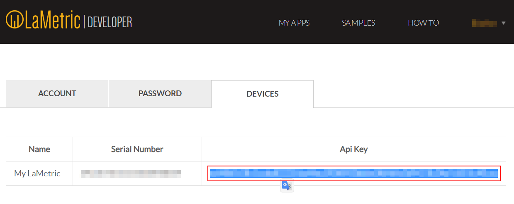
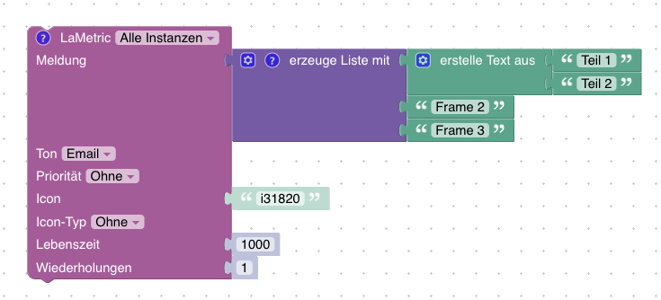
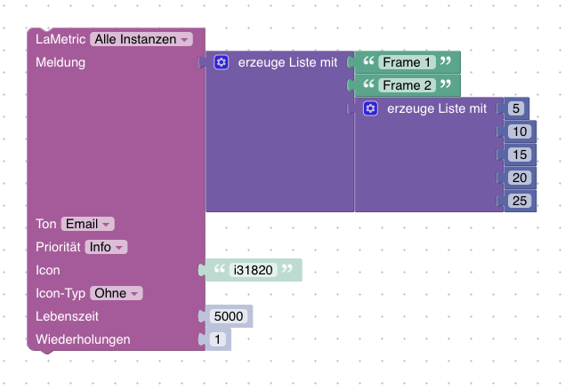

# ioBroker.lametric

[](https://www.npmjs.com/package/iobroker.lametric)
[](https://www.npmjs.com/package/iobroker.lametric)
[](http://iobroker.live/badges/lametric-stable.svg)
[](http://iobroker.live/badges/lametric-installed.svg)
[](https://david-dm.org/klein0r/iobroker.lametric)
[](https://snyk.io/test/github/klein0r/ioBroker.lametric)
[](https://travis-ci.org/klein0r/ioBroker.lametric)

[](https://nodei.co/npm/iobroker.lametric/)

This adapter allows you to get status information about your [LaMetric Time](https://haus-auto.com/p/amz/LaMetricTime) *(Affiliate Link)* and to send notifications to it.
All you need is the IP address of your device and the api developer key.

## Configuration

Tested with LaMetric firmware *2.0.28* and *2.1.2* (recommended)

You can get your personal key [here](https://developer.lametric.com/).



## Features

- Set display brightness (percent, auto-mode/manual-mode)
- Set audio volume (percent)
- Configure screensaver (enable/disable, time based, when dark)
- Activate/Deactivate bluetooth and change bluetooth name
- Switch between apps (next, previous, go to specific app)
- Send notifications with blockly (with configurable priority, sound, icons, text, ...)
- Control special apps like clock, radio, stopwatch or weather
- Use *My Data (DIY)* LaMetric App to display persistent information

Features are limited by the [official API features](https://lametric-documentation.readthedocs.io/en/latest/reference-docs/lametric-time-reference.html).

## Blockly Examples

You can use a simple string as message, which will be shown as a single frame


To show multiple frames, you can also provide an array as message



If you want to use chart frames, you have to specify an array of numbers as a frame



## My Data (DIY) *(version > 1.1.0)*

LaMetric offers an app (on the integrated app market) to poll custom data. This app is called [My Data DIY](https://apps.lametric.com/apps/my_data__diy_/8942). This adapter creates a new state in the required format.
You can use the Simple API Adapter to transfer the data to the LaMetric Time.

```ioBroker LaMetric Adapter -> State with Frame information <- Simple API Adapter <- My Data DIY App <- LaMetric```

### Configuration (with authentication)

1. Install the [Simple API ioBroker Adapter](https://github.com/ioBroker/ioBroker.simple-api)
2. Create a new ioBroker user called "lametric" with a custom password (e.g. HhX7dZl3Fe)
3. Add the "lametric" user to the group "users"
4. Install this *My Data DIY* App on your LaMetric Time (use Market)
5. Open the *My Data (DIY)* app settings and configure the simple api url (see below)
6. Go to the adapter configuration and configure the frames with your custom information (icon and text)

```
http://172.16.0.219:8087/getPlainValue/lametric.0.mydatadiy.obj/?&user=lametric&pass=HhX7dZl3Fe
```

**Ensure to update IP, port, user and password in the URL if necessary!**

### Configuration (without authentication)

1. Install the [Simple API ioBroker Adapter](https://github.com/ioBroker/ioBroker.simple-api)
2. Install this *My Data DIY* App on your LaMetric Time (use Market)
3. Open the *My Data (DIY)* app settings and configure the simple api url (see below)
4. Go to the adapter configuration and configure the frames with your custom information (icon and text)

```
http://172.16.0.219:8087/getPlainValue/lametric.0.mydatadiy.obj/
```

**Ensure to update IP and port in the URL if necessary!**

### Frame Configuration *(version > 1.1.0)*

- Use the plus icon to add as many frames as you want
- Icon: Choose an icon from the [official website](https://developer.lametric.com/icons) and put the ID in the configuration field. **Important: Add an i (for static icons) or an a (for animated icons) as a prefix for that ID. (Example: `i3389`)
- Text: Just type the text information for the frame. You can use states in curly braces. These information will be replaced with the corresponding value of the state. (Example: `{youtube.0.channels.HausAutomatisierungCom.statistics.subscriberCount} Subscribers`)

Example configuration of 2 frames:


## Special Apps / Widgets *(version > 1.1.2)*

You can control some apps with custom information

### clock.clockface

Allowed values are:

- one of `weather`, `page_a_day`, `custom` or `none`
- custom icon data in format `data:image/png;base64,<base64 encoded png binary>` or `data:image/gif;base64,<base64 encoded gif binary>`

Example: `data:image/png;base64,iVBORw0KGgoAAAANSUhEUgAAAAgAAAAICAYAAADED76LAAAAOklEQVQYlWNUVFBgwAeYcEncv//gP04FMEmsCmCSiooKjHAFMEF0SRQTsEnCFcAE0SUZGBgYGAl5EwA+6RhuHb9bggAAAABJRU5ErkJggg==`

### countdown.configure

Allowed value: Time in seconds

## Scripts

To show the message on your la metric just send a message to this instance with script adapter:

```JavaScript
sendTo(
    "lametric.0",
    "notification",
    {
        priority: "[info|warning|critical]",
        iconType: "[none|info|alert]",
        sound: "<string from sound list>",
        lifeTime: <milliseconds>,
        icon: "<icon>",
        text: "<string|array>",
        cycles: <integer>
    }
);
```

Example single frame:

```JavaScript
sendTo(
    "lametric.0",
    "notification",
    {
        priority: "info",
        iconType: "none",
        sound: "cat",
        lifeTime: 5000,
        icon: "i31820",
        text: "test",
        cycles: 1
    }
);
```

Example multiple frames:

```JavaScript
sendTo(
    "lametric.0",
    "notification",
    {
        priority: "info",
        iconType: "none",
        sound: "cat",
        lifeTime: 5000,
        icon: "i31820",
        text: ["frame 1", "frame 2", "frame 3"],
        cycles: 1
    }
);
```

Example to show some information cyclic:

```JavaScript
let i = 0;
function show() {
    console.log('Show ' + i);
    sendTo(
        "lametric.0",
        "notification",
        {
            priority: "info",
            iconType: "info",
            lifeTime: 5000,
            icon: "data:image/png;base64,iVBORw0KGgoAAAANSUhEUgAAAAgAAAAICAIAAABLbSncAAAAAXNSR0IArs4c6QAAAARnQU1BAACxjwv8YQUAAAAJcEhZcwAADsMAAA7DAcdvqGQAAAAYdEVYdFNvZnR3YXJlAHBhaW50Lm5ldCA0LjEuNWRHWFIAAAAySURBVBhXY4AAYdcKk1lngCSUDwHIfAQbzgLqgDCgIqRLwFkQCYQoBAD5EATl4wQMDADhuxQzaDgX0gAAAABJRU5ErkJggg==",
            text: "Hi " + i,
            cycles: 1
        }
    );
    i++;
}
setInterval(show, 10000);
show();
```

## Changelog

### 1.1.2

* (klein0r) Delete app channels if app was deleted on LaMetric
* (klein0r) Custom app configuration (clockface, countdown duration)

### 1.1.1

* (klein0r) Fixed replacement issue for My Data (DIY)
* (klein0r) Updated README with more configuration details

### 1.1.0

* (klein0r) Added support for My Data (DIY)

### 1.0.1

* (klein0r) Added chart data support to notification

### 1.0.0

* (klein0r) First stable release
* (klein0r) Added iobroker sentry
* (klein0r) Added brightness and volume limit information (min, max)

### 0.0.10

* (klein0r) Switched to axios lib

### 0.0.9

* (klein0r) Added missing translations
* (GermanBluefox) Improved Blockly and main.js

### 0.0.8

* (klein0r) Updated dependencies

### 0.0.7

* (klein0r) fixed blockly

### 0.0.6

* (klein0r) switched to setTimeout instead of setInterval, improved logging and fixes eslint complaints

### 0.0.5

* (klein0r) Fixed notification, html, updated github template, enable and disable screensaver

### 0.0.4

* (klein0r) Refactored blockly sendTo / notifications

### 0.0.3

* (klein0r) Added app switching support, refactored everything
* (bluefox) The deletion of the actual shown information was added

### 0.0.2

* (Sigi74) Change message_value for variables message
* (Sigi74) Leave sound none

### 0.0.1

* (klein0r) initial release

## License

The MIT License (MIT)

Copyright (c) 2020 Matthias Kleine <info@haus-automatisierung.com>

Permission is hereby granted, free of charge, to any person obtaining a copy
of this software and associated documentation files (the "Software"), to deal
in the Software without restriction, including without limitation the rights
to use, copy, modify, merge, publish, distribute, sublicense, and/or sell
copies of the Software, and to permit persons to whom the Software is
furnished to do so, subject to the following conditions:

The above copyright notice and this permission notice shall be included in
all copies or substantial portions of the Software.

THE SOFTWARE IS PROVIDED "AS IS", WITHOUT WARRANTY OF ANY KIND, EXPRESS OR
IMPLIED, INCLUDING BUT NOT LIMITED TO THE WARRANTIES OF MERCHANTABILITY,
FITNESS FOR A PARTICULAR PURPOSE AND NONINFRINGEMENT. IN NO EVENT SHALL THE
AUTHORS OR COPYRIGHT HOLDERS BE LIABLE FOR ANY CLAIM, DAMAGES OR OTHER
LIABILITY, WHETHER IN AN ACTION OF CONTRACT, TORT OR OTHERWISE, ARISING FROM,
OUT OF OR IN CONNECTION WITH THE SOFTWARE OR THE USE OR OTHER DEALINGS IN
THE SOFTWARE.
