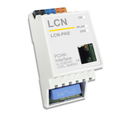

# ioBroker.lcn

This adapter allows to connect Local Control Network [LCN](https://www.lcn.eu/) to ioBroker.

## Supported Gateways
- LCN-PKE

- LCN-PKU with LCN-PCHK

**Don't forget, that ioBroker.lcn will block one LCN Connection License.**

The configuration and modules will be automatically detected by scan, that must be triggered manually from the configuration dialog and can be repeated any time again.

## Types
Following read and write groups are supported:
- Analog values (output/input)
- Relays (output)
- Sensors (input)
- LEDs (output / input)
- Variables (input)

## Variables
To apply the valid convert functions to variables, the variables must have the valid roles. Following roles are supported:

- **value.temperature** - temperature in celsius
- **value.brightness** - Lux (I- input) in lux
- **value.speed.wind** - wind speed in m/s
- **value.voltage** - voltage in Volt
- **value.current** - current in Ampere
- **value.sun.azimuth** - sun azimuth
- **value.sun.elevation** - sun elevation

## How to use
After the first start the devices must be scanned. It can be done in the configuration dialog with scan button

## ToDO
- Configuration dialog to define type of variables.

## Changelog

### 0.4.2 (2019-06-12)
* (bluefox) Support of old measure values was added

### 0.3.2 (2018-11-19)
* (bluefox) add variables support

### 0.2.1
* (bluefox) initial release

## License
CC-BY-NC-4.0

Copyright (c) 2018-2019 bluefox <dogafox@gmail.com>

Up to 10 devices can be connected for free. If you need more devices, you must buy a commercial license.