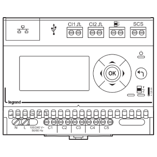

# ioBroker.legrand-ecocompteur

## legrand-ecocompteur adapter for ioBroker

Adapter for the Legrand Ecocompteur module (aka. Legrand Measurement Concentrator EMDX³ 412000).

This is a power measurement device with it's own web interface. The adapter utilises that web interface by:

- Polling for instantaneous power readings (read in a JSON response).
- Polling the device's index page to read the TIC interface. TIC stands for Télé-Information Client which is a French construct. This value is generally read from a utility billing meter connected to the Ecocompteur.

These objects are created for each of the 5 circuits the Ecocompteur reads plus overall total:

- Instantaneous power (in Watts).
- Total cumulated energy measured while the adapter was running (in kWh).

A further object is created to store the TIC interface value.

### Configuration

The following configuration is required:

- IP Address of device.
- JSON polling interval (in seconds).
- Index polling interval (in seconds).
- Validation: maximum circuit reading (in Watts).

## Changelog

### 0.0.4
* (Robin Rainton) Added reading validation filter.

### 0.0.3
* (Robin Rainton) initial clean release.

## License
MIT License

Copyright (c) 2020 Robin Rainton <robin@rainton.com>

Permission is hereby granted, free of charge, to any person obtaining a copy
of this software and associated documentation files (the "Software"), to deal
in the Software without restriction, including without limitation the rights
to use, copy, modify, merge, publish, distribute, sublicense, and/or sell
copies of the Software, and to permit persons to whom the Software is
furnished to do so, subject to the following conditions:

The above copyright notice and this permission notice shall be included in all
copies or substantial portions of the Software.

THE SOFTWARE IS PROVIDED "AS IS", WITHOUT WARRANTY OF ANY KIND, EXPRESS OR
IMPLIED, INCLUDING BUT NOT LIMITED TO THE WARRANTIES OF MERCHANTABILITY,
FITNESS FOR A PARTICULAR PURPOSE AND NONINFRINGEMENT. IN NO EVENT SHALL THE
AUTHORS OR COPYRIGHT HOLDERS BE LIABLE FOR ANY CLAIM, DAMAGES OR OTHER
LIABILITY, WHETHER IN AN ACTION OF CONTRACT, TORT OR OTHERWISE, ARISING FROM,
OUT OF OR IN CONNECTION WITH THE SOFTWARE OR THE USE OR OTHER DEALINGS IN THE
SOFTWARE.
