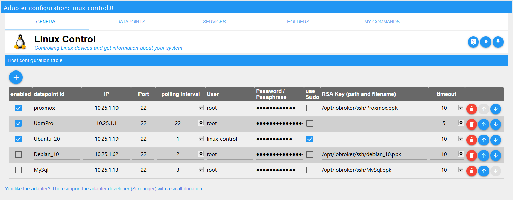

# ioBroker.linux-control

**Tests:**: 

## Linux Control Adapter for ioBroker

Controlling Linux devices and get information about your system

**This adapter uses Sentry libraries to automatically report exceptions and code errors to the developers.** For more details and for information how to disable the error reporting see [Sentry-Plugin Documentation](https://github.com/ioBroker/plugin-sentry#plugin-sentry)! Sentry reporting is used starting with js-controller 3.0.

## Configuration

### General

|setting|description|
|-------|-----------|
|enabled|enabled or disable updating of the host|
|datapoint id|id under which all datapoints are to be stored|
|IP|IP address of your linux device|
|Port|SSH Port of your linux device|
|polling interval|polling interval in minutes. To deatcivate the polling you can use '0' or leave it blank|
|user|ssh user for login|
|password / passpharse|ssh password for login or passpharse if you use a rsa key|
|use Sudo| using sudo |
|rsa key|path and filename of your rsa key. Access rights must be available!|
|timeout|connection timeout|

### Datapoints

The adapter creates predefined datapoints with information and the possibility to control the Linux device. These can be selected here.
In addition, for each individual host, individual data points or entire channels can be placed on the blacklist by drag & drop so that they are not created for the host.

Note if you would like to add the whole channel to the blacklist, you must drag & drop the channel node to the blacklist. Only then the whole channel will be ignored - see sreenshot below:

**Due to the many different Linux distributions this feature is only tested with Debian 10, Ubuntu 18 / 20 LTS!**

### Services

If the retrieval of services under datapoints is activated, you can define here per host for which services only information should be retrieved.

**Due to the many different Linux distributions this feature is only tested with Debian 10, Ubuntu 18 / 20 LTS!**

### Folders

Here you can retrieve information about the size of folders, count of the files included in these folders and the timestamp of the last change in this folder.

**Due to the many different Linux distributions this feature is only tested with Debian 10, Ubuntu 18 / 20 LTS!**

|setting|description|
|-------|-----------|
|enabled|enabled or disable updating of the folder|
|Host|Host which should be used|
|datapoint id|id under which all datapoints are to be stored|
|Path|path of the folder|
|filename pattern|pattern for files names which should be regonized.|
|Unit|Unit for size|
|decimal places|decimal places|
|count of files|create datapoint for count of files|
|last change|create datapoint for timestamp of the last change in this folder|

### My Commands

Here, very individual commands can be defined and then written to your own defined data points.
It is important that the retrieved data is transmitted in the correct type! The type must then be configured accordingly.

|setting|description|
|-------|-----------|
|enabled|enabled or disable updating of the command|
|Host|Host which should be used|
|datapoint id|id under which datapoints are to be stored|
|polling interval|diffrent polling interval in seconds for the command only. For deactivating use `0` or leave the field blank, then the polling interval from the host is used|
|description|description / name of the datapoint|
|command|command that should be used   If you use a user that needs `sudo` then you have to add `sudo -S` to your own command!|
|type|type of the datapoint|
|unit|unit of the datapoint|

## Known Issues
* if its not possible to get connection to your linux client, check if `iputils-ping` is correct installed on client

## Changelog

<!--
    Placeholder for the next version (at the beginning of the line):
    ### __WORK IN PROGRESS__
-->

### 1.1.0 (2020-12-23)
* (paul53) datapoints type and role bug fixes
* (Scrounger) adapter settings card layout added

### 1.0.1 (2020-11-04)
* (Scrounger) translation for polling interval optimized

### 1.0.0 (2020-09-30)
* (Scrounger) bump to stable

### 0.3.7 (2020-09-19)
* (Scrounger) subscribe bug fix for user commands

### 0.3.6 (2020-09-17)
* (Scrounger) Bug fix for function needrestart if sudo is used

### 0.3.5 (2020-09-15)
* (Scrounger) Fixed some errors reported via Sentry

### 0.3.4 (2020-09-09)
* (Scrounger) bug fixes

### 0.3.3 (2020-09-09)
* (Scrounger) bug fix for datapoints creation

### 0.3.2 (2020-09-07)
* (Scrounger) performance optimizations
* (Scrounger) Fixed some errors reported via Sentry

### 0.3.1 (2020-08-23)
* (Scrounger) datapoint info lastRefresh added

### 0.3.0 (2020-08-23)
* (Scrounger) button to manual refresh a single host added
* (Scrounger) userCommand: ignore polling interval if type is button
* (Scrounger) userCommand: individual polling intervals added
* (Scrounger) userCommand: bug fix if sudo is used
* (Scrounger) refresh services info after using command
* (Scrounger) services command: bug fix for using sudo

### 0.2.7 (2020-08-17)
* (Scrounger) option to deactive polling for hosts added
* (Scrounger) bug fixes for using sudo

### 0.2.6 (2020-08-15)
* (Scrounger) Node-SSH bug fix

### 0.2.5 (2020-08-15)
* (Scrounger) sentry error handling optimized
* (Scrounger) info datapoints added, isOnline changed to info.is_online

### 0.2.4 (2020-08-12)
* (Scrounger) datapoint isOnline added
* (Scrounger) settings: styles optimized
* (Scrounger) userCommand: null values if response is null or empty
* (Scrounger) bug fixes

### 0.2.3 (2020-08-09)
* (Scrounger) bug fixes

### 0.2.2 (2020-08-09)
* (Scrounger) bug fixes

### 0.2.1 (2020-08-09)
* (Scrounger) bug fixes

### 0.2.0 (2020-08-08)
* (Scrounger) optional folder datapoints for count of files and last change added
* (Scrounger) enable options for hosts, folders and user commands added
* (Scrounger) using sudo implemented
* (Scrounger) type array for user commands added
* (Scrounger) ignore whole datapoints node by using drag and drop 
* (Scrounger) error handling for user commands improved
* (Scrounger) Sentry implemented
 

### 0.1.0 (2020-05-20)
* (Scrounger) added datapoints blacklist configurable for each host individually
* (Scrounger) added poll interval configurable for each host individually
* (Scrounger) configuration bug fixes

### 0.0.3 (2020-05-16)
* (Scrounger) added services whitelist configurable for each host individually

### 0.0.1
* (Scrounger) initial release

## License
MIT License

Copyright (c) 2020 Scrounger <scrounger@gmx.net>

Permission is hereby granted, free of charge, to any person obtaining a copy
of this software and associated documentation files (the "Software"), to deal
in the Software without restriction, including without limitation the rights
to use, copy, modify, merge, publish, distribute, sublicense, and/or sell
copies of the Software, and to permit persons to whom the Software is
furnished to do so, subject to the following conditions:

The above copyright notice and this permission notice shall be included in all
copies or substantial portions of the Software.

THE SOFTWARE IS PROVIDED "AS IS", WITHOUT WARRANTY OF ANY KIND, EXPRESS OR
IMPLIED, INCLUDING BUT NOT LIMITED TO THE WARRANTIES OF MERCHANTABILITY,
FITNESS FOR A PARTICULAR PURPOSE AND NONINFRINGEMENT. IN NO EVENT SHALL THE
AUTHORS OR COPYRIGHT HOLDERS BE LIABLE FOR ANY CLAIM, DAMAGES OR OTHER
LIABILITY, WHETHER IN AN ACTION OF CONTRACT, TORT OR OTHERWISE, ARISING FROM,
OUT OF OR IN CONNECTION WITH THE SOFTWARE OR THE USE OR OTHER DEALINGS IN THE
SOFTWARE.
