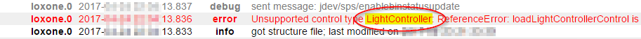

# ioBroker.loxone

**Tests:** 

## loxone adapter for ioBroker

**_This adapter requires at least nodejs 10.x!_**

Fetches all information available in Loxone Miniserver (and Loxone Miniserver Go) and provides changes in realtime.

## Install

Install this adapter via ioBroker Admin:

1. Open instance config dialog
2. Enter the IP address or host name and HTTP port (80 by default) of your Loxone Miniserver
3. Create a new user in the Loxone Miniserver (using the Loxone Config application) to which you only give read and write rights to all required variables.
4. Enter this user's name and its password in the config dialog
5. Save the configuration
6. Start the adapter

## Configuration

### Miniserver Hostname / IP

This is the IP address or host name of your Loxone Miniserver or Miniserver Go.

### Miniserver Port

This is the HTTP port of your Loxone Miniserver.

By default the Miniserver is configured to listen on port 80, but you might have changed it.

### Miniserver Username

Provide a valid username to access the Loxone Miniserver.

It is strongly suggested to use a user different from "admin" for security reasons.

The user only needs read access to the variables you want to use from ioBroker.

### Miniserver Password

Provide the password for the given username (see above).

### Synchronize Names

This will update names in ioBroker whenever they change in the Loxone configuration.
If this is disabled, names will only be synchronized the first time a control is detected.

### Synchronize Rooms

This will populate the enum.rooms enumeration with all rooms provided by the Loxone Miniserver and will link all controls.

### Synchronize Functions

This will populate the enum.functions enumeration with all categories provided by the Loxone Miniserver and will link all controls.

## States

The adapter automatically connects to the configured Loxone Miniserver and creates states for each control state it finds.

The IDs of the states are formatted like this: `loxone.<instance>.<control>.<state>`

-   `<instance>` is the ioBroker adapter instance index (usually "0")
-   `<control>` is the UUID of the control
-   `<state>` is the state within the control (see [Supported Control Types](#supported-control-types) for more information).

The name provided when configuring a control in Loxone Config will only be used as its display name in ioBroker.
This is because a user may choose the same name for multiple controls.

For more information about controls and their states, please also have a look at the Loxone API (especially the Structure File): https://www.loxone.com/enen/kb/api/

## Control Visibility

By default Loxone Miniserver hides many controls (and thus their states) from the Web interface.

That means, they are also hidden from this ioBroker adapter.

To ensure, all your states are properly reported to ioBroker, please verify that they have "Use in Visualization" checked:

## Global States

The following global states are currently provided by this adapter:

-   `operatingMode`: the current operating mode number of the Loxone Miniserver
-   `operatingMode-text`: the current operating mode of the Loxone Miniserver as text
-   `sunrise`: the number of minutes after midnight when the sun rises today
-   `sunset`: the number of minutes after midnight when the sun goes down today
-   `notifications`: the number of notifications
-   `modifications`: the number of modifications
-   all other global states are simply reported as texts

## Supported Control Types

The following control types are currently supported by this adapter.

Behind the name of the state, you can see the type of the state:

-   `(rw)`: readable and writable: this state can be changed from ioBroker
-   `(ro)`: read-only: this state can't be changed from ioBroker
-   `(wo)`: write-only: this state's value isn't reported by this adapter, but it can be changed, triggering some action on the Loxone Miniserver

### Alarm

Provided by burgler alarm control.

-   `armed` (rw) boolean state (true / false) of the alarm; writing `true` to this value will immediately turn the alarm on (without the predefined delay)
-   `nextLevel` (ro) the ID of the next alarm level
    -   1 = Silent
    -   2 = Acustic
    -   3 = Optical
    -   4 = Internal
    -   5 = External
    -   6 = Remote
-   `nextLevelDelay` (ro) the delay of the next level in seconds
-   `nextLevelDelayTotal` (ro) the total delay of the next level in seconds
-   `level` (ro) the ID of the current alarm level
    -   1 = Silent
    -   2 = Acustic
    -   3 = Optical
    -   4 = Internal
    -   5 = External
    -   6 = Remote
-   `startTime` (ro) the timestamp when alarm started
-   `armedDelay` (ro) the delay of the alarm control being armed
-   `armedDelayTotal` (ro) the total delay of the alarm control being armed
-   `sensors` (ro) the list of sensors
-   `disabledMove` (rw) the movement is disabled (true) or not (false)
-   `delayedOn` (wo) writing any value to this state arms the alarm with the configured delay
-   `quit` (wo) writing any value to this state acknowledges the alarm

### Central Alarm

Provided by central burgler alarm control.

-   `armed` (rw) boolean state (true / false) of the alarm; writing `true` to this value will immediately turn the alarm on (without the predefined delay)
-   `delayedOn` (wo) writing any value to this state arms the alarm with the configured delay
-   `quit` (wo) writing any value to this state acknowledges the alarm

### AlarmClock

Provided by alarm clock control.

-   `isEnabled` (rw) boolean state (true / false) of the alarm clock
-   `isAlarmActive` (ro) boolean (true / false) whether the alarm is currently ringing
-   `confirmationNeeded` (ro) boolean (true / false) whether the user needs to confirm the alarm
-   `ringingTime` (ro) countdown in seconds how long the alarm clock will be ringing until it’s going to snooze again
-   `ringDuration` (rw) duration in seconds the alarm clock is ringing
-   `prepareDuration` (rw) preparation time in seconds
-   `snoozeTime` (ro) seconds until snoozing ends
-   `snoozeDuration` (rw) duration in seconds of snoozing
-   `snooze` (wo) writing any value to this state snoozes the current alarm
-   `dismiss` (wo) writing any value to this state dismisses the current alarm

### AudioZone

Provided by Music Server Zone.

-   `serverState` (ro) state of the music server:
    -   -3 = unknown/invalid zone
    -   -2 = not reachable
    -   -1 = unknown
    -   0 = offline
    -   1 = initializing (booting, trying to reach it)
    -   2 = online
-   `playState` (rw) the playback state:
    -   -1 = unknown (this value can't be set)
    -   0 = stopped (setting this value will pause playback)
    -   1 = paused (setting this value will pause playback)
    -   2 = playing (setting this value will start/resume playback)
-   `clientState` (ro) state of the client:
    -   0 = offline
    -   1 = initializing (booting, trying to reach it)
    -   2 = online
-   `power` (rw) whether or not the client power is active
-   `volume` (rw) current volume
-   `maxVolume` (ro) zones can be assigned a maximum volume
-   `shuffle` (rw) whether or not playlist shuffle is enabled
-   `sourceList` (ro) list containing all zone-favorites
-   `repeat` (rw) repeat mode:
    -   -1 = unknown
    -   0 = off
    -   1 = repeat all
    -   2 = -not used-
    -   3 = repeat current item
-   `songName` (ro) song name
-   `duration` (ro) how long the whole track is, -1 if not known (stream)
-   `progress` (rw) current position in the track
-   `album` (ro) album name
-   `artist` (ro) artist name
-   `station` (ro) station name
-   `genre` (ro) genre name
-   `cover` (ro) song/album cover image URL
-   `source` (rw) current selected source identifier (see `sourceList` above)
-   `prev` (wo) writing any value to this state moves to the previous track
-   `next` (wo) writing any value to this state moves to the next track

### Central Audio

Provided by central Music Server.

-   `control` (wo) sets the play state of all players (`true` = play, `false` = pause)

### Colorpicker

This device only appears inside a LightController.

-   `red` (rw) red value of the color picker
-   `green` (rw) green value of the color picker
-   `blue` (rw) blue value of the color picker

Setting one or more of the above states from ioBroker will only send a command to the Miniserver after about 100 ms.
This is to prevent the color from changing multiple times for a single user input.

### Colorpicker V2

This device only appears inside a Light Controller V2 in Loxone software version 9 and above.

-   `red` (rw) red value of the color picker
-   `green` (rw) green value of the color picker
-   `blue` (rw) blue value of the color picker

Setting one or more of the above states from ioBroker will only send a command to the Miniserver after about 100 ms.
This is to prevent the color from changing multiple times for a single user input.

### Dimmer

Provided by dimmers.

-   `position` (rw) current position for the dimmer
-   `min` (ro) current minimum value
-   `max` (ro) current maximum value
-   `step` (ro) current step value
-   `on` (wo) writing any value to this state sets the dimmer to the last known position
-   `off` (wo) writing any value to this state disables the dimmer, sets position to 0 but remembers the last position

### Gate

Provided by gate controls.

-   `position` (ro) the position from 1 = up to 0 = down
-   `active` (rw) current direction of the gate movement
    -   -1 = close
    -   0 = not moving
    -   1 = open
-   `preventOpen` (ro) whether preventing opening of door
-   `preventClose` (ro) whether preventing closing of door

### Central Gate

Provided by central gate control.

-   `open` (wo) opens all gates
-   `close` (wo) closes all gates
-   `stop` (wo) stops all gate motors

### InfoOnlyDigital

Provided by virtual states as well as the Loxone Touch switch.

-   `active` (ro) boolean state (true / false) of the control
-   `active-text` (ro) if configured, the text equivalent of the state
-   `active-image` (ro) if configured, the image equivalent of the state
-   `active-color` (ro) if configured, the color equivalent of the state

### InfoOnlyAnalog

Provided by virtual states as well as the Loxone Touch switch.

-   `value` (ro) the state value (number) of the control
-   `value-formatted` (ro) if configured, the formatted value of the state (using the "Unit" format from Loxone Config)

### Intercom

Provided by door controllers.

-   `bell` (ro) whether the bell is ringing
-   `lastBellEvents` (ro) array containing the timestamps for each bell-activity that wasn�t answered
-   `version` (ro) Loxone Intercoms only - text containing the currently installed firmware
    versions
-   `answer` (wo) writing any value to this state will deactivate the bell

This type of channel might contain other devices. See the respective chapter for more information.

### Jalousie

Provided by different kinds of blinds (automatic and manual).

-   `up` (rw) whether Jalousie is moving up
-   `down` (rw) whether Jalousie is moving down
-   `position` (ro) position of the Jalousie, a number from 0 to 1
    -   Jalousie upper position = 0
    -   Jalousie lower position = 1
-   `shadePosition` (ro) shade position of the Jalousie (blinds), a number from 0 to 1
    -   Blinds are not shaded = 0
    -   Blinds are shaded = 1
-   `safetyActive` (ro) only used by ones with Autopilot, this represents the safety shutdown
-   `autoAllowed` (ro) only used by ones with Autopilot
-   `autoActive` (rw) only used by ones with Autopilot
-   `locked` (ro) only by ones with Autopilot, this represents the output QI in Loxone Config
-   `infoText` (ro) informs e.g. on what caused the locked state, or what did cause the safety to become active.
-   `fullUp` (wo) writing any value to this state triggers a full up motion
-   `fullDown` (wo) writing any value to this state triggers a full down motion
-   `shade` (wo) writing any value to this state shades the Jalousie to the perfect position

### Central Jalousie

Provided by the central blinds control.

-   `autoActive` (rw) only used by ones with Autopilot
-   `fullUp` (wo) writing any value to this state triggers a full up motion
-   `fullDown` (wo) writing any value to this state triggers a full down motion
-   `shade` (wo) writing any value to this state shades of all blinds to the perfect position

### Light Controller

Provided by (hotel) lighting controllers.
Scenes can only be modified in the Loxone applications, but can be selected in ioBroker.

-   `activeScene` (rw) current active scene number
    -   0: all off
    -   1..8: user defined scene (definition/learning of scenes has to be done with the Loxone tools)
    -   9: all on
-   `sceneList` (ro) list of all scenes
-   `plus` (wo) changes to the next scene
-   `minus` (wo) changes to the previous scene

This type of channel might contain other devices. See the respective chapter for more information.

### Light Controller V2

Provided by (hotel) lighting controllers in Loxone software version 9 and above.
Moods can only be modified in the Loxone applications, but can be selected and combined in ioBroker.

-   `moodList` (ro) list of all configured mood names
-   `activeMoods` (rw) currently active list of mood names
-   `favoriteMoods` (ro) list of the favorite mood names
-   `additionalMoods` (ro) list of the non-favorite mood names
-   `plus` (wo) changes to the next mood
-   `minus` (wo) changes to the previous mood

This type of channel might contain other devices. See the respective chapter for more information.

### Central Light Controller

Provided by central lighting controller.

-   `control` (wo) turns all lights on or off

### Meter

Provided by utility meters.

-   `actual` (ro) the actual value (number)
-   `actual-formatted` (ro) if configured, the formatted actual value of the state (using the "Unit" format from Loxone Config)
-   `total` (ro) the total value (number)
-   `total-formatted` (ro) if configured, the formatted total value of the state (using the "Unit" format from Loxone Config)
-   `reset` (wo) writing any value to this state resets the total value

### Pushbutton

Provided by virtual push-button inputs.

-   `active` (rw) the current state of the pushbutton
-   `pulse` (wo) writing any value to this state will simulate the button being pushed only for a very short time

### Slider

Provided by analog virtual inputs.

-   `value` (rw) the current value of the slider
-   `value-formatted` (ro) if configured, the formatted value of the state (using the "Unit" format from Loxone Config)
-   `error` (ro) indicates an invalid value of the slider

### SmokeAlarm

Provided by utility meters.

-   `nextLevel` (ro) the ID of the next alarm level
    -   1 = Silent
    -   2 = Acustic
    -   3 = Optical
    -   4 = Internal
    -   5 = External
    -   6 = Remote
-   `nextLevelDelay` (ro) delay of the next level in seconds
-   `nextLevelDelayTotal` (ro) total delay of the next level in seconds
-   `level` (ro) the ID of the current alarm level
    -   1 = Silent
    -   2 = Acustic
    -   3 = Optical
    -   4 = Internal
    -   5 = External
    -   6 = Remote
-   `sensors` (ro) the list of sensors
-   `acousticAlarm` (ro) state of the acoustic alarm false for not active and true for active
-   `testAlarm` (ro) whether testalarm is active
-   `alarmCause` (ro) the cause of the alarm:
    -   1 = smoke detector only
    -   2 = water only
    -   3 = smoke and water
    -   4 = temperature only
    -   5 = fire and temperature
    -   6 = temperature and water
    -   7 = fire, temperature and water
-   `startTime` (ro) timestamp when alarm started
-   `timeServiceMode` (rw) delay until service mode is disabled
-   `mute` (wo) writing any value to this state mutes the sirene
-   `quit` (wo) writing any value to this state acknowledges the smoke alarm

### Switch

Provided by virtual input switches.

-   `active` (rw) the current state of the switch

### TimedSwitch

Provided by stairwell and multifunction switches.

-   `deactivationDelayTotal` (ro) seconds, how long the output will be active if the timer is used
-   `deactivationDelay` (ro) countdown until the output is deactivated
    -   0 = the output is turned off
    -   -1 = the output is permanently on
    -   otherwise it will count down from deactivationDelayTotal
-   `on` (wo) writing any value to this state enables the switch permanently without deactivation delay
-   `off` (wo) writing any value to this state disables the switch
-   `pulse` (wo) pulses the switch:
    -   deactivationDelay = 0
        -   Will start the countdown, from deactivationDelayTotal to 0
    -   if this is a stairwell switch:
        -   deactivationDelay = -1
            -   No effect, will remain permanently on.
        -   deactivationDelay > 0
            -   Restarts the countdown
    -   if this is a multifunction switch
        -   turns it off (from countdown or permanent on state)

### Tracker

Provided by stairwell and multifunction switches.

-   `entries` (ro) list of entries returned from the miniserver

### WindowMonitor

Provided by utility meters.

-   `numOpen` (ro) number of open windows & doors
-   `numClosed` (ro) number of closed windows & doors
-   `numTilted` (ro) number of tilted windows & doors
-   `numOffline` (ro) number of windows & doors that are not available
-   `numLocked` (ro) number of locked windows & doors
-   `numUnlocked` (ro) number of unlocked windows & doors

The sum of the values from all these states is equal to the number of windows & doors monitored.? The windows/doors with two states will always be counted to the "worst" state.

For each monitored window / door there will be a device with an index as its ID and the given name. They have the following states:

-   `closed` (ro) the window / door is closed
-   `tilted` (ro) the window / door is tilted
-   `open` (ro) the window / door is open
-   `locked` (ro) the window / door is locked
-   `unlocked` (ro) the window / door is unlocked

## Weather Server

The weather server information is provided as a device with multiple channels.
The device is called `WeatherServer`.
It contains:

-   the channel `Actual` with the current weather values
-   one channel for each forecast hour called `HourXX` where `XX` is the number of hours from now

Every channel contains the following states:

-   `barometricPressure`: numeric barometric pressure value
-   `barometricPressure-formatted`: formatted barometric pressure value with unit
-   `dewPoint`: numeric dew point value
-   `dewPoint-formatted`: formatted dew point value with unit
-   `perceivedTemperature`: numeric perceived temperature value
-   `perceivedTemperature-formatted`: formatted perceived temperature value with unit
-   `precipitation`: numeric precipitation value
-   `precipitation-formatted`: formatted precipitation value with unit
-   `relativeHumidity`: numeric relative humidity value
-   `relativeHumidity-formatted`: formatted relative humidity value with unit
-   `solarRadiation`: solar radiation value
-   `temperature`: numeric temperature value
-   `temperature-formatted`: formatted temperature value with unit
-   `timestamp`: timestamp of the data as `value.time` (JavaScript time)
-   `weatherType`: numeric weather type enumeration value
-   `weatherType-text`: text representation of the weather type
-   `windDirection`: wind direction value
-   `windSpeed`: wind speed value
-   `windSpeed-formatted`: formatted wind speed value with unit

## Compatibility

Compatibility has been tested with Loxone Miniserver Go 9.0.9.26 using Loxone Config 9.0.9.26.

## Bug Reports and Feature Requests

Please use the GitHub repository to report any bugs or request new features.

If you require a missing control type, please provide the name as it is reported in the error log of ioBroker as well as the entire raw contents of the device in the ioBroker object tree:

Log file example for "LightController":

Native value from ioBroker &gt; Objects

## Changelog

### 2.1.0 (2020-12-21)

-   (raintonr) Fixed: activeMoods can get stuck/not sync properly; all events is now handled with a queue (#58, #61, #62)
-   (raintonr) Added open/close buttons to Garage/Gate Control (#59, #60)
-   (pinkit) Added support for virtual text inputs (#48)
-   (UncleSamSwiss) Updated to the latest adapter template
-   (UncleSamSwiss) Changed log level of "Currently unsupported control type" message to "info" (#65)

### 2.0.2 (2020-10-26)

-   (UncleSamSwiss) Fixed color picker updates (#52)
-   (UncleSamSwiss) TimedSwitch to have `on`/`off` instead of `active` (#53)
-   (UncleSamSwiss) Cleaning illegal characters for room and function names (#54)

### 2.0.1 (2020-09-24)

-   (UncleSamSwiss) Fixed percentage states always showing 0% (#49)
-   (UncleSamSwiss) Fixed analog virtual inputs wouldn't set the value 0 from ioBroker (#47)
-   (UncleSamSwiss) Added translations to package information.

### 2.0.0

-   **BREAKING:** Since the password is now encrypted, you will need to enter the password again after an update to this version!
-   (UncleSamSwiss) Updated to the latest development tools and changed to the TypeScript language

### 1.1.0

-   (UncleSamSwiss) Added support for Miniserver Gen 2
-   (sstroot) RGB for LightControllerV2
-   (Apollon77) Updated CI Testing

### 1.0.0

-   (UncleSamSwiss) Fixed issue that was resetting the custom settings and cloud smartName
-   (alladdin) Fixed connection issues with Loxone Miniserver 10
-   (UncleSamSwiss) Changed all write-only "switch"es to "button"s
-   (UncleSamSwiss) Added support for AlarmClock control
-   (Apollon77) Updated CI Testing

### 0.4.0

-   (UncleSamSwiss) Improved support for Loxone Config 9
-   (UncleSamSwiss) Changed all color choosers (i.e. color lights) to use RGB (previously HSV/HSL was completely wrong)

### 0.3.0

-   (UncleSamSwiss) Control names only synchronized on the first time by default (configurable); users can change control names the way they want

### 0.2.1

-   (UncleSamSwiss) Added support for Slider control

### 0.2.0

-   (UncleSamSwiss) Added proper support for Alexa for the following controls: Alarm, AudioZone, Gate, Jalousie and LightController

### 0.1.1

-   (UncleSamSwiss) Added support for synchronizing rooms and functions (categories) from Loxone Miniserver

### 0.1.0

-   (UncleSamSwiss) Added support for many more controls including commands from ioBroker to Loxone Miniserver

### 0.0.3

-   (Bluefox) Formatting, refactoring and Russian translations

### 0.0.2

-   (UncleSamSwiss) Added creation of an empty device for all unsupported controls (helps figure out its configuration)

### 0.0.1

-   (UncleSamSwiss) Initial version

## License

Copyright 2020 UncleSamSwiss

Licensed under the Apache License, Version 2.0 (the "License");
you may not use this file except in compliance with the License.
You may obtain a copy of the License at

http://www.apache.org/licenses/LICENSE-2.0

Unless required by applicable law or agreed to in writing, software
distributed under the License is distributed on an "AS IS" BASIS,
WITHOUT WARRANTIES OR CONDITIONS OF ANY KIND, either express or implied.
See the License for the specific language governing permissions and
limitations under the License.

## Legal

This project is not affiliated directly or indirectly with the company Loxone Electronics GmbH.

Loxone and Miniserver are registered trademarks of Loxone Electronics GmbH.
