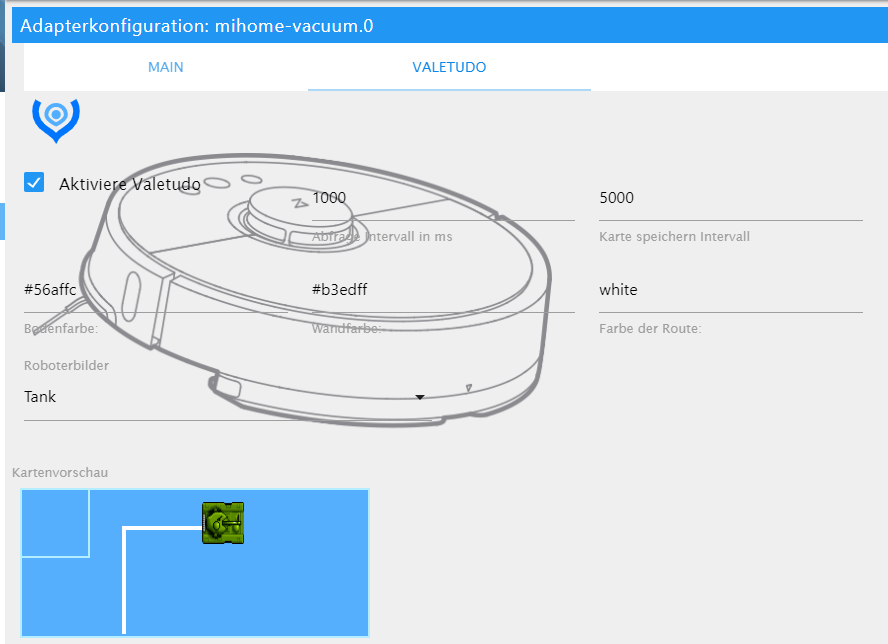

# ioBroker mihome-vacuum adapter

  [](https://www.npmjs.com/package/iobroker.mihome-vacuum)
[](https://www.npmjs.com/package/iobroker.mihome-vacuum)
[](https://travis-ci.org/iobroker-community-adapters/ioBroker.mihome-vacuum)

[](https://nodei.co/npm/iobroker.mihome-vacuum/)

[Deutsche beschreibung hier](README_de.md)

This adapter allows you control the Xiaomi vacuum cleaner.

## Content
- [Setup](#configuration)
    - [Configure Adapter](#adapter-configuration)
        - [Control via Alexa](#control-over-alexa)
        - [Second robot](#second-robot)
    - [Configure Valetudo](#valetudo-config)
- [Functions](#functions)
    - [S50 Commands](#commands-of-the-s50)
    	- [Go To](#goto)
	- [zone Clean](#zoneclean)
    - [rooms](#rooms)
    - [timer](#timer)
    - [Own Commands](#send-your-own-commands)
    - [sendTo hook](#send-custom-commands-with-sendto)
- [widget](#widget)
- [bugs](#bugs)
- [Changelog](#changelog)
 
## Configuration
Currently, finding the token is the biggest problem.
PLease follow the instruction in the Link:

[Token turorial](https://www.smarthomeassistent.de/token-auslesen-roborock-s6-roborock-s5-xiaomi-mi-robot-xiaowa/).

### Error at installation
if your installation runs in error. The canvas package could not be install

``npm ERR! canvas@2.6.1 install: node-pre-gyp install --fallback-to-build
npm ERR! Exit status 1``

Please install canvas and the libs manually with:

``
sudo apt-get install build-essential libcairo2-dev libpango1.0-dev libjpeg-dev libgif-dev librsvg2-dev
``

``
sudo npm install canvas --unsafe-perm=true
``


### Adapter Configuration
- For IP address, the IP address of the robot must be entered in the format "192.168.178.XX"
- The port of the robot is set to "54321" by default, this should not be changed
- Own port, should only be changed with second robot
- Query Interval The time in ms in which the robot's status values are retrieved (should not be <10000)

#### Control over Alexa
In the config add alexa state is activated here is a hack is set an additional state "clean_home" it is a switch which starts at "true" the sucker and at "false" it goes home, it becomes automatically a smart device in the cloud Adapter created with the name "vacuum cleaner", which can be changed in the cloud adapter.

#### Resume paused zonecleaning with start button
With this option enabled, the Vacuum will resume the zonecleaning when setting the "start" state to true if it was paused during a running zoneclean.
If this option is disabled, the vacuum will start a new "normal cleaning" when you send the start command, even if it was paused during a running zoneclean.


- Experimental: Using the checkbox "Send your own commands" objects are created, via which you can send and receive your own commands to the robot.

#### Second robot
If two robots are to be controlled via ioBroker, two instances must be created. The second robot must change its own port (default: 53421) so that both robots have different ports.

## Map Config
There are two ways to get the map. The first get the map from the cloud. Therefor you have to log in and select the right robot from the list

Second way is the map from valetudo (only local connection). Therefor you have to root and install valetudo to your device. Vatudo you can use 
[Valetudo RE](https://github.com/rand256/valetudo) or normal [Valetudo](https://github.com/Hypfer/Valetudo)


- To use the map you have to selecte valetudo or original map in the config
- request Interval must be more than 1000 ms this is the intervall for update the html map
- map intervaall must be more than 5000 ms this intervall updates the png Map file (you can use this for Telegram or vis or anything else)
- color there you can select the colors for the map example:
```
- #2211FF
- rbg(255,200,190)
- rgba(255,100,100,0.5) //for Transparent
- green
```
- robots there you can select differt robots or other vehicles for the map 

### Map Widget
To display th map you can use a normal html Widget e.g:

```
[{"tpl":"tplHtml","data":{"g_fixed":false,"g_visibility":false,"g_css_font_text":false,"g_css_background":false,"g_css_shadow_padding":false,"g_css_border":false,"g_gestures":false,"g_signals":false,"g_last_change":false,"visibility-cond":"==","visibility-val":1,"visibility-groups-action":"hide","refreshInterval":"0","signals-cond-0":"==","signals-val-0":true,"signals-icon-0":"/vis/signals/lowbattery.png","signals-icon-size-0":0,"signals-blink-0":false,"signals-horz-0":0,"signals-vert-0":0,"signals-hide-edit-0":false,"signals-cond-1":"==","signals-val-1":true,"signals-icon-1":"/vis/signals/lowbattery.png","signals-icon-size-1":0,"signals-blink-1":false,"signals-horz-1":0,"signals-vert-1":0,"signals-hide-edit-1":false,"signals-cond-2":"==","signals-val-2":true,"signals-icon-2":"/vis/signals/lowbattery.png","signals-icon-size-2":0,"signals-blink-2":false,"signals-horz-2":0,"signals-vert-2":0,"signals-hide-edit-2":false,"lc-type":"last-change","lc-is-interval":true,"lc-is-moment":false,"lc-format":"","lc-position-vert":"top","lc-position-horz":"right","lc-offset-vert":0,"lc-offset-horz":0,"lc-font-size":"12px","lc-font-family":"","lc-font-style":"","lc-bkg-color":"","lc-color":"","lc-border-width":"0","lc-border-style":"","lc-border-color":"","lc-border-radius":10,"lc-zindex":0,"html":"{mihome-vacuum.0.map.map64}"},"style":{"left":"0","top":"0","width":"100%","height":"100%"},"widgetSet":"basic"}]
```

Second way is to use a src img widget to integrate the png file. but the html view is faster, its like a live view.

## Functions
### Commands of the S50 (second generation)
The card size is always 52000mm x 52000mm thus values ​​from 0 to 51999mm are possible.
Unfortunately, the position and location of the card can not be queried, this can change from suction to suction. Used as a basis is always the last suction card, as well as in the app.
If the robot only picks up one area and always builds the map the same way, you can reliably send it to places or have the area vacuumed.

#### GoTo
In order to drive the vacuum cleaner to a point, the "goTo" object must be filled as follows:
```
xVal, yval
```
The values ​​must satisfy the above scope and indicate the x and y coordinates on the map.

Example:
```
24,850.26500
```


#### zoneClean
To vacuum a zone, ZoneClean must be filled as follows:
```
[X1, y1, x2, x2, count]
```
Where x and y are the coordinates of the rectangular area and "count" the cleaning operations.
You can also let several areas suck at once:

```
[X1, y1, x2, x2, count], [x3, y3, x4, x4, count2]
```

Example:
```
[24117,26005,25767,27205,1], [24320,24693,25970,25843,1]
```
#### rooms
newer vacuum cleaner with the latest Home App supports the definition of rooms, see 
[Video](https://www.youtube.com/watch?v=vEiUZzoXfPg)

Each room in the current map has an index, which is then assigned to the room from the app. From the robot we only get a mapping with room number and index. The adapter queries these rooms every time the adapter starts and creates a channel for each room, which then knows the current room index. The same happens manually with the button loadRooms. This channel can then be assigned to the ioBroker rooms. If the button roomClean is pressed, the index of the card is determined and sent to the robot, so that it can then vacuum this room. Before that the FAN power is set for single room suction. If you don't have the possibility to name the rooms in the app yet, there is also the possibility to create such a channel manually by specifying the map index. It is also possible to add zone coordinates instead of mapIndex.
If you want to clean several rooms spontaneously, you can do this via multiRoomClean by assigning the ioBroker rooms to this data point and then pressing the button.

#### timer
As soon as the vacuum cleaner supports the room function (see above), it is also possible to create timers, which then trigger the corresponding room channels or determine their mapIndexes. 
The timer could trigger via rooms and/or room channels directly.
The timers themselves are created via the config area, but then become a data point. There, each timer can be activated/deactivated or skipped once. A direct start is also possible. The advantage of the ioBroker timers is that they can be displayed and used in the VIS and you can disconnect the robot from the internet, because the timers of the app are triggered from China.

### Send your own commands
NOTE: This function should only be used by experts, as the sucker might be damaged by wrong commands

The robot distinguishes between the commands in methods (methods) and parameters (params) which serve to specify the methods.
Under the object "mihome-vacuum.X.control.X_send_command" you can send your own commands to the robot.
The object structure must look as follows: method; [params]

Under the object "mihome-vacuum.X.control.X_get_response", the response is entered by the robot after sending. If parameters were queried, they appear here in the JSON format. If only one command was sent, the robot responds only with "0".

The following methods and parameters are supported:

| method          | params                                                              | Beschreibung                                                                                           |
|-----------      |-------                                                              |-------------------                                                                                     |
| get_timer       |                                                                     | Returns the set timerSetting the suction times BSp. 12 o'clock 30 in 5 days                            |
| set_timer       | [["TIME_IN_MS",["30 12 * * 1,2,3,4,5",["start_clean",""]]]]         | Enable / disable timer                                                                                 |
| upd_timer       | ["1481997713308","on/off"]                                          |                                                                                                        |
|                 |                                                                     | Rescues the times of the Do Not Distrube                                                               |
| get_dnd_timer   |                                                                     | Delete DND times                                                                                       |
| close_dnd_timer |                                                                     | DND Setting h, min, h, min                                                                             |
| set_dnd_timer   | [22,0,8,0]                                                          |                                                                                                        |
|                 |                                                                     |                                                                                                        |
| app_rc_start    |                                                                     | Start Romote Control                                                                                   |
| app_rc_end      |                                                                     | Finish Remote Control                                                                                  |
| app_rc_move     |[{"seqnum":'0-1000',"velocity":VALUE1,"omega":VALUE2,"duration":VALUE3}]| Move. Sequence number must be continuous, VALUE1 (speed) = -0.3-0.3, VALUE2 (rotation) = -3.1-3.1, VALUE3 (duration)


more methods and parameters you can find here ([Link](https://github.com/MeisterTR/XiaomiRobotVacuumProtocol)).

### Send custom commands with sendTo
You can also send those custom commands from other adapters with `sendTo`. Usage with `method_id` and `params` as defined above:
```
sendTo("mihome-vacuum.0", "sendCustomCommand", 
    {method: "method_id", params: [...] /* optional*/}, 
    function (response) { /* do something with the result */}
);
```
The `response` object has two properties: `error` and (if there was no error) `result`.

A couple of predefined commands can also be issued this way:
```
sendTo("mihome-vacuum.0", 
    commandName, 
    {param1: value1, param2: value2, ...}, 
    function (response) { /* do something with the result */}
);
```
The supported commands are:

| Description | `commandName` | Required params | Remarks |
|---|---|---|---|
| Start the cleaning process | `startVacuuming` | - none - |  |
| Stop the cleaning process | `stopVacuuming` | - none - |  |
| Pause the cleaning process | `pause` | - none - |  |
| Clear waiting jobs | `clearQueue` | - none - |  |
| Clean a small area around the robot | `cleanSpot` | - none - |  |
| Go back to the base | `charge` | - none - |  |
| Say "Hi, I'm over here!" | `findMe` | - none - |  |
| Check status of consumables (brush, etc.) | `getConsumableStatus` | - none - |  |
| Reset status of consumables (brush, etc.) | `resetConsumables` | - none - | Call signature unknown |
| Get a summary of all previous cleaning processes | `getCleaningSummary` | - none - |  |
| Get a detailed summary of a previous cleaning process | `getCleaningRecord` | `recordId` |  |
| Get a map | `getMap` | - none - | Unknown what to do with the result |
| Get the current status of the robot | `getStatus` | - none - |  |
| Retrieve the robot's serial number | `getSerialNumber` | - none - |  |
| Get detailed device information | `getDeviceDetails` | - none - |  |
| Retrieve the *do not disturb* timer | `getDNDTimer` | - none - |  |
| Set a new *do not disturb* timer | `setDNDTimer` | `startHour`, `startMinute`, `endHour`, `endMinute` |  |
| Delete the *do not disturb* timer | `deleteDNDTimer` | - none - |  |
| Retrieve the current fan speed | `getFanSpeed` | - none - |  |
| Set a new fan speed | `setFanSpeed` | `fanSpeed` | `fanSpeed` is a number between 1 and 100 |
| Start the remote control function | `startRemoteControl` | - none - |  |
| Issue a move command for remote control | `move` | `velocity`, `angularVelocity`, `duration`, `sequenceNumber` | Sequence number must be sequentially, Duration is in ms |
| End the remote control function | `stopRemoteControl` | - none - |  |
| clean room/rooms | `cleanRooms` | `rooms` | `rooms` is a comma separated String with enum.rooms.XXX |
| clean segment | `cleanSegments` | `rooms` | `rooms` is an Array with mapIndex or comma separated String with mapIndex |
| clean zone | `cleanZone` | `coordinates` | `coordinates` ist a String with coordinates and count, see [zoneClean](#zoneClean) |

## Widget
Sorry, not yet finished.


## Bugs
- occasional disconnections, however, this is not due to the adapter but mostly on its own networks
- Widget at the time without function

## Changelog
### 2.0.7 (2020-02-25)
* (dirkhe) add Resuming after pause for rooms
### 2.0.6 (2020-02-17)
* (MeisterTR) add roooms for s50 with map (cloud or Valetudo needed)
### 2.0.4 (2020-02-13)
* (MeisterTR) add cloud login to get token
* (MeisterTR) add cloud Map
* (MeisterTR) add new and old Map format
* (MeisterTR) rebuild config page
### 1.10.5 (2020-02-11)
* send Ping only if not connected, otherwise get_status
* set button states to true, if clicked
* move Timermanager and roomManager to own libs

### 1.10.4 (2020-02-06)
* (MeiserTR) add valetudo map support for gen3 and gen2 2XXX
### 1.10.1 (2020-01-20)
* (dirkhe) added zone as room handling
* (dirkhe) timer could room channels directly

### 1.10.0 (2020-01-17)
* (dirkhe) added room handling
* (dirkhe) added Timer 
* (dirkhe) changed featurehandling 

### 1.1.6 (2018-12-06)
* (JoJ123) Added fan speed for MOP (S50+).

### 1.1.5 (2018-09-02)
* (BuZZy1337) Added description for Status 16 and 17 (goTo and zonecleaning).
* (BuZZy1337) Added setting for automatic resume of paused zonecleaning.

### 1.1.4 (2018-08-24)
* (BuZZy1337) Added possibility to resume a paused zoneclean (State: mihome-vacuum.X.control.resumeZoneClean)

### 1.1.3 (2018-07-11)
* (BuZZy1337) fixed zoneCleanup state not working (vacuum was only leaving the dock, saying "Finished ZoneCleanup", and returned immediately back to the dock)

### 1.1.2 (2018-07-05)
* (BuZZy1337) fixed detection of new Firmware / Second generation Vacuum

### 1.1.1 (2018-04-17)
* (MeisterTR) error catched , added states for new fw

### 1.1.0 (2018-04-10)
* (mswiege) Finished the widget

### 1.0.1 (2018-01-26)
* (MeisterTR) ready for admin3
* (MeisterTR) support SpotClean and voice level (v1)
* (MeisterTR) support second generation (S50)
* (MeisterTR) Speed up data requests

### 0.6.0 (2017-11-17)
* (MeisterTR) use 96 char token from Ios Backup
* (MeisterTR) faster connection on first use

### 0.5.9 (2017-11-03)
* (MeisterTR) fix communication error without i-net
* (AlCalzone) add selection of predefined power levels

### 0.5.7 (2017-08-17)
* (MeisterTR) compare system time and Robot time (fix no connection if system time is different)
* (MeisterTR) update values if robot start by cloud

### 0.5.6 (2017-07-23)
* (MeisterTR) add option for crate switch for Alexa control

### 0.5.5 (2017-06-30)
* (MeisterTR) add states, fetures, fix communication errors

### 0.3.2 (2017-06-07)
* (MeisterTR) fix no communication after softwareupdate(Vers. 3.3.9)

### 0.3.1 (2017-04-10)
* (MeisterTR) fix setting the fan power
* (bluefox) catch error if port is occupied

### 0.3.0 (2017-04-08)
* (MeisterTR) add more states

### 0.0.2 (2017-04-02)
* (steinwedel) implement better decoding of packets

### 0.0.1 (2017-01-16)
* (bluefox) initial commit
