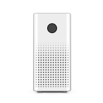
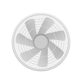
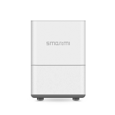
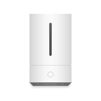
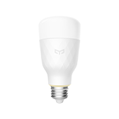
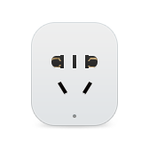
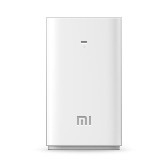

<h1>
    
    ioBroker.miio
</h1>

  

**Tests:** Linux/Mac/Windows: 

## miio adapter for ioBroker

This adapter controls devices which followed miIO protocol.

## Current supported device type

|type|icon|model|Tested|
---|---|---|---
|airfresh||zhimi-airfresh-va2|❌
|airmonitor|||❌
|airpurifier||zhimi.airpurifier.m1|❌
|airpurifier||zhimi.airpurifier.v1|❌
|airpurifier||zhimi.airpurifier.v2|❌
|airpurifier||zhimi.airpurifier.v3|❌
|airpurifier||zhimi.airpurifier.v6|❌
|fan||zhimi.fan.v2|✅
|humidifier||zhimi.humidifier.ca1|❌
|humidifier||zhimi.humidifier.v1|❌
|kettle||yunmi.kettle.r1|✅
|light||philips.light.bulb|✅
|light||philips.light.sread1|✅
|light||yeelink.light.color1|✅
|light||yeelink.light.lamp1|✅
|light||yeelink.light.mono1|✅
|light||yeelink.light.mono1|✅
|plug||chuangmi.plug.m1|❌
|plug||chuangmi.plug.v1|❌
|plug||chuangmi.plug.v2|❌
|plug||chuangmi.plug.v3|✅
|powerstrip||qmi.powerstrip.v1|❌
|powerstrip||zimi.powerstrip.v2|❌
|waterpuri||yunmi.waterpuri.lx3|✅
|waterpuri||yunmi.waterpuri.v2|✅

- If any device you have tested, please create a issue and tell me the result and the device model.

## Changelog
### 0.0.11 (2019-07-04)
* Remove unused function

### 0.0.10 (2019-07-02)
* Fix can not controll device issue

### 0.0.9 (2019-06-27)
* Fix delete device and discover devices issue

### 0.0.8 (2019-06-26)
* NEED UPLOAD MANUALLY！ use TS instead nodejs. Sync device ip based on token 

### 0.0.7 (2019-05-17)
* Add zhimi fan support

### 0.0.6 (2019-04-13)
* Add power load for chuangmi plug

### 0.0.5 (2019-04-04)
* Fix URL mis-match issue

### 0.0.4 (2019-03-31)
* Add yunmi water purifier support. Perfect unit test

### 0.0.3 (2019-03-17)
* Add value mapper function. Add CommandInPara command

### 0.0.2 (2019-03-15)
* Add new device support. Fix some TS lint error

### 0.0.1
* (SchumyHao) initial release

## License
MIT License

Copyright (c) 2019 SchumyHao

Permission is hereby granted, free of charge, to any person obtaining a copy
of this software and associated documentation files (the "Software"), to deal
in the Software without restriction, including without limitation the rights
to use, copy, modify, merge, publish, distribute, sublicense, and/or sell
copies of the Software, and to permit persons to whom the Software is
furnished to do so, subject to the following conditions:

The above copyright notice and this permission notice shall be included in all
copies or substantial portions of the Software.

THE SOFTWARE IS PROVIDED "AS IS", WITHOUT WARRANTY OF ANY KIND, EXPRESS OR
IMPLIED, INCLUDING BUT NOT LIMITED TO THE WARRANTIES OF MERCHANTABILITY,
FITNESS FOR A PARTICULAR PURPOSE AND NONINFRINGEMENT. IN NO EVENT SHALL THE
AUTHORS OR COPYRIGHT HOLDERS BE LIABLE FOR ANY CLAIM, DAMAGES OR OTHER
LIABILITY, WHETHER IN AN ACTION OF CONTRACT, TORT OR OTHERWISE, ARISING FROM,
OUT OF OR IN CONNECTION WITH THE SOFTWARE OR THE USE OR OTHER DEALINGS IN THE
SOFTWARE.
