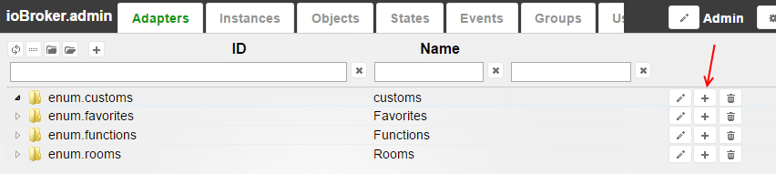
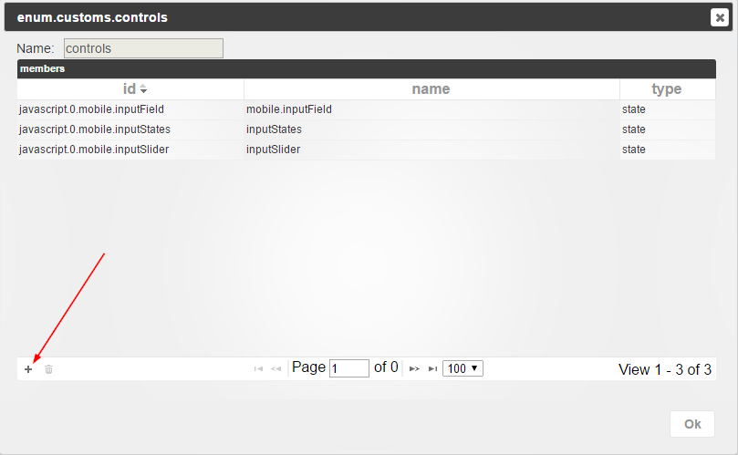
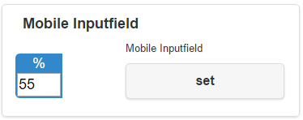

# ioBroker.mobile

  [](https://www.npmjs.com/package/iobroker.mobile)
[](https://www.npmjs.com/package/iobroker.mobile)

[](https://nodei.co/npm/iobroker.mobile/)

jQuery Mobile based user interface.


## Usage
To use mobile UI you need to create the logical structure in admin.

E.g.:
Go to the tab "Enums" and create new enum, e.g. "customs".


Create new enum group in "enum.customs", e.g. "controls"


Add some states to "enum.customs.controls"




Go to mobile page, press on "Info" (top, right) and press "Refresh" to load objects from ioBroker


After reload you can go to "Customs => controls"


## Supported types

### Sliders:


    - role = "level.dimmer"
    - role = "level.blind"
    - role consists "level", common.type is "number", common.write is "true" and common.max is defined
    - common.type = "number", common.write is "true" and common.max is defined

Example:

```
{
  "_id": "javascript.0.mobile.inputSlider",
  "type": "state",
  "common": {
    "name": "Slider",
    "type": "number",
    "read": true,
    "write": true,
    "min": 0,
    "max": 100
  },
  "native": {}
}
```

### Buttons (must be explicit set to visible via edit mode):


    - role consists "button"
    - role consists "action"

Buttons are invisible by default. They just writes "true" if pressed.

Example:

```
{
  "_id": "javascript.0.mobile.inputButton",
  "type": "state",
  "common": {
    "name": "Button",
    "role": "button",
    "type": "boolean",
    "write": true
  },
  "native": {}
}
```

### Switch:


    - common.type = "boolean", common.write is "true"

Example:

```
{
  "_id": "javascript.0.mobile.inputSwitch",
  "type": "state",
  "common": {
    "name": "Switch",
    "type": "boolean",
    "write": true
  },
  "native": {}
}
```

### Set with input field:



    - common.type = "number", common.max is undefined, common.write is "true", common.states is undefined

Example:

```
{
  "_id": "javascript.0.mobile.inputNumber",
  "type": "state",
  "common": {
    "name": "Number",
    "type": "number",
    "write": true
  },
  "native": {}
}
```

### Set with states:


    - common.type = "number", common.max is undefined, common.write is "true", common.states is defined

Example:

```
{
  "_id": "javascript.0.mobile.inputNumber",
  "type": "state",
  "common": {
    "name": "Number",
    "type": "number",
    "write": true,
    "states": {
          "1": "Value 1",
          "2": "Value 2"
        }
  },
  "native": {}
}
```

### Show boolean value:


    - common.write is "false" and common.type is "boolean"

Example:

```
{
  "_id": "javascript.0.mobile.valueBoolean",
  "type": "state",
  "common": {
    "name": "Boolean value",
    "type": "bolean"
  },
  "native": {}
}
```

### Show value:


    - common.write is "false" and common.type is not "boolean"

Example:

```
{
  "_id": "javascript.0.mobile.valueNumber",
  "type": "state",
  "common": {
    "name": "Number value",
    "type": "number",
    "unit": "%"
  },
  "native": {}
}
```

## ToDO:
- edit of Icon
- show some widgets with more icons
- tablet view

## Changelog
### 1.0.1 (2020-08-22)
* (bluefox) The compatibility to socket.io 3.0.13 provided

### 1.0.0 (2019-01-30)
* (ldittmar) Add translations
* (ldittmar) Some fixes

### 0.5.0 (2019-01-24)
* (Hirsch-DE) The multilingual names were fixed

### 0.4.12 (2017-11-14)
* (Apollon77) update adapter type

### 0.4.11 (2017-07-12)
* (BasGo) Fixed blind states

### 0.4.10 (2016-11-08)
* (bluefox) Better cloud support

### 0.4.9 (2016-10-29)
* (bluefox) Fix rooms rendering
* (bluefox) add green, red, blue, white types

### 0.4.8 (2016-10-09)
* (bluefox) implement type blind

### 0.4.7 (2016-09-10)
* (bluefox) make narrow screen on wide displays
* (bluefox) fix some widgets

### 0.4.6 (2016-09-03)
* (bluefox) support of custom images
* (bluefox) fix input number and select value

### 0.4.5 (2016-07-01)
* (bluefox) fix open first page

### 0.4.4 (2016-06-24)
* (bluefox) reload if problems occur

### 0.4.3 (2016-06-24)
* (bluefox) just check invalid objects

### 0.4.2 (2016-06-14)
* (bluefox) update version number

### 0.4.1 (2016-05-12)
* (bluefox) fix control of logical states

### 0.4.0
* (bluefox) add theme switcher

### 0.3.0
* (bluefox) fix problem with room names with spaces
* (bluefox) implement side panel

### 0.2.2
* (bluefox) fix locations in edit mode
* (bluefox) enable visibility of indicators

### 0.2.1
* (bluefox) fix some errors

### 0.2.0
* (bluefox) sorting and edit name

### 0.1.1
* (bluefox) fix errors for some devices

### 0.1.0
* (bluefox) edit of visibility

### 0.0.4
* (bluefox) first version. No edit possible.

## License
The MIT License (MIT)

Copyright (c) 2015-2019 bluefox <dogafox@gmail.com>

Permission is hereby granted, free of charge, to any person obtaining a copy
of this software and associated documentation files (the "Software"), to deal
in the Software without restriction, including without limitation the rights
to use, copy, modify, merge, publish, distribute, sublicense, and/or sell
copies of the Software, and to permit persons to whom the Software is
furnished to do so, subject to the following conditions:

The above copyright notice and this permission notice shall be included in
all copies or substantial portions of the Software.

THE SOFTWARE IS PROVIDED "AS IS", WITHOUT WARRANTY OF ANY KIND, EXPRESS OR
IMPLIED, INCLUDING BUT NOT LIMITED TO THE WARRANTIES OF MERCHANTABILITY,
FITNESS FOR A PARTICULAR PURPOSE AND NONINFRINGEMENT. IN NO EVENT SHALL THE
AUTHORS OR COPYRIGHT HOLDERS BE LIABLE FOR ANY CLAIM, DAMAGES OR OTHER
LIABILITY, WHETHER IN AN ACTION OF CONTRACT, TORT OR OTHERWISE, ARISING FROM,
OUT OF OR IN CONNECTION WITH THE SOFTWARE OR THE USE OR OTHER DEALINGS IN
THE SOFTWARE.
