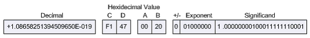

# iobroker.modbus

  [](https://www.npmjs.com/package/iobroker.modbus)
[](https://www.npmjs.com/package/iobroker.modbus)

[](https://nodei.co/npm/iobroker.modbus/)

Implementation of ModBus Slave and Master for ioBroker. Following types are supported:
- Modbus RTU over serial (master)
- Modbus RTU over TCP (master)
- Modbus TCP (slave, master)

## Settings
### Partner IP Address
IP address of modbus partner.

### Port
TCP Port of modbus partner if configured as master (client) or own port if configured as slave(server).

### Device ID
Modbus Device ID. Important if TCP/Modbus bridge is used.

### Type
Slave(Server) or Master(Client).

### Use aliases as address
Normally all registers can have address from 0 to 65535. By using of aliases you can define virtual address fields for every type of registers. Normally:
- discrete inputs are from 10001 to 20000
- coils are from 1 to 1000
- input registers are from 30001 to 40000
- holding registers are from 40001 to 60000

Every alias will be mapped internally to address, e.g. 30011 will be mapped to input register 10. and so on.

### Do not align addresses to word
Normally the coils and the discrete inputs addresses are aligned to 16 bit. Like addresses from 3 to 20 will be aligned to 0 up 32.
If this option is active the addresses will not be aligned.

### Round Real to
How many digits after comma for float and doubles.

### Poll delay
Cyclic poll interval (Only relevant for master)

### Reconnect time
Reconnection interval (Only relevant for master)

### Pulse time
if pulse used for coils, this define the interval how long is pulse.

### Max read request length
Maximal length of command READ_MULTIPLE_REGISTERS as number of registers to read.

Some systems require first "write request" to deliver the data on "read request".
You can force this mode by setting of the "Max read request length" to 1.

**Notice:**
Some USB Modbus solutions (e.g. based on socat) can have trouble to work with serialport npm module.

There is a software [**Modbus RTU <-> Modbus RTU over TCP**](http://mbus.sourceforge.net/index.html) gateway to enable using of serial RTU over TCP protocol.

Both solutions **RTU over TCP** and **TCP** works well.

## Data types

- uint16be - Unsigned 16 bit (Big Endian): AABB => AABB
- uint16le - Unsigned 16 bit (Little Endian): AABB => BBAA
- int16be  - Signed 16 bit (Big Endian): AABB => AABB
- int16le  - Signed 16 bit (Little Endian): AABB => BBAA
- uint32be - Unsigned 32 bit (Big Endian): AABBCCDD => AABBCCDD
- uint32le - Unsigned 32 bit (Little Endian): AABBCCDD => DDCCBBAA
- uint32sw - Unsigned 32 bit (Big Endian Word Swap): AABBCCDD => CCDDAABB
- uint32sb - Unsigned 32 bit (Big Endian Byte Swap): AABBCCDD => DDCCBBAA
- int32be  - Signed 32 bit (Big Endian): AABBCCDD => AABBCCDD
- int32le  - Signed 32 bit (Little Endian): ABBCCDD => DDCCBBAA
- int32sw  - Signed 32 bit (Big Endian Word Swap): AABBCCDD => CCDDAABB
- int32sb  - Signed 32 bit (Big Endian Byte Swap): AABBCCDD => DDCCBBAA
- uint64be - Unsigned 64 bit (Big Endian): AABBCCDDEEFFGGHH => AABBCCDDEEFFGGHH
- uint64le - Unsigned 64 bit (Little Endian): AABBCCDDEEFFGGHH => HHGGFFEEDDCCBBAA
- uint8be  - Unsigned 8 bit (Big Endian): AA => AA
- uint8le  - Unsigned 8 bit (Little Endian): AA => AA
- int8be   - Signed 8 bit (Big Endian): AA => AA
- int8le   - Signed 8 bit (Little Endian): AA => AA
- floatbe  - Float (Big Endian): AABBCCDD => AABBCCDD
- floatle  - Float (Little Endian): AABBCCDD => DDCCBBAA
- floatsw  - Float (Big Endian Word Swap): AABBCCDD => CCDDAABB
- floatsb  - Float (Big Endian Byte Swap): AABBCCDD => DDCCBBAA
- doublebe - Double (Big Endian): AABBCCDDEEFFGGHH => AABBCCDDEEFFGGHH
- doublele - Double (Little Endian): AABBCCDDEEFFGGHH => HHGGFFEEDDCCBBAA
- string   - String (Zero-end): ABCDEF\0 => ABCDEF\0
- stringle - String (Little Endian, Zero-end): BADCFE\0 => ABCDEF\0

Following description was copied from [here](http://www.chipkin.com/how-real-floating-point-and-32-bit-data-is-encoded-in-modbus-rtu-messages/)

The point-to-point Modbus protocol is a popular choice for RTU communications if for no other reason that it’s basic convenience. The protocol itself controls the interactions of each device on a Modbus network, how device establishes a known address, how each device recognizes its messages and how basic information is extracted from the data. In essence, the protocol is the foundation of the entire Modbus network.

Such convenience does not come without some complications however, and Modbus RTU Message protocol is no exception. The protocol itself was designed based on devices with a 16-bit register length. Consequently, special considerations were required when implementing 32-bit data elements. This implementation settled on using two consecutive 16-bit registers to represent 32 bits of data or essentially 4 bytes of data. It is within these 4 bytes of data that single-precision floating point data can be encoded into a Modbus RTU message.

### The Importance of Byte Order

Modbus itself does not define a floating point data type but it is widely accepted that it implements 32-bit floating point data using the IEEE-754 standard. However, the IEEE standard has no clear cut definition of byte order of the data payload. Therefore the most important consideration when dealing with 32-bit data is that data is addressed in the proper order.

For example, the number 123/456.00 as defined in the IEEE 754 standard for single-precision 32-bit floating point numbers appears as follows:


The affects of various byte orderings are significant. For example, ordering the 4 bytes of data that represent 123456.00 in a “B A D C” sequence in known as a “byte swap”. When interpreted as an IEEE 744 floating point data type, the result is quite different:


Ordering the same bytes in a “C D A B” sequence is known as a “word swap”. Again, the results differ drastically from the original value of 123456.00:



Furthermore, both a “byte swap” and a “word swap” would essentially reverse the sequence of the bytes altogether to produce yet another result:


Clearly, when using network protocols such as Modbus, strict attention must be paid to how bytes of memory are ordered when they are transmitted, also known as the ‘byte order’.

### Determining Byte Order

The Modbus protocol itself is declared as a ‘big-Endian’ protocol, as per the Modbus Application Protocol Specification, V1.1.b:

```Modbus uses a “big-Endian” representation for addresses and data items. This means that when a numerical quantity larger than a single byte is transmitted, the most significant byte is sent first.```

Big-Endian is the most commonly used format for network protocols – so common, in fact, that it is also referred to as ‘network order’.

Given that the Modbus RTU message protocol is big-Endian, in order to successfully exchange a 32-bit datatype via a Modbus RTU message, the endianness of both the master and the slave must considered. Many RTU master and slave devices allow specific selection of byte order particularly in the case of software-simulated units. One must merely insure that both all units are set to the same byte order.

As a rule of thumb, the family of a device’s microprocessor determines its endianness. Typically, the big-Endian style (the high-order byte is stored first, followed by the low-order byte) is generally found in CPUs designed with a Motorola processor. The little-Endian style (the low-order byte is stored first, followed by the high-order byte) is generally found in CPUs using the Intel architecture. It is a matter of personal perspective as to which style is considered ‘backwards’.

If, however, byte order and endianness is not a configurable option, you will have to determine the how to interpret the byte. This can be done requesting a known floating-point value from the slave. If an impossible value is returned, i.e. a number with a double-digit exponent or such, the byte ordering will most likely need modification.

### Practical Help

The FieldServer Modbus RTU drivers offer several function moves that handle 32-bit integers and 32-bit float values. More importantly, these function moves consider all different forms of byte sequencing. The following table shows the FieldServer function moves that copy two adjacent 16-bit registers to a 32-bit integer value.

| Function Keyword  | Swap Mode          | Source Bytes    | Target Bytes |
|-------------------|--------------------|-----------------|--------------|
| 2.i16-1.i32       | N/A                | [ a b ] [ c d ] | [ a b c d ]  |
| 2.i16-1.i32-s     | byte and word swap | [ a b ] [ c d ] | [ d c b a ]  |
| 2.i16-1.i32-sb    | byte swap          | [ a b ] [ c d ] | [ b a d c ]  |
| 2.i16-1.i32-sw    | word swap          | [ a b ] [ c d ] | [ c d a b ]  |

The following table shows the FieldServer function moves that copy two adjacent 16-bit registers to a 32-bit floating point value:

| Function Keyword  | Swap Mode          | Source Bytes    | Target Bytes |
|-------------------|--------------------|-----------------|--------------|
| 2.i16-1.ifloat    | N/A                | [ a b ] [ c d ] | [ a b c d ]  |
| 2.i16-1.ifloat-s  | byte and word swap | [ a b ] [ c d ] | [ d c b a ]  |
| 2.i16-1.ifloat-sb | byte swap          | [ a b ] [ c d ] | [ b a d c ]  |
| 2.i16-1.ifloat-sw | word swap          | [ a b ] [ c d ] | [ c d a b ]  |

The following table shows the FieldServer function moves that copy a single 32-bit floating point value to two adjacent 16-bit registers:

| Function Keyword | Swap Mode         | Source Bytes    | Target Bytes   |
|------------------|-------------------|-----------------|----------------|
| 1.float-2.i16    |N/A                | [ a b ] [ c d ] | [ a b ][ c d ] |
| 1.float-2.i16-s  |byte and word swap | [ a b ] [ c d ] | [ d c ][ b a ] |
| 1.float-2.i16-sb |byte swap          | [ a b ] [ c d ] | [ b a ][ d c ] |
| 1.float-2.i16-sw |word swap          | [ a b ] [ c d ] | [ c d ][ a b ] |

Given the various FieldServer function moves, the correct handling of 32-bit data is dependent on choosing the proper one. Observe the following behavior of these FieldServer function moves on the known single-precision decimal float value of 123456.00:

|16-bit Values	| Function Move	    | Result	| Function Move	    | Result        |
|---------------|-------------------|-----------|-------------------|---------------|
|0x2000 0x47F1	| 2.i16-1.float	    | 123456.00	| 1.float-2.i16	    | 0x2000 0x47F1 |
|0xF147 0x0020	| 2.i16-1.float-s	| 123456.00	| 1.float-2.i16-s	| 0xF147 0X0020 |
|0x0020 0xF147	| 2.i16-1.float-sb	| 123456.00	| 1.float-2.i16-sb	| 0x0020 0xF147 |
|0x47F1 0x2000	| 2.i16-1.float-sw	| 123456.00	| 1.float-2.i16-sw	| 0x47F1 0x2000 |

Notice that different byte and word orderings require the use of the appropriate FieldServer function move. Once the proper function move is selected, the data can be converted in both directions.

Of the many hex-to-floating point converters and calculators that are available in the Internet, very few actually allow manipulation of the byte and word orders. One such utility is located at www.61131.com/download.htm where both Linux and Windows versions of the utilities can be downloaded. Once installed, the utility is run as an executable with a single dialog interface. The utility presents the decimal float value of 123456.00 as follows:


One can then swap bytes and/or words to analyze what potential endianness issues may exist between Modbus RTU master and slave devices.

## Test
There are some programs in folder *test' to test the TCP communication:
- Ananas32/64 is slave simulator (only holding registers and inputs, no coils and digital inputs)
- RMMS is master simulator
- mod_RSsim.exe is slave simulator. It can be that you need [Microsoft Visual C++ 2008 SP1 Redistributable Package](https://www.microsoft.com/en-us/download/details.aspx?id=5582) to start it (because of SideBySide error).

## Changelog
# 2.0.9 (2018-10-11)
* (Bjoern3003) Write registers was corrected

# 2.0.7 (2018-07-02)
* (bluefox) The server mode was fixed

# 2.0.6 (2018-06-26)
* (bluefox) rtu-tcp master mode was fixed

# 2.0.3 (2018-06-16)
* (bluefox) Fixed the rounding of numbers

# 2.0.2 (2018-06-12)
* (bluefox) The error with blocks reading was fixed
* (bluefox) The block reading for discrete values was implemented

# 2.0.1 (2018-05-06)
* (bluefox) Added the support of multiple device IDs

# 1.1.1 (2018-04-15)
* (Apollon77) Optimize reconnect handling

# 1.1.0 (2018-01-23)
* (bluefox) Little endian strings added
* (Apollon77) Upgrade Serialport Library

# 1.0.2 (2018-01-20)
* (bluefox) Fixed read of coils

# 0.5.4 (2017-09-27)
* (Apollon77) Several Fixes

# 0.5.0 (2017-02-11)
* (bluefox) Create all states each after other

# 0.4.10 (2017-02-10)
* (Apollon77) Do not recreate all datapoints on start of adapter
* (ykuendig) Multiple optimization and wording fixes

# 0.4.9 (2016-12-20)
* (bluefox) fix serial RTU

# 0.4.8 (2016-12-15)
* (Apollon77) update serialport library for node 6.x compatibility

# 0.4.7 (2016-11-27)
* (bluefox) Use old version of jsmodbus

# 0.4.6 (2016-11-08)
* (bluefox) backward compatibility with 0.3.x

# 0.4.5 (2016-10-25)
* (bluefox) better buffer handling on tcp and serial

# 0.4.4 (2016-10-21)
* (bluefox) Fix write of holding registers

# 0.4.1 (2016-10-19)
* (bluefox) Support of ModBus RTU over serial and over TCP (only slave)

# 0.3.11 (2016-08-18)
* (Apollon77) Fix wrong byte count in loop

# 0.3.10 (2016-02-01)
* (bluefox) fix lost of history settings.

# 0.3.9 (2015-11-09)
* (bluefox) Use always write_multiple_registers by write of holding registers.

# 0.3.7 (2015-11-02)
* (bluefox) add special read/write mode if "Max read request length" is 1.

# 0.3.6 (2015-11-01)
* (bluefox) add cyclic write for holding registers (fix)

# 0.3.5 (2015-10-31)
* (bluefox) add cyclic write for holding registers

# 0.3.4 (2015-10-28)
* (bluefox) add doubles and fix uint64

# 0.3.3 (2015-10-27)
* (bluefox) fix holding registers

# 0.3.2 (2015-10-27)
* (bluefox) fix import from text file

# 0.3.1 (2015-10-26)
* (bluefox) fix error with length of read block (master)
* (bluefox) support of read blocks and maximal length of read request (master)
* (bluefox) can define fields by import

# 0.3.0 (2015-10-24)
* (bluefox) add round settings
* (bluefox) add deviceID
* (bluefox) slave supports floats, integers and strings

# 0.2.6 (2015-10-22)
* (bluefox) add different types for inputRegisters and for holding registers ONLY FOR MASTER

# 0.2.5 (2015-10-20)
* (bluefox) fix names of objects if aliases used

# 0.2.4 (2015-10-19)
* (bluefox) fix error add new values

# 0.2.3 (2015-10-15)
* (bluefox) fix error with master

# 0.2.2 (2015-10-14)
* (bluefox) implement slave
* (bluefox) change addressing model

# 0.0.1
* (bluefox) initial commit
