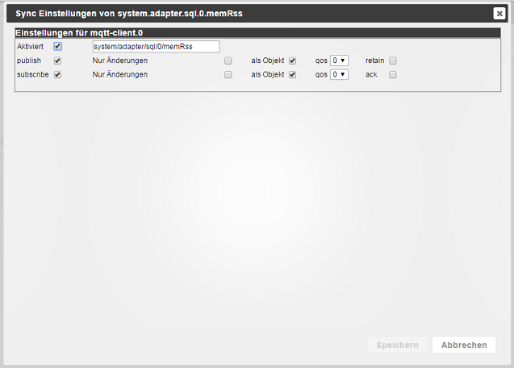

# ioBroker.mqtt-client
===================

  [](https://www.npmjs.com/package/iobroker.mqtt-client)
[](https://www.npmjs.com/package/iobroker.mqtt-client)

[](https://nodei.co/npm/iobroker.mqtt-client/)

## Adapter Settings


### on connect topic and message
The ```on connect message``` is published to the ```on connect topic``` every time the client connects or reconnects to the server.

### last will topic and message
The ```last will message``` is published to the ```last will topic``` every time the client connects or reconnects to the server.
The Server will store this message and send it to its subscribers when the client disconnects.

### subscriptions 
Comma separated list of topics that are not covered by existing states. 
Received messages are converted to states within the adapters namespace (e.g. mqtt.0) and subscribed.
You can remove topics after all states have been created.

### publish prefix
When publishing this will be prepended to all topics.
Default is empty (no prefix).

### subscribe prefix
When subscribing this will be prepended to all topics.
Default is empty (no prefix).

## State Settings


### enabled
Enables or disables the mqtt-client functionality for this state. 
Disabling will delete any mqtt-client settings from this state.

### topic
The topic this state is published to and subscribed from.
default: state-ID converted to a mqtt topic.

### publish
* ```enable``` state will be published
* ```changes only``` state will only be published when its value changes
* ```as object``` whole state will be published as object
* ```qos``` see <http://www.hivemq.com/blog/mqtt-essentials-part-6-mqtt-quality-of-service-levels>
* ```retain``` see <http://www.hivemq.com/blog/mqtt-essentials-part-8-retained-messages>

### subscribe
* ```enable``` topic will be subscribed and state will be updated accordingly
* ```changes only``` state will only be written when the value changed
* ```as object``` messages will be interpreted as objects
* ```qos``` see <http://www.hivemq.com/blog/mqtt-essentials-part-6-mqtt-quality-of-service-levels>
* ```ack``` on state updates the ack flag will be set accordingly

#### Note
* when ack is set to true it will overwrite objects ack, see ```as object```
* to prevent message loops, if both publish and subscribe are enabled ```changes only``` is always on for subscribe

## Changelog
### 1.1.1 (2018-01-30)
* (bluefox) small fixes

### 1.1.0 (2017-12-30)
* (bluefox) Translations
* (bluefox) Udpate of MQTT module

### 1.0.1 (2017-11-16)

### 1.0.0 (2017-11-16)
* (bluefox) Update io-package.json

### 0.3.2 (2016-11-18)
* (Pmant) fix initial object parsing
* (Pmant) fix objects view
 
### 0.3.1 (2016-11-16)
* (Pmant) fix crash

### 0.3.0 (2016-09-08)
* (Pmant) add optional publish and subscribe prefixes

### 0.2.5 (2016-09-08)
* (Pmant) reduce logging -> debug

### 0.2.0 (2016-09-08)
* (Pmant) use new custom settings

### 0.1.1 (2016-06-09)
* (Pmant) fix possible loop

### 0.1.0 (2016-06-08)
* (Pmant) initial commit

## TODO
* test prefixes
* connect/reconnect without clean session
