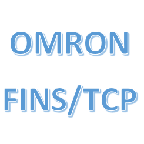

# ioBroker.omron-fins

**Tests:** 

## For German 
https://github.com/TheBam1990/ioBroker.omron-fins/blob/master/Readmede.md

## omron-fins adapter for ioBroker
Connection for Omron PLC via FINS protocol all CJ2M or CJ1M models

## User manual (english)
Adjust the IP address of the PLC in the main settings tab.
The port is the standard port and generally does not need to be adjusted.
The poll value is specified in ms and indicates the cyclical query of the values.
 
The variables to be picked up are entered in the Devices tab
Simply add a new one with the + and then assign a freely selectable name. Please name each variable individually and not immediately.
In the Variable area, enter the variable to be fetched for input or output variables CB0: 00, CB0: 01 CB100: 00 etc. Always use colons to separate them. W31: 00 etc. also works for flags. D1 values ​​etc. can also be fetched.
In the type tab, select the variable type as it is stored in the PLC.

## Changelog
<!--
 Placeholder for the next version (at the beginning of the line):
 ### __WORK IN PROGRESS__ ( - falls nicht benötigt löschen sonst klammern entfernen und nach dem - dein text schreiben )
-->
### 0.0.2 (2021-03-05)
* (Thebam) Änderungen im Abrufen Verbesserung des Intervall

### 0.0.1 (2021-02-22)
* (Thebam) Update Abhängigkeiten 

### 0.0.1-7 (2021-02-08)
* (Thebam) NPM Aktualisiert

### 0.0.1-6 (2021-02-07)
* (Thebam) Änderungen für Repro eingetragen

### 0.0.1-5 (2021-01-01)
* (Thebam) io-package angepasst

### 0.0.1-4 (2021-01-01)
* (Thebam) package json angepasst

### 0.0.1-3 (2021-01-01)
* (Thebam) adater checker anpassung

### 0.0.1-2 (2021-01-01)
* (Thebam) native objekt ip geändert

### 0.0.1-1 (2021-01-01)
* (Thebam) add GitHub Action

### 0.0.1
* (Thebam) initial release
Erste version zum Abholen und schreiben der variablen

## License
MIT License

Copyright (c) 2021 thebam 

Permission is hereby granted, free of charge, to any person obtaining a copy
of this software and associated documentation files (the "Software"), to deal
in the Software without restriction, including without limitation the rights
to use, copy, modify, merge, publish, distribute, sublicense, and/or sell
copies of the Software, and to permit persons to whom the Software is
furnished to do so, subject to the following conditions:

The above copyright notice and this permission notice shall be included in all
copies or substantial portions of the Software.

THE SOFTWARE IS PROVIDED "AS IS", WITHOUT WARRANTY OF ANY KIND, EXPRESS OR
IMPLIED, INCLUDING BUT NOT LIMITED TO THE WARRANTIES OF MERCHANTABILITY,
FITNESS FOR A PARTICULAR PURPOSE AND NONINFRINGEMENT. IN NO EVENT SHALL THE
AUTHORS OR COPYRIGHT HOLDERS BE LIABLE FOR ANY CLAIM, DAMAGES OR OTHER
LIABILITY, WHETHER IN AN ACTION OF CONTRACT, TORT OR OTHERWISE, ARISING FROM,
OUT OF OR IN CONNECTION WITH THE SOFTWARE OR THE USE OR OTHER DEALINGS IN THE
SOFTWARE.