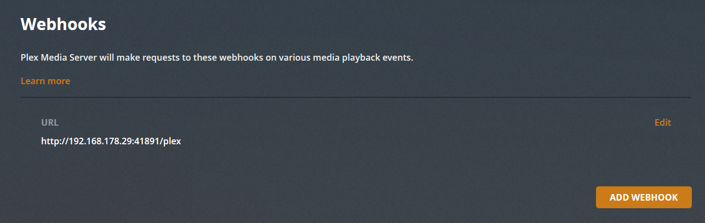
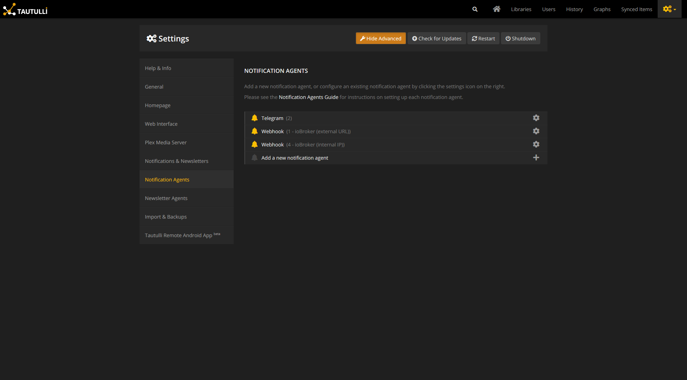

# ioBroker.plex
Integration of the Plex Media Server in ioBroker (with or without Plex Pass). Furthermore, Tautulli integration.


[](https://www.npmjs.com/package/iobroker.plex)
[](https://travis-ci.org/Zefau/ioBroker.plex)
[](https://www.npmjs.com/package/iobroker.plex)
[](https://greenkeeper.io/)

[](https://nodei.co/npm/iobroker.plex/) 


**Table of contents**
1. [Setup instructions](#1-setup-instructions)
   1. [Basic setup](#11-basic-setup)
   2. [Advanced Setup](#12-advanced-setup-plex-pass-or-tautulli)
2. [Channels & States](#2-channels--states)
   1. [with Basic Setup](#21-with-basis-setup)
   2. [with Advanced Setup](#22-with-advanced-setup)
3. [Changelog](#changelog)
4. [Licence](#license)


## 1. Setup instructions
### 1.1. Basic Setup
For the basic setup it is only required to provide the IP address (and port) of your Plex installation. Once this is given, ioBroker.plex will retrieve all the basic data (incl. Servers, Libraries). See [Channels & States](#21-with-basis-setup) for the full list of basic data.

### 1.2. Advanced Setup (Plex Pass or Tautulli)
#### 1.2.1. Plex Pass
If you are a Plex Pass user, you may [setup a webhook](https://support.plex.tv/articles/115002267687-webhooks/#toc-0) in the Plex Settings to retrieve the current event / action from your Plex Media Server (play, pause, resume, stop, viewed and rated).

Navigate to your Plex Media Server and go to ```Settings``` and ```Webhook```. Created a new webhook by clicking ```Add Webhook``` and enter your ioBroker IP adress with the custom port specified in the ioBroker.plex settings and trailing ```/plex``` path, e.g. ```http://192.168.178.29:41891/plex```:



#### 1.2.2.Tautulli
[Tautulli is a 3rd party application](https://tautulli.com/#about) that you can run alongside your Plex Media Server to monitor activity and track various statistics. Most importantly, these statistics include what has been watched, who watched it, when and where they watched it, and how it was watched. All statistics are presented in a nice and clean interface with many tables and graphs, which makes it easy to brag about your server to everyone else. Check out [Tautulli Preview](https://tautulli.com/#preview) and [install it on your preferred system](https://github.com/Tautulli/Tautulli-Wiki/wiki/Installation) if you are interested.

This adapter connects to the [Tautulli API](https://github.com/Tautulli/Tautulli/blob/master/API.md) and also receives webhook events from Tautulli.

##### 1.2.2.1. API
Once Tautulli is installed, open the _Settings_ page from Tautulli dashboard and navigate to _Web Interface_. Scroll down to the _API_ section and make sure ```Enable API``` is checked. Copy the ```API key``` and enter it in the ioBroker.plex settings. Furthermore, add the Tautulli IP address and port to allow API communication.

##### 1.2.2.2. Webhook
###### Overview
To setup a webook using Tautulli, following the instrucutions below and make sure you have completed all 4 steps:
1. Add Notification Agent
2. Configure Webhook in Notification Agent
3. Configurehh Triggers in Notification Agent
4. Configure Data in Notification Agent

###### Description
Once installed open the settings page from Tautulli dashboard and navigate to Notification Agents as seen below:



1. Click _Add a new notification agent_ and _Webhook_.
2. Enter your ioBroker IP adress with the custom port specified in the ioBroker.plex settings and trailing ```/tautulli``` path, e.g. ```http://192.168.178.29:41891/tautulli```:
   
   
   Furthermore, choose ```POST``` for the _Webhook Method_ and enter any description you like in _Description_.
3. Next, go to the _Triggers_ tab, select your desired (or simply all) options
4. Finally, __most important__ fill in the respective data payload in the _Data_ tab according to the [Notification configuration found here](README-tautulli.md#notification-configuration). Copy the whole content into the first four notification agents (```Playback Start```, ```Playback Stop```, ```Playback Pause``` and ```Playback Resume```) as shown below for ```Playback Start```:
   
   


## 2. Channels & States
Having both the basic and advanced setup configured, the following channels will appear (libraries, servers and users are only examples of course). See further below for [full list of channels & states](#21-with-basis-setup).


### 2.1. With Basis Setup
After sucessful basic setup the following channels and states will be created:

| Channel / Folder | State | Description |
| ------- | ----- | ----------- |
| __libraries__ | - | Plex Libraries |
| __servers__ | - | Plex Servers |
| __settings__ | - | Plex Settings |

### 2.2. With Advanced Setup
After sucessful advanced setup the following channels and states will _additionally_ be created:

| Channel / Folder | State | Description | Remark |
| ------- | ----- | ----------- | ------ |
| __\_playing__ | - | Plex Media being played | with Plex Pass or Tautulli |
| __statistics__ | - | Plex Watch Statistics | only with Tautulli |
| statistics.libraries | - | Plex Watch Statistics | only with Tautulli |
| statistics.libraries._\<libraryName\>_ | - | Library Watch Statistics _\<libraryName\>_ | only with Tautulli |
| statistics.users | - | User Watch Statistics | only with Tautulli |
| statistics.users._\<userName\>_ | _(same states as in statistics.libraries)_ | User Watch Statistics _\<userName\>_ | only with Tautulli |
| __users__ | - | Plex Users | only with Tautulli |
| users._\<userName\>_ | - | Plex User _\<userName\>_ | only with Tautulli |


## Changelog

### 1.0.0 (2019-xx-xx) [MILESTONES / PLANNED FEATURES FOR v1.0.0 RELEASE]
- add Plex Pass Authentication by PIN (and removing current authentication with user / password)
- add playback control for players
- add support for all Tautulli triggers
- add state description for object tree ```_playing```
- add support / discovery in [iobroker.discovery](https://github.com/ioBroker/ioBroker.discovery)

### 0.2.0 (2019-05-xx) [UPCOMING RELEASE]
- fixed @iobroker/adapter-core dependency

### 0.1.0 (2019-04-26) [CURRENT RELEASE]
- get initial data from Plex API
- receive events from Plex Webhook (Plex Pass only)
- receive events from Tatulli (if used)


## License
The MIT License (MIT)

Copyright (c) 2019 Zefau <zefau@mailbox.org>

Permission is hereby granted, free of charge, to any person obtaining a copy
of this software and associated documentation files (the "Software"), to deal
in the Software without restriction, including without limitation the rights
to use, copy, modify, merge, publish, distribute, sublicense, and/or sell
copies of the Software, and to permit persons to whom the Software is
furnished to do so, subject to the following conditions:

The above copyright notice and this permission notice shall be included in
all copies or substantial portions of the Software.

THE SOFTWARE IS PROVIDED "AS IS", WITHOUT WARRANTY OF ANY KIND, EXPRESS OR
IMPLIED, INCLUDING BUT NOT LIMITED TO THE WARRANTIES OF MERCHANTABILITY,
FITNESS FOR A PARTICULAR PURPOSE AND NONINFRINGEMENT. IN NO EVENT SHALL THE
AUTHORS OR COPYRIGHT HOLDERS BE LIABLE FOR ANY CLAIM, DAMAGES OR OTHER
LIABILITY, WHETHER IN AN ACTION OF CONTRACT, TORT OR OTHERWISE, ARISING FROM,
OUT OF OR IN CONNECTION WITH THE SOFTWARE OR THE USE OR OTHER DEALINGS IN
THE SOFTWARE.
