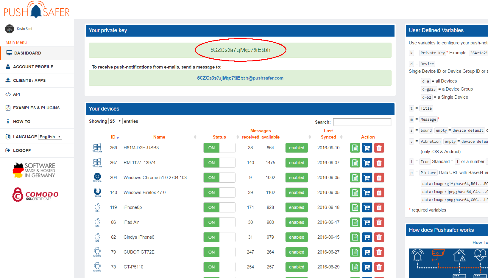

# ioBroker pushsafer Adapter

  [](https://www.npmjs.com/package/iobroker.pushsafer)
[](https://www.npmjs.com/package/iobroker.pushsafer)

[](https://nodei.co/npm/iobroker.pushsafer/)


Send pushsafer notifications from ioBroker.
Pushsafer.com supports iOS, Android, Windows 10 (Phone & Desktop) devices and Webpush (Chrome & Firefox)

## Configuration
First of all it is required an account on pushsafer with a [private key](https://www.pushsafer.com/), instead of the private key, you also can use a alias key with predefined parameters.


## Usage
To send notification from ScriptEngine just write: 

```javascript
// send notification to all instances of pushsafer adapter
sendTo("pushsafer", "message body");

// send notification to specific instance of pushsafer adapter
sendTo("pushsafer.1", "message body");

// To specify subject or other options
sendTo("pushsafer", {
   message:   'Test text',             // mandatory - your text message
   title:     'SweetHome',             // optional  - your message's title, otherwise your app's name is used
   device:    '12',                    // optional  - a device id or device group id (empty or a = all devices)
   sound:     '2',                     // optional  - a number betwenn 0-60 (see pushsafers API description)
   icon:      '2',                     // optional  - a number betwenn 1-177 (see pushsafers API description)
   vibration: '0',                     // optional  - a number betwenn 0-3 (see pushsafers API description)
   priority:  '2',                     // optional  - 2, 1, 0, -1, -2 (see pushsafers API description)
   retry:     '600',                   // optional  - Integer 60-10800 (60s steps): Time in seconds, after a message shuld resend (see pushsafers API description)
   expire:    '1200',                  // optional  - Integer 60-10800: Time in seconds, after the retry/resend should stop. (see pushsafers API description)
   answer:    '1',                     // optional  - 1 = Answer is possible, 0 = Answer is not possible. (see pushsafers API description)
   picture:   'absolutePathToPicture', // optional  - absolute path to picture or base64 coded image URL
   picture2:  'absolutePathToPicture2',// optional  - absolute path to picture or base64 coded image URL
   picture3:  'absolutePathToPicture3',// optional  - absolute path to picture or base64 coded image URL   
   url:       'http://blabla',         // optional  - URL or URL scheme, https://www.pushsafer.com/en/url_schemes
   urlTitle:  'Link to BLA',           // optional  - title of URL
   time2live: '60',                    // optional  - Integer number 0-43200: Time in minutes, after which message automatically gets purged.
});
```

You can find API description [here](https://www.pushsafer.com/en/pushapi)

You can use blockly too.

## Changelog

### 1.0.3 (2021-01-13)
* (Apollon77) update dependencies

### 1.0.2 (2020-04-24)
* (bluefox) Added color icon option
* (bluefox) Refactoring

### 0.1.9 (2019-09-19)
* (appzer) add new sounds & icons, add new parameter (priority, retry, expire, answer)

### 0.1.8 (2017-09-12)
* (bluefox) use new pushsafer package

### 0.1.7 (2016-10-19)
* (appzer) implement time2live parameter

### 0.1.6 (2016-10-17)
* (bluefox) implement picture send
* (bluefox) add blockly

### 0.1.3 (2016-09-21)
* (bluefox) fix config dialog

### 0.1.2 (2016-09-21)
* fixed error with private key

### 0.1.0 (2016-08-28)
* filter out double messages

## License

The MIT License (MIT)

Copyright (c) 2014-2021 bluefox <dogafox@gmail.com>

Permission is hereby granted, free of charge, to any person obtaining a copy
of this software and associated documentation files (the "Software"), to deal
in the Software without restriction, including without limitation the rights
to use, copy, modify, merge, publish, distribute, sublicense, and/or sell
copies of the Software, and to permit persons to whom the Software is
furnished to do so, subject to the following conditions:

The above copyright notice and this permission notice shall be included in
all copies or substantial portions of the Software.

THE SOFTWARE IS PROVIDED "AS IS", WITHOUT WARRANTY OF ANY KIND, EXPRESS OR
IMPLIED, INCLUDING BUT NOT LIMITED TO THE WARRANTIES OF MERCHANTABILITY,
FITNESS FOR A PARTICULAR PURPOSE AND NONINFRINGEMENT. IN NO EVENT SHALL THE
AUTHORS OR COPYRIGHT HOLDERS BE LIABLE FOR ANY CLAIM, DAMAGES OR OTHER
LIABILITY, WHETHER IN AN ACTION OF CONTRACT, TORT OR OTHERWISE, ARISING FROM,
OUT OF OR IN CONNECTION WITH THE SOFTWARE OR THE USE OR OTHER DEALINGS IN
THE SOFTWARE.
