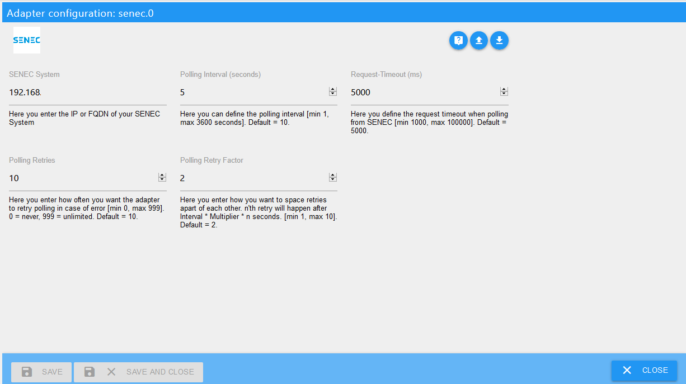

# ioBroker.senec

## senec adapter for ioBroker
Targeted at the Senec Home V2.1 System.
Other systems might work, as long as they use lala.cgi.

## Installation
You is facilitated via the ioBroker web interface and the configuration will auto-open once installation is completed.

## Setup
In addition to the adapter installation you have to add an instance of the adapter.

### Configuration 

| Feld         | Beschreibung |                                                                       
|:-------------|:-------------|
|SENEC System    |Type in the IP-address of your SENEC system (FQDN is also possible if you have a working local DNS).|
|Polling Interval High Priority Data|You can change the polling interval for high priority data (how often the Adapter reads from your Senec System), too. (Default: 10 seconds)|
|Polling Interval Low Priority Data|You can change the polling interval for low priority data (how often the Adapter reads from your Senec System), too. (Default: 60 minutes) 
Please be careful with high-frequency polling because this can render your SENEC machine unable to connect to the SENEC server!|
|Request-Timeout|If your network requires a higher timeout for requests sent to SENEC, please change the Request-Timeout in miliseconds accordingly. (Default: 5000 miliseconds)|
|Polling Retries|In case there is an issue communicating with SENEC the adapter will retry several times. You can adjust how often it will try to read from SENEC. (Default: 10) 
This does not apply to Adapter Start - if the System is unavailable to Adapter will stop.|
|Polling Retry Factor|To space retries apart a bit more you can adjust the Polling Retry Factor. (Default: 2) - Example: Using default settings the 1st retry will happen 20 seconds after the initial try, the 2nd will happen 40 seconds after the 2nd try. After each successful connect to SENEC, the number of retries is reset.|

Once finished setting up configuration, hit `SAVE AND CLOSE` to leave configuration dialogue. The adapter will automatically restart.

## Usage
Here you can find a description of the states and how to use them. All states of this adapter are read-only states.
Depending on the individual system states might not be available or additional states could be there.
If a state is not documented (or only partially documented) and you know what it represents, please send a pull request (or open a ticket with the information).

### States

#### Channel: info

* info.connection

    |Data type|Permission|                                                                       
    |:---:|:---:|
    |boolean|R|

   *Read-only boolean which is true if the adapter is connected to the senec system.*
   
#### Channel: BMS

* BL[0-3]

    |Data type|Permission|                                                                       
    |:---:|:---:|
    |number|R|

   *Read-only number, which represents ? for each battery pack.*
   
* CHARGED_ENERGY[0-3]

    |Data type|Permission|                                                                       
    |:---:|:---:|
    |number|R|

   *Read-only number, which represents the amount of charged energy per battery pack in unit ?*
   
* CHARGE_CURRENT_LIMIT[0-3]

    |Data type|Permission|                                                                       
    |:---:|:---:|
    |number|R|

   *Read-only number, which represents the current charge limit in Ampere per battery pack.*
   
* CURRENT[0-3]

    |Data type|Permission|                                                                       
    |:---:|:---:|
    |number|R|

   *Read-only number, which represents each battery pack's current in Ampere.*
   
* CYCLES[0-3]

    |Data type|Permission|                                                                       
    |:---:|:---:|
    |number|R|

   *Read-only number, which represents each battery pack's current charching cycles.*
   
* DISCHARGED_ENERGY[0-3]

    |Data type|Permission|                                                                       
    |:---:|:---:|
    |number|R|

   *Read-only number, which represents the amount of energy discharged per battery in unit ?.*
   
* DISCHARGE_CURRENT_LIMIT[0-3]

    |Data type|Permission|                                                                       
    |:---:|:---:|
    |number|R|

   *Read-only number, which represents each battery pack's current discharge limit in Ampere.*
   
* FW[0-3]

    |Data type|Permission|                                                                       
    |:---:|:---:|
    |number|R|

   *Read-only number, which represents each battery pack's firmware version.*
   
* HW_EXTENSION[0-3]

    |Data type|Permission|                                                                       
    |:---:|:---:|
    |number|R|

   *Read-only number, which represents each battery pack's ?.*
   
* HW_MAINBOARD[0-3]

    |Data type|Permission|                                                                       
    |:---:|:---:|
    |number|R|

   *Read-only number, which represents each battery pack's mainboard version.*
   
* MAX_CELL_VOTAGE[0-3]

    |Data type|Permission|                                                                       
    |:---:|:---:|
    |number|R|

   *Read-only number, which represents each battery pack's maximum cell voltage in Volts.*
   
* MIN_CELL_VOTAGE[0-3]

    |Data type|Permission|                                                                       
    |:---:|:---:|
    |number|R|

   *Read-only number, which represents each battery pack's minimum cell voltage in Volts.*
   
* SN[0-3]

    |Data type|Permission|                                                                       
    |:---:|:---:|
    |number|R|

   *Read-only number, which represents each battery pack's serial number.*
   
* SOC[0-3]

    |Data type|Permission|                                                                       
    |:---:|:---:|
    |number|R|

   *Read-only number, which represents each battery pack's state of charge.*
   
* SOH[0-3]

    |Data type|Permission|                                                                       
    |:---:|:---:|
    |number|R|

   *Read-only number, which represents each battery pack's state of health.*
   
* STATUS[0-3]

    |Data type|Permission|                                                                       
    |:---:|:---:|
    |number|R|

   *Read-only number, which represents each battery pack's status.*
   
* TEMP_MAX[0-3]

    |Data type|Permission|                                                                       
    |:---:|:---:|
    |number|R|

   *Read-only number, which represents each battery pack's maximum temperature.*
   
* TEMP_MIN[0-3]

    |Data type|Permission|                                                                       
    |:---:|:---:|
    |number|R|

   *Read-only number, which represents each battery pack's minimum temperature.*
   
* VOLTAGE[0-3]

    |Data type|Permission|                                                                       
    |:---:|:---:|
    |number|R|

   *Read-only number, which represents each battery pack's voltage in Volts.*
   
* BMS_READY_FLAG

    |Data type|Permission|                                                                       
    |:---:|:---:|
    |boolean|R|

   *Read-only boolean, which represents if the BMS is ready.*
   
* MODULES_CONFIGURED

    |Data type|Permission|                                                                       
    |:---:|:---:|
    |number|R|

   *Read-only number, which represents the number of modules currently configured in the system.*
   
* MODULE_COUNT

    |Data type|Permission|                                                                       
    |:---:|:---:|
    |number|R|

   *Read-only number, which represents the number of modules currently known the system (incl. non-configured).*
   
* START_UPDATE

    |Data type|Permission|                                                                       
    |:---:|:---:|
    |boolean|R|

   *Read-only boolean, which represents if an update is to be started.*
   
* WIZARD_ABORT

    |Data type|Permission|                                                                       
    |:---:|:---:|
    |boolean|R|

   *Read-only boolean, which represents if the setup wizard was aborted.*
   
* WIZARD_CONFIRM

    |Data type|Permission|                                                                       
    |:---:|:---:|
    |boolean|R|

   *Read-only boolean, which represents if the setup wizard was confirmed.*
   
* WIZARD_DCCONNECT

    |Data type|Permission|                                                                       
    |:---:|:---:|
    |boolean|R|

   *Read-only boolean, which represents ?.*
   
* WIZARD_START

    |Data type|Permission|                                                                       
    |:---:|:---:|
    |number|R|

   *Read-only boolean, which represents if the setup wizard is to be started.*
   
* WIZARD_STATE

    |Data type|Permission|                                                                       
    |:---:|:---:|
    |boolean|R|

   *Read-only number, which represents the setup wizard's state.*
   

#### Channel: ENERGY

* GUI_BAT_DATA_CURRENT

    |Data type|Permission|                                                                       
    |:---:|:---:|
    |number|R|

   *Read-only number, which represents the battery's current in Amps.*
   
* GUI_BAT_DATA_FUEL_CHARGE

    |Data type|Permission|                                                                       
    |:---:|:---:|
    |number|R|

   *Read-only number, which represents the current level of your battery system in %.*
   
* GUI_BAT_DATA_VOLTAGE

    |Data type|Permission|                                                                       
    |:---:|:---:|
    |number|R|

   *Read-only number, which represents the battery's current voltage in volt.*
   
* GUI_BAT_DATA_POWER

    |Data type|Permission|                                                                       
    |:---:|:---:|
    |number|R|

   *Read-only number, which represents how much power is coming from / going into the battery in Watts. Negative values are discharging.*
   
* GUI_BOOSTING_INFO

    |Data type|Permission|                                                                       
    |:---:|:---:|
    |boolean|R|

   *Read-only boolean, which we don't know the exact meaning of yet.*
   
* GUI_CHARGING_INFO

    |Data type|Permission|                                                                       
    |:---:|:---:|
    |boolean|R|

   *Read-only boolean, which represents if the battery is currently charging.*
   
* GUI_GRID_POW

    |Data type|Permission|                                                                       
    |:---:|:---:|
    |number|R|

   *Read-only number, which represents the power currenty coming from / going into the grid in Watts. Negative values are sending into the grid.*
   
* GUI_HOUSE_POW

    |Data type|Permission|                                                                       
    |:---:|:---:|
    |number|R|

   *Read-only number, which represents the power in Watts currently consumed by the house.*
   
* GUI_INVERTER_POWER

    |Data type|Permission|                                                                       
    |:---:|:---:|
    |number|R|

   *Read-only number, which represents the current power supplied by your PV system.*
   
* STAT_HOURS_OF_OPERATION

    |Data type|Permission|                                                                       
    |:---:|:---:|
    |number|R|

   *Read-only number, detailing the system's uptime in hours.*
   
* STAT_MAINT_REQUIRED

    |Data type|Permission|                                                                       
    |:---:|:---:|
    |boolean|R|

   *Read-only boolean, which represents if your senec system requires maintenance.*
   
* STAT_STATE

    |Data type|Permission|                                                                       
    |:---:|:---:|
    |number|R|

   *Read-only number, which represents the system's state.*
   
* STAT_STATE_Text

    |Data type|Permission|                                                                       
    |:---:|:---:|
    |string|R|

   *Read-only string, which represents the system's state in human readable format (sorry - we only have the german states from senec).*
   
#### Channel: STATISTIC

* STAT_DAY_BAT_CHARGE

    |Data type|Permission|                                                                       
    |:---:|:---:|
    |number|R|

   *Read-only number, which represents the amount of power charged into the battery in kWh today.*
   
* STAT_DAY_BAT_DISCHARGE

    |Data type|Permission|                                                                       
    |:---:|:---:|
    |number|R|

   *Read-only number, which represents the amount of power drawn from the battery in kWh today.*
   
* STAT_DAY_E_GRID_EXPORT

    |Data type|Permission|                                                                       
    |:---:|:---:|
    |number|R|

   *Read-only number, which represents the amount of power in kWh delivered into the net today.*
   
* STAT_DAY_E_GRID_IMPORT

    |Data type|Permission|                                                                       
    |:---:|:---:|
    |number|R|

   *Read-only number, which represents the amount of power in kWh drawn from the net today.*
   
* STAT_DAY_E_HOUSE

    |Data type|Permission|                                                                       
    |:---:|:---:|
    |number|R|

   *Read-only number, which represents the amount of power in kWh consumed by the house today.*
   
* STAT_DAY_E_PV

    |Data type|Permission|                                                                       
    |:---:|:---:|
    |number|R|

   *Read-only number, which represents the amount of power in kWh generated by your PV today.*
   
   
#### Channel: SYS_UPDATE

* NPU_IMAGE_VERSION

    |Data type|Permission|                                                                       
    |:---:|:---:|
    |number|R|

   *Read-only number, representing the Revision NPU-IMAGE*

* NPU_VER

    |Data type|Permission|                                                                       
    |:---:|:---:|
    |number|R|

   *Read-only number, representing the Revision NPU-REGS*

* UPDATE_AVAILABLE

    |Data type|Permission|                                                                       
    |:---:|:---:|
    |boolean|R|

   *boolean-value which is true if there is an update available (Updates happen automatically and are scheduled by SENEC).*
   
   
#### Channel: WIZARD

* APPLICATION_VERSION

    |Data type|Permission|                                                                       
    |:---:|:---:|
    |string|R|

   *Read-only text, representing the Revision MCU*

* CONFIG_LOADED

    |Data type|Permission|                                                                       
    |:---:|:---:|
    |boolean|R|

   *boolean-value which is true if configuration is loaded. This being false is very unlikely and it shouldn't persist as false.*
   
* INTERFACE_VERSION

    |Data type|Permission|                                                                       
    |:---:|:---:|
    |string|R|

   *Read-only text, representing the Revision GUI*
   
* SETUP_NUMBER_WALLBOXES

    |Data type|Permission|                                                                       
    |:---:|:---:|
    |number|R|

   *Read-only number, which designates how many wallboxes are configured in the system.*
   
* SETUP_WALLBOX_SERIAL[0..3]

    |Data type|Permission|                                                                       
    |:---:|:---:|
    |string|R|

   *Read-only text, which designates the serial number of wallbox [0..3].*

## Changelog

### 1.0.7 (NoBl)
* Reading all known states from SENEC.
* Split states into high/low priority (heavy requesting the SENEC system renders it unable to sync with the SENEC datacenter!).
* Updated adapter-core and testing versions along with current dev dependencies. Removed node 8 support.
* Added more state descriptions to manual. But need input on these and those that are still not documented.

### 1.0.6 (NoBl)
* Moved senec states and state attributes to libs
* Added missing state descriptions

### 1.0.5 (2020-03-07) (NoBl)
* Added States for: Energy: GUI_BAT_DATA_VOLTAGE, GUI_BAT_DATA_CURRENT, STAT_HOURS_OF_OPERATION; Sys_update: NPU_VER, NPU_IMAGE_VERSION, Wizard: APPLICATION_VERSION, INTERFACE_VERSION
* Readme and Documentation (EN exists, now) updated
* Changed behavior for unknown values completely. They will now be stored as string plus prefixed with "REPORT TO DEV:" so users can easily report back what needs updating.
* added handling for "st_" values in json
* added additional configuration options
* changed retry-behaviour in case of connection issues, ...

### 1.0.4 (2020-03-06)
* (NoBl) Repo URL updated
### 1.0.3 (2020-03-06)
* (NoBl) added link to documentation in german
### 1.0.2 (2020-03-04)
* (NoBl) added missing status codes (85 in total now)
* (NoBl) added status code to status message for easier reference
* (NoBl) added states for wallboxes and battery modules
### 1.0.1
* (NoBl) updated readme
### 1.0.0
* (NoBl) initial release

## License
MIT License

Copyright (c) 2020 Norbert Bluemle <github@bluemle.org>

Permission is hereby granted, free of charge, to any person obtaining a copy
of this software and associated documentation files (the "Software"), to deal
in the Software without restriction, including without limitation the rights
to use, copy, modify, merge, publish, distribute, sublicense, and/or sell
copies of the Software, and to permit persons to whom the Software is
furnished to do so, subject to the following conditions:

The above copyright notice and this permission notice shall be included in all
copies or substantial portions of the Software.

THE SOFTWARE IS PROVIDED "AS IS", WITHOUT WARRANTY OF ANY KIND, EXPRESS OR
IMPLIED, INCLUDING BUT NOT LIMITED TO THE WARRANTIES OF MERCHANTABILITY,
FITNESS FOR A PARTICULAR PURPOSE AND NONINFRINGEMENT. IN NO EVENT SHALL THE
AUTHORS OR COPYRIGHT HOLDERS BE LIABLE FOR ANY CLAIM, DAMAGES OR OTHER
LIABILITY, WHETHER IN AN ACTION OF CONTRACT, TORT OR OTHERWISE, ARISING FROM,
OUT OF OR IN CONNECTION WITH THE SOFTWARE OR THE USE OR OTHER DEALINGS IN THE
SOFTWARE.