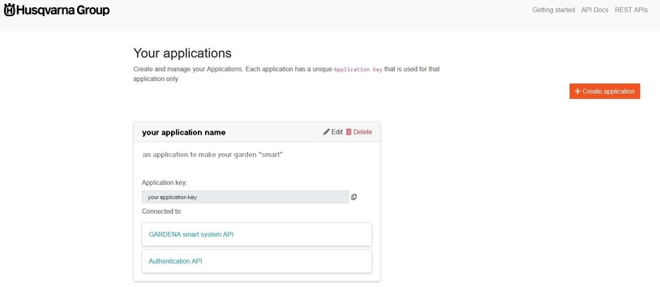
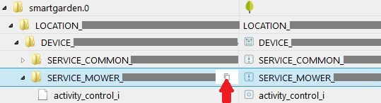

 

# ioBroker.smartgarden

[](http://iobroker.live/badges/smartgarden-installed.svg)
[](https://www.npmjs.com/package/iobroker.smartgarden)
[](https://www.npmjs.com/package/iobroker.smartgarden)
[](https://travis-ci.org/jpgorganizer/ioBroker.smartgarden)
[](http://iobroker.live/badges/smartgarden-stable.svg)

[](https://nodei.co/npm/iobroker.smartgarden/)


**If you like it, please consider a donation:**

[](https://www.paypal.com/cgi-bin/webscr?cmd=_s-xclick&hosted_button_id=8C7M7MH3KPYDC&source=url) 
  


## ioBroker smartgarden adapter for GARDENA smart system

An adapter for GARDENA smart system using official 
[GARDENA smart system API](https://developer.husqvarnagroup.cloud/apis/GARDENA+smart+system+API#/general) 
and service. 

The adapter allows the development of an application (e.g. with VIS) that 
can be used in parallel with the official GARDENA app. The adapter and 
its additional features do not affect any of the basic functions of the 
GARDENA app and vice versa.

The adapter is not a complete replacement for the GARDENA app, but an 
addition to integrate the GARDENA devices into a smart home with ioBroker. 
The most important actions can be carried out with the adapter. It also 
offers the opportunity to implement your own ideas that are not possible 
with the GARDENA app.


## Supported devices

  - GARDENA smart SILENO robotic lawnmowers
  - GARDENA smart Irrigation Control
  - GARDENA smart Pressure Pump
  - GARDENA smart Water Control
  - GARDENA smart Power Adapter
  - GARDENA smart Sensor 

  For more information about the devices see at [GARDENA German website](https://www.gardena.com/de/produkte/smart/smartsystem/) 
  and [here in English](https://www.gardena.com/uk/products/smart/smart-system/).
  

## Requirements

To use this adapter you need two things:
1. an GARDENA smart system account
1. an GARDENA application key
 
To get both things please go to 
[https://developer.husqvarnagroup.cloud/docs#/docs/getting-started/](https://developer.husqvarnagroup.cloud/docs#/docs/getting-started/). 

 


**Note:**
  - If you already have a Husqvarna Automower® Connect or a 
    GARDENA smart system account, you can Sign In with that account and 
	continue with Step 2, Create application to get the application key.
	
	---
	
	***And it's almost certain that you have an account.*** *Please use the
	same account as for the GARDENA app in which your GARDENA devices are 
	registered. Otherwise you will not 	get access to your devices.*
	
	---
	
  - Make sure that you've connected the application (from Step 2) to the API's
    - Authentication API ***and***
	- GARDENA smart system API.

And of course you need a running ioBroker installation and you should own 
at least one [GARDENA smart device](#supported-devices).

  
## Table of Contents
  * [ioBroker smartgarden adapter for GARDENA smart system](#iobroker-smartgarden-adapter-for-gardena-smart-system)
  * [Supported devices](#supported-devices)
  * [Requirements](#requirements)
  * [Table of Contents](#table-of-contents)
  * [Installation](#installation)
  * [Setup adapter](#setup-adapter)
  * [Getting support](#getting-support)
  * [Data points of the adapter](#data-points-of-the-adapter)
     * [General things to know about data points](#general-things-to-know-about-data-points)
     * [For SERVICE_MOWER](#for-service_mower)
     * [For SERVICE_VALVE_SET](#for-service_valve_set)
     * [For SERVICE_VALVE](#for-service_valve)
     * [For SERVICE_POWER_SOCKET](#for-service_power_socket)
     * [For SERVICE_SENSOR](#for-service_sensor)
     * [For SERVICE_COMMON](#for-service_common)
  * [Rate Limits](#rate-limits)
  * [Irrigation not allowed while mowing](#Irrigation-not-allowed-while-mowing)
     * [What's the problem?](#whats-the-problem)
	 * [What is being done?](#what-is-being-done)
	 * [Basic behaviour -- WARNING](#basic-behaviour----warning)  
  * [Wishes for data points](#Wishes-for-data-points)
  * [Note](#note)
  * [Changelog](#changelog)
     * [1.0.4](#104)
     * [1.0.3](#103)
     * [previous versions](#102)
  * [Credits](#credits)
  * [License](#license)  
  

## Installation

Adapter is available 
- at npm: Install with `npm install iobroker.smartgarden` 
- at GitHub under https://github.com/jpgorganizer/ioBroker.smartgarden. 
An description how to install from GitHub is available 
[here](https://www.iobroker.net/docu/index-235.htm?page_id=5379&lang=de#3_Adapter_aus_eigener_URL_installieren) (German language).

## Setup adapter

1. Install the adapter
2. Create an instance of the adapter
3. Check and complete instance configuration

   **If you change any value of those settings please restart your adapter.**

   3.1 Edit username, password and application key in main instance 
   configuration 

      | Parameter | Description |
      | - | - |
      | user name | user name for GARDENA smart system |
      | password | corresponding password |
      | API Key |  API Key (application key), e.g. under [Requirements](#requirements) | 

   Please note that password and application key are encoded and stored within 
   the adapter and become just decoded for authentication with the GARDENA 
   application host.

   3.2 Verify default values of miscellaneous settings and switch on/off 
   options in instance configuration. For most users the default values 
   will be ok.
   
      | Parameter | Description |
      | - | - |
      | pre-define states | pre-define all states of Gardena API regardless they are currently transmitted; switch on or off; if switched on then all states of the GARDENA smart system API are created regardless if they are currently transmitted by GARDENA service or not; default: off; *(new in v0.4.0)*|
      | forecast | use forecast for charging time and mower remaining time; switch forecast charging and mowing time of mower on/off; default: off; *(new in v0.5.0)*|
      | cycles | number of MOWER history cycles; you can use any number from 3 (minimum), but 10 (default) seems to be a good value; only relevant if the above *'forecast'* is on; *(new in v0.5.0)*|
      | irrigation check| Use the check whether irrigation is allowed while mowing; switch on/off; default: off; *(new in v0.6.0)*|
    
   3.3 Verify default values of systems settings and switch on/off options in 
   instance configuration. **Most users will not have to change anything on this tab.**

      | Parameter | Description |
      | - | - |
      | Loglevel | Loglevel: 0 = no log, 1 = some logs, 2 = some more logs, 3 = all logs; default: 0|
	  | monitoring Rate Limits | use monitoring for the rate limits of Gardena smart system API; switch on/off; default: off; *(new in v1.0.2)*|	
      | connection retry interval | interval for retry to connect to Gardena Webservice in case of an error (in seconds); default: 300, minimum: 60; *(new in v1.0.3)*|
      | ping frequence | Frequence for sending Ping's to Gardena Webservice (in seconds); default: 150, minimum: 1, maximum: 300|
      | auth factor  | Factor for validity of authentication token; default: 1.001 |
      | Auth-URL| Authentication host URL; default: [https://api.authentication.husqvarnagroup.dev](https://api.authentication.husqvarnagroup.dev)|
      | Base-URL| Webservice Base-URL; default: [https://api.smart.gardena.dev](https://api.smart.gardena.dev)|
   
  
## Getting support

To get help read this [README](README.md) and the [FAQ](FAQ.md) carefully. 
If you need further support please join the 
[ioBroker forum thread](https://forum.iobroker.net/topic/31289/neuer-adapter-smartgarden-adapter-for-gardena-smart-system).
  
## Data points of the adapter
The adapter is designed to monitor and control GARDENA smart system devices. 
For this there will be one `LOCATION` and one or many `DEVICE`'s. 
For each `DEVICE` there will be 
  - one `SERVICE_COMMON_<id>` and
  - one or more `SERVICE_<servicelink_type>_<id>`. 

Where `<servicelink_type>` is a type description for the 
device, for example MOWER or VALVE and `<id>` is a (encoded) 
GARDENA device id used by the API. 
See description for ServiceLink at 
[https://developer.husqvarnagroup.cloud/apis/GARDENA+smart+system+API#/swagger](https://developer.husqvarnagroup.cloud/apis/GARDENA+smart+system+API#/swagger).

Controlling/monitoring for each device is possible via the 
`SERVICE_<servicelink_type>` listed in the following table. The 
`SERVICE_COMMON` provides general information about the device.

  | device | SERVICE_<servicelink_type> |
  | - | - |
  | smart SILENO robotic lawnmower | SERVICE_MOWER and SERVICE_COMMON |
  | smart Irrigation Control | SERVICE_VALVE_SET, SERVICE_VALVE and SERVICE_COMMON |
  | smart Pressure Pump | SERVICE_VALVE and SERVICE_COMMON |
  | smart Water Control | SERVICE_VALVE and SERVICE_COMMON |
  | smart Power Adapter | SERVICE_POWER_SOCKET and SERVICE_COMMON |
  | smart Sensor | SERVICE_SENSOR and SERVICE_COMMON |

If you need more information about the data points please have a look at 
[https://developer.husqvarnagroup.cloud/apis/GARDENA+smart+system+API#/swagger](https://developer.husqvarnagroup.cloud/apis/GARDENA+smart+system+API#/swagger). 
There you'll find a description for every data point; except for those which 
are marked as data points of the adapter and not of the 
GARDENA smart system API.
  
The adapter creates its own data points for various features / options when 
the feature is selected. These data points are not automatically deleted 
when the feature is deselected. If you no longer need these data points, 
they can be deleted manually.  

### General things to know about data points

The adapter doesn't change any values transmitted by the GARDENA smart system API. 
The only thing that is done (from version 1.0.0) is to check the type of *timestamps* 
and *numbers*.

| check for | description |
| - | - |
| timestamps | all timestamps are given in UTC; if a received timestamp is not a valid timestamp, `01 Jan 1970 00:00:00Z` (Unix time zero) is used instead. So if you see this date/time please report. |
| numbers | if a number is not a valid number, `-1` is used instead.  So if you see this number please report. |

Requests to control a device will succeed as soon as the command was accepted by the smart Gateway. A successful 
execution of the command on the device itself can be observed by a respective state change. 
*Example:* sending a command to start the VALVE service of a smart Water Control will result in the `activity_value` 
data point of the service to be changed after the device processed the command.

**Note:** Requests to control a device cannot be sent while the smartgarden adapter is not connected to  
GARDENA smart system API.
  
### For SERVICE_MOWER
#### Controlling
To control the device use data point
- `activity_control_i`

  *This data point is generated by the adapter and is not required due to the GARDENA smart system API.*
  
  Change this data point to start the mower. 
  - To start for a defined time set the value to the planned duration in 
  seconds (please use multiples of 60)
  - for automatic operation set string `START_DONT_OVERRIDE`
  - to cancel the current operation and return to charging station use 
  string `PARK_UNTIL_NEXT_TASK`
  - to cancel the current operation, return to charging station and ignore 
  schedule use string `PARK_UNTIL_FURTHER_NOTICE`

#### Monitoring
All other data points are just for monitoring and information.

Special data points:
- `activity_mowing_i`

  *This data point is generated by the adapter and is not required due to the GARDENA smart system API.*

  This data point shows two different states for the mower: 
  - `true`: mowing or 
  - `false`: not mowing. 
  
  This data point can be used for further actions where it is important to 
  know whether the mower is safely on the lawn or not.
  
  Depending on the value of data point `activity_value` this data point is set. 
  Please see following table for details.

  | `activity_value` | `activity_mowing_i` |
  | - | - |
  |`OK_CHARGING` The mower has to be mowing but insufficient charge level keeps it in the charging station. | false |
  |`PARKED_TIMER` The mower is parked according to timer, will start again at configured time. | false |
  |`PARKED_PARK_SELECTED` The mower is parked until further notice. | false |
  |`PARKED_AUTOTIMER` The mower skips mowing because of insufficient grass height. | false |
  |`PAUSED` The mower is in a waiting state with hatch closed. | false |
  |`OK_CUTTING` The mower is cutting in AUTO mode (schedule). | true |
  |`OK_CUTTING_TIMER_OVERRIDDEN` The mower is cutting outside schedule. | true |
  |`OK_SEARCHING` The mower is searching for the charging station. | true |
  |`OK_LEAVING` The mower is leaving charging station. | true |
  |`NONE` No activity is happening, perhaps due to an error. | true |
  |all other values | true |

- `batteryState_chargingTime_remain_i` *(under SERVICE_COMMON...)* and <br/> 
`activity_mowingTime_remain_i` *(under SERVICE_MOWER...)*

  *Both data points are generated by the adapter and are not required due to the GARDENA smart system API.* 

  Those data points show an forecast for remaining charging and mowing time 
  in seconds of the mower. 
  They are only created when the function is selected in the 
  instance configuration.

  To forecast a value an history of the last few charging and mowing cycles 
  is saved in two states `info.saveMowingHistory` and 
  `info.saveChargingHistory`. 

  This feature can be switched on/off in adapter instance configuration 
  along with the number of saved charging and mowing cycles in history. 

  To put this function into operation, **please make sure that at least one 
  cycle of mowing and charging runs without errors (e.g. not interrupted 
  manually or sensor control).** It is better if at least three runs are 
  completed without errors. 
  This function tries to recognize the normal case and initially 
  assumes that the next process is a normal case. If this is faulty, then 
  this faulty run is regarded as a normal case and the runs that then pass 
  through normally as a fault case. If there is an error during the run, 
  please stop the adapter, delete the two data points and start again.
  
  For more information about general forecasting mechanisms see 
  [FORECAST.md](FORECAST.md).
  
  **Notes:** 
    1. Forecast values are only available if at least one complete 
	charging and mowing cycle is saved in history.
  
    2. The history is saved under `info` so that if the `LOCATION` needs 
	to be deleted, e.g. in the event of a future update, it is not lost.

    3. If you disconnect your mower from the GARDENA smart system and 
	reconnect it again the history is lost, because your mower get's a new 
	id within the GARDENA smart system. This means that the adapter cannot 
	recognize the mower as the previous mower - may be it's a second one. 
	In this case it is recommended to delete these two data points and to 
	restart the adapter so that the previous (now old) history sets are not 
	constantly read and written. The adapter then begins to build a new 
	history.
	
	4. This function should work for more than one mower, but it is 
	not tested *(I can't do that, because I've only one mower)*. 
	If you have more than one mower please test and report errors 
	and of course report if it works as intended. Thanks in advance for that.
  
- `lastErrorCode_value`

  Please pay special attention to data point `lastErrorCode_value`. 
  A description of possible values can be found at 
  https://developer.husqvarnagroup.cloud/apis/GARDENA+smart+system+API#/swagger, 
  see "MowerService - lastErrorCode"
  

### For SERVICE_VALVE_SET
#### Controlling
To control the device use data point
- `stop_all_valves_i`

  *This data point is generated by the adapter and is not required due to the GARDENA smart system API.* 

  Change this data point to stop all valves. 
  - To stop all valves immediately use string `STOP_UNTIL_NEXT_TASK`
  
  **Note:** Do not display the value of this data point in your application, 
  as the value is mostly undefined. Furthermore, this data point cannot 
  serve as a trigger for your own actions, because it is just set to value 
  *null* after the command was triggered.

#### Monitoring  
All other data points are just for monitoring and information.

 
### For SERVICE_VALVE
#### Controlling

To control the device use data point
- `duration_value`

  Change this data point to start the valve. 
  - To start for a defined time  set the value to the value in seconds 
  (please use multiples of 60). 
    
    **Note:** There are some limitations for the allowed values. 
    Please report if you see other limitations. 
	
    | device | limit |
    | - | - |
    |GARDENA smart Irrigation Control| 3540 seconds (59 minutes) |
    |GARDENA smart Pump | 36000 (10 hours) |
    |GARDENA smart Water Control | 36000 (10 hours) |
    
  - To cancel the current watering and continue with the schedule use string 
  `STOP_UNTIL_NEXT_TASK`
  - To skip automatic operation until specified time, the currently active 
    operation might or might not be cancelled (depends on device model) use string 
    `PAUSE_<number_of_seconds>`, e.g. `PAUSE_86400` to pause for 24 hours (please use multiples of 60)
  - To restore automatic operation if it was paused use string `UNPAUSE`
  
- `irrigationWhileMowing_allowed_i` and `irrigationWhileMowing_mowerDefinition_i` 

  *This data points are generated by the adapter and are not required due to the GARDENA smart system API.*

  Those data points give control over the feature 
  *Irrigation not allowed while mowing*. 
  They are only created when the function is selected in the 
  instance configuration.
  For description of this feature see chapter 
  [Irrigation not allowed while mowing](#Irrigation-not-allowed-while-mowing).
  
#### Monitoring

All other data points are just for monitoring and information.

Special data point:
- `duration_leftover_i`

  *This data point is generated by the adapter and is not required due to the GARDENA smart system API.*
  
  The value describes the number of minutes till the valve is closed and 
  watering stops. 
    - An integer, one (`1`) or more.
    - `null` if undefined
   
 
### For SERVICE_POWER_SOCKET
#### Controlling
To control the device use data point
- `duration_value`

  Change this data point to start the power socket. 
  - To start for a defined time  set the value to the value in seconds 
  (please use multiples of 60)
  - To switch on the device forever please use the string `START_OVERRIDE`.
  - To stop the device use `STOP_UNTIL_NEXT_TASK`.
  - To skip automatic operation until specified time. The currently active operation 
    will NOT be cancelled. use string `PAUSE_<number_of_seconds>`, 
    e.g. `PAUSE_86400` to pause for 24 hours (please use multiples of 60)
  - To restore automatic operation if it was paused use string `UNPAUSE`

#### Monitoring

All other data points are just for monitoring and information.

Special data point:
- `duration_leftover_i`

  *This data point is generated by the adapter and is not required due to the GARDENA smart system API.*
  
  The value describes the number of minutes till the power socket is shut off. 
    - An integer, one (`1`) or more.
    - `null` if undefined
  

### For SERVICE_SENSOR
#### Controlling
No control functions available.

#### Monitoring
All data points are just for monitoring and information.


### For SERVICE_COMMON

The `SERVICE_COMMON` provides general information about the device. 
Description is integrated into description of other SERVICE_... where 
necessary.

## Rate Limits

There are some limits you shoud be aware of. 
Please see chapter *Rate Limits* in 
[*README*](https://developer.husqvarnagroup.cloud/apis/GARDENA+smart+system+API#/readme)
of GARDENA smart system API description.

To help you to see if you hit those rate limits you can switch on monitoring in 
instance configuration with parameter *monitoring Rate Limits*.

If you've enabled monitoring state `info.RateLimitCounter` gets actualized with every request. 
This state saves a data structure with the number of requests per month, day, hour and for 
the last 30 and 31 days.

The structure is in [JSON](https://en.wikipedia.org/wiki/JSON) and looks like

```
{
  "2020": {                          <<< year
    "2020-08": {                     <<< month
      "count": 21,                   <<< number of requests for month
      "2020-08-27": {                <<< day
        "11": {                      <<< hour
          "count": 3                 <<< number of requests for hour
        },
        "12": {                      <<< hour   
          "count": 13                <<< number of requests for hour
        },
        "count": 16                  <<< number of requests for day
      },
      "2020-08-28": {                <<< day
        "14": {                      <<< hour
          "count": 5                 <<< number of requests for hour 
        },
        "count": 5                   <<< number of requests for day
      }
    }
  },
     ...
  "last30days": {                     
    "count": 2021                    <<< number of requests in last 30 days
  },
  "last31days": {
    "count": 2098                    <<< number of requests in last 31 days
  }
}
```

**Note:** 
  - That hour is hour of time in UTC
  - That the actual number of requests may be higher. Especially as 
  long as the respective period is not fully covered by the monitoring.
  - That this structure becomes very large and is never deleted by the 
  adapter. So please delete it manually from time to time or switch off 
  monitoring - at least if you don't have any issues with the rate limits.


## Irrigation not allowed while mowing

### What's the problem?

If you have both a mower and an irrigation system with pop-up sprinklers, 
there is a risk that your mower will run into a pop-up sprinkler while the 
irrigation is running and damage it or cause damage itself.

To prevent this, the irrigation system or better individual valves should be 
switched off when the mower is mowing.

### What is being done?

With this function it is possible to stop irrigation when the mower is 
on the lawn. This can be defined separately for each valve. 

One or more mowers can be defined for each valve, for which the valve is 
not allowed to be open while the mower is mowing. 
Basically, the mower has priority over irrigation, i.e. if the conflict 
arises that the mower is mowing and a valve is open, the valve is closed 
and a corresponding warning is set.

Additionally it is possible to define that a valve should never open 
regardless of a mower. E.g. can be used if a valve or the pipe 
behind it is damaged.

The whole check can be switched on or off in instance configuration with 
parameter *irrigation check*.

There are three data points available for each `SERVICE_VALVE`. 
They are used for configuration and for reporting warnings.


  | data point | writeable | Description of data points | 
  | - | - | - |
  |`irrigationWhileMowing_allowed_i` | yes |set to `false` if it should be checked if irrigation is allowed while the mower is mowing on the lawn, `true` otherwise | 
  |`irrigationWhileMowing_mowerDefinition_i`| yes | one or more id's of `SERVICE_MOWER` which get checked. Format of mower id see below. There is a special code `IRRIGATION_FORBIDDEN` meaning that the valve is always closed regardless of a mower. If more than one id should be set then separate them by semicolon (`;`).|
  |`irrigationWhileMowing_warningCode_i`| no | warning code is set if valve opens. Possible warning codes see next table. If more than one warning is set, codes are concatenated with `+` (e.g. `STOPPED+UNKNOWN_MOWER`).|
   
* ***mower id format***
  
  `smartgarden.0.LOCATION_xxxxxxxx-xxxxxx-xxxxxx-xxxxxx-xxxxxxxxxxxxxx.DEVICE_xxxxxxxx-xxxxxx-xxxxxx-xxxxxx-xxxxxxxxxxxxxx.SERVICE_MOWER_xxxxxxxx-xxxxxx-xxxxxx-xxxxxxxxxxxxxxxxxxxxx`
  
  You can copy this mower id from the objects tab of ioBroker, 
  see red arrow in the following picture.
  
   

* ***warning codes*** </br> 
  | warning code| description| 
  | - | - |
  |  `NO_WARNING` |no warning, valve opened |
  |  `UNKNOWN_MOWER` |wrong mower id in `irrigationWhileMowing_mowerDefinition_i`|
  |  `STOPPED` |valve automatically closed because mower is mowing |
  |  `FORBIDDEN` |valve closed because special code `IRRIGATION_FORBIDDEN` is set in data point `irrigationWhileMowing_mowerDefinition_i`|

This function is runnig every time when
- a valve becomes opened or
- a mower starts mowing 

It doesn't run when you change the values in the data points listed above. 
That means: if there is a conflict situation and you change 
`irrigationWhileMowing_allowed_i` from `true` to `false`, the conflict is not
recognized and the conflict will continue. The same behaviour applies to a 
change of `irrigationWhileMowing_mowerDefinition_i`.
  
### Basic behaviour -- WARNING

This feature cannot prevent a valve from opening while the mower is 
mowing. E.g. this can be done manually through the GARDENA app or 
automatically through a schedule.

This function can only close the valve as quickly as possible in the 
event of a conflict. And a conflict may not be recognized either. 
So it can happen that water is let through. 
**E.g. it cannot be prevented that the pop-up sprinklers extend and that the 
mower hits the pop-up sprinklers**, but the likelihood that this will 
happen has been minimized.
**So it is up to your application to make sure that this conflict will 
never happen.**

## Wishes for data points

This adapter reports **every value** as a data point that is supplied via the 
GARDENA smart system API. If someone wants more values, please contact GARDENA 
and inform them that this value will also be included in the API. To do this, 
please go to ***Contact us & Leave feedback*** in the footer on the 
[GARDENA Developer Portal](https://developer.husqvarnagroup.cloud).


## Note

This is a private project. I am not in any association with 
GARDENA or Husqvarna.


## Changelog
### 1.0.4
* (jpgorganizer)
  - necessary adjustments due to js-controller v3.2
  - option `useTestVariable` in adapter/instance configuration removed

### 1.0.3
* (jpgorganizer)
  - improved error handling
  - new parameter `connection retry interval`
  - axios vulnerability solved, using version `>=0.21.1`
  
### 1.0.2
* (jpgorganizer)
  - monitoring rate limits, see chapter [Rate Limits](#rate-limits) and discussion at 
  [Issue 18](https://github.com/jpgorganizer/ioBroker.smartgarden/issues/18)


### 1.0.1
* (jpgorganizer)
  - better reconnection to GARDENA smart system server in case of your internet connection was broken
  - textual changes in io-package.json
  - improved README and FAQ
  
### 1.0.0
* (jpgorganizer)
  - code rework, no functional change expected
  - support `PAUSE` for SERVICE_VALVE, SERVICE_POWER_SOCKET. e.g. 
	[Issue 14](https://github.com/jpgorganizer/ioBroker.smartgarden/issues/14)
  - internal representation for all timestamps changed from format like 
    `2020-05-26T05:03:47.613+0000` to `2020-05-26T05:03:47.613Z` to 
    support Safari browser e.g. 
	[Issue 12](https://github.com/jpgorganizer/ioBroker.smartgarden/issues/12).
  - support forecast values for mower id's in format with suffix, 
    e.g. `d8a1faef-2ee3-421d-a3f8-f8ed577c2ad3:suffix`, e.g. 
	[Issue 12](https://github.com/jpgorganizer/ioBroker.smartgarden/issues/12)
  - making the adapter more fault tolerant at startup, e.g. trimming 
    whitespaces from username, etc.
  - README: new chapter *Getting support*, 
  - README: chapter *Known Errors* deleted, should be resolved by GARDENA 
  - README: links to GARDENA/Husqvarna developer portal adjusted to the new address

### 0.6.0
* (jpgorganizer) 
  - new feature *Irrigation not allowed while mowing*, 
    for detailed description see 
	[Irrigation not allowed while mowing](#Irrigation-not-allowed-while-mowing); 
    e.g. 
	[Issue 5](https://github.com/jpgorganizer/ioBroker.smartgarden/issues/5)
  - rework instance config dialog
  - improvement of documentation

### 0.5.1
* (jpgorganizer) 
  - some corrections (sensor, typo)
  - integration of travis-ci
  
### 0.5.0
* (jpgorganizer) 
  - MOWER: forecast for remaining charging time and remaining mowing time 
  integrated, e.g. [Issue 1](https://github.com/jpgorganizer/ioBroker.smartgarden/issues/1)
  - **IMPORTANT CHANGE** for existing users: the id for LOCATION, all 
    DEVICE's and all SERVICE's has changed due to support of History adapter. 
	(History adapter cannot handle id's with `%` (percent) character 
	within id's, although the `%` is not forbidden in id's in ioBroker), e.g. 
	[Issue 8](https://github.com/jpgorganizer/ioBroker.smartgarden/issues/8). 
  
    So you **must delete all states** of the adapter instance to 
    install this release and please check your application carefully for 
    necessary adjustments regarding the change of the id names.

  - devices *Water Control* and *Smart Pump* tested (many thanks to user 
    gammler2003 and xengosam at 
    [ioBroker Forum](https://forum.iobroker.net/topic/31289/neuer-adapter-smartgarden-adapter-for-gardena-smart-system/) for testing)
  - some code rework and improvement of documentation
  - dependency corrected, important for js-controller v3, e.g. 
    [Issue 7](https://github.com/jpgorganizer/ioBroker.smartgarden/issues/7)
  - adapter now available at npm
  
### 0.4.2
* (jpgorganizer) 
  - error *missing SENSOR data* fixed (many thanks to user dslraser and 
  muckel at 
  [ioBroker Forum](https://forum.iobroker.net/topic/31289/neuer-adapter-smartgarden-adapter-for-gardena-smart-system/) for testing)

### 0.4.1
* (jpgorganizer) 
  - Dependency get's resolved now
  
### 0.4.0
* (jpgorganizer) 
  - **NOTE:** with this version an additional dependency is necessary at runtime. 
  If it does not get installed together with the installation of this adapter, 
  please install seperately with 
  `npm install https://github.com/jpgorganizer/ioBroker.utils` or 
  `npm i @jpgorganizer/utils`
  - **NOTE:** you **must delete all states** of the adapter instance to 
  install this release and please check your application carefully for 
  necessary adjustments regarding type/role changes (see below) 
  - data types of (nearly) all data points adjusted for compliance with 
  ioBroker guidance: 
    * states now have special ioBroker type and role instead of former 
	`string`/`text` where applicable, e.g. `number`/`value.battery` for 
	`batteryLevel_value`, see 
	[Issue 3](https://github.com/jpgorganizer/ioBroker.smartgarden/issues/3)
  - data point `activity_value_i` replaced by `activity_mowing_i` with 
    type/role `boolean`/`indicator.working`: `true` means *mowing*, `false` 
  means *not mowing*
  - possibility to pre-define states integrated, see new switch 
  `PreDefine States` in adapter/instance configuration, see 
  [Issue 2](https://github.com/jpgorganizer/ioBroker.smartgarden/issues/2)
  - states are readonly now; except states for commands, see 
  [Issue 4](https://github.com/jpgorganizer/ioBroker.smartgarden/issues/4)
  - input field for `useTestVariable` in adapter/instance configuration 
  switched to a *checkbox* (former: *text*); please check your settings
  - error in command  `stop_all_valves_i` in VALVE_SET fixed
  
### 0.3.0
* (jpgorganizer) 
  - create all states read/write 
  - error TypeError: Cannot read property 'val' of null with useTestVariable 
  fixed


### 0.2.0
* (jpgorganizer) 
  - **IMPORTANT** : data point for MOWER control (command) changed from  
  `duration_value` to `activity_control_i`
  - rework leftovertimer 
  - improved error handling
  - improved logging (see  loglevel in adapter configurations)

### 0.0.1
* (jpgorganizer) initial release


## Credits
Many thanks to GARDENA/Husqvarna for providing this 
[public API](https://developer.husqvarnagroup.cloud/apis/GARDENA+smart+system+API#/general) 
and special thanks to your support team for providing very good and very fast support.

smartgarden logo: http://www.freepik.com Designed by Freepik


## License

Copyright (c) 2020, 2021 jpgorganizer, https://github.com/jpgorganizer 

smartgarden by jpgorganizer is licensed under a 
Creative Commons Attribution-NonCommercial-ShareAlike 4.0 International License 
[(CC-BY-NC-SA-4.0)](https://creativecommons.org/licenses/by-nc-sa/4.0/) 
Based on a work at https://github.com/jpgorganizer/ioBroker.smartgarden. 
 

<!--- SVN: $Rev: 2466 $ $Date: 2021-02-22 17:30:13 +0100 (Mo, 22 Feb 2021) $ --->