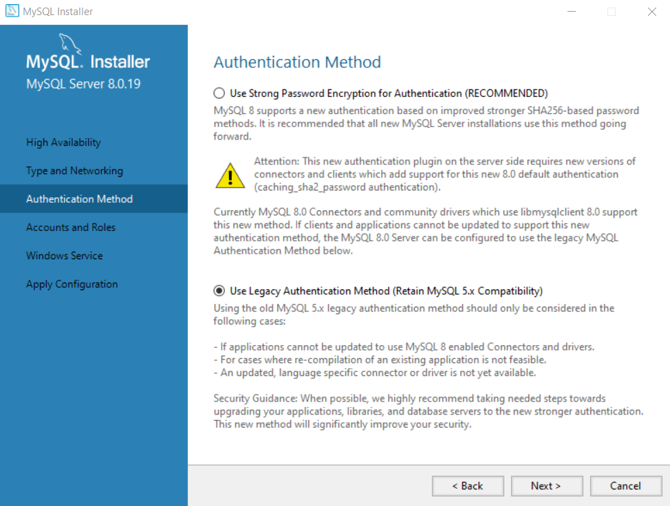

# ioBroker.sql

  [](https://www.npmjs.com/package/iobroker.sql)
[](https://www.npmjs.com/package/iobroker.sql)
[](https://travis-ci.org/ioBroker/ioBroker.sql)

[](https://nodei.co/npm/iobroker.sql/) [](https://greenkeeper.io/)

This adapter saves state history into SQL DB.

Supports PostgreSQL, mysql, Microsoft SQL Server and sqlite.
You can leave port 0 if default port is desired.

**This adapter uses Sentry libraries to automatically report exceptions and code errors to the developers.** For more details and for information how to disable the error reporting see [Sentry-Plugin Documentation](https://github.com/ioBroker/plugin-sentry#plugin-sentry)! Sentry reporting is used starting with js-controller 3.0.

### MS-SQL:
Use ```localhost\instance``` for the host and check TCP/IP connections enabled.
https://msdn.microsoft.com/en-us/library/bb909712(v=vs.90).aspx

### SQLite:
is "file"-DB and cannot manage too many events. If you have a big amount of data use the real DB, like PostgreSQL and co.

SQLite DB must not be installed extra. It is just a file on disk, but to install it you require build tools on your system. For linux, just write:

```
sudo apt-get install build-essential
```

For windows:

```
c:\>npm install --global --production windows-build-tools
```

and then reinstall the adapter, e.g:

```
cd /opt/iobroker
iobroker stop sql
npm install iobroker.sql --production
iobroker start sql
```

### MySQL:
You can install mysql on linux systems as following:

```
apt-get install mysql-server mysql-client

mysql -uroot -p

CREATE USER 'iobroker'@'%' IDENTIFIED BY 'iobroker';
GRANT ALL PRIVILEGES ON * . * TO 'iobroker'@'%';
FLUSH PRIVILEGES;
```

If required edit */etc/mysql/my.cnf* to set bind to IP-Address for remote connect.

**Warning**: iobroker user is "admin". If required give limited rights to iobroker user.

On the "windows" it can be easily installed via installer: https://dev.mysql.com/downloads/installer/.

Pay attention for authentication method. The new encryption algorithm in MySQL 8.0 is not yet supported by `node.js` and you must select legacy authentication method.



## Structure of the DBs
Default Database name is "iobroker", but it can be changed in the configuration.
### Sources
This table is a list of adapter's instances, that wrote the entries. (state.from)

| DB         | Name in query        |
|------------|----------------------|
| MS-SQL     | iobroker.dbo.sources |
| MySQL      | iobroker.sources     |
| PostgreSQL | sources              |
| SQLite     | sources              |

Structure:

| Field | Type                                       | Description                               |
|-------|--------------------------------------------|-------------------------------------------|
| id    | INTEGER NOT NULL PRIMARY KEY IDENTITY(1,1) | unique ID                                 |
| name  | varchar(255) / TEXT                        | instance of adapter, that wrote the entry |

*Note:* MS-SQL uses varchar(255), and others use TEXT

### Data points
This table is a list of data points. (IDs)

| DB         | Name in query           |
|------------|-------------------------|
| MS-SQL     | iobroker.dbo.datapoints |
| MySQL      | iobroker.datapoints     |
| PostgreSQL | datapoints              |
| SQLite     | datapoints              |

Structure:

| Field | Type                                       | Description                                     |
|-------|--------------------------------------------|-------------------------------------------------|
| id    | INTEGER NOT NULL PRIMARY KEY IDENTITY(1,1) | unique ID                                       |
| name  | varchar(255) / TEXT                        | ID of variable, e.g. hm-rpc.0.JEQ283747.1.STATE |
| type  | INTEGER                                    | 0 - number, 1 - string, 2 - boolean             |

*Note:* MS-SQL uses varchar(255), and others use TEXT

### Numbers
Values for states with type "number". **ts** means "time series".

| DB         | Name in query           |
|------------|-------------------------|
| MS-SQL     | iobroker.dbo.ts_number |
| MySQL      | iobroker.ts_number     |
| PostgreSQL | ts_number              |
| SQLite     | ts_number              |

Structure:

| Field  | Type                                       | Description                                     |
|--------|--------------------------------------------|-------------------------------------------------|
| id     | INTEGER                                    | ID of state from "Datapoints" table             |
| ts     | BIGINT / INTEGER                           | Time in ms till epoch. Can be converted to time with "new Date(ts)" |
| val    | REAL                                       | Value                                           |
| ack    | BIT/BOOLEAN                                | Is acknowledged: 0 - not ack, 1 - ack           |
| _from  | INTEGER                                    | ID of source from "Sources" table               |
| q      | INTEGER                                    | Quality as number. You can find description [here](https://github.com/ioBroker/ioBroker/blob/master/doc/SCHEMA.md#states) |

*Note:* MS-SQL uses BIT, and others use BOOLEAN. SQLite uses for ts INTEGER and all others BIGINT.

The user can define additional to type `number` the functionality of "counters". For this purpose following table is created:
| DB         | Name in the query       |
|------------|-------------------------|
| MS-SQL     | iobroker.dbo.ts_counter |
| MySQL      | iobroker.ts_counter     |
| PostgreSQL | ts_counter              |
| SQLite     | ts_counter              |

Structure:

| Field  | Type                                       | Description                                     |
|--------|--------------------------------------------|-------------------------------------------------|
| id     | INTEGER                                    | ID of state from "Datapoints" table             |
| ts     | BIGINT / INTEGER                           | Time in ms till epoch. Can be converted to time with "new Date(ts)" |
| val    | REAL                                       | Value                                           |
 
This table stores the values when the counter was exchanged and the value does not increased, but failed to zero or lower value. 

### Strings
Values for states with type "string".

| DB         | Name in query           |
|------------|-------------------------|
| MS-SQL     | iobroker.dbo.ts_string |
| MySQL      | iobroker.ts_string     |
| PostgreSQL | ts_string              |
| SQLite     | ts_string              |

Structure:

| Field  | Type                                       | Description                                     |
|--------|--------------------------------------------|-------------------------------------------------|
| id     | INTEGER                                    | ID of state from "Datapoints" table             |
| ts     | BIGINT                                     | Time in ms till epoch. Can be converted to time with "new Date(ts)" |
| val    | TEXT                                       | Value                                           |
| ack    | BIT/BOOLEAN                                | Is acknowledged: 0 - not ack, 1 - ack           |
| _from  | INTEGER                                    | ID of source from "Sources" table               |
| q      | INTEGER                                    | Quality as number. You can find description [here](https://github.com/ioBroker/ioBroker/blob/master/doc/SCHEMA.md#states) |

*Note:* MS-SQL uses BIT, and others use BOOLEAN. SQLite uses for ts INTEGER and all others BIGINT.

### Booleans
Values for states with type "boolean".

| DB         | Name in query           |
|------------|-------------------------|
| MS-SQL     | iobroker.dbo.ts_bool    |
| MySQL      | iobroker.ts_bool        |
| PostgreSQL | ts_bool                 |
| SQLite     | ts_bool                 |

Structure:

| Field  | Type                                       | Description                                     |
|--------|--------------------------------------------|-------------------------------------------------|
| id     | INTEGER                                    | ID of state from "Datapoints" table             |
| ts     | BIGINT                                     | Time in ms till epoch. Can be converted to time with "new Date(ts)" |
| val    | BIT/BOOLEAN                                | Value                                           |
| ack    | BIT/BOOLEAN                                | Is acknowledged: 0 - not ack, 1 - ack           |
| _from  | INTEGER                                    | ID of source from "Sources" table               |
| q      | INTEGER                                    | Quality as number. You can find description [here](https://github.com/ioBroker/ioBroker/blob/master/doc/SCHEMA.md#states) |

*Note:* MS-SQL uses BIT, and others use BOOLEAN. SQLite uses for ts INTEGER and all others BIGINT.

## Custom queries
The user can execute custom queries on tables from javascript adapter:

```
sendTo('sql.0', 'query', 'SELECT * FROM datapoints', function (result) {
    if (result.error) {
        console.error(result.error);
    } else {
        // show result
         console.log('Rows: ' + JSON.stringify(result.result));
    }
});
```

Or get entries for the last hour for ID=system.adapter.admin.0.memRss
```
sendTo('sql.0', 'query', 'SELECT id FROM datapoints WHERE name="system.adapter.admin.0.memRss"', function (result) {
    if (result.error) {
        console.error(result.error);
    } else {
        // show result
        console.log('Rows: ' + JSON.stringify(result.result));
        var now = new Date();
        now.setHours(-1);
        sendTo('sql.0', 'query', 'SELECT * FROM ts_number WHERE ts >= ' + now.getTime() + ' AND id=' + result.result[0].id, function (result) {
            console.log('Rows: ' + JSON.stringify(result.result));
        });
    }
});
```

## storeState
If you want to write other data into the InfluxDB/SQL you can use the build in system function **storeState**.
This function can also be used to convert data from other History adapters like History or SQL.

The given IDs are not checked against the ioBroker database and do not need to be set up there, but can only be accessed directly.

The Message can have one of the following three formats:
* one ID and one state object: `{id: 'adapter.0.device.counter', state: {val: 1, ts: 10239499}}`
* one ID and array of state objects: `{id: 'adapter.0.device.counter', state: [{val: 1, ts: 10239499}, {val: 2, ts: 10239599}, {val: 3, ts: 10239699}]}`
* array of multiple IDs with state objects `[{id: 'adapter.0.device.counter1', state: {val: 1, ts: 10239499}, {id: 'adapter.0.device.counter2', state: {val: 2, ts: 10239599}]`

Additionally, you can add attribute `rules: true` to activate all rules, like `counter`, `changesOnly`, `de-bounce` and so on: `{id: 'adapter.0.device.counter', rules: true, state: [{val: 1, ts: 10239499}, {val: 2, ts: 10239599}, {val: 3, ts: 10239699}]}` 

## Get history
Additional to custom queries, you can use build in system function **getHistory**:
```
var end = Date.now();
sendTo('sql.0', 'getHistory', {
    id: 'system.adapter.admin.0.memRss',
    options: {
        start:      end - 3600000,
        end:        end,
        aggregate: 'minmax' // or 'none' to get raw values
    }
}, function (result) {
    for (var i = 0; i < result.result.length; i++) {
        console.log(result.result[i].id + ' ' + new Date(result.result[i].ts).toISOString());
    }
});
```

## Get counter
User can ask the value of some counter (type=number, counter=true) for specific period.

```
var now = Date.now();
// get consumption value for last 30 days
sendTo('sql.0', 'getCounter', {
    id: 'system.adapter.admin.0.memRss',
    options: {
        start:      now - 3600000 * 24 * 30,
        end:        now,
    }
}, result => {
    console.log(`In last 30 days the consumption was ${result.result} kWh`);    
});
```
If the counter will be replaced it will be calculated too.

## History Logging Management via Javascript
The adapter supports enabling and disabling of history logging via JavaScript and also retrieving the list of enabled data points with their settings.

### enable
The message requires to have the "id" of the datapoint.Additionally optional "options" to define the data point specific settings:

```
sendTo('sql.0', 'enableHistory', {
    id: 'system.adapter.sql.0.memRss',
    options: {
        changesOnly:  true,
        debounce:     0,
        retention:    31536000,
        maxLength:    3,
        changesMinDelta: 0.5,
        aliasId: ''
    }
}, function (result) {
    if (result.error) {
        console.log(result.error);
    }
    if (result.success) {
        //successfull enabled
    }
});
```

### disable
The message requires to have the "id" of the datapoint.

```
sendTo('sql.0', 'disableHistory', {
    id: 'system.adapter.sql.0.memRss',
}, function (result) {
    if (result.error) {
        console.log(result.error);
    }
    if (result.success) {
        //successfull enabled
    }
});
```

### get List
The message has no parameters.

```
sendTo('sql.0', 'getEnabledDPs', {}, function (result) {
    //result is object like:
    {
        "system.adapter.sql.0.memRss": {
            "changesOnly":true,
            "debounce":0,
            "retention":31536000,
            "maxLength":3,
            "changesMinDelta":0.5,
            "enabled":true,
            "changesRelogInterval":0,
            "aliasId": ""
        }
        ...
    }
});
```

## Connection Settings
- **DB Type**: Type of the SQL DB: MySQL, PostgreSQL, MS-SQL or SQLite3
- **Host**: IP address or host name with SQL Server
- **Port**: Port of SQL Server (leave blank if not sure)
- **Database name**: Database name. Default iobroker
- **User**: User name for SQL. Must exist in the DB.
- **Password**: Password for SQL.
- **Password confirm**: Just repeat password here.
- **Encrypt**: Some DBs support encryption.
- **Round real to**: Number of digits after the comma.
- **Allow parallel requests**: Allow simultaneous SQL requests to DB.

## Default Settings
- **De-bounce interval**: Do not store values oftener than this interval.
- **Log unchanged values any**: Write additionally the values every X seconds.
- **Minimum difference from last value to log**: The minimum interval between two values.
- **Storage retention**: How long the values will be stored in the DB.

## Changelog

## 1.12.3 (2020-04-30)
* (Apollon77) Try to create Indizes on MSSQL to speed up things. Infos are shown if not possible to be able for the user to do it themself. Timeout is 15s

## 1.12.2 (2020-04-30)
* (Apollon77) MSSQL works again

## 1.12.1 (2020-04-26)
* (Apollon77) Fix potential crash (Sentry) 

## 1.12.0 (2020-04-23)
* (Apollon77) Implement max Connections setting and respect it, now allows to control how many concurrent connections to database are used (default 100) and others wait up to 10s for a free connection before failing)
* (Apollon77) Change dependencies to admin to a global dependency
* (Apollon77) Update connection status also in between
* (Apollon77) fix some potential crash cases (Sentry reported)
* (Omega236) Add id to error message for queries
* (Apollon77) update pg to stay compatible with nodejs 14
* (Apollon77) Start clearly ending timeouts on unload ... still some cases left!

## 1.11.1 (2020-04-19)
* __Requires js-controller >= 2.0.0__
* (Apollon77) removed usage of adapter.objects
* (Apollon77) check if objects have changed and ignore unchanged
* (Apollon77) Add Sentry for Error Reporting with js-controller 3.0
* (Apollon77) Make sure value undefined is ignored

## 1.10.1 (2020-04-12)
* (bluefox) Converted to ES6
* (bluefox) The counter functionality was implemented.

## 1.9.5 (2019-05-15)
* (Apollon77) Add support for nodejs 12

## 1.9.4 (2019-02-24)
* (Apollon77) Fix several smaller issues and topics
* (Apollon77) Optimize Texts (for Admin v3 UI)

## 1.9.0 (2018-06-19)
* (Apollon77) Add option to log datapoints as other ID (alias) to easier migrate devices and such

## 1.8.0 (2018-04-29)
* (Apollon77) Update sqlite3, nodejs 10 compatible
* (BuZZy1337) Admin fix

## 1.7.4 (2018-04-15)
* (Apollon77) Fix getHistory

## 1.7.3 (2018-03-28)
* (Apollon77) Respect 'keep forever' setting for retention from data point configuration

## 1.7.2 (2018-03-24)
* (Apollon77) Disable to write NULLs for SQLite

## 1.7.1 (2018-02-10)
* (Apollon77) Make option to write NULL values on start/stop boundaries configurable

## 1.6.9 (2018-02-07)
* (bondrogeen) Admin3 Fixes
* (Apollon77) optimize relog feature and other things

## 1.6.7 (2018-01-31)
* (Bluefox) Admin3 Fixes
* (Apollon77) Relog and null log fixes

## 1.6.2 (2018-01-30)
* (Apollon77) Admin3 Fixes

## 1.6.0 (2018-01-14)
* (bluefox) Ready for Admin3

## 1.5.8 (2017-10-05)
* (Apollon77) fix relog value feature

## 1.5.7 (2017-08-10)
* (bluefox) add "save last value" option

## 1.5.6 (2017-08-02)
* (Apollon77) fix behaviour of log interval to always log the current value

## 1.5.4 (2017-06-12)
* (Apollon77) fix dependency to other library

## 1.5.3 (2017-04-07)
* (Apollon77) fix in datatype conversions

### 1.5.0 (2017-03-02)
* (Apollon77) Add option to define storage datatype per datapoint inclusing converting the value if needed

### 1.4.6 (2017-02-25)
* (Apollon77) Fix typo with PostgrSQL

### 1.4.5 (2017-02-18)
* (Apollon77) Small fix again for older configurations
* (Apollon77) fix for DBConverter Analyze function

### 1.4.3 (2017-02-11)
* (Apollon77) Small fix for older configurations

### 1.4.2 (2017-01-16)
* (bluefox) Fix handling of float values in Adapter config and Datapoint config.

### 1.4.1
* (Apollon77) Rollback to sql-client 0.7 to get rid of the mmagic dependecy that brings problems on older systems

### 1.4.0 (2016-12-02)
* (Apollon77) Add messages enableHistory/disableHistory
* (Apollon77) add support to log changes only if value differs a minimum value for numbers

### 1.3.4 (2016-11)
* (Apollon77) Allow database names with '-' for MySQL

### 1.3.3 (2016-11)
* (Apollon77) Update dependecies

### 1.3.2 (2016-11-21)
* (bluefox) Fix insert of string with '

### 1.3.0 (2016-10-29)
* (Apollon77) add option to re-log unchanged values to make it easier for visualization

### 1.2.1 (2016-08-30)
* (bluefox) Fix selector for SQL objects

### 1.2.0 (2016-08-30)
* (bluefox) сompatible only with new admin

### 1.0.10 (2016-08-27)
* (bluefox) change name of object from "history" to "custom"

### 1.0.10 (2016-07-31)
* (bluefox) fix multi requests if sqlite

### 1.0.9 (2016-06-14)
* (bluefox) allow settings for parallel requests

### 1.0.7 (2016-05-31)
* (bluefox) draw line to the end if ignore null

### 1.0.6 (2016-05-30)
* (bluefox) allow setup DB name for mysql and mssql

### 1.0.5 (2016-05-29)
* (bluefox) switch max and min with each other

### 1.0.4 (2016-05-29)
* (bluefox) check retention of data if set "never"

### 1.0.3 (2016-05-28)
* (bluefox) try to calculate old timestamps

### 1.0.2 (2016-05-24)
* (bluefox) fix error with io-package

### 1.0.1 (2016-05-24)
* (bluefox) fix error with SQLite

### 1.0.0 (2016-05-20)
* (bluefox) change default aggregation name

### 0.3.3 (2016-05-18)
* (bluefox) fix postgres

### 0.3.2 (2016-05-13)
* (bluefox) queue select if IDs and FROMs queries for sqlite

### 0.3.1 (2016-05-12)
* (bluefox) queue delete queries too for sqlite

### 0.3.0 (2016-05-08)
* (bluefox) support of custom queries
* (bluefox) only one request simultaneously for sqlite
* (bluefox) add tests (primitive and only sql)

### 0.2.0 (2016-04-30)
* (bluefox) support of milliseconds
* (bluefox) fix sqlite

### 0.1.4 (2016-04-25)
* (bluefox) fix deletion of old entries

### 0.1.3 (2016-03-08)
* (bluefox) do not print errors twice

### 0.1.2 (2015-12-22)
* (bluefox) fix MS-SQL port settings

### 0.1.1 (2015-12-19)
* (bluefox) fix error with double entries

### 0.1.0 (2015-12-14)
* (bluefox) support of strings

### 0.0.3 (2015-12-06)
* (smiling_Jack) Add demo Data ( todo: faster insert to db )
* (smiling_Jack) change aggregation (now same as history Adapter)
* (bluefox) bug fixing

### 0.0.2 (2015-12-06)
* (bluefox) allow only 1 client for SQLite

### 0.0.1 (2015-11-19)
* (bluefox) initial commit

## License

The MIT License (MIT)

Copyright (c) 2015-2020 bluefox <dogafox@gmail.com>, Apollon77

Permission is hereby granted, free of charge, to any person obtaining a copy
of this software and associated documentation files (the "Software"), to deal
in the Software without restriction, including without limitation the rights
to use, copy, modify, merge, publish, distribute, sublicense, and/or sell
copies of the Software, and to permit persons to whom the Software is
furnished to do so, subject to the following conditions:

The above copyright notice and this permission notice shall be included in
all copies or substantial portions of the Software.

THE SOFTWARE IS PROVIDED "AS IS", WITHOUT WARRANTY OF ANY KIND, EXPRESS OR
IMPLIED, INCLUDING BUT NOT LIMITED TO THE WARRANTIES OF MERCHANTABILITY,
FITNESS FOR A PARTICULAR PURPOSE AND NONINFRINGEMENT. IN NO EVENT SHALL THE
AUTHORS OR COPYRIGHT HOLDERS BE LIABLE FOR ANY CLAIM, DAMAGES OR OTHER
LIABILITY, WHETHER IN AN ACTION OF CONTRACT, TORT OR OTHERWISE, ARISING FROM,
OUT OF OR IN CONNECTION WITH THE SOFTWARE OR THE USE OR OTHER DEALINGS IN
THE SOFTWARE.
