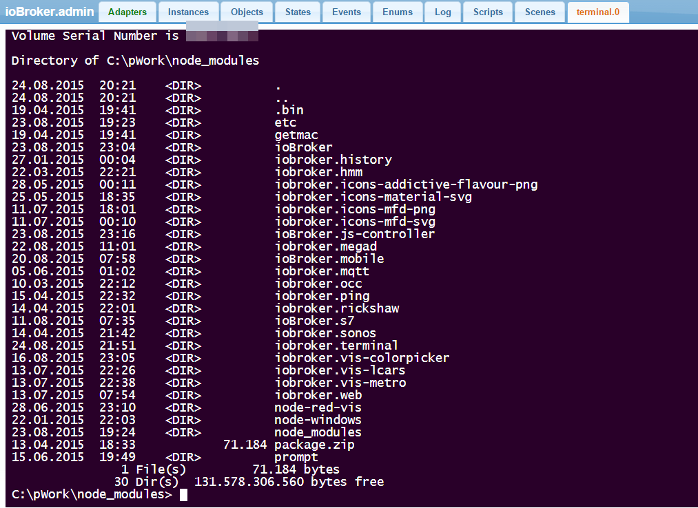

# ioBroker.terminal
  
Based on [web-terminal](https://github.com/rabchev/web-terminal) from rabchev.

terminal server to open command line interface.
Please use it only for administration purposes.

## Changelog

#### 0.1.2
* (bluefox) show connection state

#### 0.1.1
* (bluefox) add command ll

#### 0.1.0
* (bluefox) add css style selector

#### 0.0.1
* (bluefox) initial commit
