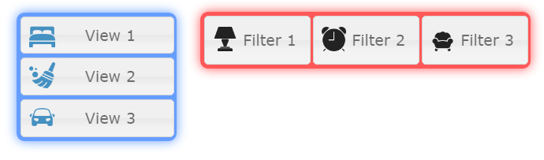

ioBroker.vis-bars
============

  

bars widget sets for ioBroker.vis

## Changelog
### 0.1.4 (2017-03-18)
- (bluefox) fixes for new vis 0.12.x

### 0.1.3 (2016-11-24)
- (bluefox) Code formatting

### 0.1.2 (2016-08-14)
- (bluefox) do not show ___settings view

### 0.1.1 (2015-09-25)
- (bluefox) add scale and padding to icons

### 0.1.0 (2015-09-06)
- (bluefox) remove publish script

### 0.0.3 (2015-08-12)
- (bluefox) protect against double event: click and touchstart

### 0.0.1 (2015-08-05)
- (bluefox) initial checkin

## License
 Copyright (c) 2013-2016 bluefox https://github.com/GermanBluefox
 MIT