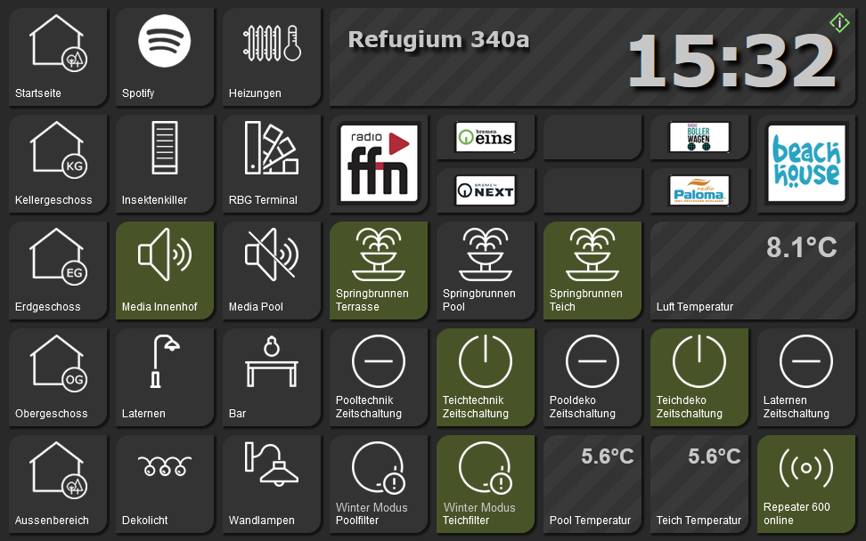
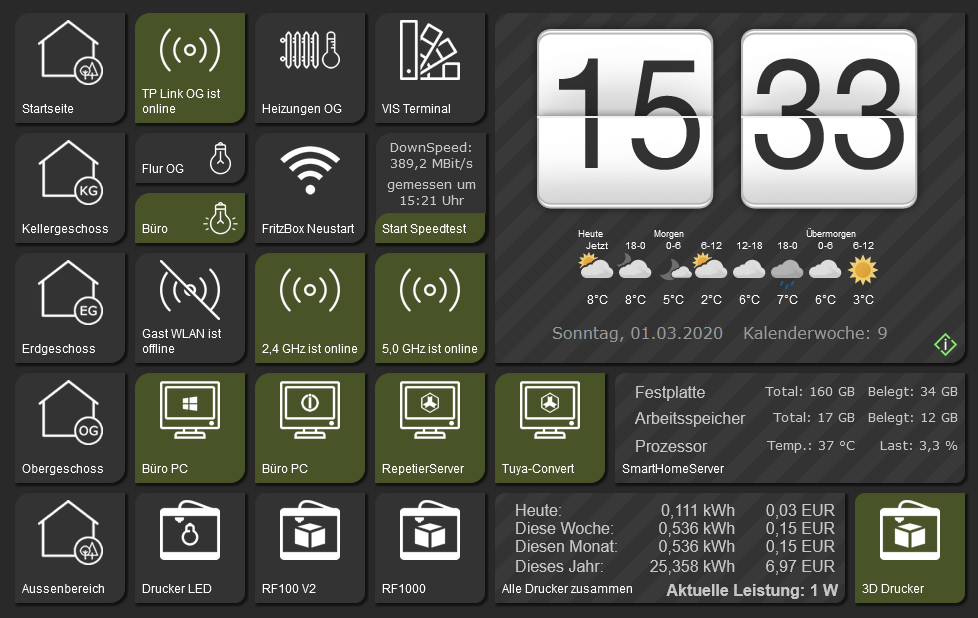

# ioBroker.vis-inventwo

## Schalter Widgets für den ioBroker.vis Adapter

Mit Hilfe unserer Widgets lassen sich folgende Projekte verwirklichen. Zur Zeit befinden sich in unserem Adapter NUR die reinen Schaltflächen (siehe oben) und die Icons. Uhr und Wetter stammen aus anderen Adaptern und müssen ggf. zusätzlich installiert werden.

---

## Unterstützung

Falls Dir unsere Arbeit gefällt und Du uns unterstützen möchtest, wir freuen uns über jede Spende.

(Dieser Link führt zu unserem PayPal-Konto und steht in keiner Verbindung zum ioBroker)

---

## Changelog / Änderungsprotokoll

# 1.3.0
- Added JSON table
- Added delay for navigations
- Text in buttons can now be HTML

# 1.2.3
- Added Navigation active color
- Fixed state color for value switch

## 1.2.2
- Bug Fix: slider value, config

## 1.2.1
- Fixed Slider Widget: seperatet into two widgets (horizontal and vertical)

### 1.2.0
- Added image widget
- Added Slider to change border radius for all 4 corners (If this version is an update for you, you need to click on each button in the vis-editor to get back the default corners)
- Added new icons

### 1.1.1
- Bug fix

### 1.1.0
- Added slider widget
- Added option to mirror image
- Added new icons
- Changed button widgets to use default font and text options

### 1.0.0
- Widget background and content opacity, Switch can be changed from boolean to value, changed icons from white to black, added seamless backgrounds

### 0.1.2
- Bug fixes
...

### 0.1.1
- Bug fixes
...

### 0.1.0 (Erstveröffentlichung)
- inventwo Design Widgets
...

### 0.0.1
- Die Idee ist geboren

---

## License

Urheberrechte (c) 2020 [jkvarel](https://github.com/jkvarel) und [skvarel](https://github.com/skvarel) von [inventwo](https://github.com/inventwo)

MIT License (nur in englisch / englisch only)

Permission is hereby granted, free of charge, to any person obtaining a copy
of this software and associated documentation files (the "Software"), to deal
in the Software without restriction, including without limitation the rights
to use, copy, modify, merge, publish, distribute, sublicense, and/or sell
copies of the Software, and to permit persons to whom the Software is
furnished to do so, subject to the following conditions:

The above copyright notice and this permission notice shall be included in all
copies or substantial portions of the Software.

THE SOFTWARE IS PROVIDED "AS IS", WITHOUT WARRANTY OF ANY KIND, EXPRESS OR
IMPLIED, INCLUDING BUT NOT LIMITED TO THE WARRANTIES OF MERCHANTABILITY,
FITNESS FOR A PARTICULAR PURPOSE AND NONINFRINGEMENT. IN NO EVENT SHALL THE
AUTHORS OR COPYRIGHT HOLDERS BE LIABLE FOR ANY CLAIM, DAMAGES OR OTHER
LIABILITY, WHETHER IN AN ACTION OF CONTRACT, TORT OR OTHERWISE, ARISING FROM,
OUT OF OR IN CONNECTION WITH THE SOFTWARE OR THE USE OR OTHER DEALINGS IN THE
SOFTWARE.

---

Icons from Icons8 https://icons8.com/
