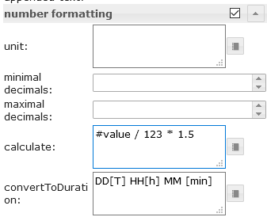
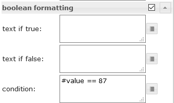
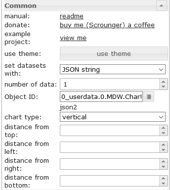
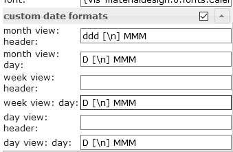

<!-- omit in toc -->
## ioBroker.vis-materialdesign


[](https://www.npmjs.com/package/iobroker.vis-materialdesign)
[](https://www.npmjs.com/package/ioBroker.vis-materialdesign)
[](https://www.npmjs.com/package/ioBroker.vis-materialdesign)

[](https://nodei.co/npm/iobroker.vis-materialdesign/)

<!-- omit in toc -->
# Material Design Widgets for IoBroker VIS
[](https://www.paypal.com/cgi-bin/webscr?cmd=_s-xclick&hosted_button_id=VWAXSTS634G88&source=url)


ioBroker Material Design Widgets are based on [Google's material design guidelines](https://material.io/design/)

<br>

<!-- omit in toc -->
## Table of Content
- [General](#general)
	- [Online Example Project](#online-example-project)
	- [Practical examples](#practical-examples)
	- [Questions and answers about the widgets](#questions-and-answers-about-the-widgets)
	- [Supported Browser](#supported-browser)
	- [Supported Browser for vibrate on mobil devices function](#supported-browser-for-vibrate-on-mobil-devices-function)
	- [ioBroker VIS App](#iobroker-vis-app)
- [Adapter settings](#adapter-settings)
	- [General](#general-1)
	- [Theme Editor](#theme-editor)
		- [Theme Settings](#theme-settings)
- [Widgets](#widgets)
	- [Material Design Icons and Images](#material-design-icons-and-images)
		- [Editor Settings](#editor-settings)
		- [HTML Properties](#html-properties)
	- [Buttons](#buttons)
		- [Navigation](#navigation)
			- [Editor Settings](#editor-settings-1)
			- [HTML Properties](#html-properties-1)
		- [Link](#link)
			- [Editor Settings](#editor-settings-2)
			- [HTML Properties](#html-properties-2)
		- [State](#state)
			- [Editor Settings](#editor-settings-3)
			- [HTML Properties](#html-properties-3)
		- [Multi State](#multi-state)
			- [Editor Settings](#editor-settings-4)
			- [HTML Properties](#html-properties-4)
		- [Addition](#addition)
			- [Editor Settings](#editor-settings-5)
			- [HTML Properties](#html-properties-5)
		- [Toggle](#toggle)
			- [Editor Settings](#editor-settings-6)
			- [HTML Properties](#html-properties-6)
	- [Buttons Vertical](#buttons-vertical)
		- [Navigation](#navigation-1)
			- [Editor Settings](#editor-settings-7)
			- [HTML Properties](#html-properties-7)
		- [Link](#link-1)
			- [Editor Settings](#editor-settings-8)
			- [HTML Properties](#html-properties-8)
		- [State](#state-1)
			- [Editor Settings](#editor-settings-9)
			- [HTML Properties](#html-properties-9)
		- [Multi State](#multi-state-1)
			- [Editor Settings](#editor-settings-10)
			- [HTML Properties](#html-properties-10)
		- [Addition](#addition-1)
			- [Editor Settings](#editor-settings-11)
			- [HTML Properties](#html-properties-11)
		- [Toggle](#toggle-1)
			- [Editor Settings](#editor-settings-12)
			- [HTML Properties](#html-properties-12)
	- [Icon Buttons](#icon-buttons)
		- [Navigation](#navigation-2)
			- [Editor Settings](#editor-settings-13)
			- [HTML Properties](#html-properties-13)
		- [Link](#link-2)
			- [Editor Settings](#editor-settings-14)
			- [HTML Properties](#html-properties-14)
		- [State](#state-2)
			- [Editor Settings](#editor-settings-15)
			- [HTML Properties](#html-properties-15)
		- [Multi State](#multi-state-2)
			- [Editor Settings](#editor-settings-16)
			- [HTML Properties](#html-properties-16)
		- [Addition](#addition-2)
			- [Editor Settings](#editor-settings-17)
			- [HTML Properties](#html-properties-17)
		- [Toggle](#toggle-2)
			- [Editor Settings](#editor-settings-18)
			- [HTML Properties](#html-properties-18)
	- [Checkbox](#checkbox)
		- [Editor Settings](#editor-settings-19)
		- [HTML Properties](#html-properties-19)
	- [Switch](#switch)
		- [Editor Settings](#editor-settings-20)
		- [HTML Properties](#html-properties-20)
	- [Value](#value)
		- [Editor Settings](#editor-settings-21)
		- [HTML Properties](#html-properties-21)
	- [HTML Card](#html-card)
	- [List](#list)
		- [Editor Settings](#editor-settings-22)
		- [Data JSON Properties](#data-json-properties)
	- [IconList](#iconlist)
		- [Editor Settings](#editor-settings-23)
		- [Data JSON Properties](#data-json-properties-1)
	- [Progress](#progress)
		- [Editor Settings](#editor-settings-24)
		- [HTML Properties](#html-properties-22)
	- [Progress Circular](#progress-circular)
		- [Editor Settings](#editor-settings-25)
		- [HTML Properties](#html-properties-23)
	- [Slider](#slider)
		- [HTML Properties](#html-properties-24)
	- [Slider Round](#slider-round)
		- [HTML Properties](#html-properties-25)
	- [Input](#input)
		- [Text input](#text-input)
			- [Editor Settings](#editor-settings-26)
			- [HTML Properties](#html-properties-26)
		- [Select](#select)
			- [Menu JSON Properties](#menu-json-properties)
			- [HTML Properties](#html-properties-27)
		- [Autocomplete](#autocomplete)
			- [Menu JSON Properties](#menu-json-properties-1)
			- [HTML Properties](#html-properties-28)
	- [Top App Bar](#top-app-bar)
		- [Submenu](#submenu)
			- [Submenu JSON Properties](#submenu-json-properties)
	- [Charts](#charts)
		- [Bar Chart](#bar-chart)
			- [Editor Settings](#editor-settings-27)
			- [Dataset JSON Properties](#dataset-json-properties)
		- [Pie Chart](#pie-chart)
			- [Editor Settings](#editor-settings-28)
			- [Dataset JSON Properties](#dataset-json-properties-1)
		- [Line History Chart:](#line-history-chart)
			- [Editor Settings](#editor-settings-29)
		- [JSON Chart](#json-chart)
			- [JSON Properties](#json-properties)
	- [Table](#table)
		- [Editor Settings](#editor-settings-30)
		- [Data - JSON Stucture](#data---json-stucture)
		- [internal object binding](#internal-object-binding)
		- [Control Elements using HTML Widgets](#control-elements-using-html-widgets)
		- [Control Elements - **deprecated since v0.5.0**](#control-elements---deprecated-since-v050)
	- [Responsive Layout](#responsive-layout)
		- [Masonry Views](#masonry-views)
			- [Editor Settings](#editor-settings-31)
		- [Grid Views](#grid-views)
			- [Editor Settings](#editor-settings-32)
	- [Alerts](#alerts)
		- [Editor Settings](#editor-settings-33)
		- [Datapoint JSON Properties](#datapoint-json-properties)
		- [Script: send alert to widget](#script-send-alert-to-widget)
	- [Calendar](#calendar)
		- [Editor Settings](#editor-settings-34)
		- [Datapoint JSON Properties](#datapoint-json-properties-1)
		- [Script: ical conversion](#script-ical-conversion)
	- [Dialog](#dialog)
		- [Editor Settings](#editor-settings-35)
	- [HTML Widgets](#html-widgets)
		- [Examples](#examples)
- [used libraries](#used-libraries)
- [Changelog](#changelog)
- [License](#license)

# General

## Online Example Project
provided by [iobroker.click](https://iobroker.click/index.html), thanks to bluefox and iobroker.

* <a href="https://iobroker.click/vis/index.html?Material%20Design%20Widgets" target="_blank">VIS Runtime</a> (<a href="http://iobroker.click:8082/vis/index.html?Material%20Design%20Widgets" target="_blank">alternativ</a>)
* <a href="https://iobroker.click/vis/edit.html?Material%20Design%20Widgets" target="_blank">VIS Editor</a> (<a href="http://iobroker.click:8082/vis/edit.html?Material%20Design%20Widgets" target="_blank">alternativ</a>)

## Practical examples
* [Weather View](https://forum.iobroker.net/topic/32232/material-design-widgets-wetter-view)
* [Skript Status](https://forum.iobroker.net/topic/30662/material-design-widgets-skript-status)
* [Adapter Status](https://forum.iobroker.net/topic/30661/material-design-widgets-adapter-status)
* [UniFi Netzwerk Status](https://github.com/Scrounger/ioBroker.vis-materialdesign/tree/master/examples/UnifiNetworkState)

## Questions and answers about the widgets
If you have questions about the individual widgets, then first look at the topics of the individual widgets

* [German threads](https://forum.iobroker.net/search?term=Material%20Design%20Widgets%3A&in=titles&matchWords=all&by%5B%5D=Scrounger&categories%5B%5D=7&sortBy=topic.title&sortDirection=desc&showAs=topics)

## Supported Browser
I officially support the last two versions of every major browser. Specifically, i test on the following browsers:
* Firefox on Windows and Linux
* Chrome on Android, Windows, and Linux

## Supported Browser for vibrate on mobil devices function
https://developer.mozilla.org/en-US/docs/Web/API/Navigator/vibrate

## ioBroker VIS App
latest version needs to be implemented by the app, see https://github.com/ioBroker/ioBroker.vis.cordova.
I do not use the app and do not test on it either

# Adapter settings

Starting with version 0.4.0 there is a settings page for the adapter. You can find it under Instances in the user interface of the admin adapter

## General


| setting                | description                                                                                                                                                                                                                                                                |
| ---------------------- | -------------------------------------------------------------------------------------------------------------------------------------------------------------------------------------------------------------------------------------------------------------------------- |
| Documentation          | Links to documentation to help you configure the widgets                                                                                                                                                                                                                   |
| Generate global script | Create a global script for the [Javascript Script Engine](https://github.com/ioBroker/ioBroker.javascript) with all theme data points. This allows to use colors, fonts and font sizes comfortably in scripts.                                                             |
| Sentry                 | use Sentry libraries to automatically report exceptions and code errors anonymously to the developers. For more details and for information how to disable the error reporting see [Sentry-Plugin Documentation](https://github.com/ioBroker/plugin-sentry#plugin-sentry)! |

## Theme Editor

With the help of the Theme Editor you can centrally set colors, fonts and font sizes for all widgets via the adapter settings. For each widget datapoints (see screenshot below) are created with the set values. This makes it also possible to use these settings in other widgets (not Material Design Widgets) via bindings.

##### Datapoint structure


### Theme Settings


Every settings page for colors, colors dark, font and font sizes look likes show in the screenshot above.

Standard colors / fonts /font sizes can be defined in the upper area. These standard colors / fonts /font sizes can then be assigned to the individual widgets using the buttons in the table. If you change the default colors / fonts /font sizes, it will also change for all widgets that use this colors / fonts /font sizes.
Additionally, it is possible to assign your own colors / fonts /font sizes to the widgets, independent of the standard colors.

For colors there are two themes - light theme and dark theme. With the datapoint `vis-materialdesign.0.colors.darkTheme` you can switch between the two themes. For example this datapoint can be used in a script to switch between lights and dark colors on sunrise and sunset. 

##### VIS Editor (Restore / update old Widgets)


In the VIS Editor you will find a button `use theme` for each widget. With this button you can reset the widgets to the use of the themes. That means if you have changed colors, fonts or font sizes, you can reset them with this button.

With the help of this button it is also possible to update your widgets from versions before 0.4.0 to use the themes.

##### Change Datapoint Binding for Material Design Widgets


If you would like to change the using of others colors that are defined for other widgets, you can copy the datapoint binding by pressing the button with the material design icon. Just paste this in any color, fonts or font sizes field of a material design widget. For example a color "state binding" looks like `#mdwTheme:vis-materialdesign.0.colors.card.background`

##### Use Binding for non Material Design Widgets


In the adapter settings you can copy the binding command to the clipboard by clicking on the button with iobroker icon. This binding can then be used by copy and paste even for non Material Design Widgets. For example a color binding looks like `{mode:vis-materialdesign.0.colors.darkTheme;light:vis-materialdesign.0.colors.light.card.background;dark:vis-materialdesign.0.colors.dark.card.background; mode === "true" ? dark : light}`


# Widgets

## Material Design Icons and Images


### Editor Settings

Settings that are not listed in the table below are self-explanatory.

<table>
    <thead>
        <tr>
            <th>Screenshot</th>
            <th>Description</th>
        </tr>
    </thead>
    <tbody>
        <tr>
            <td rowspan=6></td>
            <td>Some of the widgets support <a href="https://materialdesignicons.com/" target="_blank">Material Design Icons</a> library. You can pic up an icon from the list above or open the image picker by clicking the button on the right of the input field.<br><br><b>Image colors only applies to the material design icons, not to an image!</b></td>
        </tr>
    </tbody>
</table>

### HTML Properties

The following properties can be used as [HTML Widgets](#html-widgets).

<table>
	<thead>
		<tr>
			<th>Property</th>
			<th>Description</th>
			<th>Type</th>
			<th>Values</th>
		</tr>
	</thead>
	<tbody>
		<tr>
			<td colspan="4" style="background: #44739e; color: white; border-color: #44739e;"><i><b><br>Common</b></i></td>
		</tr>
		<tr>
			<td>mdw-mdwIcon</td>
			<td>icon</td>
			<td>string</td>
			<td>
		</tr>
		<tr>
			<td>mdw-mdwIconSize</td>
			<td>icon size</td>
			<td>number</td>
			<td>
		</tr>
		<tr>
			<td>mdw-mdwIconColor</td>
			<td>icon color</td>
			<td>string</td>
			<td>hex(#44739e), rgb(20, 50, 200), rgba(20, 50, 200, 0.5)
		</tr>
		<tr>
			<td>mdw-debug</td>
			<td>debug</td>
			<td>boolean</td>
			<td>false | true
		</tr>
	</tbody>
</table>

<!-- omit in toc -->
#### HTML Properties - Example

<details>

```
<div class='vis-widget materialdesign-widget materialdesign-icon materialdesign-materialdesignicons-html-element'
	style='width: 50px; height: 50px; position: relative; display: flex; align-items: center;'
	mdw-mdwIcon='iobroker'
	mdw-mdwIconSize='30'
	mdw-mdwIconColor='#mdwTheme:vis-materialdesign.0.colors.material_design_icon.color'
	mdw-debug='true'
></div>
```

</details>

## Buttons


### Navigation

#### Editor Settings

Settings that are not listed in the table below are self-explanatory.

<table>
    <thead>
        <tr>
            <th>Screenshot</th>
            <th>Setting</th>
            <th>Description</th>
        </tr>
    </thead>
    <tbody>
        <tr>
            <td rowspan=1></td>
            <td>View to navigate</td>
			<td>name of view to navigate</td>
        </tr>	
    </tbody>
</table>

#### HTML Properties

The following properties can be used as [HTML Widgets](#html-widgets).

<table>
	<thead>
		<tr>
			<th>Property</th>
			<th>Description</th>
			<th>Type</th>
			<th>Values</th>
		</tr>
	</thead>
	<tbody>
		<tr>
			<td>mdw-type</td>
			<td>Widget type</td>
			<td>string</td>
			<td>navigation_default</td>
		</tr>
		<tr>
			<td colspan="4" style="background: #44739e; color: white; border-color: #44739e;"><i><b><br>Common</b></i></td>
		</tr>
		<tr>
			<td>mdw-buttonStyle</td>
			<td>button style</td>
			<td>string</td>
			<td>text | raised | unelevated | outlined
		</tr>
		<tr>
			<td>mdw-nav_view</td>
			<td>View to navigate</td>
			<td>views</td>
			<td>
		</tr>
		<tr>
			<td>mdw-vibrateOnMobilDevices</td>
			<td>vibrate on mobil devices [s]</td>
			<td>number</td>
			<td>
		</tr>
		<tr>
			<td>mdw-debug</td>
			<td>debug</td>
			<td>boolean</td>
			<td>false | true
		</tr>
		<tr>
			<td colspan="4" style="background: #44739e; color: white; border-color: #44739e;"><i><b><br>labeling</b></i></td>
		</tr>
		<tr>
			<td>mdw-buttontext</td>
			<td>Button text</td>
			<td>string</td>
			<td>
		</tr>
		<tr>
			<td>mdw-textFontFamily</td>
			<td>font</td>
			<td>string</td>
			<td>
		</tr>
		<tr>
			<td>mdw-textFontSize</td>
			<td>text size</td>
			<td>number</td>
			<td>
		</tr>
		<tr>
			<td>mdw-labelWidth</td>
			<td>text width</td>
			<td>number</td>
			<td>
		</tr>
		<tr>
			<td colspan="4" style="background: #44739e; color: white; border-color: #44739e;"><i><b><br>colors</b></i></td>
		</tr>
		<tr>
			<td>mdw-mdwButtonPrimaryColor</td>
			<td>primary color</td>
			<td>string</td>
			<td>hex(#44739e), rgb(20, 50, 200), rgba(20, 50, 200, 0.5)
		</tr>
		<tr>
			<td>mdw-mdwButtonSecondaryColor</td>
			<td>secondary color</td>
			<td>string</td>
			<td>hex(#44739e), rgb(20, 50, 200), rgba(20, 50, 200, 0.5)
		</tr>
		<tr>
			<td>mdw-mdwButtonColorPress</td>
			<td>color pressed</td>
			<td>string</td>
			<td>hex(#44739e), rgb(20, 50, 200), rgba(20, 50, 200, 0.5)
		</tr>
		<tr>
			<td colspan="4" style="background: #44739e; color: white; border-color: #44739e;"><i><b><br>icon</b></i></td>
		</tr>
		<tr>
			<td>mdw-image</td>
			<td>Image</td>
			<td>string</td>
			<td>
		</tr>
		<tr>
			<td>mdw-imageColor</td>
			<td>image color</td>
			<td>string</td>
			<td>hex(#44739e), rgb(20, 50, 200), rgba(20, 50, 200, 0.5)
		</tr>
		<tr>
			<td>mdw-iconPosition</td>
			<td>image position</td>
			<td>string</td>
			<td>left | right
		</tr>
		<tr>
			<td>mdw-iconHeight</td>
			<td>image height</td>
			<td>number</td>
			<td>
		</tr>
	</tbody>
</table>

<!-- omit in toc -->
##### HTML Properties - Example

<details>

```
<div class='vis-widget materialdesign-widget materialdesign-button materialdesign-button-html-element'
	style='width: 100%; height: 100%; position: relative; padding: 0px;'
	mdw-type='navigation_default'
	mdw-buttonStyle='raised'
	mdw-nav_view='value'
	mdw-vibrateOnMobilDevices='50'
	mdw-buttontext=' Navigation'
	mdw-textFontFamily='#mdwTheme:vis-materialdesign.0.fonts.button.default.text'
	mdw-textFontSize='#mdwTheme:vis-materialdesign.0.fontSizes.button.default.text'
	mdw-mdwButtonPrimaryColor='#mdwTheme:vis-materialdesign.0.colors.button.default.primary'
	mdw-mdwButtonSecondaryColor='#mdwTheme:vis-materialdesign.0.colors.button.default.secondary'
	mdw-image='navigation'
	mdw-iconPosition='left'
></div>
```

</details>

### Link

#### Editor Settings

Settings that are not listed in the table below are self-explanatory.

<table>
    <thead>
        <tr>
            <th>Screenshot</th>
            <th>Setting</th>
            <th>Description</th>
        </tr>
    </thead>
    <tbody>
        <tr>
            <td rowspan=2></td>
            <td>Link</td>
			<td>url to open</td>
        </tr>
        <tr>
            <td>open in new window</td>
			<td>open link in new window / tab</td>
        </tr>			
    </tbody>
</table>

#### HTML Properties

The following properties can be used as [HTML Widgets](#html-widgets).

<table>
	<thead>
		<tr>
			<th>Property</th>
			<th>Description</th>
			<th>Type</th>
			<th>Values</th>
		</tr>
	</thead>
	<tbody>
		<tr>
			<td>mdw-type</td>
			<td>Widget type</td>
			<td>string</td>
			<td>link_default</td>
		</tr>
		<tr>
			<td colspan="4" style="background: #44739e; color: white; border-color: #44739e;"><i><b><br>Common</b></i></td>
		</tr>
		<tr>
			<td>mdw-buttonStyle</td>
			<td>button style</td>
			<td>string</td>
			<td>text | raised | unelevated | outlined
		</tr>
		<tr>
			<td>mdw-href</td>
			<td>Link</td>
			<td>url</td>
			<td>
		</tr>
		<tr>
			<td>mdw-openNewWindow</td>
			<td>open in new window</td>
			<td>boolean</td>
			<td>false | true
		</tr>
		<tr>
			<td>mdw-vibrateOnMobilDevices</td>
			<td>vibrate on mobil devices [s]</td>
			<td>number</td>
			<td>
		</tr>
		<tr>
			<td>mdw-debug</td>
			<td>debug</td>
			<td>boolean</td>
			<td>false | true
		</tr>
		<tr>
			<td colspan="4" style="background: #44739e; color: white; border-color: #44739e;"><i><b><br>labeling</b></i></td>
		</tr>
		<tr>
			<td>mdw-buttontext</td>
			<td>Button text</td>
			<td>string</td>
			<td>
		</tr>
		<tr>
			<td>mdw-textFontFamily</td>
			<td>font</td>
			<td>string</td>
			<td>
		</tr>
		<tr>
			<td>mdw-textFontSize</td>
			<td>text size</td>
			<td>number</td>
			<td>
		</tr>
		<tr>
			<td>mdw-labelWidth</td>
			<td>text width</td>
			<td>number</td>
			<td>
		</tr>
		<tr>
			<td colspan="4" style="background: #44739e; color: white; border-color: #44739e;"><i><b><br>colors</b></i></td>
		</tr>
		<tr>
			<td>mdw-mdwButtonPrimaryColor</td>
			<td>primary color</td>
			<td>string</td>
			<td>hex(#44739e), rgb(20, 50, 200), rgba(20, 50, 200, 0.5)
		</tr>
		<tr>
			<td>mdw-mdwButtonSecondaryColor</td>
			<td>secondary color</td>
			<td>string</td>
			<td>hex(#44739e), rgb(20, 50, 200), rgba(20, 50, 200, 0.5)
		</tr>
		<tr>
			<td>mdw-mdwButtonColorPress</td>
			<td>color pressed</td>
			<td>string</td>
			<td>hex(#44739e), rgb(20, 50, 200), rgba(20, 50, 200, 0.5)
		</tr>
		<tr>
			<td colspan="4" style="background: #44739e; color: white; border-color: #44739e;"><i><b><br>icon</b></i></td>
		</tr>
		<tr>
			<td>mdw-image</td>
			<td>Image</td>
			<td>string</td>
			<td>
		</tr>
		<tr>
			<td>mdw-imageColor</td>
			<td>image color</td>
			<td>string</td>
			<td>hex(#44739e), rgb(20, 50, 200), rgba(20, 50, 200, 0.5)
		</tr>
		<tr>
			<td>mdw-iconPosition</td>
			<td>image position</td>
			<td>string</td>
			<td>left | right
		</tr>
		<tr>
			<td>mdw-iconHeight</td>
			<td>image height</td>
			<td>number</td>
			<td>
		</tr>
	</tbody>
</table>

<!-- omit in toc -->
##### HTML Properties - Example

<details>

```
<div class='vis-widget materialdesign-widget materialdesign-button materialdesign-button-html-element'
	style='width: 100px; height: 30px; position: relative; padding: 0px;'
	mdw-type='link_default'
	mdw-buttonStyle='raised'
	mdw-href='https://github.com/Scrounger/ioBroker.vis-materialdesign'
	mdw-openNewWindow='true'
	mdw-vibrateOnMobilDevices='50'
	mdw-buttontext=' Link'
	mdw-textFontFamily='#mdwTheme:vis-materialdesign.0.fonts.button.default.text'
	mdw-textFontSize='#mdwTheme:vis-materialdesign.0.fontSizes.button.default.text'
	mdw-mdwButtonPrimaryColor='#mdwTheme:vis-materialdesign.0.colors.button.default.primary'
	mdw-mdwButtonSecondaryColor='#mdwTheme:vis-materialdesign.0.colors.button.default.secondary'
	mdw-image='link'
	mdw-iconPosition='left'
></div>
```

</details>

### State

#### Editor Settings

Settings that are not listed in the table below are self-explanatory.

<table>
    <thead>
        <tr>
            <th>Screenshot</th>
            <th>Setting</th>
            <th>Description</th>
        </tr>
    </thead>
    <tbody>
        <tr>
            <td rowspan=1></td>
            <td>value</td>
			<td>value to set</td>
        </tr>		
    </tbody>
</table>

#### HTML Properties

The following properties can be used as [HTML Widgets](#html-widgets).

<table>
	<thead>
		<tr>
			<th>Property</th>
			<th>Description</th>
			<th>Type</th>
			<th>Values</th>
		</tr>
	</thead>
	<tbody>
		<tr>
			<td>mdw-type</td>
			<td>Widget type</td>
			<td>string</td>
			<td>state_default</td>
		</tr>
		<tr>
			<td colspan="4" style="background: #44739e; color: white; border-color: #44739e;"><i><b><br>Common</b></i></td>
		</tr>
		<tr>
			<td>mdw-oid</td>
			<td>Object ID</td>
			<td>string</td>
			<td>
		</tr>
		<tr>
			<td>mdw-buttonStyle</td>
			<td>button style</td>
			<td>string</td>
			<td>text | raised | unelevated | outlined
		</tr>
		<tr>
			<td>mdw-value</td>
			<td>value</td>
			<td>string</td>
			<td>
		</tr>
		<tr>
			<td>mdw-vibrateOnMobilDevices</td>
			<td>vibrate on mobil devices [s]</td>
			<td>number</td>
			<td>
		</tr>
		<tr>
			<td>mdw-debug</td>
			<td>debug</td>
			<td>boolean</td>
			<td>false | true
		</tr>
		<tr>
			<td colspan="4" style="background: #44739e; color: white; border-color: #44739e;"><i><b><br>labeling</b></i></td>
		</tr>
		<tr>
			<td>mdw-buttontext</td>
			<td>Button text</td>
			<td>string</td>
			<td>
		</tr>
		<tr>
			<td>mdw-textFontFamily</td>
			<td>font</td>
			<td>string</td>
			<td>
		</tr>
		<tr>
			<td>mdw-textFontSize</td>
			<td>text size</td>
			<td>number</td>
			<td>
		</tr>
		<tr>
			<td>mdw-labelWidth</td>
			<td>text width</td>
			<td>number</td>
			<td>
		</tr>
		<tr>
			<td colspan="4" style="background: #44739e; color: white; border-color: #44739e;"><i><b><br>colors</b></i></td>
		</tr>
		<tr>
			<td>mdw-mdwButtonPrimaryColor</td>
			<td>primary color</td>
			<td>string</td>
			<td>hex(#44739e), rgb(20, 50, 200), rgba(20, 50, 200, 0.5)
		</tr>
		<tr>
			<td>mdw-mdwButtonSecondaryColor</td>
			<td>secondary color</td>
			<td>string</td>
			<td>hex(#44739e), rgb(20, 50, 200), rgba(20, 50, 200, 0.5)
		</tr>
		<tr>
			<td>mdw-mdwButtonColorPress</td>
			<td>color pressed</td>
			<td>string</td>
			<td>hex(#44739e), rgb(20, 50, 200), rgba(20, 50, 200, 0.5)
		</tr>
		<tr>
			<td colspan="4" style="background: #44739e; color: white; border-color: #44739e;"><i><b><br>icon</b></i></td>
		</tr>
		<tr>
			<td>mdw-image</td>
			<td>Image</td>
			<td>string</td>
			<td>
		</tr>
		<tr>
			<td>mdw-imageColor</td>
			<td>image color</td>
			<td>string</td>
			<td>hex(#44739e), rgb(20, 50, 200), rgba(20, 50, 200, 0.5)
		</tr>
		<tr>
			<td>mdw-iconPosition</td>
			<td>image position</td>
			<td>string</td>
			<td>left | right
		</tr>
		<tr>
			<td>mdw-iconHeight</td>
			<td>image height</td>
			<td>number</td>
			<td>
		</tr>
		<tr>
			<td colspan="4" style="background: #44739e; color: white; border-color: #44739e;"><i><b><br>Locking</b></i></td>
		</tr>
		<tr>
			<td>mdw-lockEnabled</td>
			<td>enable Locking</td>
			<td>boolean</td>
			<td>false | true
		</tr>
		<tr>
			<td>mdw-autoLockAfter</td>
			<td>auto Locking after [s]</td>
			<td>number</td>
			<td>
		</tr>
		<tr>
			<td>mdw-lockIcon</td>
			<td>icon</td>
			<td>string</td>
			<td>
		</tr>
		<tr>
			<td>mdw-lockIconSize</td>
			<td>icon size</td>
			<td>number</td>
			<td>
		</tr>
		<tr>
			<td>mdw-lockIconColor</td>
			<td>icon color</td>
			<td>string</td>
			<td>hex(#44739e), rgb(20, 50, 200), rgba(20, 50, 200, 0.5)
		</tr>
		<tr>
			<td>mdw-lockFilterGrayscale</td>
			<td>gray filter if locked</td>
			<td>number</td>
			<td>
		</tr>
	</tbody>
</table>

<!-- omit in toc -->
##### HTML Properties - Example

<details>

```
<div class='vis-widget materialdesign-widget materialdesign-button materialdesign-button-html-element'
	style='width: 100%; height: 100%; position: relative; padding: 0px;'
	mdw-type='state_default'
	mdw-oid='0_userdata.0.number'
	mdw-buttonStyle='raised'
	mdw-value='22'
	mdw-vibrateOnMobilDevices='50'
	mdw-buttontext=' State'
	mdw-textFontFamily='#mdwTheme:vis-materialdesign.0.fonts.button.default.text'
	mdw-textFontSize='#mdwTheme:vis-materialdesign.0.fontSizes.button.default.text'
	mdw-mdwButtonPrimaryColor='#mdwTheme:vis-materialdesign.0.colors.button.default.primary'
	mdw-mdwButtonSecondaryColor='#mdwTheme:vis-materialdesign.0.colors.button.default.secondary'
	mdw-image='pencil'
	mdw-iconPosition='left'
	mdw-autoLockAfter='10'
	mdw-lockIconColor='#mdwTheme:vis-materialdesign.0.colors.button.lock_icon'
	mdw-lockFilterGrayscale='30'
></div>
```

</details>

### Multi State

#### Editor Settings

Settings that are not listed in the table below are self-explanatory.

<table>
    <thead>
        <tr>
            <th>Screenshot</th>
            <th>Setting</th>
            <th>Description</th>
        </tr>
    </thead>
    <tbody>
        <tr>
            <td rowspan=3></td>
            <td>Object ID[x]</td>
			<td>id of the object from which the value is to be set</td>
        </tr>
        <tr>
            <td>value[x]</td>
			<td>value to be set</td>
        </tr>
        <tr>
            <td>delay [ms][x]</td>
			<td>delay until value is set</td>
        </tr>						
    </tbody>
</table>

#### HTML Properties

The following properties can be used as [HTML Widgets](#html-widgets).

<table>
	<thead>
		<tr>
			<th>Property</th>
			<th>Description</th>
			<th>Type</th>
			<th>Values</th>
		</tr>
	</thead>
	<tbody>
		<tr>
			<td>mdw-type</td>
			<td>Widget type</td>
			<td>string</td>
			<td>multiState_default</td>
		</tr>
		<tr>
			<td colspan="4" style="background: #44739e; color: white; border-color: #44739e;"><i><b><br>Common</b></i></td>
		</tr>
		<tr>
			<td>mdw-countOids</td>
			<td>count of Object Id's</td>
			<td>number</td>
			<td>
		</tr>
		<tr>
			<td>mdw-buttonStyle</td>
			<td>button style</td>
			<td>string</td>
			<td>text | raised | unelevated | outlined
		</tr>
		<tr>
			<td>mdw-vibrateOnMobilDevices</td>
			<td>vibrate on mobil devices [s]</td>
			<td>number</td>
			<td>
		</tr>
		<tr>
			<td>mdw-debug</td>
			<td>debug</td>
			<td>boolean</td>
			<td>false | true
		</tr>
		<tr>
			<td colspan="4" style="background: #44739e; color: white; border-color: #44739e;"><i><b><br>Object Id [x]</b></i></td>
		</tr>
		<tr>
			<td>mdw-oid[x]</td>
			<td>Object ID</td>
			<td>string</td>
			<td>
		</tr>
		<tr>
			<td>mdw-value[x]</td>
			<td>value</td>
			<td>string</td>
			<td>
		</tr>
		<tr>
			<td>mdw-delayInMs[x]</td>
			<td>delay [ms]</td>
			<td>number</td>
			<td>
		</tr>
		<tr>
			<td colspan="4" style="background: #44739e; color: white; border-color: #44739e;"><i><b><br>labeling</b></i></td>
		</tr>
		<tr>
			<td>mdw-buttontext</td>
			<td>Button text</td>
			<td>string</td>
			<td>
		</tr>
		<tr>
			<td>mdw-textFontFamily</td>
			<td>font</td>
			<td>string</td>
			<td>
		</tr>
		<tr>
			<td>mdw-textFontSize</td>
			<td>text size</td>
			<td>number</td>
			<td>
		</tr>
		<tr>
			<td>mdw-labelWidth</td>
			<td>text width</td>
			<td>number</td>
			<td>
		</tr>
		<tr>
			<td colspan="4" style="background: #44739e; color: white; border-color: #44739e;"><i><b><br>colors</b></i></td>
		</tr>
		<tr>
			<td>mdw-mdwButtonPrimaryColor</td>
			<td>primary color</td>
			<td>string</td>
			<td>hex(#44739e), rgb(20, 50, 200), rgba(20, 50, 200, 0.5)
		</tr>
		<tr>
			<td>mdw-mdwButtonSecondaryColor</td>
			<td>secondary color</td>
			<td>string</td>
			<td>hex(#44739e), rgb(20, 50, 200), rgba(20, 50, 200, 0.5)
		</tr>
		<tr>
			<td>mdw-mdwButtonColorPress</td>
			<td>color pressed</td>
			<td>string</td>
			<td>hex(#44739e), rgb(20, 50, 200), rgba(20, 50, 200, 0.5)
		</tr>
		<tr>
			<td colspan="4" style="background: #44739e; color: white; border-color: #44739e;"><i><b><br>icon</b></i></td>
		</tr>
		<tr>
			<td>mdw-image</td>
			<td>Image</td>
			<td>string</td>
			<td>
		</tr>
		<tr>
			<td>mdw-imageColor</td>
			<td>image color</td>
			<td>string</td>
			<td>hex(#44739e), rgb(20, 50, 200), rgba(20, 50, 200, 0.5)
		</tr>
		<tr>
			<td>mdw-iconPosition</td>
			<td>image position</td>
			<td>string</td>
			<td>left | right
		</tr>
		<tr>
			<td>mdw-iconHeight</td>
			<td>image height</td>
			<td>number</td>
			<td>
		</tr>
		<tr>
			<td colspan="4" style="background: #44739e; color: white; border-color: #44739e;"><i><b><br>Locking</b></i></td>
		</tr>
		<tr>
			<td>mdw-lockEnabled</td>
			<td>enable Locking</td>
			<td>boolean</td>
			<td>false | true
		</tr>
		<tr>
			<td>mdw-autoLockAfter</td>
			<td>auto Locking after [s]</td>
			<td>number</td>
			<td>
		</tr>
		<tr>
			<td>mdw-lockIcon</td>
			<td>icon</td>
			<td>string</td>
			<td>
		</tr>
		<tr>
			<td>mdw-lockIconSize</td>
			<td>icon size</td>
			<td>number</td>
			<td>
		</tr>
		<tr>
			<td>mdw-lockIconColor</td>
			<td>icon color</td>
			<td>string</td>
			<td>hex(#44739e), rgb(20, 50, 200), rgba(20, 50, 200, 0.5)
		</tr>
		<tr>
			<td>mdw-lockFilterGrayscale</td>
			<td>gray filter if locked</td>
			<td>number</td>
			<td>
		</tr>
	</tbody>
</table>

<!-- omit in toc -->
##### HTML Properties - Example

<details>

```
<div class='vis-widget materialdesign-widget materialdesign-button materialdesign-button-html-element'
	style='width: 100%; height: 100%; position: relative; padding: 0px;'
	mdw-type='multiState_default'
	mdw-countOids='1'
	mdw-buttonStyle='raised'
	mdw-vibrateOnMobilDevices='50'
	mdw-buttontext=' Multi State'
	mdw-textFontFamily='#mdwTheme:vis-materialdesign.0.fonts.button.default.text'
	mdw-textFontSize='#mdwTheme:vis-materialdesign.0.fontSizes.button.default.text'
	mdw-mdwButtonPrimaryColor='#mdwTheme:vis-materialdesign.0.colors.button.default.primary'
	mdw-mdwButtonSecondaryColor='#mdwTheme:vis-materialdesign.0.colors.button.default.secondary'
	mdw-image='pencil-box-multiple'
	mdw-iconPosition='left'
	mdw-autoLockAfter='10'
	mdw-lockIconColor='#mdwTheme:vis-materialdesign.0.colors.button.lock_icon'
	mdw-lockFilterGrayscale='30'
	mdw-oid0='0_userdata.0.MDW.Buttons.multiState.bool'
	mdw-value0='true'
	mdw-delayInMs0='0'
	mdw-oid1='0_userdata.0.MDW.Buttons.number'
	mdw-value1='66'
	mdw-delayInMs1='0'
></div>
```

</details>

### Addition

#### Editor Settings

Settings that are not listed in the table below are self-explanatory.

<table>
    <thead>
        <tr>
            <th>Screenshot</th>
            <th>Setting</th>
            <th>Description</th>
        </tr>
    </thead>
    <tbody>
        <tr>
            <td rowspan=2></td>
            <td>value</td>
			<td>value to be added or subtracted</td>
        </tr>
        <tr>
            <td>minmax</td>
			<td>minimum / maximum value up to which adding or subtracting can take place</td>
        </tr>		
    </tbody>
</table>

#### HTML Properties

The following properties can be used as [HTML Widgets](#html-widgets).

<table>
	<thead>
		<tr>
			<th>Property</th>
			<th>Description</th>
			<th>Type</th>
			<th>Values</th>
		</tr>
	</thead>
	<tbody>
		<tr>
			<td>mdw-type</td>
			<td>Widget type</td>
			<td>string</td>
			<td>addition_default</td>
		</tr>
		<tr>
			<td colspan="4" style="background: #44739e; color: white; border-color: #44739e;"><i><b><br>Common</b></i></td>
		</tr>
		<tr>
			<td>mdw-oid</td>
			<td>Object ID</td>
			<td>string</td>
			<td>
		</tr>
		<tr>
			<td>mdw-buttonStyle</td>
			<td>button style</td>
			<td>string</td>
			<td>text | raised | unelevated | outlined
		</tr>
		<tr>
			<td>mdw-value</td>
			<td>value</td>
			<td>string</td>
			<td>
		</tr>
		<tr>
			<td>mdw-minmax</td>
			<td>minmax</td>
			<td>string</td>
			<td>
		</tr>
		<tr>
			<td>mdw-vibrateOnMobilDevices</td>
			<td>vibrate on mobil devices [s]</td>
			<td>number</td>
			<td>
		</tr>
		<tr>
			<td>mdw-debug</td>
			<td>debug</td>
			<td>boolean</td>
			<td>false | true
		</tr>
		<tr>
			<td colspan="4" style="background: #44739e; color: white; border-color: #44739e;"><i><b><br>labeling</b></i></td>
		</tr>
		<tr>
			<td>mdw-buttontext</td>
			<td>Button text</td>
			<td>string</td>
			<td>
		</tr>
		<tr>
			<td>mdw-textFontFamily</td>
			<td>font</td>
			<td>string</td>
			<td>
		</tr>
		<tr>
			<td>mdw-textFontSize</td>
			<td>text size</td>
			<td>number</td>
			<td>
		</tr>
		<tr>
			<td>mdw-labelWidth</td>
			<td>text width</td>
			<td>number</td>
			<td>
		</tr>
		<tr>
			<td colspan="4" style="background: #44739e; color: white; border-color: #44739e;"><i><b><br>colors</b></i></td>
		</tr>
		<tr>
			<td>mdw-mdwButtonPrimaryColor</td>
			<td>primary color</td>
			<td>string</td>
			<td>hex(#44739e), rgb(20, 50, 200), rgba(20, 50, 200, 0.5)
		</tr>
		<tr>
			<td>mdw-mdwButtonSecondaryColor</td>
			<td>secondary color</td>
			<td>string</td>
			<td>hex(#44739e), rgb(20, 50, 200), rgba(20, 50, 200, 0.5)
		</tr>
		<tr>
			<td>mdw-mdwButtonColorPress</td>
			<td>color pressed</td>
			<td>string</td>
			<td>hex(#44739e), rgb(20, 50, 200), rgba(20, 50, 200, 0.5)
		</tr>
		<tr>
			<td colspan="4" style="background: #44739e; color: white; border-color: #44739e;"><i><b><br>icon</b></i></td>
		</tr>
		<tr>
			<td>mdw-image</td>
			<td>Image</td>
			<td>string</td>
			<td>
		</tr>
		<tr>
			<td>mdw-imageColor</td>
			<td>image color</td>
			<td>string</td>
			<td>hex(#44739e), rgb(20, 50, 200), rgba(20, 50, 200, 0.5)
		</tr>
		<tr>
			<td>mdw-iconPosition</td>
			<td>image position</td>
			<td>string</td>
			<td>left | right
		</tr>
		<tr>
			<td>mdw-iconHeight</td>
			<td>image height</td>
			<td>number</td>
			<td>
		</tr>
	</tbody>
</table>

<!-- omit in toc -->
##### HTML Properties - Example

<details>

```
<div class='vis-widget materialdesign-widget materialdesign-button materialdesign-button-html-element'
	style='width: 100%; height: 100%; position: relative; padding: 0px;'
	mdw-type='addition_default'
	mdw-oid='0_userdata.0.MDW.Buttons.number'
	mdw-buttonStyle='raised'
	mdw-value='1'
	mdw-minmax='100'
	mdw-vibrateOnMobilDevices='50'
	mdw-buttontext=' Addition'
	mdw-textFontFamily='#mdwTheme:vis-materialdesign.0.fonts.button.default.text'
	mdw-textFontSize='#mdwTheme:vis-materialdesign.0.fontSizes.button.default.text'
	mdw-mdwButtonPrimaryColor='#mdwTheme:vis-materialdesign.0.colors.button.default.primary'
	mdw-mdwButtonSecondaryColor='#mdwTheme:vis-materialdesign.0.colors.button.default.secondary'
	mdw-image='plus'
	mdw-iconPosition='left'
></div>
```

</details>

### Toggle

#### Editor Settings

Settings that are not listed in the table below are self-explanatory.

tbd

#### HTML Properties

The following properties can be used as [HTML Widgets](#html-widgets).

<table>
	<thead>
		<tr>
			<th>Property</th>
			<th>Description</th>
			<th>Type</th>
			<th>Values</th>
		</tr>
	</thead>
	<tbody>
		<tr>
			<td>mdw-type</td>
			<td>Widget type</td>
			<td>string</td>
			<td>toggle_default</td>
		</tr>
		<tr>
			<td colspan="4" style="background: #44739e; color: white; border-color: #44739e;"><i><b><br>Common</b></i></td>
		</tr>
		<tr>
			<td>mdw-oid</td>
			<td>Object ID</td>
			<td>string</td>
			<td>
		</tr>
		<tr>
			<td>mdw-buttonStyle</td>
			<td>button style</td>
			<td>string</td>
			<td>text | raised | unelevated | outlined
		</tr>
		<tr>
			<td>mdw-readOnly</td>
			<td>read only</td>
			<td>boolean</td>
			<td>false | true
		</tr>
		<tr>
			<td>mdw-toggleType</td>
			<td>type of toggle</td>
			<td>string</td>
			<td>boolean | value
		</tr>
		<tr>
			<td>mdw-pushButton</td>
			<td>push button</td>
			<td>boolean</td>
			<td>false | true
		</tr>
		<tr>
			<td>mdw-valueOff</td>
			<td>value for off</td>
			<td>string</td>
			<td>
		</tr>
		<tr>
			<td>mdw-valueOn</td>
			<td>value for on</td>
			<td>string</td>
			<td>
		</tr>
		<tr>
			<td>mdw-stateIfNotTrueValue</td>
			<td>state if value unequal to 'on' condition</td>
			<td>string</td>
			<td>on | off
		</tr>
		<tr>
			<td>mdw-vibrateOnMobilDevices</td>
			<td>vibrate on mobil devices [s]</td>
			<td>number</td>
			<td>
		</tr>
		<tr>
			<td>mdw-debug</td>
			<td>debug</td>
			<td>boolean</td>
			<td>false | true
		</tr>
		<tr>
			<td colspan="4" style="background: #44739e; color: white; border-color: #44739e;"><i><b><br>labeling</b></i></td>
		</tr>
		<tr>
			<td>mdw-buttontext</td>
			<td>Button text</td>
			<td>string</td>
			<td>
		</tr>
		<tr>
			<td>mdw-labelTrue</td>
			<td>Label true</td>
			<td>string</td>
			<td>
		</tr>
		<tr>
			<td>mdw-labelColorFalse</td>
			<td>label color</td>
			<td>string</td>
			<td>hex(#44739e), rgb(20, 50, 200), rgba(20, 50, 200, 0.5)
		</tr>
		<tr>
			<td>mdw-labelColorTrue</td>
			<td>active label color</td>
			<td>string</td>
			<td>hex(#44739e), rgb(20, 50, 200), rgba(20, 50, 200, 0.5)
		</tr>
		<tr>
			<td>mdw-textFontFamily</td>
			<td>font</td>
			<td>string</td>
			<td>
		</tr>
		<tr>
			<td>mdw-textFontSize</td>
			<td>text size</td>
			<td>number</td>
			<td>
		</tr>
		<tr>
			<td>mdw-labelWidth</td>
			<td>text width</td>
			<td>number</td>
			<td>
		</tr>
		<tr>
			<td colspan="4" style="background: #44739e; color: white; border-color: #44739e;"><i><b><br>colors</b></i></td>
		</tr>
		<tr>
			<td>mdw-mdwButtonPrimaryColor</td>
			<td>primary color</td>
			<td>string</td>
			<td>hex(#44739e), rgb(20, 50, 200), rgba(20, 50, 200, 0.5)
		</tr>
		<tr>
			<td>mdw-mdwButtonSecondaryColor</td>
			<td>secondary color</td>
			<td>string</td>
			<td>hex(#44739e), rgb(20, 50, 200), rgba(20, 50, 200, 0.5)
		</tr>
		<tr>
			<td>mdw-mdwButtonColorPress</td>
			<td>color pressed</td>
			<td>string</td>
			<td>hex(#44739e), rgb(20, 50, 200), rgba(20, 50, 200, 0.5)
		</tr>
		<tr>
			<td>mdw-colorBgFalse</td>
			<td>background</td>
			<td>string</td>
			<td>hex(#44739e), rgb(20, 50, 200), rgba(20, 50, 200, 0.5)
		</tr>
		<tr>
			<td>mdw-colorBgTrue</td>
			<td>active background</td>
			<td>string</td>
			<td>hex(#44739e), rgb(20, 50, 200), rgba(20, 50, 200, 0.5)
		</tr>
		<tr>
			<td colspan="4" style="background: #44739e; color: white; border-color: #44739e;"><i><b><br>icon</b></i></td>
		</tr>
		<tr>
			<td>mdw-image</td>
			<td>Image</td>
			<td>string</td>
			<td>
		</tr>
		<tr>
			<td>mdw-imageColor</td>
			<td>image color</td>
			<td>string</td>
			<td>hex(#44739e), rgb(20, 50, 200), rgba(20, 50, 200, 0.5)
		</tr>
		<tr>
			<td>mdw-imageTrue</td>
			<td>active image</td>
			<td>string</td>
			<td>
		</tr>
		<tr>
			<td>mdw-imageTrueColor</td>
			<td>active image color</td>
			<td>string</td>
			<td>hex(#44739e), rgb(20, 50, 200), rgba(20, 50, 200, 0.5)
		</tr>
		<tr>
			<td>mdw-iconPosition</td>
			<td>image position</td>
			<td>string</td>
			<td>left | right
		</tr>
		<tr>
			<td>mdw-iconHeight</td>
			<td>image height</td>
			<td>number</td>
			<td>
		</tr>
		<tr>
			<td colspan="4" style="background: #44739e; color: white; border-color: #44739e;"><i><b><br>Locking</b></i></td>
		</tr>
		<tr>
			<td>mdw-lockEnabled</td>
			<td>enable Locking</td>
			<td>boolean</td>
			<td>false | true
		</tr>
		<tr>
			<td>mdw-autoLockAfter</td>
			<td>auto Locking after [s]</td>
			<td>number</td>
			<td>
		</tr>
		<tr>
			<td>mdw-lockIcon</td>
			<td>icon</td>
			<td>string</td>
			<td>
		</tr>
		<tr>
			<td>mdw-lockIconSize</td>
			<td>icon size</td>
			<td>number</td>
			<td>
		</tr>
		<tr>
			<td>mdw-lockIconColor</td>
			<td>icon color</td>
			<td>string</td>
			<td>hex(#44739e), rgb(20, 50, 200), rgba(20, 50, 200, 0.5)
		</tr>
		<tr>
			<td>mdw-lockFilterGrayscale</td>
			<td>gray filter if locked</td>
			<td>number</td>
			<td>
		</tr>
	</tbody>
</table>

<!-- omit in toc -->
##### HTML Properties - Example

<details>

```
<div class='vis-widget materialdesign-widget materialdesign-button materialdesign-button-html-element'
	style='width: 100%; height: 100%; position: relative; padding: 0px;'
	mdw-type='toggle_default'
	mdw-oid='0_userdata.0.MDW.Buttons.multiState.bool'
	mdw-buttonStyle='raised'
	mdw-toggleType='boolean'
	mdw-stateIfNotTrueValue='on'
	mdw-vibrateOnMobilDevices='50'
	mdw-buttontext='off'
	mdw-labelTrue='on'
	mdw-textFontFamily='#mdwTheme:vis-materialdesign.0.fonts.button.default.text'
	mdw-textFontSize='#mdwTheme:vis-materialdesign.0.fontSizes.button.default.text'
	mdw-mdwButtonPrimaryColor='#mdwTheme:vis-materialdesign.0.colors.button.default.primary'
	mdw-mdwButtonSecondaryColor='#mdwTheme:vis-materialdesign.0.colors.button.default.secondary'
	mdw-colorBgTrue='green'
	mdw-image='checkbox-blank-outline'
	mdw-imageTrue='checkbox-marked'
	mdw-iconPosition='left'
	mdw-autoLockAfter='4'
	mdw-lockIconColor='#mdwTheme:vis-materialdesign.0.colors.button.lock_icon'
	mdw-lockFilterGrayscale='30'
></div>
```

</details>

## Buttons Vertical


### Navigation

#### Editor Settings

Settings that are not listed in the table below are self-explanatory.

<table>
    <thead>
        <tr>
            <th>Screenshot</th>
            <th>Setting</th>
            <th>Description</th>
        </tr>
    </thead>
    <tbody>
        <tr>
            <td rowspan=1></td>
            <td>View to navigate</td>
			<td>name of view to navigate</td>
        </tr>	
    </tbody>
</table>

#### HTML Properties

The following properties can be used as [HTML Widgets](#html-widgets).

<table>
	<thead>
		<tr>
			<th>Property</th>
			<th>Description</th>
			<th>Type</th>
			<th>Values</th>
		</tr>
	</thead>
	<tbody>
		<tr>
			<td>mdw-type</td>
			<td>Widget type</td>
			<td>string</td>
			<td>navigation_vertical</td>
		</tr>
		<tr>
			<td colspan="4" style="background: #44739e; color: white; border-color: #44739e;"><i><b><br>Common</b></i></td>
		</tr>
		<tr>
			<td>mdw-buttonStyle</td>
			<td>button style</td>
			<td>string</td>
			<td>text | raised | unelevated | outlined
		</tr>
		<tr>
			<td>mdw-nav_view</td>
			<td>View to navigate</td>
			<td>views</td>
			<td>
		</tr>
		<tr>
			<td>mdw-vibrateOnMobilDevices</td>
			<td>vibrate on mobil devices [s]</td>
			<td>number</td>
			<td>
		</tr>
		<tr>
			<td>mdw-debug</td>
			<td>debug</td>
			<td>boolean</td>
			<td>false | true
		</tr>
		<tr>
			<td colspan="4" style="background: #44739e; color: white; border-color: #44739e;"><i><b><br>labeling</b></i></td>
		</tr>
		<tr>
			<td>mdw-buttontext</td>
			<td>Button text</td>
			<td>string</td>
			<td>
		</tr>
		<tr>
			<td>mdw-textFontFamily</td>
			<td>font</td>
			<td>string</td>
			<td>
		</tr>
		<tr>
			<td>mdw-textFontSize</td>
			<td>text size</td>
			<td>number</td>
			<td>
		</tr>
		<tr>
			<td>mdw-alignment</td>
			<td>alignment</td>
			<td>string</td>
			<td>flex-start | center | flex-end
		</tr>
		<tr>
			<td>mdw-distanceBetweenTextAndImage</td>
			<td>distance between text and image</td>
			<td>number</td>
			<td>
		</tr>
		<tr>
			<td colspan="4" style="background: #44739e; color: white; border-color: #44739e;"><i><b><br>colors</b></i></td>
		</tr>
		<tr>
			<td>mdw-mdwButtonPrimaryColor</td>
			<td>primary color</td>
			<td>string</td>
			<td>hex(#44739e), rgb(20, 50, 200), rgba(20, 50, 200, 0.5)
		</tr>
		<tr>
			<td>mdw-mdwButtonSecondaryColor</td>
			<td>secondary color</td>
			<td>string</td>
			<td>hex(#44739e), rgb(20, 50, 200), rgba(20, 50, 200, 0.5)
		</tr>
		<tr>
			<td>mdw-mdwButtonColorPress</td>
			<td>color pressed</td>
			<td>string</td>
			<td>hex(#44739e), rgb(20, 50, 200), rgba(20, 50, 200, 0.5)
		</tr>
		<tr>
			<td colspan="4" style="background: #44739e; color: white; border-color: #44739e;"><i><b><br>icon</b></i></td>
		</tr>
		<tr>
			<td>mdw-image</td>
			<td>Image</td>
			<td>string</td>
			<td>
		</tr>
		<tr>
			<td>mdw-imageColor</td>
			<td>image color</td>
			<td>string</td>
			<td>hex(#44739e), rgb(20, 50, 200), rgba(20, 50, 200, 0.5)
		</tr>
		<tr>
			<td>mdw-iconPosition</td>
			<td>image position</td>
			<td>string</td>
			<td>top | bottom
		</tr>
		<tr>
			<td>mdw-iconHeight</td>
			<td>image height</td>
			<td>number</td>
			<td>
		</tr>
	</tbody>
</table>

<!-- omit in toc -->
##### HTML Properties - Example

<details>

```
<div class='vis-widget materialdesign-widget materialdesign-button materialdesign-button-html-element'
	style='width: 100%; height: 100%; position: relative; padding: 0px;'
	mdw-type='navigation_vertical'
	mdw-buttonStyle='raised'
	mdw-nav_view='progress'
	mdw-vibrateOnMobilDevices='50'
	mdw-buttontext='Navigation'
	mdw-textFontFamily='#mdwTheme:vis-materialdesign.0.fonts.button.vertical.text'
	mdw-textFontSize='#mdwTheme:vis-materialdesign.0.fontSizes.button.vertical.text'
	mdw-alignment='center'
	mdw-mdwButtonPrimaryColor='#mdwTheme:vis-materialdesign.0.colors.button.vertical.primary'
	mdw-mdwButtonSecondaryColor='#mdwTheme:vis-materialdesign.0.colors.button.vertical.secondary'
	mdw-image='navigation'
	mdw-iconPosition='top'
	mdw-iconHeight='26'
></div>
```

</details>

### Link

#### Editor Settings

Settings that are not listed in the table below are self-explanatory.

<table>
    <thead>
        <tr>
            <th>Screenshot</th>
            <th>Setting</th>
            <th>Description</th>
        </tr>
    </thead>
    <tbody>
        <tr>
            <td rowspan=2></td>
            <td>Link</td>
			<td>url to open</td>
        </tr>
        <tr>
            <td>open in new window</td>
			<td>open link in new window / tab</td>
        </tr>			
    </tbody>
</table>

#### HTML Properties

The following properties can be used as [HTML Widgets](#html-widgets).

<table>
	<thead>
		<tr>
			<th>Property</th>
			<th>Description</th>
			<th>Type</th>
			<th>Values</th>
		</tr>
	</thead>
	<tbody>
		<tr>
			<td>mdw-type</td>
			<td>Widget type</td>
			<td>string</td>
			<td>link_vertical</td>
		</tr>
		<tr>
			<td colspan="4" style="background: #44739e; color: white; border-color: #44739e;"><i><b><br>Common</b></i></td>
		</tr>
		<tr>
			<td>mdw-buttonStyle</td>
			<td>button style</td>
			<td>string</td>
			<td>text | raised | unelevated | outlined
		</tr>
		<tr>
			<td>mdw-href</td>
			<td>Link</td>
			<td>url</td>
			<td>
		</tr>
		<tr>
			<td>mdw-openNewWindow</td>
			<td>open in new window</td>
			<td>boolean</td>
			<td>false | true
		</tr>
		<tr>
			<td>mdw-vibrateOnMobilDevices</td>
			<td>vibrate on mobil devices [s]</td>
			<td>number</td>
			<td>
		</tr>
		<tr>
			<td>mdw-debug</td>
			<td>debug</td>
			<td>boolean</td>
			<td>false | true
		</tr>
		<tr>
			<td colspan="4" style="background: #44739e; color: white; border-color: #44739e;"><i><b><br>labeling</b></i></td>
		</tr>
		<tr>
			<td>mdw-buttontext</td>
			<td>Button text</td>
			<td>string</td>
			<td>
		</tr>
		<tr>
			<td>mdw-textFontFamily</td>
			<td>font</td>
			<td>string</td>
			<td>
		</tr>
		<tr>
			<td>mdw-textFontSize</td>
			<td>text size</td>
			<td>number</td>
			<td>
		</tr>
		<tr>
			<td>mdw-alignment</td>
			<td>alignment</td>
			<td>string</td>
			<td>flex-start | center | flex-end
		</tr>
		<tr>
			<td>mdw-distanceBetweenTextAndImage</td>
			<td>distance between text and image</td>
			<td>number</td>
			<td>
		</tr>
		<tr>
			<td colspan="4" style="background: #44739e; color: white; border-color: #44739e;"><i><b><br>colors</b></i></td>
		</tr>
		<tr>
			<td>mdw-mdwButtonPrimaryColor</td>
			<td>primary color</td>
			<td>string</td>
			<td>hex(#44739e), rgb(20, 50, 200), rgba(20, 50, 200, 0.5)
		</tr>
		<tr>
			<td>mdw-mdwButtonSecondaryColor</td>
			<td>secondary color</td>
			<td>string</td>
			<td>hex(#44739e), rgb(20, 50, 200), rgba(20, 50, 200, 0.5)
		</tr>
		<tr>
			<td>mdw-mdwButtonColorPress</td>
			<td>color pressed</td>
			<td>string</td>
			<td>hex(#44739e), rgb(20, 50, 200), rgba(20, 50, 200, 0.5)
		</tr>
		<tr>
			<td colspan="4" style="background: #44739e; color: white; border-color: #44739e;"><i><b><br>icon</b></i></td>
		</tr>
		<tr>
			<td>mdw-image</td>
			<td>Image</td>
			<td>string</td>
			<td>
		</tr>
		<tr>
			<td>mdw-imageColor</td>
			<td>image color</td>
			<td>string</td>
			<td>hex(#44739e), rgb(20, 50, 200), rgba(20, 50, 200, 0.5)
		</tr>
		<tr>
			<td>mdw-iconPosition</td>
			<td>image position</td>
			<td>string</td>
			<td>top | bottom
		</tr>
		<tr>
			<td>mdw-iconHeight</td>
			<td>image height</td>
			<td>number</td>
			<td>
		</tr>
	</tbody>
</table>

<!-- omit in toc -->
##### HTML Properties - Example

<details>

```
<div class='vis-widget materialdesign-widget materialdesign-button materialdesign-button-html-element'
	style='width: 100%; height: 100%; position: relative; padding: 0px;'
	mdw-type='link_vertical'
	mdw-debug='true'
	mdw-buttonStyle='raised'
	mdw-href='https://github.com/Scrounger/ioBroker.vis-materialdesign'
	mdw-openNewWindow='true'
	mdw-vibrateOnMobilDevices='50'
	mdw-buttontext='Link'
	mdw-textFontFamily='#mdwTheme:vis-materialdesign.0.fonts.button.vertical.text'
	mdw-textFontSize='#mdwTheme:vis-materialdesign.0.fontSizes.button.vertical.text'
	mdw-alignment='center'
	mdw-mdwButtonPrimaryColor='#mdwTheme:vis-materialdesign.0.colors.button.vertical.primary'
	mdw-mdwButtonSecondaryColor='#mdwTheme:vis-materialdesign.0.colors.button.vertical.secondary'
	mdw-image='link'
	mdw-iconPosition='top'
	mdw-iconHeight='26'
></div>
```

</details>

### State

#### Editor Settings

Settings that are not listed in the table below are self-explanatory.

<table>
    <thead>
        <tr>
            <th>Screenshot</th>
            <th>Setting</th>
            <th>Description</th>
        </tr>
    </thead>
    <tbody>
        <tr>
            <td rowspan=1></td>
            <td>value</td>
			<td>value to set</td>
        </tr>		
    </tbody>
</table>

#### HTML Properties

The following properties can be used as [HTML Widgets](#html-widgets).

<table>
	<thead>
		<tr>
			<th>Property</th>
			<th>Description</th>
			<th>Type</th>
			<th>Values</th>
		</tr>
	</thead>
	<tbody>
		<tr>
			<td>mdw-type</td>
			<td>Widget type</td>
			<td>string</td>
			<td>state_vertical</td>
		</tr>
		<tr>
			<td colspan="4" style="background: #44739e; color: white; border-color: #44739e;"><i><b><br>Common</b></i></td>
		</tr>
		<tr>
			<td>mdw-oid</td>
			<td>Object ID</td>
			<td>string</td>
			<td>
		</tr>
		<tr>
			<td>mdw-buttonStyle</td>
			<td>button style</td>
			<td>string</td>
			<td>text | raised | unelevated | outlined
		</tr>
		<tr>
			<td>mdw-value</td>
			<td>value</td>
			<td>string</td>
			<td>
		</tr>
		<tr>
			<td>mdw-vibrateOnMobilDevices</td>
			<td>vibrate on mobil devices [s]</td>
			<td>number</td>
			<td>
		</tr>
		<tr>
			<td>mdw-debug</td>
			<td>debug</td>
			<td>boolean</td>
			<td>false | true
		</tr>
		<tr>
			<td colspan="4" style="background: #44739e; color: white; border-color: #44739e;"><i><b><br>labeling</b></i></td>
		</tr>
		<tr>
			<td>mdw-buttontext</td>
			<td>Button text</td>
			<td>string</td>
			<td>
		</tr>
		<tr>
			<td>mdw-textFontFamily</td>
			<td>font</td>
			<td>string</td>
			<td>
		</tr>
		<tr>
			<td>mdw-textFontSize</td>
			<td>text size</td>
			<td>number</td>
			<td>
		</tr>
		<tr>
			<td>mdw-alignment</td>
			<td>alignment</td>
			<td>string</td>
			<td>flex-start | center | flex-end
		</tr>
		<tr>
			<td>mdw-distanceBetweenTextAndImage</td>
			<td>distance between text and image</td>
			<td>number</td>
			<td>
		</tr>
		<tr>
			<td colspan="4" style="background: #44739e; color: white; border-color: #44739e;"><i><b><br>colors</b></i></td>
		</tr>
		<tr>
			<td>mdw-mdwButtonPrimaryColor</td>
			<td>primary color</td>
			<td>string</td>
			<td>hex(#44739e), rgb(20, 50, 200), rgba(20, 50, 200, 0.5)
		</tr>
		<tr>
			<td>mdw-mdwButtonSecondaryColor</td>
			<td>secondary color</td>
			<td>string</td>
			<td>hex(#44739e), rgb(20, 50, 200), rgba(20, 50, 200, 0.5)
		</tr>
		<tr>
			<td>mdw-mdwButtonColorPress</td>
			<td>color pressed</td>
			<td>string</td>
			<td>hex(#44739e), rgb(20, 50, 200), rgba(20, 50, 200, 0.5)
		</tr>
		<tr>
			<td colspan="4" style="background: #44739e; color: white; border-color: #44739e;"><i><b><br>icon</b></i></td>
		</tr>
		<tr>
			<td>mdw-image</td>
			<td>Image</td>
			<td>string</td>
			<td>
		</tr>
		<tr>
			<td>mdw-imageColor</td>
			<td>image color</td>
			<td>string</td>
			<td>hex(#44739e), rgb(20, 50, 200), rgba(20, 50, 200, 0.5)
		</tr>
		<tr>
			<td>mdw-iconPosition</td>
			<td>image position</td>
			<td>string</td>
			<td>top | bottom
		</tr>
		<tr>
			<td>mdw-iconHeight</td>
			<td>image height</td>
			<td>number</td>
			<td>
		</tr>
		<tr>
			<td colspan="4" style="background: #44739e; color: white; border-color: #44739e;"><i><b><br>Locking</b></i></td>
		</tr>
		<tr>
			<td>mdw-lockEnabled</td>
			<td>enable Locking</td>
			<td>boolean</td>
			<td>false | true
		</tr>
		<tr>
			<td>mdw-autoLockAfter</td>
			<td>auto Locking after [s]</td>
			<td>number</td>
			<td>
		</tr>
		<tr>
			<td>mdw-lockIcon</td>
			<td>icon</td>
			<td>string</td>
			<td>
		</tr>
		<tr>
			<td>mdw-lockIconTop</td>
			<td>symbol distance from top [%]</td>
			<td>number</td>
			<td>
		</tr>
		<tr>
			<td>mdw-lockIconLeft</td>
			<td>symbol distance from left [%]</td>
			<td>number</td>
			<td>
		</tr>
		<tr>
			<td>mdw-lockIconSize</td>
			<td>icon size</td>
			<td>number</td>
			<td>
		</tr>
		<tr>
			<td>mdw-lockIconColor</td>
			<td>icon color</td>
			<td>string</td>
			<td>hex(#44739e), rgb(20, 50, 200), rgba(20, 50, 200, 0.5)
		</tr>
		<tr>
			<td>mdw-lockFilterGrayscale</td>
			<td>gray filter if locked</td>
			<td>number</td>
			<td>
		</tr>
	</tbody>
</table>

<!-- omit in toc -->
##### HTML Properties - Example

<details>

```
<div class='vis-widget materialdesign-widget materialdesign-button materialdesign-button-html-element'
	style='width: 100%; height: 100%; position: relative; padding: 0px;'
	mdw-type='state_vertical'
	mdw-oid='0_userdata.0.MDW.Buttons.number'
	mdw-buttonStyle='raised'
	mdw-value='41'
	mdw-vibrateOnMobilDevices='50'
	mdw-buttontext='State'
	mdw-textFontFamily='#mdwTheme:vis-materialdesign.0.fonts.button.vertical.text'
	mdw-textFontSize='#mdwTheme:vis-materialdesign.0.fontSizes.button.vertical.text'
	mdw-alignment='center'
	mdw-mdwButtonPrimaryColor='#mdwTheme:vis-materialdesign.0.colors.button.vertical.primary'
	mdw-mdwButtonSecondaryColor='#mdwTheme:vis-materialdesign.0.colors.button.vertical.secondary'
	mdw-image='pencil'
	mdw-iconPosition='top'
	mdw-iconHeight='26'
	mdw-autoLockAfter='10'
	mdw-lockIconTop='5'
	mdw-lockIconLeft='5'
	mdw-lockIconColor='#mdwTheme:vis-materialdesign.0.colors.button.lock_icon'
	mdw-lockFilterGrayscale='30'
></div>
```

</details>


### Multi State

#### Editor Settings

Settings that are not listed in the table below are self-explanatory.

<table>
    <thead>
        <tr>
            <th>Screenshot</th>
            <th>Setting</th>
            <th>Description</th>
        </tr>
    </thead>
    <tbody>
        <tr>
            <td rowspan=3></td>
            <td>Object ID[x]</td>
			<td>id of the object from which the value is to be set</td>
        </tr>
        <tr>
            <td>value[x]</td>
			<td>value to be set</td>
        </tr>
        <tr>
            <td>delay [ms][x]</td>
			<td>delay until value is set</td>
        </tr>						
    </tbody>
</table>

#### HTML Properties

The following properties can be used as [HTML Widgets](#html-widgets).

<table>
	<thead>
		<tr>
			<th>Property</th>
			<th>Description</th>
			<th>Type</th>
			<th>Values</th>
		</tr>
	</thead>
	<tbody>
		<tr>
			<td>mdw-type</td>
			<td>Widget type</td>
			<td>string</td>
			<td>multiState_vertical</td>
		</tr>
		<tr>
			<td colspan="4" style="background: #44739e; color: white; border-color: #44739e;"><i><b><br>Common</b></i></td>
		</tr>
		<tr>
			<td>mdw-countOids</td>
			<td>count of Object Id's</td>
			<td>number</td>
			<td>
		</tr>
		<tr>
			<td>mdw-buttonStyle</td>
			<td>button style</td>
			<td>string</td>
			<td>text | raised | unelevated | outlined
		</tr>
		<tr>
			<td>mdw-vibrateOnMobilDevices</td>
			<td>vibrate on mobil devices [s]</td>
			<td>number</td>
			<td>
		</tr>
		<tr>
			<td>mdw-debug</td>
			<td>debug</td>
			<td>boolean</td>
			<td>false | true
		</tr>
		<tr>
			<td colspan="4" style="background: #44739e; color: white; border-color: #44739e;"><i><b><br>Object Id [x]</b></i></td>
		</tr>
		<tr>
			<td>mdw-oid[x]</td>
			<td>Object ID</td>
			<td>string</td>
			<td>
		</tr>
		<tr>
			<td>mdw-value[x]</td>
			<td>value</td>
			<td>string</td>
			<td>
		</tr>
		<tr>
			<td>mdw-delayInMs[x]</td>
			<td>delay [ms]</td>
			<td>number</td>
			<td>
		</tr>
		<tr>
			<td colspan="4" style="background: #44739e; color: white; border-color: #44739e;"><i><b><br>labeling</b></i></td>
		</tr>
		<tr>
			<td>mdw-buttontext</td>
			<td>Button text</td>
			<td>string</td>
			<td>
		</tr>
		<tr>
			<td>mdw-textFontFamily</td>
			<td>font</td>
			<td>string</td>
			<td>
		</tr>
		<tr>
			<td>mdw-textFontSize</td>
			<td>text size</td>
			<td>number</td>
			<td>
		</tr>
		<tr>
			<td>mdw-alignment</td>
			<td>alignment</td>
			<td>string</td>
			<td>flex-start | center | flex-end
		</tr>
		<tr>
			<td>mdw-distanceBetweenTextAndImage</td>
			<td>distance between text and image</td>
			<td>number</td>
			<td>
		</tr>
		<tr>
			<td colspan="4" style="background: #44739e; color: white; border-color: #44739e;"><i><b><br>colors</b></i></td>
		</tr>
		<tr>
			<td>mdw-mdwButtonPrimaryColor</td>
			<td>primary color</td>
			<td>string</td>
			<td>hex(#44739e), rgb(20, 50, 200), rgba(20, 50, 200, 0.5)
		</tr>
		<tr>
			<td>mdw-mdwButtonSecondaryColor</td>
			<td>secondary color</td>
			<td>string</td>
			<td>hex(#44739e), rgb(20, 50, 200), rgba(20, 50, 200, 0.5)
		</tr>
		<tr>
			<td>mdw-mdwButtonColorPress</td>
			<td>color pressed</td>
			<td>string</td>
			<td>hex(#44739e), rgb(20, 50, 200), rgba(20, 50, 200, 0.5)
		</tr>
		<tr>
			<td colspan="4" style="background: #44739e; color: white; border-color: #44739e;"><i><b><br>icon</b></i></td>
		</tr>
		<tr>
			<td>mdw-image</td>
			<td>Image</td>
			<td>string</td>
			<td>
		</tr>
		<tr>
			<td>mdw-imageColor</td>
			<td>image color</td>
			<td>string</td>
			<td>hex(#44739e), rgb(20, 50, 200), rgba(20, 50, 200, 0.5)
		</tr>
		<tr>
			<td>mdw-iconPosition</td>
			<td>image position</td>
			<td>string</td>
			<td>top | bottom
		</tr>
		<tr>
			<td>mdw-iconHeight</td>
			<td>image height</td>
			<td>number</td>
			<td>
		</tr>
		<tr>
			<td colspan="4" style="background: #44739e; color: white; border-color: #44739e;"><i><b><br>Locking</b></i></td>
		</tr>
		<tr>
			<td>mdw-lockEnabled</td>
			<td>enable Locking</td>
			<td>boolean</td>
			<td>false | true
		</tr>
		<tr>
			<td>mdw-autoLockAfter</td>
			<td>auto Locking after [s]</td>
			<td>number</td>
			<td>
		</tr>
		<tr>
			<td>mdw-lockIcon</td>
			<td>icon</td>
			<td>string</td>
			<td>
		</tr>
		<tr>
			<td>mdw-lockIconTop</td>
			<td>symbol distance from top [%]</td>
			<td>number</td>
			<td>
		</tr>
		<tr>
			<td>mdw-lockIconLeft</td>
			<td>symbol distance from left [%]</td>
			<td>number</td>
			<td>
		</tr>
		<tr>
			<td>mdw-lockIconSize</td>
			<td>icon size</td>
			<td>number</td>
			<td>
		</tr>
		<tr>
			<td>mdw-lockIconColor</td>
			<td>icon color</td>
			<td>string</td>
			<td>hex(#44739e), rgb(20, 50, 200), rgba(20, 50, 200, 0.5)
		</tr>
		<tr>
			<td>mdw-lockFilterGrayscale</td>
			<td>gray filter if locked</td>
			<td>number</td>
			<td>
		</tr>
	</tbody>
</table>

<!-- omit in toc -->
##### HTML Properties - Example

<details>

```
<div class='vis-widget materialdesign-widget materialdesign-button materialdesign-button-html-element'
	style='width: 100%; height: 100%; position: relative; padding: 0px;'
	mdw-type='multiState_vertical'
	mdw-countOids='1'
	mdw-buttonStyle='raised'
	mdw-vibrateOnMobilDevices='50'
	mdw-buttontext='Multi State'
	mdw-textFontFamily='#mdwTheme:vis-materialdesign.0.fonts.button.vertical.text'
	mdw-textFontSize='#mdwTheme:vis-materialdesign.0.fontSizes.button.vertical.text'
	mdw-alignment='center'
	mdw-mdwButtonPrimaryColor='#mdwTheme:vis-materialdesign.0.colors.button.vertical.primary'
	mdw-mdwButtonSecondaryColor='#mdwTheme:vis-materialdesign.0.colors.button.vertical.secondary'
	mdw-image='pencil-box-multiple'
	mdw-iconPosition='top'
	mdw-iconHeight='26'
	mdw-autoLockAfter='10'
	mdw-lockIconTop='5'
	mdw-lockIconLeft='5'
	mdw-lockIconColor='#mdwTheme:vis-materialdesign.0.colors.button.lock_icon'
	mdw-lockFilterGrayscale='30'
	mdw-oid0='0_userdata.0.MDW.Buttons.multiState.bool'
	mdw-value0='true'
	mdw-delayInMs0='0'
	mdw-oid1='0_userdata.0.MDW.Buttons.number'
	mdw-value1='33'
	mdw-delayInMs1='0'
></div>
```

</details>

### Addition

#### Editor Settings

Settings that are not listed in the table below are self-explanatory.

<table>
    <thead>
        <tr>
            <th>Screenshot</th>
            <th>Setting</th>
            <th>Description</th>
        </tr>
    </thead>
    <tbody>
        <tr>
            <td rowspan=2></td>
            <td>value</td>
			<td>value to be added or subtracted</td>
        </tr>
        <tr>
            <td>minmax</td>
			<td>minimum / maximum value up to which adding or subtracting can take place</td>
        </tr>		
    </tbody>
</table>

#### HTML Properties

The following properties can be used as [HTML Widgets](#html-widgets).

<table>
	<thead>
		<tr>
			<th>Property</th>
			<th>Description</th>
			<th>Type</th>
			<th>Values</th>
		</tr>
	</thead>
	<tbody>
		<tr>
			<td>mdw-type</td>
			<td>Widget type</td>
			<td>string</td>
			<td>addition_vertical</td>
		</tr>
		<tr>
			<td colspan="4" style="background: #44739e; color: white; border-color: #44739e;"><i><b><br>Common</b></i></td>
		</tr>
		<tr>
			<td>mdw-oid</td>
			<td>Object ID</td>
			<td>string</td>
			<td>
		</tr>
		<tr>
			<td>mdw-buttonStyle</td>
			<td>button style</td>
			<td>string</td>
			<td>text | raised | unelevated | outlined
		</tr>
		<tr>
			<td>mdw-value</td>
			<td>value</td>
			<td>string</td>
			<td>
		</tr>
		<tr>
			<td>mdw-minmax</td>
			<td>minmax</td>
			<td>string</td>
			<td>
		</tr>
		<tr>
			<td>mdw-vibrateOnMobilDevices</td>
			<td>vibrate on mobil devices [s]</td>
			<td>number</td>
			<td>
		</tr>
		<tr>
			<td>mdw-debug</td>
			<td>debug</td>
			<td>boolean</td>
			<td>false | true
		</tr>
		<tr>
			<td colspan="4" style="background: #44739e; color: white; border-color: #44739e;"><i><b><br>labeling</b></i></td>
		</tr>
		<tr>
			<td>mdw-buttontext</td>
			<td>Button text</td>
			<td>string</td>
			<td>
		</tr>
		<tr>
			<td>mdw-textFontFamily</td>
			<td>font</td>
			<td>string</td>
			<td>
		</tr>
		<tr>
			<td>mdw-textFontSize</td>
			<td>text size</td>
			<td>number</td>
			<td>
		</tr>
		<tr>
			<td>mdw-alignment</td>
			<td>alignment</td>
			<td>string</td>
			<td>flex-start | center | flex-end
		</tr>
		<tr>
			<td>mdw-distanceBetweenTextAndImage</td>
			<td>distance between text and image</td>
			<td>number</td>
			<td>
		</tr>
		<tr>
			<td colspan="4" style="background: #44739e; color: white; border-color: #44739e;"><i><b><br>colors</b></i></td>
		</tr>
		<tr>
			<td>mdw-mdwButtonPrimaryColor</td>
			<td>primary color</td>
			<td>string</td>
			<td>hex(#44739e), rgb(20, 50, 200), rgba(20, 50, 200, 0.5)
		</tr>
		<tr>
			<td>mdw-mdwButtonSecondaryColor</td>
			<td>secondary color</td>
			<td>string</td>
			<td>hex(#44739e), rgb(20, 50, 200), rgba(20, 50, 200, 0.5)
		</tr>
		<tr>
			<td>mdw-mdwButtonColorPress</td>
			<td>color pressed</td>
			<td>string</td>
			<td>hex(#44739e), rgb(20, 50, 200), rgba(20, 50, 200, 0.5)
		</tr>
		<tr>
			<td colspan="4" style="background: #44739e; color: white; border-color: #44739e;"><i><b><br>icon</b></i></td>
		</tr>
		<tr>
			<td>mdw-image</td>
			<td>Image</td>
			<td>string</td>
			<td>
		</tr>
		<tr>
			<td>mdw-imageColor</td>
			<td>image color</td>
			<td>string</td>
			<td>hex(#44739e), rgb(20, 50, 200), rgba(20, 50, 200, 0.5)
		</tr>
		<tr>
			<td>mdw-iconPosition</td>
			<td>image position</td>
			<td>string</td>
			<td>top | bottom
		</tr>
		<tr>
			<td>mdw-iconHeight</td>
			<td>image height</td>
			<td>number</td>
			<td>
		</tr>
	</tbody>
</table>

<!-- omit in toc -->
##### HTML Properties - Example

<details>

```
<div class='vis-widget materialdesign-widget materialdesign-button materialdesign-button-html-element'
	style='width: 100%; height: 100%; position: relative; padding: 0px;'
	mdw-type='addition_vertical'
	mdw-oid='0_userdata.0.MDW.Buttons.number'
	mdw-buttonStyle='raised'
	mdw-value='-1'
	mdw-minmax='0'
	mdw-vibrateOnMobilDevices='50'
	mdw-buttontext='Addition'
	mdw-textFontFamily='#mdwTheme:vis-materialdesign.0.fonts.button.vertical.text'
	mdw-textFontSize='#mdwTheme:vis-materialdesign.0.fontSizes.button.vertical.text'
	mdw-alignment='center'
	mdw-mdwButtonPrimaryColor='#mdwTheme:vis-materialdesign.0.colors.button.vertical.primary'
	mdw-mdwButtonSecondaryColor='#mdwTheme:vis-materialdesign.0.colors.button.vertical.secondary'
	mdw-image='minus'
	mdw-iconPosition='top'
	mdw-iconHeight='26'
></div>
```

</details>

### Toggle

#### Editor Settings

Settings that are not listed in the table below are self-explanatory.

tbd

#### HTML Properties

The following properties can be used as [HTML Widgets](#html-widgets).

<table>
	<thead>
		<tr>
			<th>Property</th>
			<th>Description</th>
			<th>Type</th>
			<th>Values</th>
		</tr>
	</thead>
	<tbody>
		<tr>
			<td>mdw-type</td>
			<td>Widget type</td>
			<td>string</td>
			<td>toggle_vertical</td>
		</tr>
		<tr>
			<td colspan="4" style="background: #44739e; color: white; border-color: #44739e;"><i><b><br>Common</b></i></td>
		</tr>
		<tr>
			<td>mdw-oid</td>
			<td>Object ID</td>
			<td>string</td>
			<td>
		</tr>
		<tr>
			<td>mdw-buttonStyle</td>
			<td>button style</td>
			<td>string</td>
			<td>text | raised | unelevated | outlined
		</tr>
		<tr>
			<td>mdw-readOnly</td>
			<td>read only</td>
			<td>boolean</td>
			<td>false | true
		</tr>
		<tr>
			<td>mdw-toggleType</td>
			<td>type of toggle</td>
			<td>string</td>
			<td>boolean | value
		</tr>
		<tr>
			<td>mdw-pushButton</td>
			<td>push button</td>
			<td>boolean</td>
			<td>false | true
		</tr>
		<tr>
			<td>mdw-valueOff</td>
			<td>value for off</td>
			<td>string</td>
			<td>
		</tr>
		<tr>
			<td>mdw-valueOn</td>
			<td>value for on</td>
			<td>string</td>
			<td>
		</tr>
		<tr>
			<td>mdw-stateIfNotTrueValue</td>
			<td>state if value unequal to 'on' condition</td>
			<td>string</td>
			<td>on | off
		</tr>
		<tr>
			<td>mdw-vibrateOnMobilDevices</td>
			<td>vibrate on mobil devices [s]</td>
			<td>number</td>
			<td>
		</tr>
		<tr>
			<td>mdw-debug</td>
			<td>debug</td>
			<td>boolean</td>
			<td>false | true
		</tr>
		<tr>
			<td colspan="4" style="background: #44739e; color: white; border-color: #44739e;"><i><b><br>labeling</b></i></td>
		</tr>
		<tr>
			<td>mdw-buttontext</td>
			<td>Button text</td>
			<td>string</td>
			<td>
		</tr>
		<tr>
			<td>mdw-labelTrue</td>
			<td>Label true</td>
			<td>string</td>
			<td>
		</tr>
		<tr>
			<td>mdw-labelColorFalse</td>
			<td>label color</td>
			<td>string</td>
			<td>hex(#44739e), rgb(20, 50, 200), rgba(20, 50, 200, 0.5)
		</tr>
		<tr>
			<td>mdw-labelColorTrue</td>
			<td>active label color</td>
			<td>string</td>
			<td>hex(#44739e), rgb(20, 50, 200), rgba(20, 50, 200, 0.5)
		</tr>
		<tr>
			<td>mdw-textFontFamily</td>
			<td>font</td>
			<td>string</td>
			<td>
		</tr>
		<tr>
			<td>mdw-textFontSize</td>
			<td>text size</td>
			<td>number</td>
			<td>
		</tr>
		<tr>
			<td>mdw-alignment</td>
			<td>alignment</td>
			<td>string</td>
			<td>flex-start | center | flex-end
		</tr>
		<tr>
			<td>mdw-distanceBetweenTextAndImage</td>
			<td>distance between text and image</td>
			<td>number</td>
			<td>
		</tr>
		<tr>
			<td colspan="4" style="background: #44739e; color: white; border-color: #44739e;"><i><b><br>colors</b></i></td>
		</tr>
		<tr>
			<td>mdw-mdwButtonPrimaryColor</td>
			<td>primary color</td>
			<td>string</td>
			<td>hex(#44739e), rgb(20, 50, 200), rgba(20, 50, 200, 0.5)
		</tr>
		<tr>
			<td>mdw-mdwButtonSecondaryColor</td>
			<td>secondary color</td>
			<td>string</td>
			<td>hex(#44739e), rgb(20, 50, 200), rgba(20, 50, 200, 0.5)
		</tr>
		<tr>
			<td>mdw-colorBgFalse</td>
			<td>background</td>
			<td>string</td>
			<td>hex(#44739e), rgb(20, 50, 200), rgba(20, 50, 200, 0.5)
		</tr>
		<tr>
			<td>mdw-colorBgTrue</td>
			<td>active background</td>
			<td>string</td>
			<td>hex(#44739e), rgb(20, 50, 200), rgba(20, 50, 200, 0.5)
		</tr>
		<tr>
			<td colspan="4" style="background: #44739e; color: white; border-color: #44739e;"><i><b><br>icon</b></i></td>
		</tr>
		<tr>
			<td>mdw-image</td>
			<td>Image</td>
			<td>string</td>
			<td>
		</tr>
		<tr>
			<td>mdw-imageColor</td>
			<td>image color</td>
			<td>string</td>
			<td>hex(#44739e), rgb(20, 50, 200), rgba(20, 50, 200, 0.5)
		</tr>
		<tr>
			<td>mdw-imageTrue</td>
			<td>active image</td>
			<td>string</td>
			<td>
		</tr>
		<tr>
			<td>mdw-imageTrueColor</td>
			<td>active image color</td>
			<td>string</td>
			<td>hex(#44739e), rgb(20, 50, 200), rgba(20, 50, 200, 0.5)
		</tr>
		<tr>
			<td>mdw-iconPosition</td>
			<td>image position</td>
			<td>string</td>
			<td>top | bottom
		</tr>
		<tr>
			<td>mdw-iconHeight</td>
			<td>image height</td>
			<td>number</td>
			<td>
		</tr>
		<tr>
			<td colspan="4" style="background: #44739e; color: white; border-color: #44739e;"><i><b><br>Locking</b></i></td>
		</tr>
		<tr>
			<td>mdw-lockEnabled</td>
			<td>enable Locking</td>
			<td>boolean</td>
			<td>false | true
		</tr>
		<tr>
			<td>mdw-autoLockAfter</td>
			<td>auto Locking after [s]</td>
			<td>number</td>
			<td>
		</tr>
		<tr>
			<td>mdw-lockIcon</td>
			<td>icon</td>
			<td>string</td>
			<td>
		</tr>
		<tr>
			<td>mdw-lockIconTop</td>
			<td>symbol distance from top [%]</td>
			<td>number</td>
			<td>
		</tr>
		<tr>
			<td>mdw-lockIconLeft</td>
			<td>symbol distance from left [%]</td>
			<td>number</td>
			<td>
		</tr>
		<tr>
			<td>mdw-lockIconSize</td>
			<td>icon size</td>
			<td>number</td>
			<td>
		</tr>
		<tr>
			<td>mdw-lockIconColor</td>
			<td>icon color</td>
			<td>string</td>
			<td>hex(#44739e), rgb(20, 50, 200), rgba(20, 50, 200, 0.5)
		</tr>
		<tr>
			<td>mdw-lockFilterGrayscale</td>
			<td>gray filter if locked</td>
			<td>number</td>
			<td>
		</tr>
	</tbody>
</table>

<!-- omit in toc -->
##### HTML Properties - Example

<details>

```
<div class='vis-widget materialdesign-widget materialdesign-button materialdesign-button-html-element'
	style='width: 100%; height: 100%; position: relative; padding: 0px;'
	mdw-type='toggle_vertical'
	mdw-oid='0_userdata.0.MDW.Buttons.multiState.bool'
	mdw-buttonStyle='raised'
	mdw-toggleType='boolean'
	mdw-pushButton='true'
	mdw-stateIfNotTrueValue='on'
	mdw-vibrateOnMobilDevices='50'
	mdw-buttontext='off push'
	mdw-labelTrue='on push'
	mdw-textFontFamily='#mdwTheme:vis-materialdesign.0.fonts.button.vertical.text'
	mdw-textFontSize='#mdwTheme:vis-materialdesign.0.fontSizes.button.vertical.text'
	mdw-alignment='center'
	mdw-mdwButtonPrimaryColor='#mdwTheme:vis-materialdesign.0.colors.button.vertical.primary'
	mdw-mdwButtonSecondaryColor='#mdwTheme:vis-materialdesign.0.colors.button.vertical.secondary'
	mdw-colorBgTrue='green'
	mdw-image='checkbox-blank-outline'
	mdw-imageTrue='checkbox-marked'
	mdw-iconPosition='top'
	mdw-iconHeight='26'
	mdw-autoLockAfter='4'
	mdw-lockIconTop='5'
	mdw-lockIconLeft='5'
	mdw-lockIconSize='24'
	mdw-lockIconColor='#mdwTheme:vis-materialdesign.0.colors.button.lock_icon'
	mdw-lockFilterGrayscale='100'
></div>
```

</details>


## Icon Buttons


### Navigation

#### Editor Settings

Settings that are not listed in the table below are self-explanatory.

<table>
    <thead>
        <tr>
            <th>Screenshot</th>
            <th>Setting</th>
            <th>Description</th>
        </tr>
    </thead>
    <tbody>
        <tr>
            <td rowspan=1></td>
            <td>View to navigate</td>
			<td>name of view to navigate</td>
        </tr>	
    </tbody>
</table>

#### HTML Properties

The following properties can be used as [HTML Widgets](#html-widgets).

<table>
	<thead>
		<tr>
			<th>Property</th>
			<th>Description</th>
			<th>Type</th>
			<th>Values</th>
		</tr>
	</thead>
	<tbody>
		<tr>
			<td>mdw-type</td>
			<td>Widget type</td>
			<td>string</td>
			<td>navigation_icon</td>
		</tr>
		<tr>
			<td colspan="4" style="background: #44739e; color: white; border-color: #44739e;"><i><b><br>Common</b></i></td>
		</tr>
		<tr>
			<td>mdw-nav_view</td>
			<td>View to navigate</td>
			<td>views</td>
			<td>
		</tr>
		<tr>
			<td>mdw-vibrateOnMobilDevices</td>
			<td>vibrate on mobil devices [s]</td>
			<td>number</td>
			<td>
		</tr>
		<tr>
			<td>mdw-debug</td>
			<td>debug</td>
			<td>boolean</td>
			<td>false | true
		</tr>
		<tr>
			<td colspan="4" style="background: #44739e; color: white; border-color: #44739e;"><i><b><br>icon</b></i></td>
		</tr>
		<tr>
			<td>mdw-image</td>
			<td>Image</td>
			<td>string</td>
			<td>
		</tr>
		<tr>
			<td>mdw-imageColor</td>
			<td>image color</td>
			<td>string</td>
			<td>hex(#44739e), rgb(20, 50, 200), rgba(20, 50, 200, 0.5)
		</tr>
		<tr>
			<td>mdw-iconHeight</td>
			<td>image height</td>
			<td>number</td>
			<td>
		</tr>
		<tr>
			<td colspan="4" style="background: #44739e; color: white; border-color: #44739e;"><i><b><br>colors</b></i></td>
		</tr>
		<tr>
			<td>mdw-colorBgFalse</td>
			<td>background</td>
			<td>string</td>
			<td>hex(#44739e), rgb(20, 50, 200), rgba(20, 50, 200, 0.5)
		</tr>
		<tr>
			<td>mdw-colorPress</td>
			<td>color pressed</td>
			<td>string</td>
			<td>hex(#44739e), rgb(20, 50, 200), rgba(20, 50, 200, 0.5)
		</tr>
	</tbody>
</table>

<!-- omit in toc -->
##### HTML Properties - Example

<details>

```
<div class='vis-widget materialdesign-widget materialdesign-icon-button materialdesign-button-html-element'
	style='width: 48px; height: 48px; position: relative; padding: 0px;'
	mdw-type='navigation_icon'
	mdw-nav_view='progress'
	mdw-vibrateOnMobilDevices='50'
	mdw-image='navigation'
	mdw-imageColor='#mdwTheme:vis-materialdesign.0.colors.button.icon.icon_off'
	mdw-colorBgFalse='#mdwTheme:vis-materialdesign.0.colors.button.icon.background_off'
	mdw-colorPress='#mdwTheme:vis-materialdesign.0.colors.button.icon.pressed'
></div>
```

</details>

### Link

#### Editor Settings

Settings that are not listed in the table below are self-explanatory.

<table>
    <thead>
        <tr>
            <th>Screenshot</th>
            <th>Setting</th>
            <th>Description</th>
        </tr>
    </thead>
    <tbody>
        <tr>
            <td rowspan=2></td>
            <td>Link</td>
			<td>url to open</td>
        </tr>
        <tr>
            <td>open in new window</td>
			<td>open link in new window / tab</td>
        </tr>			
    </tbody>
</table>

#### HTML Properties

The following properties can be used as [HTML Widgets](#html-widgets).

<table>
	<thead>
		<tr>
			<th>Property</th>
			<th>Description</th>
			<th>Type</th>
			<th>Values</th>
		</tr>
	</thead>
	<tbody>
		<tr>
			<td>mdw-type</td>
			<td>Widget type</td>
			<td>string</td>
			<td>link_icon</td>
		</tr>
		<tr>
			<td colspan="4" style="background: #44739e; color: white; border-color: #44739e;"><i><b><br>Common</b></i></td>
		</tr>
		<tr>
			<td>mdw-href</td>
			<td>Link</td>
			<td>url</td>
			<td>
		</tr>
		<tr>
			<td>mdw-openNewWindow</td>
			<td>open in new window</td>
			<td>boolean</td>
			<td>false | true
		</tr>
		<tr>
			<td>mdw-vibrateOnMobilDevices</td>
			<td>vibrate on mobil devices [s]</td>
			<td>number</td>
			<td>
		</tr>
		<tr>
			<td>mdw-debug</td>
			<td>debug</td>
			<td>boolean</td>
			<td>false | true
		</tr>
		<tr>
			<td colspan="4" style="background: #44739e; color: white; border-color: #44739e;"><i><b><br>icon</b></i></td>
		</tr>
		<tr>
			<td>mdw-image</td>
			<td>Image</td>
			<td>string</td>
			<td>
		</tr>
		<tr>
			<td>mdw-imageColor</td>
			<td>image color</td>
			<td>string</td>
			<td>hex(#44739e), rgb(20, 50, 200), rgba(20, 50, 200, 0.5)
		</tr>
		<tr>
			<td>mdw-iconHeight</td>
			<td>image height</td>
			<td>number</td>
			<td>
		</tr>
		<tr>
			<td colspan="4" style="background: #44739e; color: white; border-color: #44739e;"><i><b><br>colors</b></i></td>
		</tr>
		<tr>
			<td>mdw-colorBgFalse</td>
			<td>background</td>
			<td>string</td>
			<td>hex(#44739e), rgb(20, 50, 200), rgba(20, 50, 200, 0.5)
		</tr>
		<tr>
			<td>mdw-colorPress</td>
			<td>color pressed</td>
			<td>string</td>
			<td>hex(#44739e), rgb(20, 50, 200), rgba(20, 50, 200, 0.5)
		</tr>
	</tbody>
</table>

<!-- omit in toc -->
##### HTML Properties - Example

<details>

```
<div class='vis-widget materialdesign-widget materialdesign-icon-button materialdesign-button-html-element'
	style='width: 48px; height: 48px; position: relative; padding: 0px;'
	mdw-type='link_icon'
	mdw-href='https://github.com/Scrounger/ioBroker.vis-materialdesign'
	mdw-openNewWindow='true'
	mdw-vibrateOnMobilDevices='50'
	mdw-image='link'
	mdw-imageColor='#mdwTheme:vis-materialdesign.0.colors.button.icon.icon_off'
	mdw-colorBgFalse='#mdwTheme:vis-materialdesign.0.colors.button.icon.background_off'
	mdw-colorPress='#mdwTheme:vis-materialdesign.0.colors.button.icon.pressed'
></div>
```

</details>

### State

#### Editor Settings

Settings that are not listed in the table below are self-explanatory.

<table>
    <thead>
        <tr>
            <th>Screenshot</th>
            <th>Setting</th>
            <th>Description</th>
        </tr>
    </thead>
    <tbody>
        <tr>
            <td rowspan=1></td>
            <td>value</td>
			<td>value to set</td>
        </tr>		
    </tbody>
</table>

#### HTML Properties

The following properties can be used as [HTML Widgets](#html-widgets).

<table>
	<thead>
		<tr>
			<th>Property</th>
			<th>Description</th>
			<th>Type</th>
			<th>Values</th>
		</tr>
	</thead>
	<tbody>
		<tr>
			<td>mdw-type</td>
			<td>Widget type</td>
			<td>string</td>
			<td>state_icon</td>
		</tr>
		<tr>
			<td colspan="4" style="background: #44739e; color: white; border-color: #44739e;"><i><b><br>Common</b></i></td>
		</tr>
		<tr>
			<td>mdw-oid</td>
			<td>Object ID</td>
			<td>string</td>
			<td>
		</tr>
		<tr>
			<td>mdw-value</td>
			<td>value</td>
			<td>string</td>
			<td>
		</tr>
		<tr>
			<td>mdw-vibrateOnMobilDevices</td>
			<td>vibrate on mobil devices [s]</td>
			<td>number</td>
			<td>
		</tr>
		<tr>
			<td>mdw-debug</td>
			<td>debug</td>
			<td>boolean</td>
			<td>false | true
		</tr>
		<tr>
			<td colspan="4" style="background: #44739e; color: white; border-color: #44739e;"><i><b><br>icon</b></i></td>
		</tr>
		<tr>
			<td>mdw-image</td>
			<td>Image</td>
			<td>string</td>
			<td>
		</tr>
		<tr>
			<td>mdw-imageColor</td>
			<td>image color</td>
			<td>string</td>
			<td>hex(#44739e), rgb(20, 50, 200), rgba(20, 50, 200, 0.5)
		</tr>
		<tr>
			<td>mdw-iconHeight</td>
			<td>image height</td>
			<td>number</td>
			<td>
		</tr>
		<tr>
			<td colspan="4" style="background: #44739e; color: white; border-color: #44739e;"><i><b><br>colors</b></i></td>
		</tr>
		<tr>
			<td>mdw-colorBgFalse</td>
			<td>background</td>
			<td>string</td>
			<td>hex(#44739e), rgb(20, 50, 200), rgba(20, 50, 200, 0.5)
		</tr>
		<tr>
			<td>mdw-colorPress</td>
			<td>color pressed</td>
			<td>string</td>
			<td>hex(#44739e), rgb(20, 50, 200), rgba(20, 50, 200, 0.5)
		</tr>
		<tr>
			<td colspan="4" style="background: #44739e; color: white; border-color: #44739e;"><i><b><br>Locking</b></i></td>
		</tr>
		<tr>
			<td>mdw-lockEnabled</td>
			<td>enable Locking</td>
			<td>boolean</td>
			<td>false | true
		</tr>
		<tr>
			<td>mdw-autoLockAfter</td>
			<td>auto Locking after [s]</td>
			<td>number</td>
			<td>
		</tr>
		<tr>
			<td>mdw-lockIcon</td>
			<td>icon</td>
			<td>string</td>
			<td>
		</tr>
		<tr>
			<td>mdw-lockIconTop</td>
			<td>symbol distance from top [%]</td>
			<td>number</td>
			<td>
		</tr>
		<tr>
			<td>mdw-lockIconLeft</td>
			<td>symbol distance from left [%]</td>
			<td>number</td>
			<td>
		</tr>
		<tr>
			<td>mdw-lockIconSize</td>
			<td>icon size</td>
			<td>number</td>
			<td>
		</tr>
		<tr>
			<td>mdw-lockIconColor</td>
			<td>icon color</td>
			<td>string</td>
			<td>hex(#44739e), rgb(20, 50, 200), rgba(20, 50, 200, 0.5)
		</tr>
		<tr>
			<td>mdw-lockIconBackground</td>
			<td>lockIconBackground</td>
			<td>string</td>
			<td>hex(#44739e), rgb(20, 50, 200), rgba(20, 50, 200, 0.5)
		</tr>
		<tr>
			<td>mdw-lockBackgroundSizeFactor</td>
			<td>lockBackgroundSizeFactor</td>
			<td>number</td>
			<td>
		</tr>
		<tr>
			<td>mdw-lockFilterGrayscale</td>
			<td>gray filter if locked</td>
			<td>number</td>
			<td>
		</tr>
	</tbody>
</table>

<!-- omit in toc -->
##### HTML Properties - Example

<details>

```
<div class='vis-widget materialdesign-widget materialdesign-icon-button materialdesign-button-html-element'
	style='width: 48px; height: 48px; position: relative; padding: 0px;'
	mdw-type='state_icon'
	mdw-oid='0_userdata.0.MDW.Buttons.number'
	mdw-value='77'
	mdw-vibrateOnMobilDevices='50'
	mdw-image='pencil'
	mdw-imageColor='#mdwTheme:vis-materialdesign.0.colors.button.icon.icon_off'
	mdw-colorBgFalse='#mdwTheme:vis-materialdesign.0.colors.button.icon.background_off'
	mdw-colorPress='#mdwTheme:vis-materialdesign.0.colors.button.icon.pressed'
	mdw-lockEnabled='true'
	mdw-autoLockAfter='10'
	mdw-lockIconTop='45'
	mdw-lockIconLeft='55'
	mdw-lockIconSize='20'
	mdw-lockIconColor='#mdwTheme:vis-materialdesign.0.colors.button.icon.lock_icon'
	mdw-lockIconBackground='#mdwTheme:vis-materialdesign.0.colors.button.icon.lock_icon_background'
	mdw-lockBackgroundSizeFactor='1'
	mdw-lockFilterGrayscale='30'
></div>
```

</details>

### Multi State

#### Editor Settings

Settings that are not listed in the table below are self-explanatory.

<table>
    <thead>
        <tr>
            <th>Screenshot</th>
            <th>Setting</th>
            <th>Description</th>
        </tr>
    </thead>
    <tbody>
        <tr>
            <td rowspan=3></td>
            <td>Object ID[x]</td>
			<td>id of the object from which the value is to be set</td>
        </tr>
        <tr>
            <td>value[x]</td>
			<td>value to be set</td>
        </tr>
        <tr>
            <td>delay [ms][x]</td>
			<td>delay until value is set</td>
        </tr>						
    </tbody>
</table>

#### HTML Properties

The following properties can be used as [HTML Widgets](#html-widgets).

<table>
	<thead>
		<tr>
			<th>Property</th>
			<th>Description</th>
			<th>Type</th>
			<th>Values</th>
		</tr>
	</thead>
	<tbody>
		<tr>
			<td>mdw-type</td>
			<td>Widget type</td>
			<td>string</td>
			<td>multiState_icon</td>
		</tr>
		<tr>
			<td colspan="4" style="background: #44739e; color: white; border-color: #44739e;"><i><b><br>Common</b></i></td>
		</tr>
		<tr>
			<td>mdw-countOids</td>
			<td>count of Object Id's</td>
			<td>number</td>
			<td>
		</tr>
		<tr>
			<td>mdw-vibrateOnMobilDevices</td>
			<td>vibrate on mobil devices [s]</td>
			<td>number</td>
			<td>
		</tr>
		<tr>
			<td>mdw-debug</td>
			<td>debug</td>
			<td>boolean</td>
			<td>false | true
		</tr>
		<tr>
			<td colspan="4" style="background: #44739e; color: white; border-color: #44739e;"><i><b><br>Object Id [x]</b></i></td>
		</tr>
		<tr>
			<td>mdw-oid[x]</td>
			<td>Object ID</td>
			<td>string</td>
			<td>
		</tr>
		<tr>
			<td>mdw-value[x]</td>
			<td>value</td>
			<td>string</td>
			<td>
		</tr>
		<tr>
			<td>mdw-delayInMs[x]</td>
			<td>delay [ms]</td>
			<td>number</td>
			<td>
		</tr>
		<tr>
			<td colspan="4" style="background: #44739e; color: white; border-color: #44739e;"><i><b><br>icon</b></i></td>
		</tr>
		<tr>
			<td>mdw-image</td>
			<td>Image</td>
			<td>string</td>
			<td>
		</tr>
		<tr>
			<td>mdw-imageColor</td>
			<td>image color</td>
			<td>string</td>
			<td>hex(#44739e), rgb(20, 50, 200), rgba(20, 50, 200, 0.5)
		</tr>
		<tr>
			<td>mdw-iconHeight</td>
			<td>image height</td>
			<td>number</td>
			<td>
		</tr>
		<tr>
			<td colspan="4" style="background: #44739e; color: white; border-color: #44739e;"><i><b><br>colors</b></i></td>
		</tr>
		<tr>
			<td>mdw-colorBgFalse</td>
			<td>background</td>
			<td>string</td>
			<td>hex(#44739e), rgb(20, 50, 200), rgba(20, 50, 200, 0.5)
		</tr>
		<tr>
			<td>mdw-colorPress</td>
			<td>color pressed</td>
			<td>string</td>
			<td>hex(#44739e), rgb(20, 50, 200), rgba(20, 50, 200, 0.5)
		</tr>
		<tr>
			<td colspan="4" style="background: #44739e; color: white; border-color: #44739e;"><i><b><br>Locking</b></i></td>
		</tr>
		<tr>
			<td>mdw-lockEnabled</td>
			<td>enable Locking</td>
			<td>boolean</td>
			<td>false | true
		</tr>
		<tr>
			<td>mdw-autoLockAfter</td>
			<td>auto Locking after [s]</td>
			<td>number</td>
			<td>
		</tr>
		<tr>
			<td>mdw-lockIcon</td>
			<td>icon</td>
			<td>string</td>
			<td>
		</tr>
		<tr>
			<td>mdw-lockIconTop</td>
			<td>symbol distance from top [%]</td>
			<td>number</td>
			<td>
		</tr>
		<tr>
			<td>mdw-lockIconLeft</td>
			<td>symbol distance from left [%]</td>
			<td>number</td>
			<td>
		</tr>
		<tr>
			<td>mdw-lockIconSize</td>
			<td>icon size</td>
			<td>number</td>
			<td>
		</tr>
		<tr>
			<td>mdw-lockIconColor</td>
			<td>icon color</td>
			<td>string</td>
			<td>hex(#44739e), rgb(20, 50, 200), rgba(20, 50, 200, 0.5)
		</tr>
		<tr>
			<td>mdw-lockIconBackground</td>
			<td>lockIconBackground</td>
			<td>string</td>
			<td>hex(#44739e), rgb(20, 50, 200), rgba(20, 50, 200, 0.5)
		</tr>
		<tr>
			<td>mdw-lockBackgroundSizeFactor</td>
			<td>lockBackgroundSizeFactor</td>
			<td>number</td>
			<td>
		</tr>
		<tr>
			<td>mdw-lockFilterGrayscale</td>
			<td>gray filter if locked</td>
			<td>number</td>
			<td>
		</tr>
	</tbody>
</table>

<!-- omit in toc -->
##### HTML Properties - Example

<details>

```
<div class='vis-widget materialdesign-widget materialdesign-icon-button materialdesign-button-html-element'
	style='width: 48px; height: 48px; position: relative; padding: 0px;'
	mdw-type='multiState_icon'
	mdw-countOids='1'
	mdw-vibrateOnMobilDevices='50'
	mdw-image='pencil-box-multiple'
	mdw-imageColor='#mdwTheme:vis-materialdesign.0.colors.button.icon.icon_off'
	mdw-colorBgFalse='#mdwTheme:vis-materialdesign.0.colors.button.icon.background_off'
	mdw-colorPress='#mdwTheme:vis-materialdesign.0.colors.button.icon.pressed'
	mdw-autoLockAfter='10'
	mdw-lockIconTop='45'
	mdw-lockIconLeft='55'
	mdw-lockIconSize='20'
	mdw-lockIconColor='#mdwTheme:vis-materialdesign.0.colors.button.icon.lock_icon'
	mdw-lockIconBackground='#mdwTheme:vis-materialdesign.0.colors.button.icon.lock_icon_background'
	mdw-lockBackgroundSizeFactor='1'
	mdw-lockFilterGrayscale='30'
	mdw-oid0='0_userdata.0.MDW.Buttons.number'
	mdw-value0='22'
	mdw-delayInMs0='0'
	mdw-oid1='0_userdata.0.MDW.Buttons.multiState.bool'
	mdw-value1='true'
	mdw-delayInMs1='0'
></div>
```

</details>

### Addition

#### Editor Settings

Settings that are not listed in the table below are self-explanatory.

<table>
    <thead>
        <tr>
            <th>Screenshot</th>
            <th>Setting</th>
            <th>Description</th>
        </tr>
    </thead>
    <tbody>
        <tr>
            <td rowspan=2></td>
            <td>value</td>
			<td>value to be added or subtracted</td>
        </tr>
        <tr>
            <td>minmax</td>
			<td>minimum / maximum value up to which adding or subtracting can take place</td>
        </tr>		
    </tbody>
</table>

#### HTML Properties

The following properties can be used as [HTML Widgets](#html-widgets).

<table>
	<thead>
		<tr>
			<th>Property</th>
			<th>Description</th>
			<th>Type</th>
			<th>Values</th>
		</tr>
	</thead>
	<tbody>
		<tr>
			<td>mdw-type</td>
			<td>Widget type</td>
			<td>string</td>
			<td>addition_icon</td>
		</tr>
		<tr>
			<td colspan="4" style="background: #44739e; color: white; border-color: #44739e;"><i><b><br>Common</b></i></td>
		</tr>
		<tr>
			<td>mdw-oid</td>
			<td>Object ID</td>
			<td>string</td>
			<td>
		</tr>
		<tr>
			<td>mdw-value</td>
			<td>value</td>
			<td>string</td>
			<td>
		</tr>
		<tr>
			<td>mdw-minmax</td>
			<td>minmax</td>
			<td>string</td>
			<td>
		</tr>
		<tr>
			<td>mdw-vibrateOnMobilDevices</td>
			<td>vibrate on mobil devices [s]</td>
			<td>number</td>
			<td>
		</tr>
		<tr>
			<td>mdw-debug</td>
			<td>debug</td>
			<td>boolean</td>
			<td>false | true
		</tr>
		<tr>
			<td colspan="4" style="background: #44739e; color: white; border-color: #44739e;"><i><b><br>icon</b></i></td>
		</tr>
		<tr>
			<td>mdw-image</td>
			<td>Image</td>
			<td>string</td>
			<td>
		</tr>
		<tr>
			<td>mdw-imageColor</td>
			<td>image color</td>
			<td>string</td>
			<td>hex(#44739e), rgb(20, 50, 200), rgba(20, 50, 200, 0.5)
		</tr>
		<tr>
			<td>mdw-iconHeight</td>
			<td>image height</td>
			<td>number</td>
			<td>
		</tr>
		<tr>
			<td colspan="4" style="background: #44739e; color: white; border-color: #44739e;"><i><b><br>colors</b></i></td>
		</tr>
		<tr>
			<td>mdw-colorBgFalse</td>
			<td>background</td>
			<td>string</td>
			<td>hex(#44739e), rgb(20, 50, 200), rgba(20, 50, 200, 0.5)
		</tr>
		<tr>
			<td>mdw-colorPress</td>
			<td>color pressed</td>
			<td>string</td>
			<td>hex(#44739e), rgb(20, 50, 200), rgba(20, 50, 200, 0.5)
		</tr>
	</tbody>
</table>

<!-- omit in toc -->
##### HTML Properties - Example

<details>

```
<div class='vis-widget materialdesign-widget materialdesign-icon-button materialdesign-button-html-element'
	style='width: 48px; height: 48px; position: relative; padding: 0px;'
	mdw-type='addition_icon'
	mdw-oid='0_userdata.0.MDW.Buttons.number'
	mdw-value='1'
	mdw-minmax='100'
	mdw-vibrateOnMobilDevices='50'
	mdw-image='plus'
	mdw-imageColor='#mdwTheme:vis-materialdesign.0.colors.button.icon.icon_off'
	mdw-colorBgFalse='#mdwTheme:vis-materialdesign.0.colors.button.icon.background_off'
	mdw-colorPress='#mdwTheme:vis-materialdesign.0.colors.button.icon.pressed'
></div>
```

</details>

### Toggle

#### Editor Settings

Settings that are not listed in the table below are self-explanatory.

tbd

#### HTML Properties

The following properties can be used as [HTML Widgets](#html-widgets).

<table>
	<thead>
		<tr>
			<th>Property</th>
			<th>Description</th>
			<th>Type</th>
			<th>Values</th>
		</tr>
	</thead>
	<tbody>
		<tr>
			<td>mdw-type</td>
			<td>Widget type</td>
			<td>string</td>
			<td>toggle_icon</td>
		</tr>
		<tr>
			<td colspan="4" style="background: #44739e; color: white; border-color: #44739e;"><i><b><br>Common</b></i></td>
		</tr>
		<tr>
			<td>mdw-oid</td>
			<td>Object ID</td>
			<td>string</td>
			<td>
		</tr>
		<tr>
			<td>mdw-readOnly</td>
			<td>read only</td>
			<td>boolean</td>
			<td>false | true
		</tr>
		<tr>
			<td>mdw-toggleType</td>
			<td>type of toggle</td>
			<td>string</td>
			<td>boolean | value
		</tr>
		<tr>
			<td>mdw-pushButton</td>
			<td>push button</td>
			<td>boolean</td>
			<td>false | true
		</tr>
		<tr>
			<td>mdw-valueOff</td>
			<td>value for off</td>
			<td>string</td>
			<td>
		</tr>
		<tr>
			<td>mdw-valueOn</td>
			<td>value for on</td>
			<td>string</td>
			<td>
		</tr>
		<tr>
			<td>mdw-stateIfNotTrueValue</td>
			<td>state if value unequal to 'on' condition</td>
			<td>string</td>
			<td>on | off
		</tr>
		<tr>
			<td>mdw-vibrateOnMobilDevices</td>
			<td>vibrate on mobil devices [s]</td>
			<td>number</td>
			<td>
		</tr>
		<tr>
			<td>mdw-debug</td>
			<td>debug</td>
			<td>boolean</td>
			<td>false | true
		</tr>
		<tr>
			<td colspan="4" style="background: #44739e; color: white; border-color: #44739e;"><i><b><br>icon</b></i></td>
		</tr>
		<tr>
			<td>mdw-image</td>
			<td>Image</td>
			<td>string</td>
			<td>
		</tr>
		<tr>
			<td>mdw-imageColor</td>
			<td>image color</td>
			<td>string</td>
			<td>hex(#44739e), rgb(20, 50, 200), rgba(20, 50, 200, 0.5)
		</tr>
		<tr>
			<td>mdw-imageTrue</td>
			<td>active image</td>
			<td>string</td>
			<td>
		</tr>
		<tr>
			<td>mdw-imageTrueColor</td>
			<td>active image color</td>
			<td>string</td>
			<td>hex(#44739e), rgb(20, 50, 200), rgba(20, 50, 200, 0.5)
		</tr>
		<tr>
			<td>mdw-iconHeight</td>
			<td>image height</td>
			<td>number</td>
			<td>
		</tr>
		<tr>
			<td colspan="4" style="background: #44739e; color: white; border-color: #44739e;"><i><b><br>colors</b></i></td>
		</tr>
		<tr>
			<td>mdw-colorBgFalse</td>
			<td>background</td>
			<td>string</td>
			<td>hex(#44739e), rgb(20, 50, 200), rgba(20, 50, 200, 0.5)
		</tr>
		<tr>
			<td>mdw-colorBgTrue</td>
			<td>active background</td>
			<td>string</td>
			<td>hex(#44739e), rgb(20, 50, 200), rgba(20, 50, 200, 0.5)
		</tr>
		<tr>
			<td>mdw-colorPress</td>
			<td>color pressed</td>
			<td>string</td>
			<td>hex(#44739e), rgb(20, 50, 200), rgba(20, 50, 200, 0.5)
		</tr>
		<tr>
			<td colspan="4" style="background: #44739e; color: white; border-color: #44739e;"><i><b><br>Locking</b></i></td>
		</tr>
		<tr>
			<td>mdw-lockEnabled</td>
			<td>enable Locking</td>
			<td>boolean</td>
			<td>false | true
		</tr>
		<tr>
			<td>mdw-autoLockAfter</td>
			<td>auto Locking after [s]</td>
			<td>number</td>
			<td>
		</tr>
		<tr>
			<td>mdw-lockIcon</td>
			<td>icon</td>
			<td>string</td>
			<td>
		</tr>
		<tr>
			<td>mdw-lockIconTop</td>
			<td>symbol distance from top [%]</td>
			<td>number</td>
			<td>
		</tr>
		<tr>
			<td>mdw-lockIconLeft</td>
			<td>symbol distance from left [%]</td>
			<td>number</td>
			<td>
		</tr>
		<tr>
			<td>mdw-lockIconSize</td>
			<td>icon size</td>
			<td>number</td>
			<td>
		</tr>
		<tr>
			<td>mdw-lockIconColor</td>
			<td>icon color</td>
			<td>string</td>
			<td>hex(#44739e), rgb(20, 50, 200), rgba(20, 50, 200, 0.5)
		</tr>
		<tr>
			<td>mdw-lockIconBackground</td>
			<td>lockIconBackground</td>
			<td>string</td>
			<td>hex(#44739e), rgb(20, 50, 200), rgba(20, 50, 200, 0.5)
		</tr>
		<tr>
			<td>mdw-lockBackgroundSizeFactor</td>
			<td>lockBackgroundSizeFactor</td>
			<td>number</td>
			<td>
		</tr>
		<tr>
			<td>mdw-lockFilterGrayscale</td>
			<td>gray filter if locked</td>
			<td>number</td>
			<td>
		</tr>
	</tbody>
</table>

<!-- omit in toc -->
##### HTML Properties - Example

<details>

```
<div class='vis-widget materialdesign-widget materialdesign-icon-button materialdesign-button-html-element'
	style='width: 48px; height: 48px; position: relative; padding: 0px;'
	mdw-type='toggle_icon'
	mdw-oid='0_userdata.0.MDW.Buttons.multiState.bool'
	mdw-toggleType='boolean'
	mdw-stateIfNotTrueValue='on'
	mdw-vibrateOnMobilDevices='50'
	mdw-image='checkbox-blank-outline'
	mdw-imageColor='#mdwTheme:vis-materialdesign.0.colors.button.icon.icon_off'
	mdw-imageTrue='checkbox-marked'
	mdw-imageTrueColor='#mdwTheme:vis-materialdesign.0.colors.button.icon.icon_on'
	mdw-colorBgFalse='#mdwTheme:vis-materialdesign.0.colors.button.icon.background_off'
	mdw-colorBgTrue='lightgreen'
	mdw-colorPress='#mdwTheme:vis-materialdesign.0.colors.button.icon.pressed'
	mdw-autoLockAfter='10'
	mdw-lockIconTop='45'
	mdw-lockIconLeft='55'
	mdw-lockIconSize='20'
	mdw-lockIconColor='#mdwTheme:vis-materialdesign.0.colors.button.icon.lock_icon'
	mdw-lockIconBackground='#mdwTheme:vis-materialdesign.0.colors.button.icon.lock_icon_background'
	mdw-lockBackgroundSizeFactor='1'
	mdw-lockFilterGrayscale='30'
></div>
```

</details>

## Checkbox


### Editor Settings 

Settings that are not listed in the table below are self-explanatory.

<table>
    <thead>
        <tr>
            <th>Screenshot</th>
            <th>Setting</th>
            <th>Description</th>
        </tr>
    </thead>
    <tbody>
        <tr>
            <td rowspan=4></td>
            <td>type of toggle</td>
            <td>Define which type of datapoint (boolean or value) should be switched</td>
        </tr>
        <tr>
            <td>value for off</td>
            <td>Set at which value the checkbox is false</td>
        </tr>
        <tr>
            <td>value for on</td>
            <td>Set at which value the checkbox is true</td>
        </tr>		
        <tr>
            <td>state if value unequal to 'on' condition</td>
            <td>Set the state of the checkbox when the value does not match the 'on' condition</td>
        </tr> 		        
    </tbody>
</table>

### HTML Properties

The following properties can be used as [HTML Widgets](#html-widgets).

<table>
	<thead>
		<tr>
			<th>Property</th>
			<th>Description</th>
			<th>Type</th>
			<th>Values</th>
		</tr>
	</thead>
	<tbody>
		<tr>
			<td colspan="4" style="background: #44739e; color: white; border-color: #44739e;"><i><b><br>Common</b></i></td>
		</tr>
		<tr>
			<td>mdw-oid</td>
			<td>Object ID</td>
			<td>string</td>
			<td>
		</tr>
		<tr>
			<td>mdw-readOnly</td>
			<td>read only</td>
			<td>boolean</td>
			<td>false | true
		</tr>
		<tr>
			<td>mdw-toggleType</td>
			<td>type of toggle</td>
			<td>string</td>
			<td>boolean | value
		</tr>
		<tr>
			<td>mdw-valueOff</td>
			<td>value for off</td>
			<td>string</td>
			<td>
		</tr>
		<tr>
			<td>mdw-valueOn</td>
			<td>value for on</td>
			<td>string</td>
			<td>
		</tr>
		<tr>
			<td>mdw-stateIfNotTrueValue</td>
			<td>state if value unequal to 'on' condition</td>
			<td>string</td>
			<td>on | off
		</tr>
		<tr>
			<td>mdw-vibrateOnMobilDevices</td>
			<td>vibrate on mobil devices [s]</td>
			<td>number</td>
			<td>
		</tr>
		<tr>
			<td>mdw-debug</td>
			<td>debug</td>
			<td>boolean</td>
			<td>false | true
		</tr>
		<tr>
			<td colspan="4" style="background: #44739e; color: white; border-color: #44739e;"><i><b><br>labeling</b></i></td>
		</tr>
		<tr>
			<td>mdw-labelFalse</td>
			<td>Label false</td>
			<td>string</td>
			<td>
		</tr>
		<tr>
			<td>mdw-labelTrue</td>
			<td>Label true</td>
			<td>string</td>
			<td>
		</tr>
		<tr>
			<td>mdw-labelPosition</td>
			<td>labelPosition</td>
			<td>string</td>
			<td>left | right | off
		</tr>
		<tr>
			<td>mdw-labelClickActive</td>
			<td>activate label click</td>
			<td>boolean</td>
			<td>false | true
		</tr>
		<tr>
			<td>mdw-valueFontFamily</td>
			<td>valueFontFamily</td>
			<td>string</td>
			<td>
		</tr>
		<tr>
			<td>mdw-valueFontSize</td>
			<td>value font size</td>
			<td>number</td>
			<td>
		</tr>
		<tr>
			<td colspan="4" style="background: #44739e; color: white; border-color: #44739e;"><i><b><br>colors</b></i></td>
		</tr>
		<tr>
			<td>mdw-colorCheckBox</td>
			<td>checkbox color</td>
			<td>string</td>
			<td>hex(#44739e), rgb(20, 50, 200), rgba(20, 50, 200, 0.5)
		</tr>
		<tr>
			<td>mdw-colorCheckBoxBorder</td>
			<td>border color</td>
			<td>string</td>
			<td>hex(#44739e), rgb(20, 50, 200), rgba(20, 50, 200, 0.5)
		</tr>
		<tr>
			<td>mdw-colorCheckBoxHover</td>
			<td>hover color of checkbox</td>
			<td>string</td>
			<td>hex(#44739e), rgb(20, 50, 200), rgba(20, 50, 200, 0.5)
		</tr>
		<tr>
			<td>mdw-labelColorFalse</td>
			<td>label color</td>
			<td>string</td>
			<td>hex(#44739e), rgb(20, 50, 200), rgba(20, 50, 200, 0.5)
		</tr>
		<tr>
			<td>mdw-labelColorTrue</td>
			<td>active label color</td>
			<td>string</td>
			<td>hex(#44739e), rgb(20, 50, 200), rgba(20, 50, 200, 0.5)
		</tr>
		<tr>
			<td colspan="4" style="background: #44739e; color: white; border-color: #44739e;"><i><b><br>Locking</b></i></td>
		</tr>
		<tr>
			<td>mdw-lockEnabled</td>
			<td>enable Locking</td>
			<td>boolean</td>
			<td>false | true
		</tr>
		<tr>
			<td>mdw-autoLockAfter</td>
			<td>auto Locking after [s]</td>
			<td>number</td>
			<td>
		</tr>
		<tr>
			<td>mdw-lockIcon</td>
			<td>icon</td>
			<td>string</td>
			<td>
		</tr>
		<tr>
			<td>mdw-lockIconTop</td>
			<td>symbol distance from top [%]</td>
			<td>number</td>
			<td>
		</tr>
		<tr>
			<td>mdw-lockIconLeft</td>
			<td>symbol distance from left [%]</td>
			<td>number</td>
			<td>
		</tr>
		<tr>
			<td>mdw-lockIconSize</td>
			<td>icon size</td>
			<td>number</td>
			<td>
		</tr>
		<tr>
			<td>mdw-lockIconColor</td>
			<td>icon color</td>
			<td>string</td>
			<td>hex(#44739e), rgb(20, 50, 200), rgba(20, 50, 200, 0.5)
		</tr>
		<tr>
			<td>mdw-lockFilterGrayscale</td>
			<td>gray filter if locked</td>
			<td>number</td>
			<td>
		</tr>
	</tbody>
</table>

<!-- omit in toc -->
#### HTML Properties - Example

<details>

```
<div class='vis-widget materialdesign-widget materialdesign-checkbox materialdesign-checkbox-html-element'
	style='width: 100%; height: 50px; position: relative; overflow: visible !important; display: flex; align-items: center;'
	mdw-debug='false'
	mdw-oid='0_userdata.0.bool'
	mdw-toggleType='boolean'
	mdw-stateIfNotTrueValue='on'
	mdw-vibrateOnMobilDevices='50'
	mdw-labelFalse='off'
	mdw-labelTrue='on'
	mdw-labelPosition='right'
	mdw-labelClickActive='true'
	mdw-valueFontFamily='#mdwTheme:vis-materialdesign.0.fonts.checkbox.value'
	mdw-valueFontSize='#mdwTheme:vis-materialdesign.0.fontSizes.checkbox.value'
	mdw-colorCheckBox='#mdwTheme:vis-materialdesign.0.colors.checkbox.on'
	mdw-colorCheckBoxBorder='#mdwTheme:vis-materialdesign.0.colors.checkbox.border'
	mdw-colorCheckBoxHover='#mdwTheme:vis-materialdesign.0.colors.checkbox.hover'
	mdw-labelColorFalse='#mdwTheme:vis-materialdesign.0.colors.checkbox.text_off'
	mdw-labelColorTrue='#mdwTheme:vis-materialdesign.0.colors.checkbox.text_on'
	mdw-autoLockAfter='10'
	mdw-lockIconTop='5'
	mdw-lockIconLeft='5'
	mdw-lockIconColor='#mdwTheme:vis-materialdesign.0.colors.checkbox.lock_icon'
	mdw-lockFilterGrayscale='30'
></div>
```

</details>


## Switch


### Editor Settings 

Settings that are not listed in the table below are self-explanatory.

<table>
    <thead>
        <tr>
            <th>Screenshot</th>
            <th>Setting</th>
            <th>Description</th>
        </tr>
    </thead>
    <tbody>
        <tr>
            <td rowspan=4></td>
            <td>type of toggle</td>
            <td>Define which type of datapoint (boolean or value) should be switched</td>
        </tr>
        <tr>
            <td>value for off</td>
            <td>Set at which value the switch is false</td>
        </tr>
        <tr>
            <td>value for on</td>
            <td>Set at which value the switch is true</td>
        </tr>		
        <tr>
            <td>state if value unequal to 'on' condition</td>
            <td>Set the state of the switch when the value does not match the 'on' condition</td>
        </tr> 		        
    </tbody>
</table>

### HTML Properties

The following properties can be used as [HTML Widgets](#html-widgets).

<table>
	<thead>
		<tr>
			<th>Property</th>
			<th>Description</th>
			<th>Type</th>
			<th>Values</th>
		</tr>
	</thead>
	<tbody>
		<tr>
			<td colspan="4" style="background: #44739e; color: white; border-color: #44739e;"><i><b><br>Common</b></i></td>
		</tr>
		<tr>
			<td>mdw-oid</td>
			<td>Object ID</td>
			<td>string</td>
			<td>
		</tr>
		<tr>
			<td>mdw-readOnly</td>
			<td>read only</td>
			<td>boolean</td>
			<td>false | true
		</tr>
		<tr>
			<td>mdw-toggleType</td>
			<td>type of toggle</td>
			<td>string</td>
			<td>boolean | value
		</tr>
		<tr>
			<td>mdw-valueOff</td>
			<td>value for off</td>
			<td>string</td>
			<td>
		</tr>
		<tr>
			<td>mdw-valueOn</td>
			<td>value for on</td>
			<td>string</td>
			<td>
		</tr>
		<tr>
			<td>mdw-stateIfNotTrueValue</td>
			<td>state if value unequal to 'on' condition</td>
			<td>string</td>
			<td>on | off
		</tr>
		<tr>
			<td>mdw-vibrateOnMobilDevices</td>
			<td>vibrate on mobil devices [s]</td>
			<td>number</td>
			<td>
		</tr>
		<tr>
			<td>mdw-debug</td>
			<td>debug</td>
			<td>boolean</td>
			<td>false | true
		</tr>
		<tr>
			<td colspan="4" style="background: #44739e; color: white; border-color: #44739e;"><i><b><br>labeling</b></i></td>
		</tr>
		<tr>
			<td>mdw-labelFalse</td>
			<td>Label false</td>
			<td>string</td>
			<td>
		</tr>
		<tr>
			<td>mdw-labelTrue</td>
			<td>Label true</td>
			<td>string</td>
			<td>
		</tr>
		<tr>
			<td>mdw-labelPosition</td>
			<td>labelPosition</td>
			<td>string</td>
			<td>left | right | off
		</tr>
		<tr>
			<td>mdw-labelClickActive</td>
			<td>activate label click</td>
			<td>boolean</td>
			<td>false | true
		</tr>
		<tr>
			<td>mdw-valueFontFamily</td>
			<td>valueFontFamily</td>
			<td>string</td>
			<td>
		</tr>
		<tr>
			<td>mdw-valueFontSize</td>
			<td>value font size</td>
			<td>number</td>
			<td>
		</tr>
		<tr>
			<td colspan="4" style="background: #44739e; color: white; border-color: #44739e;"><i><b><br>colors</b></i></td>
		</tr>
		<tr>
			<td>mdw-colorSwitchThumb</td>
			<td>thumb color of switch</td>
			<td>string</td>
			<td>hex(#44739e), rgb(20, 50, 200), rgba(20, 50, 200, 0.5)
		</tr>
		<tr>
			<td>mdw-colorSwitchTrack</td>
			<td>track color of switch</td>
			<td>string</td>
			<td>hex(#44739e), rgb(20, 50, 200), rgba(20, 50, 200, 0.5)
		</tr>
		<tr>
			<td>mdw-colorSwitchTrue</td>
			<td>active switch color</td>
			<td>string</td>
			<td>hex(#44739e), rgb(20, 50, 200), rgba(20, 50, 200, 0.5)
		</tr>
		<tr>
			<td>mdw-colorSwitchHover</td>
			<td>hover color of switch</td>
			<td>string</td>
			<td>hex(#44739e), rgb(20, 50, 200), rgba(20, 50, 200, 0.5)
		</tr>
		<tr>
			<td>mdw-colorSwitchHoverTrue</td>
			<td>active switch color selected / hover</td>
			<td>string</td>
			<td>hex(#44739e), rgb(20, 50, 200), rgba(20, 50, 200, 0.5)
		</tr>
		<tr>
			<td>mdw-labelColorFalse</td>
			<td>label color</td>
			<td>string</td>
			<td>hex(#44739e), rgb(20, 50, 200), rgba(20, 50, 200, 0.5)
		</tr>
		<tr>
			<td>mdw-labelColorTrue</td>
			<td>active label color</td>
			<td>string</td>
			<td>hex(#44739e), rgb(20, 50, 200), rgba(20, 50, 200, 0.5)
		</tr>
		<tr>
			<td colspan="4" style="background: #44739e; color: white; border-color: #44739e;"><i><b><br>Locking</b></i></td>
		</tr>
		<tr>
			<td>mdw-lockEnabled</td>
			<td>enable Locking</td>
			<td>boolean</td>
			<td>false | true
		</tr>
		<tr>
			<td>mdw-autoLockAfter</td>
			<td>auto Locking after [s]</td>
			<td>number</td>
			<td>
		</tr>
		<tr>
			<td>mdw-lockIcon</td>
			<td>icon</td>
			<td>string</td>
			<td>
		</tr>
		<tr>
			<td>mdw-lockIconTop</td>
			<td>symbol distance from top [%]</td>
			<td>number</td>
			<td>
		</tr>
		<tr>
			<td>mdw-lockIconLeft</td>
			<td>symbol distance from left [%]</td>
			<td>number</td>
			<td>
		</tr>
		<tr>
			<td>mdw-lockIconSize</td>
			<td>icon size</td>
			<td>number</td>
			<td>
		</tr>
		<tr>
			<td>mdw-lockIconColor</td>
			<td>icon color</td>
			<td>string</td>
			<td>hex(#44739e), rgb(20, 50, 200), rgba(20, 50, 200, 0.5)
		</tr>
		<tr>
			<td>mdw-lockFilterGrayscale</td>
			<td>gray filter if locked</td>
			<td>number</td>
			<td>
		</tr>
	</tbody>
</table>

<!-- omit in toc -->
#### HTML Properties - Example

<details>

```
<div class='vis-widget materialdesign-widget materialdesign-switch materialdesign-switch-html-element'
	style='width: 100%; height: 50px; position: relative; overflow: visible !important; display: flex; align-items: center;'
	mdw-debug='false'
	mdw-oid='0_userdata.0.bool'
	mdw-toggleType='boolean'
	mdw-stateIfNotTrueValue='on'
	mdw-vibrateOnMobilDevices='50'
	mdw-labelFalse='off'
	mdw-labelTrue='on'
	mdw-labelPosition='right'
	mdw-labelClickActive='true'
	mdw-valueFontFamily='#mdwTheme:vis-materialdesign.0.fonts.switch.value'
	mdw-valueFontSize='#mdwTheme:vis-materialdesign.0.fontSizes.switch.value'
	mdw-colorSwitchThumb='#mdwTheme:vis-materialdesign.0.colors.switch.off'
	mdw-colorSwitchTrack='#mdwTheme:vis-materialdesign.0.colors.switch.track'
	mdw-colorSwitchTrue='#mdwTheme:vis-materialdesign.0.colors.switch.on'
	mdw-colorSwitchHover='#mdwTheme:vis-materialdesign.0.colors.switch.off_hover'
	mdw-colorSwitchHoverTrue='#mdwTheme:vis-materialdesign.0.colors.switch.on_hover'
	mdw-labelColorFalse='#mdwTheme:vis-materialdesign.0.colors.switch.text_off'
	mdw-labelColorTrue='#mdwTheme:vis-materialdesign.0.colors.switch.text_on'
	mdw-autoLockAfter='10'
	mdw-lockIconTop='5'
	mdw-lockIconLeft='5'
	mdw-lockIconColor='#mdwTheme:vis-materialdesign.0.colors.switch.lock_icon'
	mdw-lockFilterGrayscale='30'
></div>
```

</details>


## Value


As HTML Widget it can be used as an alternativ for Bindings by giving a better performance.

### Editor Settings 

Settings that are not listed in the table below are self-explanatory.

<table>
    <thead>
        <tr>
            <th>Screenshot</th>
            <th>Setting</th>
            <th>Description</th>
        </tr>
    </thead>
    <tbody>
        <tr>
            <td rowspan=2></td>
            <td>target type</td>
            <td>If you would like to convert to an other type, choose the target type to convert to.</td>
        </tr>
        <tr>
            <td>override text</td>
            <td>override the value text. you can use <code>#value</code> to show the value in the text</td>
        </tr>
        <tr>
            <td rowspan=3></td>
            <td>calculate</td>
            <td>Use <code>#value</code> for the value of the datapoint and convert it by calculation using <a href="https://mathjs.org/docs/expressions/syntax.html#operators" _target="blank">mathjs evaluation expressions</a></td>
        </tr>
        <tr>
            <td>convert seconds to duration</td>
            <td>convert a duration in seconds to a readable string. Approved formats must be entered according to the <a href="https://github.com/jsmreese/moment-duration-format#template-string">moment-duration-format</a> library. You can also use <code>humanize</code>.<br><br>
			It's also possible to combine this with the calculation, e.g. if the source value is in minutes, you can convert it to seconds by using calculation</td>
        </tr>
        <tr>
            <td>convert timestamp to datetime</td>
            <td>convert a timestamp to a readable datetime. Approved formats must be entered according to the <a href="https://momentjs.com/docs/#/displaying/format/">momentjs</a> library.<br><br>
			It's also possible to combine this with the calculation</td>
        </tr>		
        <tr>
            <td rowspan=1></td>
            <td>condition</td>
            <td>Use <code>#value</code> for the value of the datapoint and conditions to format other types to boolean by using the <a href="https://mathjs.org/docs/expressions/syntax.html#operators" _target="blank">mathjs evaluation expressions</a></td>
        </tr>
    </tbody>
</table>

### HTML Properties

The following properties can be used as [HTML Widgets](#html-widgets).

<table>
	<thead>
		<tr>
			<th>Property</th>
			<th>Description</th>
			<th>Type</th>
			<th>Values</th>
		</tr>
	</thead>
	<tbody>
		<tr>
			<td colspan="4" style="background: #44739e; color: white; border-color: #44739e;"><i><b><br>Common</b></i></td>
		</tr>
		<tr>
			<td>mdw-oid</td>
			<td>Object ID</td>
			<td>string</td>
			<td>
		</tr>
		<tr>
			<td>mdw-targetType</td>
			<td>target type</td>
			<td>string</td>
			<td>auto | number | string | boolean
		</tr>
		<tr>
			<td>mdw-overrideText</td>
			<td>override text</td>
			<td>string</td>
			<td>
		</tr>
		<tr>
			<td>mdw-debug</td>
			<td>debug</td>
			<td>boolean</td>
			<td>false | true
		</tr>
		<tr>
			<td colspan="4" style="background: #44739e; color: white; border-color: #44739e;"><i><b><br>layout</b></i></td>
		</tr>
		<tr>
			<td>mdw-textAlign</td>
			<td>textAlign</td>
			<td>string</td>
			<td>start | center | end
		</tr>
		<tr>
			<td>mdw-valuesFontColor</td>
			<td>font color</td>
			<td>string</td>
			<td>hex(#44739e), rgb(20, 50, 200), rgba(20, 50, 200, 0.5)
		</tr>
		<tr>
			<td>mdw-valuesFontFamily</td>
			<td>font</td>
			<td>string</td>
			<td>
		</tr>
		<tr>
			<td>mdw-valuesFontSize</td>
			<td>font size</td>
			<td>number</td>
			<td>
		</tr>
		<tr>
			<td>mdw-prepandText</td>
			<td>text prepanded</td>
			<td>string</td>
			<td>
		</tr>
		<tr>
			<td>mdw-prepandTextColor</td>
			<td>color of text prepanded</td>
			<td>string</td>
			<td>hex(#44739e), rgb(20, 50, 200), rgba(20, 50, 200, 0.5)
		</tr>
		<tr>
			<td>mdw-prepandTextFontFamily</td>
			<td>font of text prepanded</td>
			<td>string</td>
			<td>
		</tr>
		<tr>
			<td>mdw-prepandTextFontSize</td>
			<td>size text prepanded</td>
			<td>number</td>
			<td>
		</tr>
		<tr>
			<td>mdw-appendText</td>
			<td>appended text</td>
			<td>string</td>
			<td>
		</tr>
		<tr>
			<td>mdw-appendTextColor</td>
			<td>color of appended text</td>
			<td>string</td>
			<td>hex(#44739e), rgb(20, 50, 200), rgba(20, 50, 200, 0.5)
		</tr>
		<tr>
			<td>mdw-appendTextFontFamily</td>
			<td>font of appended text</td>
			<td>string</td>
			<td>
		</tr>
		<tr>
			<td>mdw-appendTextFontSize</td>
			<td>font size of appended text</td>
			<td>number</td>
			<td>
		</tr>
		<tr>
			<td colspan="4" style="background: #44739e; color: white; border-color: #44739e;"><i><b><br>number formatting</b></i></td>
		</tr>
		<tr>
			<td>mdw-valueLabelUnit</td>
			<td>unit</td>
			<td>string</td>
			<td>
		</tr>
		<tr>
			<td>mdw-minDecimals</td>
			<td>minimal decimals</td>
			<td>number</td>
			<td>
		</tr>
		<tr>
			<td>mdw-maxDecimals</td>
			<td>maximal decimals</td>
			<td>number</td>
			<td>
		</tr>
		<tr>
			<td>mdw-calculate</td>
			<td>calculate</td>
			<td>string</td>
			<td>
		</tr>
		<tr>
			<td>mdw-convertToDuration</td>
			<td>convert to duration</td>
			<td>text</td>
			<td>
		</tr>
		<tr>
			<td colspan="4" style="background: #44739e; color: white; border-color: #44739e;"><i><b><br>boolean formatting</b></i></td>
		</tr>
		<tr>
			<td>mdw-textOnTrue</td>
			<td>text if true</td>
			<td>string</td>
			<td>
		</tr>
		<tr>
			<td>mdw-textOnFalse</td>
			<td>text if false</td>
			<td>string</td>
			<td>
		</tr>
		<tr>
			<td>mdw-condition</td>
			<td>condition</td>
			<td>string</td>
			<td>
		</tr>
		<tr>
			<td colspan="4" style="background: #44739e; color: white; border-color: #44739e;"><i><b><br>icon</b></i></td>
		</tr>
		<tr>
			<td>mdw-image</td>
			<td>Image</td>
			<td>string</td>
			<td>
		</tr>
		<tr>
			<td>mdw-imageColor</td>
			<td>image color</td>
			<td>string</td>
			<td>hex(#44739e), rgb(20, 50, 200), rgba(20, 50, 200, 0.5)
		</tr>
		<tr>
			<td>mdw-iconPosition</td>
			<td>image position</td>
			<td>string</td>
			<td>left | right
		</tr>
		<tr>
			<td>mdw-iconHeight</td>
			<td>image height</td>
			<td>number</td>
			<td>
		</tr>
		<tr>
			<td colspan="4" style="background: #44739e; color: white; border-color: #44739e;"><i><b><br>value change effect</b></i></td>
		</tr>
		<tr>
			<td>mdw-changeEffectEnabled</td>
			<td>enabled</td>
			<td>boolean</td>
			<td>false | true
		</tr>
		<tr>
			<td>mdw-effectFontColor</td>
			<td>font color</td>
			<td>string</td>
			<td>hex(#44739e), rgb(20, 50, 200), rgba(20, 50, 200, 0.5)
		</tr>
		<tr>
			<td>mdw-effectFontSize</td>
			<td>font size</td>
			<td>number</td>
			<td>
		</tr>
		<tr>
			<td>mdw-effectDuration</td>
			<td>effect duration</td>
			<td>number</td>
			<td>
		</tr>
	</tbody>
</table>

<!-- omit in toc -->
#### HTML Properties - Example

<details>

```
<div class='vis-widget materialdesign-widget materialdesign-value materialdesign-value-html-element'
	style='width: 218px; height: 30px; position: relative; display: flex; align-items: center;'
	mdw-debug='false'
	mdw-oid='0_userdata.0.MDW.Value.number'
	mdw-targetType='auto'
	mdw-textAlign='start'
	mdw-valuesFontColor='#mdwTheme:vis-materialdesign.0.colors.value.text'
	mdw-valuesFontFamily='#mdwTheme:vis-materialdesign.0.fonts.value.text'
	mdw-valuesFontSize='#mdwTheme:vis-materialdesign.0.fontSizes.value.text'
	mdw-prepandText='aktuelle Leistung:'
	mdw-prepandTextColor='#mdwTheme:vis-materialdesign.0.colors.value.prepand'
	mdw-prepandTextFontFamily='#mdwTheme:vis-materialdesign.0.fonts.value.prepand'
	mdw-prepandTextFontSize='#mdwTheme:vis-materialdesign.0.fontSizes.value.prepand'
	mdw-appendTextColor='#mdwTheme:vis-materialdesign.0.colors.value.append'
	mdw-appendTextFontFamily='#mdwTheme:vis-materialdesign.0.fonts.value.append'
	mdw-appendTextFontSize='#mdwTheme:vis-materialdesign.0.fontSizes.value.append'
	mdw-valueLabelUnit='W'
	mdw-image='power-plug'
	mdw-imageColor='#mdwTheme:vis-materialdesign.0.colors.value.icon'
	mdw-iconPosition='left'
	mdw-changeEffectEnabled='true'
	mdw-effectFontColor='#00e640'
	mdw-effectFontSize='20'
	mdw-effectDuration='1000'
></div>
```

</details>

## HTML Card


## List


### Editor Settings

Settings that are not listed in the table below are self-explanatory.

<table>
    <thead>
        <tr>
            <th>Screenshot</th>
            <th>Setting</th>
            <th>Description</th>
        </tr>
    </thead>
    <tbody>
        <tr>
            <td rowspan=4></td>
            <td>type of list</td>
            <td>control type of list like checkbox, button state, button toggle, etc.</td>
        </tr>
        <tr>
            <td>divider style</td>
            <td>style of the divider</td>
        </tr>
        <tr>
            <td>layout</td>
            <td>standard or card layout</td>
        </tr>
        <tr>
            <td>show scollbar</td>
            <td>show scrollbar if necessary</td>
        </tr>
        <tr>
            <td rowspan=4></td>
            <td>input method for the list data</td>
            <td>use the editor or a json string to define the items</td>
        </tr>
        <tr>
            <td>Editor: count of list items</td>
            <td>count of list items using the editor</td>
        </tr>
        <tr>
            <td>JSON-String: object id</td>
            <td>object id of datapoint containing json string. Allowed properties are described below</td>
        </tr>						 			 		        
    </tbody>
</table>

### Data JSON Properties

<table>
	<thead>
		<tr>
			<th>Property</th>
			<th>Description</th>
			<th>Type</th>
			<th>Values</th>
		</tr>
	</thead>
	<tbody>
		<tr>
			<td>objectId</td>
			<td>id of datapoint</td>
			<td>string</td>
			<td></td>
		</tr>
		<tr>
			<td>buttonStateValue</td>
			<td>value for button if list is from type button state</td>
			<td>string</td>
			<td></td>
		</tr>		
		<tr>
			<td>buttonNavView</td>
			<td>view for button if list is from type button navigation</td>
			<td>string</td>
			<td></td>
		</tr>
		<tr>
			<td>buttonLink</td>
			<td>link adresse for button if list is from type button link</td>
			<td>string</td>
			<td></td>
		</tr>		
		<tr>
			<td>header</td>
			<td>header text of item</td>
			<td>string</td>
			<td></td>
		</tr>	
		<tr>
			<td>text</td>
			<td>primary text</td>
			<td>string</td>
			<td></td>
		</tr>
		<tr>
			<td>subText</td>
			<td>secondary text</td>
			<td>string</td>
			<td></td>
		</tr>
		<tr>
			<td>rightText</td>
			<td>primary right text</td>
			<td>string</td>
			<td></td>
		</tr>
		<tr>
			<td>rightSubText</td>
			<td>secondary right text</td>
			<td>string</td>
			<td></td>
		</tr>
		<tr>
			<td>image</td>
			<td>material design icon or image path</td>
			<td>string</td>
			<td></td>
		</tr>
		<tr>
			<td>imageColor</td>
			<td>color of material design icon</td>
			<td>string</td>
			<td>hex(#44739e), rgb(20, 50, 200), rgba(20, 50, 200, 0.5)</td>
		</tr>
		<tr>
			<td>imageActive</td>
			<td>material design icon or image path if datapoint is active</td>
			<td>string</td>
			<td></td>
		</tr>
		<tr>
			<td>imageActiveColor</td>
			<td>color of material design icon if datapoint is active</td>
			<td>string</td>
			<td>hex(#44739e), rgb(20, 50, 200), rgba(20, 50, 200, 0.5)</td>
		</tr>			
		<tr>
			<td>showDivider</td>
			<td>show divider</td>
			<td>boolean</td>
			<td>false | true</td>
		</tr>
	</tbody>
</table> 

<!-- omit in toc -->
#### JSON Properties - Example

<details>
<pre><code>
[
	{
		"text": "item0",
		"subText": "{0_userdata.0.MDW.list.bind0}",
		"rightText": "right",
		"rightSubText": "",
		"image": "clock-check-outline",
		"imageColor": "#44739e",
		"imageActive": "",
		"imageActiveColor": "",
		"header": "JSON",
		"showDivider": "false",
		"objectId": "0_userdata.0.MDW.list.bool.val0",
		"buttonStateValue": "",
		"buttonNavView": "",
		"buttonLink": ""
	}, {
		"text": "item1",
		"subText": "{0_userdata.0.MDW.list.bind1}",
		"rightText": "right",
		"rightSubText": "",
		"image": "clock-check-outline",
		"imageColor": "#44739e",
		"imageActive": "",
		"imageActiveColor": "",
		"header": "",
		"showDivider": "false",
		"objectId": "0_userdata.0.MDW.list.bool.val1",
		"buttonStateValue": "",
		"buttonNavView": "",
		"buttonLink": ""
	}, {
		"text": "item2",
		"subText": "",
		"rightText": "right",
		"rightSubText": "",
		"image": "clock-check-outline",
		"imageColor": "#44739e",
		"imageActive": "",
		"imageActiveColor": "",
		"header": "",
		"showDivider": "false",
		"objectId": "0_userdata.0.MDW.list.bool.val2",
		"buttonStateValue": "",
		"buttonNavView": "",
		"buttonLink": ""
	}, {
		"text": "item3",
		"subText": "fuuuu",
		"rightText": "right",
		"rightSubText": "",
		"image": "clock-check-outline",
		"imageColor": "#44739e",
		"imageActive": "",
		"imageActiveColor": "",
		"header": "",
		"showDivider": "false",
		"objectId": "0_userdata.0.MDW.list.bool.val3",
		"buttonStateValue": "",
		"buttonNavView": "",
		"buttonLink": ""
	}
]
</code></pre>
</details>

## IconList


### Editor Settings

Settings that are not listed in the table below are self-explanatory.

<table>
    <thead>
        <tr>
            <th>Screenshot</th>
            <th>Setting</th>
            <th>Description</th>
        </tr>
    </thead>
    <tbody>
        <tr>
            <td rowspan=6></td>
            <td>input method for the list data</td>
            <td>The data for the IconList can be entered via the editor or a JSON string can be used</td>
        </tr>
        <tr>
            <td>Editor: count of list items</td>
            <td>number of list items using vis editor for the data of list</td>
        </tr>
        <tr>
            <td>JSON-String: object id</td>
            <td>object id of datapoint containing json string. Allowed properties are described below</td>
        </tr> 		        
    </tbody>
</table>

### Data JSON Properties

JSON string must be an array of objects with the following properties:

<table>
	<thead>
		<tr>
			<th>Property</th>
			<th>Description</th>
			<th>Type</th>
			<th>Values</th>
		</tr>
	</thead>
	<tbody>
		<tr>
			<td>listType</td>
			<td>type of list</td>
			<td>string</td>
			<td>text | buttonState | buttonToggle | buttonToggleValueTrue | buttonToggleValueFalse | buttonNav | buttonLink</td>
		</tr>
		<tr>
			<td>objectId</td>
			<td>object id for button</td>
			<td>string</td>
			<td/>
		</tr>
		<tr>
			<td>buttonStateValue</td>
			<td>value for button state</td>
			<td>string</td>
			<td/>
		</tr>
		<tr>
			<td>buttonNavView</td>
			<td>view to navigate</td>
			<td>string</td>
			<td/>
		</tr>
		<tr>
			<td>buttonLink</td>
			<td>url to navigate</td>
			<td>string</td>
			<td/>
		</tr>
		<tr>
			<td>buttonToggleValueTrue</td>
			<td>true value for button toggle</td>
			<td>string</td>
			<td/>
		</tr>
		<tr>
			<td>buttonToggleValueFalse</td>
			<td>false value for button toggle</td>
			<td>string</td>
			<td/>
		</tr>
		<tr>
			<td>showValueLabel</td>
			<td>show value as text</td>
			<td>string</td>
			<td/>
		</tr>
		<tr>
			<td>valueAppendix</td>
			<td>append text to value</td>
			<td>string</td>
			<td/>
		</tr>		
		<tr>
			<td>background</td>
			<td>background color</td>
			<td>string</td>
			<td>hex(#44739e), rgb(20, 50, 200), rgba(20, 50, 200, 0.5)</td>
		</tr>
		<tr>
			<td>text</td>
			<td>text</td>
			<td>string</td>
			<td/>
		</tr>
		<tr>
			<td>subText</td>
			<td>second text</td>
			<td>string</td>
			<td/>
		</tr>
		<tr>
			<td>image</td>
			<td>image path or name of Material Design Icons</td>
			<td>string</td>
			<td/>
		</tr>
		<tr>
			<td>imageColor</td>
			<td>color of Material Design Icons</td>
			<td>string</td>
			<td>hex(#44739e), rgb(20, 50, 200), rgba(20, 50, 200, 0.5)</td>
		</tr>
		<tr>
			<td>imageActive</td>
			<td>image path or name of Material Design Icons</td>
			<td>string</td>
			<td/>
		</tr>		
		<tr>
			<td>imageActiveColor</td>
			<td>image path or name of Material Design Icons for active button</td>
			<td>string</td>
			<td>hex(#44739e), rgb(20, 50, 200), rgba(20, 50, 200, 0.5)</td>
		</tr>
		<tr>
			<td>buttonBackgroundColor</td>
			<td>background color of button</td>
			<td>string</td>
			<td>hex(#44739e), rgb(20, 50, 200), rgba(20, 50, 200, 0.5)</td>
		</tr>
		<tr>
			<td>buttonBackgroundActiveColor</td>
			<td>background color of button for active button</td>
			<td>string</td>
			<td>hex(#44739e), rgb(20, 50, 200), rgba(20, 50, 200, 0.5)</td>
		</tr>		
		<tr>
			<td>statusBarColor</td>
			<td>color of status bar</td>
			<td>string</td>
			<td>hex(#44739e), rgb(20, 50, 200), rgba(20, 50, 200, 0.5)</td>
		</tr>		
		<tr>
			<td>statusBarText</td>
			<td>text of status bar</td>
			<td>string</td>
			<td/>
		</tr>		
		<tr>
			<td>lockEnabled</td>
			<td>enable Locking</td>
			<td>boolean</td>
			<td>false | true
		</tr>
	</tbody>
</table>

<!-- omit in toc -->
#### JSON Properties - Example

<details>
<pre><code>
[
	{
		"background": "red",
		"text": "text1",
		"subText": "number",
		"image": "harddisk",
		"imageColor": "#ec0909",
		"imageActive": "folder",
		"imageActiveColor": "#5ad902",
		"buttonBackgroundColor": "",
		"buttonBackgroundActiveColor": "",
		"listType": "buttonState",
		"objectId": "0_userdata.0.iconList.buttonState.number",
		"buttonStateValue": "60",
		"buttonNavView": "",
		"buttonLink": "",
		"buttonToggleValueTrue": "",
		"buttonToggleValueFalse": "",
		"valueAppendix": "",
		"showValueLabel": "true",
		"statusBarColor": "green",
		"lockEnabled": "false"        
	},
	{
		"background": "green",
		"text": "text0",
		"subText": "bool",
		"image": "home",
		"imageColor": "#44739e",
		"imageActive": "home",
		"imageActiveColor": "#44739e",
		"buttonBackgroundColor": "",
		"buttonBackgroundActiveColor": "#a0f628",
		"listType": "buttonToggle",
		"objectId": "0_userdata.0.iconList.buttonToggle.bool0",
		"buttonStateValue": "60",
		"buttonNavView": "",
		"buttonLink": "",
		"buttonToggleValueTrue": "",
		"buttonToggleValueFalse": "",
		"valueAppendix": "",
		"showValueLabel": "false",
		"statusBarColor": "",
		"lockEnabled": "false"
	}
]
</code></pre>
</details>


## Progress


### Editor Settings

<table>
    <thead>
        <tr>
            <th>Screenshot</th>
            <th>Setting</th>
            <th>Description</th>
        </tr>
    </thead>
    <tbody>
        <tr>
            <td rowspan=2></td>
            <td>condition for color 1 progress [>]</td>
            <td>Condition from when color 1 should be used. The value of the condition must be in percent</td>
        </tr>
        <tr>
            <td>condition for color 2 progress [>]</td>
            <td>Condition from when color 2 should be used. The value of the condition must be in percent</td>
        </tr>				
        <tr>
            <td rowspan=1></td>
            <td>custom label</td>
            <td>For custom label you can use the property <code>[#value]</code> to show the real value of the datapoint. To show the current percent you can use <code>[#percent]</code></td>
        </tr>
    </tbody>
</table>

### HTML Properties

The following properties can be used as [HTML Widgets](#html-widgets).

<table>
	<thead>
		<tr>
			<th>Property</th>
			<th>Description</th>
			<th>Type</th>
			<th>Values</th>
		</tr>
	</thead>
	<tbody>
		<tr>
			<td>mdw-type</td>
			<td>Widget type</td>
			<td>string</td>
			<td>linear</td>
		</tr>
		<tr>
			<td colspan="4" style="background: #44739e; color: white; border-color: #44739e;"><i><b><br>Common</b></i></td>
		</tr>
		<tr>
			<td>mdw-oid</td>
			<td>Object ID</td>
			<td>string</td>
			<td>
		</tr>
		<tr>
			<td>mdw-min</td>
			<td>min</td>
			<td>string</td>
			<td>
		</tr>
		<tr>
			<td>mdw-max</td>
			<td>max</td>
			<td>string</td>
			<td>
		</tr>
		<tr>
			<td>mdw-progressIndeterminate</td>
			<td>indeterminate - continuously animates</td>
			<td>boolean</td>
			<td>false | true
		</tr>
		<tr>
			<td>mdw-reverse</td>
			<td>Revers value</td>
			<td>boolean</td>
			<td>false | true
		</tr>
		<tr>
			<td>mdw-debug</td>
			<td>debug</td>
			<td>boolean</td>
			<td>false | true
		</tr>
		<tr>
			<td colspan="4" style="background: #44739e; color: white; border-color: #44739e;"><i><b><br>layout</b></i></td>
		</tr>
		<tr>
			<td>mdw-progressRounded</td>
			<td>rounded corners</td>
			<td>boolean</td>
			<td>false | true
		</tr>
		<tr>
			<td>mdw-progressStriped</td>
			<td>striped</td>
			<td>boolean</td>
			<td>false | true
		</tr>
		<tr>
			<td>mdw-progressStripedColor</td>
			<td>progressStripedColor</td>
			<td>string</td>
			<td>hex(#44739e), rgb(20, 50, 200), rgba(20, 50, 200, 0.5)
		</tr>
		<tr>
			<td colspan="4" style="background: #44739e; color: white; border-color: #44739e;"><i><b><br>colors</b></i></td>
		</tr>
		<tr>
			<td>mdw-colorProgressBackground</td>
			<td>background color</td>
			<td>string</td>
			<td>hex(#44739e), rgb(20, 50, 200), rgba(20, 50, 200, 0.5)
		</tr>
		<tr>
			<td>mdw-colorProgress</td>
			<td>color progress</td>
			<td>string</td>
			<td>hex(#44739e), rgb(20, 50, 200), rgba(20, 50, 200, 0.5)
		</tr>
		<tr>
			<td>mdw-colorOneCondition</td>
			<td>condition for color 1 progress [>]</td>
			<td>number</td>
			<td>
		</tr>
		<tr>
			<td>mdw-colorOne</td>
			<td>color 1 progress</td>
			<td>string</td>
			<td>hex(#44739e), rgb(20, 50, 200), rgba(20, 50, 200, 0.5)
		</tr>
		<tr>
			<td>mdw-colorTwoCondition</td>
			<td>condition for color 2 progress [>]</td>
			<td>number</td>
			<td>
		</tr>
		<tr>
			<td>mdw-colorTwo</td>
			<td>color 2 progress</td>
			<td>string</td>
			<td>hex(#44739e), rgb(20, 50, 200), rgba(20, 50, 200, 0.5)
		</tr>
		<tr>
			<td colspan="4" style="background: #44739e; color: white; border-color: #44739e;"><i><b><br>labeling</b></i></td>
		</tr>
		<tr>
			<td>mdw-showValueLabel</td>
			<td>show value</td>
			<td>boolean</td>
			<td>false | true
		</tr>
		<tr>
			<td>mdw-valueLabelStyle</td>
			<td>value caption style</td>
			<td>string</td>
			<td>progressPercent | progressValue | progressCustom
		</tr>
		<tr>
			<td>mdw-valueLabelUnit</td>
			<td>unit</td>
			<td>string</td>
			<td>
		</tr>
		<tr>
			<td>mdw-valueMaxDecimals</td>
			<td>decimal points</td>
			<td>number</td>
			<td>
		</tr>
		<tr>
			<td>mdw-valueLabelCustom</td>
			<td>custom label</td>
			<td>string</td>
			<td>
		</tr>
		<tr>
			<td>mdw-textColor</td>
			<td>Minutes text color</td>
			<td>string</td>
			<td>hex(#44739e), rgb(20, 50, 200), rgba(20, 50, 200, 0.5)
		</tr>
		<tr>
			<td>mdw-textFontSize</td>
			<td>text size</td>
			<td>number</td>
			<td>
		</tr>
		<tr>
			<td>mdw-textFontFamily</td>
			<td>font</td>
			<td>string</td>
			<td>
		</tr>
		<tr>
			<td>mdw-textAlign</td>
			<td>textAlign</td>
			<td>string</td>
			<td>start | center | end
		</tr>
	</tbody>
</table>

<!-- omit in toc -->
#### HTML Properties - Example

<details>

```
<div class='vis-widget materialdesign-widget materialdesign-progress materialdesign-progress-html-element'
	style='width: 100%; height: 100%; position: relative; padding: 0px;'
	mdw-type='linear'
	mdw-oid='0_userdata.0.MDW.Progress.val0'
	mdw-debug='true'
	mdw-progressRounded='true'
	mdw-colorProgressBackground='#mdwTheme:vis-materialdesign.0.colors.progress.track_background'
	mdw-colorProgress='#mdwTheme:vis-materialdesign.0.colors.progress.track'
	mdw-colorOneCondition='50'
	mdw-colorOne='#mdwTheme:vis-materialdesign.0.colors.progress.track_condition1'
	mdw-colorTwoCondition='70'
	mdw-colorTwo='#mdwTheme:vis-materialdesign.0.colors.progress.track_condition2'
	mdw-showValueLabel='true'
	mdw-valueLabelStyle='progressPercent'
	mdw-textColor='#mdwTheme:vis-materialdesign.0.colors.progress.text'
	mdw-textFontSize='#mdwTheme:vis-materialdesign.0.fontSizes.progress.text'
	mdw-textFontFamily='#mdwTheme:vis-materialdesign.0.fonts.progress.text'
	mdw-textAlign='end'
></div>
```

</details>

## Progress Circular


### Editor Settings 

Settings that are not listed in the table below are self-explanatory.

<table>
    <thead>
        <tr>
            <th>Screenshot</th>
            <th>Setting</th>
            <th>Description</th>
        </tr>
    </thead>
    <tbody>
        <tr>
            <td rowspan=2></td>
            <td>condition for color 1 progress [>]</td>
            <td>Condition from when color 1 should be used. The value of the condition must be in percent</td>
        </tr>
        <tr>
            <td>condition for color 2 progress [>]</td>
            <td>Condition from when color 2 should be used. The value of the condition must be in percent</td>
        </tr>	
        <tr>
            <td rowspan=6></td>
            <td>custom label</td>
            <td>For custom label you can use the property <code>[#value]</code> to show the real value of the datapoint. To show the current percent you can use <code>[#percent]</code></td>
        </tr>
    </tbody>
</table>

### HTML Properties

The following properties can be used as [HTML Widgets](#html-widgets).

<table>
	<thead>
		<tr>
			<th>Property</th>
			<th>Description</th>
			<th>Type</th>
			<th>Values</th>
		</tr>
	</thead>
	<tbody>
		<tr>
			<td>mdw-type</td>
			<td>Widget type</td>
			<td>string</td>
			<td>circular</td>
		</tr>
		<tr>
			<td colspan="4" style="background: #44739e; color: white; border-color: #44739e;"><i><b><br>Common</b></i></td>
		</tr>
		<tr>
			<td>mdw-oid</td>
			<td>Object ID</td>
			<td>string</td>
			<td>
		</tr>
		<tr>
			<td>mdw-min</td>
			<td>min</td>
			<td>string</td>
			<td>
		</tr>
		<tr>
			<td>mdw-max</td>
			<td>max</td>
			<td>string</td>
			<td>
		</tr>
		<tr>
			<td>mdw-progressIndeterminate</td>
			<td>indeterminate - continuously animates</td>
			<td>boolean</td>
			<td>false | true
		</tr>
		<tr>
			<td>mdw-debug</td>
			<td>debug</td>
			<td>boolean</td>
			<td>false | true
		</tr>
		<tr>
			<td colspan="4" style="background: #44739e; color: white; border-color: #44739e;"><i><b><br>layout</b></i></td>
		</tr>
		<tr>
			<td>mdw-progressCircularSize</td>
			<td>size</td>
			<td>number</td>
			<td>
		</tr>
		<tr>
			<td>mdw-progressCircularWidth</td>
			<td>thickness</td>
			<td>number</td>
			<td>
		</tr>
		<tr>
			<td>mdw-progressCircularRotate</td>
			<td>rotate start point</td>
			<td>number</td>
			<td>
		</tr>
		<tr>
			<td colspan="4" style="background: #44739e; color: white; border-color: #44739e;"><i><b><br>colors</b></i></td>
		</tr>
		<tr>
			<td>mdw-colorProgressBackground</td>
			<td>background color</td>
			<td>string</td>
			<td>hex(#44739e), rgb(20, 50, 200), rgba(20, 50, 200, 0.5)
		</tr>
		<tr>
			<td>mdw-colorProgress</td>
			<td>color progress</td>
			<td>string</td>
			<td>hex(#44739e), rgb(20, 50, 200), rgba(20, 50, 200, 0.5)
		</tr>
		<tr>
			<td>mdw-innerColor</td>
			<td>circle background color</td>
			<td>string</td>
			<td>hex(#44739e), rgb(20, 50, 200), rgba(20, 50, 200, 0.5)
		</tr>
		<tr>
			<td>mdw-colorOneCondition</td>
			<td>condition for color 1 progress [>]</td>
			<td>number</td>
			<td>
		</tr>
		<tr>
			<td>mdw-colorOne</td>
			<td>color 1 progress</td>
			<td>string</td>
			<td>hex(#44739e), rgb(20, 50, 200), rgba(20, 50, 200, 0.5)
		</tr>
		<tr>
			<td>mdw-colorTwoCondition</td>
			<td>condition for color 2 progress [>]</td>
			<td>number</td>
			<td>
		</tr>
		<tr>
			<td>mdw-colorTwo</td>
			<td>color 2 progress</td>
			<td>string</td>
			<td>hex(#44739e), rgb(20, 50, 200), rgba(20, 50, 200, 0.5)
		</tr>
		<tr>
			<td colspan="4" style="background: #44739e; color: white; border-color: #44739e;"><i><b><br>labeling</b></i></td>
		</tr>
		<tr>
			<td>mdw-showValueLabel</td>
			<td>show value</td>
			<td>boolean</td>
			<td>false | true
		</tr>
		<tr>
			<td>mdw-valueLabelStyle</td>
			<td>value caption style</td>
			<td>string</td>
			<td>progressPercent | progressValue | progressCustom
		</tr>
		<tr>
			<td>mdw-valueLabelUnit</td>
			<td>unit</td>
			<td>string</td>
			<td>
		</tr>
		<tr>
			<td>mdw-valueMaxDecimals</td>
			<td>decimal points</td>
			<td>number</td>
			<td>
		</tr>
		<tr>
			<td>mdw-valueLabelCustom</td>
			<td>custom label</td>
			<td>string</td>
			<td>
		</tr>
		<tr>
			<td>mdw-textColor</td>
			<td>Minutes text color</td>
			<td>string</td>
			<td>hex(#44739e), rgb(20, 50, 200), rgba(20, 50, 200, 0.5)
		</tr>
		<tr>
			<td>mdw-textFontSize</td>
			<td>text size</td>
			<td>number</td>
			<td>
		</tr>
		<tr>
			<td>mdw-textFontFamily</td>
			<td>font</td>
			<td>string</td>
			<td>
		</tr>
	</tbody>
</table>

<!-- omit in toc -->
#### HTML Properties - Example

<details>

```
<div class='vis-widget materialdesign-widget materialdesign-progress materialdesign-progress-html-element'
	style='width: 100%; height: 100%; position: relative; padding: 0px;'
	mdw-type='circular'
	mdw-oid='0_userdata.0.MDW.Progress.val1'
	mdw-colorProgressBackground='#mdwTheme:vis-materialdesign.0.colors.progress.track_background'
	mdw-colorProgress='#mdwTheme:vis-materialdesign.0.colors.progress.track'
	mdw-innerColor='#mdwTheme:vis-materialdesign.0.colors.progress.circular_background'
	mdw-colorOneCondition='50'
	mdw-colorOne='#mdwTheme:vis-materialdesign.0.colors.progress.track_condition1'
	mdw-colorTwoCondition='70'
	mdw-colorTwo='#mdwTheme:vis-materialdesign.0.colors.progress.track_condition2'
	mdw-showValueLabel='true'
	mdw-valueLabelStyle='progressPercent'
	mdw-textColor='#mdwTheme:vis-materialdesign.0.colors.progress.text'
	mdw-textFontSize='#mdwTheme:vis-materialdesign.0.fontSizes.progress.text'
	mdw-textFontFamily='#mdwTheme:vis-materialdesign.0.fonts.progress.text'
></div>
```

</details>

## Slider


### HTML Properties

The following properties can be used as [HTML Widgets](#html-widgets).

<table>
	<thead>
		<tr>
			<th>Property</th>
			<th>Description</th>
			<th>Type</th>
			<th>Values</th>
		</tr>
	</thead>
	<tbody>
		<tr>
			<td colspan="4" style="background: #44739e; color: white; border-color: #44739e;"><i><b><br>Common</b></i></td>
		</tr>
		<tr>
			<td>mdw-oid</td>
			<td>Object ID</td>
			<td>string</td>
			<td>
		</tr>
		<tr>
			<td>mdw-oid-working</td>
			<td>Working Object ID</td>
			<td>string</td>
			<td>
		</tr>
		<tr>
			<td>mdw-orientation</td>
			<td>Orientation</td>
			<td>string</td>
			<td>horizontal | vertical
		</tr>
		<tr>
			<td>mdw-reverseSlider</td>
			<td>invert slider</td>
			<td>boolean</td>
			<td>false | true
		</tr>
		<tr>
			<td>mdw-knobSize</td>
			<td>knob size</td>
			<td>string</td>
			<td>knobSmall | knobMedium | knobBig
		</tr>
		<tr>
			<td>mdw-readOnly</td>
			<td>read only</td>
			<td>boolean</td>
			<td>false | true
		</tr>
		<tr>
			<td>mdw-min</td>
			<td>min</td>
			<td>string</td>
			<td>
		</tr>
		<tr>
			<td>mdw-max</td>
			<td>max</td>
			<td>string</td>
			<td>
		</tr>
		<tr>
			<td>mdw-step</td>
			<td>steps</td>
			<td>string</td>
			<td>
		</tr>
		<tr>
			<td>mdw-vibrateOnMobilDevices</td>
			<td>vibrate on mobil devices [s]</td>
			<td>number</td>
			<td>
		</tr>
		<tr>
			<td>mdw-debug</td>
			<td>debug</td>
			<td>boolean</td>
			<td>false | true
		</tr>
		<tr>
			<td colspan="4" style="background: #44739e; color: white; border-color: #44739e;"><i><b><br>steps Layout</b></i></td>
		</tr>
		<tr>
			<td>mdw-showTicks</td>
			<td>show steps</td>
			<td>string</td>
			<td>no | yes | always
		</tr>
		<tr>
			<td>mdw-tickSize</td>
			<td>display size of steps</td>
			<td>number</td>
			<td>
		</tr>
		<tr>
			<td>mdw-tickLabels</td>
			<td>text of steps (comma separated)</td>
			<td>string</td>
			<td>
		</tr>
		<tr>
			<td>mdw-tickTextColor</td>
			<td>text color of steps</td>
			<td>string</td>
			<td>hex(#44739e), rgb(20, 50, 200), rgba(20, 50, 200, 0.5)
		</tr>
		<tr>
			<td>mdw-tickFontFamily</td>
			<td>font of steps</td>
			<td>string</td>
			<td>
		</tr>
		<tr>
			<td>mdw-tickFontSize</td>
			<td>font size</td>
			<td>number</td>
			<td>
		</tr>
		<tr>
			<td>mdw-tickColorBefore</td>
			<td>color before the regulator</td>
			<td>string</td>
			<td>hex(#44739e), rgb(20, 50, 200), rgba(20, 50, 200, 0.5)
		</tr>
		<tr>
			<td>mdw-tickColorAfter</td>
			<td>color after the regulator</td>
			<td>string</td>
			<td>hex(#44739e), rgb(20, 50, 200), rgba(20, 50, 200, 0.5)
		</tr>
		<tr>
			<td colspan="4" style="background: #44739e; color: white; border-color: #44739e;"><i><b><br>colors</b></i></td>
		</tr>
		<tr>
			<td>mdw-colorBeforeThumb</td>
			<td>color before regulator</td>
			<td>string</td>
			<td>hex(#44739e), rgb(20, 50, 200), rgba(20, 50, 200, 0.5)
		</tr>
		<tr>
			<td>mdw-colorThumb</td>
			<td>color of regulator</td>
			<td>string</td>
			<td>hex(#44739e), rgb(20, 50, 200), rgba(20, 50, 200, 0.5)
		</tr>
		<tr>
			<td>mdw-colorAfterThumb</td>
			<td>color after regulator</td>
			<td>string</td>
			<td>hex(#44739e), rgb(20, 50, 200), rgba(20, 50, 200, 0.5)
		</tr>
		<tr>
			<td colspan="4" style="background: #44739e; color: white; border-color: #44739e;"><i><b><br>labeling</b></i></td>
		</tr>
		<tr>
			<td>mdw-prepandText</td>
			<td>text prepanded</td>
			<td>string</td>
			<td>
		</tr>
		<tr>
			<td>mdw-prepandTextWidth</td>
			<td>prepandTextWidth</td>
			<td>number</td>
			<td>
		</tr>
		<tr>
			<td>mdw-prepandTextColor</td>
			<td>color of text prepanded</td>
			<td>string</td>
			<td>hex(#44739e), rgb(20, 50, 200), rgba(20, 50, 200, 0.5)
		</tr>
		<tr>
			<td>mdw-prepandTextFontSize</td>
			<td>size text prepanded</td>
			<td>number</td>
			<td>
		</tr>
		<tr>
			<td>mdw-prepandTextFontFamily</td>
			<td>font of text prepanded</td>
			<td>string</td>
			<td>
		</tr>
		<tr>
			<td>mdw-showValueLabel</td>
			<td>show value</td>
			<td>boolean</td>
			<td>false | true
		</tr>
		<tr>
			<td>mdw-valueLabelStyle</td>
			<td>value caption style</td>
			<td>string</td>
			<td>sliderPercent | sliderValue
		</tr>
		<tr>
			<td>mdw-valueLabelUnit</td>
			<td>unit</td>
			<td>string</td>
			<td>
		</tr>
		<tr>
			<td>mdw-valueFontFamily</td>
			<td>valueFontFamily</td>
			<td>string</td>
			<td>
		</tr>
		<tr>
			<td>mdw-valueFontSize</td>
			<td>value font size</td>
			<td>number</td>
			<td>
		</tr>
		<tr>
			<td>mdw-valueLabelColor</td>
			<td>text color of value</td>
			<td>string</td>
			<td>hex(#44739e), rgb(20, 50, 200), rgba(20, 50, 200, 0.5)
		</tr>
		<tr>
			<td>mdw-valueLabelMin</td>
			<td>text for value less than min</td>
			<td>string</td>
			<td>
		</tr>
		<tr>
			<td>mdw-valueLabelMax</td>
			<td>text for value greater than min</td>
			<td>string</td>
			<td>
		</tr>
		<tr>
			<td>mdw-valueLessThan</td>
			<td>'smaller than' condition for the text of the value</td>
			<td>number</td>
			<td>
		</tr>
		<tr>
			<td>mdw-textForValueLessThan</td>
			<td>text for 'smaller than'</td>
			<td>string</td>
			<td>
		</tr>
		<tr>
			<td>mdw-valueGreaterThan</td>
			<td>'greater than' condition for the text of the value</td>
			<td>number</td>
			<td>
		</tr>
		<tr>
			<td>mdw-textForValueGreaterThan</td>
			<td>text for 'greater than'</td>
			<td>string</td>
			<td>
		</tr>
		<tr>
			<td>mdw-valueLabelWidth</td>
			<td>distance label</td>
			<td>number</td>
			<td>
		</tr>
		<tr>
			<td colspan="4" style="background: #44739e; color: white; border-color: #44739e;"><i><b><br>layout of the controller label</b></i></td>
		</tr>
		<tr>
			<td>mdw-showThumbLabel</td>
			<td>show label</td>
			<td>string</td>
			<td>no | yes | always
		</tr>
		<tr>
			<td>mdw-thumbSize</td>
			<td>label size</td>
			<td>number</td>
			<td>
		</tr>
		<tr>
			<td>mdw-thumbBackgroundColor</td>
			<td>background color</td>
			<td>string</td>
			<td>hex(#44739e), rgb(20, 50, 200), rgba(20, 50, 200, 0.5)
		</tr>
		<tr>
			<td>mdw-thumbFontColor</td>
			<td>font color</td>
			<td>string</td>
			<td>hex(#44739e), rgb(20, 50, 200), rgba(20, 50, 200, 0.5)
		</tr>
		<tr>
			<td>mdw-thumbFontSize</td>
			<td>font size</td>
			<td>number</td>
			<td>
		</tr>
		<tr>
			<td>mdw-thumbFontFamily</td>
			<td>font</td>
			<td>string</td>
			<td>
		</tr>
		<tr>
			<td>mdw-useLabelRules</td>
			<td>use rules of the text</td>
			<td>boolean</td>
			<td>false | true
		</tr>
	</tbody>
</table> 

<!-- omit in toc -->
#### HTML Properties - Example

<details>

```
<div class='vis-widget materialdesign-widget materialdesign-slider-vertical materialdesign-slider-html-element'
	style='width: 342px; height: 100px; position: relative; overflow:visible !important; display: flex; align-items: center;'
	mdw-debug='false'
	mdw-oid='0_userdata.0.MDW.Slider.val0'
	mdw-oid-working='0_userdata.0.MDW.Slider.working'
	mdw-orientation='horizontal'
	mdw-knobSize='knobSmall'
	mdw-min='0'
	mdw-max='100'
	mdw-step='10'
	mdw-vibrateOnMobilDevices='50'
	mdw-showTicks='always'
	mdw-tickSize='5'
	mdw-tickLabels='1,2,3,4,5,6,7,8,9,10,11'
	mdw-tickTextColor='#mdwTheme:vis-materialdesign.0.colors.slider.tick'
	mdw-tickFontFamily='#mdwTheme:vis-materialdesign.0.fonts.slider.ticks'
	mdw-tickFontSize='#mdwTheme:vis-materialdesign.0.fontSizes.slider.ticks'
	mdw-tickColorBefore='#mdwTheme:vis-materialdesign.0.colors.slider.tick_before'
	mdw-tickColorAfter='#mdwTheme:vis-materialdesign.0.colors.slider.tick_after'
	mdw-colorBeforeThumb='#mdwTheme:vis-materialdesign.0.colors.slider.control_before'
	mdw-colorThumb='#mdwTheme:vis-materialdesign.0.colors.slider.control'
	mdw-colorAfterThumb='#mdwTheme:vis-materialdesign.0.colors.slider.control_behind'
	mdw-prepandText='prepand'
	mdw-prepandTextWidth='60'
	mdw-prepandTextColor='#mdwTheme:vis-materialdesign.0.colors.slider.text_prepand'
	mdw-prepandTextFontSize='#mdwTheme:vis-materialdesign.0.fontSizes.slider.prepand'
	mdw-prepandTextFontFamily='#mdwTheme:vis-materialdesign.0.fonts.slider.prepand'
	mdw-showValueLabel='true'
	mdw-valueLabelStyle='sliderPercent'
	mdw-valueFontFamily='#mdwTheme:vis-materialdesign.0.fonts.slider.value'
	mdw-valueFontSize='#mdwTheme:vis-materialdesign.0.fontSizes.slider.value'
	mdw-valueLabelColor='#mdwTheme:vis-materialdesign.0.colors.slider.text'
	mdw-valueLabelWidth='50'
	mdw-showThumbLabel='always'
	mdw-thumbBackgroundColor='#mdwTheme:vis-materialdesign.0.colors.slider.control_background'
	mdw-thumbFontColor='#mdwTheme:vis-materialdesign.0.colors.slider.control_text'
	mdw-thumbFontSize='#mdwTheme:vis-materialdesign.0.fontSizes.slider.control'
	mdw-thumbFontFamily='#mdwTheme:vis-materialdesign.0.fonts.slider.control'
></div>
```

</details>

## Slider Round


### HTML Properties

The following properties can be used as [HTML Widgets](#html-widgets).

<table>
	<thead>
		<tr>
			<th>Property</th>
			<th>Description</th>
			<th>Type</th>
			<th>Values</th>
		</tr>
	</thead>
	<tbody>
		<tr>
			<td colspan="4" style="background: #44739e; color: white; border-color: #44739e;"><i><b><br>Common</b></i></td>
		</tr>
		<tr>
			<td>mdw-oid</td>
			<td>Object ID</td>
			<td>string</td>
			<td>
		</tr>
		<tr>
			<td>mdw-oid-working</td>
			<td>Working Object ID</td>
			<td>string</td>
			<td>
		</tr>
		<tr>
			<td>mdw-min</td>
			<td>min</td>
			<td>string</td>
			<td>
		</tr>
		<tr>
			<td>mdw-max</td>
			<td>max</td>
			<td>string</td>
			<td>
		</tr>
		<tr>
			<td>mdw-step</td>
			<td>steps</td>
			<td>string</td>
			<td>
		</tr>
		<tr>
			<td>mdw-readOnly</td>
			<td>read only</td>
			<td>boolean</td>
			<td>false | true
		</tr>
		<tr>
			<td>mdw-startAngle</td>
			<td>start angle</td>
			<td>number</td>
			<td>
		</tr>
		<tr>
			<td>mdw-arcLength</td>
			<td>arc length</td>
			<td>number</td>
			<td>
		</tr>
		<tr>
			<td>mdw-sliderWidth</td>
			<td>slider thikness</td>
			<td>number</td>
			<td>
		</tr>
		<tr>
			<td>mdw-handleSize</td>
			<td>knob size</td>
			<td>number</td>
			<td>
		</tr>
		<tr>
			<td>mdw-handleZoom</td>
			<td>knob zoom at control</td>
			<td>number</td>
			<td>
		</tr>
		<tr>
			<td>mdw-rtl</td>
			<td>slider movement from right to left</td>
			<td>boolean</td>
			<td>false | true
		</tr>
		<tr>
			<td>mdw-vibrateOnMobilDevices</td>
			<td>vibrate on mobil devices [s]</td>
			<td>number</td>
			<td>
		</tr>
		<tr>
			<td>mdw-debug</td>
			<td>debug</td>
			<td>boolean</td>
			<td>false | true
		</tr>
		<tr>
			<td colspan="4" style="background: #44739e; color: white; border-color: #44739e;"><i><b><br>colors</b></i></td>
		</tr>
		<tr>
			<td>mdw-colorSliderBg</td>
			<td>background</td>
			<td>string</td>
			<td>hex(#44739e), rgb(20, 50, 200), rgba(20, 50, 200, 0.5)
		</tr>
		<tr>
			<td>mdw-colorBeforeThumb</td>
			<td>color before regulator</td>
			<td>string</td>
			<td>hex(#44739e), rgb(20, 50, 200), rgba(20, 50, 200, 0.5)
		</tr>
		<tr>
			<td>mdw-colorThumb</td>
			<td>color of regulator</td>
			<td>string</td>
			<td>hex(#44739e), rgb(20, 50, 200), rgba(20, 50, 200, 0.5)
		</tr>
		<tr>
			<td>mdw-colorAfterThumb</td>
			<td>color after regulator</td>
			<td>string</td>
			<td>hex(#44739e), rgb(20, 50, 200), rgba(20, 50, 200, 0.5)
		</tr>
		<tr>
			<td>mdw-valueLabelColor</td>
			<td>text color of value</td>
			<td>string</td>
			<td>hex(#44739e), rgb(20, 50, 200), rgba(20, 50, 200, 0.5)
		</tr>
		<tr>
			<td colspan="4" style="background: #44739e; color: white; border-color: #44739e;"><i><b><br>labeling</b></i></td>
		</tr>
		<tr>
			<td>mdw-showValueLabel</td>
			<td>show value</td>
			<td>boolean</td>
			<td>false | true
		</tr>
		<tr>
			<td>mdw-valueLabelVerticalPosition</td>
			<td>vertical text position of value </td>
			<td>number</td>
			<td>
		</tr>
		<tr>
			<td>mdw-valueLabelStyle</td>
			<td>value caption style</td>
			<td>string</td>
			<td>sliderPercent | sliderValue
		</tr>
		<tr>
			<td>mdw-valueLabelUnit</td>
			<td>unit</td>
			<td>string</td>
			<td>
		</tr>
		<tr>
			<td>mdw-valueFontFamily</td>
			<td>valueFontFamily</td>
			<td>string</td>
			<td>
		</tr>
		<tr>
			<td>mdw-valueFontSize</td>
			<td>value font size</td>
			<td>number</td>
			<td>
		</tr>
		<tr>
			<td>mdw-valueLabelMin</td>
			<td>text for value less than min</td>
			<td>string</td>
			<td>
		</tr>
		<tr>
			<td>mdw-valueLabelMax</td>
			<td>text for value greater than min</td>
			<td>string</td>
			<td>
		</tr>
		<tr>
			<td>mdw-valueLessThan</td>
			<td>'smaller than' condition for the text of the value</td>
			<td>number</td>
			<td>
		</tr>
		<tr>
			<td>mdw-textForValueLessThan</td>
			<td>text for 'smaller than'</td>
			<td>string</td>
			<td>
		</tr>
		<tr>
			<td>mdw-valueGreaterThan</td>
			<td>'greater than' condition for the text of the value</td>
			<td>number</td>
			<td>
		</tr>
		<tr>
			<td>mdw-textForValueGreaterThan</td>
			<td>text for 'greater than'</td>
			<td>string</td>
			<td>
		</tr>
	</tbody>
</table>

<!-- omit in toc -->
#### HTML Properties - Example

<details>

```
<div class="vis-widget materialdesign-widget materialdesign-slider-round materialdesign-roundslider-html-element"
	style="width: 100px; height: 100px; position: relative;"
	mdw-debug="false"
	mdw-oid='0_userdata.0.MDW.Slider.val0'
	mdw-oid-working='0_userdata.0.MDW.Slider.working'
	mdw-step='1'
	mdw-startAngle='135'
	mdw-arcLength='270'
	mdw-handleZoom='1.5'
	mdw-vibrateOnMobilDevices='50'
	mdw-colorSliderBg='#mdwTheme:vis-materialdesign.0.colors.slider.background'
	mdw-colorBeforeThumb='#mdwTheme:vis-materialdesign.0.colors.slider.control_before'
	mdw-colorThumb='#mdwTheme:vis-materialdesign.0.colors.slider.control'
	mdw-colorAfterThumb='#mdwTheme:vis-materialdesign.0.colors.slider.control_behind'
	mdw-valueLabelColor='#mdwTheme:vis-materialdesign.0.colors.slider.text'
	mdw-showValueLabel='true'
	mdw-valueLabelStyle='sliderValue'
	mdw-valueFontFamily='#mdwTheme:vis-materialdesign.0.fonts.slider.value'
	mdw-valueFontSize='#mdwTheme:vis-materialdesign.0.fontSizes.slider.value'
></div>
```

</details> 

## Input

### Text input


#### Editor Settings

Settings that are not listed in the table below are self-explanatory.

<table>
    <thead>
        <tr>
            <th>Screenshot</th>
            <th>Setting</th>
            <th>Description</th>
        </tr>
    </thead>
    <tbody>
        <tr>
            <td rowspan=4></td>
            <td>Object ID</td>
            <td>id of datapoint</td>
        </tr>
        <tr>
            <td>input type</td>
            <td>input type of textfield</td>
        </tr>	
        <tr>
            <td>input mask</td>
            <td>if using input type mask, you can define a mask. Allowed properties are describe in the <a href="https://vuejs-tips.github.io/vue-the-mask/" target="_blank">vue the mask documentation</a></td>
        </tr>
        <tr>
            <td>max length</td>
            <td>max input length of textfield</a></td>
        </tr>
    </tbody>
</table>


#### HTML Properties

The following properties can be used as [HTML Widgets](#html-widgets).

<table>
	<thead>
		<tr>
			<th>Property</th>
			<th>Description</th>
			<th>Type</th>
			<th>Values</th>
		</tr>
	</thead>
	<tbody>
		<tr>
			<td colspan="4" style="background: #44739e; color: white; border-color: #44739e;"><i><b><br>Common</b></i></td>
		</tr>
		<tr>
			<td>mdw-oid</td>
			<td>Object ID</td>
			<td>string</td>
			<td>
		</tr>
		<tr>
			<td>mdw-inputType</td>
			<td>input type</td>
			<td>string</td>
			<td>text | number | date | time | mask
		</tr>
		<tr>
			<td>mdw-inputMask</td>
			<td>input mask</td>
			<td>string</td>
			<td>
		</tr>
		<tr>
			<td>mdw-inputMaxLength</td>
			<td>max length</td>
			<td>number</td>
			<td>
		</tr>
		<tr>
			<td>mdw-debug</td>
			<td>debug</td>
			<td>boolean</td>
			<td>false | true
		</tr>
		<tr>
			<td colspan="4" style="background: #44739e; color: white; border-color: #44739e;"><i><b><br>layout input </b></i></td>
		</tr>
		<tr>
			<td>mdw-inputLayout</td>
			<td>layout</td>
			<td>string</td>
			<td>regular | solo | solo-rounded | solo-shaped | filled | filled-rounded | filled-shaped | outlined | outlined-rounded | outlined-shaped
		</tr>
		<tr>
			<td>mdw-inputAlignment</td>
			<td>text alignment</td>
			<td>string</td>
			<td>left | center | right
		</tr>
		<tr>
			<td>mdw-inputLayoutBackgroundColor</td>
			<td>background color</td>
			<td>string</td>
			<td>hex(#44739e), rgb(20, 50, 200), rgba(20, 50, 200, 0.5)
		</tr>
		<tr>
			<td>mdw-inputLayoutBackgroundColorHover</td>
			<td>background color hover</td>
			<td>string</td>
			<td>hex(#44739e), rgb(20, 50, 200), rgba(20, 50, 200, 0.5)
		</tr>
		<tr>
			<td>mdw-inputLayoutBackgroundColorSelected</td>
			<td>background color selected</td>
			<td>string</td>
			<td>hex(#44739e), rgb(20, 50, 200), rgba(20, 50, 200, 0.5)
		</tr>
		<tr>
			<td>mdw-inputLayoutBorderColor</td>
			<td>border color</td>
			<td>string</td>
			<td>hex(#44739e), rgb(20, 50, 200), rgba(20, 50, 200, 0.5)
		</tr>
		<tr>
			<td>mdw-inputLayoutBorderColorHover</td>
			<td>border color hover</td>
			<td>string</td>
			<td>hex(#44739e), rgb(20, 50, 200), rgba(20, 50, 200, 0.5)
		</tr>
		<tr>
			<td>mdw-inputLayoutBorderColorSelected</td>
			<td>border color selected</td>
			<td>string</td>
			<td>hex(#44739e), rgb(20, 50, 200), rgba(20, 50, 200, 0.5)
		</tr>
		<tr>
			<td>mdw-inputTextFontFamily</td>
			<td>font</td>
			<td>string</td>
			<td>
		</tr>
		<tr>
			<td>mdw-inputTextFontSize</td>
			<td>font size</td>
			<td>number</td>
			<td>
		</tr>
		<tr>
			<td>mdw-inputTextColor</td>
			<td>text color</td>
			<td>string</td>
			<td>hex(#44739e), rgb(20, 50, 200), rgba(20, 50, 200, 0.5)
		</tr>
		<tr>
			<td colspan="4" style="background: #44739e; color: white; border-color: #44739e;"><i><b><br>label of input </b></i></td>
		</tr>
		<tr>
			<td>mdw-inputLabelText</td>
			<td>text</td>
			<td>string</td>
			<td>
		</tr>
		<tr>
			<td>mdw-inputLabelColor</td>
			<td>text color</td>
			<td>string</td>
			<td>hex(#44739e), rgb(20, 50, 200), rgba(20, 50, 200, 0.5)
		</tr>
		<tr>
			<td>mdw-inputLabelColorSelected</td>
			<td>text color selected</td>
			<td>string</td>
			<td>hex(#44739e), rgb(20, 50, 200), rgba(20, 50, 200, 0.5)
		</tr>
		<tr>
			<td>mdw-inputLabelFontFamily</td>
			<td>font</td>
			<td>string</td>
			<td>
		</tr>
		<tr>
			<td>mdw-inputLabelFontSize</td>
			<td>font size</td>
			<td>number</td>
			<td>
		</tr>
		<tr>
			<td>mdw-inputTranslateX</td>
			<td>offset x</td>
			<td>number</td>
			<td>
		</tr>
		<tr>
			<td>mdw-inputTranslateY</td>
			<td>offset y</td>
			<td>number</td>
			<td>
		</tr>
		<tr>
			<td colspan="4" style="background: #44739e; color: white; border-color: #44739e;"><i><b><br>appendixs of the input</b></i></td>
		</tr>
		<tr>
			<td>mdw-inputPrefix</td>
			<td>prepended text</td>
			<td>string</td>
			<td>
		</tr>
		<tr>
			<td>mdw-inputSuffix</td>
			<td>appended text</td>
			<td>string</td>
			<td>
		</tr>
		<tr>
			<td>mdw-inputAppendixColor</td>
			<td>text color</td>
			<td>string</td>
			<td>hex(#44739e), rgb(20, 50, 200), rgba(20, 50, 200, 0.5)
		</tr>
		<tr>
			<td>mdw-inputAppendixFontSize</td>
			<td>font size</td>
			<td>number</td>
			<td>
		</tr>
		<tr>
			<td>mdw-inputAppendixFontFamily</td>
			<td>font</td>
			<td>string</td>
			<td>
		</tr>
		<tr>
			<td colspan="4" style="background: #44739e; color: white; border-color: #44739e;"><i><b><br>sub text of input</b></i></td>
		</tr>
		<tr>
			<td>mdw-showInputMessageAlways</td>
			<td>always show</td>
			<td>boolean</td>
			<td>false | true
		</tr>
		<tr>
			<td>mdw-inputMessage</td>
			<td>text</td>
			<td>string</td>
			<td>
		</tr>
		<tr>
			<td>mdw-inputMessageFontFamily</td>
			<td>font</td>
			<td>string</td>
			<td>
		</tr>
		<tr>
			<td>mdw-inputMessageFontSize</td>
			<td>font size</td>
			<td>number</td>
			<td>
		</tr>
		<tr>
			<td>mdw-inputMessageColor</td>
			<td>text color</td>
			<td>string</td>
			<td>hex(#44739e), rgb(20, 50, 200), rgba(20, 50, 200, 0.5)
		</tr>
		<tr>
			<td colspan="4" style="background: #44739e; color: white; border-color: #44739e;"><i><b><br>counter layout</b></i></td>
		</tr>
		<tr>
			<td>mdw-showInputCounter</td>
			<td>show counter</td>
			<td>boolean</td>
			<td>false | true
		</tr>
		<tr>
			<td>mdw-inputCounterColor</td>
			<td>font color</td>
			<td>string</td>
			<td>hex(#44739e), rgb(20, 50, 200), rgba(20, 50, 200, 0.5)
		</tr>
		<tr>
			<td>mdw-inputCounterFontSize</td>
			<td>font size</td>
			<td>number</td>
			<td>
		</tr>
		<tr>
			<td>mdw-inputCounterFontFamily</td>
			<td>font</td>
			<td>string</td>
			<td>
		</tr>
		<tr>
			<td colspan="4" style="background: #44739e; color: white; border-color: #44739e;"><i><b><br>Icons</b></i></td>
		</tr>
		<tr>
			<td>mdw-clearIconShow</td>
			<td>show text delete icon </td>
			<td>boolean</td>
			<td>false | true
		</tr>
		<tr>
			<td>mdw-clearIcon</td>
			<td>text delete icon </td>
			<td>string</td>
			<td>
		</tr>
		<tr>
			<td>mdw-clearIconSize</td>
			<td>size of text delete icon </td>
			<td>number</td>
			<td>
		</tr>
		<tr>
			<td>mdw-clearIconColor</td>
			<td>color of text delete icon </td>
			<td>string</td>
			<td>hex(#44739e), rgb(20, 50, 200), rgba(20, 50, 200, 0.5)
		</tr>
		<tr>
			<td>mdw-prepandIcon</td>
			<td>prefixed icon</td>
			<td>string</td>
			<td>
		</tr>
		<tr>
			<td>mdw-prepandIconSize</td>
			<td>size of prefixed icon</td>
			<td>number</td>
			<td>
		</tr>
		<tr>
			<td>mdw-prepandIconColor</td>
			<td>color of prefixed icon</td>
			<td>string</td>
			<td>hex(#44739e), rgb(20, 50, 200), rgba(20, 50, 200, 0.5)
		</tr>
		<tr>
			<td>mdw-prepandInnerIcon</td>
			<td>inner prefixed symbol</td>
			<td>string</td>
			<td>
		</tr>
		<tr>
			<td>mdw-prepandInnerIconSize</td>
			<td>size of inner prefixed symbol</td>
			<td>number</td>
			<td>
		</tr>
		<tr>
			<td>mdw-prepandInnerIconColor</td>
			<td>color of inner prefixed symbol</td>
			<td>string</td>
			<td>hex(#44739e), rgb(20, 50, 200), rgba(20, 50, 200, 0.5)
		</tr>
		<tr>
			<td>mdw-appendIcon</td>
			<td>appended symbol</td>
			<td>string</td>
			<td>
		</tr>
		<tr>
			<td>mdw-appendIconSize</td>
			<td>size of appended symbol</td>
			<td>number</td>
			<td>
		</tr>
		<tr>
			<td>mdw-appendIconColor</td>
			<td>color of appended symbol</td>
			<td>string</td>
			<td>hex(#44739e), rgb(20, 50, 200), rgba(20, 50, 200, 0.5)
		</tr>
		<tr>
			<td>mdw-appendOuterIcon</td>
			<td>outer appended symbol</td>
			<td>string</td>
			<td>
		</tr>
		<tr>
			<td>mdw-appendOuterIconSize</td>
			<td>size of outer appended symbol</td>
			<td>number</td>
			<td>
		</tr>
		<tr>
			<td>mdw-appendOuterIconColor</td>
			<td>color of outer appended symbol</td>
			<td>string</td>
			<td>hex(#44739e), rgb(20, 50, 200), rgba(20, 50, 200, 0.5)
		</tr>
	</tbody>
</table>

### Select


Settings that are not listed in the table below are self-explanatory.

<table>
    <thead>
        <tr>
            <th>Screenshot</th>
            <th>Setting</th>
            <th>Description</th>
        </tr>
    </thead>
    <tbody>
        <tr>
            <td rowspan=6></td>
            <td>method of data of menu</td>
            <td>There are three methods to define the data of the menu. First is to define it via editor. Second is to define it via a json string. Third method is to define it by three list for values, labels and icons</td>
        </tr>
        <tr>
            <td>Editor: count of menu items</td>
            <td>Method of data of menu: via editor<br>Define the number of menu entries. The the individual menu entries can be defined under menu item[x]</td>
        </tr>
        <tr>
            <td>JSON string</td>
            <td>Here you can add a JSON string to define the menu entries or use bindings to a datapoint that contains a JSON string.<br><br>JSON string must have the above descibed format<br>
            </td>
        </tr>
        <tr>
            <td>value list</td>
            <td>Define the number of menu entries by adding values that will be set to the datapoint. Entries must be separeted by semicolon</td>
        </tr>
        <tr>
        <td>value list: labels</td>
            <td>Define the related labels of the values. Entries must be separeted by semicolon</td>
        </tr>
        <tr>
        <td>value list: images</td>
            <td>Define the related icons of the values. Entries must be separeted by semicolon. You can use image path or Material Design Icons name</td>
        </tr>                
    </tbody>
</table>

#### Menu JSON Properties

<table>
	<thead>
		<tr>
			<th>Property</th>
			<th>Description</th>
			<th>Type</th>
			<th>Values</th>
		</tr>
	</thead>
	<tbody>
		<tr>
			<td>text</td>
			<td>text of menu item</td>
			<td>string</td>
			<td></td>
		</tr>
		<tr>
			<td>subText</td>
			<td>subtext of menu item</td>
			<td>string</td>
			<td></td>
		</tr>
		<tr>
			<td>value</td>
			<td>value of menu item, this will assign as value to the datapoint if this is selected</td>
			<td>string</td>
			<td/>
		</tr>
		<tr>
			<td>icon</td>
			<td>material design icon or image path for menu item</td>
			<td>string</td>
			<td/>
		</tr>
		<tr>
			<td>iconColor</td>
			<td>color of material design icon</td>
			<td>string</td>
			<td>hex(#44739e), rgb(20, 50, 200), rgba(20, 50, 200, 0.5)</td>
		</tr>
		<tr>
			<td>iconColorSelectedTextField</td>
			<td>icon color of input field when selected</td>
			<td>string</td>
			<td>hex(#44739e), rgb(20, 50, 200), rgba(20, 50, 200, 0.5)</td>
		</tr>
	</tbody>
</table>

<!-- omit in toc -->
##### Menu JSON Properties - Example

<details>

```
[   {
		"text": "1 Tag",
		"subText": "sub",
		"value": "1 day",
		"icon": "home"
	}, 
	{
		"text": "3 Tage",
		"subText": "sub",		
		"value": "3 days",
		"icon": "home"
	}, 
	{
		"text": "1 Woche",
		"subText": "sub",		
		"value": "7 days",
		"icon": "home"
	}, 
	{
		"text": "2 Wochen",
		"subText": "sub",		
		"value": "14 days",
		"icon": "home"
	}, 
	{
		"text": "1 Monat",
		"subText": "sub",		
		"value": "1 month",
		"icon": "/vis.0/myImages/hard-drive.png"
	}, 
	{
		"text": "2 Monate",
		"subText": "sub",		
		"value": "2 months",
		"icon": "home",
		"iconColor": "blue",
		"iconColorSelectedTextField": "purple"
	}, 
	{
		"text": "3 Monate",
		"value": "3 months"
	}, 
	{
		"text": "6 Monate",
		"value": "6 months"
	}, 
	{
		"text": "1 Jahr",
		"value": "1 year"
	}
]
```

</details>


#### HTML Properties

The following properties can be used as [HTML Widgets](#html-widgets).

<table>
	<thead>
		<tr>
			<th>Property</th>
			<th>Description</th>
			<th>Type</th>
			<th>Values</th>
		</tr>
	</thead>
	<tbody>
		<tr>
			<td colspan="4" style="background: #44739e; color: white; border-color: #44739e;"><i><b><br>Common</b></i></td>
		</tr>
		<tr>
			<td>mdw-oid</td>
			<td>Object ID</td>
			<td>string</td>
			<td>
		</tr>
		<tr>
			<td>mdw-inputType</td>
			<td>input type</td>
			<td>string</td>
			<td>text | date | time
		</tr>
		<tr>
			<td>mdw-vibrateOnMobilDevices</td>
			<td>vibrate on mobil devices [s]</td>
			<td>number</td>
			<td>
		</tr>
		<tr>
			<td>mdw-debug</td>
			<td>debug</td>
			<td>boolean</td>
			<td>false | true
		</tr>
		<tr>
			<td colspan="4" style="background: #44739e; color: white; border-color: #44739e;"><i><b><br>layout input </b></i></td>
		</tr>
		<tr>
			<td>mdw-inputLayout</td>
			<td>layout</td>
			<td>string</td>
			<td>regular | solo | solo-rounded | solo-shaped | filled | filled-rounded | filled-shaped | outlined | outlined-rounded | outlined-shaped
		</tr>
		<tr>
			<td>mdw-inputAlignment</td>
			<td>text alignment</td>
			<td>string</td>
			<td>left | center | right
		</tr>
		<tr>
			<td>mdw-inputLayoutBackgroundColor</td>
			<td>background color</td>
			<td>string</td>
			<td>hex(#44739e), rgb(20, 50, 200), rgba(20, 50, 200, 0.5)
		</tr>
		<tr>
			<td>mdw-inputLayoutBackgroundColorHover</td>
			<td>background color hover</td>
			<td>string</td>
			<td>hex(#44739e), rgb(20, 50, 200), rgba(20, 50, 200, 0.5)
		</tr>
		<tr>
			<td>mdw-inputLayoutBackgroundColorSelected</td>
			<td>background color selected</td>
			<td>string</td>
			<td>hex(#44739e), rgb(20, 50, 200), rgba(20, 50, 200, 0.5)
		</tr>
		<tr>
			<td>mdw-inputLayoutBorderColor</td>
			<td>border color</td>
			<td>string</td>
			<td>hex(#44739e), rgb(20, 50, 200), rgba(20, 50, 200, 0.5)
		</tr>
		<tr>
			<td>mdw-inputLayoutBorderColorHover</td>
			<td>border color hover</td>
			<td>string</td>
			<td>hex(#44739e), rgb(20, 50, 200), rgba(20, 50, 200, 0.5)
		</tr>
		<tr>
			<td>mdw-inputLayoutBorderColorSelected</td>
			<td>border color selected</td>
			<td>string</td>
			<td>hex(#44739e), rgb(20, 50, 200), rgba(20, 50, 200, 0.5)
		</tr>
		<tr>
			<td>mdw-inputTextFontFamily</td>
			<td>font</td>
			<td>string</td>
			<td>
		</tr>
		<tr>
			<td>mdw-inputTextFontSize</td>
			<td>font size</td>
			<td>number</td>
			<td>
		</tr>
		<tr>
			<td>mdw-inputTextColor</td>
			<td>text color</td>
			<td>string</td>
			<td>hex(#44739e), rgb(20, 50, 200), rgba(20, 50, 200, 0.5)
		</tr>
		<tr>
			<td colspan="4" style="background: #44739e; color: white; border-color: #44739e;"><i><b><br>label of input </b></i></td>
		</tr>
		<tr>
			<td>mdw-inputLabelText</td>
			<td>text</td>
			<td>string</td>
			<td>
		</tr>
		<tr>
			<td>mdw-inputLabelColor</td>
			<td>text color</td>
			<td>string</td>
			<td>hex(#44739e), rgb(20, 50, 200), rgba(20, 50, 200, 0.5)
		</tr>
		<tr>
			<td>mdw-inputLabelColorSelected</td>
			<td>text color selected</td>
			<td>string</td>
			<td>hex(#44739e), rgb(20, 50, 200), rgba(20, 50, 200, 0.5)
		</tr>
		<tr>
			<td>mdw-inputLabelFontFamily</td>
			<td>font</td>
			<td>string</td>
			<td>
		</tr>
		<tr>
			<td>mdw-inputLabelFontSize</td>
			<td>font size</td>
			<td>number</td>
			<td>
		</tr>
		<tr>
			<td>mdw-inputTranslateX</td>
			<td>offset x</td>
			<td>number</td>
			<td>
		</tr>
		<tr>
			<td>mdw-inputTranslateY</td>
			<td>offset y</td>
			<td>number</td>
			<td>
		</tr>
		<tr>
			<td colspan="4" style="background: #44739e; color: white; border-color: #44739e;"><i><b><br>appendixs of the input</b></i></td>
		</tr>
		<tr>
			<td>mdw-inputPrefix</td>
			<td>prepended text</td>
			<td>string</td>
			<td>
		</tr>
		<tr>
			<td>mdw-inputSuffix</td>
			<td>appended text</td>
			<td>string</td>
			<td>
		</tr>
		<tr>
			<td>mdw-inputAppendixColor</td>
			<td>text color</td>
			<td>string</td>
			<td>hex(#44739e), rgb(20, 50, 200), rgba(20, 50, 200, 0.5)
		</tr>
		<tr>
			<td>mdw-inputAppendixFontSize</td>
			<td>font size</td>
			<td>number</td>
			<td>
		</tr>
		<tr>
			<td>mdw-inputAppendixFontFamily</td>
			<td>font</td>
			<td>string</td>
			<td>
		</tr>
		<tr>
			<td colspan="4" style="background: #44739e; color: white; border-color: #44739e;"><i><b><br>sub text of input</b></i></td>
		</tr>
		<tr>
			<td>mdw-showInputMessageAlways</td>
			<td>always show</td>
			<td>boolean</td>
			<td>false | true
		</tr>
		<tr>
			<td>mdw-inputMessage</td>
			<td>text</td>
			<td>string</td>
			<td>
		</tr>
		<tr>
			<td>mdw-inputMessageFontFamily</td>
			<td>font</td>
			<td>string</td>
			<td>
		</tr>
		<tr>
			<td>mdw-inputMessageFontSize</td>
			<td>font size</td>
			<td>number</td>
			<td>
		</tr>
		<tr>
			<td>mdw-inputMessageColor</td>
			<td>text color</td>
			<td>string</td>
			<td>hex(#44739e), rgb(20, 50, 200), rgba(20, 50, 200, 0.5)
		</tr>
		<tr>
			<td colspan="4" style="background: #44739e; color: white; border-color: #44739e;"><i><b><br>counter layout</b></i></td>
		</tr>
		<tr>
			<td>mdw-showInputCounter</td>
			<td>show counter</td>
			<td>boolean</td>
			<td>false | true
		</tr>
		<tr>
			<td>mdw-inputCounterColor</td>
			<td>font color</td>
			<td>string</td>
			<td>hex(#44739e), rgb(20, 50, 200), rgba(20, 50, 200, 0.5)
		</tr>
		<tr>
			<td>mdw-inputCounterFontSize</td>
			<td>font size</td>
			<td>number</td>
			<td>
		</tr>
		<tr>
			<td>mdw-inputCounterFontFamily</td>
			<td>font</td>
			<td>string</td>
			<td>
		</tr>
		<tr>
			<td colspan="4" style="background: #44739e; color: white; border-color: #44739e;"><i><b><br>Icons</b></i></td>
		</tr>
		<tr>
			<td>mdw-clearIconShow</td>
			<td>show text delete icon </td>
			<td>boolean</td>
			<td>false | true
		</tr>
		<tr>
			<td>mdw-clearIcon</td>
			<td>text delete icon </td>
			<td>string</td>
			<td>
		</tr>
		<tr>
			<td>mdw-clearIconSize</td>
			<td>size of text delete icon </td>
			<td>number</td>
			<td>
		</tr>
		<tr>
			<td>mdw-clearIconColor</td>
			<td>color of text delete icon </td>
			<td>string</td>
			<td>hex(#44739e), rgb(20, 50, 200), rgba(20, 50, 200, 0.5)
		</tr>
		<tr>
			<td>mdw-collapseIcon</td>
			<td>menu open symbol</td>
			<td>string</td>
			<td>
		</tr>
		<tr>
			<td>mdw-collapseIconSize</td>
			<td>size of menu open symbol</td>
			<td>number</td>
			<td>
		</tr>
		<tr>
			<td>mdw-collapseIconColor</td>
			<td>color of menu open symbol</td>
			<td>string</td>
			<td>hex(#44739e), rgb(20, 50, 200), rgba(20, 50, 200, 0.5)
		</tr>
		<tr>
			<td>mdw-prepandIcon</td>
			<td>prefixed icon</td>
			<td>string</td>
			<td>
		</tr>
		<tr>
			<td>mdw-prepandIconSize</td>
			<td>size of prefixed icon</td>
			<td>number</td>
			<td>
		</tr>
		<tr>
			<td>mdw-prepandIconColor</td>
			<td>color of prefixed icon</td>
			<td>string</td>
			<td>hex(#44739e), rgb(20, 50, 200), rgba(20, 50, 200, 0.5)
		</tr>
		<tr>
			<td>mdw-prepandInnerIcon</td>
			<td>inner prefixed symbol</td>
			<td>string</td>
			<td>
		</tr>
		<tr>
			<td>mdw-prepandInnerIconSize</td>
			<td>size of inner prefixed symbol</td>
			<td>number</td>
			<td>
		</tr>
		<tr>
			<td>mdw-prepandInnerIconColor</td>
			<td>color of inner prefixed symbol</td>
			<td>string</td>
			<td>hex(#44739e), rgb(20, 50, 200), rgba(20, 50, 200, 0.5)
		</tr>
		<tr>
			<td>mdw-appendOuterIcon</td>
			<td>outer appended symbol</td>
			<td>string</td>
			<td>
		</tr>
		<tr>
			<td>mdw-appendOuterIconSize</td>
			<td>size of outer appended symbol</td>
			<td>number</td>
			<td>
		</tr>
		<tr>
			<td>mdw-appendOuterIconColor</td>
			<td>color of outer appended symbol</td>
			<td>string</td>
			<td>hex(#44739e), rgb(20, 50, 200), rgba(20, 50, 200, 0.5)
		</tr>
		<tr>
			<td colspan="4" style="background: #44739e; color: white; border-color: #44739e;"><i><b><br>data of menu</b></i></td>
		</tr>
		<tr>
			<td>mdw-listDataMethod</td>
			<td>input method for the menu data</td>
			<td>string</td>
			<td>inputPerEditor | jsonStringObject | multistatesObject | valueList
		</tr>
		<tr>
			<td>mdw-countSelectItems</td>
			<td>Editor: count of menu items</td>
			<td>number</td>
			<td>
		</tr>
		<tr>
			<td>mdw-jsonStringObject</td>
			<td>JSON string. Must be html escaped! Hint: use <a href="https://github.com/mathiasbynens/he#heencodetext-options" target="_blank">he library</a> in your scripts to encode to htmle</td>
			<td>string</td>
			<td>
		</tr>
		<tr>
			<td>mdw-valueList</td>
			<td>value list</td>
			<td>string</td>
			<td>
		</tr>
		<tr>
			<td>mdw-valueListLabels</td>
			<td>value list: labels</td>
			<td>string</td>
			<td>
		</tr>
		<tr>
			<td>mdw-valueListIcons</td>
			<td>value list: images</td>
			<td>string</td>
			<td>
		</tr>
		<tr>
			<td colspan="4" style="background: #44739e; color: white; border-color: #44739e;"><i><b><br>menu layout</b></i></td>
		</tr>
		<tr>
			<td>mdw-listPosition</td>
			<td>position</td>
			<td>string</td>
			<td>auto | top | bottom
		</tr>
		<tr>
			<td>mdw-listPositionOffset</td>
			<td>use position offset</td>
			<td>boolean</td>
			<td>false | true
		</tr>
		<tr>
			<td>mdw-openOnClear</td>
			<td>open Menu at using clear button</td>
			<td>boolean</td>
			<td>false | true
		</tr>
		<tr>
			<td>mdw-listItemHeight</td>
			<td>height of menu item</td>
			<td>number</td>
			<td>
		</tr>
		<tr>
			<td>mdw-listItemBackgroundColor</td>
			<td>background color</td>
			<td>string</td>
			<td>hex(#44739e), rgb(20, 50, 200), rgba(20, 50, 200, 0.5)
		</tr>
		<tr>
			<td>mdw-listItemBackgroundHoverColor</td>
			<td>hover color</td>
			<td>string</td>
			<td>hex(#44739e), rgb(20, 50, 200), rgba(20, 50, 200, 0.5)
		</tr>
		<tr>
			<td>mdw-listItemBackgroundSelectedColor</td>
			<td>color of selected item</td>
			<td>string</td>
			<td>hex(#44739e), rgb(20, 50, 200), rgba(20, 50, 200, 0.5)
		</tr>
		<tr>
			<td>mdw-listItemRippleEffectColor</td>
			<td>effect color</td>
			<td>string</td>
			<td>hex(#44739e), rgb(20, 50, 200), rgba(20, 50, 200, 0.5)
		</tr>
		<tr>
			<td>mdw-showSelectedIcon</td>
			<td>show icon of selected item</td>
			<td>string</td>
			<td>no | prepend | prepend-inner | append-outer
		</tr>
		<tr>
			<td>mdw-listIconSize</td>
			<td>icon size</td>
			<td>number</td>
			<td>
		</tr>
		<tr>
			<td>mdw-listIconColor</td>
			<td>icon color</td>
			<td>string</td>
			<td>hex(#44739e), rgb(20, 50, 200), rgba(20, 50, 200, 0.5)
		</tr>
		<tr>
			<td>mdw-listIconHoverColor</td>
			<td>icon hover color</td>
			<td>string</td>
			<td>hex(#44739e), rgb(20, 50, 200), rgba(20, 50, 200, 0.5)
		</tr>
		<tr>
			<td>mdw-listIconSelectedColor</td>
			<td>icon color of selected item</td>
			<td>string</td>
			<td>hex(#44739e), rgb(20, 50, 200), rgba(20, 50, 200, 0.5)
		</tr>
		<tr>
			<td>mdw-listItemFontSize</td>
			<td>font size</td>
			<td>number</td>
			<td>
		</tr>
		<tr>
			<td>mdw-listItemFont</td>
			<td>font</td>
			<td>string</td>
			<td>
		</tr>
		<tr>
			<td>mdw-listItemFontColor</td>
			<td>font color</td>
			<td>string</td>
			<td>hex(#44739e), rgb(20, 50, 200), rgba(20, 50, 200, 0.5)
		</tr>
		<tr>
			<td>mdw-listItemFontHoverColor</td>
			<td>font hover color</td>
			<td>string</td>
			<td>hex(#44739e), rgb(20, 50, 200), rgba(20, 50, 200, 0.5)
		</tr>
		<tr>
			<td>mdw-listItemFontSelectedColor</td>
			<td>font color of selected item</td>
			<td>string</td>
			<td>hex(#44739e), rgb(20, 50, 200), rgba(20, 50, 200, 0.5)
		</tr>
		<tr>
			<td>mdw-listItemSubFontSize</td>
			<td>second text font size</td>
			<td>number</td>
			<td>
		</tr>
		<tr>
			<td>mdw-listItemSubFont</td>
			<td>second text font</td>
			<td>string</td>
			<td>
		</tr>
		<tr>
			<td>mdw-listItemSubFontColor</td>
			<td>second text font color</td>
			<td>string</td>
			<td>hex(#44739e), rgb(20, 50, 200), rgba(20, 50, 200, 0.5)
		</tr>
		<tr>
			<td>mdw-listItemSubFontHoverColor</td>
			<td>hover color of second text</td>
			<td>string</td>
			<td>hex(#44739e), rgb(20, 50, 200), rgba(20, 50, 200, 0.5)
		</tr>
		<tr>
			<td>mdw-listItemSubFontSelectedColor</td>
			<td>color of second selected text</td>
			<td>string</td>
			<td>hex(#44739e), rgb(20, 50, 200), rgba(20, 50, 200, 0.5)
		</tr>
		<tr>
			<td>mdw-showValue</td>
			<td>show value</td>
			<td>boolean</td>
			<td>false | true
		</tr>
		<tr>
			<td>mdw-listItemValueFontSize</td>
			<td>font size of value</td>
			<td>number</td>
			<td>
		</tr>
		<tr>
			<td>mdw-listItemValueFont</td>
			<td>font of value</td>
			<td>string</td>
			<td>
		</tr>
		<tr>
			<td>mdw-listItemValueFontColor</td>
			<td>font color of value</td>
			<td>string</td>
			<td>hex(#44739e), rgb(20, 50, 200), rgba(20, 50, 200, 0.5)
		</tr>
		<tr>
			<td>mdw-listItemValueFontHoverColor</td>
			<td>hover font color of value</td>
			<td>string</td>
			<td>hex(#44739e), rgb(20, 50, 200), rgba(20, 50, 200, 0.5)
		</tr>
		<tr>
			<td>mdw-listItemValueFontSelectedColor</td>
			<td>font color of selected value</td>
			<td>string</td>
			<td>hex(#44739e), rgb(20, 50, 200), rgba(20, 50, 200, 0.5)
		</tr>
		<tr>
			<td colspan="4" style="background: #44739e; color: white; border-color: #44739e;"><i><b><br>menu item [x]</b></i></td>
		</tr>
		<tr>
			<td>mdw-value[x]</td>
			<td>value</td>
			<td>string</td>
			<td>
		</tr>
		<tr>
			<td>mdw-label[x]</td>
			<td>label</td>
			<td>string</td>
			<td>
		</tr>
		<tr>
			<td>mdw-subLabel[x]</td>
			<td>second text</td>
			<td>string</td>
			<td>
		</tr>
		<tr>
			<td>mdw-listIcon[x]</td>
			<td>icon</td>
			<td>string</td>
			<td>
		</tr>
		<tr>
			<td>mdw-listIconColor[x]</td>
			<td>icon color</td>
			<td>string</td>
			<td>hex(#44739e), rgb(20, 50, 200), rgba(20, 50, 200, 0.5)
		</tr>
		<tr>
			<td>mdw-imageColorSelectedTextField[x]</td>
			<td>selected icon color for textfield</td>
			<td>string</td>
			<td>hex(#44739e), rgb(20, 50, 200), rgba(20, 50, 200, 0.5)
		</tr>
	</tbody>
</table>

<!-- omit in toc -->
##### HTML Properties - Example

<details>

```
<div class='vis-widget materialdesign-widget materialdesign-select materialdesign-select-html-element'
	style='width: 322px; height: 38px; position: relative; overflow: visible; display: flex; align-items: center;'
	mdw-debug='true'
	mdw-oid='0_userdata.0.MDW.Input.string'
	mdw-inputType='text'
	mdw-vibrateOnMobilDevices='50'
	mdw-inputLayout='regular'
	mdw-inputAlignment='left'
	mdw-inputLayoutBorderColor='#mdwTheme:vis-materialdesign.0.colors.input.border'
	mdw-inputLayoutBorderColorHover='#mdwTheme:vis-materialdesign.0.colors.input.border_hover'
	mdw-inputLayoutBorderColorSelected='#mdwTheme:vis-materialdesign.0.colors.input.border_selected'
	mdw-inputTextFontFamily='#mdwTheme:vis-materialdesign.0.fonts.input.text'
	mdw-inputTextFontSize='#mdwTheme:vis-materialdesign.0.fontSizes.input.text'
	mdw-inputTextColor='#mdwTheme:vis-materialdesign.0.colors.input.text'
	mdw-inputLabelText='Fuu'
	mdw-inputLabelColor='#mdwTheme:vis-materialdesign.0.colors.input.label'
	mdw-inputLabelColorSelected='#mdwTheme:vis-materialdesign.0.colors.input.label_selected'
	mdw-inputLabelFontFamily='#mdwTheme:vis-materialdesign.0.fonts.input.label'
	mdw-inputLabelFontSize='#mdwTheme:vis-materialdesign.0.fontSizes.input.label'
	mdw-inputAppendixColor='#mdwTheme:vis-materialdesign.0.colors.input.appendix'
	mdw-inputAppendixFontSize='#mdwTheme:vis-materialdesign.0.fontSizes.input.appendix'
	mdw-inputAppendixFontFamily='#mdwTheme:vis-materialdesign.0.fonts.input.appendix'
	mdw-showInputMessageAlways='true'
	mdw-inputMessageFontFamily='#mdwTheme:vis-materialdesign.0.fonts.input.message'
	mdw-inputMessageFontSize='#mdwTheme:vis-materialdesign.0.fontSizes.input.message'
	mdw-inputMessageColor='#mdwTheme:vis-materialdesign.0.colors.input.message'
	mdw-showInputCounter='true'
	mdw-inputCounterColor='#mdwTheme:vis-materialdesign.0.colors.input.counter'
	mdw-inputCounterFontSize='#mdwTheme:vis-materialdesign.0.fontSizes.input.counter'
	mdw-inputCounterFontFamily='#mdwTheme:vis-materialdesign.0.fonts.input.counter'
	mdw-clearIconShow='true'
	mdw-clearIconColor='#mdwTheme:vis-materialdesign.0.colors.input.icon_clear'
	mdw-collapseIconColor='#mdwTheme:vis-materialdesign.0.colors.input.icon_collapse'
	mdw-prepandIcon='account-network'
	mdw-prepandIconSize='30'
	mdw-prepandIconColor='#f91010'
	mdw-prepandInnerIcon='alert-box'
	mdw-prepandInnerIconSize='20'
	mdw-appendOuterIcon='/vis.0/myImages/hard-drive.png'
	mdw-listDataMethod='jsonStringObject'
	mdw-countSelectItems='0'
	mdw-jsonStringObject='[   {
&#x9;&#x9;&#x22;text&#x22;: &#x22;1 Tag&#x22;,
&#x9;&#x9;&#x22;subText&#x22;: &#x22;sub&#x22;,
&#x9;&#x9;&#x22;value&#x22;: &#x22;1 day&#x22;,
&#x9;&#x9;&#x22;icon&#x22;: &#x22;home&#x22;
&#x9;}, 
&#x9;{
&#x9;&#x9;&#x22;text&#x22;: &#x22;3 Tage&#x22;,
&#x9;&#x9;&#x22;subText&#x22;: &#x22;sub&#x22;,&#x9;&#x9;
&#x9;&#x9;&#x22;value&#x22;: &#x22;3 days&#x22;,
&#x9;&#x9;&#x22;icon&#x22;: &#x22;home&#x22;
&#x9;}, 
&#x9;{
&#x9;&#x9;&#x22;text&#x22;: &#x22;1 Woche&#x22;,
&#x9;&#x9;&#x22;subText&#x22;: &#x22;sub&#x22;,&#x9;&#x9;
&#x9;&#x9;&#x22;value&#x22;: &#x22;7 days&#x22;,
&#x9;&#x9;&#x22;icon&#x22;: &#x22;home&#x22;
&#x9;}, 
&#x9;{
&#x9;&#x9;&#x22;text&#x22;: &#x22;2 Wochen&#x22;,
&#x9;&#x9;&#x22;subText&#x22;: &#x22;sub&#x22;,&#x9;&#x9;
&#x9;&#x9;&#x22;value&#x22;: &#x22;14 days&#x22;,
&#x9;&#x9;&#x22;icon&#x22;: &#x22;home&#x22;
&#x9;}, 
&#x9;{
&#x9;&#x9;&#x22;text&#x22;: &#x22;1 Monat&#x22;,
&#x9;&#x9;&#x22;subText&#x22;: &#x22;sub&#x22;,&#x9;&#x9;
&#x9;&#x9;&#x22;value&#x22;: &#x22;1 month&#x22;,
&#x9;&#x9;&#x22;icon&#x22;: &#x22;/vis.0/myImages/hard-drive.png&#x22;
&#x9;}, 
&#x9;{
&#x9;&#x9;&#x22;text&#x22;: &#x22;2 Monate&#x22;,
&#x9;&#x9;&#x22;subText&#x22;: &#x22;sub&#x22;,&#x9;&#x9;
&#x9;&#x9;&#x22;value&#x22;: &#x22;2 months&#x22;,
&#x9;&#x9;&#x22;icon&#x22;: &#x22;home&#x22;,
&#x9;&#x9;&#x22;iconColor&#x22;: &#x22;blue&#x22;,
&#x9;&#x9;&#x22;iconColorSelectedTextField&#x22;: &#x22;purple&#x22;
&#x9;}, 
&#x9;{
&#x9;&#x9;&#x22;text&#x22;: &#x22;3 Monate&#x22;,
&#x9;&#x9;&#x22;value&#x22;: &#x22;3 months&#x22;
&#x9;}, 
&#x9;{
&#x9;&#x9;&#x22;text&#x22;: &#x22;6 Monate&#x22;,
&#x9;&#x9;&#x22;value&#x22;: &#x22;6 months&#x22;
&#x9;}, 
&#x9;{
&#x9;&#x9;&#x22;text&#x22;: &#x22;1 Jahr&#x22;,
&#x9;&#x9;&#x22;value&#x22;: &#x22;1 year&#x22;
&#x9;}
]'
	mdw-listPosition='bottom'
	mdw-listPositionOffset='true'
	mdw-listItemBackgroundColor='#mdwTheme:vis-materialdesign.0.colors.input.menu.background'
	mdw-listItemBackgroundHoverColor='#mdwTheme:vis-materialdesign.0.colors.input.menu.hover'
	mdw-listItemBackgroundSelectedColor='#mdwTheme:vis-materialdesign.0.colors.input.menu.selected'
	mdw-listItemRippleEffectColor='#mdwTheme:vis-materialdesign.0.colors.input.menu.effect'
	mdw-showSelectedIcon='prepend-inner'
	mdw-listIconColor='#mdwTheme:vis-materialdesign.0.colors.input.menu.icon'
	mdw-listIconHoverColor='#bf0d0d'
	mdw-listIconSelectedColor='#42ff2e'
	mdw-listItemFontSize='#mdwTheme:vis-materialdesign.0.fontSizes.input.dropdown.text'
	mdw-listItemFont='#mdwTheme:vis-materialdesign.0.fonts.input.dropdown.text'
	mdw-listItemFontColor='#mdwTheme:vis-materialdesign.0.colors.input.menu.text'
	mdw-listItemSubFontSize='#mdwTheme:vis-materialdesign.0.fontSizes.input.dropdown.subText'
	mdw-listItemSubFont='#mdwTheme:vis-materialdesign.0.fonts.input.dropdown.subText'
	mdw-listItemSubFontColor='#mdwTheme:vis-materialdesign.0.colors.input.menu.subText'
	mdw-showValue='true'
	mdw-listItemValueFontSize='#mdwTheme:vis-materialdesign.0.fontSizes.input.dropdown.value'
	mdw-listItemValueFont='#mdwTheme:vis-materialdesign.0.fonts.input.dropdown.value'
	mdw-listItemValueFontColor='#mdwTheme:vis-materialdesign.0.colors.input.menu.value'
></div>
```

</details>

### Autocomplete


Settings that are not listed in the table below are self-explanatory.

<table>
    <thead>
        <tr>
            <th>Screenshot</th>
            <th>Setting</th>
            <th>Description</th>
        </tr>
    </thead>
    <tbody>
        <tr>
            <td rowspan=6></td>
            <td>method of data of menu</td>
            <td>There are three methods to define the data of the menu. First is to define it via editor. Second is to define it via a json string. Third method is to define it by three list for values, labels and icons</td>
        </tr>
        <tr>
            <td>Editor: count of menu items</td>
            <td>Method of data of menu: via editor<br>Define the number of menu entries. The the individual menu entries can be defined under menu item[x]</td>
        </tr>
        <tr>
            <td>JSON string</td>
            <td>Here you can add a JSON string to define the menu entries or use bindings to a datapoint that contains a JSON string.<br><br>JSON string must have the above descibed format<br>
            </td>
        </tr>
        <tr>
            <td>value list</td>
            <td>Define the number of menu entries by adding values that will be set to the datapoint. Entries must be separeted by semicolon</td>
        </tr>
        <tr>
        <td>value list: labels</td>
            <td>Define the related labels of the values. Entries must be separeted by semicolon</td>
        </tr>
        <tr>
        <td>value list: images</td>
            <td>Define the related icons of the values. Entries must be separeted by semicolon. You can use image path or Material Design Icons name</td>
        </tr>                
    </tbody>
</table>

#### Menu JSON Properties

<table>
	<thead>
		<tr>
			<th>Property</th>
			<th>Description</th>
			<th>Type</th>
			<th>Values</th>
		</tr>
	</thead>
	<tbody>
		<tr>
			<td>text</td>
			<td>text of menu item</td>
			<td>string</td>
			<td></td>
		</tr>
		<tr>
			<td>subText</td>
			<td>subtext of menu item</td>
			<td>string</td>
			<td></td>
		</tr>
		<tr>
			<td>value</td>
			<td>value of menu item, this will assign as value to the datapoint if this is selected</td>
			<td>string</td>
			<td/>
		</tr>
		<tr>
			<td>icon</td>
			<td>material design icon or image path for menu item</td>
			<td>string</td>
			<td/>
		</tr>
		<tr>
			<td>iconColor</td>
			<td>color of material design icon</td>
			<td>string</td>
			<td>hex(#44739e), rgb(20, 50, 200), rgba(20, 50, 200, 0.5)</td>
		</tr>
		<tr>
			<td>iconColorSelectedTextField</td>
			<td>icon color of input field when selected</td>
			<td>string</td>
			<td>hex(#44739e), rgb(20, 50, 200), rgba(20, 50, 200, 0.5)</td>
		</tr>
	</tbody>
</table>

<!-- omit in toc -->
##### Menu JSON Properties - Example

<details>

```
[   {
		"text": "1 Tag",
		"subText": "sub",
		"value": "1 day",
		"icon": "home"
	}, 
	{
		"text": "3 Tage",
		"subText": "sub",		
		"value": "3 days",
		"icon": "home"
	}, 
	{
		"text": "1 Woche",
		"subText": "sub",		
		"value": "7 days",
		"icon": "home"
	}, 
	{
		"text": "2 Wochen",
		"subText": "sub",		
		"value": "14 days",
		"icon": "home"
	}, 
	{
		"text": "1 Monat",
		"subText": "sub",		
		"value": "1 month",
		"icon": "/vis.0/myImages/hard-drive.png"
	}, 
	{
		"text": "2 Monate",
		"subText": "sub",		
		"value": "2 months",
		"icon": "home",
		"iconColor": "blue",
		"iconColorSelectedTextField": "purple"
	}, 
	{
		"text": "3 Monate",
		"value": "3 months"
	}, 
	{
		"text": "6 Monate",
		"value": "6 months"
	}, 
	{
		"text": "1 Jahr",
		"value": "1 year"
	}
]
```

</details>


#### HTML Properties

The following properties can be used as [HTML Widgets](#html-widgets).

<table>
	<thead>
		<tr>
			<th>Property</th>
			<th>Description</th>
			<th>Type</th>
			<th>Values</th>
		</tr>
	</thead>
	<tbody>
		<tr>
			<td colspan="4" style="background: #44739e; color: white; border-color: #44739e;"><i><b><br>Common</b></i></td>
		</tr>
		<tr>
			<td>mdw-oid</td>
			<td>Object ID</td>
			<td>string</td>
			<td>
		</tr>
		<tr>
			<td>mdw-inputMode</td>
			<td>inputMode</td>
			<td>string</td>
			<td>write | select
		</tr>
		<tr>
			<td>mdw-inputType</td>
			<td>input type</td>
			<td>string</td>
			<td>text | date | time
		</tr>
		<tr>
			<td>mdw-vibrateOnMobilDevices</td>
			<td>vibrate on mobil devices [s]</td>
			<td>number</td>
			<td>
		</tr>
		<tr>
			<td>mdw-debug</td>
			<td>debug</td>
			<td>boolean</td>
			<td>false | true
		</tr>
		<tr>
			<td colspan="4" style="background: #44739e; color: white; border-color: #44739e;"><i><b><br>layout input </b></i></td>
		</tr>
		<tr>
			<td>mdw-inputLayout</td>
			<td>layout</td>
			<td>string</td>
			<td>regular | solo | solo-rounded | solo-shaped | filled | filled-rounded | filled-shaped | outlined | outlined-rounded | outlined-shaped
		</tr>
		<tr>
			<td>mdw-inputAlignment</td>
			<td>text alignment</td>
			<td>string</td>
			<td>left | center | right
		</tr>
		<tr>
			<td>mdw-inputLayoutBackgroundColor</td>
			<td>background color</td>
			<td>string</td>
			<td>hex(#44739e), rgb(20, 50, 200), rgba(20, 50, 200, 0.5)
		</tr>
		<tr>
			<td>mdw-inputLayoutBackgroundColorHover</td>
			<td>background color hover</td>
			<td>string</td>
			<td>hex(#44739e), rgb(20, 50, 200), rgba(20, 50, 200, 0.5)
		</tr>
		<tr>
			<td>mdw-inputLayoutBackgroundColorSelected</td>
			<td>background color selected</td>
			<td>string</td>
			<td>hex(#44739e), rgb(20, 50, 200), rgba(20, 50, 200, 0.5)
		</tr>
		<tr>
			<td>mdw-inputLayoutBorderColor</td>
			<td>border color</td>
			<td>string</td>
			<td>hex(#44739e), rgb(20, 50, 200), rgba(20, 50, 200, 0.5)
		</tr>
		<tr>
			<td>mdw-inputLayoutBorderColorHover</td>
			<td>border color hover</td>
			<td>string</td>
			<td>hex(#44739e), rgb(20, 50, 200), rgba(20, 50, 200, 0.5)
		</tr>
		<tr>
			<td>mdw-inputLayoutBorderColorSelected</td>
			<td>border color selected</td>
			<td>string</td>
			<td>hex(#44739e), rgb(20, 50, 200), rgba(20, 50, 200, 0.5)
		</tr>
		<tr>
			<td>mdw-inputTextFontFamily</td>
			<td>font</td>
			<td>string</td>
			<td>
		</tr>
		<tr>
			<td>mdw-inputTextFontSize</td>
			<td>font size</td>
			<td>number</td>
			<td>
		</tr>
		<tr>
			<td>mdw-inputTextColor</td>
			<td>text color</td>
			<td>string</td>
			<td>hex(#44739e), rgb(20, 50, 200), rgba(20, 50, 200, 0.5)
		</tr>
		<tr>
			<td colspan="4" style="background: #44739e; color: white; border-color: #44739e;"><i><b><br>label of input </b></i></td>
		</tr>
		<tr>
			<td>mdw-inputLabelText</td>
			<td>text</td>
			<td>string</td>
			<td>
		</tr>
		<tr>
			<td>mdw-inputLabelColor</td>
			<td>text color</td>
			<td>string</td>
			<td>hex(#44739e), rgb(20, 50, 200), rgba(20, 50, 200, 0.5)
		</tr>
		<tr>
			<td>mdw-inputLabelColorSelected</td>
			<td>text color selected</td>
			<td>string</td>
			<td>hex(#44739e), rgb(20, 50, 200), rgba(20, 50, 200, 0.5)
		</tr>
		<tr>
			<td>mdw-inputLabelFontFamily</td>
			<td>font</td>
			<td>string</td>
			<td>
		</tr>
		<tr>
			<td>mdw-inputLabelFontSize</td>
			<td>font size</td>
			<td>number</td>
			<td>
		</tr>
		<tr>
			<td>mdw-inputTranslateX</td>
			<td>offset x</td>
			<td>number</td>
			<td>
		</tr>
		<tr>
			<td>mdw-inputTranslateY</td>
			<td>offset y</td>
			<td>number</td>
			<td>
		</tr>
		<tr>
			<td colspan="4" style="background: #44739e; color: white; border-color: #44739e;"><i><b><br>appendixs of the input</b></i></td>
		</tr>
		<tr>
			<td>mdw-inputPrefix</td>
			<td>prepended text</td>
			<td>string</td>
			<td>
		</tr>
		<tr>
			<td>mdw-inputSuffix</td>
			<td>appended text</td>
			<td>string</td>
			<td>
		</tr>
		<tr>
			<td>mdw-inputAppendixColor</td>
			<td>text color</td>
			<td>string</td>
			<td>hex(#44739e), rgb(20, 50, 200), rgba(20, 50, 200, 0.5)
		</tr>
		<tr>
			<td>mdw-inputAppendixFontSize</td>
			<td>font size</td>
			<td>number</td>
			<td>
		</tr>
		<tr>
			<td>mdw-inputAppendixFontFamily</td>
			<td>font</td>
			<td>string</td>
			<td>
		</tr>
		<tr>
			<td colspan="4" style="background: #44739e; color: white; border-color: #44739e;"><i><b><br>sub text of input</b></i></td>
		</tr>
		<tr>
			<td>mdw-showInputMessageAlways</td>
			<td>always show</td>
			<td>boolean</td>
			<td>false | true
		</tr>
		<tr>
			<td>mdw-inputMessage</td>
			<td>text</td>
			<td>string</td>
			<td>
		</tr>
		<tr>
			<td>mdw-inputMessageFontFamily</td>
			<td>font</td>
			<td>string</td>
			<td>
		</tr>
		<tr>
			<td>mdw-inputMessageFontSize</td>
			<td>font size</td>
			<td>number</td>
			<td>
		</tr>
		<tr>
			<td>mdw-inputMessageColor</td>
			<td>text color</td>
			<td>string</td>
			<td>hex(#44739e), rgb(20, 50, 200), rgba(20, 50, 200, 0.5)
		</tr>
		<tr>
			<td colspan="4" style="background: #44739e; color: white; border-color: #44739e;"><i><b><br>counter layout</b></i></td>
		</tr>
		<tr>
			<td>mdw-showInputCounter</td>
			<td>show counter</td>
			<td>boolean</td>
			<td>false | true
		</tr>
		<tr>
			<td>mdw-inputCounterColor</td>
			<td>font color</td>
			<td>string</td>
			<td>hex(#44739e), rgb(20, 50, 200), rgba(20, 50, 200, 0.5)
		</tr>
		<tr>
			<td>mdw-inputCounterFontSize</td>
			<td>font size</td>
			<td>number</td>
			<td>
		</tr>
		<tr>
			<td>mdw-inputCounterFontFamily</td>
			<td>font</td>
			<td>string</td>
			<td>
		</tr>
		<tr>
			<td colspan="4" style="background: #44739e; color: white; border-color: #44739e;"><i><b><br>Icons</b></i></td>
		</tr>
		<tr>
			<td>mdw-clearIconShow</td>
			<td>show text delete icon </td>
			<td>boolean</td>
			<td>false | true
		</tr>
		<tr>
			<td>mdw-clearIcon</td>
			<td>text delete icon </td>
			<td>string</td>
			<td>
		</tr>
		<tr>
			<td>mdw-clearIconSize</td>
			<td>size of text delete icon </td>
			<td>number</td>
			<td>
		</tr>
		<tr>
			<td>mdw-clearIconColor</td>
			<td>color of text delete icon </td>
			<td>string</td>
			<td>hex(#44739e), rgb(20, 50, 200), rgba(20, 50, 200, 0.5)
		</tr>
		<tr>
			<td>mdw-collapseIcon</td>
			<td>menu open symbol</td>
			<td>string</td>
			<td>
		</tr>
		<tr>
			<td>mdw-collapseIconSize</td>
			<td>size of menu open symbol</td>
			<td>number</td>
			<td>
		</tr>
		<tr>
			<td>mdw-collapseIconColor</td>
			<td>color of menu open symbol</td>
			<td>string</td>
			<td>hex(#44739e), rgb(20, 50, 200), rgba(20, 50, 200, 0.5)
		</tr>
		<tr>
			<td>mdw-prepandIcon</td>
			<td>prefixed icon</td>
			<td>string</td>
			<td>
		</tr>
		<tr>
			<td>mdw-prepandIconSize</td>
			<td>size of prefixed icon</td>
			<td>number</td>
			<td>
		</tr>
		<tr>
			<td>mdw-prepandIconColor</td>
			<td>color of prefixed icon</td>
			<td>string</td>
			<td>hex(#44739e), rgb(20, 50, 200), rgba(20, 50, 200, 0.5)
		</tr>
		<tr>
			<td>mdw-prepandInnerIcon</td>
			<td>inner prefixed symbol</td>
			<td>string</td>
			<td>
		</tr>
		<tr>
			<td>mdw-prepandInnerIconSize</td>
			<td>size of inner prefixed symbol</td>
			<td>number</td>
			<td>
		</tr>
		<tr>
			<td>mdw-prepandInnerIconColor</td>
			<td>color of inner prefixed symbol</td>
			<td>string</td>
			<td>hex(#44739e), rgb(20, 50, 200), rgba(20, 50, 200, 0.5)
		</tr>
		<tr>
			<td>mdw-appendOuterIcon</td>
			<td>outer appended symbol</td>
			<td>string</td>
			<td>
		</tr>
		<tr>
			<td>mdw-appendOuterIconSize</td>
			<td>size of outer appended symbol</td>
			<td>number</td>
			<td>
		</tr>
		<tr>
			<td>mdw-appendOuterIconColor</td>
			<td>color of outer appended symbol</td>
			<td>string</td>
			<td>hex(#44739e), rgb(20, 50, 200), rgba(20, 50, 200, 0.5)
		</tr>
		<tr>
			<td colspan="4" style="background: #44739e; color: white; border-color: #44739e;"><i><b><br>data of menu</b></i></td>
		</tr>
		<tr>
			<td>mdw-listDataMethod</td>
			<td>input method for the menu data</td>
			<td>string</td>
			<td>inputPerEditor | jsonStringObject | multistatesObject | valueList
		</tr>
		<tr>
			<td>mdw-countSelectItems</td>
			<td>Editor: count of menu items</td>
			<td>number</td>
			<td>
		</tr>
		<tr>
			<td>mdw-jsonStringObject</td>
			<td>JSON string. Must be html escaped! Hint: use <a href="https://github.com/mathiasbynens/he#heencodetext-options" target="_blank">he library</a> in your scripts to encode to htmle</td>
			<td>string</td>
			<td>
		</tr>
		<tr>
			<td>mdw-valueList</td>
			<td>value list</td>
			<td>string</td>
			<td>
		</tr>
		<tr>
			<td>mdw-valueListLabels</td>
			<td>value list: labels</td>
			<td>string</td>
			<td>
		</tr>
		<tr>
			<td>mdw-valueListIcons</td>
			<td>value list: images</td>
			<td>string</td>
			<td>
		</tr>
		<tr>
			<td colspan="4" style="background: #44739e; color: white; border-color: #44739e;"><i><b><br>menu layout</b></i></td>
		</tr>
		<tr>
			<td>mdw-listPosition</td>
			<td>position</td>
			<td>string</td>
			<td>auto | top | bottom
		</tr>
		<tr>
			<td>mdw-listPositionOffset</td>
			<td>use position offset</td>
			<td>boolean</td>
			<td>false | true
		</tr>
		<tr>
			<td>mdw-openOnClear</td>
			<td>open Menu at using clear button</td>
			<td>boolean</td>
			<td>false | true
		</tr>
		<tr>
			<td>mdw-listItemHeight</td>
			<td>height of menu item</td>
			<td>number</td>
			<td>
		</tr>
		<tr>
			<td>mdw-listItemBackgroundColor</td>
			<td>background color</td>
			<td>string</td>
			<td>hex(#44739e), rgb(20, 50, 200), rgba(20, 50, 200, 0.5)
		</tr>
		<tr>
			<td>mdw-listItemBackgroundHoverColor</td>
			<td>hover color</td>
			<td>string</td>
			<td>hex(#44739e), rgb(20, 50, 200), rgba(20, 50, 200, 0.5)
		</tr>
		<tr>
			<td>mdw-listItemBackgroundSelectedColor</td>
			<td>color of selected item</td>
			<td>string</td>
			<td>hex(#44739e), rgb(20, 50, 200), rgba(20, 50, 200, 0.5)
		</tr>
		<tr>
			<td>mdw-listItemRippleEffectColor</td>
			<td>effect color</td>
			<td>string</td>
			<td>hex(#44739e), rgb(20, 50, 200), rgba(20, 50, 200, 0.5)
		</tr>
		<tr>
			<td>mdw-showSelectedIcon</td>
			<td>show icon of selected item</td>
			<td>string</td>
			<td>no | prepend | prepend-inner | append-outer
		</tr>
		<tr>
			<td>mdw-listIconSize</td>
			<td>icon size</td>
			<td>number</td>
			<td>
		</tr>
		<tr>
			<td>mdw-listIconColor</td>
			<td>icon color</td>
			<td>string</td>
			<td>hex(#44739e), rgb(20, 50, 200), rgba(20, 50, 200, 0.5)
		</tr>
		<tr>
			<td>mdw-listIconHoverColor</td>
			<td>icon hover color</td>
			<td>string</td>
			<td>hex(#44739e), rgb(20, 50, 200), rgba(20, 50, 200, 0.5)
		</tr>
		<tr>
			<td>mdw-listIconSelectedColor</td>
			<td>icon color of selected item</td>
			<td>string</td>
			<td>hex(#44739e), rgb(20, 50, 200), rgba(20, 50, 200, 0.5)
		</tr>
		<tr>
			<td>mdw-listItemFontSize</td>
			<td>font size</td>
			<td>number</td>
			<td>
		</tr>
		<tr>
			<td>mdw-listItemFont</td>
			<td>font</td>
			<td>string</td>
			<td>
		</tr>
		<tr>
			<td>mdw-listItemFontColor</td>
			<td>font color</td>
			<td>string</td>
			<td>hex(#44739e), rgb(20, 50, 200), rgba(20, 50, 200, 0.5)
		</tr>
		<tr>
			<td>mdw-listItemFontHoverColor</td>
			<td>font hover color</td>
			<td>string</td>
			<td>hex(#44739e), rgb(20, 50, 200), rgba(20, 50, 200, 0.5)
		</tr>
		<tr>
			<td>mdw-listItemFontSelectedColor</td>
			<td>font color of selected item</td>
			<td>string</td>
			<td>hex(#44739e), rgb(20, 50, 200), rgba(20, 50, 200, 0.5)
		</tr>
		<tr>
			<td>mdw-listItemSubFontSize</td>
			<td>second text font size</td>
			<td>number</td>
			<td>
		</tr>
		<tr>
			<td>mdw-listItemSubFont</td>
			<td>second text font</td>
			<td>string</td>
			<td>
		</tr>
		<tr>
			<td>mdw-listItemSubFontColor</td>
			<td>second text font color</td>
			<td>string</td>
			<td>hex(#44739e), rgb(20, 50, 200), rgba(20, 50, 200, 0.5)
		</tr>
		<tr>
			<td>mdw-listItemSubFontHoverColor</td>
			<td>hover color of second text</td>
			<td>string</td>
			<td>hex(#44739e), rgb(20, 50, 200), rgba(20, 50, 200, 0.5)
		</tr>
		<tr>
			<td>mdw-listItemSubFontSelectedColor</td>
			<td>color of second selected text</td>
			<td>string</td>
			<td>hex(#44739e), rgb(20, 50, 200), rgba(20, 50, 200, 0.5)
		</tr>
		<tr>
			<td>mdw-showValue</td>
			<td>show value</td>
			<td>boolean</td>
			<td>false | true
		</tr>
		<tr>
			<td>mdw-listItemValueFontSize</td>
			<td>font size of value</td>
			<td>number</td>
			<td>
		</tr>
		<tr>
			<td>mdw-listItemValueFont</td>
			<td>font of value</td>
			<td>string</td>
			<td>
		</tr>
		<tr>
			<td>mdw-listItemValueFontColor</td>
			<td>font color of value</td>
			<td>string</td>
			<td>hex(#44739e), rgb(20, 50, 200), rgba(20, 50, 200, 0.5)
		</tr>
		<tr>
			<td>mdw-listItemValueFontHoverColor</td>
			<td>hover font color of value</td>
			<td>string</td>
			<td>hex(#44739e), rgb(20, 50, 200), rgba(20, 50, 200, 0.5)
		</tr>
		<tr>
			<td>mdw-listItemValueFontSelectedColor</td>
			<td>font color of selected value</td>
			<td>string</td>
			<td>hex(#44739e), rgb(20, 50, 200), rgba(20, 50, 200, 0.5)
		</tr>
		<tr>
			<td colspan="4" style="background: #44739e; color: white; border-color: #44739e;"><i><b><br>menu item [x]</b></i></td>
		</tr>
		<tr>
			<td>mdw-value[x]</td>
			<td>value</td>
			<td>string</td>
			<td>
		</tr>
		<tr>
			<td>mdw-label[x]</td>
			<td>label</td>
			<td>string</td>
			<td>
		</tr>
		<tr>
			<td>mdw-subLabel[x]</td>
			<td>second text</td>
			<td>string</td>
			<td>
		</tr>
		<tr>
			<td>mdw-listIcon[x]</td>
			<td>icon</td>
			<td>string</td>
			<td>
		</tr>
		<tr>
			<td>mdw-listIconColor[x]</td>
			<td>icon color</td>
			<td>string</td>
			<td>hex(#44739e), rgb(20, 50, 200), rgba(20, 50, 200, 0.5)
		</tr>
		<tr>
			<td>mdw-imageColorSelectedTextField[x]</td>
			<td>selected icon color for textfield</td>
			<td>string</td>
			<td>hex(#44739e), rgb(20, 50, 200), rgba(20, 50, 200, 0.5)
		</tr>
	</tbody>
</table>

<!-- omit in toc -->
##### HTML Properties - Example

<details>

```
<div class='vis-widget materialdesign-widget materialdesign-autocomplete materialdesign-autocomplete-html-element'
	style='width: 354px; height: 38px; position: relative; overflow: visible; display: flex; align-items: center;'
	mdw-oid='0_userdata.0.MDW.Input.string'
	mdw-inputMode='write'
	mdw-inputType='text'
	mdw-vibrateOnMobilDevices='50'
	mdw-inputLayout='regular'
	mdw-inputAlignment='left'
	mdw-inputLayoutBorderColor='#mdwTheme:vis-materialdesign.0.colors.input.border'
	mdw-inputLayoutBorderColorHover='#mdwTheme:vis-materialdesign.0.colors.input.border_hover'
	mdw-inputLayoutBorderColorSelected='#mdwTheme:vis-materialdesign.0.colors.input.border_selected'
	mdw-inputTextFontFamily='#mdwTheme:vis-materialdesign.0.fonts.input.text'
	mdw-inputTextFontSize='#mdwTheme:vis-materialdesign.0.fontSizes.input.text'
	mdw-inputTextColor='#mdwTheme:vis-materialdesign.0.colors.input.text'
	mdw-inputLabelText='fuuu'
	mdw-inputLabelColor='#mdwTheme:vis-materialdesign.0.colors.input.label'
	mdw-inputLabelColorSelected='#mdwTheme:vis-materialdesign.0.colors.input.label_selected'
	mdw-inputLabelFontFamily='#mdwTheme:vis-materialdesign.0.fonts.input.label'
	mdw-inputLabelFontSize='#mdwTheme:vis-materialdesign.0.fontSizes.input.label'
	mdw-inputAppendixColor='#mdwTheme:vis-materialdesign.0.colors.input.appendix'
	mdw-inputAppendixFontSize='#mdwTheme:vis-materialdesign.0.fontSizes.input.appendix'
	mdw-inputAppendixFontFamily='#mdwTheme:vis-materialdesign.0.fonts.input.appendix'
	mdw-showInputMessageAlways='true'
	mdw-inputMessageFontFamily='#mdwTheme:vis-materialdesign.0.fonts.input.message'
	mdw-inputMessageFontSize='#mdwTheme:vis-materialdesign.0.fontSizes.input.message'
	mdw-inputMessageColor='#mdwTheme:vis-materialdesign.0.colors.input.message'
	mdw-showInputCounter='true'
	mdw-inputCounterColor='#mdwTheme:vis-materialdesign.0.colors.input.counter'
	mdw-inputCounterFontSize='#mdwTheme:vis-materialdesign.0.fontSizes.input.counter'
	mdw-inputCounterFontFamily='#mdwTheme:vis-materialdesign.0.fonts.input.counter'
	mdw-clearIconShow='true'
	mdw-clearIconColor='#mdwTheme:vis-materialdesign.0.colors.input.icon_clear'
	mdw-collapseIconColor='#mdwTheme:vis-materialdesign.0.colors.input.icon_collapse'
	mdw-listDataMethod='jsonStringObject'
	mdw-countSelectItems='1'
	mdw-jsonStringObject='[   {
&#x9;&#x9;&#x22;text&#x22;: &#x22;1 Tag&#x22;,
&#x9;&#x9;&#x22;subText&#x22;: &#x22;sub&#x22;,
&#x9;&#x9;&#x22;value&#x22;: &#x22;1 day&#x22;,
&#x9;&#x9;&#x22;icon&#x22;: &#x22;home&#x22;
&#x9;}, 
&#x9;{
&#x9;&#x9;&#x22;text&#x22;: &#x22;3 Tage&#x22;,
&#x9;&#x9;&#x22;subText&#x22;: &#x22;sub&#x22;,&#x9;&#x9;
&#x9;&#x9;&#x22;value&#x22;: &#x22;3 days&#x22;,
&#x9;&#x9;&#x22;icon&#x22;: &#x22;home&#x22;
&#x9;}, 
&#x9;{
&#x9;&#x9;&#x22;text&#x22;: &#x22;1 Woche&#x22;,
&#x9;&#x9;&#x22;subText&#x22;: &#x22;sub&#x22;,&#x9;&#x9;
&#x9;&#x9;&#x22;value&#x22;: &#x22;7 days&#x22;,
&#x9;&#x9;&#x22;icon&#x22;: &#x22;home&#x22;
&#x9;}, 
&#x9;{
&#x9;&#x9;&#x22;text&#x22;: &#x22;2 Wochen&#x22;,
&#x9;&#x9;&#x22;subText&#x22;: &#x22;sub&#x22;,&#x9;&#x9;
&#x9;&#x9;&#x22;value&#x22;: &#x22;14 days&#x22;,
&#x9;&#x9;&#x22;icon&#x22;: &#x22;home&#x22;
&#x9;}, 
&#x9;{
&#x9;&#x9;&#x22;text&#x22;: &#x22;1 Monat&#x22;,
&#x9;&#x9;&#x22;subText&#x22;: &#x22;sub&#x22;,&#x9;&#x9;
&#x9;&#x9;&#x22;value&#x22;: &#x22;1 month&#x22;,
&#x9;&#x9;&#x22;icon&#x22;: &#x22;home&#x22;
&#x9;}, 
&#x9;{
&#x9;&#x9;&#x22;text&#x22;: &#x22;2 Monate&#x22;,
&#x9;&#x9;&#x22;subText&#x22;: &#x22;sub&#x22;,&#x9;&#x9;
&#x9;&#x9;&#x22;value&#x22;: &#x22;2 months&#x22;,
&#x9;&#x9;&#x22;icon&#x22;: &#x22;home&#x22;
&#x9;}, 
&#x9;{
&#x9;&#x9;&#x22;text&#x22;: &#x22;3 Monate&#x22;,
&#x9;&#x9;&#x22;value&#x22;: &#x22;3 months&#x22;
&#x9;}, 
&#x9;{
&#x9;&#x9;&#x22;text&#x22;: &#x22;6 Monate&#x22;,
&#x9;&#x9;&#x22;value&#x22;: &#x22;6 months&#x22;
&#x9;}, 
&#x9;{
&#x9;&#x9;&#x22;text&#x22;: &#x22;1 Jahr&#x22;,
&#x9;&#x9;&#x22;value&#x22;: &#x22;1 year&#x22;
&#x9;}
]'
	mdw-listPosition='auto'
	mdw-listPositionOffset='true'
	mdw-listItemBackgroundColor='#mdwTheme:vis-materialdesign.0.colors.input.menu.background'
	mdw-listItemBackgroundHoverColor='#mdwTheme:vis-materialdesign.0.colors.input.menu.hover'
	mdw-listItemBackgroundSelectedColor='#mdwTheme:vis-materialdesign.0.colors.input.menu.selected'
	mdw-listItemRippleEffectColor='#mdwTheme:vis-materialdesign.0.colors.input.menu.effect'
	mdw-showSelectedIcon='prepend-inner'
	mdw-listIconColor='#mdwTheme:vis-materialdesign.0.colors.input.menu.icon'
	mdw-listItemFontSize='#mdwTheme:vis-materialdesign.0.fontSizes.input.dropdown.text'
	mdw-listItemFont='#mdwTheme:vis-materialdesign.0.fonts.input.dropdown.text'
	mdw-listItemFontColor='#mdwTheme:vis-materialdesign.0.colors.input.menu.text'
	mdw-listItemSubFontSize='#mdwTheme:vis-materialdesign.0.fontSizes.input.dropdown.subText'
	mdw-listItemSubFont='#mdwTheme:vis-materialdesign.0.fonts.input.dropdown.subText'
	mdw-listItemSubFontColor='#mdwTheme:vis-materialdesign.0.colors.input.menu.subText'
	mdw-showValue='true'
	mdw-listItemValueFontSize='#mdwTheme:vis-materialdesign.0.fontSizes.input.dropdown.value'
	mdw-listItemValueFont='#mdwTheme:vis-materialdesign.0.fonts.input.dropdown.value'
	mdw-listItemValueFontColor='#mdwTheme:vis-materialdesign.0.colors.input.menu.value'
></div>
```

</details>


## Top App Bar

Top App Bar with Navigation Drawer can be combined with the <a href="https://www.iobroker.net/#en/documentation/viz/basic.md" target="_blank">view in widget 8</a>.

<b>Take a look at the [Material Design Widgets example project](https://github.com/Scrounger/ioBroker.vis-materialdesign#online-example-project)</b> to understand how it works.

##### Layout modal:


##### Layout permanent:


<table>
    <thead>
        <tr>
            <th>Screenshot</th>
            <th>Setting</th>
            <th>Description</th>
        </tr>
    </thead>
    <tbody>
        <tr>
            <td rowspan=3></td>
            <td>Object ID</td>
            <td>must be set to a datapoint from typ number. For example this datapoint can be used by <a href="https://www.iobroker.net/#en/documentation/viz/basic.md" target="_blank">view in widget 8</a></td>
        </tr>
        <tr>
            <td>show index of navigation items</td>
            <td>shows the index of navigation before the item label. This number can be used in <a href="https://www.iobroker.net/#en/documentation/viz/basic.md" target="_blank">view in widget 8</a> to define the view that should be shown if the item is selected</td>
        </tr>
        <tr>
            <td>count of navigation items</td>
            <td>Define the count of the navigations items</td>
        </tr>
    </tbody>
</table>

### Submenu 


submenus must be defined by a JSON string:

#### Submenu JSON Properties

<table>
    <thead>
        <tr>
            <th>Property</th>
            <th>Description</th>
            <th>Type</th>
            <th>Values</th>
        </tr>
    </thead>
    <tbody>
        <tr>
            <td>text</td>
            <td>text of entry</td>
            <td>string</td>
            <td></td>
        </tr>
        <tr>
            <td>icon</td>
            <td>icon or image path of entry</td>
            <td>string</td>
            <td></td>
        </tr>
        <tr>
            <td>iconColor</td>
            <td>icon color (works not if image is used)</td>
            <td>color</td>
            <td>hex(#44739e), rgb(20, 50, 200), rgba(20, 50, 200, 0.5)</td>
        </tr>
        <tr>
            <td>divider</td>
            <td>show a divider</td>
            <td>boolean</td>
            <td>false, true</td>
        </tr>
        <tr>
            <td>userGroups</td>
            <td>user groups that are allowed to view and control this entry.</td>
            <td>array[string]</td>
            <td>id of user groups</td>
        </tr>
        <tr>
            <td>behaviorNotInUserGroup</td>
            <td>hide or disable entry if user is not part of user group</td>
            <td>string</td>
            <td>hide, disabled</td>
        </tr>
    </tbody>
</table>

<!-- omit in toc -->
#### Submenu JSON Properties - Example

<details>
<pre><code>
[
	{
		"text": "subitem0",
		"icon": "account",
		"iconColor": "red"
	}, 
	{
		"text": "subitem1",
		"icon": "home",
		"iconColor": "green",
		"divider": "true"
	}, 
	{
		"text": "subitem1",
		"divider": "true",
		"icon": "/vis.0/myImages/devices/lxc_iobroker.png",
		"userGroups": ["administrator", "user"],
		"behaviorNotInUserGroup": "disabled"
	}
]
</code></pre>
</details>


## Charts

### Bar Chart


#### Editor Settings

Settings that are not listed in the table below are self-explanatory.

<table>
    <thead>
        <tr>
            <th>Screenshot</th>
            <th>Setting</th>
            <th>Description</th>
        </tr>
    </thead>
    <tbody>
        <tr>
            <td rowspan=3></td>
            <td>set datasets with</td>
            <td>The data for the BarChart can be entered via the editor or a JSON string can be used</td>
        </tr>
        <tr>
            <td>number of items</td>
            <td>number of bars using vis editor for the data of list</td>
        </tr>
        <tr>
            <td>Object Id</td>
            <td>object id of datapoint containing json string. Allowed properties are described below</td>
        </tr>
        <tr>
            <td rowspan=></td>
            <td>Object ID[x]</td>
            <td>object id for the single bars using vis editor</td>
        </tr>		 
	</tbody>
</table>	

#### Dataset JSON Properties

JSON string must be an array of objects with the following properties:

<table>
	<thead>
		<tr>
			<th>Property</th>
			<th>Description</th>
			<th>Type</th>
			<th>Values</th>
		</tr>
	</thead>
	<tbody>
		<tr>
			<td>label</td>
			<td>axis label of bar</td>
			<td>string</td>
			<td/>
		</tr>
		<tr>
			<td>value</td>
			<td>bar value</td>
			<td>number</td>
			<td/>
		</tr>
		<tr>
			<td>dataColor</td>
			<td>bar color</td>
			<td>hex(#44739e), rgb(20, 50, 200), rgba(20, 50, 200, 0.5)</td>
			<td/>
		</tr>
		<tr>
			<td>valueText</td>
			<td>override text of bar</td>
			<td>string</td>
			<td/>
		</tr>
		<tr>
			<td>valueColor</td>
			<td>color of value text</td>
			<td>hex(#44739e), rgb(20, 50, 200), rgba(20, 50, 200, 0.5)</td>
			<td/>
		</tr>
		<tr>
			<td>valueAppendix</td>
			<td>appendix of value text</td>
			<td>string</td>
			<td/>
		</tr>
		<tr>
			<td>tooltipTitle</td>
			<td>tooltip title</td>
			<td>string</td>
			<td/>
		</tr>
		<tr>
			<td>tooltipText</td>
			<td>tooltip text</td>
			<td>string</td>
			<td/>
		</tr>		
	</tbody>
</table>

<!-- omit in toc -->
#### Dataset JSON Properties - Example

<details>
<pre><code>
[
	{
		"label": "val0",
		"value": "30",
		"valueColor": "#ffffff"
	}, {
		"label": "val1",
		"value": "12.54645646",
		"tooltipTitle": "myTitle"
	}, {
		"label": "val2",
		"value": "48",
		"dataColor": "#c2c2c2",
		"valueAppendix": "\n extra"
	}, {
		"label": "val3",
		"value": "97",
		"valueColor": "#ffffff"
	}, {
		"label": "val4",
		"value": "32",
		"valueText": "text"
	}
]
</pre></code>
</details>

### Pie Chart


#### Editor Settings

Settings that are not listed in the table below are self-explanatory.

<table>
    <thead>
        <tr>
            <th>Screenshot</th>
            <th>Setting</th>
            <th>Description</th>
        </tr>
    </thead>
    <tbody>
        <tr>
            <td rowspan=3></td>
            <td>set datasets with</td>
            <td>The data for the PieChart can be entered via the editor or a JSON string can be used</td>
        </tr>
        <tr>
            <td>number of items</td>
            <td>number of pies pieces using vis editor for the data of list</td>
        </tr>
        <tr>
            <td>Object Id</td>
            <td>object id of datapoint containing json string. Allowed properties are described below</td>
        </tr>
        <tr>
            <td rowspan=></td>
            <td>Object ID[x]</td>
            <td>object id for the single pies pieces using vis editor</td>
        </tr>		 
	</tbody>
</table>

#### Dataset JSON Properties

JSON string must be an array of objects with the following properties:

<table>
	<thead>
		<tr>
			<th>Property</th>
			<th>Description</th>
			<th>Type</th>
			<th>Values</th>
		</tr>
	</thead>
	<tbody>
		<tr>
			<td>label</td>
			<td>axis label of pie</td>
			<td>string</td>
			<td/>
		</tr>
		<tr>
			<td>value</td>
			<td>pie value</td>
			<td>number</td>
			<td/>
		</tr>
		<tr>
			<td>dataColor</td>
			<td>pie color</td>
			<td>hex(#44739e), rgb(20, 50, 200), rgba(20, 50, 200, 0.5)</td>
			<td/>
		</tr>
		<tr>
			<td>valueText</td>
			<td>override text of pie</td>
			<td>string</td>
			<td/>
		</tr>
		<tr>
			<td>valueColor</td>
			<td>color of value text</td>
			<td>hex(#44739e), rgb(20, 50, 200), rgba(20, 50, 200, 0.5)</td>
			<td/>
		</tr>
		<tr>
			<td>valueAppendix</td>
			<td>appendix of value text</td>
			<td>string</td>
			<td/>
		</tr>
		<tr>
			<td>tooltipTitle</td>
			<td>tooltip title</td>
			<td>string</td>
			<td/>
		</tr>
		<tr>
			<td>tooltipText</td>
			<td>tooltip text</td>
			<td>string</td>
			<td/>
		</tr>		
	</tbody>
</table>

<!-- omit in toc -->
#### Dataset JSON Properties - Example

<details>
<pre><code>
[
	{
		"label": "val0",
		"value": "30",
		"valueColor": "#ffffff"
	}, {
		"label": "val1",
		"value": "12.54645646"
	}, {
		"label": "val2",
		"value": "48",
		"dataColor": "#c2c2c2",
		"valueAppendix": "\nextra"
	}, {
		"label": "val3",
		"value": "97",
		"valueColor": "#ffffff"
	}, {
		"label": "val4",
		"value": "32",
		"valueText": "text"
	}
]
</pre></code>
</details>


### Line History Chart:

> Required Adapter: [SQL](https://github.com/ioBroker/ioBroker.sql), [History](https://github.com/ioBroker/ioBroker.history) or [InfluxDb](https://github.com/ioBroker/ioBroker.influxdb)!


#### Editor Settings

Settings that are not listed in the table below are self-explanatory.

<table>
    <thead>
        <tr>
            <th>Screenshot</th>
            <th>Setting</th>
            <th>Description</th>
        </tr>
    </thead>
    <tbody>
        <tr>
            <td rowspan=5></td>
            <td>adapter instance</td>
            <td>Instance for the sql or history adapter</td>
        </tr>
        <tr>
            <td>controlling time interval using object</td>
            <td>Id of a datapoint to change the time interval of the chart.<br><br>If the datapoint is from type 'string' it must contain <a href="https://github.com/Scrounger/ioBroker.vis-materialdesign/blob/235530e4e54346b5527333ca06ce596519954c67/widgets/materialdesign/js/materialdesign.chart.js#L802">one of the linked values</a><br>If the datapoint is from type 'number', it must contain the starting timestamp of the graph.<br><br>For example, you can use a button here to change the display of the chart during runtime</td>
        </tr>
        <tr>
            <td>boolean object for update</td>
            <td>Id of adatapoint to trigger a manual refresh of the chart.<br>For example, you can use a button here to refresh the chart during runtime</td>
        </tr>
        <tr>
            <td>chart timeout</td>
            <td>timeout for loading the chart data. If you get a timeout error message, increase this value</td>
        </tr>
        <tr>
            <td>debug mode</td>
            <td>if you have problems or errors, activate the debug mode and attach the console log (F12) data to the issue</td>
        </tr>
        <tr>
            <td rowspan=5></td>
            <td>Object Id[x]</td>
            <td>id of datapoint with activated history instance</td>
        </tr>
        <tr>
            <td>display method[x]</td>
            <td><a href="https://www.iobroker.net/docu/index-195.htm?page_id=198&lang=en#Aggregation">aggregation method</a></td>
        </tr>
        <tr>
            <td>max. number of data points to be displayed[x]</td>
            <td>Number of maximum data points to display</td>
        </tr>
        <tr>
            <td>time interval between the data points in [s][x]</td>
            <td>Optional setting, overrides the 'count' setting.<br>Distance between the individual data points in seconds.<br>For example, if you want to display data points every minute, you have to enter 60 here</td>
        </tr>
        <tr>
            <td>data multiply with[x]</td>
            <td>Optional setting, multiply every datapoint with the given value</td>
        </tr>
        <tr>
            <td></td>
            <td>time formats of x-axis</td>
            <td>Change the time format of the X-axis. Time formats must be entered for all time units, <a href="https://github.com/Scrounger/ioBroker.vis-materialdesign/blob/c677220868961b3cf0b153fb8bf04e13b4475c09/widgets/materialdesign/js/materialdesign.chart.js#L805">the following time units are permitted.</a><br>Approved time formats must be entered according to the moment.js library, <a href="https://momentjs.com/docs/#/displaying/">see link</a></td>
        </tr>
        <tr>
            <td></td>
            <td>tooltip time formats</td>
            <td>Change the time format of the tooltip. Time formats must be entered for all time units, <a href="https://github.com/Scrounger/ioBroker.vis-materialdesign/blob/c677220868961b3cf0b153fb8bf04e13b4475c09/widgets/materialdesign/js/materialdesign.chart.js#L805">the following time units are permitted.</a><br>Approved time formats must be entered according to the moment.js library, <a href="https://momentjs.com/docs/#/displaying/">see link</a></td>
        </tr>
    </tbody>
</table>

### JSON Chart

With the JSON chart you have the maximum freedom to create a mixed chart (line, bars and stacked bars) by script.

 

#### JSON Properties

<!-- omit in toc -->
##### General

<table>
    <thead>
        <tr>
            <th>Property</th>
            <th>Description</th>
            <th>Type</th>
            <th>Values</th>
        </tr>
    </thead>
    <tbody>
        <tr>
            <td>axisLabels</td>
            <td>axis label of graph</td>
            <td>Array</td>
            <td>numbers or string</td>
        </tr>
        <tr>
            <td>graphs</td>
            <td>data of graphs</td>
            <td>array<<a href="#graph">graph</a>></td>
            <td>see graph</td>
        </tr>
    </tbody>
</table>

<!-- omit in toc -->
##### graph

<details>
<table>
    <thead>
        <tr>
            <th>Property</th>
            <th>Description</th>
            <th>Type</th>
            <th>Values</th>
        </tr>
    </thead>
    <tbody>
        <tr>
            <td>data</td>
            <td>data of graph or data with timestamp</td>
            <td>Array[numbers] | Array[<a href="#values-with-timestamp">values with timestamp</a>]</td>
            <td>number</td>
        </tr>
        <tr>
            <td>type</td>
            <td>type of graph</td>
            <td>string</td>
            <td>'line', 'bar'</td>
        </tr>
        <tr>
            <td>legendText</td>
            <td>text of legend</td>
            <td>string</td>
            <td></td>
        </tr>
        <tr>
            <td>displayOrder</td>
            <td>overlay order of graph</td>
            <td>number</td>
            <td>1, 2, ...</td>
        </tr>
        <tr>
            <td>color</td>
            <td>color of graph</td>
            <td>color</td>
            <td>hex(#44739e), rgb(20, 50, 200), rgba(20, 50, 200, 0.5)</td>
        </tr>
        <tr>
            <td>use_gradient_color</td>
            <td>use gradient color</td>
            <td>boolean</td>
            <td>false, true</td>
        </tr>
        <tr>
            <td>gradient_color</td>
            <td>gradient color array</td>
            <td>array[<a href="#gradientcolor">gradientColor</a>]</td>
            <td>[ { value: -20, color: '#7d3c98' }, { value: 0, color: '#2874a6' } ]</td>
        </tr>
        <tr>
            <td>tooltip_title</td>
            <td>title of tooltip</td>
            <td>string</td>
            <td></td>
        </tr>
        <tr>
            <td>tooltip_text</td>
            <td>ovveride text of tooltip</td>
            <td>string | array[string]</td>
            <td></td>
        </tr>
        <tr>
            <td>tooltip_MinDigits</td>
            <td>max decimals of tooltip value</td>
            <td>number</td>
            <td>0, 1, 2, ...</td>
        </tr>
        <tr>
            <td>tooltip_MaxDigits</td>
            <td>max decimals of tooltip value</td>
            <td>number</td>
            <td>0, 1, 2, ...</td>
        </tr>
        <tr>
            <td>tooltip_AppendText</td>
            <td>append text to tooltip value</td>
            <td>string</td>
            <td></td>
        </tr>
        <tr>
            <td>datalabel_show</td>
            <td>show data labels for graph</td>
            <td>string | boolean</td>
            <td>false, true, auto</td>
        </tr>
        <tr>
            <td>datalabel_anchor</td>
            <td>anchor of data labels</td>
            <td>string</td>
            <td>center, start, end</td>
        </tr>
        <tr>
            <td>datalabel_align</td>
            <td>position of the data label relative to the anchor point</td>
            <td>string</td>
            <td>left, start, center, end, right, top, bottom</td>
        </tr>
        <tr>
            <td>datalabel_offset</td>
            <td>distance (in pixels) to pull the data label away from the anchor point</td>
            <td>number</td>
            <td>0, 1, 2, ...</td>
        </tr>
        <tr>
            <td>datalabel_text_align</td>
            <td>text aligment of the data label</td>
            <td>string</td>
            <td>left, start, center, end, right</td>
        </tr>
        <tr>
            <td>datalabel_rotation</td>
            <td>clockwise rotation angle (in degrees) of the data label</td>
            <td>number</td>
            <td>0, 1, 2, ...</td>
        </tr>
        <tr>
            <td>datalabel_steps</td>
            <td>show data label every x step</td>
            <td>number</td>
            <td>0, 1, 2, ...</td>
        </tr>
        <tr>
            <td>datalabel_minDigits</td>
            <td>minimum decimals of data labels</td>
            <td>number</td>
            <td>0, 1, 2, ...</td>
        </tr>
        <tr>
            <td>datalabel_maxDigits</td>
            <td>maximum decimals of data labels</td>
            <td>number</td>
            <td>0, 1, 2, ...</td>
        </tr>
        <tr>
            <td>datalabel_override</td>
            <td>override text of data label</td>
            <td>array[string]</td>
            <td></td>
        </tr>		
        <tr>
            <td>datalabel_append</td>
            <td>append text to data label</td>
            <td>string</td>
            <td></td>
        </tr>
        <tr>
            <td>datalabel_color</td>
            <td>data label color</td>
            <td>color | array[colors]</td>
            <td>hex(#44739e), rgb(20, 50, 200), rgba(20, 50, 200, 0.5)</td>
        </tr>
        <tr>
            <td>datalabel_fontFamily</td>
            <td>data label font family</td>
            <td>string</td>
            <td></td>
        </tr>
        <tr>
            <td>datalabel_fontSize</td>
            <td>data label font size</td>
            <td>number</td>
            <td>1, 2, 5, ...</td>
        </tr>
        <tr>
            <td>datalabel_backgroundColor</td>
            <td>data label background color</td>
            <td>color | array[colors]</td>
            <td>hex(#44739e), rgb(20, 50, 200), rgba(20, 50, 200, 0.5)</td>
        </tr>
        <tr>
            <td>datalabel_borderColor</td>
            <td>data label border color</td>
            <td>color | array[colors]</td>
            <td>hex(#44739e), rgb(20, 50, 200), rgba(20, 50, 200, 0.5)</td>
        </tr>
        <tr>
            <td>datalabel_borderWidth</td>
            <td>data label border width</td>
            <td>number</td>
            <td>1, 2, 5, ...</td>
        </tr>
        <tr>
            <td>datalabel_borderRadius</td>
            <td>data label border radius</td>
            <td>number</td>
            <td>1, 2, 5, ...</td>
        </tr>
    </tbody>
</table>
</details>

<!-- omit in toc -->
##### graph line chart spfeicifc

<details>
<table>
    <thead>
        <tr>
            <th>Property</th>
            <th>Description</th>
            <th>Type</th>
            <th>Values</th>
        </tr>
    </thead>
    <tbody>
        <tr>
            <td>line_pointStyle</td>
            <td>point style of line</td>
            <td>string</td>
            <td>circle, cross, crossRot, dash, line, rect, rectRounded, rectRot, star, triangle</td>
        </tr>
        <tr>
            <td>line_pointSize</td>
            <td>point size of line</td>
            <td>number</td>
            <td>1, 2, 3, ...</td>
        </tr>
        <tr>
            <td>line_pointSizeHover</td>
            <td>point size of line</td>
            <td>number</td>
            <td>1, 2, 3, ...</td>
        </tr>
        <tr>
            <td>line_PointColor</td>
            <td>color of line point</td>
            <td>color | array[colors]</td>
            <td>hex(#44739e), rgb(20, 50, 200), rgba(20, 50, 200, 0.5)</td>
        </tr>
        <tr>
            <td>line_PointColorBorder</td>
            <td>border color of line point</td>
            <td>color | array[colors]</td>
            <td>hex(#44739e), rgb(20, 50, 200), rgba(20, 50, 200, 0.5)</td>
        </tr>
        <tr>
            <td>line_PointColorHover</td>
            <td>hover color of line point</td>
            <td>color | array[colors]</td>
            <td>hex(#44739e), rgb(20, 50, 200), rgba(20, 50, 200, 0.5)</td>
        </tr>
        <tr>
            <td>line_PointColorBorderHover</td>
            <td>border hover color of line point</td>
            <td>color | array[colors]</td>
            <td>hex(#44739e), rgb(20, 50, 200), rgba(20, 50, 200, 0.5)</td>
        </tr>
        <tr>
            <td>line_spanGaps</td>
            <td>draw lines if data has gaps</td>
            <td>boolean</td>
            <td>false, true</td>
        </tr>
        <tr>
            <td>line_steppedLine</td>
            <td>enable stepped line</td>
            <td>boolean</td>
            <td>false, true</td>
        </tr>
        <tr>
            <td>line_Tension</td>
            <td>smothness of line</td>
            <td>number</td>
            <td>0 - 1</td>
        </tr>
        <tr>
            <td>line_Thickness</td>
            <td>thikness of line</td>
            <td>number</td>
            <td>1, 2, 5, ...</td>
        </tr>
        <tr>
            <td>line_UseFillColor</td>
            <td>use fill color under line</td>
            <td>boolean</td>
            <td>false, true</td>
        </tr>
        <tr>
            <td>line_FillColor</td>
            <td>fill color under line</td>
            <td>color</td>
            <td>hex(#44739e), rgb(20, 50, 200), rgba(20, 50, 200, 0.5)</td>
        </tr>
        <tr>
            <td>use_line_gradient_fill_color</td>
            <td>use gradient fill color</td>
            <td>boolean</td>
            <td>false, true</td>
        </tr>
        <tr>
            <td>line_gradient_fill_color</td>
            <td>gradient color array</td>
            <td>array[<a href="#gradientcolor">gradientColor</a>]</td>
            <td>[ { value: -20, color: '#7d3c98' }, { value: 0, color: '#2874a6' } ]</td>
        </tr>
        <tr>
            <td>line_FillBetweenLines</td>
            <td>fill color to next / previous line</td>
            <td>string</td>
            <td>'+1', '-1', '+2', ...</td>
        </tr>
    </tbody>
</table>
</details>

<!-- omit in toc -->
##### graph bar chart spfeicifc

<details>
<table>
    <thead>
        <tr>
            <th>Property</th>
            <th>Description</th>
            <th>Type</th>
            <th>Values</th>
        </tr>
    </thead>
    <tbody>
        <tr>
            <td>barIsStacked</td>
            <td>stacked bar. If you have a comined chart (Line + stacked Bar), then you must also set this value for the line dataset!</td>
            <td>boolean</td>
            <td>false, true</td>
        </tr>
        <tr>
            <td>barStackId</td>
            <td>id of stack. Bar that should combine to a stack must have the same id</td>
            <td>number</td>
            <td>1, 2, 5, ...</td>
        </tr>
        <tr>
            <td>barColorHover</td>
            <td>hover color of bar</td>
            <td>color | array[colors]</td>
            <td>hex(#44739e), rgb(20, 50, 200), rgba(20, 50, 200, 0.5)</td>
        </tr>
        <tr>
            <td>barBorderColor</td>
            <td>border color of bar</td>
            <td>color | array[colors]</td>
            <td>hex(#44739e), rgb(20, 50, 200), rgba(20, 50, 200, 0.5)</td>
        </tr>
        <tr>
            <td>barBorderWidth</td>
            <td>thikness of bar border</td>
            <td>number</td>
            <td>1, 2, 5, ...</td>
        </tr>
        <tr>
            <td>barBorderColorHover</td>
            <td>border hover color of bar</td>
            <td>color | array[colors]</td>
            <td>hex(#44739e), rgb(20, 50, 200), rgba(20, 50, 200, 0.5)</td>
        </tr>
        <tr>
            <td>barBorderWidthHover</td>
            <td>hover thikness of bar border</td>
            <td>number</td>
            <td>1, 2, 5, ...</td>
        </tr>
    </tbody>
</table>
</details>

<!-- omit in toc -->
##### graph y-Axis

<details>
<table>
    <thead>
        <tr>
            <th>Property</th>
            <th>Description</th>
            <th>Type</th>
            <th>Values</th>
        </tr>
    </thead>
    <tbody>
        <tr>
            <td>yAxis_id</td>
            <td>id of y-axis. If you would like to use a common y-axis for multipl graph data, use the same id.</td>
            <td>number</td>
            <td>1, 2, 5, ...</td>
        </tr>
        <tr>
            <td>yAxis_position</td>
            <td>position of y-axis</td>
            <td>string</td>
            <td>left, right</td>
        </tr>
        <tr>
            <td>yAxis_show</td>
            <td>show y-axis</td>
            <td>boolean</td>
            <td>false, true</td>
        </tr>
        <tr>
            <td>yAxis_title_text</td>
            <td>y-axis title</td>
            <td>string</td>
            <td></td>
        </tr>
        <tr>
            <td>yAxis_title_color</td>
            <td>override y-axis title color</td>
            <td>color</td>
            <td>hex(#44739e), rgb(20, 50, 200), rgba(20, 50, 200, 0.5)</td>
        </tr>
        <tr>
            <td>yAxis_title_fontFamily</td>
            <td>override y-axis title font family</td>
            <td>string</td>
            <td></td>
        </tr>
        <tr>
            <td>yAxis_title_fontSize</td>
            <td>override y-axis title font size</td>
            <td>number</td>
            <td>1, 2, 5, ...</td>
        </tr>
        <tr>
            <td>yAxis_min</td>
            <td>minimum value of y-axis</td>
            <td>number</td>
            <td>1, 2, 5, ...</td>
        </tr>
        <tr>
            <td>yAxis_max</td>
            <td>maximum value of y-axis</td>
            <td>number</td>
            <td>1, 2, 5, ...</td>
        </tr>
        <tr>
            <td>yAxis_step</td>
            <td>steps of y-axis</td>
            <td>number</td>
            <td>1, 2, 5, ...</td>
        </tr>
        <tr>
            <td>yAxis_minimumDigits</td>
            <td>y-axis minimum number of decimal places</td>
            <td>number</td>
            <td>1, 2, 5, ...</td>
        </tr>
        <tr>
            <td>yAxis_maximumDigits</td>
            <td>y-axis maximum number of decimal places</td>
            <td>number</td>
            <td>1, 2, 5, ...</td>
        </tr>
        <tr>
            <td>yAxis_maxSteps</td>
            <td>maximum steps of y-axis</td>
            <td>number</td>
            <td>1, 2, 5, ...</td>
        </tr>
        <tr>
            <td>yAxis_distance</td>
            <td>override y-axis value distance to axis</td>
            <td>number</td>
            <td>1, 2, 5, ...</td>
        </tr>
        <tr>
            <td>yAxis_appendix</td>
            <td>append text to y-axis value</td>
            <td>string</td>
            <td></td>
        </tr>
        <tr>
            <td>yAxis_color</td>
            <td>override y-axis value color</td>
            <td>color</td>
            <td>hex(#44739e), rgb(20, 50, 200), rgba(20, 50, 200, 0.5)</td>
        </tr>
        <tr>
            <td>yAxis_fontFamily</td>
            <td>override y-axis value font family</td>
            <td>string</td>
            <td></td>
        </tr>
        <tr>
            <td>yAxis_fontSize</td>
            <td>override y-axis value font size</td>
            <td>number</td>
            <td>1, 2, 5, ...</td>
        </tr>
        <tr>
            <td>yAxis_zeroLineWidth</td>
            <td>width of y-axis zero line</td>
            <td>number</td>
            <td>0.3, 1.5, 4, ...</td>
        </tr>
        <tr>
            <td>yAxis_zeroLineColor</td>
            <td>y-axis zero line color</td>
            <td>color</td>
            <td>hex(#44739e), rgb(20, 50, 200), rgba(20, 50, 200, 0.5)</td>
        </tr>
        <tr>
            <td>yAxis_gridLines_show</td>
            <td>show y-axis grid lines</td>
            <td>boolean</td>
            <td>false, true</td>
        </tr>
        <tr>
            <td>yAxis_gridLines_color</td>
            <td>color of y-axis grid lines</td>
            <td>color</td>
            <td>hex(#44739e), rgb(20, 50, 200), rgba(20, 50, 200, 0.5)</td>
        </tr>
        <tr>
            <td>yAxis_gridLines_lineWidth</td>
            <td>width of grid lines</td>
            <td>number</td>
            <td>0 - 1</td>
        </tr>
        <tr>
            <td>yAxis_gridLines_border_show</td>
            <td>show border of y-axis grid lines</td>
            <td>boolean</td>
            <td>false, true</td>
        </tr>
        <tr>
            <td>yAxis_gridLines_ticks_show</td>
            <td>show y-axis grid interval ticks</td>
            <td>boolean</td>
            <td>false, true</td>
        </tr>
        <tr>
            <td>yAxis_gridLines_ticks_length</td>
            <td>length of y-axis grid ticks</td>
            <td>number</td>
            <td>1, 2, 5, ...</td>
        </tr>
    </tbody>
</table>
</details>

<!-- omit in toc -->
##### gradientColor

<details>
<table>
    <thead>
        <tr>
            <th>Property</th>
            <th>Description</th>
            <th>Type</th>
            <th>Values</th>
        </tr>
    </thead>
    <tbody>
        <tr>
            <td>value</td>
            <td>value where color should be applied</td>
            <td>number</td>
            <td>1, 2, 5, ...</td>
        </tr>
        <tr>
            <td>color</td>
            <td>color for value</td>
            <td>color</td>
            <td>hex(#44739e), rgb(20, 50, 200), rgba(20, 50, 200, 0.5)</td>
        </tr>
    </tbody>
</table>
</details>

<!-- omit in toc -->
##### Chart with time axis
JSON Chart supports data that have a timestamp. To use this the data array must have values for timestamp (x-axis value) and value (y-axis value).

###### values with timestamp

<details>
<table>
    <thead>
        <tr>
            <th>Property</th>
            <th>Description</th>
            <th>Type</th>
            <th>Values</th>
        </tr>
    </thead>
    <tbody>
        <tr>
            <td>t</td>
            <td>timestamp - xAxis value</td>
            <td>number</td>
            <td>1, 2, 5, ...</td>
        </tr>
        <tr>
            <td>y</td>
            <td>value for timestamp - yAxis value</td>
            <td>number</td>
            <td>1, 2, 5, ...</td>
        </tr>
    </tbody>
</table>
</details>

###### x-axis settings for data with timestamp

<details>
<table>
    <thead>
        <tr>
            <th>Property</th>
            <th>Description</th>
            <th>Type</th>
            <th>Values</th>
        </tr>
    </thead>
    <tbody>
        <tr>
            <td>xAxis_bounds</td>
            <td>scale boundary strategy<br><br>'data': makes sure data are fully visible, labels outside are removed<br>'ticks': makes sure ticks are fully visible, data outside are truncated</td>
            <td>String</td>
            <td>data, ticks</td>
        </tr>
        <tr>
            <td>xAxis_timeFormats</td>
            <td>time formats for the x-axis</td>
            <td>Object</td>
            <td>Time formats must be entered for all time units, <a href="https://github.com/Scrounger/ioBroker.vis-materialdesign/blob/c677220868961b3cf0b153fb8bf04e13b4475c09/widgets/materialdesign/js/materialdesign.chart.js#L805">the following time units are permitted.</a><br>Approved time formats must be entered according to the moment.js library, <a href="https://momentjs.com/docs/#/displaying/">see link</a></td>
        </tr>
        <tr>
            <td>xAxis_tooltip_timeFormats</td>
            <td>time formats for the x-axis</td>
            <td>String</td>
            <td>Approved time formats must be entered according to the moment.js library, <a href="https://momentjs.com/docs/#/displaying/">see link</a></td>
        </tr>
        <tr>
            <td>xAxis_time_unit</td>
            <td>force the time format for the x-axis</td>
            <td>String</td>
            <td>following units are allowed, <a href="https://www.chartjs.org/docs/latest/axes/cartesian/time.html#time-units">see link</a></td>
        </tr>
    </tbody>
</table>
</details>

<!-- omit in toc -->
#### Example

<details>
<pre><code>
{
	"axisLabels": ["1h", "2h", "3h", "4h", "5h", "6h", "7h", "8h", "9h", "10h", "11h", "12h", "13h", "14h", "17h", "18h", "19h", "20h", "21h", "22h", "23h", "24h"],
	"graphs": [
		{
			"data": [19, 19, 18, 19, 19, 20, 20, 21, 22, 24, 24, 24, 23, 22, 23, 23, 24, 23, 23, 22, 22, 21, 20, 20],
			"type": "line",
			"color": "gray",
			"legendText": "Temperatur",
			"line_pointSizeHover": 5,
			"line_pointSize": 0,
			"line_Tension": 0.3,
			"yAxis_show": false,
			"yAxis_gridLines_show": false,
			"yAxis_gridLines_ticks_length": 5,
			"yAxis_min": 0,
			"yAxis_max": 30,
			"yAxis_step": 5,
			"yAxis_position": "left",
			"yAxis_appendix": " °C",
			"yAxis_zeroLineWidth": 0.1,
			"yAxis_zeroLineColor": "black",
			"displayOrder": 0,
			"tooltip_AppendText": " °C",
			"datalabel_backgroundColor": ["#2b9a44", "#2b9a44", "#3aa35b", "#2b9a44", "#2b9a44", "#1d922e", "#1d922e", "#0e8917", "#008000", "#668f00", "#668f00", "#668f00", "#338700", "#008000", "#338700", "#338700", "#668f00", "#338700", "#338700", "#008000", "#008000", "#0e8917", "#1d922e", "#1d922e"],
			"datalabel_color": "white",
			"datalabel_offset": -10,
			"datalabel_fontFamily": "RobotoCondensed-Light",
			"datalabel_fontSize": 12,
			"datalabel_borderRadius": 6,
			"datalabel_show": "auto",
			"line_PointColor": ["#2b9a44", "#2b9a44", "#3aa35b", "#2b9a44", "#2b9a44", "#1d922e", "#1d922e", "#0e8917", "#008000", "#668f00", "#668f00", "#668f00", "#338700", "#008000", "#338700", "#338700", "#668f00", "#338700", "#338700", "#008000", "#008000", "#0e8917", "#1d922e", "#1d922e"],
			"line_PointColorBorder": ["#2b9a44", "#2b9a44", "#3aa35b", "#2b9a44", "#2b9a44", "#1d922e", "#1d922e", "#0e8917", "#008000", "#668f00", "#668f00", "#668f00", "#338700", "#008000", "#338700", "#338700", "#668f00", "#338700", "#338700", "#008000", "#008000", "#0e8917", "#1d922e", "#1d922e"],
			"line_PointColorHover": ["#2b9a44", "#2b9a44", "#3aa35b", "#2b9a44", "#2b9a44", "#1d922e", "#1d922e", "#0e8917", "#008000", "#668f00", "#668f00", "#668f00", "#338700", "#008000", "#338700", "#338700", "#668f00", "#338700", "#338700", "#008000", "#008000", "#0e8917", "#1d922e", "#1d922e"],
			"line_PointColorBorderHover": ["#2b9a44", "#2b9a44", "#3aa35b", "#2b9a44", "#2b9a44", "#1d922e", "#1d922e", "#0e8917", "#008000", "#668f00", "#668f00", "#668f00", "#338700", "#008000", "#338700", "#338700", "#668f00", "#338700", "#338700", "#008000", "#008000", "#0e8917", "#1d922e", "#1d922e"],
			"use_gradient_color": true,
			"gradient_color": [{
					"value": -20,
					"color": "#5b2c6f66"
				}, {
					"value": 0,
					"color": "#2874a666"
				}, {
					"value": 14,
					"color": "#73c6b666"
				}, {
					"value": 22,
					"color": "#00800066"
				}, {
					"value": 27,
					"color": "#ffa50066"
				}, {
					"value": 35,
					"color": "#ff000066"
				}
			],
			"use_line_gradient_fill_color": true,
			"line_gradient_fill_color": [{
					"value": -20,
					"color": "#5b2c6f66"
				}, {
					"value": 0,
					"color": "#2874a666"
				}, {
					"value": 14,
					"color": "#73c6b666"
				}, {
					"value": 22,
					"color": "#00800066"
				}, {
					"value": 27,
					"color": "#ffa50066"
				}, {
					"value": 35,
					"color": "#ff000066"
				}
			]
		}, {
			"data": [50, 50, 50, 50, 50, 50, 50, 50, 50, 50, 50, 50, 50, 19, 33, 36, 23, 14, 16, 34, 46, 40, 24, 22],
			"type": "line",
			"color": "#0d47a1",
			"legendText": "Regenwahrscheinlichkeit",
			"line_UseFillColor": true,
			"line_pointSize": 0,
			"line_pointSizeHover": 5,
			"yAxis_min": 0,
			"yAxis_max": 100,
			"yAxis_maxSteps": 10,
			"yAxis_position": "left",
			"yAxis_gridLines_show": false,
			"yAxis_gridLines_border_show": false,
			"yAxis_zeroLineWidth": 0.1,
			"yAxis_zeroLineColor": "black",
			"yAxis_appendix": " %",
			"displayOrder": 1,
			"tooltip_AppendText": " %",
			"datalabel_show": false
		}, {
			"data": ["0", "0", "0", "0", "0", "0", "0", "0", "0", "0", "0", "1.3", "2.5", 0, 1.9, 1.17, 0, 0, 0, 0.18, 0.7, 0.2, 0, 0],
			"type": "bar",
			"color": "#6dd600",
			"legendText": "Niederschlag",
			"yAxis_min": 0,
			"yAxis_max": 5,
			"yAxis_maxSteps": 10,
			"yAxis_position": "right",
			"yAxis_gridLines_show": false,
			"yAxis_appendix": " mm",
			"yAxis_gridLines_border_show": false,
			"yAxis_zeroLineWidth": 0.1,
			"yAxis_zeroLineColor": "black",
			"displayOrder": 1,
			"tooltip_AppendText": " mm",
			"datalabel_show": false
		}
	]
}
  
</pre></code>
</details>

<details>
<pre><code>
{
	"axisLabels": ["Jan", "Feb", "Mrz", "Apr"],
	"graphs": [{
			"type": "line",
			"data": [40, 22, 160, 92],
			"yAxis_id": 0,
			"barIsStacked": true,
			"datalabel_show": false,
			"line_UseFillColor": true

		}, {
			"type": "bar",
			"barIsStacked": true,
			"data": [30, 69, 91, 35],
			"yAxis_id": 0,
			"barStackId": 0,
			"color": "#6dd600",
			"datalabel_color": "#FFFFFF",
			"datalabel_align": "start",
			"use_gradient_color": true,
			"gradient_color": [{
					"value": 60,
					"color": "#6dd600"
				}, {
					"value": 0,
					"color": "lightgray"
				}
			]
		}, {
			"type": "bar",
			"barIsStacked": true,
			"data": [17, 68, 83, 49],
			"yAxis_id": 0,
			"barStackId": 1,
			"color": "#ff9800",
			"datalabel_color": "#FFFFFF",
			"datalabel_align": "start"
		}, {
			"type": "bar",
			"barIsStacked": true,
			"data": [95, 42, 34, 31],
			"yAxis_id": 0,
			"barStackId": 1,
			"color": "#8e24aa",
			"datalabel_color": "#FFFFFF",
			"datalabel_align": "start"
		}, {
			"type": "bar",
			"barIsStacked": true,
			"data": [33, 44, 22, 34],
			"yAxis_id": 0,
			"barStackId": 2,
			"color": "#a65628",
			"datalabel_color": "#FFFFFF",
			"datalabel_align": "start"
		}, {
			"type": "bar",
			"barIsStacked": true,
			"data": [28, 34, 45, 23],
			"yAxis_id": 0,
			"yAxis_max": "180",
			"barStackId": 2,
			"color": "#d32f2f",
			"datalabel_color": "#FFFFFF",
			"datalabel_align": "start"
		}
	]
}
  
</pre></code>
</details>

## Table


### Editor Settings

<table>
    <thead>
        <tr>
            <th>Screenshot</th>
            <th>Setting</th>
            <th>Description</th>
        </tr>
    </thead>
    <tbody>
        <tr>
            <td rowspan=2></td>
            <td>switch</td>
            <td>Datapoint from type string with input data as shown above</td>
        </tr>
        <tr>
            <td>data as JSON</td>
            <td>Optional, input data as shown above if no oid datapoint is set</td>
        </tr>
        <tr>
            <td rowspan=4></td>
            <td>colType[x]</td>
            <td>If image is selected, object property must have the path to the image (<a href="https://github.com/Scrounger/ioBroker.vis-materialdesign#input-data">see above</a>)</td>
        </tr>
        <tr>
            <td>prefix[x]</td>
            <td>Prefix for object property, internal object binding (<a href="https://github.com/Scrounger/ioBroker.vis-materialdesign#internal-object-binding">see below</a>) and html can be used</td>
        </tr>
        <tr>
            <td>suffix[x]</td>
            <td>Suffix for object property, internal object binding (<a href="https://github.com/Scrounger/ioBroker.vis-materialdesign#internal-object-binding">see below</a>) and html can be used</td>
        </tr>
        <tr>
            <td>object name for sorting[x]</td>
            <td>Here you can define an other object property that should be used for sorting.</td>
        </tr>
    </tbody>
</table>

### Data - JSON Stucture

Input data must be a json array of objects. You can use any property, there is no fixes structure. Column 0 gets the value of the first property, column 1 gets the value of the second property and so on.
Important is, that every Object has the same structure.

```
[
	{
		"img": "/vis.0/myImages/erlebnis_50.png",
		"name": "Empire",
		"betriebszeit": "4h 06m",
		"funk": "5G",
		"ip": "10.0.0.1"
	},
	{
		"img": "/vis.0/myImages/erlebnis_100.png",
		"name": "Handy",
		"betriebszeit": "13m",
		"funk": "5G",
		"ip": "10.0.0.2"
	},
	{
		"img": "/vis.0/myImages/erlebnis_100.png",
		"name": "Harmony Hub - Wohnzimmer",
		"betriebszeit": "18T 07h 21m",
		"funk": "2G",
		"ip": "10.0.0.3"
	}
]
```

### internal object binding
prefix & suffix supports table internal object binding -> you can access other properties of object by using
```
#[obj.'propertyName']
```

Example see <a href="https://github.com/Scrounger/ioBroker.vis-materialdesign#input-data">see above</a>.

Working Widget Example can be found 
* [here](https://forum.iobroker.net/topic/26199/test-adapter-material-design-widgets-v0-1-x/113)
* [ical Adapter](https://forum.iobroker.net/topic/29658/material-design-widgets-table-widget/2)


### Control Elements using HTML Widgets


You can use the [HTML Widgets](#html-widgets) directly in the json string. If you would like to customize the cell that conatins the widget, use the following container:

<table>
    <thead>
        <tr>
            <th>Property</th>
            <th>Description</th>
            <th>Type</th>
            <th>Properties</th>
        </tr>
    </thead>
    <tbody>
        <tr>
            <td>rowspan</td>
            <td>cell that spans x rows</td>
            <td>number</td>
            <td>
                1, 2, 3, ... 
            </td>
        </tr>
        <tr>
            <td>colspan</td>
            <td>cell that spans x columns</td>
            <td>number</td>
            <td>
                1, 2, 3, ... 
            </td>
        </tr>
        <tr>
            <td>cellStyleAttrs</td>
            <td>css style attributes for cell</td>
            <td>string</td>
            <td></td>
        </tr>
        <tr>
            <td>html</td>
            <td>any html element, eg. html widget</td>
            <td>string</td>
            <td></td>
        </tr>		
    </tbody>
</table>

<!-- omit in toc -->
#### HTML Control Widgets - Example

<details>

```
[
	{
		"col_1": "button toggle",
		"col_2": {
			"rowspan": "2",
			"html": "<div style='display: flex; justify-content: center'><div class='vis-widget materialdesign-widget materialdesign-button materialdesign-button-html-element'
			style='width: 80px; height: 60px; position: relative; padding: 0px;'
			mdw-type='toggle_vertical'
			mdw-oid='0_userdata.0.MDW.Table.Control.bool'
			mdw-buttonStyle='raised'
			mdw-toggleType='boolean'
			mdw-stateIfNotTrueValue='on'
			mdw-vibrateOnMobilDevices='50'
			mdw-buttontext='off'
			mdw-labelTrue='on'
			mdw-labelColorTrue='#000000'
			mdw-textFontFamily='#mdwTheme:vis-materialdesign.0.fonts.button.vertical.text'
			mdw-textFontSize='#mdwTheme:vis-materialdesign.0.fontSizes.button.vertical.text'
			mdw-alignment='center'
			mdw-mdwButtonPrimaryColor='#mdwTheme:vis-materialdesign.0.colors.button.vertical.primary'
			mdw-mdwButtonSecondaryColor='#mdwTheme:vis-materialdesign.0.colors.button.vertical.secondary'
			mdw-colorBgTrue='green'
			mdw-image='checkbox-blank-outline'
			mdw-imageTrue='checkbox-marked'
			mdw-iconPosition='top'
			mdw-iconHeight='36'
			mdw-lockEnabled='true'
			mdw-autoLockAfter='10'
			mdw-lockIconTop='5'
			mdw-lockIconLeft='5'
			mdw-lockIconColor='#mdwTheme:vis-materialdesign.0.colors.button.lock_icon'
			mdw-lockFilterGrayscale='30'
			></div></div>"
		},
		"col_3": "<div class='vis-widget materialdesign-widget materialdesign-button materialdesign-button-html-element'
		style='width: 100%; height: 100%; position: relative; padding: 0px;'
		mdw-type='toggle_default'
		mdw-oid='0_userdata.0.MDW.Table.Control.bool'
		mdw-buttonStyle='raised'
		mdw-toggleType='boolean'
		mdw-stateIfNotTrueValue='on'
		mdw-vibrateOnMobilDevices='50'
		mdw-buttontext='off'
		mdw-labelTrue='on'
		mdw-textFontFamily='#mdwTheme:vis-materialdesign.0.fonts.button.default.text'
		mdw-textFontSize='#mdwTheme:vis-materialdesign.0.fontSizes.button.default.text'
		mdw-mdwButtonPrimaryColor='#mdwTheme:vis-materialdesign.0.colors.button.default.primary'
		mdw-mdwButtonSecondaryColor='#mdwTheme:vis-materialdesign.0.colors.button.default.secondary'
		mdw-colorBgTrue='#a2bc9f'
		mdw-image='access-point-network-off'
		mdw-imageColor='#c70000'
		mdw-imageTrue='access-point-network'
		mdw-imageTrueColor='#36fa29'
		mdw-iconPosition='left'
		mdw-autoLockAfter='10'
		mdw-lockIconColor='#mdwTheme:vis-materialdesign.0.colors.button.lock_icon'
		mdw-lockFilterGrayscale='30'
		></div>",
		"col_4": "<div class='vis-widget materialdesign-widget materialdesign-icon-button materialdesign-button-html-element'
		style='width: 48px; height: 48px; position: relative; padding: 0px;'
		mdw-type='toggle_icon'
		mdw-oid='0_userdata.0.MDW.Table.Control.bool'
		mdw-toggleType='boolean'
		mdw-stateIfNotTrueValue='on'
		mdw-vibrateOnMobilDevices='50'
		mdw-image='access-point-network-off'
		mdw-imageColor='#mdwTheme:vis-materialdesign.0.colors.button.icon.icon_off'
		mdw-imageTrue='access-point-network'
		mdw-imageTrueColor='orange'
		mdw-colorBgFalse='#mdwTheme:vis-materialdesign.0.colors.button.icon.background_off'
		mdw-colorBgTrue='#mdwTheme:vis-materialdesign.0.colors.button.icon.background_on'
		mdw-colorPress='#mdwTheme:vis-materialdesign.0.colors.button.icon.pressed'
		mdw-autoLockAfter='10'
		mdw-lockIconTop='45'
		mdw-lockIconLeft='55'
		mdw-lockIconSize='20'
		mdw-lockIconColor='#mdwTheme:vis-materialdesign.0.colors.button.icon.lock_icon'
		mdw-lockIconBackground='#mdwTheme:vis-materialdesign.0.colors.button.icon.lock_icon_background'
		mdw-lockBackgroundSizeFactor='1'
		mdw-lockFilterGrayscale='30'
		></div>"
	}, {
		"col_1": "Checkbox / Switch",
		"col_2": "<div style='display: flex; justify-content: center'><div class='vis-widget materialdesign-widget materialdesign-checkbox materialdesign-checkbox-html-element'
		style='width: 71px; height: 24px; position: relative; overflow: visible !important; display: flex; align-items: center;'
		mdw-oid='0_userdata.0.MDW.Table.Control.bool'
		mdw-toggleType='boolean'
		mdw-stateIfNotTrueValue='on'
		mdw-vibrateOnMobilDevices='50'
		mdw-labelFalse='on'
		mdw-labelTrue='off'
		mdw-labelPosition='left'
		mdw-labelClickActive='true'
		mdw-valueFontFamily='#mdwTheme:vis-materialdesign.0.fonts.checkbox.value'
		mdw-valueFontSize='#mdwTheme:vis-materialdesign.0.fontSizes.checkbox.value'
		mdw-colorCheckBox='#mdwTheme:vis-materialdesign.0.colors.checkbox.on'
		mdw-colorCheckBoxBorder='#mdwTheme:vis-materialdesign.0.colors.checkbox.border'
		mdw-colorCheckBoxHover='#mdwTheme:vis-materialdesign.0.colors.checkbox.hover'
		mdw-labelColorFalse='#mdwTheme:vis-materialdesign.0.colors.checkbox.text_off'
		mdw-labelColorTrue='#mdwTheme:vis-materialdesign.0.colors.checkbox.text_on'
		mdw-autoLockAfter='10'
		mdw-lockIconTop='5'
		mdw-lockIconLeft='5'
		mdw-lockIconColor='#mdwTheme:vis-materialdesign.0.colors.checkbox.lock_icon'
		mdw-lockFilterGrayscale='30'
		></div></div>",
		"col_3": {
			"cellStyleAttrs": "padding: 8px;",
			"html": "<div style='display: flex; justify-content: center'><div class='vis-widget materialdesign-widget materialdesign-switch materialdesign-switch-html-element'
			style='width: 83px; height: 44px; position: relative; overflow: visible !important; display: flex; align-items: center;'
			mdw-oid='0_userdata.0.MDW.Table.Control.bool'
			mdw-toggleType='boolean'
			mdw-stateIfNotTrueValue='on'
			mdw-vibrateOnMobilDevices='50'
			mdw-labelFalse='off'
			mdw-labelTrue='on'
			mdw-labelPosition='right'
			mdw-labelClickActive='true'
			mdw-valueFontFamily='#mdwTheme:vis-materialdesign.0.fonts.switch.value'
			mdw-valueFontSize='#mdwTheme:vis-materialdesign.0.fontSizes.switch.value'
			mdw-colorSwitchThumb='#mdwTheme:vis-materialdesign.0.colors.switch.off'
			mdw-colorSwitchTrack='#mdwTheme:vis-materialdesign.0.colors.switch.track'
			mdw-colorSwitchTrue='#mdwTheme:vis-materialdesign.0.colors.switch.on'
			mdw-colorSwitchHover='#mdwTheme:vis-materialdesign.0.colors.switch.off_hover'
			mdw-colorSwitchHoverTrue='#mdwTheme:vis-materialdesign.0.colors.switch.on_hover'
			mdw-labelColorFalse='#mdwTheme:vis-materialdesign.0.colors.switch.text_off'
			mdw-labelColorTrue='#mdwTheme:vis-materialdesign.0.colors.switch.text_on'
			mdw-lockEnabled='true'
			mdw-autoLockAfter='10'
			mdw-lockIconTop='5'
			mdw-lockIconLeft='5'
			mdw-lockIconColor='#mdwTheme:vis-materialdesign.0.colors.switch.lock_icon'
			mdw-lockFilterGrayscale='30'
			></div></div>"
		}
	}, {
		"col_1": "Button State",
		"col_2": "<div style='display: flex; justify-content: center'><div class='vis-widget materialdesign-widget materialdesign-icon-button materialdesign-button-html-element'
		style='width: 48px; height: 48px; position: relative; padding: 0px;'
		mdw-type='state_icon'
		mdw-oid='0_userdata.0.MDW.Table.Control.number'
		mdw-value='100'
		mdw-vibrateOnMobilDevices='50'
		mdw-image='battery'
		mdw-imageColor='#mdwTheme:vis-materialdesign.0.colors.button.icon.icon_off'
		mdw-iconHeight='26'
		mdw-colorBgFalse='#mdwTheme:vis-materialdesign.0.colors.button.icon.background_off'
		mdw-colorPress='#mdwTheme:vis-materialdesign.0.colors.button.icon.pressed'
		mdw-autoLockAfter='10'
		mdw-lockIconTop='45'
		mdw-lockIconLeft='55'
		mdw-lockIconSize='20'
		mdw-lockIconColor='#mdwTheme:vis-materialdesign.0.colors.button.icon.lock_icon'
		mdw-lockIconBackground='#mdwTheme:vis-materialdesign.0.colors.button.icon.lock_icon_background'
		mdw-lockBackgroundSizeFactor='1'
		mdw-lockFilterGrayscale='30'
		></div></div>",
		"col_3": "<div style='display: flex; justify-content: center'><div class='vis-widget materialdesign-widget materialdesign-button materialdesign-button-html-element'
		style='width: 100px; height: 100%; position: relative; padding: 0px;'
		mdw-type='state_default'
		mdw-oid='0_userdata.0.MDW.Table.Control.number'
		mdw-buttonStyle='raised'
		mdw-value='70'
		mdw-vibrateOnMobilDevices='50'
		mdw-buttontext='70'
		mdw-textFontFamily='#mdwTheme:vis-materialdesign.0.fonts.button.default.text'
		mdw-textFontSize='#mdwTheme:vis-materialdesign.0.fontSizes.button.default.text'
		mdw-mdwButtonPrimaryColor='#mdwTheme:vis-materialdesign.0.colors.button.default.primary'
		mdw-mdwButtonSecondaryColor='#mdwTheme:vis-materialdesign.0.colors.button.default.secondary'
		mdw-image='battery-70'
		mdw-iconPosition='left'
		mdw-iconHeight='20'
		mdw-lockEnabled='true'
		mdw-autoLockAfter='10'
		mdw-lockIconColor='#mdwTheme:vis-materialdesign.0.colors.button.lock_icon'
		mdw-lockFilterGrayscale='30'
		></div></div>",
		"col_4": "<div style='display: flex; justify-content: center'><div class='vis-widget materialdesign-widget materialdesign-button materialdesign-button-html-element'
		style='width: 102px; height: 67px; position: relative; padding: 0px;'
		mdw-type='state_vertical'
		mdw-oid='0_userdata.0.MDW.Table.Control.number'
		mdw-buttonStyle='raised'
		mdw-value='10'
		mdw-vibrateOnMobilDevices='50'
		mdw-buttontext='10'
		mdw-textFontFamily='#mdwTheme:vis-materialdesign.0.fonts.button.vertical.text'
		mdw-textFontSize='#mdwTheme:vis-materialdesign.0.fontSizes.button.vertical.text'
		mdw-alignment='center'
		mdw-mdwButtonPrimaryColor='#mdwTheme:vis-materialdesign.0.colors.button.vertical.primary'
		mdw-mdwButtonSecondaryColor='#mdwTheme:vis-materialdesign.0.colors.button.vertical.secondary'
		mdw-image='battery-10'
		mdw-iconPosition='top'
		mdw-iconHeight='38'
		mdw-autoLockAfter='10'
		mdw-lockIconTop='5'
		mdw-lockIconLeft='5'
		mdw-lockIconColor='#mdwTheme:vis-materialdesign.0.colors.button.lock_icon'
		mdw-lockFilterGrayscale='30'
		></div></div>"
	}, {
		"col_1": "Progress",
		"col_2": "<div style='display: flex; justify-content: center'><div class='vis-widget materialdesign-widget materialdesign-progress materialdesign-progress-html-element'
		style='width: 83px; height: 81px; position: relative; padding: 0px;'
		mdw-type='circular'
		mdw-oid='0_userdata.0.MDW.Table.Control.number'
		mdw-min='0'
		mdw-max='100'
		mdw-progressCircularSize='80'
		mdw-progressCircularWidth='10'
		mdw-progressCircularRotate='90'
		mdw-colorProgressBackground='#mdwTheme:vis-materialdesign.0.colors.progress.track_background'
		mdw-colorProgress='#mdwTheme:vis-materialdesign.0.colors.progress.track'
		mdw-innerColor='#mdwTheme:vis-materialdesign.0.colors.progress.circular_background'
		mdw-colorOneCondition='60'
		mdw-colorOne='#mdwTheme:vis-materialdesign.0.colors.progress.track_condition1'
		mdw-colorTwoCondition='80'
		mdw-colorTwo='#mdwTheme:vis-materialdesign.0.colors.progress.track_condition2'
		mdw-showValueLabel='true'
		mdw-valueLabelStyle='progressValue'
		mdw-valueMaxDecimals='3'
		mdw-textColor='#mdwTheme:vis-materialdesign.0.colors.progress.text'
		mdw-textFontSize='#mdwTheme:vis-materialdesign.0.fontSizes.progress.text'
		mdw-textFontFamily='#mdwTheme:vis-materialdesign.0.fonts.progress.text'
		></div></div>",
		"col_3": {
			"colspan": "2",
			"html": "<div style='display: flex; justify-content: center'><div class='vis-widget materialdesign-widget materialdesign-progress materialdesign-progress-html-element'
			style='width: 80%; height: 36px; position: relative; padding: 0px;'
			mdw-type='linear'
			mdw-oid='0_userdata.0.MDW.Table.Control.number'
			mdw-min='0'
			mdw-max='100'
			mdw-colorProgressBackground='#mdwTheme:vis-materialdesign.0.colors.progress.track_background'
			mdw-colorProgress='#mdwTheme:vis-materialdesign.0.colors.progress.track'
			mdw-colorOneCondition='50'
			mdw-colorOne='#mdwTheme:vis-materialdesign.0.colors.progress.track_condition1'
			mdw-colorTwoCondition='70'
			mdw-colorTwo='#mdwTheme:vis-materialdesign.0.colors.progress.track_condition2'
			mdw-showValueLabel='true'
			mdw-valueLabelStyle='progressPercent'
			mdw-textColor='#mdwTheme:vis-materialdesign.0.colors.progress.text'
			mdw-textFontSize='#mdwTheme:vis-materialdesign.0.fontSizes.progress.text'
			mdw-textFontFamily='#mdwTheme:vis-materialdesign.0.fonts.progress.text'
			mdw-textAlign='end'
			></div></div>"
		}
	}, {
		"col_1": "Slider",
		"col_2": {
			"colspan": "2",
			"cellStyleAttrs": "overflow: visible;",
			"html": "<div style='display: flex; justify-content: center'><div class='vis-widget materialdesign-widget materialdesign-slider-vertical materialdesign-slider-html-element'
			style='width: 90%; height: 60px; position: relative; overflow:visible !important; display: flex; align-items: center;'
			mdw-oid='0_userdata.0.MDW.Table.Control.number'
			mdw-orientation='horizontal'
			mdw-knobSize='knobSmall'
			mdw-step='1'
			mdw-vibrateOnMobilDevices='50'
			mdw-showTicks='no'
			mdw-tickTextColor='#mdwTheme:vis-materialdesign.0.colors.slider.tick'
			mdw-tickFontFamily='#mdwTheme:vis-materialdesign.0.fonts.slider.ticks'
			mdw-tickFontSize='#mdwTheme:vis-materialdesign.0.fontSizes.slider.ticks'
			mdw-tickColorBefore='#mdwTheme:vis-materialdesign.0.colors.slider.tick_before'
			mdw-tickColorAfter='#mdwTheme:vis-materialdesign.0.colors.slider.tick_after'
			mdw-colorBeforeThumb='#mdwTheme:vis-materialdesign.0.colors.slider.control_before'
			mdw-colorThumb='#mdwTheme:vis-materialdesign.0.colors.slider.control'
			mdw-colorAfterThumb='#mdwTheme:vis-materialdesign.0.colors.slider.control_behind'
			mdw-prepandTextWidth='1'
			mdw-prepandTextColor='#mdwTheme:vis-materialdesign.0.colors.slider.text_prepand'
			mdw-prepandTextFontSize='#mdwTheme:vis-materialdesign.0.fontSizes.slider.prepand'
			mdw-prepandTextFontFamily='#mdwTheme:vis-materialdesign.0.fonts.slider.prepand'
			mdw-showValueLabel='true'
			mdw-valueLabelStyle='sliderValue'
			mdw-valueLabelUnit='%'
			mdw-valueFontFamily='#mdwTheme:vis-materialdesign.0.fonts.slider.value'
			mdw-valueFontSize='#mdwTheme:vis-materialdesign.0.fontSizes.slider.value'
			mdw-valueLabelColor='#mdwTheme:vis-materialdesign.0.colors.slider.text'
			mdw-valueLabelWidth='50'
			mdw-showThumbLabel='yes'
			mdw-thumbBackgroundColor='#mdwTheme:vis-materialdesign.0.colors.slider.control_background'
			mdw-thumbFontColor='#mdwTheme:vis-materialdesign.0.colors.slider.control_text'
			mdw-thumbFontSize='#mdwTheme:vis-materialdesign.0.fontSizes.slider.control'
			mdw-thumbFontFamily='#mdwTheme:vis-materialdesign.0.fonts.slider.control'
			></div></div>"
		},
		"col_3": "<div style='display: flex; justify-content: center'><div class='vis-widget materialdesign-widget materialdesign-slider-round materialdesign-roundslider-html-element'
		style='width: 79px; height: 67px; position: relative;'
		mdw-oid='0_userdata.0.MDW.Table.Control.number'
		mdw-step='1'
		mdw-startAngle='135'
		mdw-arcLength='270'
		mdw-handleZoom='1.5'
		mdw-vibrateOnMobilDevices='50'
		mdw-colorSliderBg='#mdwTheme:vis-materialdesign.0.colors.slider.background'
		mdw-colorBeforeThumb='#mdwTheme:vis-materialdesign.0.colors.slider.control_before'
		mdw-colorThumb='#mdwTheme:vis-materialdesign.0.colors.slider.control'
		mdw-colorAfterThumb='#mdwTheme:vis-materialdesign.0.colors.slider.control_behind'
		mdw-valueLabelColor='#mdwTheme:vis-materialdesign.0.colors.slider.text'
		mdw-showValueLabel='true'
		mdw-valueLabelStyle='sliderValue'
		mdw-valueFontFamily='#mdwTheme:vis-materialdesign.0.fonts.slider.value'
		mdw-valueFontSize='#mdwTheme:vis-materialdesign.0.fontSizes.slider.value'
		></div></div>"
	}, {
		"col_1": "Select",
		"col_2": "<div style='display: flex; justify-content: center'><div class='vis-widget materialdesign-widget materialdesign-select materialdesign-select-html-element'
		style='width: 90%; height: 38px; position: relative; overflow: visible; display: flex; align-items: center;'
		mdw-oid='0_userdata.0.MDW.Table.Control.number'
		mdw-inputType='text'
		mdw-vibrateOnMobilDevices='50'
		mdw-inputLayout='regular'
		mdw-inputAlignment='left'
		mdw-inputLayoutBorderColor='#mdwTheme:vis-materialdesign.0.colors.input.border'
		mdw-inputLayoutBorderColorHover='#mdwTheme:vis-materialdesign.0.colors.input.border_hover'
		mdw-inputLayoutBorderColorSelected='#mdwTheme:vis-materialdesign.0.colors.input.border_selected'
		mdw-inputTextFontFamily='#mdwTheme:vis-materialdesign.0.fonts.input.text'
		mdw-inputTextFontSize='#mdwTheme:vis-materialdesign.0.fontSizes.input.text'
		mdw-inputTextColor='#mdwTheme:vis-materialdesign.0.colors.input.text'
		mdw-inputLabelText='by Editor'
		mdw-inputLabelColor='#mdwTheme:vis-materialdesign.0.colors.input.label'
		mdw-inputLabelColorSelected='#mdwTheme:vis-materialdesign.0.colors.input.label_selected'
		mdw-inputLabelFontFamily='#mdwTheme:vis-materialdesign.0.fonts.input.label'
		mdw-inputLabelFontSize='#mdwTheme:vis-materialdesign.0.fontSizes.input.label'
		mdw-inputTranslateX='-29'
		mdw-inputAppendixColor='#mdwTheme:vis-materialdesign.0.colors.input.appendix'
		mdw-inputAppendixFontSize='#mdwTheme:vis-materialdesign.0.fontSizes.input.appendix'
		mdw-inputAppendixFontFamily='#mdwTheme:vis-materialdesign.0.fonts.input.appendix'
		mdw-showInputMessageAlways='true'
		mdw-inputMessageFontFamily='#mdwTheme:vis-materialdesign.0.fonts.input.message'
		mdw-inputMessageFontSize='#mdwTheme:vis-materialdesign.0.fontSizes.input.message'
		mdw-inputMessageColor='#mdwTheme:vis-materialdesign.0.colors.input.message'
		mdw-inputCounterColor='#mdwTheme:vis-materialdesign.0.colors.input.counter'
		mdw-inputCounterFontSize='#mdwTheme:vis-materialdesign.0.fontSizes.input.counter'
		mdw-inputCounterFontFamily='#mdwTheme:vis-materialdesign.0.fonts.input.counter'
		mdw-clearIconShow='true'
		mdw-clearIconColor='#mdwTheme:vis-materialdesign.0.colors.input.icon_clear'
		mdw-collapseIconColor='#mdwTheme:vis-materialdesign.0.colors.input.icon_collapse'
		mdw-listDataMethod='inputPerEditor'
		mdw-countSelectItems='2'
		mdw-listPosition='auto'
		mdw-listItemBackgroundColor='#mdwTheme:vis-materialdesign.0.colors.input.menu.background'
		mdw-listItemBackgroundHoverColor='#mdwTheme:vis-materialdesign.0.colors.input.menu.hover'
		mdw-listItemBackgroundSelectedColor='#mdwTheme:vis-materialdesign.0.colors.input.menu.selected'
		mdw-listItemRippleEffectColor='#mdwTheme:vis-materialdesign.0.colors.input.menu.effect'
		mdw-showSelectedIcon='prepend-inner'
		mdw-listIconColor='#mdwTheme:vis-materialdesign.0.colors.input.menu.icon'
		mdw-listItemFontSize='#mdwTheme:vis-materialdesign.0.fontSizes.input.dropdown.text'
		mdw-listItemFont='#mdwTheme:vis-materialdesign.0.fonts.input.dropdown.text'
		mdw-listItemFontColor='#mdwTheme:vis-materialdesign.0.colors.input.menu.text'
		mdw-listItemSubFontSize='#mdwTheme:vis-materialdesign.0.fontSizes.input.dropdown.subText'
		mdw-listItemSubFont='#mdwTheme:vis-materialdesign.0.fonts.input.dropdown.subText'
		mdw-listItemSubFontColor='#mdwTheme:vis-materialdesign.0.colors.input.menu.subText'
		mdw-showValue='true'
		mdw-listItemValueFontSize='#mdwTheme:vis-materialdesign.0.fontSizes.input.dropdown.value'
		mdw-listItemValueFont='#mdwTheme:vis-materialdesign.0.fonts.input.dropdown.value'
		mdw-listItemValueFontColor='#mdwTheme:vis-materialdesign.0.colors.input.menu.value'
		mdw-value0='10'
		mdw-label0='val0'
		mdw-listIcon0='alpha-d-box'
		mdw-value1='70'
		mdw-label1='val1'
		mdw-listIcon1='account-alert'
		mdw-value2='100'
		mdw-label2='val2'
		mdw-listIcon2='karate'
		></div></div>",
		"col_3": "<div style='display: flex; justify-content: center'><div class='vis-widget materialdesign-widget materialdesign-select materialdesign-select-html-element'
		style='width: 90%; height: 38px; position: relative; overflow: visible; display: flex; align-items: center;'
		mdw-oid='0_userdata.0.MDW.Table.Control.number'
		mdw-inputType='text'
		mdw-vibrateOnMobilDevices='50'
		mdw-inputLayout='regular'
		mdw-inputAlignment='left'
		mdw-inputLayoutBorderColor='#mdwTheme:vis-materialdesign.0.colors.input.border'
		mdw-inputLayoutBorderColorHover='#mdwTheme:vis-materialdesign.0.colors.input.border_hover'
		mdw-inputLayoutBorderColorSelected='#mdwTheme:vis-materialdesign.0.colors.input.border_selected'
		mdw-inputTextFontFamily='#mdwTheme:vis-materialdesign.0.fonts.input.text'
		mdw-inputTextFontSize='#mdwTheme:vis-materialdesign.0.fontSizes.input.text'
		mdw-inputTextColor='#mdwTheme:vis-materialdesign.0.colors.input.text'
		mdw-inputLabelText='by Value List'
		mdw-inputLabelColor='#mdwTheme:vis-materialdesign.0.colors.input.label'
		mdw-inputLabelColorSelected='#mdwTheme:vis-materialdesign.0.colors.input.label_selected'
		mdw-inputLabelFontFamily='#mdwTheme:vis-materialdesign.0.fonts.input.label'
		mdw-inputLabelFontSize='#mdwTheme:vis-materialdesign.0.fontSizes.input.label'
		mdw-inputTranslateX='-29'
		mdw-inputAppendixColor='#mdwTheme:vis-materialdesign.0.colors.input.appendix'
		mdw-inputAppendixFontSize='#mdwTheme:vis-materialdesign.0.fontSizes.input.appendix'
		mdw-inputAppendixFontFamily='#mdwTheme:vis-materialdesign.0.fonts.input.appendix'
		mdw-showInputMessageAlways='true'
		mdw-inputMessageFontFamily='#mdwTheme:vis-materialdesign.0.fonts.input.message'
		mdw-inputMessageFontSize='#mdwTheme:vis-materialdesign.0.fontSizes.input.message'
		mdw-inputMessageColor='#mdwTheme:vis-materialdesign.0.colors.input.message'
		mdw-inputCounterColor='#mdwTheme:vis-materialdesign.0.colors.input.counter'
		mdw-inputCounterFontSize='#mdwTheme:vis-materialdesign.0.fontSizes.input.counter'
		mdw-inputCounterFontFamily='#mdwTheme:vis-materialdesign.0.fonts.input.counter'
		mdw-clearIconShow='true'
		mdw-clearIconColor='#mdwTheme:vis-materialdesign.0.colors.input.icon_clear'
		mdw-collapseIconColor='#mdwTheme:vis-materialdesign.0.colors.input.icon_collapse'
		mdw-listDataMethod='valueList'
		mdw-countSelectItems='0'
		mdw-valueList='10;30;90'
		mdw-valueListLabels='val1;val2;val3'
		mdw-valueListIcons='home;home;home'
		mdw-listPosition='auto'
		mdw-listItemBackgroundColor='#mdwTheme:vis-materialdesign.0.colors.input.menu.background'
		mdw-listItemBackgroundHoverColor='#mdwTheme:vis-materialdesign.0.colors.input.menu.hover'
		mdw-listItemBackgroundSelectedColor='#mdwTheme:vis-materialdesign.0.colors.input.menu.selected'
		mdw-listItemRippleEffectColor='#mdwTheme:vis-materialdesign.0.colors.input.menu.effect'
		mdw-showSelectedIcon='prepend-inner'
		mdw-listIconColor='#mdwTheme:vis-materialdesign.0.colors.input.menu.icon'
		mdw-listItemFontSize='#mdwTheme:vis-materialdesign.0.fontSizes.input.dropdown.text'
		mdw-listItemFont='#mdwTheme:vis-materialdesign.0.fonts.input.dropdown.text'
		mdw-listItemFontColor='#mdwTheme:vis-materialdesign.0.colors.input.menu.text'
		mdw-listItemSubFontSize='#mdwTheme:vis-materialdesign.0.fontSizes.input.dropdown.subText'
		mdw-listItemSubFont='#mdwTheme:vis-materialdesign.0.fonts.input.dropdown.subText'
		mdw-listItemSubFontColor='#mdwTheme:vis-materialdesign.0.colors.input.menu.subText'
		mdw-showValue='true'
		mdw-listItemValueFontSize='#mdwTheme:vis-materialdesign.0.fontSizes.input.dropdown.value'
		mdw-listItemValueFont='#mdwTheme:vis-materialdesign.0.fonts.input.dropdown.value'
		mdw-listItemValueFontColor='#mdwTheme:vis-materialdesign.0.colors.input.menu.value'
		></div></div>",
		"col_4": {
			"cellStyleAttrs": "padding: 6px;",
			"html": "<div style='display: flex; justify-content: center'><div class='vis-widget materialdesign-widget materialdesign-select materialdesign-select-html-element'
			style='width: 293px; height: 38px; position: relative; overflow: visible; display: flex; align-items: center;'
			mdw-oid='0_userdata.0.MDW.Table.Control.string'
			mdw-inputType='text'
			mdw-vibrateOnMobilDevices='50'
			mdw-inputLayout='solo-rounded'
			mdw-inputAlignment='center'
			mdw-inputLayoutBorderColor='#mdwTheme:vis-materialdesign.0.colors.input.border'
			mdw-inputLayoutBorderColorHover='#mdwTheme:vis-materialdesign.0.colors.input.border_hover'
			mdw-inputLayoutBorderColorSelected='#mdwTheme:vis-materialdesign.0.colors.input.border_selected'
			mdw-inputTextFontFamily='#mdwTheme:vis-materialdesign.0.fonts.input.text'
			mdw-inputTextFontSize='#mdwTheme:vis-materialdesign.0.fontSizes.input.text'
			mdw-inputTextColor='#mdwTheme:vis-materialdesign.0.colors.input.text'
			mdw-inputLabelText='by JSON Editor'
			mdw-inputLabelColor='#mdwTheme:vis-materialdesign.0.colors.input.label'
			mdw-inputLabelColorSelected='#mdwTheme:vis-materialdesign.0.colors.input.label_selected'
			mdw-inputLabelFontFamily='#mdwTheme:vis-materialdesign.0.fonts.input.label'
			mdw-inputLabelFontSize='#mdwTheme:vis-materialdesign.0.fontSizes.input.label'
			mdw-inputTranslateX='-29'
			mdw-inputAppendixColor='#mdwTheme:vis-materialdesign.0.colors.input.appendix'
			mdw-inputAppendixFontSize='#mdwTheme:vis-materialdesign.0.fontSizes.input.appendix'
			mdw-inputAppendixFontFamily='#mdwTheme:vis-materialdesign.0.fonts.input.appendix'
			mdw-showInputMessageAlways='true'
			mdw-inputMessageFontFamily='#mdwTheme:vis-materialdesign.0.fonts.input.message'
			mdw-inputMessageFontSize='#mdwTheme:vis-materialdesign.0.fontSizes.input.message'
			mdw-inputMessageColor='#mdwTheme:vis-materialdesign.0.colors.input.message'
			mdw-inputCounterColor='#mdwTheme:vis-materialdesign.0.colors.input.counter'
			mdw-inputCounterFontSize='#mdwTheme:vis-materialdesign.0.fontSizes.input.counter'
			mdw-inputCounterFontFamily='#mdwTheme:vis-materialdesign.0.fonts.input.counter'
			mdw-clearIconShow='true'
			mdw-clearIconColor='#mdwTheme:vis-materialdesign.0.colors.input.icon_clear'
			mdw-collapseIconColor='#mdwTheme:vis-materialdesign.0.colors.input.icon_collapse'
			mdw-listDataMethod='jsonStringObject'
			mdw-countSelectItems='0'
			mdw-jsonStringObject='[   {
			&#x9;&#x9;&#x22;text&#x22;: &#x22;1 Tag&#x22;,
			&#x9;&#x9;&#x22;value&#x22;: &#x22;1 day&#x22;
			&#x9;},
			&#x9;{
			&#x9;&#x9;&#x22;text&#x22;: &#x22;3 Tage&#x22;,
			&#x9;&#x9;&#x22;value&#x22;: &#x22;3 days&#x22;
			&#x9;},
			&#x9;{
			&#x9;&#x9;&#x22;text&#x22;: &#x22;1 Woche&#x22;,
			&#x9;&#x9;&#x22;value&#x22;: &#x22;7 days&#x22;
			&#x9;},
			&#x9;{
			&#x9;&#x9;&#x22;text&#x22;: &#x22;2 Wochen&#x22;,
			&#x9;&#x9;&#x22;value&#x22;: &#x22;14 days&#x22;
			&#x9;},
			&#x9;{
			&#x9;&#x9;&#x22;text&#x22;: &#x22;1 Monat&#x22;,
			&#x9;&#x9;&#x22;value&#x22;: &#x22;1 month&#x22;
			&#x9;},
			&#x9;{
			&#x9;&#x9;&#x22;text&#x22;: &#x22;2 Monate&#x22;,
			&#x9;&#x9;&#x22;value&#x22;: &#x22;2 months&#x22;
			&#x9;},
			&#x9;{
			&#x9;&#x9;&#x22;text&#x22;: &#x22;3 Monate&#x22;,
			&#x9;&#x9;&#x22;value&#x22;: &#x22;3 months&#x22;
			&#x9;},
			&#x9;{
			&#x9;&#x9;&#x22;text&#x22;: &#x22;6 Monate&#x22;,
			&#x9;&#x9;&#x22;value&#x22;: &#x22;6 months&#x22;
			&#x9;},
			&#x9;{
			&#x9;&#x9;&#x22;text&#x22;: &#x22;1 Jahr&#x22;,
			&#x9;&#x9;&#x22;value&#x22;: &#x22;1 year&#x22;
			&#x9;}
			]'
			mdw-listPosition='auto'
			mdw-listItemBackgroundColor='#mdwTheme:vis-materialdesign.0.colors.input.menu.background'
			mdw-listItemBackgroundHoverColor='#mdwTheme:vis-materialdesign.0.colors.input.menu.hover'
			mdw-listItemBackgroundSelectedColor='#mdwTheme:vis-materialdesign.0.colors.input.menu.selected'
			mdw-listItemRippleEffectColor='#mdwTheme:vis-materialdesign.0.colors.input.menu.effect'
			mdw-showSelectedIcon='prepend-inner'
			mdw-listIconColor='#mdwTheme:vis-materialdesign.0.colors.input.menu.icon'
			mdw-listItemFontSize='#mdwTheme:vis-materialdesign.0.fontSizes.input.dropdown.text'
			mdw-listItemFont='#mdwTheme:vis-materialdesign.0.fonts.input.dropdown.text'
			mdw-listItemFontColor='#mdwTheme:vis-materialdesign.0.colors.input.menu.text'
			mdw-listItemSubFontSize='#mdwTheme:vis-materialdesign.0.fontSizes.input.dropdown.subText'
			mdw-listItemSubFont='#mdwTheme:vis-materialdesign.0.fonts.input.dropdown.subText'
			mdw-listItemSubFontColor='#mdwTheme:vis-materialdesign.0.colors.input.menu.subText'
			mdw-showValue='true'
			mdw-listItemValueFontSize='#mdwTheme:vis-materialdesign.0.fontSizes.input.dropdown.value'
			mdw-listItemValueFont='#mdwTheme:vis-materialdesign.0.fonts.input.dropdown.value'
			mdw-listItemValueFontColor='#mdwTheme:vis-materialdesign.0.colors.input.menu.value'
			></div></div>"
		}
	}, {
		"col_1": "col_1",
		"col_2": "col_2",
		"col_3": "col_3",
		"col_4": "col_4"
	}
]

```

</details>

### Control Elements - **deprecated since v0.5.0**

> **deprecated Use [HTML Widgets](#html-widgets) instead!**

To generate a control element (button, checkbox, etc.) in cell of the table you must create an object instead of a string.


## Responsive Layout
There are two widgets - Masonry Views and Grid Views - with which it is possible to create a repsonsive layout (a layout for desktop, tablet and mobile). Both Widgets has multiple `view in widget` integrated.


### Masonry Views


Masonry Views has multiple `view in widget` integrated, that will be ordered automatically depending of the width of the widget. With this widget it is possible to create a responsive layout (one layout for desktop, tablet and mobil).
Masonry views are especially useful if the views included have different heights.


<b>Take a look at the [Material Design Widgets example project](https://github.com/Scrounger/ioBroker.vis-materialdesign#online-example-project)</b> to understand how it works.

#### Editor Settings 

<table>
    <thead>
        <tr>
            <th>Screenshot</th>
            <th>Setting</th>
            <th>Description</th>
        </tr>
    </thead>
    <tbody>
        <tr>
            <td rowspan=1></td>
            <td colspan=2>Depending on the width of the widget, the number of columns and the distance between the views can be set. The settings can be set independently for portrait and landscape format.
            To find out the width of the resolution for the different devices, activate the Resolution Assistant under the common settings.</td>
        </tr>
        <tr>
            <td rowspan=2></td>
            <td>width of view[x]</td>
            <td>Define the width of the view. Allowed values are number, px, % or calc. Examples: <code>100</code>, <code>100px</code>, <code>55%</code>, <code>calc(60% - 12px)</code></td>
        </tr>
        <tr>
            <td>height of view[x]</td>
            <td>Here you can specify the height of the view used. 
                <br><br>If you want the height to adjust variably to the view, then this input must be empty and for the widget with the highest height in the view the position must be set to relative, see screenshot:
                <br><br>
                
            </td>
        </tr>
    </tbody>
</table>

### Grid Views


Grid Views has multiple `view in widget` integrated, that will be ordered automatically depending of the width of the widget. With this widget it is possible to create a responsive layout (one layout for desktop, tablet and mobil).
Grid views are especially useful if the views included have the same heights.

<b>The Grid View widget has 12 columns in total. If you want a view to have a width of 4 columns, you have to set column span to 4 in the corresponding view[x]</b>

<b>Take a look at the [Material Design Widgets example project](https://github.com/Scrounger/ioBroker.vis-materialdesign#online-example-project)</b> to understand how it works.

#### Editor Settings 

<table>
    <thead>
        <tr>
            <th>Screenshot</th>
            <th>Setting</th>
            <th>Description</th>
        </tr>
    </thead>
    <tbody>
        <tr>
            <td rowspan=1></td>
            <td colspan=2>Depending on the width of the widget, defined from which width of the widget the rules for column span of the individual views[x] can be applied and the distance between the views. The settings can be set independently for portrait and landscape format.
            To find out the width of the resolution for the different devices, activate the Resolution Assistant under the common settings.</td>
        </tr>
        <tr>
            <td rowspan=2></td>
            <td colspan=2>Define the column span of the view depending of the current width resolution rule.<br>You can also specify here whether a view should only be displayed at a resolution higher or lower than a defined value or whether it should be visible via a object id.</td>
        </tr>
        <tr>
            <td>height of view[x]</td>
            <td>Here you can specify the height of the view used. 
                <br><br>If you want the height to adjust variably to the view, then this input must be empty and for the widget with the highest height in the view the position must be set to relative, see screenshot:
                <br><br>
                
            </td>
    </tbody>
</table>

## Alerts
Alerts widget can be used e.g. to display messages in the VIS, like it works with the pushover adapter, but directly in the VIS.


### Editor Settings

Settings that are not listed in the table below are self-explanatory.

<table>
    <thead>
        <tr>
            <th>Screenshot</th>
            <th>Setting</th>
            <th>Description</th>
        </tr>
    </thead>
    <tbody>
        <tr>
            <td rowspan=3></td>
            <td>number of columns</td>
            <td>define number of columns</td>
        </tr>
        <tr>
            <td>Object ID</td>
            <td>Object must be a json string. Allowed properties are described below</td>
        </tr>
        <tr>
            <td>max. Alerts</td>
            <td>max number of Alerts that should be shown.</td>
        </tr>
    </tbody>
</table>

### Datapoint JSON Properties

<table>
	<thead>
		<tr>
			<th>Property</th>
			<th>Description</th>
			<th>Type</th>
			<th>Values</th>
		</tr>
	</thead>
	<tbody>
		<tr>
			<td>text</td>
			<td>text of menu item</td>
			<td>string</td>
			<td></td>
		</tr>
		<tr>
			<td>backgroundColor</td>
			<td>background color of alert item</td>
			<td>string</td>
			<td>hex(#44739e), rgb(20, 50, 200), rgba(20, 50, 200, 0.5)</td>
		</tr>
		<tr>
			<td>borderColor</td>
			<td>border color of alert item</td>
			<td>string</td>
			<td>hex(#44739e), rgb(20, 50, 200), rgba(20, 50, 200, 0.5)</td>
		</tr>
		<tr>
			<td>icon</td>
			<td>material design icon or image path for menu item</td>
			<td>string</td>
			<td/>
		</tr>
		<tr>
			<td>iconColor</td>
			<td>color of material design icon</td>
			<td>string</td>
			<td>hex(#44739e), rgb(20, 50, 200), rgba(20, 50, 200, 0.5)</td>
		</tr>
		<tr>
			<td>fontColor</td>
			<td>font color of alert item</td>
			<td>string</td>
			<td>hex(#44739e), rgb(20, 50, 200), rgba(20, 50, 200, 0.5)</td>
		</tr>
	</tbody>
</table>

<!-- omit in toc -->
#### Datapoint JSON Properties - Example

<details>

```
[
       {
		"text": "we have a new message",
		"backgroundColor": "",
		"borderColor": "darkred",
		"icon": "message-alert-outline",
		"iconColor": "darkred",
		"fontColor": "blue"
	}, {
		"text": "we have a new message",
		"backgroundColor": "#e6b0aa",
		"borderColor": "green",
		"icon": "/vis/img/bulb_on.png",
		"iconColor": "green",
		"fontColor": "gold"
	}, {
		"text": "we have a new message",
		"backgroundColor": "",
		"borderColor": "gold",
		"icon": "alert-outline",
		"iconColor": "gold",
		"fontColor": ""
	}
]
```

</details>

### Script: send alert to widget

With the following script you can send easy messages to datapoint that is used by the Alerts Widget.
The script must put into global scripts. Then it is possible to send message with the following command

`materialDesignWidgets.sendTo('datapoint_id', 'message', 'color');`

```


var materialDesignWidgets = {};
materialDesignWidgets.sendTo = function (id, text, backgroundColor = '', borderColor = '', icon = '', iconColor = '', fontColor = '') {
    let json = getState(id).val;
 
    if (json) {
        try {

            json = JSON.parse(json);

        } catch (e) {
            json = [];
            console.warn('Wert ist kein JSON string! Wert wird ersetzt!');
        }
    } else {
        json = [];
    }

    json.push(
        {
            text: text,
            backgroundColor: backgroundColor,
            borderColor: borderColor,
            icon: icon,
            iconColor: iconColor,
            fontColor: fontColor
        }
    )
    setState(id, JSON.stringify(json), true);
}
```

## Calendar


### Editor Settings

Settings that are not listed in the table below are self-explanatory.

<table>
    <thead>
        <tr>
            <th>Screenshot</th>
            <th>Setting</th>
            <th>Description</th>
        </tr>
    </thead>
    <tbody>
        <tr>
            <td rowspan=1></td>
            <td>Object Id</td>
            <td>id of datapoint. Datapoint must contains a json string. Allowed json properties are desribed below</td>
        </tr>	
        <tr>
            <td rowspan=2></td>
            <td>days of the week to be shown</td>
            <td>Specifies which days of the week to display. To display Monday through Friday only, a value of <code>1, 2, 3, 4, 5</code> can be used. To display a week starting on Monday a value of <code>1, 2, 3, 4, 5, 6, 0</code> can be used.</td>
        </tr>
        <tr>
            <td>Object ID</td>
            <td>Object must be a json string, which must be structured as described above</td>
        </tr>
        <tr>
            <td rowspan=2></td>
            <td>start hour</td>
            <td>The hour from which appointments should be displayed in the week and day view.</td>
        </tr>
        <tr>
            <td>end hour</td>
            <td>The hour until which appointments should be displayed in the week and day view</td>
        </tr>
        <tr>
            <td rowspan=2></td>
            <td colspan=2>Override the default date formats. Allowed formats are described in the documentation of <a href="https://momentjs.com/docs/#/displaying/">momentjs</a></td></td>
        </tr>		        
    </tbody>
</table>


### Datapoint JSON Properties

<table>
	<thead>
		<tr>
			<th>Property</th>
			<th>Description</th>
			<th>Type</th>
			<th>Values</th>
		</tr>
	</thead>
	<tbody>
		<tr>
			<td>name</td>
			<td>name of Event</td>
			<td>string</td>
			<td></td>
		</tr>
		<tr>
			<td>color</td>
			<td>background color of event</td>
			<td>string</td>
			<td>hex(#44739e), rgb(20, 50, 200), rgba(20, 50, 200, 0.5)</td>
		</tr>
		<tr>
			<td>colorText</td>
			<td>text color of event</td>
			<td>string</td>
			<td>hex(#44739e), rgb(20, 50, 200), rgba(20, 50, 200, 0.5)</td>
		</tr>
		<tr>
			<td>start</td>
			<td>start date and time of event. For all day events use only a date without time.</td>
			<td>string</td>
			<td>YYYY-MM-DD | YYYY-MM-DD HH:mm</td>
		</tr>
		<tr>
			<td>end</td>
			<td>end date and time of event. For all day events use only a date without time</td>
			<td>string</td>
			<td>YYYY-MM-DD | YYYY-MM-DD HH:mm</td>
		</tr>
	</tbody>
</table>

<!-- omit in toc -->
#### Datapoint JSON Properties - Example

<details>

```
[
	{
		"name": "Event",
		"color": "#e74c3c",
		"colorText": "#FFFFFF",
		"start": "2020-01-24",
		"end": "2020-01-26"
	},
	{
		"name": "Meeting",
		"color": "#717d7e",
		"colorText": "#FFFFFF",
		"start": "2020-03-23 16:00",
		"end": "2020-03-24 17:15"
	}
]
```

</details>

### Script: ical conversion

If you want to use the widget with the [ical adapter](https://github.com/iobroker-community-adapters/ioBroker.ical), you can use the following script to convert the ical object to work with the widget.

<details>

```
// momentjs is required as dependecies in javascript adapter
const moment = require("moment");

var instances = $(`[id=ical.*.data.table]`);
instances.on(ical2CalendarWidget);

// remove this, if you know to use your own datapoint
let datapointId = 'materialdesignwidgets.calendar.ical2calendar'
createState(datapointId, "[]", {
  read: true, 
  write: false, 
  desc: "JSON String for Calendar Widget", 
  type: "string", 
  def: "[]"
});

function ical2CalendarWidget() {
    try {
        let calList = [];

        for (var inst = 0; inst <= instances.length - 1; inst++) {
            let icalObj = getState(instances[inst]).val;

            if (icalObj) {
                for (var i = 0; i <= icalObj.length - 1; i++) {
                    let item = icalObj[i];

                    // extract calendar color
                    let calendarName = item._class.split(' ')[0].replace('ical_', '');

                    let startTime = moment(item._date);
                    let endTime = moment(item._end);
                    
                    let start = startTime.format("YYYY-MM-DD HH:mm");
                    let end = endTime.format("YYYY-MM-DD HH:mm");

                    if (startTime.format('HH:mm') === '00:00' && endTime.format('HH:mm') === '00:00') {
                        // is full-day event
                        if (endTime.diff(startTime, 'hours') === 24) {
                            // full-day event, one day
                            start = startTime.format("YYYY-MM-DD");
                            end = startTime.format("YYYY-MM-DD");
                        } else {
                            // full-day event, multiple days
                            start = startTime.format("YYYY-MM-DD");
                            end = endTime.format("YYYY-MM-DD");
                        }
                    }

                    // create object for calendar widget
                    calList.push({
                        name: item.event,
                        color: getMyCalendarColor(calendarName),
                        colorText: getMyCalendarTextColor(calendarName),
                        start: start,
                        end: end
                    })
                }

                function getMyCalendarColor(calendarName) {
                    // assign colors via the calendar names, use calendar name as set in ical
                    if (calendarName === 'calendar1') {
                        return '#FF0000';
                    } else if (calendarName === 'calendar2') {
                        return '#44739e'
                    } else if (calendarName === 'calendar3') {
                        return '#32a852'
                    }
                }

                function getMyCalendarTextColor(calendarName) {
                    // assign colors via the calendar names, use calendar name as set in ical
                    if (calendarName === 'calendar1') {
                        return '#FFFFFF';
                    } else if (calendarName === 'calendar2') {
                        return '#FFFFFF'
                    } else if (calendarName === 'calendar3') {
                        return '#FFFFFF'
                    }
                }
            }

            // Enter the destination data point that is to be used as object ID in the widget                
            setState(datapointId, JSON.stringify(calList), true);
        }
    } catch (e) {
        console.error(`ical2MaterialDesignCalendarWidget: message: ${e.message}, stack: ${e.stack}`);
    }
}

ical2CalendarWidget();
```

</details>

## Dialog


### Editor Settings

Settings that are not listed in the table below are self-explanatory.

<table>
    <thead>
        <tr>
            <th>Screenshot</th>
            <th>Setting</th>
            <th>Description</th>
        </tr>
    </thead>
    <tbody>
        <tr>
            <td rowspan=3></td>
            <td>method to show dialog</td>
            <td>show dialog using a button or using a datapoint (type boolean)</td>
        </tr>
        <tr>
            <td>Conatins view</td>
            <td>the view that should be shown by the dialog</td>
        </tr>
        <tr>
            <td>show fullscreen dialog if resoltuion is lower than</td>
            <td>Show fullscreen dialog if resolution is lower than the given value.</td>
        </tr>
    </tbody>
</table>


## HTML Widgets

Create a html widget from the supported Material Design widgets to use it in any other widget that supports html.
Just style your Material Design widget, press the `generate Html Element`, copy the data and paste it to any widget that supports html tags.
Or use it in scripts to generate dynamically Widgets.

> Attention: 
> * attributes of html tags must surrounded by `'` (single quote)
> * double quotes `"` used in attributes must be escaped like `\"`
> 
> compare this with the shown examples of the diffrent widgets


More information about the supported properties can be found in the chapter HTML Properties of the individual widgets

### Examples

<!-- omit in toc -->
#### Slider Round combined with Icon Button using HTML Widget

Round slider and icon button comined in a html widget


Widget to import via VIS Editor:
<details>

```
[{"tpl":"tplHtml","data":{"g_fixed":false,"g_visibility":false,"g_css_font_text":false,"g_css_background":false,"g_css_shadow_padding":false,"g_css_border":false,"g_gestures":false,"g_signals":false,"g_last_change":false,"visibility-cond":"==","visibility-val":1,"visibility-groups-action":"hide","refreshInterval":"0","signals-cond-0":"==","signals-val-0":true,"signals-icon-0":"/vis/signals/lowbattery.png","signals-icon-size-0":0,"signals-blink-0":false,"signals-horz-0":0,"signals-vert-0":0,"signals-hide-edit-0":false,"signals-cond-1":"==","signals-val-1":true,"signals-icon-1":"/vis/signals/lowbattery.png","signals-icon-size-1":0,"signals-blink-1":false,"signals-horz-1":0,"signals-vert-1":0,"signals-hide-edit-1":false,"signals-cond-2":"==","signals-val-2":true,"signals-icon-2":"/vis/signals/lowbattery.png","signals-icon-size-2":0,"signals-blink-2":false,"signals-horz-2":0,"signals-vert-2":0,"signals-hide-edit-2":false,"lc-type":"last-change","lc-is-interval":true,"lc-is-moment":false,"lc-format":"","lc-position-vert":"top","lc-position-horz":"right","lc-offset-vert":0,"lc-offset-horz":0,"lc-font-size":"12px","lc-font-family":"","lc-font-style":"","lc-bkg-color":"","lc-color":"","lc-border-width":"0","lc-border-style":"","lc-border-color":"","lc-border-radius":10,"lc-zindex":0,"html":"<div>\n    <div class='vis-widget materialdesign-widget materialdesign-slider-round materialdesign-roundslider-html-element'\n    \tstyle='width: 100px; height: 100px; position: relative;'\n    \tmdw-oid='0_userdata.0.MDW.Slider.val0'\n    \tmdw-step='1'\n    \tmdw-startAngle='135'\n    \tmdw-arcLength='270'\n    \tmdw-handleZoom='1.5'\n    \tmdw-vibrateOnMobilDevices='50'\n    \tmdw-colorSliderBg='#mdwTheme:vis-materialdesign.0.colors.slider.background'\n    \tmdw-colorBeforeThumb='#mdwTheme:vis-materialdesign.0.colors.slider.control_before'\n    \tmdw-colorThumb='#mdwTheme:vis-materialdesign.0.colors.slider.control'\n    \tmdw-colorAfterThumb='#mdwTheme:vis-materialdesign.0.colors.slider.control_behind'\n    \tmdw-valueLabelColor='#mdwTheme:vis-materialdesign.0.colors.slider.text'\n    ></div>\n    <div class='vis-widget materialdesign-widget materialdesign-icon-button materialdesign-button-html-element'\n    \tstyle='width: 60px; height: 60px; position: absolute; padding: 0px; top: calc(50% - 30px); left:calc(50% - 30px);'\n    \tmdw-type='toggle_icon'\n    \tmdw-oid='0_userdata.0.MDW.Slider.val0'\n    \tmdw-toggleType='value'\n    \tmdw-valueOff='0'\n    \tmdw-valueOn='50'\n    \tmdw-iconHeight='35'\n    \tmdw-stateIfNotTrueValue='on'\n    \tmdw-vibrateOnMobilDevices='50'\n    \tmdw-image='lightbulb-off'\n    \tmdw-imageColor='#mdwTheme:vis-materialdesign.0.colors.button.icon.icon_off'\n    \tmdw-imageTrue='lightbulb-on'\n    \tmdw-imageTrueColor='gold'\n    \tmdw-colorBgFalse='#mdwTheme:vis-materialdesign.0.colors.button.icon.background_off'\n    \tmdw-colorBgTrue='#mdwTheme:vis-materialdesign.0.colors.button.icon.background_on'\n    \tmdw-colorPress='#mdwTheme:vis-materialdesign.0.colors.button.icon.pressed'\n    \tmdw-autoLockAfter='10'\n    \tmdw-lockIconTop='45'\n    \tmdw-lockIconLeft='55'\n    \tmdw-lockIconSize='20'\n    \tmdw-lockIconColor='#mdwTheme:vis-materialdesign.0.colors.button.icon.lock_icon'\n    \tmdw-lockIconBackground='#mdwTheme:vis-materialdesign.0.colors.button.icon.lock_icon_background'\n    \tmdw-lockBackgroundSizeFactor='1'\n    \tmdw-lockFilterGrayscale='30'\n    ></div>\n</div>"},"style":{"left":"527px","top":"76px","width":"100px","height":"100px"},"widgetSet":"basic"}]
```

</details>

<!-- omit in toc -->
#### List with HTML Widgets

A list with custom control elements using HTML Widgets


Widget to import via VIS Editor:
<details>

```
[{"tpl":"tplVis-materialdesign-List","data":{"g_fixed":false,"g_visibility":false,"g_css_font_text":false,"g_css_background":false,"g_css_shadow_padding":false,"g_css_border":false,"g_gestures":false,"g_signals":false,"g_last_change":false,"visibility-cond":"==","visibility-val":1,"visibility-groups-action":"hide","vibrateOnMobilDevices":"50","listType":"text","listItemDividerStyle":"padded","listLayout":"card","showScrollbar":false,"listItemDataMethod":"inputPerEditor","countListItems":"5","listItemAlignment":"left","listItemBackground":"#mdwTheme:vis-materialdesign.0.colors.list.background_off","listItemBackgroundActive":"#mdwTheme:vis-materialdesign.0.colors.list.background_on","colorSwitchThumb":"#mdwTheme:vis-materialdesign.0.colors.switch.off","colorSwitchTrack":"#mdwTheme:vis-materialdesign.0.colors.switch.track","colorSwitchTrue":"#mdwTheme:vis-materialdesign.0.colors.switch.on","colorSwitchHover":"#mdwTheme:vis-materialdesign.0.colors.switch.off_hover","colorCheckBox":"#mdwTheme:vis-materialdesign.0.colors.checkbox.on","colorListItemHover":"#mdwTheme:vis-materialdesign.0.colors.list.hover","colorListItemSelected":"#mdwTheme:vis-materialdesign.0.colors.list.selected","colorListItemText":"#mdwTheme:vis-materialdesign.0.colors.list.text","colorListItemTextSecondary":"#mdwTheme:vis-materialdesign.0.colors.list.subText","colorListItemTextRight":"#mdwTheme:vis-materialdesign.0.colors.list.text_right","colorListItemTextSecondaryRight":"{mode:vis-materialdesign.0.colors.darkTheme;light:vis-materialdesign.0.colors.light.list.subText_right;dark:vis-materialdesign.0.colors.dark.list.subText_right; mode === \"true\" ? dark : light}","colorListItemHeaders":"#mdwTheme:vis-materialdesign.0.colors.list.header","colorListItemDivider":"#mdwTheme:vis-materialdesign.0.colors.list.divider","headerFontFamily":"#mdwTheme:vis-materialdesign.0.fonts.list.header","listItemFont":"#mdwTheme:vis-materialdesign.0.fonts.list.text","listItemSubFont":"#mdwTheme:vis-materialdesign.0.fonts.list.subText","listItemRightFont":"#mdwTheme:vis-materialdesign.0.fonts.list.text_right","listItemSubRightFont":"#mdwTheme:vis-materialdesign.0.fonts.list.subText_right","listItemTextSize":"#mdwTheme:vis-materialdesign.0.fontSizes.list.text","listItemSubTextSize":"#mdwTheme:vis-materialdesign.0.fontSizes.list.subText","listItemTextRightSize":"#mdwTheme:vis-materialdesign.0.fontSizes.list.text_right","listItemSubTextRightSize":"#mdwTheme:vis-materialdesign.0.fontSizes.list.subText_right","listItemHeaderTextSize":"#mdwTheme:vis-materialdesign.0.fontSizes.list.header","listImageColor0":"#mdwTheme:vis-materialdesign.0.colors.list.icon_off","listImageActiveColor0":"#mdwTheme:vis-materialdesign.0.colors.list.icon_on","listImageColor1":"#mdwTheme:vis-materialdesign.0.colors.list.icon_off","listImageActiveColor1":"#mdwTheme:vis-materialdesign.0.colors.list.icon_on","signals-cond-0":"==","signals-val-0":true,"signals-icon-0":"/vis/signals/lowbattery.png","signals-icon-size-0":0,"signals-blink-0":false,"signals-horz-0":0,"signals-vert-0":0,"signals-hide-edit-0":false,"signals-cond-1":"==","signals-val-1":true,"signals-icon-1":"/vis/signals/lowbattery.png","signals-icon-size-1":0,"signals-blink-1":false,"signals-horz-1":0,"signals-vert-1":0,"signals-hide-edit-1":false,"signals-cond-2":"==","signals-val-2":true,"signals-icon-2":"/vis/signals/lowbattery.png","signals-icon-size-2":0,"signals-blink-2":false,"signals-horz-2":0,"signals-vert-2":0,"signals-hide-edit-2":false,"lc-type":"last-change","lc-is-interval":true,"lc-is-moment":false,"lc-format":"","lc-position-vert":"top","lc-position-horz":"right","lc-offset-vert":0,"lc-offset-horz":0,"lc-font-size":"12px","lc-font-family":"","lc-font-style":"","lc-bkg-color":"","lc-color":"","lc-border-width":"0","lc-border-style":"","lc-border-color":"","lc-border-radius":10,"lc-zindex":0,"groupHeader0":"List with HTML Widgets","label0":"Button Toggle","rightLabel0":"<div style=\"display: flex; justify-content: right;\">\n    <div class='vis-widget materialdesign-widget materialdesign-button materialdesign-button-html-element'\n    \tstyle='width: 103px; height: 29px; position: relative; padding: 0px; margin-right: 10px;'\n    \tmdw-type='toggle_default'\n    \tmdw-oid='0_userdata.0.bool'\n    \tmdw-buttonStyle='raised'\n    \tmdw-toggleType='boolean'\n    \tmdw-stateIfNotTrueValue='on'\n    \tmdw-vibrateOnMobilDevices='50'\n    \tmdw-buttontext='off'\n    \tmdw-labelTrue='on'\n    \tmdw-textFontFamily='#mdwTheme:vis-materialdesign.0.fonts.button.default.text'\n    \tmdw-textFontSize='#mdwTheme:vis-materialdesign.0.fontSizes.button.default.text'\n    \tmdw-mdwButtonPrimaryColor='#mdwTheme:vis-materialdesign.0.colors.button.default.primary'\n    \tmdw-mdwButtonSecondaryColor='#mdwTheme:vis-materialdesign.0.colors.button.default.secondary'\n    \tmdw-colorBgTrue='green'\n    \tmdw-image='checkbox-blank-outline'\n    \tmdw-imageTrue='checkbox-marked'\n    \tmdw-iconPosition='left'\n    \tmdw-lockEnabled='false'\n    \tmdw-autoLockAfter='10'\n    \tmdw-lockIconColor='#mdwTheme:vis-materialdesign.0.colors.button.lock_icon'\n    \tmdw-lockFilterGrayscale='30'\n    ></div>\n</div>","rightTextWidth":"300","label1":"Switch","rightLabel1":"<div style=\"display: flex; justify-content: right;\">\n    <div class='vis-widget materialdesign-widget materialdesign-switch materialdesign-switch-html-element'\n    \tstyle='height: 50px; position: relative; overflow: visible !important; display: flex; align-items: center;'\n    \tmdw-oid='0_userdata.0.bool'\n    \tmdw-toggleType='boolean'\n    \tmdw-stateIfNotTrueValue='on'\n    \tmdw-vibrateOnMobilDevices='50'\n    \tmdw-labelPosition='right'\n    \tmdw-labelClickActive='true'\n    \tmdw-valueFontFamily='#mdwTheme:vis-materialdesign.0.fonts.switch.value'\n    \tmdw-valueFontSize='#mdwTheme:vis-materialdesign.0.fontSizes.switch.value'\n    \tmdw-colorSwitchThumb='#mdwTheme:vis-materialdesign.0.colors.switch.off'\n    \tmdw-colorSwitchTrack='#mdwTheme:vis-materialdesign.0.colors.switch.track'\n    \tmdw-colorSwitchTrue='#mdwTheme:vis-materialdesign.0.colors.switch.on'\n    \tmdw-colorSwitchHover='#mdwTheme:vis-materialdesign.0.colors.switch.off_hover'\n    \tmdw-colorSwitchHoverTrue='#mdwTheme:vis-materialdesign.0.colors.switch.on_hover'\n    \tmdw-labelColorFalse='#mdwTheme:vis-materialdesign.0.colors.switch.text_off'\n    \tmdw-labelColorTrue='#mdwTheme:vis-materialdesign.0.colors.switch.text_on'\n    \tmdw-autoLockAfter='10'\n    \tmdw-lockIconTop='5'\n    \tmdw-lockIconLeft='5'\n    \tmdw-lockIconColor='#mdwTheme:vis-materialdesign.0.colors.switch.lock_icon'\n    \tmdw-lockFilterGrayscale='30'\n    ></div>\n</div>","listImageColor2":"#mdwTheme:vis-materialdesign.0.colors.list.icon_off","listImageActiveColor2":"#mdwTheme:vis-materialdesign.0.colors.list.icon_on","listImageColor3":"#mdwTheme:vis-materialdesign.0.colors.list.icon_off","listImageActiveColor3":"#mdwTheme:vis-materialdesign.0.colors.list.icon_on","listImageColor4":"#mdwTheme:vis-materialdesign.0.colors.list.icon_off","listImageActiveColor4":"#mdwTheme:vis-materialdesign.0.colors.list.icon_on","listImageColor5":"#mdwTheme:vis-materialdesign.0.colors.list.icon_off","listImageActiveColor5":"#mdwTheme:vis-materialdesign.0.colors.list.icon_on","listImageColor6":"#mdwTheme:vis-materialdesign.0.colors.list.icon_off","listImageActiveColor6":"#mdwTheme:vis-materialdesign.0.colors.list.icon_on","label2":"Slider","rightLabel2":"<div style=\"display: flex; justify-content: right; overflow:visible !important;\">\n    <div class='vis-widget materialdesign-widget materialdesign-slider-vertical materialdesign-slider-html-element'\n    \tstyle='width: 100%; height: 100%; position: relative; overflow:visible !important; display: flex; align-items: center; padding: 0; margin-right: -6px;'\n    \tmdw-oid='0_userdata.0.number'\n    \tmdw-orientation='horizontal'\n    \tmdw-knobSize='knobSmall'\n    \tmdw-step='1'\n    \tmdw-vibrateOnMobilDevices='50'\n    \tmdw-showTicks='no'\n    \tmdw-tickTextColor='#mdwTheme:vis-materialdesign.0.colors.slider.tick'\n    \tmdw-tickFontFamily='#mdwTheme:vis-materialdesign.0.fonts.slider.ticks'\n    \tmdw-tickFontSize='#mdwTheme:vis-materialdesign.0.fontSizes.slider.ticks'\n    \tmdw-tickColorBefore='#mdwTheme:vis-materialdesign.0.colors.slider.tick_before'\n    \tmdw-tickColorAfter='#mdwTheme:vis-materialdesign.0.colors.slider.tick_after'\n    \tmdw-colorBeforeThumb='#mdwTheme:vis-materialdesign.0.colors.slider.control_before'\n    \tmdw-colorThumb='#mdwTheme:vis-materialdesign.0.colors.slider.control'\n    \tmdw-colorAfterThumb='#mdwTheme:vis-materialdesign.0.colors.slider.control_behind'\n    \tmdw-prepandTextColor='#mdwTheme:vis-materialdesign.0.colors.slider.text_prepand'\n    \tmdw-prepandTextFontSize='#mdwTheme:vis-materialdesign.0.fontSizes.slider.prepand'\n    \tmdw-prepandTextFontFamily='#mdwTheme:vis-materialdesign.0.fonts.slider.prepand'\n    \tmdw-valueLabelStyle='sliderValue'\n    \tmdw-valueFontFamily='#mdwTheme:vis-materialdesign.0.fonts.slider.value'\n    \tmdw-valueFontSize='#mdwTheme:vis-materialdesign.0.fontSizes.slider.value'\n    \tmdw-valueLabelColor='#mdwTheme:vis-materialdesign.0.colors.slider.text'\n    \tmdw-valueLabelWidth='50'\n    \tmdw-showThumbLabel='yes'\n    \tmdw-thumbBackgroundColor='#mdwTheme:vis-materialdesign.0.colors.slider.control_background'\n    \tmdw-thumbFontColor='#mdwTheme:vis-materialdesign.0.colors.slider.control_text'\n    \tmdw-thumbFontSize='#mdwTheme:vis-materialdesign.0.fontSizes.slider.control'\n    \tmdw-thumbFontFamily='#mdwTheme:vis-materialdesign.0.fonts.slider.control'\n    ></div>\n</div>","listOverflow2":true,"listItemRightAlignment":"left","rightLabel3":"<div style=\"display: flex; justify-content: right; overflow:visible !important; margin-right: 10px;\">\n    <div class='vis-widget materialdesign-widget materialdesign-progress materialdesign-progress-html-element'\n    \tstyle='width: 100%; height: 30px; position: relative; padding: 0px;'\n    \tmdw-type='linear'\n    \tmdw-oid='0_userdata.0.number'\n    \tmdw-progressRounded='true'\n    \tmdw-colorProgressBackground='#mdwTheme:vis-materialdesign.0.colors.progress.track_background'\n    \tmdw-colorProgress='#mdwTheme:vis-materialdesign.0.colors.progress.track'\n    \tmdw-colorOneCondition='50'\n    \tmdw-colorOne='#mdwTheme:vis-materialdesign.0.colors.progress.track_condition1'\n    \tmdw-colorTwoCondition='70'\n    \tmdw-colorTwo='#mdwTheme:vis-materialdesign.0.colors.progress.track_condition2'\n    \tmdw-showValueLabel='true'\n    \tmdw-valueLabelStyle='progressPercent'\n    \tmdw-textColor='#000'\n    \tmdw-textFontSize='#mdwTheme:vis-materialdesign.0.fontSizes.progress.text'\n    \tmdw-textFontFamily='#mdwTheme:vis-materialdesign.0.fonts.progress.text'\n    \tmdw-textAlign='end'\n    ></div>\n</div>\n\n\n\n","rightSubLabel3":"","listOverflow1":true,"label3":"Progress","dividers0":true,"dividers1":true,"dividers2":true,"dividers3":true,"listImageHeight":"","listItemHeight":"40","listImage0":"gesture-tap-button","oid1":"","listImage1":"application-export","listImage2":"view-day","listImage3":"progress-download","label4":"Select","rightLabel4":"<div style=\"display: flex; justify-content: right; margin-right: 10px;\">\n    <div class='vis-widget materialdesign-widget materialdesign-select materialdesign-select-html-element'\n    \tstyle='width: 183px; height: 28px; position: relative; overflow: visible; display: flex; align-items: center;'\n    \tmdw-oid='0_userdata.0.number'\n    \tmdw-inputType='text'\n    \tmdw-vibrateOnMobilDevices='50'\n    \tmdw-inputLayout='regular'\n    \tmdw-inputAlignment='left'\n    \tmdw-inputLayoutBorderColor='#mdwTheme:vis-materialdesign.0.colors.input.border'\n    \tmdw-inputLayoutBorderColorHover='#mdwTheme:vis-materialdesign.0.colors.input.border_hover'\n    \tmdw-inputLayoutBorderColorSelected='#mdwTheme:vis-materialdesign.0.colors.input.border_selected'\n    \tmdw-inputTextFontFamily='#mdwTheme:vis-materialdesign.0.fonts.input.text'\n    \tmdw-inputTextFontSize='#mdwTheme:vis-materialdesign.0.fontSizes.input.text'\n    \tmdw-inputTextColor='#mdwTheme:vis-materialdesign.0.colors.input.text'\n    \tmdw-inputLabelText='by Value List'\n    \tmdw-inputLabelColor='#mdwTheme:vis-materialdesign.0.colors.input.label'\n    \tmdw-inputLabelColorSelected='#mdwTheme:vis-materialdesign.0.colors.input.label_selected'\n    \tmdw-inputLabelFontFamily='#mdwTheme:vis-materialdesign.0.fonts.input.label'\n    \tmdw-inputLabelFontSize='#mdwTheme:vis-materialdesign.0.fontSizes.input.label'\n    \tmdw-inputTranslateX='-29'\n    \tmdw-inputAppendixColor='#mdwTheme:vis-materialdesign.0.colors.input.appendix'\n    \tmdw-inputAppendixFontSize='#mdwTheme:vis-materialdesign.0.fontSizes.input.appendix'\n    \tmdw-inputAppendixFontFamily='#mdwTheme:vis-materialdesign.0.fonts.input.appendix'\n    \tmdw-showInputMessageAlways='true'\n    \tmdw-inputMessageFontFamily='#mdwTheme:vis-materialdesign.0.fonts.input.message'\n    \tmdw-inputMessageFontSize='#mdwTheme:vis-materialdesign.0.fontSizes.input.message'\n    \tmdw-inputMessageColor='#mdwTheme:vis-materialdesign.0.colors.input.message'\n    \tmdw-inputCounterColor='#mdwTheme:vis-materialdesign.0.colors.input.counter'\n    \tmdw-inputCounterFontSize='#mdwTheme:vis-materialdesign.0.fontSizes.input.counter'\n    \tmdw-inputCounterFontFamily='#mdwTheme:vis-materialdesign.0.fonts.input.counter'\n    \tmdw-clearIconShow='true'\n    \tmdw-clearIconColor='#mdwTheme:vis-materialdesign.0.colors.input.icon_clear'\n    \tmdw-collapseIconColor='#mdwTheme:vis-materialdesign.0.colors.input.icon_collapse'\n    \tmdw-listDataMethod='valueList'\n    \tmdw-countSelectItems='0'\n    \tmdw-valueList='10;30;90'\n    \tmdw-valueListLabels='val1;val2;val3'\n    \tmdw-valueListIcons='home;home;home'\n    \tmdw-listPosition='auto'\n    \tmdw-listItemBackgroundColor='#mdwTheme:vis-materialdesign.0.colors.input.menu.background'\n    \tmdw-listItemBackgroundHoverColor='#mdwTheme:vis-materialdesign.0.colors.input.menu.hover'\n    \tmdw-listItemBackgroundSelectedColor='#mdwTheme:vis-materialdesign.0.colors.input.menu.selected'\n    \tmdw-listItemRippleEffectColor='#mdwTheme:vis-materialdesign.0.colors.input.menu.effect'\n    \tmdw-showSelectedIcon='prepend-inner'\n    \tmdw-listIconColor='#mdwTheme:vis-materialdesign.0.colors.input.menu.icon'\n    \tmdw-listItemFontSize='#mdwTheme:vis-materialdesign.0.fontSizes.input.dropdown.text'\n    \tmdw-listItemFont='#mdwTheme:vis-materialdesign.0.fonts.input.dropdown.text'\n    \tmdw-listItemFontColor='#mdwTheme:vis-materialdesign.0.colors.input.menu.text'\n    \tmdw-listItemSubFontSize='#mdwTheme:vis-materialdesign.0.fontSizes.input.dropdown.subText'\n    \tmdw-listItemSubFont='#mdwTheme:vis-materialdesign.0.fonts.input.dropdown.subText'\n    \tmdw-listItemSubFontColor='#mdwTheme:vis-materialdesign.0.colors.input.menu.subText'\n    \tmdw-showValue='true'\n    \tmdw-listItemValueFontSize='#mdwTheme:vis-materialdesign.0.fontSizes.input.dropdown.value'\n    \tmdw-listItemValueFont='#mdwTheme:vis-materialdesign.0.fonts.input.dropdown.value'\n    \tmdw-listItemValueFontColor='#mdwTheme:vis-materialdesign.0.colors.input.menu.value'\n    ></div>\n</div>\n\n\n\n","listImage4":"airplane-takeoff","dividers4":true,"label5":"Value","subLabel5":"","rightLabel5":"<div style=\"display: flex; justify-content: right; overflow:visible !important; margin-right: 10px;\">\n    <div class='vis-widget materialdesign-widget materialdesign-value materialdesign-value-html-element'\n    \tstyle='width: 80px; height: 100%; position: relative; display: flex; align-items: center;'\n    \tmdw-debug='false'\n    \tmdw-oid='0_userdata.0.number'\n    \tmdw-targetType='auto'\n    \tmdw-textAlign='end'\n    \tmdw-valuesFontColor='#mdwTheme:vis-materialdesign.0.colors.value.text'\n    \tmdw-valuesFontFamily='#mdwTheme:vis-materialdesign.0.fonts.value.text'\n    \tmdw-valuesFontSize='#mdwTheme:vis-materialdesign.0.fontSizes.value.text'\n    \tmdw-prepandTextColor='#mdwTheme:vis-materialdesign.0.colors.value.prepand'\n    \tmdw-prepandTextFontFamily='#mdwTheme:vis-materialdesign.0.fonts.value.prepand'\n    \tmdw-prepandTextFontSize='#mdwTheme:vis-materialdesign.0.fontSizes.value.prepand'\n    \tmdw-appendTextColor='#mdwTheme:vis-materialdesign.0.colors.value.append'\n    \tmdw-appendTextFontFamily='#mdwTheme:vis-materialdesign.0.fonts.value.append'\n    \tmdw-appendTextFontSize='#mdwTheme:vis-materialdesign.0.fontSizes.value.append'\n    \tmdw-valueLabelUnit='%'\n    \tmdw-calculate='#value * 10'\n    \tmdw-image='information'\n    \tmdw-imageColor='#mdwTheme:vis-materialdesign.0.colors.value.icon'\n    \tmdw-iconPosition='left'\n    \tmdw-changeEffectEnabled='true'\n    \tmdw-effectFontColor='#00e640'\n    \tmdw-effectFontSize='16'\n    \tmdw-effectDuration='750'\n    ></div>\n    </div>","listOverflow5":false,"dividers5":true,"listImage5":"parachute","rightLabel6":"","subLabel4":"","listOverflow4":true},"style":{"left":"78px","top":"48px","width":"643px","height":"425px","overflow-x":""},"widgetSet":"materialdesign"}]
```

</details>

<!-- omit in toc -->
#### HTML Widgets using in non Material Design Widgets

Button toggle used in a non Material Design Widget, here using [vis-material-advanced](https://github.com/iobroker-community-adapters/ioBroker.vis-material-advanced) ListThermostat Widget


Widget to import via VIS Editor:
<details>

```
[{"tpl":"tplMaListThermostat","data":{"g_fixed":false,"g_visibility":false,"g_css_font_text":false,"g_css_background":false,"g_css_shadow_padding":false,"g_css_border":false,"g_gestures":false,"g_signals":false,"g_last_change":false,"visibility-cond":"==","visibility-val":1,"visibility-groups-action":"hide","showTitle":"checked","onlyTitle":"","titleSize":"medium","widgetBackground":"#121212","TextColor":"white","subtitleSize":"x-small","valueAlign":"right","valueVertical":"center","valueSize":"medium","opacityColor":"white","min":"14","max":"30","cardIcon":"/icons-mfd-svg/sani_heating_temp.svg","showIcon":"checked","centerIcon":true,"borderRadius":"10","borderColor":"white","useOverallRoundedValues":"checked","roundLeftUp":"10","roundLeftBottom":"0","roundRightUp":"0","roundRightBottom":"10","boxShadow":"unchecked","shadowWidth":"2","signals-cond-0":"==","signals-val-0":true,"signals-icon-0":"/vis/signals/lowbattery.png","signals-icon-size-0":0,"signals-blink-0":false,"signals-horz-0":0,"signals-vert-0":0,"signals-hide-edit-0":false,"signals-cond-1":"==","signals-val-1":true,"signals-icon-1":"/vis/signals/lowbattery.png","signals-icon-size-1":0,"signals-blink-1":false,"signals-horz-1":0,"signals-vert-1":0,"signals-hide-edit-1":false,"signals-cond-2":"==","signals-val-2":true,"signals-icon-2":"/vis/signals/lowbattery.png","signals-icon-size-2":0,"signals-blink-2":false,"signals-horz-2":0,"signals-vert-2":0,"signals-hide-edit-2":false,"lc-type":"last-change","lc-is-interval":true,"lc-is-moment":false,"lc-format":"","lc-position-vert":"top","lc-position-horz":"right","lc-offset-vert":0,"lc-offset-horz":0,"lc-font-size":"12px","lc-font-family":"","lc-font-style":"","lc-bkg-color":"","lc-color":"","lc-border-width":"0","lc-border-style":"","lc-border-color":"","lc-border-radius":10,"lc-zindex":0,"subtitle":"<br>\n<div class='vis-widget materialdesign-widget materialdesign-button materialdesign-button-html-element'\n\tstyle='width: 100%; height: 50px; position: relative; padding: 0px; z-index: 1'\n\tmdw-type='toggle_default'\n\tmdw-oid='0_userdata.0.string'\n\tmdw-buttonStyle='raised'\n\tmdw-toggleType='value'\n\tmdw-valueOff='bla'\n\tmdw-valueOn='on'\n\tmdw-stateIfNotTrueValue='on'\n\tmdw-vibrateOnMobilDevices='50'\n\tmdw-buttontext=' Toggle'\n\tmdw-textFontFamily='#mdwTheme:vis-materialdesign.0.fonts.button.default.text'\n\tmdw-textFontSize='#mdwTheme:vis-materialdesign.0.fontSizes.button.default.text'\n\tmdw-mdwButtonPrimaryColor='#mdwTheme:vis-materialdesign.0.colors.button.default.primary'\n\tmdw-mdwButtonSecondaryColor='#mdwTheme:vis-materialdesign.0.colors.button.default.secondary'\n\tmdw-colorBgTrue='green'\n\tmdw-image='checkbox-marked'\n\tmdw-iconPosition='left'\n\tmdw-autoLockAfter='10'\n\tmdw-lockIconColor='#mdwTheme:vis-materialdesign.0.colors.button.lock_icon'\n\tmdw-lockFilterGrayscale='30'\n></div>","title":"Material Design Button in Material Advanced Widget"},"style":{"left":"75px","top":"559px","width":"847px","height":"107px"},"widgetSet":"vis-material-advanced"}]
```

</details>

<!-- omit in toc -->
#### Value HTML Widgets using in a complex view

Value widget in a more complex view with conversions, showing how to use the value widget instead of bindings. 


View to import via VIS Editor:
<details>

```
{
  "settings": {
    "style": {
      "background_class": ""
    },
    "theme": "redmond",
    "sizex": "",
    "sizey": "",
    "gridSize": "",
    "snapType": null
  },
  "widgets": {
    "e00001": {
      "tpl": "tplVis-materialdesign-Card",
      "data": {
        "g_fixed": true,
        "g_visibility": false,
        "g_css_font_text": false,
        "g_css_background": false,
        "g_css_shadow_padding": false,
        "g_css_border": false,
        "g_gestures": false,
        "g_signals": false,
        "g_last_change": false,
        "visibility-cond": "==",
        "visibility-val": 1,
        "visibility-groups-action": "hide",
        "cardLayout": "Basic",
        "cardStyle": "default",
        "showTitle": false,
        "titleLayout": "20",
        "titleFontFamily": "",
        "showSubTitle": false,
        "subtitleLayout": "",
        "subTitleFontFamily": "",
        "showText": "true",
        "textFontSize": "",
        "textFontFamily": "",
        "refresh_oid_delay": "100",
        "refresh_animation_duration": "150",
        "colorBackground": "#mdwTheme:vis-materialdesign.0.colors.card.background",
        "colorTitleSectionBackground": "#mdwTheme:vis-materialdesign.0.colors.card.background_title",
        "colorTextSectionBackground": "#mdwTheme:vis-materialdesign.0.colors.card.background_body",
        "colorTitle": "#mdwTheme:vis-materialdesign.0.colors.card.title",
        "colorSubtitle": "#mdwTheme:vis-materialdesign.0.colors.card.subTitle",
        "colorBody": "#mdwTheme:vis-materialdesign.0.colors.card.text",
        "clickType": "none",
        "controlType": "link",
        "signals-cond-0": "==",
        "signals-val-0": true,
        "signals-icon-0": "/vis/signals/lowbattery.png",
        "signals-icon-size-0": 0,
        "signals-blink-0": false,
        "signals-horz-0": 0,
        "signals-vert-0": 0,
        "signals-hide-edit-0": false,
        "signals-cond-1": "==",
        "signals-val-1": true,
        "signals-icon-1": "/vis/signals/lowbattery.png",
        "signals-icon-size-1": 0,
        "signals-blink-1": false,
        "signals-horz-1": 0,
        "signals-vert-1": 0,
        "signals-hide-edit-1": false,
        "signals-cond-2": "==",
        "signals-val-2": true,
        "signals-icon-2": "/vis/signals/lowbattery.png",
        "signals-icon-size-2": 0,
        "signals-blink-2": false,
        "signals-horz-2": 0,
        "signals-vert-2": 0,
        "signals-hide-edit-2": false,
        "lc-type": "last-change",
        "lc-is-interval": true,
        "lc-is-moment": false,
        "lc-format": "",
        "lc-position-vert": "top",
        "lc-position-horz": "right",
        "lc-offset-vert": 0,
        "lc-offset-horz": 0,
        "lc-font-size": "12px",
        "lc-font-family": "",
        "lc-font-style": "",
        "lc-bkg-color": "",
        "lc-color": "",
        "lc-border-width": "0",
        "lc-border-style": "",
        "lc-border-color": "",
        "lc-border-radius": 10,
        "lc-zindex": 0,
        "title": "",
        "html": "<div style=\"width: 100%; display: flex; align-items: center; justify-content: center; flex-direction: column; margin-top: -10px\">\n    \n    <!-- Header Text -->\n    <div style=\"text-align:center; font-size: 20px; font-family: RobotoCondensed-Regular\">Photovoltaik</div>\n    \n    <!-- Icon -->\n    <div class='vis-widget materialdesign-widget materialdesign-icon materialdesign-materialdesignicons-html-element'\n    \tstyle='width: 100%; height: 55px; position: relative; display: flex; align-items: center; justify-content: center; margin-top: 4px;'\n    \tmdw-mdwIcon='solar-panel-large'\n    \tmdw-mdwIconSize='50'\n    \tmdw-mdwIconColor='gold'\n    ></div>\n        \n    <!-- Value -> Energie today -->\n    <div class='vis-widget materialdesign-widget materialdesign-value materialdesign-value-html-element'\n        style='width: auto; height: 20px; position: relative; display: flex; align-items: center;'\n        mdw-oid='0_userdata.0.Verbrauchszaehler.Photovoltaik.Verbrauch.Tag'\n        mdw-valueLabelUnit='kWh'\n        mdw-maxDecimals='1'        \n        mdw-textAlign='left'\n        mdw-valuesFontColor='#44739e'\n        mdw-valuesFontFamily='RobotoCondensed-Regular'\n        mdw-valuesFontSize='13'\n\t    mdw-image='arrow-down-bold'\n\t    mdw-imageColor='#44739e'\n\t    mdw-iconPosition='left'\n\t    mdw-iconHeight='16'\n    ></div>\n</div>",
        "showScrollbar": false,
        "name": "Photovoltaik - Card "
      },
      "style": {
        "left": "10px",
        "top": "10px",
        "z-index": "1",
        "width": "calc(50% - 15px)",
        "height": "120px"
      },
      "widgetSet": "materialdesign"
    },
    "e00002": {
      "tpl": "tplVis-materialdesign-Progress",
      "data": {
        "oid": "",
        "g_fixed": true,
        "g_visibility": true,
        "g_css_font_text": false,
        "g_css_background": false,
        "g_css_shadow_padding": false,
        "g_css_border": false,
        "g_gestures": false,
        "g_signals": false,
        "g_last_change": false,
        "visibility-cond": "!=",
        "visibility-val": "0",
        "visibility-groups-action": "hide",
        "progressRounded": false,
        "colorProgressBackground": "#mdwTheme:vis-materialdesign.0.colors.progress.track_background",
        "colorProgress": "#mdwTheme:vis-materialdesign.0.colors.progress.track",
        "colorOne": "#mdwTheme:vis-materialdesign.0.colors.progress.track_condition1",
        "colorTwo": "#mdwTheme:vis-materialdesign.0.colors.progress.track_condition2",
        "showValueLabel": false,
        "valueLabelStyle": "progressValue",
        "textColor": "#mdwTheme:vis-materialdesign.0.colors.progress.text",
        "textFontSize": "#mdwTheme:vis-materialdesign.0.fontSizes.progress.text",
        "textFontFamily": "#mdwTheme:vis-materialdesign.0.fonts.progress.text",
        "textAlign": "center",
        "signals-cond-0": "==",
        "signals-val-0": true,
        "signals-icon-0": "/vis/signals/lowbattery.png",
        "signals-icon-size-0": 0,
        "signals-blink-0": false,
        "signals-horz-0": 0,
        "signals-vert-0": 0,
        "signals-hide-edit-0": false,
        "signals-cond-1": "==",
        "signals-val-1": true,
        "signals-icon-1": "/vis/signals/lowbattery.png",
        "signals-icon-size-1": 0,
        "signals-blink-1": false,
        "signals-horz-1": 0,
        "signals-vert-1": 0,
        "signals-hide-edit-1": false,
        "signals-cond-2": "==",
        "signals-val-2": true,
        "signals-icon-2": "/vis/signals/lowbattery.png",
        "signals-icon-size-2": 0,
        "signals-blink-2": false,
        "signals-horz-2": 0,
        "signals-vert-2": 0,
        "signals-hide-edit-2": false,
        "lc-type": "last-change",
        "lc-is-interval": true,
        "lc-is-moment": false,
        "lc-format": "",
        "lc-position-vert": "top",
        "lc-position-horz": "right",
        "lc-offset-vert": 0,
        "lc-offset-horz": 0,
        "lc-font-size": "12px",
        "lc-font-family": "",
        "lc-font-style": "",
        "lc-bkg-color": "",
        "lc-color": "",
        "lc-border-width": "0",
        "lc-border-style": "",
        "lc-border-color": "",
        "lc-border-radius": 10,
        "lc-zindex": 0,
        "progressIndeterminate": true,
        "visibility-oid": "linkeddevices.0.Energiespeicher.Photovoltaik.Leistung",
        "reverse": false,
        "progressRotate": "yes",
        "name": "Photovoltaik - Progress OUT "
      },
      "style": {
        "left": "calc(25% - 2px)",
        "top": "130px",
        "width": "4px",
        "height": "50px",
        "z-index": "1"
      },
      "widgetSet": "materialdesign"
    },
    "e00003": {
      "tpl": "tplVis-materialdesign-value",
      "data": {
        "oid": "linkeddevices.0.Energiespeicher.Photovoltaik.Leistung",
        "g_fixed": true,
        "g_visibility": true,
        "g_css_font_text": false,
        "g_css_background": false,
        "g_css_shadow_padding": false,
        "g_css_border": false,
        "g_gestures": false,
        "g_signals": false,
        "g_last_change": false,
        "visibility-cond": "!=",
        "visibility-val": "0",
        "visibility-groups-action": "hide",
        "targetType": "auto",
        "textAlign": "start",
        "valuesFontColor": "#mdwTheme:vis-materialdesign.0.colors.value.text",
        "valuesFontFamily": "#mdwTheme:vis-materialdesign.0.fonts.value.text",
        "valuesFontSize": "#mdwTheme:vis-materialdesign.0.fontSizes.value.text",
        "prepandTextColor": "#mdwTheme:vis-materialdesign.0.colors.value.prepand",
        "prepandTextFontFamily": "#mdwTheme:vis-materialdesign.0.fonts.value.prepand",
        "prepandTextFontSize": "#mdwTheme:vis-materialdesign.0.fontSizes.value.prepand",
        "appendTextColor": "#mdwTheme:vis-materialdesign.0.colors.value.append",
        "appendTextFontFamily": "#mdwTheme:vis-materialdesign.0.fonts.value.append",
        "appendTextFontSize": "#mdwTheme:vis-materialdesign.0.fontSizes.value.append",
        "image": "",
        "imageColor": "#mdwTheme:vis-materialdesign.0.colors.value.icon",
        "iconPosition": "left",
        "effectFontColor": "#00e640",
        "effectFontSize": "",
        "effectDuration": "500",
        "signals-cond-0": "==",
        "signals-val-0": true,
        "signals-icon-0": "/vis/signals/lowbattery.png",
        "signals-icon-size-0": 0,
        "signals-blink-0": false,
        "signals-horz-0": 0,
        "signals-vert-0": 0,
        "signals-hide-edit-0": false,
        "signals-cond-1": "==",
        "signals-val-1": true,
        "signals-icon-1": "/vis/signals/lowbattery.png",
        "signals-icon-size-1": 0,
        "signals-blink-1": false,
        "signals-horz-1": 0,
        "signals-vert-1": 0,
        "signals-hide-edit-1": false,
        "signals-cond-2": "==",
        "signals-val-2": true,
        "signals-icon-2": "/vis/signals/lowbattery.png",
        "signals-icon-size-2": 0,
        "signals-blink-2": false,
        "signals-horz-2": 0,
        "signals-vert-2": 0,
        "signals-hide-edit-2": false,
        "lc-type": "last-change",
        "lc-is-interval": true,
        "lc-is-moment": false,
        "lc-format": "",
        "lc-position-vert": "top",
        "lc-position-horz": "right",
        "lc-offset-vert": 0,
        "lc-offset-horz": 0,
        "lc-font-size": "12px",
        "lc-font-family": "",
        "lc-font-style": "",
        "lc-bkg-color": "",
        "lc-color": "",
        "lc-border-width": "0",
        "lc-border-style": "",
        "lc-border-color": "",
        "lc-border-radius": 10,
        "lc-zindex": 0,
        "valueLabelUnit": "W",
        "changeEffectEnabled": false,
        "generateHtmlControl": "true",
        "visibility-oid": "linkeddevices.0.Energiespeicher.Photovoltaik.Leistung",
        "name": "Photovoltaik - Leistung"
      },
      "style": {
        "left": "calc(25% + 10px)",
        "top": "140px",
        "z-index": "2",
        "width": "100px",
        "height": "29px"
      },
      "widgetSet": "materialdesign"
    },
    "e00004": {
      "tpl": "tplVis-materialdesign-Chart-Bar",
      "data": {
        "oid": "nothing_selected",
        "g_fixed": true,
        "g_visibility": false,
        "g_css_font_text": false,
        "g_css_background": false,
        "g_css_shadow_padding": false,
        "g_css_border": false,
        "g_gestures": false,
        "g_signals": false,
        "g_last_change": false,
        "visibility-cond": "==",
        "visibility-val": 1,
        "visibility-groups-action": "hide",
        "chartDataMethod": "inputPerEditor",
        "dataCount": "1",
        "chartType": "vertical",
        "backgroundColor": "#mdwTheme:vis-materialdesign.0.colors.charts.background",
        "chartAreaBackgroundColor": "#mdwTheme:vis-materialdesign.0.colors.charts.background_chart",
        "titleLayout": "#mdwTheme:vis-materialdesign.0.fontSizes.card.title",
        "titleFontFamily": "#mdwTheme:vis-materialdesign.0.fonts.card.title",
        "colorBackground": "#mdwTheme:vis-materialdesign.0.colors.card.background",
        "colorTitleSectionBackground": "#mdwTheme:vis-materialdesign.0.colors.card.background_title",
        "colorTextSectionBackground": "#mdwTheme:vis-materialdesign.0.colors.card.background_body",
        "colorTitle": "#mdwTheme:vis-materialdesign.0.colors.card.title",
        "globalColor": "#mdwTheme:vis-materialdesign.0.colors.charts.global",
        "hoverColor": "#mdwTheme:vis-materialdesign.0.colors.charts.bar.hover",
        "hoverBorderColor": "#mdwTheme:vis-materialdesign.0.colors.charts.bar.hover_border",
        "showValues": "showValuesOn",
        "valuesFontColor": "#mdwTheme:vis-materialdesign.0.colors.charts.value",
        "valuesFontFamily": "#mdwTheme:vis-materialdesign.0.fonts.charts.value",
        "valuesFontSize": "#mdwTheme:vis-materialdesign.0.fontSizes.charts.value",
        "valuesPositionAnchor": "end",
        "valuesPositionAlign": "top",
        "valuesTextAlign": "center",
        "yAxisPosition": "left",
        "yAxisTitleColor": "#mdwTheme:vis-materialdesign.0.colors.charts.y_axis_title",
        "yAxisTitleFontFamily": "#mdwTheme:vis-materialdesign.0.fonts.charts.y_axis_title",
        "yAxisTitleFontSize": "#mdwTheme:vis-materialdesign.0.fontSizes.charts.y_axis_title",
        "yAxisValueLabelColor": "#mdwTheme:vis-materialdesign.0.colors.charts.y_axis_values",
        "yAxisValueFontFamily": "#mdwTheme:vis-materialdesign.0.fonts.charts.y_axis_values",
        "yAxisValueFontSize": "#mdwTheme:vis-materialdesign.0.fontSizes.charts.y_axis_values",
        "yAxisValueDistanceToAxis": "10",
        "yAxisShowAxis": false,
        "yAxisShowAxisLabels": false,
        "yAxisShowGridLines": false,
        "yAxisGridLinesColor": "#mdwTheme:vis-materialdesign.0.colors.charts.y_axis_gridlines",
        "yAxisShowTicks": false,
        "yAxisZeroLineColor": "#mdwTheme:vis-materialdesign.0.colors.charts.y_axis_zeroline",
        "xAxisPosition": "bottom",
        "xAxisTicksSource": "auto",
        "xAxisTitleColor": "#mdwTheme:vis-materialdesign.0.colors.charts.x_axis_title",
        "xAxisTitleFontFamily": "#mdwTheme:vis-materialdesign.0.fonts.charts.x_axis_title",
        "xAxisTitleFontSize": "#mdwTheme:vis-materialdesign.0.fontSizes.charts.x_axis_title",
        "xAxisValueLabelColor": "#mdwTheme:vis-materialdesign.0.colors.charts.x_axis_values",
        "xAxisValueFontFamily": "#mdwTheme:vis-materialdesign.0.fonts.charts.x_axis_values",
        "xAxisValueFontSize": "#mdwTheme:vis-materialdesign.0.fontSizes.charts.x_axis_values",
        "xAxisValueDistanceToAxis": "6",
        "xAxisShowAxis": false,
        "xAxisShowAxisLabels": true,
        "xAxisShowGridLines": false,
        "xAxisGridLinesColor": "#mdwTheme:vis-materialdesign.0.colors.charts.x_axis_gridlines",
        "xAxisShowTicks": false,
        "xAxisZeroLineColor": "#mdwTheme:vis-materialdesign.0.colors.charts.x_axis_zeroline",
        "xAxisMinRotation": "0",
        "xAxisMaxRotation": "0",
        "legendPosition": "right",
        "legendFontColor": "#mdwTheme:vis-materialdesign.0.colors.charts.legend",
        "legendFontFamily": "#mdwTheme:vis-materialdesign.0.fonts.charts.legend",
        "legendFontSize": "#mdwTheme:vis-materialdesign.0.fontSizes.charts.legend",
        "legendPointStyle": "true",
        "showTooltip": false,
        "tooltipBackgroundColor": "#mdwTheme:vis-materialdesign.0.colors.charts.tooltip_background",
        "tooltipShowColorBox": "true",
        "tooltipTitleFontColor": "#mdwTheme:vis-materialdesign.0.colors.charts.tooltip_title",
        "tooltipTitleFontFamily": "#mdwTheme:vis-materialdesign.0.fonts.charts.tooltip_title",
        "tooltipTitleFontSize": "#mdwTheme:vis-materialdesign.0.fontSizes.charts.tooltip_title",
        "tooltipBodyFontColor": "#mdwTheme:vis-materialdesign.0.colors.charts.tooltip_text",
        "tooltipBodyFontFamily": "#mdwTheme:vis-materialdesign.0.fonts.charts.tooltip_text",
        "tooltipBodyFontSize": "#mdwTheme:vis-materialdesign.0.fontSizes.charts.tooltip_text",
        "signals-cond-0": "==",
        "signals-val-0": true,
        "signals-icon-0": "/vis/signals/lowbattery.png",
        "signals-icon-size-0": 0,
        "signals-blink-0": false,
        "signals-horz-0": 0,
        "signals-vert-0": 0,
        "signals-hide-edit-0": false,
        "signals-cond-1": "==",
        "signals-val-1": true,
        "signals-icon-1": "/vis/signals/lowbattery.png",
        "signals-icon-size-1": 0,
        "signals-blink-1": false,
        "signals-horz-1": 0,
        "signals-vert-1": 0,
        "signals-hide-edit-1": false,
        "signals-cond-2": "==",
        "signals-val-2": true,
        "signals-icon-2": "/vis/signals/lowbattery.png",
        "signals-icon-size-2": 0,
        "signals-blink-2": false,
        "signals-horz-2": 0,
        "signals-vert-2": 0,
        "signals-hide-edit-2": false,
        "lc-type": "last-change",
        "lc-is-interval": true,
        "lc-is-moment": false,
        "lc-format": "",
        "lc-position-vert": "top",
        "lc-position-horz": "right",
        "lc-offset-vert": 0,
        "lc-offset-horz": 0,
        "lc-font-size": "12px",
        "lc-font-family": "",
        "lc-font-style": "",
        "lc-bkg-color": "",
        "lc-color": "",
        "lc-border-width": "0",
        "lc-border-style": "",
        "lc-border-color": "",
        "lc-border-radius": 10,
        "lc-zindex": 0,
        "oid0": "linkeddevices.0.Energiespeicher.Eigenverbrauch",
        "oid1": "linkeddevices.0.Energiespeicher.Autarkie",
        "axisValueMin": "0",
        "axisValueMax": "100",
        "chartPaddingTop": "30",
        "valueTextColor0": "",
        "valuesAppendText": " %",
        "label0": "Eigenverbrauch",
        "label1": "Autarkie",
        "cardUse": true,
        "dataColor0": "#ff9800",
        "dataColor1": "#6dd600",
        "barWidth": "",
        "disableHoverEffects": true,
        "name": "Bar Chart "
      },
      "style": {
        "left": "30px",
        "top": "180px",
        "width": "calc(100% - 60px)",
        "height": "200px",
        "z-index": "1"
      },
      "widgetSet": "materialdesign"
    },
    "e00005": {
      "tpl": "tplVis-materialdesign-Card",
      "data": {
        "g_fixed": true,
        "g_visibility": false,
        "g_css_font_text": false,
        "g_css_background": false,
        "g_css_shadow_padding": false,
        "g_css_border": false,
        "g_gestures": false,
        "g_signals": false,
        "g_last_change": false,
        "visibility-cond": "==",
        "visibility-val": 1,
        "visibility-groups-action": "hide",
        "cardLayout": "Basic",
        "cardStyle": "default",
        "showTitle": false,
        "titleLayout": "20",
        "titleFontFamily": "",
        "showSubTitle": false,
        "subtitleLayout": "",
        "subTitleFontFamily": "",
        "showText": "true",
        "textFontSize": "",
        "textFontFamily": "",
        "refresh_oid_delay": "100",
        "refresh_animation_duration": "150",
        "colorBackground": "#mdwTheme:vis-materialdesign.0.colors.card.background",
        "colorTitleSectionBackground": "#mdwTheme:vis-materialdesign.0.colors.card.background_title",
        "colorTextSectionBackground": "#mdwTheme:vis-materialdesign.0.colors.card.background_body",
        "colorTitle": "#mdwTheme:vis-materialdesign.0.colors.card.title",
        "colorSubtitle": "#mdwTheme:vis-materialdesign.0.colors.card.subTitle",
        "colorBody": "#mdwTheme:vis-materialdesign.0.colors.card.text",
        "clickType": "none",
        "controlType": "link",
        "signals-cond-0": "==",
        "signals-val-0": true,
        "signals-icon-0": "/vis/signals/lowbattery.png",
        "signals-icon-size-0": 0,
        "signals-blink-0": false,
        "signals-horz-0": 0,
        "signals-vert-0": 0,
        "signals-hide-edit-0": false,
        "signals-cond-1": "==",
        "signals-val-1": true,
        "signals-icon-1": "/vis/signals/lowbattery.png",
        "signals-icon-size-1": 0,
        "signals-blink-1": false,
        "signals-horz-1": 0,
        "signals-vert-1": 0,
        "signals-hide-edit-1": false,
        "signals-cond-2": "==",
        "signals-val-2": true,
        "signals-icon-2": "/vis/signals/lowbattery.png",
        "signals-icon-size-2": 0,
        "signals-blink-2": false,
        "signals-horz-2": 0,
        "signals-vert-2": 0,
        "signals-hide-edit-2": false,
        "lc-type": "last-change",
        "lc-is-interval": true,
        "lc-is-moment": false,
        "lc-format": "",
        "lc-position-vert": "top",
        "lc-position-horz": "right",
        "lc-offset-vert": 0,
        "lc-offset-horz": 0,
        "lc-font-size": "12px",
        "lc-font-family": "",
        "lc-font-style": "",
        "lc-bkg-color": "",
        "lc-color": "",
        "lc-border-width": "0",
        "lc-border-style": "",
        "lc-border-color": "",
        "lc-border-radius": 10,
        "lc-zindex": 0,
        "title": "",
        "html": "<div style=\"width: 100%; display: flex; align-items: center; justify-content: center; flex-direction: column; margin-top: -10px\">\n    \n    <!-- Header Text -->\n    <div style=\"text-align:center; font-size: 20px; font-family: RobotoCondensed-Regular\">Netz</div>\n    \n    <!-- Icon -->\n    <div class='vis-widget materialdesign-widget materialdesign-icon materialdesign-materialdesignicons-html-element'\n    \tstyle='width: 100%; height: 55px; position: relative; display: flex; align-items: center; justify-content: center; margin-top: 4px;'\n    \tmdw-mdwIcon='power-plug'\n    \tmdw-mdwIconSize='50'\n    \tmdw-mdwIconColor='#44739e'\n    ></div>\n        \n    <!-- Value -> Energie today -->\n    <div style=\"display: flex; align-items: center; justify-content: center; flex-direction: row;\">\n        <div class='vis-widget materialdesign-widget materialdesign-value materialdesign-value-html-element'\n            style='width: auto; height: 20px; position: relative; display: flex; align-items: center;'\n            mdw-oid='0_userdata.0.Verbrauchszaehler.Stromzaehler.Bezug.Verbrauch.Tag'\n            mdw-valueLabelUnit='kWh'\n            mdw-maxDecimals='1'        \n            mdw-textAlign='left'\n            mdw-valuesFontColor='#44739e'\n            mdw-valuesFontFamily='RobotoCondensed-Regular'\n            mdw-valuesFontSize='13'\n    \t    mdw-image='arrow-down-bold'\n    \t    mdw-imageColor='#44739e'\n    \t    mdw-iconPosition='left'\n    \t    mdw-iconHeight='16'\n        ></div>\n        <div class='vis-widget materialdesign-widget materialdesign-value materialdesign-value-html-element'\n            style='width: auto; height: 20px; position: relative; display: flex; align-items: center;'\n            mdw-oid='0_userdata.0.Verbrauchszaehler.Stromzaehler.Einspeisung.Verbrauch.Tag'\n            mdw-valueLabelUnit='kWh'\n            mdw-maxDecimals='1'        \n            mdw-textAlign='left'\n            mdw-valuesFontColor='#44739e'\n            mdw-valuesFontFamily='RobotoCondensed-Regular'\n            mdw-valuesFontSize='13'\n    \t    mdw-image='arrow-up-bold'\n    \t    mdw-imageColor='#44739e'\n    \t    mdw-iconPosition='left'\n    \t    mdw-iconHeight='16'\n        ></div>\n    </div>\n</div>",
        "showScrollbar": false,
        "name": "Netz - Card "
      },
      "style": {
        "left": "calc(50% + 5px)",
        "top": "10px",
        "z-index": "1",
        "width": "calc(50% - 15px)",
        "height": "120px"
      },
      "widgetSet": "materialdesign"
    },
    "e00006": {
      "tpl": "tplVis-materialdesign-Progress",
      "data": {
        "oid": "nothing_selected",
        "g_fixed": true,
        "g_visibility": true,
        "g_css_font_text": false,
        "g_css_background": false,
        "g_css_shadow_padding": false,
        "g_css_border": false,
        "g_gestures": false,
        "g_signals": false,
        "g_last_change": false,
        "visibility-cond": "<",
        "visibility-val": "0",
        "visibility-groups-action": "hide",
        "progressRounded": false,
        "colorProgressBackground": "#mdwTheme:vis-materialdesign.0.colors.progress.track_background",
        "colorProgress": "#mdwTheme:vis-materialdesign.0.colors.progress.track",
        "colorOne": "#mdwTheme:vis-materialdesign.0.colors.progress.track_condition1",
        "colorTwo": "#mdwTheme:vis-materialdesign.0.colors.progress.track_condition2",
        "showValueLabel": false,
        "valueLabelStyle": "progressPercent",
        "textColor": "#mdwTheme:vis-materialdesign.0.colors.progress.text",
        "textFontSize": "#mdwTheme:vis-materialdesign.0.fontSizes.progress.text",
        "textFontFamily": "#mdwTheme:vis-materialdesign.0.fonts.progress.text",
        "textAlign": "end",
        "signals-cond-0": "==",
        "signals-val-0": true,
        "signals-icon-0": "/vis/signals/lowbattery.png",
        "signals-icon-size-0": 0,
        "signals-blink-0": false,
        "signals-horz-0": 0,
        "signals-vert-0": 0,
        "signals-hide-edit-0": false,
        "signals-cond-1": "==",
        "signals-val-1": true,
        "signals-icon-1": "/vis/signals/lowbattery.png",
        "signals-icon-size-1": 0,
        "signals-blink-1": false,
        "signals-horz-1": 0,
        "signals-vert-1": 0,
        "signals-hide-edit-1": false,
        "signals-cond-2": "==",
        "signals-val-2": true,
        "signals-icon-2": "/vis/signals/lowbattery.png",
        "signals-icon-size-2": 0,
        "signals-blink-2": false,
        "signals-horz-2": 0,
        "signals-vert-2": 0,
        "signals-hide-edit-2": false,
        "lc-type": "last-change",
        "lc-is-interval": true,
        "lc-is-moment": false,
        "lc-format": "",
        "lc-position-vert": "top",
        "lc-position-horz": "right",
        "lc-offset-vert": 0,
        "lc-offset-horz": 0,
        "lc-font-size": "12px",
        "lc-font-family": "",
        "lc-font-style": "",
        "lc-bkg-color": "",
        "lc-color": "",
        "lc-border-width": "0",
        "lc-border-style": "",
        "lc-border-color": "",
        "lc-border-radius": 10,
        "lc-zindex": 0,
        "progressIndeterminate": true,
        "visibility-oid": "linkeddevices.0.Stromzaehler.Leistung",
        "reverse": true,
        "progressRotate": "yes",
        "name": "Netz - Progress IN "
      },
      "style": {
        "left": "calc(75% - 2px)",
        "top": "130px",
        "width": "4px",
        "height": "50px",
        "z-index": "1"
      },
      "widgetSet": "materialdesign"
    },
    "e00007": {
      "tpl": "tplVis-materialdesign-Progress",
      "data": {
        "oid": "nothing_selected",
        "g_fixed": true,
        "g_visibility": true,
        "g_css_font_text": false,
        "g_css_background": false,
        "g_css_shadow_padding": false,
        "g_css_border": false,
        "g_gestures": false,
        "g_signals": false,
        "g_last_change": false,
        "visibility-cond": ">",
        "visibility-val": "0",
        "visibility-groups-action": "hide",
        "progressRounded": false,
        "colorProgressBackground": "#mdwTheme:vis-materialdesign.0.colors.progress.track_background",
        "colorProgress": "#mdwTheme:vis-materialdesign.0.colors.progress.track",
        "colorOne": "#mdwTheme:vis-materialdesign.0.colors.progress.track_condition1",
        "colorTwo": "#mdwTheme:vis-materialdesign.0.colors.progress.track_condition2",
        "showValueLabel": false,
        "valueLabelStyle": "progressPercent",
        "textColor": "#mdwTheme:vis-materialdesign.0.colors.progress.text",
        "textFontSize": "#mdwTheme:vis-materialdesign.0.fontSizes.progress.text",
        "textFontFamily": "#mdwTheme:vis-materialdesign.0.fonts.progress.text",
        "textAlign": "end",
        "signals-cond-0": "==",
        "signals-val-0": true,
        "signals-icon-0": "/vis/signals/lowbattery.png",
        "signals-icon-size-0": 0,
        "signals-blink-0": false,
        "signals-horz-0": 0,
        "signals-vert-0": 0,
        "signals-hide-edit-0": false,
        "signals-cond-1": "==",
        "signals-val-1": true,
        "signals-icon-1": "/vis/signals/lowbattery.png",
        "signals-icon-size-1": 0,
        "signals-blink-1": false,
        "signals-horz-1": 0,
        "signals-vert-1": 0,
        "signals-hide-edit-1": false,
        "signals-cond-2": "==",
        "signals-val-2": true,
        "signals-icon-2": "/vis/signals/lowbattery.png",
        "signals-icon-size-2": 0,
        "signals-blink-2": false,
        "signals-horz-2": 0,
        "signals-vert-2": 0,
        "signals-hide-edit-2": false,
        "lc-type": "last-change",
        "lc-is-interval": true,
        "lc-is-moment": false,
        "lc-format": "",
        "lc-position-vert": "top",
        "lc-position-horz": "right",
        "lc-offset-vert": 0,
        "lc-offset-horz": 0,
        "lc-font-size": "12px",
        "lc-font-family": "",
        "lc-font-style": "",
        "lc-bkg-color": "",
        "lc-color": "",
        "lc-border-width": "0",
        "lc-border-style": "",
        "lc-border-color": "",
        "lc-border-radius": 10,
        "lc-zindex": 0,
        "progressIndeterminate": true,
        "visibility-oid": "linkeddevices.0.Stromzaehler.Leistung",
        "reverse": false,
        "progressRotate": "yes",
        "name": "Netz - Progress OUT "
      },
      "style": {
        "left": "calc(75% - 2px)",
        "top": "130px",
        "width": "4px",
        "height": "50px",
        "z-index": "1"
      },
      "widgetSet": "materialdesign"
    },
    "e00008": {
      "tpl": "tplVis-materialdesign-value",
      "data": {
        "oid": "linkeddevices.0.Stromzaehler.Leistung",
        "g_fixed": true,
        "g_visibility": true,
        "g_css_font_text": false,
        "g_css_background": false,
        "g_css_shadow_padding": false,
        "g_css_border": false,
        "g_gestures": false,
        "g_signals": false,
        "g_last_change": false,
        "visibility-cond": "!=",
        "visibility-val": "0",
        "visibility-groups-action": "hide",
        "targetType": "auto",
        "textAlign": "start",
        "valuesFontColor": "#mdwTheme:vis-materialdesign.0.colors.value.text",
        "valuesFontFamily": "#mdwTheme:vis-materialdesign.0.fonts.value.text",
        "valuesFontSize": "#mdwTheme:vis-materialdesign.0.fontSizes.value.text",
        "prepandTextColor": "#mdwTheme:vis-materialdesign.0.colors.value.prepand",
        "prepandTextFontFamily": "#mdwTheme:vis-materialdesign.0.fonts.value.prepand",
        "prepandTextFontSize": "#mdwTheme:vis-materialdesign.0.fontSizes.value.prepand",
        "appendTextColor": "#mdwTheme:vis-materialdesign.0.colors.value.append",
        "appendTextFontFamily": "#mdwTheme:vis-materialdesign.0.fonts.value.append",
        "appendTextFontSize": "#mdwTheme:vis-materialdesign.0.fontSizes.value.append",
        "image": "",
        "imageColor": "#mdwTheme:vis-materialdesign.0.colors.value.icon",
        "iconPosition": "left",
        "effectFontColor": "#00e640",
        "effectFontSize": "",
        "effectDuration": "500",
        "signals-cond-0": "==",
        "signals-val-0": true,
        "signals-icon-0": "/vis/signals/lowbattery.png",
        "signals-icon-size-0": 0,
        "signals-blink-0": false,
        "signals-horz-0": 0,
        "signals-vert-0": 0,
        "signals-hide-edit-0": false,
        "signals-cond-1": "==",
        "signals-val-1": true,
        "signals-icon-1": "/vis/signals/lowbattery.png",
        "signals-icon-size-1": 0,
        "signals-blink-1": false,
        "signals-horz-1": 0,
        "signals-vert-1": 0,
        "signals-hide-edit-1": false,
        "signals-cond-2": "==",
        "signals-val-2": true,
        "signals-icon-2": "/vis/signals/lowbattery.png",
        "signals-icon-size-2": 0,
        "signals-blink-2": false,
        "signals-horz-2": 0,
        "signals-vert-2": 0,
        "signals-hide-edit-2": false,
        "lc-type": "last-change",
        "lc-is-interval": true,
        "lc-is-moment": false,
        "lc-format": "",
        "lc-position-vert": "top",
        "lc-position-horz": "right",
        "lc-offset-vert": 0,
        "lc-offset-horz": 0,
        "lc-font-size": "12px",
        "lc-font-family": "",
        "lc-font-style": "",
        "lc-bkg-color": "",
        "lc-color": "",
        "lc-border-width": "0",
        "lc-border-style": "",
        "lc-border-color": "",
        "lc-border-radius": 10,
        "lc-zindex": 0,
        "valueLabelUnit": "W",
        "calculate": "",
        "condition": "",
        "textOnTrue": "",
        "textOnFalse": "",
        "changeEffectEnabled": false,
        "visibility-oid": "linkeddevices.0.Stromzaehler.Leistung",
        "name": "Netz - Leistung "
      },
      "style": {
        "left": "calc(75% + 10px)",
        "top": "140px",
        "width": "100px",
        "height": "29px",
        "z-index": "2"
      },
      "widgetSet": "materialdesign"
    },
    "e00009": {
      "tpl": "tplVis-materialdesign-Card",
      "data": {
        "g_fixed": true,
        "g_visibility": false,
        "g_css_font_text": false,
        "g_css_background": false,
        "g_css_shadow_padding": false,
        "g_css_border": false,
        "g_gestures": false,
        "g_signals": false,
        "g_last_change": false,
        "visibility-cond": "==",
        "visibility-val": 1,
        "visibility-groups-action": "hide",
        "cardLayout": "Basic",
        "cardStyle": "default",
        "showTitle": false,
        "titleLayout": "20",
        "titleFontFamily": "",
        "showSubTitle": false,
        "subtitleLayout": "",
        "subTitleFontFamily": "",
        "showText": "true",
        "textFontSize": "",
        "textFontFamily": "",
        "refresh_oid_delay": "100",
        "refresh_animation_duration": "150",
        "colorBackground": "#mdwTheme:vis-materialdesign.0.colors.card.background",
        "colorTitleSectionBackground": "#mdwTheme:vis-materialdesign.0.colors.card.background_title",
        "colorTextSectionBackground": "#mdwTheme:vis-materialdesign.0.colors.card.background_body",
        "colorTitle": "#mdwTheme:vis-materialdesign.0.colors.card.title",
        "colorSubtitle": "#mdwTheme:vis-materialdesign.0.colors.card.subTitle",
        "colorBody": "#mdwTheme:vis-materialdesign.0.colors.card.text",
        "clickType": "none",
        "controlType": "link",
        "signals-cond-0": "==",
        "signals-val-0": true,
        "signals-icon-0": "/vis/signals/lowbattery.png",
        "signals-icon-size-0": 0,
        "signals-blink-0": false,
        "signals-horz-0": 0,
        "signals-vert-0": 0,
        "signals-hide-edit-0": false,
        "signals-cond-1": "==",
        "signals-val-1": true,
        "signals-icon-1": "/vis/signals/lowbattery.png",
        "signals-icon-size-1": 0,
        "signals-blink-1": false,
        "signals-horz-1": 0,
        "signals-vert-1": 0,
        "signals-hide-edit-1": false,
        "signals-cond-2": "==",
        "signals-val-2": true,
        "signals-icon-2": "/vis/signals/lowbattery.png",
        "signals-icon-size-2": 0,
        "signals-blink-2": false,
        "signals-horz-2": 0,
        "signals-vert-2": 0,
        "signals-hide-edit-2": false,
        "lc-type": "last-change",
        "lc-is-interval": true,
        "lc-is-moment": false,
        "lc-format": "",
        "lc-position-vert": "top",
        "lc-position-horz": "right",
        "lc-offset-vert": 0,
        "lc-offset-horz": 0,
        "lc-font-size": "12px",
        "lc-font-family": "",
        "lc-font-style": "",
        "lc-bkg-color": "",
        "lc-color": "",
        "lc-border-width": "0",
        "lc-border-style": "",
        "lc-border-color": "",
        "lc-border-radius": 10,
        "lc-zindex": 0,
        "title": "",
        "html": "<div style=\"width: 100%; display: flex; align-items: center; justify-content: center; flex-direction: column; margin-top: -10px\">\n    \n    <!-- Header Text -->\n    <div style=\"text-align: center\">\n        <div class='vis-widget materialdesign-widget materialdesign-value materialdesign-value-html-element'\n        \tstyle='width: 100%; height: 30px; position: relative; display: flex; align-items:'\n        \tmdw-oid='linkeddevices.0.Energiespeicher.Batterie.Ladungszustand'\n        \tmdw-textAlign='start'\n        \tmdw-valuesFontColor='#44739e'\n        \tmdw-valuesFontFamily='RobotoCondensed-Regular'\n        \tmdw-valuesFontSize='20'\n        \tmdw-prepandText='Batterie |'\n        \tmdw-prepandTextColor='#44739e'\n        \tmdw-prepandTextFontFamily='RobotoCondensed-Regular'\n        \tmdw-prepandTextFontSize='20'\n        \tmdw-valueLabelUnit='%'\n        ></div>\n    </div>\n    \n    <!-- Icon -->\n    <div style=\"width: 100%; display: flex; align-items: center; justify-content: center; flex-direction: row;\">\n        <!-- Icon - Batterie Percent -->\n        <div class='vis-widget materialdesign-widget materialdesign-value materialdesign-value-html-element'\n        \tstyle='width: 55px; height: 55px; position: relative; display: flex; align-items: center; justify-content: center;'\n        \tmdw-oid='linkeddevices.0.Energiespeicher.Batterie.Ladungszustand'\n        \tmdw-overrideText='<span class=\"mdi mdi-#value[0]\" style=\"width: auto; height: auto; font-size: 50px; color: #value[1];\"></span>'\n        \tmdw-calculate='#value < 10 ? \"battery-outline|FireBrick\" : #value < 20 ? \"battery-10|FireBrick\" : #value < 30 ? \"battery-20|FireBrick\" : #value < 40 ? \"battery-30|orange\" : #value < 50 ? \"battery-40|orange\" : #value < 60 ? \"battery-50|orange\" : #value < 70 ? \"battery-60|orange\" : #value < 80 ? \"battery-70|green\" : #value < 90 ? \"battery-80|green\" : #value < 100 ? \"battery-90|green\" : \"battery|green\"'\n        ></div>\n        <!-- Icon - Batterie Loading -->\n        <div class='vis-widget materialdesign-widget materialdesign-value materialdesign-value-html-element'\n        \tstyle='width: 30px; height: 30px; position: absolute; display: flex; align-items: center; margin-left: 40px;'\n        \tmdw-oid='linkeddevices.0.Energiespeicher.Batterie.Leistung'\n        \tmdw-overrideText='<span class=\"mdi mdi-#value materialdesign-icon-image\" style=\"width: auto; height: auto; font-size: 30px; color: gold;\"></span>'\n        \tmdw-calculate='#value > 0 ? \"lightning-bolt\" : \"\"'\n        \tmdw-imageColor='#mdwTheme:vis-materialdesign.0.colors.value.icon'\n        ></div>        \n    </div>\n        \n    <!-- Value -> Energie today -->\n    <div style=\"display: flex; align-items: center; justify-content: center; flex-direction: row;\">\n        <div class='vis-widget materialdesign-widget materialdesign-value materialdesign-value-html-element'\n            style='width: auto; height: 20px; position: relative; display: flex; align-items: center;'\n            mdw-oid='0_userdata.0.Verbrauchszaehler.Batterie.Laden.Verbrauch.Tag'\n            mdw-valueLabelUnit='kWh'\n            mdw-maxDecimals='1'        \n            mdw-textAlign='left'\n            mdw-valuesFontColor='#44739e'\n            mdw-valuesFontFamily='RobotoCondensed-Regular'\n            mdw-valuesFontSize='13'\n    \t    mdw-image='arrow-down-bold'\n    \t    mdw-imageColor='#44739e'\n    \t    mdw-iconPosition='left'\n    \t    mdw-iconHeight='16'\n        ></div>\n        <div class='vis-widget materialdesign-widget materialdesign-value materialdesign-value-html-element'\n            style='width: auto; height: 20px; position: relative; display: flex; align-items: center;'\n            mdw-oid='0_userdata.0.Verbrauchszaehler.Batterie.Entladen.Verbrauch.Tag'\n            mdw-valueLabelUnit='kWh'\n            mdw-maxDecimals='1'        \n            mdw-textAlign='left'\n            mdw-valuesFontColor='#44739e'\n            mdw-valuesFontFamily='RobotoCondensed-Regular'\n            mdw-valuesFontSize='13'\n    \t    mdw-image='arrow-up-bold'\n    \t    mdw-imageColor='#44739e'\n    \t    mdw-iconPosition='left'\n    \t    mdw-iconHeight='16'\n        ></div>\n    </div>\n</div>",
        "showScrollbar": false,
        "name": "Batterie - Card "
      },
      "style": {
        "left": "10px",
        "top": "430px",
        "z-index": "1",
        "width": "calc(50% - 15px)",
        "height": "120px"
      },
      "widgetSet": "materialdesign"
    },
    "e00010": {
      "tpl": "tplVis-materialdesign-Progress",
      "data": {
        "oid": "nothing_selected",
        "g_fixed": true,
        "g_visibility": true,
        "g_css_font_text": false,
        "g_css_background": false,
        "g_css_shadow_padding": false,
        "g_css_border": false,
        "g_gestures": false,
        "g_signals": false,
        "g_last_change": false,
        "visibility-cond": "<",
        "visibility-val": "0",
        "visibility-groups-action": "hide",
        "progressRounded": false,
        "colorProgressBackground": "#mdwTheme:vis-materialdesign.0.colors.progress.track_background",
        "colorProgress": "#mdwTheme:vis-materialdesign.0.colors.progress.track",
        "colorOne": "#mdwTheme:vis-materialdesign.0.colors.progress.track_condition1",
        "colorTwo": "#mdwTheme:vis-materialdesign.0.colors.progress.track_condition2",
        "showValueLabel": false,
        "valueLabelStyle": "progressPercent",
        "textColor": "#mdwTheme:vis-materialdesign.0.colors.progress.text",
        "textFontSize": "#mdwTheme:vis-materialdesign.0.fontSizes.progress.text",
        "textFontFamily": "#mdwTheme:vis-materialdesign.0.fonts.progress.text",
        "textAlign": "end",
        "signals-cond-0": "==",
        "signals-val-0": true,
        "signals-icon-0": "/vis/signals/lowbattery.png",
        "signals-icon-size-0": 0,
        "signals-blink-0": false,
        "signals-horz-0": 0,
        "signals-vert-0": 0,
        "signals-hide-edit-0": false,
        "signals-cond-1": "==",
        "signals-val-1": true,
        "signals-icon-1": "/vis/signals/lowbattery.png",
        "signals-icon-size-1": 0,
        "signals-blink-1": false,
        "signals-horz-1": 0,
        "signals-vert-1": 0,
        "signals-hide-edit-1": false,
        "signals-cond-2": "==",
        "signals-val-2": true,
        "signals-icon-2": "/vis/signals/lowbattery.png",
        "signals-icon-size-2": 0,
        "signals-blink-2": false,
        "signals-horz-2": 0,
        "signals-vert-2": 0,
        "signals-hide-edit-2": false,
        "lc-type": "last-change",
        "lc-is-interval": true,
        "lc-is-moment": false,
        "lc-format": "",
        "lc-position-vert": "top",
        "lc-position-horz": "right",
        "lc-offset-vert": 0,
        "lc-offset-horz": 0,
        "lc-font-size": "12px",
        "lc-font-family": "",
        "lc-font-style": "",
        "lc-bkg-color": "",
        "lc-color": "",
        "lc-border-width": "0",
        "lc-border-style": "",
        "lc-border-color": "",
        "lc-border-radius": 10,
        "lc-zindex": 0,
        "progressIndeterminate": true,
        "visibility-oid": "linkeddevices.0.Energiespeicher.Batterie.Leistung",
        "reverse": true,
        "progressRotate": "yes",
        "name": "Batterie - Progress OUT "
      },
      "style": {
        "left": "calc(25% - 2px)",
        "top": "380px",
        "width": "4px",
        "height": "50px",
        "z-index": "1"
      },
      "widgetSet": "materialdesign"
    },
    "e00011": {
      "tpl": "tplVis-materialdesign-Progress",
      "data": {
        "oid": "nothing_selected",
        "g_fixed": true,
        "g_visibility": true,
        "g_css_font_text": false,
        "g_css_background": false,
        "g_css_shadow_padding": false,
        "g_css_border": false,
        "g_gestures": false,
        "g_signals": false,
        "g_last_change": false,
        "visibility-cond": ">",
        "visibility-val": "0",
        "visibility-groups-action": "hide",
        "progressRounded": false,
        "colorProgressBackground": "#mdwTheme:vis-materialdesign.0.colors.progress.track_background",
        "colorProgress": "#mdwTheme:vis-materialdesign.0.colors.progress.track",
        "colorOne": "#mdwTheme:vis-materialdesign.0.colors.progress.track_condition1",
        "colorTwo": "#mdwTheme:vis-materialdesign.0.colors.progress.track_condition2",
        "showValueLabel": false,
        "valueLabelStyle": "progressPercent",
        "textColor": "#mdwTheme:vis-materialdesign.0.colors.progress.text",
        "textFontSize": "#mdwTheme:vis-materialdesign.0.fontSizes.progress.text",
        "textFontFamily": "#mdwTheme:vis-materialdesign.0.fonts.progress.text",
        "textAlign": "end",
        "signals-cond-0": "==",
        "signals-val-0": true,
        "signals-icon-0": "/vis/signals/lowbattery.png",
        "signals-icon-size-0": 0,
        "signals-blink-0": false,
        "signals-horz-0": 0,
        "signals-vert-0": 0,
        "signals-hide-edit-0": false,
        "signals-cond-1": "==",
        "signals-val-1": true,
        "signals-icon-1": "/vis/signals/lowbattery.png",
        "signals-icon-size-1": 0,
        "signals-blink-1": false,
        "signals-horz-1": 0,
        "signals-vert-1": 0,
        "signals-hide-edit-1": false,
        "signals-cond-2": "==",
        "signals-val-2": true,
        "signals-icon-2": "/vis/signals/lowbattery.png",
        "signals-icon-size-2": 0,
        "signals-blink-2": false,
        "signals-horz-2": 0,
        "signals-vert-2": 0,
        "signals-hide-edit-2": false,
        "lc-type": "last-change",
        "lc-is-interval": true,
        "lc-is-moment": false,
        "lc-format": "",
        "lc-position-vert": "top",
        "lc-position-horz": "right",
        "lc-offset-vert": 0,
        "lc-offset-horz": 0,
        "lc-font-size": "12px",
        "lc-font-family": "",
        "lc-font-style": "",
        "lc-bkg-color": "",
        "lc-color": "",
        "lc-border-width": "0",
        "lc-border-style": "",
        "lc-border-color": "",
        "lc-border-radius": 10,
        "lc-zindex": 0,
        "progressIndeterminate": true,
        "visibility-oid": "linkeddevices.0.Energiespeicher.Batterie.Leistung",
        "reverse": false,
        "progressRotate": "yes",
        "name": "Batterie - Progress IN "
      },
      "style": {
        "left": "calc(25% - 2px)",
        "top": "380px",
        "width": "4px",
        "height": "50px",
        "z-index": "1"
      },
      "widgetSet": "materialdesign"
    },
    "e00012": {
      "tpl": "tplVis-materialdesign-value",
      "data": {
        "oid": "linkeddevices.0.Energiespeicher.Batterie.Leistung",
        "g_fixed": true,
        "g_visibility": true,
        "g_css_font_text": false,
        "g_css_background": false,
        "g_css_shadow_padding": false,
        "g_css_border": false,
        "g_gestures": false,
        "g_signals": false,
        "g_last_change": false,
        "visibility-cond": "!=",
        "visibility-val": "0",
        "visibility-groups-action": "hide",
        "targetType": "auto",
        "textAlign": "start",
        "valuesFontColor": "#mdwTheme:vis-materialdesign.0.colors.value.text",
        "valuesFontFamily": "#mdwTheme:vis-materialdesign.0.fonts.value.text",
        "valuesFontSize": "#mdwTheme:vis-materialdesign.0.fontSizes.value.text",
        "prepandTextColor": "#mdwTheme:vis-materialdesign.0.colors.value.prepand",
        "prepandTextFontFamily": "#mdwTheme:vis-materialdesign.0.fonts.value.prepand",
        "prepandTextFontSize": "#mdwTheme:vis-materialdesign.0.fontSizes.value.prepand",
        "appendTextColor": "#mdwTheme:vis-materialdesign.0.colors.value.append",
        "appendTextFontFamily": "#mdwTheme:vis-materialdesign.0.fonts.value.append",
        "appendTextFontSize": "#mdwTheme:vis-materialdesign.0.fontSizes.value.append",
        "image": "",
        "imageColor": "#mdwTheme:vis-materialdesign.0.colors.value.icon",
        "iconPosition": "left",
        "effectFontColor": "#00e640",
        "effectFontSize": "",
        "effectDuration": "500",
        "signals-cond-0": "==",
        "signals-val-0": true,
        "signals-icon-0": "/vis/signals/lowbattery.png",
        "signals-icon-size-0": 0,
        "signals-blink-0": false,
        "signals-horz-0": 0,
        "signals-vert-0": 0,
        "signals-hide-edit-0": false,
        "signals-cond-1": "==",
        "signals-val-1": true,
        "signals-icon-1": "/vis/signals/lowbattery.png",
        "signals-icon-size-1": 0,
        "signals-blink-1": false,
        "signals-horz-1": 0,
        "signals-vert-1": 0,
        "signals-hide-edit-1": false,
        "signals-cond-2": "==",
        "signals-val-2": true,
        "signals-icon-2": "/vis/signals/lowbattery.png",
        "signals-icon-size-2": 0,
        "signals-blink-2": false,
        "signals-horz-2": 0,
        "signals-vert-2": 0,
        "signals-hide-edit-2": false,
        "lc-type": "last-change",
        "lc-is-interval": true,
        "lc-is-moment": false,
        "lc-format": "",
        "lc-position-vert": "top",
        "lc-position-horz": "right",
        "lc-offset-vert": 0,
        "lc-offset-horz": 0,
        "lc-font-size": "12px",
        "lc-font-family": "",
        "lc-font-style": "",
        "lc-bkg-color": "",
        "lc-color": "",
        "lc-border-width": "0",
        "lc-border-style": "",
        "lc-border-color": "",
        "lc-border-radius": 10,
        "lc-zindex": 0,
        "valueLabelUnit": "W",
        "calculate": "",
        "condition": "",
        "textOnTrue": "",
        "textOnFalse": "",
        "changeEffectEnabled": false,
        "visibility-oid": "linkeddevices.0.Energiespeicher.Batterie.Leistung",
        "name": "Batterie - Leistung "
      },
      "style": {
        "left": "calc(25% + 10px)",
        "top": "390px",
        "width": "100px",
        "height": "29px",
        "z-index": "2"
      },
      "widgetSet": "materialdesign"
    },
    "e00013": {
      "tpl": "tplVis-materialdesign-Card",
      "data": {
        "g_fixed": true,
        "g_visibility": false,
        "g_css_font_text": false,
        "g_css_background": false,
        "g_css_shadow_padding": false,
        "g_css_border": false,
        "g_gestures": false,
        "g_signals": false,
        "g_last_change": false,
        "visibility-cond": "==",
        "visibility-val": 1,
        "visibility-groups-action": "hide",
        "cardLayout": "Basic",
        "cardStyle": "default",
        "showTitle": false,
        "titleLayout": "20",
        "titleFontFamily": "",
        "showSubTitle": false,
        "subtitleLayout": "",
        "subTitleFontFamily": "",
        "showText": "true",
        "textFontSize": "",
        "textFontFamily": "",
        "refresh_oid_delay": "100",
        "refresh_animation_duration": "150",
        "colorBackground": "#mdwTheme:vis-materialdesign.0.colors.card.background",
        "colorTitleSectionBackground": "#mdwTheme:vis-materialdesign.0.colors.card.background_title",
        "colorTextSectionBackground": "#mdwTheme:vis-materialdesign.0.colors.card.background_body",
        "colorTitle": "#mdwTheme:vis-materialdesign.0.colors.card.title",
        "colorSubtitle": "#mdwTheme:vis-materialdesign.0.colors.card.subTitle",
        "colorBody": "#mdwTheme:vis-materialdesign.0.colors.card.text",
        "clickType": "none",
        "controlType": "link",
        "signals-cond-0": "==",
        "signals-val-0": true,
        "signals-icon-0": "/vis/signals/lowbattery.png",
        "signals-icon-size-0": 0,
        "signals-blink-0": false,
        "signals-horz-0": 0,
        "signals-vert-0": 0,
        "signals-hide-edit-0": false,
        "signals-cond-1": "==",
        "signals-val-1": true,
        "signals-icon-1": "/vis/signals/lowbattery.png",
        "signals-icon-size-1": 0,
        "signals-blink-1": false,
        "signals-horz-1": 0,
        "signals-vert-1": 0,
        "signals-hide-edit-1": false,
        "signals-cond-2": "==",
        "signals-val-2": true,
        "signals-icon-2": "/vis/signals/lowbattery.png",
        "signals-icon-size-2": 0,
        "signals-blink-2": false,
        "signals-horz-2": 0,
        "signals-vert-2": 0,
        "signals-hide-edit-2": false,
        "lc-type": "last-change",
        "lc-is-interval": true,
        "lc-is-moment": false,
        "lc-format": "",
        "lc-position-vert": "top",
        "lc-position-horz": "right",
        "lc-offset-vert": 0,
        "lc-offset-horz": 0,
        "lc-font-size": "12px",
        "lc-font-family": "",
        "lc-font-style": "",
        "lc-bkg-color": "",
        "lc-color": "",
        "lc-border-width": "0",
        "lc-border-style": "",
        "lc-border-color": "",
        "lc-border-radius": 10,
        "lc-zindex": 0,
        "title": "",
        "html": "<div style=\"width: 100%; display: flex; align-items: center; justify-content: center; flex-direction: column; margin-top: -10px\">\n    \n    <!-- Header Text -->\n    <div style=\"text-align:center; font-size: 20px; font-family: RobotoCondensed-Regular\">Haus</div>\n    \n    <!-- Icon -->\n    <div class='vis-widget materialdesign-widget materialdesign-icon materialdesign-materialdesignicons-html-element'\n    \tstyle='width: 100%; height: 55px; position: relative; display: flex; align-items: center; justify-content: center; margin-top: 4px;'\n    \tmdw-mdwIcon='home'\n    \tmdw-mdwIconSize='50'\n    \tmdw-mdwIconColor='#44739e'\n    ></div>\n        \n    <!-- Value -> Energie today -->\n    <div class='vis-widget materialdesign-widget materialdesign-value materialdesign-value-html-element'\n        style='width: auto; height: 20px; position: relative; display: flex; align-items: center;'\n        mdw-oid='0_userdata.0.Verbrauchszaehler.Haus.Verbrauch.Tag'\n        mdw-valueLabelUnit='kWh'\n        mdw-maxDecimals='1'        \n        mdw-textAlign='left'\n        mdw-valuesFontColor='#44739e'\n        mdw-valuesFontFamily='RobotoCondensed-Regular'\n        mdw-valuesFontSize='13'\n\t    mdw-image='arrow-down-bold'\n\t    mdw-imageColor='#44739e'\n\t    mdw-iconPosition='left'\n\t    mdw-iconHeight='16'\n    ></div>    \n</div>",
        "showScrollbar": false,
        "name": "Haus - Card "
      },
      "style": {
        "left": "calc(50% + 5px)",
        "top": "430px",
        "z-index": "1",
        "width": "calc(50% - 15px)",
        "height": "120px"
      },
      "widgetSet": "materialdesign"
    },
    "e00014": {
      "tpl": "tplVis-materialdesign-Progress",
      "data": {
        "oid": "nothing_selected",
        "g_fixed": true,
        "g_visibility": true,
        "g_css_font_text": false,
        "g_css_background": false,
        "g_css_shadow_padding": false,
        "g_css_border": false,
        "g_gestures": false,
        "g_signals": false,
        "g_last_change": false,
        "visibility-cond": "!=",
        "visibility-val": "0",
        "visibility-groups-action": "hide",
        "progressRounded": false,
        "colorProgressBackground": "#mdwTheme:vis-materialdesign.0.colors.progress.track_background",
        "colorProgress": "#mdwTheme:vis-materialdesign.0.colors.progress.track",
        "colorOne": "#mdwTheme:vis-materialdesign.0.colors.progress.track_condition1",
        "colorTwo": "#mdwTheme:vis-materialdesign.0.colors.progress.track_condition2",
        "showValueLabel": false,
        "valueLabelStyle": "progressPercent",
        "textColor": "#mdwTheme:vis-materialdesign.0.colors.progress.text",
        "textFontSize": "#mdwTheme:vis-materialdesign.0.fontSizes.progress.text",
        "textFontFamily": "#mdwTheme:vis-materialdesign.0.fonts.progress.text",
        "textAlign": "end",
        "signals-cond-0": "==",
        "signals-val-0": true,
        "signals-icon-0": "/vis/signals/lowbattery.png",
        "signals-icon-size-0": 0,
        "signals-blink-0": false,
        "signals-horz-0": 0,
        "signals-vert-0": 0,
        "signals-hide-edit-0": false,
        "signals-cond-1": "==",
        "signals-val-1": true,
        "signals-icon-1": "/vis/signals/lowbattery.png",
        "signals-icon-size-1": 0,
        "signals-blink-1": false,
        "signals-horz-1": 0,
        "signals-vert-1": 0,
        "signals-hide-edit-1": false,
        "signals-cond-2": "==",
        "signals-val-2": true,
        "signals-icon-2": "/vis/signals/lowbattery.png",
        "signals-icon-size-2": 0,
        "signals-blink-2": false,
        "signals-horz-2": 0,
        "signals-vert-2": 0,
        "signals-hide-edit-2": false,
        "lc-type": "last-change",
        "lc-is-interval": true,
        "lc-is-moment": false,
        "lc-format": "",
        "lc-position-vert": "top",
        "lc-position-horz": "right",
        "lc-offset-vert": 0,
        "lc-offset-horz": 0,
        "lc-font-size": "12px",
        "lc-font-family": "",
        "lc-font-style": "",
        "lc-bkg-color": "",
        "lc-color": "",
        "lc-border-width": "0",
        "lc-border-style": "",
        "lc-border-color": "",
        "lc-border-radius": 10,
        "lc-zindex": 0,
        "progressIndeterminate": true,
        "visibility-oid": "linkeddevices.0.Energiespeicher.Haus.Leistung",
        "reverse": false,
        "progressRotate": "yes",
        "name": "Haus - Progress IN "
      },
      "style": {
        "left": "calc(75% - 2px)",
        "top": "380px",
        "width": "4px",
        "height": "50px",
        "z-index": "1"
      },
      "widgetSet": "materialdesign"
    },
    "e00015": {
      "tpl": "tplVis-materialdesign-value",
      "data": {
        "oid": "linkeddevices.0.Energiespeicher.Haus.Leistung",
        "g_fixed": true,
        "g_visibility": true,
        "g_css_font_text": false,
        "g_css_background": false,
        "g_css_shadow_padding": false,
        "g_css_border": false,
        "g_gestures": false,
        "g_signals": false,
        "g_last_change": false,
        "visibility-cond": "!=",
        "visibility-val": "0",
        "visibility-groups-action": "hide",
        "targetType": "auto",
        "textAlign": "start",
        "valuesFontColor": "#mdwTheme:vis-materialdesign.0.colors.value.text",
        "valuesFontFamily": "#mdwTheme:vis-materialdesign.0.fonts.value.text",
        "valuesFontSize": "#mdwTheme:vis-materialdesign.0.fontSizes.value.text",
        "prepandTextColor": "#mdwTheme:vis-materialdesign.0.colors.value.prepand",
        "prepandTextFontFamily": "#mdwTheme:vis-materialdesign.0.fonts.value.prepand",
        "prepandTextFontSize": "#mdwTheme:vis-materialdesign.0.fontSizes.value.prepand",
        "appendTextColor": "#mdwTheme:vis-materialdesign.0.colors.value.append",
        "appendTextFontFamily": "#mdwTheme:vis-materialdesign.0.fonts.value.append",
        "appendTextFontSize": "#mdwTheme:vis-materialdesign.0.fontSizes.value.append",
        "image": "",
        "imageColor": "#mdwTheme:vis-materialdesign.0.colors.value.icon",
        "iconPosition": "left",
        "effectFontColor": "#00e640",
        "effectFontSize": "",
        "effectDuration": "500",
        "signals-cond-0": "==",
        "signals-val-0": true,
        "signals-icon-0": "/vis/signals/lowbattery.png",
        "signals-icon-size-0": 0,
        "signals-blink-0": false,
        "signals-horz-0": 0,
        "signals-vert-0": 0,
        "signals-hide-edit-0": false,
        "signals-cond-1": "==",
        "signals-val-1": true,
        "signals-icon-1": "/vis/signals/lowbattery.png",
        "signals-icon-size-1": 0,
        "signals-blink-1": false,
        "signals-horz-1": 0,
        "signals-vert-1": 0,
        "signals-hide-edit-1": false,
        "signals-cond-2": "==",
        "signals-val-2": true,
        "signals-icon-2": "/vis/signals/lowbattery.png",
        "signals-icon-size-2": 0,
        "signals-blink-2": false,
        "signals-horz-2": 0,
        "signals-vert-2": 0,
        "signals-hide-edit-2": false,
        "lc-type": "last-change",
        "lc-is-interval": true,
        "lc-is-moment": false,
        "lc-format": "",
        "lc-position-vert": "top",
        "lc-position-horz": "right",
        "lc-offset-vert": 0,
        "lc-offset-horz": 0,
        "lc-font-size": "12px",
        "lc-font-family": "",
        "lc-font-style": "",
        "lc-bkg-color": "",
        "lc-color": "",
        "lc-border-width": "0",
        "lc-border-style": "",
        "lc-border-color": "",
        "lc-border-radius": 10,
        "lc-zindex": 0,
        "valueLabelUnit": "W",
        "calculate": "",
        "condition": "",
        "textOnTrue": "",
        "textOnFalse": "",
        "changeEffectEnabled": false,
        "visibility-oid": "linkeddevices.0.Energiespeicher.Haus.Leistung",
        "name": "Haus - Leistung "
      },
      "style": {
        "left": "calc(75% + 10px)",
        "top": "390px",
        "width": "100px",
        "height": "29px",
        "z-index": "2"
      },
      "widgetSet": "materialdesign"
    },
    "e00016": {
      "tpl": "tplVis-materialdesign-Card",
      "data": {
        "g_fixed": true,
        "g_visibility": false,
        "g_css_font_text": false,
        "g_css_background": false,
        "g_css_shadow_padding": false,
        "g_css_border": false,
        "g_gestures": false,
        "g_signals": false,
        "g_last_change": false,
        "visibility-cond": "==",
        "visibility-val": 1,
        "visibility-groups-action": "hide",
        "cardLayout": "Basic",
        "cardStyle": "default",
        "showTitle": "true",
        "titleLayout": "#mdwTheme:vis-materialdesign.0.fontSizes.card.title",
        "titleFontFamily": "#mdwTheme:vis-materialdesign.0.fonts.card.title",
        "showSubTitle": "true",
        "subtitleLayout": "#mdwTheme:vis-materialdesign.0.fontSizes.card.subTitle",
        "subTitleFontFamily": "#mdwTheme:vis-materialdesign.0.fonts.card.subTitle",
        "showText": "true",
        "textFontSize": "#mdwTheme:vis-materialdesign.0.fontSizes.card.text",
        "textFontFamily": "#mdwTheme:vis-materialdesign.0.fonts.card.text",
        "refresh_oid_delay": "100",
        "refresh_animation_duration": "150",
        "colorBackground": "#mdwTheme:vis-materialdesign.0.colors.card.background",
        "colorTitleSectionBackground": "#mdwTheme:vis-materialdesign.0.colors.card.background_title",
        "colorTextSectionBackground": "#mdwTheme:vis-materialdesign.0.colors.card.background_body",
        "colorTitle": "#mdwTheme:vis-materialdesign.0.colors.card.title",
        "colorSubtitle": "#mdwTheme:vis-materialdesign.0.colors.card.subTitle",
        "colorBody": "#mdwTheme:vis-materialdesign.0.colors.card.text",
        "clickType": "none",
        "controlType": "link",
        "signals-cond-0": "==",
        "signals-val-0": true,
        "signals-icon-0": "/vis/signals/lowbattery.png",
        "signals-icon-size-0": 0,
        "signals-blink-0": false,
        "signals-horz-0": 0,
        "signals-vert-0": 0,
        "signals-hide-edit-0": false,
        "signals-cond-1": "==",
        "signals-val-1": true,
        "signals-icon-1": "/vis/signals/lowbattery.png",
        "signals-icon-size-1": 0,
        "signals-blink-1": false,
        "signals-horz-1": 0,
        "signals-vert-1": 0,
        "signals-hide-edit-1": false,
        "signals-cond-2": "==",
        "signals-val-2": true,
        "signals-icon-2": "/vis/signals/lowbattery.png",
        "signals-icon-size-2": 0,
        "signals-blink-2": false,
        "signals-horz-2": 0,
        "signals-vert-2": 0,
        "signals-hide-edit-2": false,
        "lc-type": "last-change",
        "lc-is-interval": true,
        "lc-is-moment": false,
        "lc-format": "",
        "lc-position-vert": "top",
        "lc-position-horz": "right",
        "lc-offset-vert": 0,
        "lc-offset-horz": 0,
        "lc-font-size": "12px",
        "lc-font-family": "",
        "lc-font-style": "",
        "lc-bkg-color": "",
        "lc-color": "",
        "lc-border-width": "0",
        "lc-border-style": "",
        "lc-border-color": "",
        "lc-border-radius": 10,
        "lc-zindex": 0,
        "class": "my-card-container-relative",
        "showScrollbar": true
      },
      "style": {
        "left": "",
        "top": "",
        "height": "600px",
        "z-index": "0"
      },
      "widgetSet": "materialdesign"
    }
  },
  "name": "Energie_2",
  "filterList": []
}
```

</details>

# used libraries
The adapter uses the following libraries:
* [Google material components for the web](https://github.com/material-components/material-components-web)
* [Vuetify](https://github.com/vuetifyjs/vuetify)
* [chartjs](https://www.chartjs.org/)
* [round-slider from thomasloven](https://github.com/thomasloven/round-slider)
* [Material Design Icons](https://materialdesignicons.com/)


# Changelog

<!--
    Placeholder for the next version (at the beginning of the line):    
	### __WORK IN PROGRESS__
-->

<!-- omit in toc -->
### __WORK IN PROGRESS__
* (Scrounger) HTML Widgets added - use Material Design Widgets in any html element
* (Scrounger) Table: Control Elements removed, using new HTML Widgets -> breaking changes !!!
* (Scrounger) list: using object id for json string added -> breaking changes !!!
* (Scrounger) new Value Widget added
* (Scrounger) Card layout bug fixes for HTML Card, IconList, List and Table Widget
* (Scrounger) icon list: option for status bar text added
* (Scrounger) icon list: status bar position bug fix
* (Scrounger) progress circular: auto size option added
* (Scrounger) VIS editor: html previews bug fixes
* (Scrounger) input, autocomplete, select: autofocus option added
* (Scrounger) Documentation revised
* (Scrounger) bug fixes

<!-- omit in toc -->
### 0.4.2 (2020-12-29)
* (Scrounger) vis-google-fonts dependency removed

<!-- omit in toc -->
### 0.4.1 (2020-12-27)
* (Scrounger): Adapter settings: theme editor implementation completed
* (Scrounger): Progress Widget: condition binding bug fix
* (Scrounger): minimal VIS adapter dependency set to v1.3.6
* (Scrounger): VIS editor: image dialog bug fix
* (Scrounger): Color themes for buttons and dialogs widgets implemented
* (Scrounger): Calendar Widget: week number bug fix
* (Scrougner): icon list: scrollbar bug fix
* (Scrounger): bug fixes

<!-- omit in toc -->
### 0.4.0-beta (2020-12-09)
* (Scrounger): Line History Chart Widget: Breaking Changes !!! aggregate (display) method for every dataset configurable, [see documentation for detailed infos](#line-history-chart)!
* (Scrounger): TopAppBar Widget: Breaking Changes !!! Submenus must now be created using JSON string, [see documentation for detailed infos](#since-version-040)!
* (Scrounger): Adapter settings wiht theme editor added
* (Scrounger): bug fix for compatibility issues with other widget adapters
* (Scrounger): Chechbox Widget: option for border and hover color added
* (Scrounger): Chechbox Widget: ripple effect bug fix
* (Scrounger): Buttons Vertical: text alignment option added
* (Scrounger): added URL support as source for symbols / images
* (Scrounger): HTML Card Widget: option to hide title, subtitle and text added
* (Scrounger): HTML Card Widget: background image refresh options by datapoint added
* (Scrounger): Fixed some errors reported via Sentry
* (Scrounger): Select & Autocomplete Widget: overriding icon color bug fix
* (Scrounger): Select & Autocomplete Widget: overriding icon bug fix
* (Scrounger): Select & Autocomplete Widget: colors bug fixes
* (Scrounger): Select & Autocomplete Widget: option to override the icon color of textfield for selected menu icon
* (Scrounger): Select & Autocomplete Widget: text alignment option added
* (Scrounger): Input Widget: text alignment option added
* (Scrounger): JSON Chart Widget: option to force x-axis time unit added
* (Scrounger): JSON Chart Widget: gradient colors for multipe dataset bug fixes
* (Scrounger): JSON Chart: default tooltip title added
* (Scrounger): JSON Chart: option to use Today / Yesterday for x-axis labeling added
* (Scrounger): JSON Chart: option to use Today / Yesterday for tooltip added
* (Scrounger): JSON Chart: option to change x-axis label distance added
* (Scrounger): Line History Chart: option for point color added
* (Scrounger): Line History Chart: option to use Today / Yesterday for x-axis labeling added
* (Scrounger): Line History Chart: option to use Today / Yesterday for tooltip added
* (Scrounger): Line History Chart: tooption change x-axis label distance added
* (Scrounger): Charts Widget: x-Axis time axis bug fixes
* (Scrounger): Calendar Widget: option to show calendar week numbers in month view added
* (Scrounger): Calendar Widget: option for custom date format added
* (Scrounger): IconList Widget: bug fix for performance issue
* (Scrounger): TopAppBar Widget: options for user groups added
* (Scrounger): Table Widget: html element added
* (Scrounger): Masonry & Grid View Widget: default width for handy portrait and landscape view changed
* (Scrounger): Progress Widget: option for indeterminate style added
* (Scrounger): dependencies updated
* (Scrounger): bug fixes

<!-- omit in toc -->
### 0.3.19 (2020-07-18)
* (Scrounger): Icon Button Widget: background color option for lock icon added
* (Scrounger): possibility to deactivate sentry implemented -> see documentation
* (Scrounger): Fixed some bugs reported via Sentry
* (Scrounger): prevent set value in vis editor
* (Scrounger): Grid & Mansonry Widget: visibilty by resoltuin bug fix
* (Scrounger): IconList Widget: Card Background for whole icon list added
* (Scrounger): Table Wigdet: button link widget added
* (Scrounger): Table Wigdet: material design icon widget added
* (Scrounger): Table Wigdet: alignment option for controls added
* (Scrounger): materialdesignicons library updated to v5.3.45
* (Scrounger): Round Slider lib updated to v0.5.0
* (Scrounger): Round Slider Widget: readonly option added
* (Scrounger): Table Widget: background color hover option added
* (Scrounger): bug fixes


# License

MIT License

Copyright (c) 2021 Scrounger <scrounger@gmx.net>

Permission is hereby granted, free of charge, to any person obtaining a copy
of this software and associated documentation files (the "Software"), to deal
in the Software without restriction, including without limitation the rights
to use, copy, modify, merge, publish, distribute, sublicense, and/or sell
copies of the Software, and to permit persons to whom the Software is
furnished to do so, subject to the following conditions:

The above copyright notice and this permission notice shall be included in all
copies or substantial portions of the Software.

THE SOFTWARE IS PROVIDED "AS IS", WITHOUT WARRANTY OF ANY KIND, EXPRESS OR
IMPLIED, INCLUDING BUT NOT LIMITED TO THE WARRANTIES OF MERCHANTABILITY,
FITNESS FOR A PARTICULAR PURPOSE AND NONINFRINGEMENT. IN NO EVENT SHALL THE
AUTHORS OR COPYRIGHT HOLDERS BE LIABLE FOR ANY CLAIM, DAMAGES OR OTHER
LIABILITY, WHETHER IN AN ACTION OF CONTRACT, TORT OR OTHERWISE, ARISING FROM,
OUT OF OR IN CONNECTION WITH THE SOFTWARE OR THE USE OR OTHER DEALINGS IN THE
SOFTWARE.