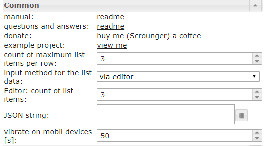
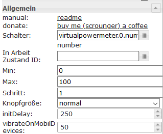
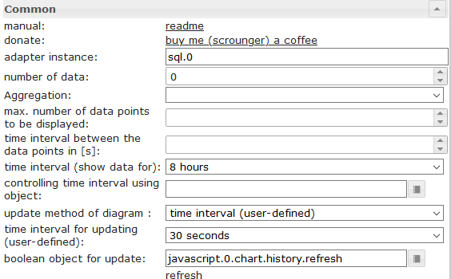
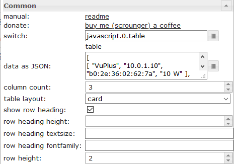
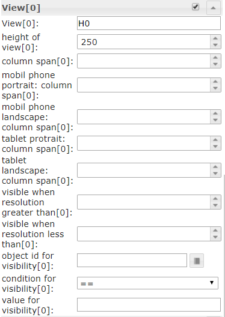

# ioBroker.vis-materialdesign


[](https://www.npmjs.com/package/iobroker.vis-materialdesign)
[](https://www.npmjs.com/package/ioBroker.vis-materialdesign)
[](https://www.npmjs.com/package/ioBroker.vis-materialdesign)
[](https://david-dm.org/Scrounger/iobroker.vis-materialdesign)
[](https://snyk.io/test/github/Scrounger/ioBroker.vis-materialdesign)

[](https://nodei.co/npm/iobroker.vis-materialdesign/)

**Tests:**: [](https://travis-ci.org/Scrounger/ioBroker.vis-materialdesign)

## Material Design Widgets for IoBroker VIS
[](https://www.paypal.com/cgi-bin/webscr?cmd=_s-xclick&hosted_button_id=VWAXSTS634G88&source=url)

ioBroker Material Design Widgets are based on [Google's material design guidelines](https://material.io/design/). The adapter uses the following libraries:
* [Google material components for the web](https://github.com/material-components/material-components-web)
* [Vuetify](https://github.com/vuetifyjs/vuetify)
* [chartjs](https://www.chartjs.org/)
* [round-slider from thomasloven](https://github.com/thomasloven/round-slider)
* [Material Design Icons](https://materialdesignicons.com/)

## Sentry
This adapter uses Sentry libraries to automatically report vis runtime exceptions and code errors caused by the widgets to the developers.

When the vis runtime is first loaded, the file `./iobroker-data/files/vis.0/materialdesign.sentry` is created. This file contains an anonymized id (so-called uuid), which allows the developer to determine whether the error occurs only with one or more users.

<b>To disable sentry</b>, the word 'disabled' must be entered in the file `/iobroker-data/files/vis.0/materialdesign.sentry`. 
<br>To check if sentry is disabled, open the browser console and look for `sentry is deactivated for vis-materialdesign`.


## Online Example Project
provided by [iobroker.click](https://iobroker.click/index.html), thanks to bluefox and iobroker.

* <a href="https://iobroker.click/vis/index.html?Material%20Design%20Widgets" target="_blank">VIS Runtime</a> (<a href="http://iobroker.click:8082/vis/index.html?Material%20Design%20Widgets" target="_blank">alternativ</a>)
* <a href="https://iobroker.click/vis/edit.html?Material%20Design%20Widgets" target="_blank">VIS Editor</a> (<a href="http://iobroker.click:8082/vis/edit.html?Material%20Design%20Widgets" target="_blank">alternativ</a>)

## Practical examples
* [Weather View](https://forum.iobroker.net/topic/32232/material-design-widgets-wetter-view)
* [Skript Status](https://forum.iobroker.net/topic/30662/material-design-widgets-skript-status)
* [Adapter Status](https://forum.iobroker.net/topic/30661/material-design-widgets-adapter-status)
* [UniFi Netzwerk Status](https://forum.iobroker.net/topic/30875/material-design-widgets-unifi-netzwerk-status)

## Questions and answers about the widgets
If you have questions about the individual widgets, then first look at the topics of the individual widgets

* [German threads](https://forum.iobroker.net/search?term=Material%20Design%20Widgets%3A&in=titles&matchWords=all&by%5B%5D=Scrounger&categories%5B%5D=7&sortBy=topic.title&sortDirection=desc&showAs=topics)

### Supported Browser
https://github.com/material-components/material-components-web/blob/master/docs/supported-browsers.md

### Supported Browser for vibrate on mobil devices function
https://developer.mozilla.org/en-US/docs/Web/API/Navigator/vibrate

### ioBroker VIS App
not working at the moment, needs to be implemneted by app, see https://github.com/ioBroker/ioBroker.vis.cordova

## Material Design Icons and Images
<table>
    <thead>
        <tr>
            <th>Screenshot</th>
            <th>Description</th>
        </tr>
    </thead>
    <tbody>
        <tr>
            <td rowspan=6></td>
            <td>Some of the widgets support <a href="https://materialdesignicons.com/" target="_blank">Material Design Icons</a> library. You can pic up an icon from the list above or open the image picker by clicking the button on the right of the input field.<br><br><b>Image colors only applies to the material design icons, not to an image!</b></td>
        </tr>
    </tbody>
</table>

## Buttons

### Button Toggle


### Icon Button


## Card


## List


## IconList


Settings that are not listed in the table below are self-explanatory.

<table>
    <thead>
        <tr>
            <th>Screenshot</th>
            <th>Setting</th>
            <th>Description</th>
        </tr>
    </thead>
    <tbody>
        <tr>
            <td rowspan=6></td>
            <td>input method for the list data</td>
            <td>The data for the IconList can be entered via the editor or a JSON string can be used</td>
        </tr>
        <tr>
            <td>JSON-String: object id</td>
            <td>Object Id of datapoint with JSON string. The JSON string must have the following format:
            <pre><code>
[
	{
		"background": "red",
		"text": "text1",
		"subText": "number",
		"image": "harddisk",
		"imageColor": "#ec0909",
		"imageActive": "folder",
		"imageActiveColor": "#5ad902",
		"buttonBackgroundColor": "",
		"buttonBackgroundActiveColor": "",
		"listType": "buttonState",
		"objectId": "0_userdata.0.iconList.buttonState.number",
		"buttonStateValue": "60",
		"buttonNavView": "",
		"buttonLink": "",
		"buttonToggleValueTrue": "",
		"buttonToggleValueFalse": "",
		"valueAppendix": "",
		"showValueLabel": "true",
		"statusBarColor": "green",
		"lockEnabled": "false"        
	},
	{
		"background": "green",
		"text": "text0",
		"subText": "bool",
		"image": "home",
		"imageColor": "#44739e",
		"imageActive": "home",
		"imageActiveColor": "#44739e",
		"buttonBackgroundColor": "",
		"buttonBackgroundActiveColor": "#a0f628",
		"listType": "buttonToggle",
		"objectId": "0_userdata.0.iconList.buttonToggle.bool0",
		"buttonStateValue": "60",
		"buttonNavView": "",
		"buttonLink": "",
		"buttonToggleValueTrue": "",
		"buttonToggleValueFalse": "",
		"valueAppendix": "",
		"showValueLabel": "false",
		"statusBarColor": "",
		"lockEnabled": "false"
	}
]
            </code></pre>
            Property <code>listType</code> can have the following values:<br>
            <code>text, buttonState, buttonToggle, buttonToggleValueTrue, buttonToggleValueFalse, buttonNav, buttonLink</code>
            </td>
        </tr>        
    </tbody>
</table>

## Progress


<table>
    <thead>
        <tr>
            <th>Screenshot</th>
            <th>Setting</th>
            <th>Description</th>
        </tr>
    </thead>
    <tbody>
        <tr>
            <td rowspan=6></td>
            <td>custom label</td>
            <td>For custom label you can use the property <code>[#value]</code> to show the real value of the datapoint. To show the current percent you can use <code>[#percent]</code></td>
        </tr>
    </tbody>
</table>

## Slider


Settings that are not listed in the table below are self-explanatory.

<table>
    <thead>
        <tr>
            <th>Screenshot</th>
            <th>Setting</th>
            <th>Description</th>
        </tr>
    </thead>
    <tbody>
        <tr>
            <td rowspan=6></td>
            <td>initDelay</td>
            <td>If the slider is not visible or operable after loading the runtime, then this value must be increased. Entry is made in milliseconds.<br>For example, increase by 250 steps until the slider works.</td>
        </tr>
    </tbody>
</table>

## Round Slider


## Checkbox


## Switch


## Input

### Text input


TODO

### Select


Settings that are not listed in the table below are self-explanatory.

<table>
    <thead>
        <tr>
            <th>Screenshot</th>
            <th>Setting</th>
            <th>Description</th>
        </tr>
    </thead>
    <tbody>
        <tr>
            <td rowspan=6></td>
            <td>method of data of menu</td>
            <td>There are three methods to define the data of the menu. First is to define it via editor. Second is to define it via a json string. Third method is to define it by three list for values, labels and icons</td>
        </tr>
        <tr>
            <td>Editor: count of menu items</td>
            <td>Method of data of menu: via editor<br>Define the number of menu entries. The the individual menu entries can be defined under menu item[x]</td>
        </tr>
        <tr>
            <td>JSON string</td>
            <td>Method of data of menu: json string<br>Here you can add a JSON string to define the menu entries or use bindings to a datapoint that contains a JSON string.<br><br>JSON string must have the following format:<br>
<pre><code>
[
	{
		"text": "text 0",
		"subText": "sub 0",
		"value": "val0",
		"icon": "account-cancel"
	},
	{
		"text": "text 1",
		"subText": "sub 1",
		"value": "val1",
		"icon": "/vis/icon/info.png",
        "iconColor": "red",
        "iconColorSelectedTextField": "red"
	},
	{
		"text": "text 2",
		"subText": "sub 2",
		"value": "val2",
		"icon": "facebook-workplace",
        "iconColor": "green"
	}
]
</code></pre>
            </td>
        </tr>
        <tr>
            <td>value list</td>
            <td>Method of data of menu: value list<br>Define the number of menu entries by adding values that will be set to the datapoint. Entries must be separeted by comma</td>
        </tr>
        <tr>
        <td>value list: labels</td>
            <td>Method of data of menu: value list<br>Define the related labels of the values. Entries must be separeted by comma</td>
        </tr>
        <tr>
        <td>value list: labels</td>
            <td>Method of data of menu: value list<br>Define the related icons of the values. Entries must be separeted by comma. You can use image path or Material Design Icons name</td>
        </tr>                
    </tbody>
</table>

### Autocomplete


Settings that are not listed in the table below are self-explanatory.

<table>
    <thead>
        <tr>
            <th>Screenshot</th>
            <th>Setting</th>
            <th>Description</th>
        </tr>
    </thead>
    <tbody>
        <tr>
            <td rowspan=6></td>
            <td>method of data of menu</td>
            <td>There are three methods to define the data of the menu. First is to define it via editor. Second is to define it via a json string. Third method is to define it by three list for values, labels and icons</td>
        </tr>
        <tr>
            <td>Editor: count of menu items</td>
            <td>Method of data of menu: via editor<br>Define the number of menu entries. The the individual menu entries can be defined under menu item[x]</td>
        </tr>
        <tr>
            <td>JSON string</td>
            <td>Method of data of menu: json string<br>Here you can add a JSON string to define the menu entries or use bindings to a datapoint that contains a JSON string.<br><br>JSON string must have the following format:<br>
<pre><code>
[
	{
		"text": "text 0",
		"subText": "sub 0",
		"value": "val0",
		"icon": "account-cancel"
	},
	{
		"text": "text 1",
		"subText": "sub 1",
		"value": "val1",
		"icon": "/vis/icon/info.png",
        "iconColor": "red"
	},
	{
		"text": "text 2",
		"subText": "sub 2",
		"value": "val2",
		"icon": "facebook-workplace",
        "iconColor": "green"
	}
]
</code></pre>
            </td>
        </tr>
        <tr>
            <td>value list</td>
            <td>Method of data of menu: value list<br>Define the number of menu entries by adding values that will be set to the datapoint. Entries must be separeted by comma</td>
        </tr>
        <tr>
        <td>value list: labels</td>
            <td>Method of data of menu: value list<br>Define the related labels of the values. Entries must be separeted by comma</td>
        </tr>
        <tr>
        <td>value list: labels</td>
            <td>Method of data of menu: value list<br>Define the related icons of the values. Entries must be separeted by comma. You can use image path or Material Design Icons name</td>
        </tr>                
    </tbody>
</table>

## Top App Bar with Navigation Drawer

Top App Bar with Navigation Drawer can be combined with the <a href="https://www.iobroker.net/#en/documentation/viz/basic.md">view in widget 8</a>.

<b>Take a look at the [Material Design Widgets example project](https://github.com/Scrounger/ioBroker.vis-materialdesign#online-example-project)</b> to understand how it works.

##### Layout modal:


##### Layout permanent:


<table>
    <thead>
        <tr>
            <th>Screenshot</th>
            <th>Setting</th>
            <th>Description</th>
        </tr>
    </thead>
    <tbody>
        <tr>
            <td rowspan=3></td>
            <td>Object ID</td>
            <td>must be set to a datapoint from typ number. For example this datapoint can be used by <a href="https://www.iobroker.net/#en/documentation/viz/basic.md">view in widget 8</a></td>
        </tr>
        <tr>
            <td>show index of navigation items</td>
            <td>shows the index of navigation before the item label. This number can be used in <a href="https://www.iobroker.net/#en/documentation/viz/basic.md">view in widget 8</a> to define the view that should be shown if the item is selected</td>
        </tr>
        <tr>
            <td>count of navigation items</td>
            <td>Define the count of the navigations items</td>
        </tr>
    </tbody>
</table>

### Submenu 


Settings that are not listed in the table below are self-explanatory.

<table>
    <thead>
        <tr>
            <th>Screenshot</th>
            <th>Setting</th>
            <th>Description</th>
        </tr>
    </thead>
    <tbody>
        <tr>
            <td rowspan=1></td>
            <td>count of sub menus[x]</td>
            <td>Define if the navigation item has submenus and the count of submenus.</td>
        </tr>
        <tr>
            <td rowspan=1></td>
            <td>label[x]</td>
            <td>To change the text of the items, you have to put a json object into the label field with the index of the view field.<br>
                Example:<br>

`{"itemText": "Item with Subitems", "subItems": ["subItem1", "subItem2"]}`

Result: see screenshot</td>
        </tr>
        <tr>
            <td rowspan=1></td>
            <td>icon[x]</td>
            <td>To change the icons of the items, you have to put a json object into the icons field with the index of the view field.<br>
                Example:<br>

`{"itemImage": "/icons-material-svg/hardware/ic_computer_48px.svg", "subItems": ["/vis/widgets/materialdesign/img/IoBroker_Logo.png", "/icons-material-svg/action/ic_android_48px.svg"]}`

Result: see screenshot</td>
        </tr>
    </tbody>
</table>

## Charts

### Bar Chart


TODO

### Pie Chart

TODO

### Line History Chart:

> Required Adapter: [SQL](https://github.com/ioBroker/ioBroker.sql), [History](https://github.com/ioBroker/ioBroker.history) or [InfluxDb](https://github.com/ioBroker/ioBroker.influxdb)!


Settings that are not listed in the table below are self-explanatory.

<table>
    <thead>
        <tr>
            <th>Screenshot</th>
            <th>Setting</th>
            <th>Description</th>
        </tr>
    </thead>
    <tbody>
        <tr>
            <td rowspan=5></td>
            <td>adapter instance</td>
            <td>Instance for the sql or history adapter</td>
        </tr>
        <tr>
            <td>controlling time interval using object</td>
            <td>Id of a datapoint to change the time interval of the chart.<br><br>If the datapoint is from type 'string' it must contain <a href="https://github.com/Scrounger/ioBroker.vis-materialdesign/blob/235530e4e54346b5527333ca06ce596519954c67/widgets/materialdesign/js/materialdesign.chart.js#L802">one of the linked values</a><br>If the datapoint is from type 'number', it must contain the starting timestamp of the graph.<br><br>For example, you can use a button here to change the display of the chart during runtime</td>
        </tr>
        <tr>
            <td>boolean object for update</td>
            <td>Id of adatapoint to trigger a manual refresh of the chart.<br>For example, you can use a button here to refresh the chart during runtime</td>
        </tr>
        <tr>
            <td>chart timeout</td>
            <td>timeout for loading the chart data. If you get a timeout error message, increase this value</td>
        </tr>
        <tr>
            <td>debug mode</td>
            <td>if you have problems or errors, activate the debug mode and attach the console log (F12) data to the issue</td>
        </tr>
        <tr>
            <td rowspan=5></td>
            <td>Object Id</td>
            <td>datapoint id with activated instance for the sql or history adapter</td>
        </tr>
        <tr>
            <td>display method</td>
            <td><a href="https://www.iobroker.net/docu/index-195.htm?page_id=198&lang=en#Aggregation">link</a></td>
        </tr>
        <tr>
            <td>max. number of data points to be displayed</td>
            <td>Number of maximum data points to display</td>
        </tr>
        <tr>
            <td>time interval between the data points in [s]</td>
            <td>Optional setting, overrides the 'count' setting.<br>Distance between the individual data points in seconds.<br>For example, if you want to display data points every minute, you have to enter 60 here</td>
        </tr>
        <tr>
            <td>data multiply with</td>
            <td>Optional setting, multiply every datapoint with the given value</td>
        </tr>
        <tr>
            <td></td>
            <td>time formats of x-axis</td>
            <td>Change the time format of the X-axis. Time formats must be entered for all time units, <a href="https://github.com/Scrounger/ioBroker.vis-materialdesign/blob/c677220868961b3cf0b153fb8bf04e13b4475c09/widgets/materialdesign/js/materialdesign.chart.js#L805">the following time units are permitted.</a><br>Approved time formats must be entered according to the moment.js library, <a href="https://momentjs.com/docs/#/displaying/">see link</a></td>
        </tr>
        <tr>
            <td></td>
            <td>tooltip time formats</td>
            <td>Change the time format of the tooltip. Time formats must be entered for all time units, <a href="https://github.com/Scrounger/ioBroker.vis-materialdesign/blob/c677220868961b3cf0b153fb8bf04e13b4475c09/widgets/materialdesign/js/materialdesign.chart.js#L805">the following time units are permitted.</a><br>Approved time formats must be entered according to the moment.js library, <a href="https://momentjs.com/docs/#/displaying/">see link</a></td>
        </tr>
    </tbody>
</table>

### JSON Chart

#### General

<table>
    <thead>
        <tr>
            <th>Property</th>
            <th>Description</th>
            <th>Type</th>
            <th>Values</th>
        </tr>
    </thead>
    <tbody>
        <tr>
            <td>axisLabels</td>
            <td>axis label of graph</td>
            <td>Array</td>
            <td>numbers or string</td>
        </tr>
        <tr>
            <td>graphs</td>
            <td>data of graphs</td>
            <td>array[<a href="#graph">graph</a>]</td>
            <td>see graph</td>
        </tr>
    </tbody>
</table>

#### graph

<details>
<table>
    <thead>
        <tr>
            <th>Property</th>
            <th>Description</th>
            <th>Type</th>
            <th>Values</th>
        </tr>
    </thead>
    <tbody>
        <tr>
            <td>data</td>
            <td>data of graph or data with timestamp</td>
            <td>Array[numbers] | Array[<a href="#data-with-time-axis">values with timestamp</a>]</td>
            <td>number</td>
        </tr>
        <tr>
            <td>type</td>
            <td>type of graph</td>
            <td>string</td>
            <td>'line', 'bar'</td>
        </tr>
        <tr>
            <td>legendText</td>
            <td>text of legend</td>
            <td>string</td>
            <td></td>
        </tr>
        <tr>
            <td>displayOrder</td>
            <td>overlay order of graph</td>
            <td>number</td>
            <td>1, 2, ...</td>
        </tr>
        <tr>
            <td>color</td>
            <td>color of graph</td>
            <td>color</td>
            <td>hex(#44739e), rgb(20, 50, 200), rgba(20, 50, 200, 0.5)</td>
        </tr>
        <tr>
            <td>use_gradient_color</td>
            <td>use gradient color</td>
            <td>boolean</td>
            <td>false, true</td>
        </tr>
        <tr>
            <td>gradient_color</td>
            <td>gradient color array</td>
            <td>array[<a href="#gradientcolor">gradientColor</a>]</td>
            <td>[ { value: -20, color: '#7d3c98' }, { value: 0, color: '#2874a6' } ]</td>
        </tr>
        <tr>
            <td>tooltip_title</td>
            <td>title of tooltip</td>
            <td>string</td>
            <td></td>
        </tr>
        <tr>
            <td>tooltip_text</td>
            <td>ovveride text of tooltip</td>
            <td>string</td>
            <td></td>
        </tr>
        <tr>
            <td>tooltip_MinDigits</td>
            <td>max decimals of tooltip value</td>
            <td>number</td>
            <td>0, 1, 2, ...</td>
        </tr>
        <tr>
            <td>tooltip_MaxDigits</td>
            <td>max decimals of tooltip value</td>
            <td>number</td>
            <td>0, 1, 2, ...</td>
        </tr>
        <tr>
            <td>tooltip_AppendText</td>
            <td>append text to tooltip value</td>
            <td>string</td>
            <td></td>
        </tr>
        <tr>
            <td>datalabel_show</td>
            <td>show data labels for graph</td>
            <td>string | boolean</td>
            <td>false, true, auto</td>
        </tr>
        <tr>
            <td>datalabel_anchor</td>
            <td>anchor of data labels</td>
            <td>string</td>
            <td>center, start, end</td>
        </tr>
        <tr>
            <td>datalabel_align</td>
            <td>position of the data label relative to the anchor point</td>
            <td>string</td>
            <td>left, start, center, end, right, top, bottom</td>
        </tr>
        <tr>
            <td>datalabel_offset</td>
            <td>distance (in pixels) to pull the data label away from the anchor point</td>
            <td>number</td>
            <td>0, 1, 2, ...</td>
        </tr>
        <tr>
            <td>datalabel_text_align</td>
            <td>text aligment of the data label</td>
            <td>string</td>
            <td>left, start, center, end, right</td>
        </tr>
        <tr>
            <td>datalabel_rotation</td>
            <td>clockwise rotation angle (in degrees) of the data label</td>
            <td>number</td>
            <td>0, 1, 2, ...</td>
        </tr>
        <tr>
            <td>datalabel_steps</td>
            <td>show data label every x step</td>
            <td>number</td>
            <td>0, 1, 2, ...</td>
        </tr>
        <tr>
            <td>datalabel_minDigits</td>
            <td>minimum decimals of data labels</td>
            <td>number</td>
            <td>0, 1, 2, ...</td>
        </tr>
        <tr>
            <td>datalabel_maxDigits</td>
            <td>maximum decimals of data labels</td>
            <td>number</td>
            <td>0, 1, 2, ...</td>
        </tr>
        <tr>
            <td>datalabel_append</td>
            <td>append text to data label</td>
            <td>string</td>
            <td></td>
        </tr>
        <tr>
            <td>datalabel_color</td>
            <td>data label color</td>
            <td>color | array[colors]</td>
            <td>hex(#44739e), rgb(20, 50, 200), rgba(20, 50, 200, 0.5)</td>
        </tr>
        <tr>
            <td>datalabel_fontFamily</td>
            <td>data label font family</td>
            <td>string</td>
            <td></td>
        </tr>
        <tr>
            <td>datalabel_fontSize</td>
            <td>data label font size</td>
            <td>number</td>
            <td>1, 2, 5, ...</td>
        </tr>
        <tr>
            <td>datalabel_backgroundColor</td>
            <td>data label background color</td>
            <td>color | array[colors]</td>
            <td>hex(#44739e), rgb(20, 50, 200), rgba(20, 50, 200, 0.5)</td>
        </tr>
        <tr>
            <td>datalabel_borderColor</td>
            <td>data label border color</td>
            <td>color | array[colors]</td>
            <td>hex(#44739e), rgb(20, 50, 200), rgba(20, 50, 200, 0.5)</td>
        </tr>
        <tr>
            <td>datalabel_borderWidth</td>
            <td>data label border width</td>
            <td>number</td>
            <td>1, 2, 5, ...</td>
        </tr>
        <tr>
            <td>datalabel_borderRadius</td>
            <td>data label border radius</td>
            <td>number</td>
            <td>1, 2, 5, ...</td>
        </tr>
    </tbody>
</table>
</details>


#### graph line chart spfeicifc

<details>
<table>
    <thead>
        <tr>
            <th>Property</th>
            <th>Description</th>
            <th>Type</th>
            <th>Values</th>
        </tr>
    </thead>
    <tbody>
        <tr>
            <td>line_pointStyle</td>
            <td>point style of line</td>
            <td>string</td>
            <td>circle, cross, crossRot, dash, line, rect, rectRounded, rectRot, star, triangle</td>
        </tr>
        <tr>
            <td>line_pointSize</td>
            <td>point size of line</td>
            <td>number</td>
            <td>1, 2, 3, ...</td>
        </tr>
        <tr>
            <td>line_pointSizeHover</td>
            <td>point size of line</td>
            <td>number</td>
            <td>1, 2, 3, ...</td>
        </tr>
        <tr>
            <td>line_PointColor</td>
            <td>color of line point</td>
            <td>color | array[colors]</td>
            <td>hex(#44739e), rgb(20, 50, 200), rgba(20, 50, 200, 0.5)</td>
        </tr>
        <tr>
            <td>line_PointColorBorder</td>
            <td>border color of line point</td>
            <td>color | array[colors]</td>
            <td>hex(#44739e), rgb(20, 50, 200), rgba(20, 50, 200, 0.5)</td>
        </tr>
        <tr>
            <td>line_PointColorHover</td>
            <td>hover color of line point</td>
            <td>color | array[colors]</td>
            <td>hex(#44739e), rgb(20, 50, 200), rgba(20, 50, 200, 0.5)</td>
        </tr>
        <tr>
            <td>line_PointColorBorderHover</td>
            <td>border hover color of line point</td>
            <td>color | array[colors]</td>
            <td>hex(#44739e), rgb(20, 50, 200), rgba(20, 50, 200, 0.5)</td>
        </tr>
        <tr>
            <td>line_spanGaps</td>
            <td>draw lines if data has gaps</td>
            <td>boolean</td>
            <td>false, true</td>
        </tr>
        <tr>
            <td>line_steppedLine</td>
            <td>enable stepped line</td>
            <td>boolean</td>
            <td>false, true</td>
        </tr>
        <tr>
            <td>line_Tension</td>
            <td>smothness of line</td>
            <td>number</td>
            <td>0 - 1</td>
        </tr>
        <tr>
            <td>line_Thickness</td>
            <td>thikness of line</td>
            <td>number</td>
            <td>1, 2, 5, ...</td>
        </tr>
        <tr>
            <td>line_UseFillColor</td>
            <td>use fill color under line</td>
            <td>boolean</td>
            <td>false, true</td>
        </tr>
        <tr>
            <td>line_FillColor</td>
            <td>fill color under line</td>
            <td>color</td>
            <td>hex(#44739e), rgb(20, 50, 200), rgba(20, 50, 200, 0.5)</td>
        </tr>
        <tr>
            <td>use_line_gradient_fill_color</td>
            <td>use gradient fill color</td>
            <td>boolean</td>
            <td>false, true</td>
        </tr>
        <tr>
            <td>line_gradient_fill_color</td>
            <td>gradient color array</td>
            <td>array[<a href="#gradientcolor">gradientColor</a>]</td>
            <td>[ { value: -20, color: '#7d3c98' }, { value: 0, color: '#2874a6' } ]</td>
        </tr>
        <tr>
            <td>line_FillBetweenLines</td>
            <td>fill color to next / previous line</td>
            <td>string</td>
            <td>'+1', '-1', '+2', ...</td>
        </tr>
    </tbody>
</table>
</details>


#### graph bar chart spfeicifc

<details>
<table>
    <thead>
        <tr>
            <th>Property</th>
            <th>Description</th>
            <th>Type</th>
            <th>Values</th>
        </tr>
    </thead>
    <tbody>
        <tr>
            <td>barIsStacked</td>
            <td>stacked bar. If you have a comined chart (Line + stacked Bar), then you must also set this value for the line dataset!</td>
            <td>boolean</td>
            <td>false, true</td>
        </tr>
        <tr>
            <td>barStackId</td>
            <td>id of stack. Bar that should combine to a stack must have the same id</td>
            <td>number</td>
            <td>1, 2, 5, ...</td>
        </tr>
        <tr>
            <td>barColorHover</td>
            <td>hover color of bar</td>
            <td>color | array[colors]</td>
            <td>hex(#44739e), rgb(20, 50, 200), rgba(20, 50, 200, 0.5)</td>
        </tr>
        <tr>
            <td>barBorderColor</td>
            <td>border color of bar</td>
            <td>color | array[colors]</td>
            <td>hex(#44739e), rgb(20, 50, 200), rgba(20, 50, 200, 0.5)</td>
        </tr>
        <tr>
            <td>barBorderWidth</td>
            <td>thikness of bar border</td>
            <td>number</td>
            <td>1, 2, 5, ...</td>
        </tr>
        <tr>
            <td>barBorderColorHover</td>
            <td>border hover color of bar</td>
            <td>color | array[colors]</td>
            <td>hex(#44739e), rgb(20, 50, 200), rgba(20, 50, 200, 0.5)</td>
        </tr>
        <tr>
            <td>barBorderWidthHover</td>
            <td>hover thikness of bar border</td>
            <td>number</td>
            <td>1, 2, 5, ...</td>
        </tr>
    </tbody>
</table>
</details>

#### graph y-Axis

<details>
<table>
    <thead>
        <tr>
            <th>Property</th>
            <th>Description</th>
            <th>Type</th>
            <th>Values</th>
        </tr>
    </thead>
    <tbody>
        <tr>
            <td>yAxis_id</td>
            <td>id of y-axis. If you would like to use a common y-axis for multipl graph data, use the same id.</td>
            <td>number</td>
            <td>1, 2, 5, ...</td>
        </tr>
        <tr>
            <td>yAxis_position</td>
            <td>position of y-axis</td>
            <td>string</td>
            <td>left, right</td>
        </tr>
        <tr>
            <td>yAxis_show</td>
            <td>show y-axis</td>
            <td>boolean</td>
            <td>false, true</td>
        </tr>
        <tr>
            <td>yAxis_title_text</td>
            <td>y-axis title</td>
            <td>string</td>
            <td></td>
        </tr>
        <tr>
            <td>yAxis_title_color</td>
            <td>override y-axis title color</td>
            <td>color</td>
            <td>hex(#44739e), rgb(20, 50, 200), rgba(20, 50, 200, 0.5)</td>
        </tr>
        <tr>
            <td>yAxis_title_fontFamily</td>
            <td>override y-axis title font family</td>
            <td>string</td>
            <td></td>
        </tr>
        <tr>
            <td>yAxis_title_fontSize</td>
            <td>override y-axis title font size</td>
            <td>number</td>
            <td>1, 2, 5, ...</td>
        </tr>
        <tr>
            <td>yAxis_min</td>
            <td>minimum value of y-axis</td>
            <td>number</td>
            <td>1, 2, 5, ...</td>
        </tr>
        <tr>
            <td>yAxis_max</td>
            <td>maximum value of y-axis</td>
            <td>number</td>
            <td>1, 2, 5, ...</td>
        </tr>
        <tr>
            <td>yAxis_step</td>
            <td>steps of y-axis</td>
            <td>number</td>
            <td>1, 2, 5, ...</td>
        </tr>
        <tr>
            <td>yAxis_minimumDigits</td>
            <td>y-axis minimum number of decimal places</td>
            <td>number</td>
            <td>1, 2, 5, ...</td>
        </tr>
        <tr>
            <td>yAxis_maximumDigits</td>
            <td>y-axis maximum number of decimal places</td>
            <td>number</td>
            <td>1, 2, 5, ...</td>
        </tr>
        <tr>
            <td>yAxis_maxSteps</td>
            <td>maximum steps of y-axis</td>
            <td>number</td>
            <td>1, 2, 5, ...</td>
        </tr>
        <tr>
            <td>yAxis_distance</td>
            <td>override y-axis value distance to axis</td>
            <td>number</td>
            <td>1, 2, 5, ...</td>
        </tr>
        <tr>
            <td>yAxis_appendix</td>
            <td>append text to y-axis value</td>
            <td>string</td>
            <td></td>
        </tr>
        <tr>
            <td>yAxis_color</td>
            <td>override y-axis value color</td>
            <td>color</td>
            <td>hex(#44739e), rgb(20, 50, 200), rgba(20, 50, 200, 0.5)</td>
        </tr>
        <tr>
            <td>yAxis_fontFamily</td>
            <td>override y-axis value font family</td>
            <td>string</td>
            <td></td>
        </tr>
        <tr>
            <td>yAxis_fontSize</td>
            <td>override y-axis value font size</td>
            <td>number</td>
            <td>1, 2, 5, ...</td>
        </tr>
        <tr>
            <td>yAxis_zeroLineWidth</td>
            <td>width of y-axis zero line</td>
            <td>number</td>
            <td>0.3, 1.5, 4, ...</td>
        </tr>
        <tr>
            <td>yAxis_zeroLineColor</td>
            <td>y-axis zero line color</td>
            <td>color</td>
            <td>hex(#44739e), rgb(20, 50, 200), rgba(20, 50, 200, 0.5)</td>
        </tr>
        <tr>
            <td>yAxis_gridLines_show</td>
            <td>show y-axis grid lines</td>
            <td>boolean</td>
            <td>false, true</td>
        </tr>
        <tr>
            <td>yAxis_gridLines_color</td>
            <td>color of y-axis grid lines</td>
            <td>color</td>
            <td>hex(#44739e), rgb(20, 50, 200), rgba(20, 50, 200, 0.5)</td>
        </tr>
        <tr>
            <td>yAxis_gridLines_lineWidth</td>
            <td>width of grid lines</td>
            <td>number</td>
            <td>0 - 1</td>
        </tr>
        <tr>
            <td>yAxis_gridLines_border_show</td>
            <td>show border of y-axis grid lines</td>
            <td>boolean</td>
            <td>false, true</td>
        </tr>
        <tr>
            <td>yAxis_gridLines_ticks_show</td>
            <td>show y-axis grid interval ticks</td>
            <td>boolean</td>
            <td>false, true</td>
        </tr>
        <tr>
            <td>yAxis_gridLines_ticks_length</td>
            <td>length of y-axis grid ticks</td>
            <td>number</td>
            <td>1, 2, 5, ...</td>
        </tr>
    </tbody>
</table>
</details>

#### gradientColor

<details>
<table>
    <thead>
        <tr>
            <th>Property</th>
            <th>Description</th>
            <th>Type</th>
            <th>Values</th>
        </tr>
    </thead>
    <tbody>
        <tr>
            <td>value</td>
            <td>value where color should be applied</td>
            <td>number</td>
            <td>1, 2, 5, ...</td>
        </tr>
        <tr>
            <td>color</td>
            <td>color for value</td>
            <td>color</td>
            <td>hex(#44739e), rgb(20, 50, 200), rgba(20, 50, 200, 0.5)</td>
        </tr>
    </tbody>
</table>
</details>

### Chart with time axis
JSON Chart supports data that have a timestamp. To use this the data array must have values for timestamp (x-axis value) and value (y-axis value).

#### values with timestamp

<details>
<table>
    <thead>
        <tr>
            <th>Property</th>
            <th>Description</th>
            <th>Type</th>
            <th>Values</th>
        </tr>
    </thead>
    <tbody>
        <tr>
            <td>t</td>
            <td>timestamp - xAxis value</td>
            <td>number</td>
            <td>1, 2, 5, ...</td>
        </tr>
        <tr>
            <td>y</td>
            <td>value for timestamp - yAxis value</td>
            <td>number</td>
            <td>1, 2, 5, ...</td>
        </tr>
    </tbody>
</table>
</details>

#### x-axis settings for data with timestamp

<details>
<table>
    <thead>
        <tr>
            <th>Property</th>
            <th>Description</th>
            <th>Type</th>
            <th>Values</th>
        </tr>
    </thead>
    <tbody>
        <tr>
            <td>xAxis_bounds</td>
            <td>scale boundary strategy<br><br>'data': makes sure data are fully visible, labels outside are removed<br>'ticks': makes sure ticks are fully visible, data outside are truncated</td>
            <td>String</td>
            <td>data, ticks</td>
        </tr>
        <tr>
            <td>xAxis_timeFormats</td>
            <td>time formats for the x-axis</td>
            <td>Object</td>
            <td>Time formats must be entered for all time units, <a href="https://github.com/Scrounger/ioBroker.vis-materialdesign/blob/c677220868961b3cf0b153fb8bf04e13b4475c09/widgets/materialdesign/js/materialdesign.chart.js#L805">the following time units are permitted.</a><br>Approved time formats must be entered according to the moment.js library, <a href="https://momentjs.com/docs/#/displaying/">see link</a></td>
        </tr>
        <tr>
            <td>xAxis_tooltip_timeFormats</td>
            <td>time formats for the x-axis</td>
            <td>String</td>
            <td>Approved time formats must be entered according to the moment.js library, <a href="https://momentjs.com/docs/#/displaying/">see link</a></td>
        </tr>
        <tr>
            <td>xAxis_time_unit</td>
            <td>force the time format for the x-axis</td>
            <td>String</td>
            <td>following units are allowed, <a href="https://www.chartjs.org/docs/latest/axes/cartesian/time.html#time-units">see link</a></td>
        </tr>
    </tbody>
</table>
</details>

## Table


### Input Data
Input data must be a json array of objects, example:
```
[
	{
		"img": "/vis.0/myImages/erlebnis_50.png",
		"name": "Empire",
		"betriebszeit": "4h 06m",
		"funk": "5G",
		"ip": "10.0.0.1"
	},
	{
		"img": "/vis.0/myImages/erlebnis_100.png",
		"name": "Handy",
		"betriebszeit": "13m",
		"funk": "5G",
		"ip": "10.0.0.2"
	},
	{
		"img": "/vis.0/myImages/erlebnis_100.png",
		"name": "Harmony Hub - Wohnzimmer",
		"betriebszeit": "18T 07h 21m",
		"funk": "2G",
		"ip": "10.0.0.3"
	}
]
```

#### Control Elements

To generate a control element (button, checkbox, etc.) in cell of the table you must create an object instead of a string.


```
[
	{
		"control": {
			"type": "buttonToggle",
			"oid": "0_userdata.0.MDW.Buttons.bool",
			"buttonText": "&nbsp;off",
			"buttonTextTrue": "&nbsp;on",
			"image": "home",
			"imagePosition": "left",
			"colorBgTrue": "green",
			"lockEnabled": "true"
		},
		"img": "/vis.0/myImages/erlebnis_50.png",
		"name": "Empire",
		"betriebszeit": "4h 06m",
		"funk": "5G"
	}, {
		"img": "/vis.0/myImages/erlebnis_100.png",
		"control": {
			"type": "buttonToggle",
			"oid": "0_userdata.0.MDW.Buttons.bool",
			"buttonText": "off",
			"buttonTextTrue": "on",
			"image": "home",
			"colorBgTrue": "green"
		},
		"name": "Handy",
		"betriebszeit": "13m",
		"funk": "5G",
		"ip": "10.0.0.2"
	}, {
		"img": "/vis.0/myImages/erlebnis_100.png",
		"name": "Harmony Hub - Wohnzimmer",
		"betriebszeit": "18T 07h 21m",
		"funk": "2G",
		"ip": "10.0.0.3"
	}
]
```

##### Generate by Editor

You can very easy generate controls by using the editor. Just create a supported Widget, configure it over the editor and export the settings by copy and paste to the table wigdet.
Take a look at the animated screenshot below:


##### General
<table>
    <thead>
        <tr>
            <th>Property</th>
            <th>Description</th>
            <th>Type</th>
            <th>Values</th>
        </tr>
    </thead>
    <tbody>
        <tr>
            <td>type</td>
            <td>type of control element</td>
            <td>string</td>
            <td>
                <ul>
                    <li><a href="#button-toggle-1">buttonToggle</a></li>
                    <li><a href="#button-toggle-vertical">buttonToggle_vertical</a></li>
                    <li><a href="#button-toggle-icon">buttonToggle_icon</a></li>
                    <li><a href="#button-state">buttonState</a></li>
                    <li><a href="#button-state-vertical">buttonState_vertical</a></li>
                    <li><a href="#button-state-icon">buttonState_icon</a></li>
                    <li><a href="#button-link">buttonLink</a></li>
                    <li><a href="#button-link-vertical">buttonLink_vertical</a></li>
                    <li><a href="#button-link-icon">buttonLink_icon</a></li>
                    <li><a href="#progress-1">progress</a></li>
                    <li><a href="#progress-circular">progress_circular</a></li>
                    <li><a href="#slider-1">slider</a></li>
                    <li><a href="#slider-round">slider_round</a></li>
                    <li><a href="#switch-1">switch</a></li>
                    <li><a href="#checkbox-1">checkbox</a></li>
					<li><a href="#textfield">textfield</a></li>
					<li><a href="#select-1">select</a></li>
					<li><a href="#autocomplete-1">autocomplete</a></li>
                </ul> 
            </td>
        </tr>
        <tr>
            <td>width</td>
            <td>width in % or px of control element</td>
            <td>string</td>
            <td>
                100% | 100px
            </td>
        </tr>
        <tr>
            <td>height</td>
            <td>height in % or px of control element</td>
            <td>string</td>
            <td>
                100% | 100px
            </td>
        </tr>
        <tr>
            <td>rowspan</td>
            <td>cell that spans x rows</td>
            <td>number</td>
            <td>
                1, 2, 3, ... 
            </td>
        </tr>
        <tr>
            <td>colspan</td>
            <td>cell that spans x columns</td>
            <td>number</td>
            <td>
                1, 2, 3, ... 
            </td>
        </tr>
        <tr>
            <td>verticalAlign</td>
            <td>vertical alignment</td>
            <td>string</td>
            <td>
                top | middle | bottom
            </td>
        </tr>
        <tr>
            <td>cellStyleAttrs</td>
            <td>css style attributes for cell</td>
            <td>string</td>
            <td>
                ...
            </td>
        </tr>
    </tbody>
</table>

##### Button Toggle 

<details>
<table>
	<thead>
		<tr>
			<th>Property</th>
			<th>Description</th>
			<th>Type</th>
			<th>Values</th>
		</tr>
	</thead>
	<tbody>
		<tr>
			<td>oid</td>
			<td>Object ID</td>
			<td>string</td>
			<td/>
		</tr>
		<tr>
			<td>buttonStyle</td>
			<td>button style</td>
			<td>string</td>
			<td>text | raised | unelevated | outlined</td>
		</tr>
		<tr>
			<td>readOnly</td>
			<td>read only</td>
			<td>boolean</td>
			<td>false | true</td>
		</tr>
		<tr>
			<td>toggleType</td>
			<td>type of toggle</td>
			<td>string</td>
			<td>boolean | value</td>
		</tr>
		<tr>
			<td>pushButton</td>
			<td>push button</td>
			<td>boolean</td>
			<td>false | true</td>
		</tr>
		<tr>
			<td>valueOff</td>
			<td>value for off</td>
			<td>string</td>
			<td/>
		</tr>
		<tr>
			<td>valueOn</td>
			<td>value for on</td>
			<td>string</td>
			<td/>
		</tr>
		<tr>
			<td>stateIfNotTrueValue</td>
			<td>state if value unequal to 'on' condition</td>
			<td>string</td>
			<td>on | off</td>
		</tr>
		<tr>
			<td>vibrateOnMobilDevices</td>
			<td>vibrate on mobil devices [s]</td>
			<td>number</td>
			<td/>
		</tr>
		<tr>
			<td>buttontext</td>
			<td>Button text</td>
			<td>string</td>
			<td/>
		</tr>
		<tr>
			<td>labelTrue</td>
			<td>Label true</td>
			<td>string</td>
			<td/>
		</tr>
		<tr>
			<td>labelColorFalse</td>
			<td>label color</td>
			<td>string</td>
			<td>hex(#44739e), rgb(20, 50, 200), rgba(20, 50, 200, 0.5)</td>
		</tr>
		<tr>
			<td>labelColorTrue</td>
			<td>active label color</td>
			<td>string</td>
			<td>hex(#44739e), rgb(20, 50, 200), rgba(20, 50, 200, 0.5)</td>
		</tr>
		<tr>
			<td>labelWidth</td>
			<td>text width</td>
			<td>number</td>
			<td/>
		</tr>
		<tr>
			<td>image</td>
			<td>Image</td>
			<td>custom</td>
			<td/>
		</tr>
		<tr>
			<td>imageColor</td>
			<td>image color</td>
			<td>string</td>
			<td>hex(#44739e), rgb(20, 50, 200), rgba(20, 50, 200, 0.5)</td>
		</tr>
		<tr>
			<td>imageTrue</td>
			<td>active image</td>
			<td>custom</td>
			<td/>
		</tr>
		<tr>
			<td>imageTrueColor</td>
			<td>active image color</td>
			<td>string</td>
			<td>hex(#44739e), rgb(20, 50, 200), rgba(20, 50, 200, 0.5)</td>
		</tr>
		<tr>
			<td>iconPosition</td>
			<td>image position</td>
			<td>string</td>
			<td>left | right</td>
		</tr>
		<tr>
			<td>iconHeight</td>
			<td>image height</td>
			<td>number</td>
			<td/>
		</tr>
		<tr>
			<td>colorBgFalse</td>
			<td>background</td>
			<td>string</td>
			<td>hex(#44739e), rgb(20, 50, 200), rgba(20, 50, 200, 0.5)</td>
		</tr>
		<tr>
			<td>colorBgTrue</td>
			<td>active background</td>
			<td>string</td>
			<td>hex(#44739e), rgb(20, 50, 200), rgba(20, 50, 200, 0.5)</td>
		</tr>
		<tr>
			<td>colorPress</td>
			<td>color pressed</td>
			<td>string</td>
			<td>hex(#44739e), rgb(20, 50, 200), rgba(20, 50, 200, 0.5)</td>
		</tr>
		<tr>
			<td>lockEnabled</td>
			<td>enable Locking</td>
			<td>boolean</td>
			<td>false | true</td>
		</tr>
		<tr>
			<td>autoLockAfter</td>
			<td>auto Locking after [s]</td>
			<td>number</td>
			<td/>
		</tr>
		<tr>
			<td>lockIcon</td>
			<td>icon</td>
			<td>custom</td>
			<td/>
		</tr>
		<tr>
			<td>lockIconSize</td>
			<td>icon size</td>
			<td>number</td>
			<td/>
		</tr>
		<tr>
			<td>lockIconColor</td>
			<td>icon color</td>
			<td>string</td>
			<td>hex(#44739e), rgb(20, 50, 200), rgba(20, 50, 200, 0.5)</td>
		</tr>
		<tr>
			<td>lockFilterGrayscale</td>
			<td>gray filter if locked</td>
			<td>number</td>
			<td/>
		</tr>
	</tbody>
</table>
</details>

##### Button Toggle Vertical 

<details>
<table>
	<thead>
		<tr>
			<th>Property</th>
			<th>Description</th>
			<th>Type</th>
			<th>Values</th>
		</tr>
	</thead>
	<tbody>
		<tr>
			<td>oid</td>
			<td>Object ID</td>
			<td>string</td>
			<td/>
		</tr>
		<tr>
			<td>buttonStyle</td>
			<td>button style</td>
			<td>string</td>
			<td>text | raised | unelevated | outlined</td>
		</tr>
		<tr>
			<td>readOnly</td>
			<td>read only</td>
			<td>boolean</td>
			<td>false | true</td>
		</tr>
		<tr>
			<td>toggleType</td>
			<td>type of toggle</td>
			<td>string</td>
			<td>boolean | value</td>
		</tr>
		<tr>
			<td>pushButton</td>
			<td>push button</td>
			<td>boolean</td>
			<td>false | true</td>
		</tr>
		<tr>
			<td>valueOff</td>
			<td>value for off</td>
			<td>string</td>
			<td/>
		</tr>
		<tr>
			<td>valueOn</td>
			<td>value for on</td>
			<td>string</td>
			<td/>
		</tr>
		<tr>
			<td>stateIfNotTrueValue</td>
			<td>state if value unequal to 'on' condition</td>
			<td>string</td>
			<td>on | off</td>
		</tr>
		<tr>
			<td>vibrateOnMobilDevices</td>
			<td>vibrate on mobil devices [s]</td>
			<td>number</td>
			<td/>
		</tr>
		<tr>
			<td>buttontext</td>
			<td>Button text</td>
			<td>string</td>
			<td/>
		</tr>
		<tr>
			<td>labelTrue</td>
			<td>Label true</td>
			<td>string</td>
			<td/>
		</tr>
		<tr>
			<td>labelColorFalse</td>
			<td>label color</td>
			<td>string</td>
			<td>hex(#44739e), rgb(20, 50, 200), rgba(20, 50, 200, 0.5)</td>
		</tr>
		<tr>
			<td>labelColorTrue</td>
			<td>active label color</td>
			<td>string</td>
			<td>hex(#44739e), rgb(20, 50, 200), rgba(20, 50, 200, 0.5)</td>
		</tr>
		<tr>
			<td>image</td>
			<td>Image</td>
			<td>custom</td>
			<td/>
		</tr>
		<tr>
			<td>imageColor</td>
			<td>image color</td>
			<td>string</td>
			<td>hex(#44739e), rgb(20, 50, 200), rgba(20, 50, 200, 0.5)</td>
		</tr>
		<tr>
			<td>imageTrue</td>
			<td>active image</td>
			<td>custom</td>
			<td/>
		</tr>
		<tr>
			<td>imageTrueColor</td>
			<td>active image color</td>
			<td>string</td>
			<td>hex(#44739e), rgb(20, 50, 200), rgba(20, 50, 200, 0.5)</td>
		</tr>
		<tr>
			<td>iconPosition</td>
			<td>image position</td>
			<td>string</td>
			<td>top | bottom</td>
		</tr>
		<tr>
			<td>iconHeight</td>
			<td>image height</td>
			<td>number</td>
			<td/>
		</tr>
		<tr>
			<td>colorBgFalse</td>
			<td>background</td>
			<td>string</td>
			<td>hex(#44739e), rgb(20, 50, 200), rgba(20, 50, 200, 0.5)</td>
		</tr>
		<tr>
			<td>colorBgTrue</td>
			<td>active background</td>
			<td>string</td>
			<td>hex(#44739e), rgb(20, 50, 200), rgba(20, 50, 200, 0.5)</td>
		</tr>
		<tr>
			<td>colorPress</td>
			<td>color pressed</td>
			<td>string</td>
			<td>hex(#44739e), rgb(20, 50, 200), rgba(20, 50, 200, 0.5)</td>
		</tr>
		<tr>
			<td>lockEnabled</td>
			<td>enable Locking</td>
			<td>boolean</td>
			<td>false | true</td>
		</tr>
		<tr>
			<td>autoLockAfter</td>
			<td>auto Locking after [s]</td>
			<td>number</td>
			<td/>
		</tr>
		<tr>
			<td>lockIcon</td>
			<td>icon</td>
			<td>custom</td>
			<td/>
		</tr>
		<tr>
			<td>lockIconTop</td>
			<td>symbol distance from top [%]</td>
			<td>number</td>
			<td/>
		</tr>
		<tr>
			<td>lockIconLeft</td>
			<td>symbol distance from left [%]</td>
			<td>number</td>
			<td/>
		</tr>
		<tr>
			<td>lockIconSize</td>
			<td>icon size</td>
			<td>number</td>
			<td/>
		</tr>
		<tr>
			<td>lockIconColor</td>
			<td>icon color</td>
			<td>string</td>
			<td>hex(#44739e), rgb(20, 50, 200), rgba(20, 50, 200, 0.5)</td>
		</tr>
		<tr>
			<td>lockFilterGrayscale</td>
			<td>gray filter if locked</td>
			<td>number</td>
			<td/>
		</tr>
	</tbody>
</table>
</details>

##### Button Toggle Icon

<details>
<table>
	<thead>
		<tr>
			<th>Property</th>
			<th>Description</th>
			<th>Type</th>
			<th>Values</th>
		</tr>
	</thead>
	<tbody>
		<tr>
			<td>oid</td>
			<td>Object ID</td>
			<td>string</td>
			<td/>
		</tr>
		<tr>
			<td>readOnly</td>
			<td>read only</td>
			<td>boolean</td>
			<td>false | true</td>
		</tr>
		<tr>
			<td>toggleType</td>
			<td>type of toggle</td>
			<td>string</td>
			<td>boolean | value</td>
		</tr>
		<tr>
			<td>pushButton</td>
			<td>push button</td>
			<td>boolean</td>
			<td>false | true</td>
		</tr>
		<tr>
			<td>valueOff</td>
			<td>value for off</td>
			<td>string</td>
			<td/>
		</tr>
		<tr>
			<td>valueOn</td>
			<td>value for on</td>
			<td>string</td>
			<td/>
		</tr>
		<tr>
			<td>stateIfNotTrueValue</td>
			<td>state if value unequal to 'on' condition</td>
			<td>string</td>
			<td>on | off</td>
		</tr>
		<tr>
			<td>vibrateOnMobilDevices</td>
			<td>vibrate on mobil devices [s]</td>
			<td>number</td>
			<td/>
		</tr>
		<tr>
			<td>image</td>
			<td>Image</td>
			<td>custom</td>
			<td/>
		</tr>
		<tr>
			<td>imageColor</td>
			<td>image color</td>
			<td>string</td>
			<td>hex(#44739e), rgb(20, 50, 200), rgba(20, 50, 200, 0.5)</td>
		</tr>
		<tr>
			<td>imageTrue</td>
			<td>active image</td>
			<td>custom</td>
			<td/>
		</tr>
		<tr>
			<td>imageTrueColor</td>
			<td>active image color</td>
			<td>string</td>
			<td>hex(#44739e), rgb(20, 50, 200), rgba(20, 50, 200, 0.5)</td>
		</tr>
		<tr>
			<td>iconHeight</td>
			<td>image height</td>
			<td>number</td>
			<td/>
		</tr>
		<tr>
			<td>colorBgFalse</td>
			<td>background</td>
			<td>string</td>
			<td>hex(#44739e), rgb(20, 50, 200), rgba(20, 50, 200, 0.5)</td>
		</tr>
		<tr>
			<td>colorBgTrue</td>
			<td>active background</td>
			<td>string</td>
			<td>hex(#44739e), rgb(20, 50, 200), rgba(20, 50, 200, 0.5)</td>
		</tr>
		<tr>
			<td>colorPress</td>
			<td>color pressed</td>
			<td>string</td>
			<td>hex(#44739e), rgb(20, 50, 200), rgba(20, 50, 200, 0.5)</td>
		</tr>
		<tr>
			<td>lockEnabled</td>
			<td>enable Locking</td>
			<td>boolean</td>
			<td>false | true</td>
		</tr>
		<tr>
			<td>autoLockAfter</td>
			<td>auto Locking after [s]</td>
			<td>number</td>
			<td/>
		</tr>
		<tr>
			<td>lockIcon</td>
			<td>icon</td>
			<td>custom</td>
			<td/>
		</tr>
		<tr>
			<td>lockIconTop</td>
			<td>symbol distance from top [%]</td>
			<td>number</td>
			<td/>
		</tr>
		<tr>
			<td>lockIconLeft</td>
			<td>symbol distance from left [%]</td>
			<td>number</td>
			<td/>
		</tr>
		<tr>
			<td>lockIconSize</td>
			<td>icon size</td>
			<td>number</td>
			<td/>
		</tr>
		<tr>
			<td>lockIconColor</td>
			<td>icon color</td>
			<td>string</td>
			<td>hex(#44739e), rgb(20, 50, 200), rgba(20, 50, 200, 0.5)</td>
		</tr>
		<tr>
			<td>lockIconBackground</td>
			<td>background color of lock icon</td>
			<td>string</td>
			<td>hex(#44739e), rgb(20, 50, 200), rgba(20, 50, 200, 0.5)</td>
		</tr>
		<tr>
			<td>lockBackgroundSizeFactor</td>
			<td>grow factor of background size</td>
			<td>number</td>
			<td/>
		</tr>
		<tr>
			<td>lockFilterGrayscale</td>
			<td>gray filter if locked</td>
			<td>number</td>
			<td/>
		</tr>
	</tbody>
</table>
</details>


##### Button State

<details>
<table>
	<thead>
		<tr>
			<th>Property</th>
			<th>Description</th>
			<th>Type</th>
			<th>Values</th>
		</tr>
	</thead>
	<tbody>
		<tr>
			<td>oid</td>
			<td>Object ID</td>
			<td>string</td>
			<td/>
		</tr>
		<tr>
			<td>buttonStyle</td>
			<td>button style</td>
			<td>string</td>
			<td>text | raised | unelevated | outlined</td>
		</tr>
		<tr>
			<td>value</td>
			<td>value</td>
			<td>string</td>
			<td/>
		</tr>
		<tr>
			<td>buttontext</td>
			<td>Button text</td>
			<td>string</td>
			<td/>
		</tr>
		<tr>
			<td>colorPress</td>
			<td>color pressed</td>
			<td>string</td>
			<td>hex(#44739e), rgb(20, 50, 200), rgba(20, 50, 200, 0.5)</td>
		</tr>
		<tr>
			<td>labelWidth</td>
			<td>text width</td>
			<td>number</td>
			<td/>
		</tr>
		<tr>
			<td>vibrateOnMobilDevices</td>
			<td>vibrate on mobil devices [s]</td>
			<td>number</td>
			<td/>
		</tr>
		<tr>
			<td>image</td>
			<td>Image</td>
			<td>custom</td>
			<td/>
		</tr>
		<tr>
			<td>imageColor</td>
			<td>image color</td>
			<td>string</td>
			<td>hex(#44739e), rgb(20, 50, 200), rgba(20, 50, 200, 0.5)</td>
		</tr>
		<tr>
			<td>iconPosition</td>
			<td>image position</td>
			<td>string</td>
			<td>left | right</td>
		</tr>
		<tr>
			<td>iconHeight</td>
			<td>image height</td>
			<td>number</td>
			<td/>
		</tr>
		<tr>
			<td>lockEnabled</td>
			<td>enable Locking</td>
			<td>boolean</td>
			<td>false | true</td>
		</tr>
		<tr>
			<td>autoLockAfter</td>
			<td>auto Locking after [s]</td>
			<td>number</td>
			<td/>
		</tr>
		<tr>
			<td>lockIcon</td>
			<td>icon</td>
			<td>custom</td>
			<td/>
		</tr>
		<tr>
			<td>lockIconSize</td>
			<td>icon size</td>
			<td>number</td>
			<td/>
		</tr>
		<tr>
			<td>lockIconColor</td>
			<td>icon color</td>
			<td>string</td>
			<td>hex(#44739e), rgb(20, 50, 200), rgba(20, 50, 200, 0.5)</td>
		</tr>
		<tr>
			<td>lockFilterGrayscale</td>
			<td>gray filter if locked</td>
			<td>number</td>
			<td/>
		</tr>
	</tbody>
</table>
</details>


##### Button State Vertical 

<details>
<table>
	<thead>
		<tr>
			<th>Property</th>
			<th>Description</th>
			<th>Type</th>
			<th>Values</th>
		</tr>
	</thead>
	<tbody>
		<tr>
			<td>oid</td>
			<td>Object ID</td>
			<td>string</td>
			<td/>
		</tr>
		<tr>
			<td>buttonStyle</td>
			<td>button style</td>
			<td>string</td>
			<td>text | raised | unelevated | outlined</td>
		</tr>
		<tr>
			<td>value</td>
			<td>value</td>
			<td>string</td>
			<td/>
		</tr>
		<tr>
			<td>buttontext</td>
			<td>Button text</td>
			<td>string</td>
			<td/>
		</tr>
		<tr>
			<td>colorPress</td>
			<td>color pressed</td>
			<td>string</td>
			<td>hex(#44739e), rgb(20, 50, 200), rgba(20, 50, 200, 0.5)</td>
		</tr>
		<tr>
			<td>vibrateOnMobilDevices</td>
			<td>vibrate on mobil devices [s]</td>
			<td>number</td>
			<td/>
		</tr>
		<tr>
			<td>image</td>
			<td>Image</td>
			<td>custom</td>
			<td/>
		</tr>
		<tr>
			<td>imageColor</td>
			<td>image color</td>
			<td>string</td>
			<td>hex(#44739e), rgb(20, 50, 200), rgba(20, 50, 200, 0.5)</td>
		</tr>
		<tr>
			<td>iconPosition</td>
			<td>image position</td>
			<td>string</td>
			<td>top | bottom</td>
		</tr>
		<tr>
			<td>iconHeight</td>
			<td>image height</td>
			<td>number</td>
			<td/>
		</tr>
		<tr>
			<td>lockEnabled</td>
			<td>enable Locking</td>
			<td>boolean</td>
			<td>false | true</td>
		</tr>
		<tr>
			<td>autoLockAfter</td>
			<td>auto Locking after [s]</td>
			<td>number</td>
			<td/>
		</tr>
		<tr>
			<td>lockIcon</td>
			<td>icon</td>
			<td>custom</td>
			<td/>
		</tr>
		<tr>
			<td>lockIconTop</td>
			<td>symbol distance from top [%]</td>
			<td>number</td>
			<td/>
		</tr>
		<tr>
			<td>lockIconLeft</td>
			<td>symbol distance from left [%]</td>
			<td>number</td>
			<td/>
		</tr>
		<tr>
			<td>lockIconSize</td>
			<td>icon size</td>
			<td>number</td>
			<td/>
		</tr>
		<tr>
			<td>lockIconColor</td>
			<td>icon color</td>
			<td>string</td>
			<td>hex(#44739e), rgb(20, 50, 200), rgba(20, 50, 200, 0.5)</td>
		</tr>
		<tr>
			<td>lockFilterGrayscale</td>
			<td>gray filter if locked</td>
			<td>number</td>
			<td/>
		</tr>
	</tbody>
</table>
</details>


##### Button State Icon

<details>
<table>
	<thead>
		<tr>
			<th>Property</th>
			<th>Description</th>
			<th>Type</th>
			<th>Values</th>
		</tr>
	</thead>
	<tbody>
		<tr>
			<td>oid</td>
			<td>Object ID</td>
			<td>string</td>
			<td/>
		</tr>
		<tr>
			<td>value</td>
			<td>value</td>
			<td>string</td>
			<td/>
		</tr>
		<tr>
			<td>vibrateOnMobilDevices</td>
			<td>vibrate on mobil devices [s]</td>
			<td>number</td>
			<td/>
		</tr>
		<tr>
			<td>image</td>
			<td>Image</td>
			<td>custom</td>
			<td/>
		</tr>
		<tr>
			<td>imageColor</td>
			<td>image color</td>
			<td>string</td>
			<td>hex(#44739e), rgb(20, 50, 200), rgba(20, 50, 200, 0.5)</td>
		</tr>
		<tr>
			<td>iconHeight</td>
			<td>image height</td>
			<td>number</td>
			<td/>
		</tr>
		<tr>
			<td>colorPress</td>
			<td>color pressed</td>
			<td>string</td>
			<td>hex(#44739e), rgb(20, 50, 200), rgba(20, 50, 200, 0.5)</td>
		</tr>
		<tr>
			<td>lockEnabled</td>
			<td>enable Locking</td>
			<td>boolean</td>
			<td>false | true</td>
		</tr>
		<tr>
			<td>autoLockAfter</td>
			<td>auto Locking after [s]</td>
			<td>number</td>
			<td/>
		</tr>
		<tr>
			<td>lockIcon</td>
			<td>icon</td>
			<td>custom</td>
			<td/>
		</tr>
		<tr>
			<td>lockIconTop</td>
			<td>symbol distance from top [%]</td>
			<td>number</td>
			<td/>
		</tr>
		<tr>
			<td>lockIconLeft</td>
			<td>symbol distance from left [%]</td>
			<td>number</td>
			<td/>
		</tr>
		<tr>
			<td>lockIconSize</td>
			<td>icon size</td>
			<td>number</td>
			<td/>
		</tr>
		<tr>
			<td>lockIconColor</td>
			<td>icon color</td>
			<td>string</td>
			<td>hex(#44739e), rgb(20, 50, 200), rgba(20, 50, 200, 0.5)</td>
		</tr>
		<tr>
			<td>lockIconBackground</td>
			<td>background color of lock icon</td>
			<td>string</td>
			<td>hex(#44739e), rgb(20, 50, 200), rgba(20, 50, 200, 0.5)</td>
		</tr>
		<tr>
			<td>lockBackgroundSizeFactor</td>
			<td>grow factor of background size</td>
			<td>number</td>
			<td/>
		</tr>
		<tr>
			<td>lockFilterGrayscale</td>
			<td>gray filter if locked</td>
			<td>number</td>
			<td/>
		</tr>
	</tbody>
</table>
</details>


##### Button Link 

<details>
<table>
	<thead>
		<tr>
			<th>Property</th>
			<th>Description</th>
			<th>Type</th>
			<th>Values</th>
		</tr>
	</thead>
	<tbody>
		<tr>
			<td>buttonStyle</td>
			<td>button style</td>
			<td>string</td>
			<td>text | raised | unelevated | outlined</td>
		</tr>
		<tr>
			<td>href</td>
			<td>Link</td>
			<td>url</td>
			<td/>
		</tr>
		<tr>
			<td>openNewWindow</td>
			<td>open in new window</td>
			<td>boolean</td>
			<td>false | true</td>
		</tr>
		<tr>
			<td>buttontext</td>
			<td>Button text</td>
			<td>string</td>
			<td/>
		</tr>
		<tr>
			<td>colorPress</td>
			<td>color pressed</td>
			<td>string</td>
			<td>hex(#44739e), rgb(20, 50, 200), rgba(20, 50, 200, 0.5)</td>
		</tr>
		<tr>
			<td>labelWidth</td>
			<td>text width</td>
			<td>number</td>
			<td/>
		</tr>
		<tr>
			<td>vibrateOnMobilDevices</td>
			<td>vibrate on mobil devices [s]</td>
			<td>number</td>
			<td/>
		</tr>
		<tr>
			<td>image</td>
			<td>Image</td>
			<td>custom</td>
			<td/>
		</tr>
		<tr>
			<td>imageColor</td>
			<td>image color</td>
			<td>string</td>
			<td>hex(#44739e), rgb(20, 50, 200), rgba(20, 50, 200, 0.5)</td>
		</tr>
		<tr>
			<td>iconPosition</td>
			<td>image position</td>
			<td>string</td>
			<td>left | right</td>
		</tr>
		<tr>
			<td>iconHeight</td>
			<td>image height</td>
			<td>number</td>
			<td/>
		</tr>
	</tbody>
</table>
</details>

##### Button Link Vertical

<details>
<table>
	<thead>
		<tr>
			<th>Property</th>
			<th>Description</th>
			<th>Type</th>
			<th>Values</th>
		</tr>
	</thead>
	<tbody>
		<tr>
			<td>buttonStyle</td>
			<td>button style</td>
			<td>string</td>
			<td>text | raised | unelevated | outlined</td>
		</tr>
		<tr>
			<td>href</td>
			<td>Link</td>
			<td>url</td>
			<td/>
		</tr>
		<tr>
			<td>openNewWindow</td>
			<td>open in new window</td>
			<td>boolean</td>
			<td>false | true</td>
		</tr>
		<tr>
			<td>buttontext</td>
			<td>Button text</td>
			<td>string</td>
			<td/>
		</tr>
		<tr>
			<td>colorPress</td>
			<td>color pressed</td>
			<td>string</td>
			<td>hex(#44739e), rgb(20, 50, 200), rgba(20, 50, 200, 0.5)</td>
		</tr>
		<tr>
			<td>vibrateOnMobilDevices</td>
			<td>vibrate on mobil devices [s]</td>
			<td>number</td>
			<td/>
		</tr>
		<tr>
			<td>image</td>
			<td>Image</td>
			<td>custom</td>
			<td/>
		</tr>
		<tr>
			<td>imageColor</td>
			<td>image color</td>
			<td>string</td>
			<td>hex(#44739e), rgb(20, 50, 200), rgba(20, 50, 200, 0.5)</td>
		</tr>
		<tr>
			<td>iconPosition</td>
			<td>image position</td>
			<td>string</td>
			<td>top | bottom</td>
		</tr>
		<tr>
			<td>iconHeight</td>
			<td>image height</td>
			<td>number</td>
			<td/>
		</tr>
	</tbody>
</table>
</details>

##### Button Link Icon

<details>
<table>
	<thead>
		<tr>
			<th>Property</th>
			<th>Description</th>
			<th>Type</th>
			<th>Values</th>
		</tr>
	</thead>
	<tbody>
		<tr>
			<td>href</td>
			<td>Link</td>
			<td>url</td>
			<td/>
		</tr>
		<tr>
			<td>openNewWindow</td>
			<td>open in new window</td>
			<td>boolean</td>
			<td>false | true</td>
		</tr>
		<tr>
			<td>vibrateOnMobilDevices</td>
			<td>vibrate on mobil devices [s]</td>
			<td>number</td>
			<td/>
		</tr>
		<tr>
			<td>image</td>
			<td>Image</td>
			<td>custom</td>
			<td/>
		</tr>
		<tr>
			<td>imageColor</td>
			<td>image color</td>
			<td>string</td>
			<td>hex(#44739e), rgb(20, 50, 200), rgba(20, 50, 200, 0.5)</td>
		</tr>
		<tr>
			<td>iconHeight</td>
			<td>image height</td>
			<td>number</td>
			<td/>
		</tr>
		<tr>
			<td>colorPress</td>
			<td>color pressed</td>
			<td>string</td>
			<td>hex(#44739e), rgb(20, 50, 200), rgba(20, 50, 200, 0.5)</td>
		</tr>
	</tbody>
</table>
</details>

##### Progress

<details>
<table>
    <thead>
        <tr>
            <th>Property</th>
            <th>Description</th>
            <th>Type</th>
            <th>Values</th>
        </tr>
    </thead>
    <tbody>
		<tr>
			<td>oid</td>
			<td>Object ID</td>
			<td>string</td>
			<td></td>
		</tr>
		<tr>
			<td>min</td>
			<td>min</td>
			<td>string</td>
			<td></td>
		</tr>
		<tr>
			<td>max</td>
			<td>max</td>
			<td>string</td>
			<td></td>
		</tr>
		<tr>
			<td>reverse</td>
			<td>Revers value</td>
			<td>boolean</td>
			<td>false | true</td>
		</tr>
		<tr>
			<td>progressRounded</td>
			<td>rounded corners</td>
			<td>boolean</td>
			<td>false | true</td>
		</tr>
		<tr>
			<td>progressStriped</td>
			<td>striped</td>
			<td>boolean</td>
			<td>false | true</td>
		</tr>
		<tr>
			<td>progressStripedColor</td>
			<td>progressStripedColor</td>
			<td>string</td>
			<td>hex(#44739e), rgb(20, 50, 200), rgba(20, 50, 200, 0.5)</td>
		</tr>
		<tr>
			<td>colorProgressBackground</td>
			<td>background color</td>
			<td>string</td>
			<td>hex(#44739e), rgb(20, 50, 200), rgba(20, 50, 200, 0.5)</td>
		</tr>
		<tr>
			<td>colorProgress</td>
			<td>color progress</td>
			<td>string</td>
			<td>hex(#44739e), rgb(20, 50, 200), rgba(20, 50, 200, 0.5)</td>
		</tr>
		<tr>
			<td>colorOneCondition</td>
			<td>condition for color 1 progress [>]</td>
			<td>string</td>
			<td></td>
		</tr>
		<tr>
			<td>colorOne</td>
			<td>color 1 progress</td>
			<td>string</td>
			<td>hex(#44739e), rgb(20, 50, 200), rgba(20, 50, 200, 0.5)</td>
		</tr>
		<tr>
			<td>colorTwoCondition</td>
			<td>condition for color 2 progress [>]</td>
			<td>string</td>
			<td></td>
		</tr>
		<tr>
			<td>colorTwo</td>
			<td>color 2 progress</td>
			<td>string</td>
			<td>hex(#44739e), rgb(20, 50, 200), rgba(20, 50, 200, 0.5)</td>
		</tr>
		<tr>
			<td>showValueLabel</td>
			<td>show value</td>
			<td>boolean</td>
			<td>false | true</td>
		</tr>
		<tr>
			<td>valueLabelStyle</td>
			<td>value caption style</td>
			<td>string</td>
			<td>progressPercent | progressValue | progressCustom</td>
		</tr>
		<tr>
			<td>valueLabelUnit</td>
			<td>unit</td>
			<td>string</td>
			<td></td>
		</tr>
		<tr>
			<td>valueMaxDecimals</td>
			<td>decimal points</td>
			<td>number</td>
			<td></td>
		</tr>
		<tr>
			<td>valueLabelCustom</td>
			<td>valueLabelCustom</td>
			<td>string</td>
			<td></td>
		</tr>
		<tr>
			<td>textColor</td>
			<td>text color</td>
			<td>string</td>
			<td>hex(#44739e), rgb(20, 50, 200), rgba(20, 50, 200, 0.5)</td>
		</tr>
		<tr>
			<td>textFontSize</td>
			<td>text size</td>
			<td>number</td>
			<td></td>
		</tr>
		<tr>
			<td>textFontFamily</td>
			<td>textFontFamily</td>
			<td>string</td>
			<td></td>
		</tr>
		<tr>
			<td>textAlign</td>
			<td>textAlign</td>
			<td>string</td>
			<td>start | center | end</td>
		</tr>
    </tbody>
</table>
</details>


##### Progress Circular

<details>
<table>
	<thead>
		<tr>
			<th>Property</th>
			<th>Description</th>
			<th>Type</th>
			<th>Values</th>
		</tr>
	</thead>
	<tbody>
		<tr>
			<td>oid</td>
			<td>Object ID</td>
			<td>string</td>
			<td/>
		</tr>
		<tr>
			<td>min</td>
			<td>min</td>
			<td>string</td>
			<td/>
		</tr>
		<tr>
			<td>max</td>
			<td>max</td>
			<td>string</td>
			<td/>
		</tr>
		<tr>
			<td>progressCircularSize</td>
			<td>size</td>
			<td>number</td>
			<td/>
		</tr>
		<tr>
			<td>progressCircularWidth</td>
			<td>thickness</td>
			<td>number</td>
			<td/>
		</tr>
		<tr>
			<td>progressCircularRotate</td>
			<td>rotate start point</td>
			<td>number</td>
			<td/>
		</tr>
		<tr>
			<td>colorProgressBackground</td>
			<td>background color</td>
			<td>string</td>
			<td>hex(#44739e), rgb(20, 50, 200), rgba(20, 50, 200, 0.5)</td>
		</tr>
		<tr>
			<td>colorProgress</td>
			<td>color progress</td>
			<td>string</td>
			<td>hex(#44739e), rgb(20, 50, 200), rgba(20, 50, 200, 0.5)</td>
		</tr>
		<tr>
			<td>innerColor</td>
			<td>circle background color</td>
			<td>string</td>
			<td>hex(#44739e), rgb(20, 50, 200), rgba(20, 50, 200, 0.5)</td>
		</tr>
		<tr>
			<td>colorOneCondition</td>
			<td>condition for color 1 progress [>]</td>
			<td>number</td>
			<td/>
		</tr>
		<tr>
			<td>colorOne</td>
			<td>color 1 progress</td>
			<td>string</td>
			<td>hex(#44739e), rgb(20, 50, 200), rgba(20, 50, 200, 0.5)</td>
		</tr>
		<tr>
			<td>colorTwoCondition</td>
			<td>condition for color 2 progress [>]</td>
			<td>number</td>
			<td/>
		</tr>
		<tr>
			<td>colorTwo</td>
			<td>color 2 progress</td>
			<td>string</td>
			<td>hex(#44739e), rgb(20, 50, 200), rgba(20, 50, 200, 0.5)</td>
		</tr>
		<tr>
			<td>showValueLabel</td>
			<td>show value</td>
			<td>boolean</td>
			<td>false | true</td>
		</tr>
		<tr>
			<td>valueLabelStyle</td>
			<td>value caption style</td>
			<td>string</td>
			<td>progressPercent | progressValue | progressCustom</td>
		</tr>
		<tr>
			<td>valueLabelUnit</td>
			<td>unit</td>
			<td>string</td>
			<td/>
		</tr>
		<tr>
			<td>valueMaxDecimals</td>
			<td>decimal points</td>
			<td>number</td>
			<td/>
		</tr>
		<tr>
			<td>valueLabelCustom</td>
			<td>valueLabelCustom</td>
			<td>string</td>
			<td/>
		</tr>
		<tr>
			<td>textColor</td>
			<td>text color</td>
			<td>string</td>
			<td>hex(#44739e), rgb(20, 50, 200), rgba(20, 50, 200, 0.5)</td>
		</tr>
		<tr>
			<td>textFontSize</td>
			<td>text size</td>
			<td>number</td>
			<td/>
		</tr>
		<tr>
			<td>textFontFamily</td>
			<td>textFontFamily</td>
			<td>string</td>
			<td/>
		</tr>
	</tbody>
</table>
</details>


##### Slider

<details>
<table>
    <thead>
        <tr>
            <th>Property</th>
            <th>Description</th>
            <th>Type</th>
            <th>Values</th>
        </tr>
    </thead>
    <tbody>
        <tr>
			<td>oid</td>
			<td>Object ID</td>
			<td>string</td>
			<td></td>
		</tr>
		<tr>
			<td>oid-working</td>
			<td>Working Object ID</td>
			<td>string</td>
			<td></td>
		</tr>
		<tr>
			<td>orientation</td>
			<td>Orientation</td>
			<td>string</td>
			<td>horizontal | vertical</td>
		</tr>
		<tr>
			<td>reverseSlider</td>
			<td>invert slider</td>
			<td>boolean</td>
			<td>false | true</td>
		</tr>
		<tr>
			<td>knobSize</td>
			<td>knob size</td>
			<td>string</td>
			<td>knobSmall | knobMedium | knobBig</td>
		</tr>
		<tr>
			<td>readOnly</td>
			<td>read only</td>
			<td>boolean</td>
			<td>false | true</td>
		</tr>
		<tr>
			<td>min</td>
			<td>min</td>
			<td>string</td>
			<td></td>
		</tr>
		<tr>
			<td>max</td>
			<td>max</td>
			<td>string</td>
			<td></td>
		</tr>
		<tr>
			<td>step</td>
			<td>steps</td>
			<td>string</td>
			<td></td>
		</tr>
		<tr>
			<td>vibrateOnMobilDevices</td>
			<td>vibrate on mobil devices [s]</td>
			<td>number</td>
			<td></td>
		</tr>
		<tr>
			<td>showTicks</td>
			<td>show steps</td>
			<td>string</td>
			<td>no | yes | always</td>
		</tr>
		<tr>
			<td>tickSize</td>
			<td>display size of steps</td>
			<td>number</td>
			<td></td>
		</tr>
		<tr>
			<td>tickLabels</td>
			<td>text of steps (comma separated)</td>
			<td>string</td>
			<td></td>
		</tr>
		<tr>
			<td>tickColorBefore</td>
			<td>color before the regulator</td>
			<td>string</td>
			<td>hex(#44739e), rgb(20, 50, 200), rgba(20, 50, 200, 0.5)</td>
		</tr>
		<tr>
			<td>tickColorAfter</td>
			<td>color after the regulator</td>
			<td>string</td>
			<td>hex(#44739e), rgb(20, 50, 200), rgba(20, 50, 200, 0.5)</td>
		</tr>
		<tr>
			<td>colorBeforeThumb</td>
			<td>color before regulator</td>
			<td>string</td>
			<td>hex(#44739e), rgb(20, 50, 200), rgba(20, 50, 200, 0.5)</td>
		</tr>
		<tr>
			<td>colorThumb</td>
			<td>color of regulator</td>
			<td>string</td>
			<td>hex(#44739e), rgb(20, 50, 200), rgba(20, 50, 200, 0.5)</td>
		</tr>
		<tr>
			<td>colorAfterThumb</td>
			<td>color after regulator</td>
			<td>string</td>
			<td>hex(#44739e), rgb(20, 50, 200), rgba(20, 50, 200, 0.5)</td>
		</tr>
		<tr>
			<td>prepandText</td>
			<td>text prepanded</td>
			<td>string</td>
			<td></td>
		</tr>
		<tr>
			<td>prepandTextWidth</td>
			<td>prepandTextWidth</td>
			<td>number</td>
			<td></td>
		</tr>
		<tr>
			<td>prepandTextColor</td>
			<td>color of text prepanded</td>
			<td>string</td>
			<td>hex(#44739e), rgb(20, 50, 200), rgba(20, 50, 200, 0.5)</td>
		</tr>
		<tr>
			<td>prepandTextFontSize</td>
			<td>size text prepanded</td>
			<td>number</td>
			<td></td>
		</tr>
		<tr>
			<td>prepandTextFontFamily</td>
			<td>font of text prepanded</td>
			<td>string</td>
			<td></td>
		</tr>
		<tr>
			<td>showValueLabel</td>
			<td>show value</td>
			<td>boolean</td>
			<td>false | true</td>
		</tr>
		<tr>
			<td>valueLabelStyle</td>
			<td>value caption style</td>
			<td>string</td>
			<td>sliderPercent | sliderValue</td>
		</tr>
		<tr>
			<td>valueLabelUnit</td>
			<td>unit</td>
			<td>string</td>
			<td></td>
		</tr>
		<tr>
			<td>valueLabelMin</td>
			<td>text for value less than min</td>
			<td>string</td>
			<td></td>
		</tr>
		<tr>
			<td>valueLabelMax</td>
			<td>text for value greater than min</td>
			<td>string</td>
			<td></td>
		</tr>
		<tr>
			<td>valueLessThan</td>
			<td>'smaller than' condition for the text of the value</td>
			<td>number</td>
			<td></td>
		</tr>
		<tr>
			<td>textForValueLessThan</td>
			<td>text for 'smaller than'</td>
			<td>string</td>
			<td></td>
		</tr>
		<tr>
			<td>valueGreaterThan</td>
			<td>'greater than' condition for the text of the value</td>
			<td>number</td>
			<td></td>
		</tr>
		<tr>
			<td>textForValueGreaterThan</td>
			<td>text for 'greater than'</td>
			<td>string</td>
			<td></td>
		</tr>
		<tr>
			<td>valueLabelWidth</td>
			<td>distance label</td>
			<td>number</td>
			<td></td>
		</tr>
		<tr>
			<td>showThumbLabel</td>
			<td>show label</td>
			<td>string</td>
			<td>no | yes | always</td>
		</tr>
		<tr>
			<td>thumbSize</td>
			<td>label size</td>
			<td>number</td>
			<td></td>
		</tr>
		<tr>
			<td>thumbBackgroundColor</td>
			<td>background color</td>
			<td>string</td>
			<td>hex(#44739e), rgb(20, 50, 200), rgba(20, 50, 200, 0.5)</td>
		</tr>
		<tr>
			<td>thumbFontColor</td>
			<td>font color</td>
			<td>string</td>
			<td>hex(#44739e), rgb(20, 50, 200), rgba(20, 50, 200, 0.5)</td>
		</tr>
		<tr>
			<td>thumbFontSize</td>
			<td>font size</td>
			<td>number</td>
			<td></td>
		</tr>
		<tr>
			<td>thumbFontFamily</td>
			<td>font</td>
			<td>string</td>
			<td></td>
		</tr>
		<tr>
			<td>useLabelRules</td>
			<td>use rules of the text</td>
			<td>boolean</td>
			<td>false | true</td>
		</tr>
    </tbody>
</table>
</details>


##### Slider Round

<details>
<table>
	<thead>
		<tr>
			<th>Property</th>
			<th>Description</th>
			<th>Type</th>
			<th>Values</th>
		</tr>
	</thead>
	<tbody>
		<tr>
			<td>oid</td>
			<td>Object ID</td>
			<td>string</td>
			<td/>
		</tr>
		<tr>
			<td>oid-working</td>
			<td>Working Object ID</td>
			<td>string</td>
			<td/>
		</tr>
		<tr>
			<td>min</td>
			<td>min</td>
			<td>string</td>
			<td/>
		</tr>
		<tr>
			<td>max</td>
			<td>max</td>
			<td>string</td>
			<td/>
		</tr>
		<tr>
			<td>step</td>
			<td>steps</td>
			<td>string</td>
			<td/>
		</tr>
		<tr>
			<td>readOnly</td>
			<td>nur lesend</td>
			<td>boolean</td>
			<td>false | true</td>
		</tr>
		<tr>
			<td>startAngle</td>
			<td>start angle</td>
			<td>number</td>
			<td/>
		</tr>
		<tr>
			<td>arcLength</td>
			<td>arc length</td>
			<td>number</td>
			<td/>
		</tr>
		<tr>
			<td>sliderWidth</td>
			<td>slider thikness</td>
			<td>number</td>
			<td/>
		</tr>
		<tr>
			<td>handleSize</td>
			<td>knob size</td>
			<td>number</td>
			<td/>
		</tr>
		<tr>
			<td>handleZoom</td>
			<td>knob zoom at control</td>
			<td>number</td>
			<td/>
		</tr>
		<tr>
			<td>rtl</td>
			<td>slider movement from right to left</td>
			<td>boolean</td>
			<td>false | true</td>
		</tr>
		<tr>
			<td>vibrateOnMobilDevices</td>
			<td>vibrate on mobil devices [s]</td>
			<td>number</td>
			<td/>
		</tr>
		<tr>
			<td>colorSliderBg</td>
			<td>background</td>
			<td>string</td>
			<td>hex(#44739e), rgb(20, 50, 200), rgba(20, 50, 200, 0.5)</td>
		</tr>
		<tr>
			<td>colorBeforeThumb</td>
			<td>color before regulator</td>
			<td>string</td>
			<td>hex(#44739e), rgb(20, 50, 200), rgba(20, 50, 200, 0.5)</td>
		</tr>
		<tr>
			<td>colorThumb</td>
			<td>color of regulator</td>
			<td>string</td>
			<td>hex(#44739e), rgb(20, 50, 200), rgba(20, 50, 200, 0.5)</td>
		</tr>
		<tr>
			<td>colorAfterThumb</td>
			<td>color after regulator</td>
			<td>string</td>
			<td>hex(#44739e), rgb(20, 50, 200), rgba(20, 50, 200, 0.5)</td>
		</tr>
		<tr>
			<td>valueLabelColor</td>
			<td>text color of value</td>
			<td>string</td>
			<td>hex(#44739e), rgb(20, 50, 200), rgba(20, 50, 200, 0.5)</td>
		</tr>
		<tr>
			<td>showValueLabel</td>
			<td>show value</td>
			<td>boolean</td>
			<td>false | true</td>
		</tr>
		<tr>
			<td>valueLabelVerticalPosition</td>
			<td>vertical text position of value </td>
			<td>number</td>
			<td/>
		</tr>
		<tr>
			<td>valueLabelStyle</td>
			<td>value caption style</td>
			<td>string</td>
			<td>sliderPercent | sliderValue</td>
		</tr>
		<tr>
			<td>valueLabelUnit</td>
			<td>unit</td>
			<td>string</td>
			<td/>
		</tr>
		<tr>
			<td>valueLabelMin</td>
			<td>text for value less than min</td>
			<td>string</td>
			<td/>
		</tr>
		<tr>
			<td>valueLabelMax</td>
			<td>text for value greater than min</td>
			<td>string</td>
			<td/>
		</tr>
		<tr>
			<td>valueLessThan</td>
			<td>'smaller than' condition for the text of the value</td>
			<td>number</td>
			<td/>
		</tr>
		<tr>
			<td>textForValueLessThan</td>
			<td>text for 'smaller than'</td>
			<td>string</td>
			<td/>
		</tr>
		<tr>
			<td>valueGreaterThan</td>
			<td>'greater than' condition for the text of the value</td>
			<td>number</td>
			<td/>
		</tr>
		<tr>
			<td>textForValueGreaterThan</td>
			<td>text for 'greater than'</td>
			<td>string</td>
			<td/>
		</tr>
	</tbody>
</table>
</details>


##### Switch

<details>
<table>
	<thead>
		<tr>
			<th>Property</th>
			<th>Description</th>
			<th>Type</th>
			<th>Values</th>
		</tr>
	</thead>
	<tbody>
		<tr>
			<td>oid</td>
			<td>Object ID</td>
			<td>string</td>
			<td/>
		</tr>
		<tr>
			<td>readOnly</td>
			<td>nur lesend</td>
			<td>boolean</td>
			<td>false | true</td>
		</tr>
		<tr>
			<td>toggleType</td>
			<td>Art der Umschaltung</td>
			<td>string</td>
			<td>boolean | value</td>
		</tr>
		<tr>
			<td>valueOff</td>
			<td>Wert f�r aus</td>
			<td>string</td>
			<td/>
		</tr>
		<tr>
			<td>valueOn</td>
			<td>Wert f�r ein</td>
			<td>string</td>
			<td/>
		</tr>
		<tr>
			<td>stateIfNotTrueValue</td>
			<td>Zustand, wenn der Wert nicht der Bedingung 'Ein' entspricht</td>
			<td>string</td>
			<td>on | off</td>
		</tr>
		<tr>
			<td>vibrateOnMobilDevices</td>
			<td>auf mobilen Ger�ten vibrieren [s]</td>
			<td>number</td>
			<td/>
		</tr>
		<tr>
			<td>labelFalse</td>
			<td>Beschriftung False</td>
			<td>string</td>
			<td/>
		</tr>
		<tr>
			<td>labelTrue</td>
			<td>Beschriftung True</td>
			<td>string</td>
			<td/>
		</tr>
		<tr>
			<td>labelPosition</td>
			<td>labelPosition</td>
			<td>string</td>
			<td>left | right</td>
		</tr>
		<tr>
			<td>labelClickActive</td>
			<td>Beschriftungs-Klick aktivieren</td>
			<td>boolean</td>
			<td>false | true</td>
		</tr>
		<tr>
			<td>colorSwitchThumb</td>
			<td>Knopffarbe des Schalters</td>
			<td>string</td>
			<td>hex(#44739e), rgb(20, 50, 200), rgba(20, 50, 200, 0.5)</td>
		</tr>
		<tr>
			<td>colorSwitchTrack</td>
			<td>Schieberfarbe des Schalters</td>
			<td>string</td>
			<td>hex(#44739e), rgb(20, 50, 200), rgba(20, 50, 200, 0.5)</td>
		</tr>
		<tr>
			<td>colorSwitchTrue</td>
			<td>aktive Schalterfarbe</td>
			<td>string</td>
			<td>hex(#44739e), rgb(20, 50, 200), rgba(20, 50, 200, 0.5)</td>
		</tr>
		<tr>
			<td>colorSwitchHover</td>
			<td>Schalterfarbe selektiert / hover</td>
			<td>string</td>
			<td>hex(#44739e), rgb(20, 50, 200), rgba(20, 50, 200, 0.5)</td>
		</tr>
		<tr>
			<td>labelColorFalse</td>
			<td>Beschriftungsfarbe</td>
			<td>string</td>
			<td>hex(#44739e), rgb(20, 50, 200), rgba(20, 50, 200, 0.5)</td>
		</tr>
		<tr>
			<td>labelColorTrue</td>
			<td>Beschriftungsfarbe f�r true</td>
			<td>string</td>
			<td>hex(#44739e), rgb(20, 50, 200), rgba(20, 50, 200, 0.5)</td>
		</tr>
		<tr>
			<td>lockEnabled</td>
			<td>Verriegeln aktivieren</td>
			<td>boolean</td>
			<td>false | true</td>
		</tr>
		<tr>
			<td>autoLockAfter</td>
			<td>automatisch Verriegeln nach [s]</td>
			<td>number</td>
			<td/>
		</tr>
		<tr>
			<td>lockIcon</td>
			<td>Symbol</td>
			<td>custom</td>
			<td/>
		</tr>
		<tr>
			<td>lockIconTop</td>
			<td>Symbolabstand von oben [%]</td>
			<td>number</td>
			<td/>
		</tr>
		<tr>
			<td>lockIconLeft</td>
			<td>Symbolabstand von links [%]</td>
			<td>number</td>
			<td/>
		</tr>
		<tr>
			<td>lockIconSize</td>
			<td>Symbolgr��e</td>
			<td>number</td>
			<td/>
		</tr>
		<tr>
			<td>lockIconColor</td>
			<td>Symbolfarbe</td>
			<td>string</td>
			<td>hex(#44739e), rgb(20, 50, 200), rgba(20, 50, 200, 0.5)</td>
		</tr>
		<tr>
			<td>lockFilterGrayscale</td>
			<td>Graufilter, wenn verriegelt</td>
			<td>number</td>
			<td/>
		</tr>
	</tbody>
</table>
</details>


##### Checkbox

<details>
<table>
	<thead>
		<tr>
			<th>Property</th>
			<th>Description</th>
			<th>Type</th>
			<th>Values</th>
		</tr>
	</thead>
	<tbody>
		<tr>
			<td>oid</td>
			<td>Object ID</td>
			<td>string</td>
			<td/>
		</tr>
		<tr>
			<td>readOnly</td>
			<td>nur lesend</td>
			<td>boolean</td>
			<td>false | true</td>
		</tr>
		<tr>
			<td>toggleType</td>
			<td>Art der Umschaltung</td>
			<td>string</td>
			<td>boolean | value</td>
		</tr>
		<tr>
			<td>valueOff</td>
			<td>Wert f�r aus</td>
			<td>string</td>
			<td/>
		</tr>
		<tr>
			<td>valueOn</td>
			<td>Wert f�r ein</td>
			<td>string</td>
			<td/>
		</tr>
		<tr>
			<td>stateIfNotTrueValue</td>
			<td>Zustand, wenn der Wert nicht der Bedingung 'Ein' entspricht</td>
			<td>string</td>
			<td>on | off</td>
		</tr>
		<tr>
			<td>vibrateOnMobilDevices</td>
			<td>auf mobilen Ger�ten vibrieren [s]</td>
			<td>number</td>
			<td/>
		</tr>
		<tr>
			<td>labelFalse</td>
			<td>Beschriftung False</td>
			<td>string</td>
			<td/>
		</tr>
		<tr>
			<td>labelTrue</td>
			<td>Beschriftung True</td>
			<td>string</td>
			<td/>
		</tr>
		<tr>
			<td>labelPosition</td>
			<td>labelPosition</td>
			<td>string</td>
			<td>left | right</td>
		</tr>
		<tr>
			<td>labelClickActive</td>
			<td>Beschriftungs-Klick aktivieren</td>
			<td>boolean</td>
			<td>false | true</td>
		</tr>
		<tr>
			<td>colorCheckBox</td>
			<td>Kontrollk�stchen Farbe</td>
			<td>string</td>
			<td>hex(#44739e), rgb(20, 50, 200), rgba(20, 50, 200, 0.5)</td>
		</tr>
		<tr>
			<td>labelColorFalse</td>
			<td>Beschriftungsfarbe</td>
			<td>string</td>
			<td>hex(#44739e), rgb(20, 50, 200), rgba(20, 50, 200, 0.5)</td>
		</tr>
		<tr>
			<td>labelColorTrue</td>
			<td>Beschriftungsfarbe f�r true</td>
			<td>string</td>
			<td>hex(#44739e), rgb(20, 50, 200), rgba(20, 50, 200, 0.5)</td>
		</tr>
		<tr>
			<td>lockEnabled</td>
			<td>Verriegeln aktivieren</td>
			<td>boolean</td>
			<td>false | true</td>
		</tr>
		<tr>
			<td>autoLockAfter</td>
			<td>automatisch Verriegeln nach [s]</td>
			<td>number</td>
			<td/>
		</tr>
		<tr>
			<td>lockIcon</td>
			<td>Symbol</td>
			<td>custom</td>
			<td/>
		</tr>
		<tr>
			<td>lockIconTop</td>
			<td>Symbolabstand von oben [%]</td>
			<td>number</td>
			<td/>
		</tr>
		<tr>
			<td>lockIconLeft</td>
			<td>Symbolabstand von links [%]</td>
			<td>number</td>
			<td/>
		</tr>
		<tr>
			<td>lockIconSize</td>
			<td>Symbolgr��e</td>
			<td>number</td>
			<td/>
		</tr>
		<tr>
			<td>lockIconColor</td>
			<td>Symbolfarbe</td>
			<td>string</td>
			<td>hex(#44739e), rgb(20, 50, 200), rgba(20, 50, 200, 0.5)</td>
		</tr>
		<tr>
			<td>lockFilterGrayscale</td>
			<td>Graufilter, wenn verriegelt</td>
			<td>number</td>
			<td/>
		</tr>
	</tbody>
</table>
</details>


##### Textfield

<details>
<table>
	<thead>
		<tr>
			<th>Property</th>
			<th>Description</th>
			<th>Type</th>
			<th>Values</th>
		</tr>
	</thead>
	<tbody>
		<tr>
			<td>oid</td>
			<td>Object ID</td>
			<td>string</td>
			<td/>
		</tr>
		<tr>
			<td>inputType</td>
			<td>inputType</td>
			<td>string</td>
			<td>text | number | date | time | mask</td>
		</tr>
		<tr>
			<td>inputMask</td>
			<td>inputMask</td>
			<td>string</td>
			<td/>
		</tr>
		<tr>
			<td>inputMaxLength</td>
			<td>inputMaxLength</td>
			<td>number</td>
			<td/>
		</tr>
		<tr>
			<td>inputLayout</td>
			<td>layout</td>
			<td>string</td>
			<td>regular | solo | solo-rounded | solo-shaped | filled | filled-rounded | filled-shaped | outlined | outlined-rounded | outlined-shaped</td>
		</tr>
		<tr>
			<td>inputLayoutBackgroundColor</td>
			<td>background color</td>
			<td>string</td>
			<td>hex(#44739e), rgb(20, 50, 200), rgba(20, 50, 200, 0.5)</td>
		</tr>
		<tr>
			<td>inputLayoutBackgroundColorHover</td>
			<td>background color hover</td>
			<td>string</td>
			<td>hex(#44739e), rgb(20, 50, 200), rgba(20, 50, 200, 0.5)</td>
		</tr>
		<tr>
			<td>inputLayoutBackgroundColorSelected</td>
			<td>background color selected</td>
			<td>string</td>
			<td>hex(#44739e), rgb(20, 50, 200), rgba(20, 50, 200, 0.5)</td>
		</tr>
		<tr>
			<td>inputLayoutBorderColor</td>
			<td>border color</td>
			<td>string</td>
			<td>hex(#44739e), rgb(20, 50, 200), rgba(20, 50, 200, 0.5)</td>
		</tr>
		<tr>
			<td>inputLayoutBorderColorHover</td>
			<td>border color hover</td>
			<td>string</td>
			<td>hex(#44739e), rgb(20, 50, 200), rgba(20, 50, 200, 0.5)</td>
		</tr>
		<tr>
			<td>inputLayoutBorderColorSelected</td>
			<td>border color selected</td>
			<td>string</td>
			<td>hex(#44739e), rgb(20, 50, 200), rgba(20, 50, 200, 0.5)</td>
		</tr>
		<tr>
			<td>inputTextFontFamily</td>
			<td>font</td>
			<td>string</td>
			<td/>
		</tr>
		<tr>
			<td>inputTextFontSize</td>
			<td>font size</td>
			<td>number</td>
			<td/>
		</tr>
		<tr>
			<td>inputTextColor</td>
			<td>text color</td>
			<td>string</td>
			<td>hex(#44739e), rgb(20, 50, 200), rgba(20, 50, 200, 0.5)</td>
		</tr>
		<tr>
			<td>inputLabelText</td>
			<td>text</td>
			<td>string</td>
			<td/>
		</tr>
		<tr>
			<td>inputLabelColor</td>
			<td>text color</td>
			<td>string</td>
			<td>hex(#44739e), rgb(20, 50, 200), rgba(20, 50, 200, 0.5)</td>
		</tr>
		<tr>
			<td>inputLabelColorSelected</td>
			<td>text color selected</td>
			<td>string</td>
			<td>hex(#44739e), rgb(20, 50, 200), rgba(20, 50, 200, 0.5)</td>
		</tr>
		<tr>
			<td>inputLabelFontFamily</td>
			<td>font</td>
			<td>string</td>
			<td/>
		</tr>
		<tr>
			<td>inputLabelFontSize</td>
			<td>font size</td>
			<td>number</td>
			<td/>
		</tr>
		<tr>
			<td>inputTranslateX</td>
			<td>offset x</td>
			<td>number</td>
			<td/>
		</tr>
		<tr>
			<td>inputTranslateY</td>
			<td>offset y</td>
			<td>number</td>
			<td/>
		</tr>
		<tr>
			<td>inputPrefix</td>
			<td>prepended text</td>
			<td>string</td>
			<td/>
		</tr>
		<tr>
			<td>inputSuffix</td>
			<td>appended text</td>
			<td>string</td>
			<td/>
		</tr>
		<tr>
			<td>inputAppendixColor</td>
			<td>text color</td>
			<td>string</td>
			<td>hex(#44739e), rgb(20, 50, 200), rgba(20, 50, 200, 0.5)</td>
		</tr>
		<tr>
			<td>inputAppendixFontSize</td>
			<td>font size</td>
			<td>number</td>
			<td/>
		</tr>
		<tr>
			<td>inputAppendixFontFamily</td>
			<td>font</td>
			<td>string</td>
			<td/>
		</tr>
		<tr>
			<td>showInputMessageAlways</td>
			<td>always show</td>
			<td>boolean</td>
			<td>false | true</td>
		</tr>
		<tr>
			<td>inputMessage</td>
			<td>text</td>
			<td>string</td>
			<td/>
		</tr>
		<tr>
			<td>inputMessageFontFamily</td>
			<td>font</td>
			<td>string</td>
			<td/>
		</tr>
		<tr>
			<td>inputMessageFontSize</td>
			<td>font size</td>
			<td>number</td>
			<td/>
		</tr>
		<tr>
			<td>inputMessageColor</td>
			<td>text color</td>
			<td>string</td>
			<td>hex(#44739e), rgb(20, 50, 200), rgba(20, 50, 200, 0.5)</td>
		</tr>
		<tr>
			<td>showInputCounter</td>
			<td>show counter</td>
			<td>boolean</td>
			<td>false | true</td>
		</tr>
		<tr>
			<td>inputCounterColor</td>
			<td>font color</td>
			<td>string</td>
			<td>hex(#44739e), rgb(20, 50, 200), rgba(20, 50, 200, 0.5)</td>
		</tr>
		<tr>
			<td>inputCounterFontSize</td>
			<td>font size</td>
			<td>number</td>
			<td/>
		</tr>
		<tr>
			<td>inputCounterFontFamily</td>
			<td>font</td>
			<td>string</td>
			<td/>
		</tr>
		<tr>
			<td>clearIconShow</td>
			<td>show text delete icon </td>
			<td>boolean</td>
			<td>false | true</td>
		</tr>
		<tr>
			<td>clearIcon</td>
			<td>text delete icon </td>
			<td>custom</td>
			<td/>
		</tr>
		<tr>
			<td>clearIconSize</td>
			<td>size of text delete icon </td>
			<td>number</td>
			<td/>
		</tr>
		<tr>
			<td>clearIconColor</td>
			<td>color of text delete icon </td>
			<td>string</td>
			<td>hex(#44739e), rgb(20, 50, 200), rgba(20, 50, 200, 0.5)</td>
		</tr>
		<tr>
			<td>prepandIcon</td>
			<td>prefixed icon</td>
			<td>custom</td>
			<td/>
		</tr>
		<tr>
			<td>prepandIconSize</td>
			<td>size of prefixed icon</td>
			<td>number</td>
			<td/>
		</tr>
		<tr>
			<td>prepandIconColor</td>
			<td>color of prefixed icon</td>
			<td>string</td>
			<td>hex(#44739e), rgb(20, 50, 200), rgba(20, 50, 200, 0.5)</td>
		</tr>
		<tr>
			<td>prepandInnerIcon</td>
			<td>inner prefixed symbol</td>
			<td>custom</td>
			<td/>
		</tr>
		<tr>
			<td>prepandInnerIconSize</td>
			<td>size of inner prefixed symbol</td>
			<td>number</td>
			<td/>
		</tr>
		<tr>
			<td>prepandInnerIconColor</td>
			<td>color of inner prefixed symbol</td>
			<td>string</td>
			<td>hex(#44739e), rgb(20, 50, 200), rgba(20, 50, 200, 0.5)</td>
		</tr>
		<tr>
			<td>appendIcon</td>
			<td>appended symbol</td>
			<td>custom</td>
			<td/>
		</tr>
		<tr>
			<td>appendIconSize</td>
			<td>size of appended symbol</td>
			<td>number</td>
			<td/>
		</tr>
		<tr>
			<td>appendIconColor</td>
			<td>color of appended symbol</td>
			<td>string</td>
			<td>hex(#44739e), rgb(20, 50, 200), rgba(20, 50, 200, 0.5)</td>
		</tr>
		<tr>
			<td>appendOuterIcon</td>
			<td>outer appended symbol</td>
			<td>custom</td>
			<td/>
		</tr>
		<tr>
			<td>appendOuterIconSize</td>
			<td>size of outer appended symbol</td>
			<td>number</td>
			<td/>
		</tr>
		<tr>
			<td>appendOuterIconColor</td>
			<td>color of outer appended symbol</td>
			<td>string</td>
			<td>hex(#44739e), rgb(20, 50, 200), rgba(20, 50, 200, 0.5)</td>
		</tr>
	</tbody>
</table>
</details>


##### Select

<details>
<table>
	<thead>
		<tr>
			<th>Property</th>
			<th>Description</th>
			<th>Type</th>
			<th>Values</th>
		</tr>
	</thead>
	<tbody>
		<tr>
			<td>oid</td>
			<td>Object ID</td>
			<td>string</td>
			<td/>
		</tr>
		<tr>
			<td>inputType</td>
			<td>inputType</td>
			<td>string</td>
			<td>text | date | time</td>
		</tr>
		<tr>
			<td>vibrateOnMobilDevices</td>
			<td>vibrate on mobil devices [s]</td>
			<td>number</td>
			<td/>
		</tr>
		<tr>
			<td>inputLayout</td>
			<td>layout</td>
			<td>string</td>
			<td>regular | solo | solo-rounded | solo-shaped | filled | filled-rounded | filled-shaped | outlined | outlined-rounded | outlined-shaped</td>
		</tr>
		<tr>
			<td>inputLayoutBackgroundColor</td>
			<td>background color</td>
			<td>string</td>
			<td>hex(#44739e), rgb(20, 50, 200), rgba(20, 50, 200, 0.5)</td>
		</tr>
		<tr>
			<td>inputLayoutBackgroundColorHover</td>
			<td>background color hover</td>
			<td>string</td>
			<td>hex(#44739e), rgb(20, 50, 200), rgba(20, 50, 200, 0.5)</td>
		</tr>
		<tr>
			<td>inputLayoutBackgroundColorSelected</td>
			<td>background color selected</td>
			<td>string</td>
			<td>hex(#44739e), rgb(20, 50, 200), rgba(20, 50, 200, 0.5)</td>
		</tr>
		<tr>
			<td>inputLayoutBorderColor</td>
			<td>border color</td>
			<td>string</td>
			<td>hex(#44739e), rgb(20, 50, 200), rgba(20, 50, 200, 0.5)</td>
		</tr>
		<tr>
			<td>inputLayoutBorderColorHover</td>
			<td>border color hover</td>
			<td>string</td>
			<td>hex(#44739e), rgb(20, 50, 200), rgba(20, 50, 200, 0.5)</td>
		</tr>
		<tr>
			<td>inputLayoutBorderColorSelected</td>
			<td>border color selected</td>
			<td>string</td>
			<td>hex(#44739e), rgb(20, 50, 200), rgba(20, 50, 200, 0.5)</td>
		</tr>
		<tr>
			<td>inputTextFontFamily</td>
			<td>font</td>
			<td>string</td>
			<td/>
		</tr>
		<tr>
			<td>inputTextFontSize</td>
			<td>font size</td>
			<td>number</td>
			<td/>
		</tr>
		<tr>
			<td>inputTextColor</td>
			<td>text color</td>
			<td>string</td>
			<td>hex(#44739e), rgb(20, 50, 200), rgba(20, 50, 200, 0.5)</td>
		</tr>
		<tr>
			<td>inputLabelText</td>
			<td>text</td>
			<td>string</td>
			<td/>
		</tr>
		<tr>
			<td>inputLabelColor</td>
			<td>text color</td>
			<td>string</td>
			<td>hex(#44739e), rgb(20, 50, 200), rgba(20, 50, 200, 0.5)</td>
		</tr>
		<tr>
			<td>inputLabelColorSelected</td>
			<td>text color selected</td>
			<td>string</td>
			<td>hex(#44739e), rgb(20, 50, 200), rgba(20, 50, 200, 0.5)</td>
		</tr>
		<tr>
			<td>inputLabelFontFamily</td>
			<td>font</td>
			<td>string</td>
			<td/>
		</tr>
		<tr>
			<td>inputLabelFontSize</td>
			<td>font size</td>
			<td>number</td>
			<td/>
		</tr>
		<tr>
			<td>inputTranslateX</td>
			<td>offset x</td>
			<td>number</td>
			<td/>
		</tr>
		<tr>
			<td>inputTranslateY</td>
			<td>offset y</td>
			<td>number</td>
			<td/>
		</tr>
		<tr>
			<td>inputPrefix</td>
			<td>prepended text</td>
			<td>string</td>
			<td/>
		</tr>
		<tr>
			<td>inputSuffix</td>
			<td>appended text</td>
			<td>string</td>
			<td/>
		</tr>
		<tr>
			<td>inputAppendixColor</td>
			<td>text color</td>
			<td>string</td>
			<td>hex(#44739e), rgb(20, 50, 200), rgba(20, 50, 200, 0.5)</td>
		</tr>
		<tr>
			<td>inputAppendixFontSize</td>
			<td>font size</td>
			<td>number</td>
			<td/>
		</tr>
		<tr>
			<td>inputAppendixFontFamily</td>
			<td>font</td>
			<td>string</td>
			<td/>
		</tr>
		<tr>
			<td>showInputMessageAlways</td>
			<td>always show</td>
			<td>boolean</td>
			<td>false | true</td>
		</tr>
		<tr>
			<td>inputMessage</td>
			<td>text</td>
			<td>string</td>
			<td/>
		</tr>
		<tr>
			<td>inputMessageFontFamily</td>
			<td>font</td>
			<td>string</td>
			<td/>
		</tr>
		<tr>
			<td>inputMessageFontSize</td>
			<td>font size</td>
			<td>number</td>
			<td/>
		</tr>
		<tr>
			<td>inputMessageColor</td>
			<td>text color</td>
			<td>string</td>
			<td>hex(#44739e), rgb(20, 50, 200), rgba(20, 50, 200, 0.5)</td>
		</tr>
		<tr>
			<td>showInputCounter</td>
			<td>show counter</td>
			<td>boolean</td>
			<td>false | true</td>
		</tr>
		<tr>
			<td>inputCounterColor</td>
			<td>font color</td>
			<td>string</td>
			<td>hex(#44739e), rgb(20, 50, 200), rgba(20, 50, 200, 0.5)</td>
		</tr>
		<tr>
			<td>inputCounterFontSize</td>
			<td>font size</td>
			<td>number</td>
			<td/>
		</tr>
		<tr>
			<td>inputCounterFontFamily</td>
			<td>font</td>
			<td>string</td>
			<td/>
		</tr>
		<tr>
			<td>clearIconShow</td>
			<td>show text delete icon </td>
			<td>boolean</td>
			<td>false | true</td>
		</tr>
		<tr>
			<td>clearIcon</td>
			<td>text delete icon </td>
			<td>custom</td>
			<td/>
		</tr>
		<tr>
			<td>clearIconSize</td>
			<td>size of text delete icon </td>
			<td>number</td>
			<td/>
		</tr>
		<tr>
			<td>clearIconColor</td>
			<td>color of text delete icon </td>
			<td>string</td>
			<td>hex(#44739e), rgb(20, 50, 200), rgba(20, 50, 200, 0.5)</td>
		</tr>
		<tr>
			<td>collapseIcon</td>
			<td>menu open symbol</td>
			<td>custom</td>
			<td/>
		</tr>
		<tr>
			<td>collapseIconSize</td>
			<td>size of menu open symbol</td>
			<td>number</td>
			<td/>
		</tr>
		<tr>
			<td>collapseIconColor</td>
			<td>color of menu open symbol</td>
			<td>string</td>
			<td>hex(#44739e), rgb(20, 50, 200), rgba(20, 50, 200, 0.5)</td>
		</tr>
		<tr>
			<td>prepandIcon</td>
			<td>prefixed icon</td>
			<td>custom</td>
			<td/>
		</tr>
		<tr>
			<td>prepandIconSize</td>
			<td>size of prefixed icon</td>
			<td>number</td>
			<td/>
		</tr>
		<tr>
			<td>prepandIconColor</td>
			<td>color of prefixed icon</td>
			<td>string</td>
			<td>hex(#44739e), rgb(20, 50, 200), rgba(20, 50, 200, 0.5)</td>
		</tr>
		<tr>
			<td>prepandInnerIcon</td>
			<td>inner prefixed symbol</td>
			<td>custom</td>
			<td/>
		</tr>
		<tr>
			<td>prepandInnerIconSize</td>
			<td>size of inner prefixed symbol</td>
			<td>number</td>
			<td/>
		</tr>
		<tr>
			<td>prepandInnerIconColor</td>
			<td>color of inner prefixed symbol</td>
			<td>string</td>
			<td>hex(#44739e), rgb(20, 50, 200), rgba(20, 50, 200, 0.5)</td>
		</tr>
		<tr>
			<td>appendOuterIcon</td>
			<td>outer appended symbol</td>
			<td>custom</td>
			<td/>
		</tr>
		<tr>
			<td>appendOuterIconSize</td>
			<td>size of outer appended symbol</td>
			<td>number</td>
			<td/>
		</tr>
		<tr>
			<td>appendOuterIconColor</td>
			<td>color of outer appended symbol</td>
			<td>string</td>
			<td>hex(#44739e), rgb(20, 50, 200), rgba(20, 50, 200, 0.5)</td>
		</tr>
		<tr>
			<td>listDataMethod</td>
			<td>input method for the menu data</td>
			<td>string</td>
			<td>inputPerEditor | jsonStringObject | multistatesObject | valueList</td>
		</tr>
		<tr>
			<td>countSelectItems</td>
			<td>Editor: count of menu items</td>
			<td>number</td>
			<td/>
		</tr>
		<tr>
			<td>jsonStringObject</td>
			<td>JSON string</td>
			<td>string</td>
			<td>bindings not working!</td>
		</tr>
		<tr>
			<td>valueList</td>
			<td>value list</td>
			<td>string</td>
			<td/>
		</tr>
		<tr>
			<td>valueListLabels</td>
			<td>value list: labels</td>
			<td>string</td>
			<td/>
		</tr>
		<tr>
			<td>valueListIcons</td>
			<td>value list: images</td>
			<td>string</td>
			<td/>
		</tr>
		<tr>
			<td>listPosition</td>
			<td>position</td>
			<td>string</td>
			<td>auto | top | bottom</td>
		</tr>
		<tr>
			<td>listPositionOffset</td>
			<td>use position offset</td>
			<td>boolean</td>
			<td>false | true</td>
		</tr>
		<tr>
			<td>listItemHeight</td>
			<td>height of menu item</td>
			<td>number</td>
			<td/>
		</tr>
		<tr>
			<td>listItemBackgroundColor</td>
			<td>background color</td>
			<td>string</td>
			<td>hex(#44739e), rgb(20, 50, 200), rgba(20, 50, 200, 0.5)</td>
		</tr>
		<tr>
			<td>listItemBackgroundHoverColor</td>
			<td>hover color</td>
			<td>string</td>
			<td>hex(#44739e), rgb(20, 50, 200), rgba(20, 50, 200, 0.5)</td>
		</tr>
		<tr>
			<td>listItemBackgroundSelectedColor</td>
			<td>color of selected item</td>
			<td>string</td>
			<td>hex(#44739e), rgb(20, 50, 200), rgba(20, 50, 200, 0.5)</td>
		</tr>
		<tr>
			<td>listItemRippleEffectColor</td>
			<td>effect color</td>
			<td>string</td>
			<td>hex(#44739e), rgb(20, 50, 200), rgba(20, 50, 200, 0.5)</td>
		</tr>
		<tr>
			<td>showSelectedIcon</td>
			<td>show icon of selected item</td>
			<td>string</td>
			<td>no | prepend | prepend-inner | append-outer</td>
		</tr>
		<tr>
			<td>listIconSize</td>
			<td>icon size</td>
			<td>number</td>
			<td/>
		</tr>
		<tr>
			<td>listIconColor</td>
			<td>icon color</td>
			<td>string</td>
			<td>hex(#44739e), rgb(20, 50, 200), rgba(20, 50, 200, 0.5)</td>
		</tr>
		<tr>
			<td>listIconHoverColor</td>
			<td>icon hover color</td>
			<td>string</td>
			<td>hex(#44739e), rgb(20, 50, 200), rgba(20, 50, 200, 0.5)</td>
		</tr>
		<tr>
			<td>listIconSelectedColor</td>
			<td>icon color of selected item</td>
			<td>string</td>
			<td>hex(#44739e), rgb(20, 50, 200), rgba(20, 50, 200, 0.5)</td>
		</tr>
		<tr>
			<td>listItemFontSize</td>
			<td>font size</td>
			<td>number</td>
			<td/>
		</tr>
		<tr>
			<td>listItemFont</td>
			<td>font</td>
			<td>string</td>
			<td/>
		</tr>
		<tr>
			<td>listItemFontColor</td>
			<td>font color</td>
			<td>string</td>
			<td>hex(#44739e), rgb(20, 50, 200), rgba(20, 50, 200, 0.5)</td>
		</tr>
		<tr>
			<td>listItemFontHoverColor</td>
			<td>font hover color</td>
			<td>string</td>
			<td>hex(#44739e), rgb(20, 50, 200), rgba(20, 50, 200, 0.5)</td>
		</tr>
		<tr>
			<td>listItemFontSelectedColor</td>
			<td>font color of selected item</td>
			<td>string</td>
			<td>hex(#44739e), rgb(20, 50, 200), rgba(20, 50, 200, 0.5)</td>
		</tr>
		<tr>
			<td>listItemSubFontSize</td>
			<td>second text font size</td>
			<td>number</td>
			<td/>
		</tr>
		<tr>
			<td>listItemSubFont</td>
			<td>second text font</td>
			<td>string</td>
			<td/>
		</tr>
		<tr>
			<td>listItemSubFontColor</td>
			<td>second text font color</td>
			<td>string</td>
			<td>hex(#44739e), rgb(20, 50, 200), rgba(20, 50, 200, 0.5)</td>
		</tr>
		<tr>
			<td>listItemSubFontHoverColor</td>
			<td>hover color of second text</td>
			<td>string</td>
			<td>hex(#44739e), rgb(20, 50, 200), rgba(20, 50, 200, 0.5)</td>
		</tr>
		<tr>
			<td>listItemSubFontSelectedColor</td>
			<td>color of second selected text</td>
			<td>string</td>
			<td>hex(#44739e), rgb(20, 50, 200), rgba(20, 50, 200, 0.5)</td>
		</tr>
		<tr>
			<td>showValue</td>
			<td>show value</td>
			<td>boolean</td>
			<td>false | true</td>
		</tr>
		<tr>
			<td>listItemValueFontSize</td>
			<td>font size of value</td>
			<td>number</td>
			<td/>
		</tr>
		<tr>
			<td>listItemValueFont</td>
			<td>font of value</td>
			<td>string</td>
			<td/>
		</tr>
		<tr>
			<td>listItemValueFontColor</td>
			<td>font color of value</td>
			<td>string</td>
			<td>hex(#44739e), rgb(20, 50, 200), rgba(20, 50, 200, 0.5)</td>
		</tr>
		<tr>
			<td>listItemValueFontHoverColor</td>
			<td>hover font color of value</td>
			<td>string</td>
			<td>hex(#44739e), rgb(20, 50, 200), rgba(20, 50, 200, 0.5)</td>
		</tr>
		<tr>
			<td>listItemValueFontSelectedColor</td>
			<td>font color of selected value</td>
			<td>string</td>
			<td>hex(#44739e), rgb(20, 50, 200), rgba(20, 50, 200, 0.5)</td>
		</tr>
		<tr>
			<td>value<b><i>X</b></i></td>
			<td>value of menu item X</td>
			<td>string</td>
			<td/>
		</tr>
		<tr>
			<td>label<b><i>X</b></i></td>
			<td>label of menu item X</td>
			<td>string</td>
			<td/>
		</tr>
		<tr>
			<td>subLabel<b><i>X</b></i></td>
			<td>subLabel of menu item X</td>
			<td>string</td>
			<td/>
		</tr>
		<tr>
			<td>listIcon<b><i>X</b></i></td>
			<td>listIcon of menu item X</td>
			<td>custom</td>
			<td/>
		</tr>
		<tr>
			<td>listIconColor<b><i>X</b></i></td>
			<td>listIconColor of menu item X</td>
			<td>string</td>
			<td>hex(#44739e), rgb(20, 50, 200), rgba(20, 50, 200, 0.5)</td>
		</tr>
</table>
</details>


##### Autocomplete

<details>
<table>
	<thead>
		<tr>
			<th>Property</th>
			<th>Description</th>
			<th>Type</th>
			<th>Values</th>
		</tr>
	</thead>
	<tbody>
		<tr>
			<td>oid</td>
			<td>Object ID</td>
			<td>string</td>
			<td/>
		</tr>
		<tr>
			<td>inputMode</td>
			<td>inputMode</td>
			<td>string</td>
			<td>write | select</td>
		</tr>
		<tr>
			<td>inputType</td>
			<td>inputType</td>
			<td>string</td>
			<td>text | date | time</td>
		</tr>
		<tr>
			<td>vibrateOnMobilDevices</td>
			<td>vibrate on mobil devices [s]</td>
			<td>number</td>
			<td/>
		</tr>
		<tr>
			<td>inputLayout</td>
			<td>layout</td>
			<td>string</td>
			<td>regular | solo | solo-rounded | solo-shaped | filled | filled-rounded | filled-shaped | outlined | outlined-rounded | outlined-shaped</td>
		</tr>
		<tr>
			<td>inputLayoutBackgroundColor</td>
			<td>background color</td>
			<td>string</td>
			<td>hex(#44739e), rgb(20, 50, 200), rgba(20, 50, 200, 0.5)</td>
		</tr>
		<tr>
			<td>inputLayoutBackgroundColorHover</td>
			<td>background color hover</td>
			<td>string</td>
			<td>hex(#44739e), rgb(20, 50, 200), rgba(20, 50, 200, 0.5)</td>
		</tr>
		<tr>
			<td>inputLayoutBackgroundColorSelected</td>
			<td>background color selected</td>
			<td>string</td>
			<td>hex(#44739e), rgb(20, 50, 200), rgba(20, 50, 200, 0.5)</td>
		</tr>
		<tr>
			<td>inputLayoutBorderColor</td>
			<td>border color</td>
			<td>string</td>
			<td>hex(#44739e), rgb(20, 50, 200), rgba(20, 50, 200, 0.5)</td>
		</tr>
		<tr>
			<td>inputLayoutBorderColorHover</td>
			<td>border color hover</td>
			<td>string</td>
			<td>hex(#44739e), rgb(20, 50, 200), rgba(20, 50, 200, 0.5)</td>
		</tr>
		<tr>
			<td>inputLayoutBorderColorSelected</td>
			<td>border color selected</td>
			<td>string</td>
			<td>hex(#44739e), rgb(20, 50, 200), rgba(20, 50, 200, 0.5)</td>
		</tr>
		<tr>
			<td>inputTextFontFamily</td>
			<td>font</td>
			<td>string</td>
			<td/>
		</tr>
		<tr>
			<td>inputTextFontSize</td>
			<td>font size</td>
			<td>number</td>
			<td/>
		</tr>
		<tr>
			<td>inputTextColor</td>
			<td>text color</td>
			<td>string</td>
			<td>hex(#44739e), rgb(20, 50, 200), rgba(20, 50, 200, 0.5)</td>
		</tr>
		<tr>
			<td>inputLabelText</td>
			<td>text</td>
			<td>string</td>
			<td/>
		</tr>
		<tr>
			<td>inputLabelColor</td>
			<td>text color</td>
			<td>string</td>
			<td>hex(#44739e), rgb(20, 50, 200), rgba(20, 50, 200, 0.5)</td>
		</tr>
		<tr>
			<td>inputLabelColorSelected</td>
			<td>text color selected</td>
			<td>string</td>
			<td>hex(#44739e), rgb(20, 50, 200), rgba(20, 50, 200, 0.5)</td>
		</tr>
		<tr>
			<td>inputLabelFontFamily</td>
			<td>font</td>
			<td>string</td>
			<td/>
		</tr>
		<tr>
			<td>inputLabelFontSize</td>
			<td>font size</td>
			<td>number</td>
			<td/>
		</tr>
		<tr>
			<td>inputTranslateX</td>
			<td>offset x</td>
			<td>number</td>
			<td/>
		</tr>
		<tr>
			<td>inputTranslateY</td>
			<td>offset y</td>
			<td>number</td>
			<td/>
		</tr>
		<tr>
			<td>inputPrefix</td>
			<td>prepended text</td>
			<td>string</td>
			<td/>
		</tr>
		<tr>
			<td>inputSuffix</td>
			<td>appended text</td>
			<td>string</td>
			<td/>
		</tr>
		<tr>
			<td>inputAppendixColor</td>
			<td>text color</td>
			<td>string</td>
			<td>hex(#44739e), rgb(20, 50, 200), rgba(20, 50, 200, 0.5)</td>
		</tr>
		<tr>
			<td>inputAppendixFontSize</td>
			<td>font size</td>
			<td>number</td>
			<td/>
		</tr>
		<tr>
			<td>inputAppendixFontFamily</td>
			<td>font</td>
			<td>string</td>
			<td/>
		</tr>
		<tr>
			<td>showInputMessageAlways</td>
			<td>always show</td>
			<td>boolean</td>
			<td>false | true</td>
		</tr>
		<tr>
			<td>inputMessage</td>
			<td>text</td>
			<td>string</td>
			<td/>
		</tr>
		<tr>
			<td>inputMessageFontFamily</td>
			<td>font</td>
			<td>string</td>
			<td/>
		</tr>
		<tr>
			<td>inputMessageFontSize</td>
			<td>font size</td>
			<td>number</td>
			<td/>
		</tr>
		<tr>
			<td>inputMessageColor</td>
			<td>text color</td>
			<td>string</td>
			<td>hex(#44739e), rgb(20, 50, 200), rgba(20, 50, 200, 0.5)</td>
		</tr>
		<tr>
			<td>showInputCounter</td>
			<td>show counter</td>
			<td>boolean</td>
			<td>false | true</td>
		</tr>
		<tr>
			<td>inputCounterColor</td>
			<td>font color</td>
			<td>string</td>
			<td>hex(#44739e), rgb(20, 50, 200), rgba(20, 50, 200, 0.5)</td>
		</tr>
		<tr>
			<td>inputCounterFontSize</td>
			<td>font size</td>
			<td>number</td>
			<td/>
		</tr>
		<tr>
			<td>inputCounterFontFamily</td>
			<td>font</td>
			<td>string</td>
			<td/>
		</tr>
		<tr>
			<td>clearIconShow</td>
			<td>show text delete icon </td>
			<td>boolean</td>
			<td>false | true</td>
		</tr>
		<tr>
			<td>clearIcon</td>
			<td>text delete icon </td>
			<td>custom</td>
			<td/>
		</tr>
		<tr>
			<td>clearIconSize</td>
			<td>size of text delete icon </td>
			<td>number</td>
			<td/>
		</tr>
		<tr>
			<td>clearIconColor</td>
			<td>color of text delete icon </td>
			<td>string</td>
			<td>hex(#44739e), rgb(20, 50, 200), rgba(20, 50, 200, 0.5)</td>
		</tr>
		<tr>
			<td>collapseIcon</td>
			<td>menu open symbol</td>
			<td>custom</td>
			<td/>
		</tr>
		<tr>
			<td>collapseIconSize</td>
			<td>size of menu open symbol</td>
			<td>number</td>
			<td/>
		</tr>
		<tr>
			<td>collapseIconColor</td>
			<td>color of menu open symbol</td>
			<td>string</td>
			<td>hex(#44739e), rgb(20, 50, 200), rgba(20, 50, 200, 0.5)</td>
		</tr>
		<tr>
			<td>prepandIcon</td>
			<td>prefixed icon</td>
			<td>custom</td>
			<td/>
		</tr>
		<tr>
			<td>prepandIconSize</td>
			<td>size of prefixed icon</td>
			<td>number</td>
			<td/>
		</tr>
		<tr>
			<td>prepandIconColor</td>
			<td>color of prefixed icon</td>
			<td>string</td>
			<td>hex(#44739e), rgb(20, 50, 200), rgba(20, 50, 200, 0.5)</td>
		</tr>
		<tr>
			<td>prepandInnerIcon</td>
			<td>inner prefixed symbol</td>
			<td>custom</td>
			<td/>
		</tr>
		<tr>
			<td>prepandInnerIconSize</td>
			<td>size of inner prefixed symbol</td>
			<td>number</td>
			<td/>
		</tr>
		<tr>
			<td>prepandInnerIconColor</td>
			<td>color of inner prefixed symbol</td>
			<td>string</td>
			<td>hex(#44739e), rgb(20, 50, 200), rgba(20, 50, 200, 0.5)</td>
		</tr>
		<tr>
			<td>appendOuterIcon</td>
			<td>outer appended symbol</td>
			<td>custom</td>
			<td/>
		</tr>
		<tr>
			<td>appendOuterIconSize</td>
			<td>size of outer appended symbol</td>
			<td>number</td>
			<td/>
		</tr>
		<tr>
			<td>appendOuterIconColor</td>
			<td>color of outer appended symbol</td>
			<td>string</td>
			<td>hex(#44739e), rgb(20, 50, 200), rgba(20, 50, 200, 0.5)</td>
		</tr>
		<tr>
			<td>listDataMethod</td>
			<td>input method for the menu data</td>
			<td>string</td>
			<td>inputPerEditor | jsonStringObject | multistatesObject | valueList</td>
		</tr>
		<tr>
			<td>countSelectItems</td>
			<td>Editor: count of menu items</td>
			<td>number</td>
			<td/>
		</tr>
		<tr>
			<td>jsonStringObject</td>
			<td>JSON string</td>
			<td>string</td>
			<td>bindings not working!</td>
		</tr>
		<tr>
			<td>valueList</td>
			<td>value list</td>
			<td>string</td>
			<td/>
		</tr>
		<tr>
			<td>valueListLabels</td>
			<td>value list: labels</td>
			<td>string</td>
			<td/>
		</tr>
		<tr>
			<td>valueListIcons</td>
			<td>value list: images</td>
			<td>string</td>
			<td/>
		</tr>
		<tr>
			<td>listPosition</td>
			<td>position</td>
			<td>string</td>
			<td>auto | top | bottom</td>
		</tr>
		<tr>
			<td>listPositionOffset</td>
			<td>use position offset</td>
			<td>boolean</td>
			<td>false | true</td>
		</tr>
		<tr>
			<td>listItemHeight</td>
			<td>height of menu item</td>
			<td>number</td>
			<td/>
		</tr>
		<tr>
			<td>listItemBackgroundColor</td>
			<td>background color</td>
			<td>string</td>
			<td>hex(#44739e), rgb(20, 50, 200), rgba(20, 50, 200, 0.5)</td>
		</tr>
		<tr>
			<td>listItemBackgroundHoverColor</td>
			<td>hover color</td>
			<td>string</td>
			<td>hex(#44739e), rgb(20, 50, 200), rgba(20, 50, 200, 0.5)</td>
		</tr>
		<tr>
			<td>listItemBackgroundSelectedColor</td>
			<td>color of selected item</td>
			<td>string</td>
			<td>hex(#44739e), rgb(20, 50, 200), rgba(20, 50, 200, 0.5)</td>
		</tr>
		<tr>
			<td>listItemRippleEffectColor</td>
			<td>effect color</td>
			<td>string</td>
			<td>hex(#44739e), rgb(20, 50, 200), rgba(20, 50, 200, 0.5)</td>
		</tr>
		<tr>
			<td>showSelectedIcon</td>
			<td>show icon of selected item</td>
			<td>string</td>
			<td>no | prepend | prepend-inner | append-outer</td>
		</tr>
		<tr>
			<td>listIconSize</td>
			<td>icon size</td>
			<td>number</td>
			<td/>
		</tr>
		<tr>
			<td>listIconColor</td>
			<td>icon color</td>
			<td>string</td>
			<td>hex(#44739e), rgb(20, 50, 200), rgba(20, 50, 200, 0.5)</td>
		</tr>
		<tr>
			<td>listIconHoverColor</td>
			<td>icon hover color</td>
			<td>string</td>
			<td>hex(#44739e), rgb(20, 50, 200), rgba(20, 50, 200, 0.5)</td>
		</tr>
		<tr>
			<td>listIconSelectedColor</td>
			<td>icon color of selected item</td>
			<td>string</td>
			<td>hex(#44739e), rgb(20, 50, 200), rgba(20, 50, 200, 0.5)</td>
		</tr>
		<tr>
			<td>listItemFontSize</td>
			<td>font size</td>
			<td>number</td>
			<td/>
		</tr>
		<tr>
			<td>listItemFont</td>
			<td>font</td>
			<td>string</td>
			<td/>
		</tr>
		<tr>
			<td>listItemFontColor</td>
			<td>font color</td>
			<td>string</td>
			<td>hex(#44739e), rgb(20, 50, 200), rgba(20, 50, 200, 0.5)</td>
		</tr>
		<tr>
			<td>listItemFontHoverColor</td>
			<td>font hover color</td>
			<td>string</td>
			<td>hex(#44739e), rgb(20, 50, 200), rgba(20, 50, 200, 0.5)</td>
		</tr>
		<tr>
			<td>listItemFontSelectedColor</td>
			<td>font color of selected item</td>
			<td>string</td>
			<td>hex(#44739e), rgb(20, 50, 200), rgba(20, 50, 200, 0.5)</td>
		</tr>
		<tr>
			<td>listItemSubFontSize</td>
			<td>second text font size</td>
			<td>number</td>
			<td/>
		</tr>
		<tr>
			<td>listItemSubFont</td>
			<td>second text font</td>
			<td>string</td>
			<td/>
		</tr>
		<tr>
			<td>listItemSubFontColor</td>
			<td>second text font color</td>
			<td>string</td>
			<td>hex(#44739e), rgb(20, 50, 200), rgba(20, 50, 200, 0.5)</td>
		</tr>
		<tr>
			<td>listItemSubFontHoverColor</td>
			<td>hover color of second text</td>
			<td>string</td>
			<td>hex(#44739e), rgb(20, 50, 200), rgba(20, 50, 200, 0.5)</td>
		</tr>
		<tr>
			<td>listItemSubFontSelectedColor</td>
			<td>color of second selected text</td>
			<td>string</td>
			<td>hex(#44739e), rgb(20, 50, 200), rgba(20, 50, 200, 0.5)</td>
		</tr>
		<tr>
			<td>showValue</td>
			<td>show value</td>
			<td>boolean</td>
			<td>false | true</td>
		</tr>
		<tr>
			<td>listItemValueFontSize</td>
			<td>font size of value</td>
			<td>number</td>
			<td/>
		</tr>
		<tr>
			<td>listItemValueFont</td>
			<td>font of value</td>
			<td>string</td>
			<td/>
		</tr>
		<tr>
			<td>listItemValueFontColor</td>
			<td>font color of value</td>
			<td>string</td>
			<td>hex(#44739e), rgb(20, 50, 200), rgba(20, 50, 200, 0.5)</td>
		</tr>
		<tr>
			<td>listItemValueFontHoverColor</td>
			<td>hover font color of value</td>
			<td>string</td>
			<td>hex(#44739e), rgb(20, 50, 200), rgba(20, 50, 200, 0.5)</td>
		</tr>
		<tr>
			<td>listItemValueFontSelectedColor</td>
			<td>font color of selected value</td>
			<td>string</td>
			<td>hex(#44739e), rgb(20, 50, 200), rgba(20, 50, 200, 0.5)</td>
		</tr>
		<tr>
			<td>value0</td>
			<td>value0</td>
			<td>string</td>
			<td/>
		</tr>
		<tr>
			<td>label0</td>
			<td>label0</td>
			<td>string</td>
			<td/>
		</tr>
		<tr>
			<td>subLabel0</td>
			<td>subLabel0</td>
			<td>string</td>
			<td/>
		</tr>
		<tr>
			<td>listIcon0</td>
			<td>listIcon0</td>
			<td>custom</td>
			<td/>
		</tr>
		<tr>
			<td>listIconColor0</td>
			<td>listIconColor0</td>
			<td>string</td>
			<td>hex(#44739e), rgb(20, 50, 200), rgba(20, 50, 200, 0.5)</td>
		</tr>
		<tr>
			<td>value1</td>
			<td>value1</td>
			<td>string</td>
			<td/>
		</tr>
		<tr>
			<td>label1</td>
			<td>label1</td>
			<td>string</td>
			<td/>
		</tr>
		<tr>
			<td>subLabel1</td>
			<td>subLabel1</td>
			<td>string</td>
			<td/>
		</tr>
		<tr>
			<td>listIcon1</td>
			<td>listIcon1</td>
			<td>custom</td>
			<td/>
		</tr>
		<tr>
			<td>listIconColor1</td>
			<td>listIconColor1</td>
			<td>string</td>
			<td>hex(#44739e), rgb(20, 50, 200), rgba(20, 50, 200, 0.5)</td>
		</tr>
	</tbody>
</table>
</details>

##### Material Design Icons

<details>
<table>
	<thead>
		<tr>
			<th>Property</th>
			<th>Description</th>
			<th>Type</th>
			<th>Values</th>
		</tr>
	</thead>
	<tbody>
		<tr>
			<td>mdwIcon</td>
			<td><a href="https://materialdesignicons.com/">materialdesignicon name</a></td>
			<td>string</td>
			<td>home, place, ...</td>
		</tr>
		<tr>
			<td>mdwIconSize</td>
			<td>size of icon</td>
			<td>number</td>
			<td>0, 1, 2, ... </td>
		</tr>
		<tr>
			<td>mdwIconColor</td>
			<td>color of icon</td>
			<td>string</td>
			<td>hex(#44739e), rgb(20, 50, 200), rgba(20, 50, 200, 0.5)</td>
		</tr>
	</tbody>
</table>
</details>

<br>

### Editor Settings

<table>
    <thead>
        <tr>
            <th>Screenshot</th>
            <th>Setting</th>
            <th>Description</th>
        </tr>
    </thead>
    <tbody>
        <tr>
            <td rowspan=2></td>
            <td>switch</td>
            <td>Datapoint from type string with input data as shown above</td>
        </tr>
        <tr>
            <td>data as JSON</td>
            <td>Optional, input data as shown above if no oid datapoint is set</td>
        </tr>
        <tr>
            <td rowspan=4></td>
            <td>colType[x]</td>
            <td>If image is selected, object property must have the path to the image (<a href="https://github.com/Scrounger/ioBroker.vis-materialdesign#input-data">see above</a>)</td>
        </tr>
        <tr>
            <td>prefix[x]</td>
            <td>Prefix for object property, internal object binding (<a href="https://github.com/Scrounger/ioBroker.vis-materialdesign#internal-object-binding">see below</a>) and html can be used</td>
        </tr>
        <tr>
            <td>suffix[x]</td>
            <td>Suffix for object property, internal object binding (<a href="https://github.com/Scrounger/ioBroker.vis-materialdesign#internal-object-binding">see below</a>) and html can be used</td>
        </tr>
        <tr>
            <td>object name for sorting[x]</td>
            <td>Here you can define an other object property that should be used for sorting.</td>
        </tr>
    </tbody>
</table>

##### internal object binding
prefix & suffix supports table internal object binding -> you can access other properties of object by using
```
#[obj.'propertyName']
```

Example see <a href="https://github.com/Scrounger/ioBroker.vis-materialdesign#input-data">see above</a>.

Working Widget Example can be found 
* [here](https://forum.iobroker.net/topic/26199/test-adapter-material-design-widgets-v0-1-x/113)
* [ical Adapter](https://forum.iobroker.net/topic/29658/material-design-widgets-table-widget/2)

## Responsive Layout
There are two widgets - Masonry Views and Grid Views - with which it is possible to create a repsonsive layout (a layout for desktop, tablet and mobile). Both Widgets has multiple `view in widget` integrated.


### Masonry Views

Masonry Views has multiple `view in widget` integrated, that will be ordered automatically depending of the width of the widget. With this widget it is possible to create a responsive layout (one layout for desktop, tablet and mobil).
Masonry views are especially useful if the views included have different heights.


<b>Take a look at the [Material Design Widgets example project](https://github.com/Scrounger/ioBroker.vis-materialdesign#online-example-project)</b> to understand how it works.


<table>
    <thead>
        <tr>
            <th>Screenshot</th>
            <th>Setting</th>
            <th>Description</th>
        </tr>
    </thead>
    <tbody>
        <tr>
            <td rowspan=1></td>
            <td colspan=2>Depending on the width of the widget, the number of columns and the distance between the views can be set. The settings can be set independently for portrait and landscape format.
            To find out the width of the resolution for the different devices, activate the Resolution Assistant under the common settings.</td>
        </tr>
        <tr>
            <td rowspan=2></td>
            <td>width of view[x]</td>
            <td>Define the width of the view. Allowed values are number, px, % or calc. Examples: <code>100</code>, <code>100px</code>, <code>55%</code>, <code>calc(60% - 12px)</code></td>
        </tr>
        <tr>
            <td>height of view[x]</td>
            <td>Here you can specify the height of the view used. 
                <br><br>If you want the height to adjust variably to the view, then this input must be empty and for the widget with the highest height in the view the position must be set to relative, see screenshot:
                <br><br>
                
            </td>
        </tr>
    </tbody>
</table>

### Grid Views

Grid Views has multiple `view in widget` integrated, that will be ordered automatically depending of the width of the widget. With this widget it is possible to create a responsive layout (one layout for desktop, tablet and mobil).
Grid views are especially useful if the views included have the same heights.

<b>The Grid View widget has 12 columns in total. If you want a view to have a width of 4 columns, you have to set column span to 4 in the corresponding view[x]</b>

<b>Take a look at the [Material Design Widgets example project](https://github.com/Scrounger/ioBroker.vis-materialdesign#online-example-project)</b> to understand how it works.


<table>
    <thead>
        <tr>
            <th>Screenshot</th>
            <th>Setting</th>
            <th>Description</th>
        </tr>
    </thead>
    <tbody>
        <tr>
            <td rowspan=1></td>
            <td colspan=2>Depending on the width of the widget, defined from which width of the widget the rules for column span of the individual views[x] can be applied and the distance between the views. The settings can be set independently for portrait and landscape format.
            To find out the width of the resolution for the different devices, activate the Resolution Assistant under the common settings.</td>
        </tr>
        <tr>
            <td rowspan=2></td>
            <td colspan=2>Define the column span of the view depending of the current width resolution rule.<br>You can also specify here whether a view should only be displayed at a resolution higher or lower than a defined value or whether it should be visible via a object id.</td>
        </tr>
        <tr>
            <td>height of view[x]</td>
            <td>Here you can specify the height of the view used. 
                <br><br>If you want the height to adjust variably to the view, then this input must be empty and for the widget with the highest height in the view the position must be set to relative, see screenshot:
                <br><br>
                
            </td>
    </tbody>
</table>

## Alerts
Alerts widget can be used e.g. to display messages in the VIS, like it works with the pushover adapter, but directly in the VIS.


The Alerts widget requires a JSON string as object, which must be structured as follows:
```
[
       {
		"text": "we have a new message",
		"backgroundColor": "",
		"borderColor": "darkred",
		"icon": "message-alert-outline",
		"iconColor": "darkred",
		"fontColor": "blue"
	}, {
		"text": "we have a new message",
		"backgroundColor": "#e6b0aa",
		"borderColor": "green",
		"icon": "/vis/img/bulb_on.png",
		"iconColor": "green",
		"fontColor": "gold"
	}, {
		"text": "we have a new message",
		"backgroundColor": "",
		"borderColor": "gold",
		"icon": "alert-outline",
		"iconColor": "gold",
		"fontColor": ""
	}
]
```

<table>
    <thead>
        <tr>
            <th>Screenshot</th>
            <th>Setting</th>
            <th>Description</th>
        </tr>
    </thead>
    <tbody>
        <tr>
            <td rowspan=3></td>
            <td>number of columns</td>
            <td>define number of columns</td>
        </tr>
        <tr>
            <td>Object ID</td>
            <td>Object must be a json string, which must be structured as described above</td>
        </tr>
        <tr>
            <td>max. Alerts</td>
            <td>max number of Alerts that should be shown.</td>
        </tr>
    </tbody>
</table>

With the following script you can send easy messages to datapoint that is used by the Alerts Widget.
The script must put into global scripts. Then it is possible to send message with the following command

`materialDesignWidgets.sendTo('datapoint_id', 'message', 'color');`

```


var materialDesignWidgets = {};
materialDesignWidgets.sendTo = function (id, text, backgroundColor = '', borderColor = '', icon = '', iconColor = '', fontColor = '') {
    let json = getState(id).val;
 
    if (json) {
        try {

            json = JSON.parse(json);

        } catch (e) {
            json = [];
            console.warn('Wert ist kein JSON string! Wert wird ersetzt!');
        }
    } else {
        json = [];
    }

    json.push(
        {
            text: text,
            backgroundColor: backgroundColor,
            borderColor: borderColor,
            icon: icon,
            iconColor: iconColor,
            fontColor: fontColor
        }
    )
    setState(id, JSON.stringify(json), true);
}
```

## Calendar


The Calendar widget requires a JSON string as object, which must be structured as follows:
```
[
	{
		"name": "Event",
		"color": "#e74c3c",
		"colorText": "#FFFFFF",
		"start": "2020-01-24",
		"end": "2020-01-26"
	},
	{
		"name": "Meeting",
		"color": "#717d7e",
		"colorText": "#FFFFFF",
		"start": "2020-03-23 16:00",
		"end": "2020-03-24 17:15"
	}
]
```
Only hex and rgba can be used as colors!

Settings that are not listed in the table below are self-explanatory.

<table>
    <thead>
        <tr>
            <th>Screenshot</th>
            <th>Setting</th>
            <th>Description</th>
        </tr>
    </thead>
    <tbody>
        <tr>
            <td rowspan=2></td>
            <td>days of the week to be shown</td>
            <td>Specifies which days of the week to display. To display Monday through Friday only, a value of <code>1, 2, 3, 4, 5</code> can be used. To display a week starting on Monday a value of <code>1, 2, 3, 4, 5, 6, 0</code> can be used.</td>
        </tr>
        <tr>
            <td>Object ID</td>
            <td>Object must be a json string, which must be structured as described above</td>
        </tr>
        <tr>
            <td rowspan=2></td>
            <td>start hour</td>
            <td>The hour from which appointments should be displayed in the week and day view.</td>
        </tr>
        <tr>
            <td>end hour</td>
            <td>The hour until which appointments should be displayed in the week and day view</td>
        </tr>        
    </tbody>
</table>

If you want to use the widget with the [ical adapter](https://github.com/iobroker-community-adapters/ioBroker.ical), you can use the following script to convert the ical object to work with the widget.

```
// momentjs is required as dependecies in javascript adapter
const moment = require("moment");

var instances = $(`[id=ical.*.data.table]`);
instances.on(ical2CalendarWidget);

// remove this, if you know to use your own datapoint
let datapointId = 'materialdesignwidgets.calendar.ical2calendar'
createState(datapointId, "[]", {
  read: true, 
  write: false, 
  desc: "JSON String for Calendar Widget", 
  type: "string", 
  def: "[]"
});

function ical2CalendarWidget() {
    try {
        let calList = [];

        for (var inst = 0; inst <= instances.length - 1; inst++) {
            let icalObj = getState(instances[inst]).val;

            if (icalObj) {
                for (var i = 0; i <= icalObj.length - 1; i++) {
                    let item = icalObj[i];

                    // extract calendar color
                    let calendarName = item._class.split(' ')[0].replace('ical_', '');

                    let startTime = moment(item._date);
                    let endTime = moment(item._end);
                    
                    let start = startTime.format("YYYY-MM-DD HH:mm");
                    let end = endTime.format("YYYY-MM-DD HH:mm");

                    if (startTime.format('HH:mm') === '00:00' && endTime.format('HH:mm') === '00:00') {
                        // is full-day event
                        if (endTime.diff(startTime, 'hours') === 24) {
                            // full-day event, one day
                            start = startTime.format("YYYY-MM-DD");
                            end = startTime.format("YYYY-MM-DD");
                        } else {
                            // full-day event, multiple days
                            start = startTime.format("YYYY-MM-DD");
                            end = endTime.format("YYYY-MM-DD");
                        }
                    }

                    // create object for calendar widget
                    calList.push({
                        name: item.event,
                        color: getMyCalendarColor(calendarName),
                        colorText: getMyCalendarTextColor(calendarName),
                        start: start,
                        end: end
                    })
                }

                function getMyCalendarColor(calendarName) {
                    // assign colors via the calendar names, use calendar name as set in ical
                    if (calendarName === 'calendar1') {
                        return '#FF0000';
                    } else if (calendarName === 'calendar2') {
                        return '#44739e'
                    } else if (calendarName === 'calendar3') {
                        return '#32a852'
                    }
                }

                function getMyCalendarTextColor(calendarName) {
                    // assign colors via the calendar names, use calendar name as set in ical
                    if (calendarName === 'calendar1') {
                        return '#FFFFFF';
                    } else if (calendarName === 'calendar2') {
                        return '#FFFFFF'
                    } else if (calendarName === 'calendar3') {
                        return '#FFFFFF'
                    }
                }
            }

            // Enter the destination data point that is to be used as object ID in the widget                
            setState(datapointId, JSON.stringify(calList), true);
        }
    } catch (e) {
        console.error(`ical2MaterialDesignCalendarWidget: message: ${e.message}, stack: ${e.stack}`);
    }
}

ical2CalendarWidget();
```

## Changelog

### __WORK IN PROGRESS__
* (Scrounger): Line History Chart Widget: Breaking Changes !!! aggregate (display) method for every dataset configurable, see documentation for detailed infos!
* (Scrounger): bug fix for compatibility issues with other widget adapters
* (Scrounger): Chechbox Widget: option for border and hover color added
* (Scrounger): Chechbox Widget: ripple effect bug fix
* (Scrounger): Buttons Vertical: text alignment option added
* (Scrounger): added URL support as source for symbols / images
* (Scrounger): HTML Card Widget: option to hide title, subtitle and text added
* (Scrounger): HTML Card Widget: background image refresh options by datapoint added
* (Scrounger): Fixed some errors reported via Sentry
* (Scrounger): Select & Autocomplete Widget: overriding icon color bug fix
* (Scrounger): Select & Autocomplete Widget: overriding icon bug fix
* (Scrounger): Select & Autocomplete Widget: colors bug fixes
* (Scrounger): Select & Autocomplete Widget: option to override the icon color of textfield for selected menu icon
* (Scrounger): Select & Autocomplete Widget: text alignment option added
* (Scrounger): Input Widget: text alignment option added
* (Scrounger): JSON Chart Widget: option to force x-axis time unit added
* (Scrounger): JSON Chart Widget: gradient colors for multipe dataset bug fixes
* (Scrounger): JSON Chart: default tooltip title added
* (Scrounger): Line History Chart: option for point color added
* (Scrounger): Charts Widget: x-Axis time axis bug fixes
* (Scrounger): Calendar Widget: option to show calendar week numbers in month view added
* (Scrounger): Calendar Widget: option for custom date format added
* (Scrounger): IconList Widget: bug fix for performance issue
* (Scrounger): dependencies updated
* (Scrounger): bug fixes

### 0.3.19 (2020-07-18)
* (Scrounger): Icon Button Widget: background color option for lock icon added
* (Scrounger): possibility to deactivate sentry implemented -> see documentation
* (Scrounger): Fixed some bugs reported via Sentry
* (Scrounger): prevent set value in vis editor
* (Scrounger): Grid & Mansonry Widget: visibilty by resoltuin bug fix
* (Scrounger): IconList Widget: Card Background for whole icon list added
* (Scrounger): Table Wigdet: button link widget added
* (Scrounger): Table Wigdet: material design icon widget added
* (Scrounger): Table Wigdet: alignment option for controls added
* (Scrounger): materialdesignicons library updated to v5.3.45
* (Scrounger): Round Slider lib updated to v0.5.0
* (Scrounger): Round Slider Widget: readonly option added
* (Scrounger): Table Widget: background color hover option added
* (Scrounger): bug fixes

### 0.3.14 (2020-06-01)
* (Scrounger): Table Widget: bug fixes

### 0.3.13 (2020-05-29)
* (Scrounger): Multi State Button Widgets: delay option added
* (Scrounger): Table Widget: option to add ohter Widgets to table added
* (Scrounger): Slider & Round Slider Widget: option to show value in percent added
* (Scrounger): Sentry error handling improved
* (scrounger): Buttons: click bug fix
* (scrounger): MaterialDesingIcons: extension bug fix
* (Scrounger): small bug fixes

### 0.3.11 (2020-05-24)
* (Scrounger): Sentry added
* (Scrounger): Select & Autocomplete Widget: vibrate on mobil devices added
* (Scrounger): List Widget: vibrate on mobil devices added
* (Scrounger): Masonry & Grid Widget: height changed to optional to support widgets using relative position
* (Scrounger): Progress Widget revised
* (Scrounger): Progress Circular Widget added
* (Scrounger): bug fixes

### 0.3.9 (2020-05-20)
* (Scrounger): List Widget: subscribe for nested oids and bindings bug fix
* (Scrounger): Multi State Button Widgets added
* (Scrounger): checkbox: lock option added
* (Scrounger): switch: lock option added
* (Scrounger): bar & pie chart: option for distance between legends points added
* (Scrounger): bar, pie & json chart: tooltip title and value override options added
* (Scrounger): pie chart: orientation change bug fix
* (Scrounger): json & line history chart: stepped line option added
* (Scrounger): table: option for fixed table headline added
* (Scrounger): charts: newline bug fixed
* (Scrounger): charts: tooltip decimal places bug fix


### 0.3.6 (2020-04-29)
* Input, Select, Autocomplete: default input controll buttons removed
* vuetify library updated to v2.2.26 
* JSON Chart: auto mode to show values added
* Line History Chart: auto mode to show values added
* Bar Chart: auto mode to show values added
* Pie Chart: auto mode to show values added
* Button State: lock icon input field bug fix

### 0.3.4 (2020-04-27)
* Select / AutoComplete Widget: Breaking Changes !!! separator for valuelist changed from comma to semicolon
* Pie Chart Widget: support for json string implemented
* Browser Edge: gradient color bug fix

### 0.3.3
* (Scrounger): css file bug fixes
* (Scrounger): Material Design Icons library updated to v5.1.45

### 0.3.2
* (Scrounger): Select & Autocomplete Widget: color option for menu items added
* (Scrounger): setState type bug fixes
* (Scrounger): small bug fixes

### 0.3.0
* (Scrounger): JSON Chart: error handling added
* (Scrounger): IconList: error handling added
* (Scrounger): Line History chart: debug mode & error handling added
* (Scrounger): Select Widget: handling for object with mulitstate added
* (Scrounger): Autocomplete Widget: handling for object with mulitstate added
* (Scrounger): bug fixes

### 0.2.76
* (Scrounger): deprecated Widgets Slider, TopAppBar, Select, Column View removed
* (Scrounger): JSON Chart Widget added
* (Scrounger): Line Chart Widget: starttime by object added
* (Scrounger): Bar Chart Widget: support for json string oid added
* (Scrounger): Chart Widget: min / max decimals for axis, labels and tooltip added
* (Scrounger): Masonry View Widget: sort order added
* (Scrounger): Grid View Widget: sort order added
* (Scrounger): new Dialog Widget added
* (Scrounger): bug fixes

### 0.2.66
* (Scrounger): IconListWidget: button layout options added
* (Scrounger): IconListWidget: lock option for toggle and state function added
* (Scrounger): Alert Widget: visibility depending on resoltuion added
* (Scrounger): Button Widgets: lock option for toggle and state button added
* (Scrounger): Material Design Icon Widget added
* (Scrounger): bug fixes

### 0.2.62
* (Scrounger): List Widget: binding bug fix
* (Scrounger): Select Widget: number bug fix
* (Scrounger): IconList Widget: object id for json string added, html input field removed from editor
* (Scrounger): Input Widget: clear & null bug fix
* (Scrounger): bug fixes

### 0.2.59
* (Scrounger): Buttons Toggle: option for push function added
* (Scrounger): IconList Widget added
* (Scrounger): Alerts Widget: show dummy message in Editor
* (Scrounger): Grid Views Widget added
* (Scrounger): List Widget: color option for switch added
* (Scrounger): List Widget: dynamic generate item using json string
* (Scrounger): Masonry Views Widget: visible condition added
* (Scrounger): Calendar Widget added
* (Scrounger): translation added
* (Scrounger): VIS Editor: Link to Forum widget threads added
* (Scrounger): bug fixes

### 0.2.49
* (Scrounger): new Select Widget added
* (Scrounger): Autocomplete Widget added
* (Scrounger): Alerts Widget added
* (Scrounger): use of Material Design Icons as images added
* (Scrounger): Perfomrance optimized
* (Scrounger): Input Widget added
* (Scrounger): Masonry Views Widget: settings options for mobile phone and tablet added
* (Scrounger): Masonry Views Widget: another chrome bug fix, option for distance between views added
* (Scrounger): Round Slider: vibrate on mobil devices added
* (Scrounger): bug fixes

### 0.2.32
* (Scrounger): Editor translation bug fix
* (Scrounger): Masonry Views Widget: alignment bug fix for chrome
* (Scrounger): Line History Chart Widget: layout option for line values added
* (Bluefox): Russian translation revised

### 0.2.30
* (Scrounger): Masonry Views Widget added
* (Scrounger): Select Widget: background color bug fix
* (Scrounger): Column Views Widget added
* (Scrounger): Button Widgets: icon height bug fix
* (Scrounger): Vuetify API bug fix
* (Scrounger): Chart Widgets: localization added
* (Scrounger): Line History Chart Widget: color options for each y-axis added
* (Scrounger): Line History Chart Widget: x-axis boundary options added
* (Scrounger): Line History Chart Widget: x-axis scaling bug fix
* (Scrounger): TopAppBar Widget: `view in widget 8` removed -> old TopAppBar Widget will be removed in version 0.3.x
* (Scrounger): bug fixes

### 0.2.22
* (Scrounger): library material-components-web updated to v4.0.0
* (Scrounger): Table: support for objects added
* (Scrounger): List: layout checkbox disabled added
* (Scrounger): vuetify slider added -> old slider will be removed in version 0.3.x
* (Scrounger): vuetify library v2.1.15 added
* (Scrounger): bug fixes

### 0.2.9
* (Scrounger): translations added
* (Scrounger): select Widget: color options added
* (Scrounger): slider Widget: color options added
* (Scrounger): bug fixes

### 0.2.7
* (Scrounger): List Widget: types switch readonly, checkbox readonly & button toggle readonly added
* (Scrounger): Line History Chart Widget: bug fix for hide yaxis by legend click if common axis is set
* (Scrounger): Line History Chart Widget: option to append text to yAxis values added
* (Scrounger): Switch Widget: color options added
* (Scrounger): chartjs lib updated to v2.9.3
* (Scrounger): round-slider: lib updated to v0.3.7
* (Scrounger): Table Widget: wordwrap & width option added
* (Scrounger): Chart Widgets: option for background color of diagram area added

### 0.2.4
* (Scrounger): Round Slider Widget bug fixes
* (Scrounger): Line History Chart Widget: null value bug fix
* (Scrounger): Line History Chart Widget: tooltip bug fix
* (Scrounger): Line History Chart Widget: editor translation improved
 
### 0.2.0
* (Scrounger): Round Slider Widget added
* (Scrounger): Icon Button Adition Widget added
* (Scrounger): Button Adition Widget added
* (Scrounger): Line History Chart Widget added
* (Scrounger): Table Widget added
* (Scrounger): Dialog iFrame Widget added
* (Scrounger): Dialog View Widget added
* (Scrounger): Select Widget added
* (Scrounger): colorSchemes for Charts added
* (Scrounger): bug fixes

### 0.1.5
* (Scrounger): bar chart added
* (Scrounger): pie chart added
* (Scrounger): bug fixes

### 0.1.2
* (Scrounger): list: right label option added
* (Scrounger): slider: value text option for lees or greather than added
* (Scrounger): switch: support for non boolean values added
* (Scrounger): checkbox: support for non boolean values added
* (Scrounger): buttons: image position option added
* (Scrounger): toggle buttons: support for non boolean values added
* (Scrounger): topAppBar: z-Index added
* (Scrounger): haptic feedback (vibration) option for mobil browser added
* (Scrounger): editor text fields changed to html
* (Scrounger): mdc-typography font styles added
* (Scrounger): bug fixes

### 0.1.1
* (Scrounger): bug fixes

### 0.1.0
* (Scrounger): Top App Bar Submenu added
* (Scrounger): List added
* (Scrounger): Button vertical State, Link, Nav added
* (Scrounger): Icon Button State, Link, Nav added
* (Scrounger): initialize slider bug fixes
* (Scrounger): moved hard coded styling options to css
* (Scrounger): styling options extended
* (Scrounger): bug fixes

### 0.0.7
* (Scrounger): Top App Bar Layouts added
* (Scrounger): Top App Bar customizing options added
* (Scrounger): Top App Bar Navigation Drawer backdrop layout added
* (Scrounger): Button State added
* (Scrounger): Button Link added

### 0.0.6
* (Scrounger): Top App Bar with Navigation Drawer added
* (Scrounger): Checkbox added
* (Scrounger): bug fixes
 
### 0.0.5
* (Scrounger): icon button Toggle added
* (Scrounger): color pressed for buttons added
* (Scrounger): Slider bug fix & label for value <= min / >= max added
* (Scrounger): translation added

### 0.0.4
* (Scrounger): cards added

### 0.0.3
* (Scrounger): progress added
 
### 0.0.2
* (Scrounger): slider vertical added
* (Scrounger): switch added
* (Scrounger): button toggle added

### 0.0.1
* (Scrounger) initial release

## License
MIT License

Copyright (c) 2020 Scrounger <scrounger@gmx.net>

Permission is hereby granted, free of charge, to any person obtaining a copy
of this software and associated documentation files (the "Software"), to deal
in the Software without restriction, including without limitation the rights
to use, copy, modify, merge, publish, distribute, sublicense, and/or sell
copies of the Software, and to permit persons to whom the Software is
furnished to do so, subject to the following conditions:

The above copyright notice and this permission notice shall be included in all
copies or substantial portions of the Software.

THE SOFTWARE IS PROVIDED "AS IS", WITHOUT WARRANTY OF ANY KIND, EXPRESS OR
IMPLIED, INCLUDING BUT NOT LIMITED TO THE WARRANTIES OF MERCHANTABILITY,
FITNESS FOR A PARTICULAR PURPOSE AND NONINFRINGEMENT. IN NO EVENT SHALL THE
AUTHORS OR COPYRIGHT HOLDERS BE LIABLE FOR ANY CLAIM, DAMAGES OR OTHER
LIABILITY, WHETHER IN AN ACTION OF CONTRACT, TORT OR OTHERWISE, ARISING FROM,
OUT OF OR IN CONNECTION WITH THE SOFTWARE OR THE USE OR OTHER DEALINGS IN THE
SOFTWARE.