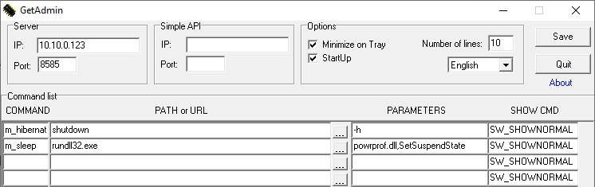

# ioBroker.windows-control

**Tests:** 

## Adapter to control Windows devices

This adapter provides controlling Microsoft Windows devices. It is required the tool GetAdmin being installed on every Windows device which you want to control.
 
<strong>Many thanks to [Vladimir Vilisov](https://blog.instalator.ru) for his tool GetAdmin!</strong> 

**Please note:** This adapter uses Sentry libraries to automatically report exceptions and code errors anonymously to the adapter developer(s). For further details and information on how to disable this error reporting see [Sentry-Plugin Documentation](https://github.com/ioBroker/plugin-sentry#plugin-sentry). Sentry reporting is used starting with js-controller 3.0.

## Tool GetAdmin

To use this adapter, it is required to run the tool GetAdmin (version 2.6) on each Windows device you want to control.
GetAdmin is a single exe file (776 kB). It was coded by Vladimir Vilisov in Delphi and published [on his Blog instalator.ru](https://blog.instalator.ru/archives/47).
Download:
 1. Primary source: https://blog.instalator.ru/archives/47
 2. If not available, you will find a copy on this adapter's Github site [in the folder "files"](https://github.com/Mic-M/ioBroker.windows-control/tree/master/files).

### Configuration

Place the `GetAdmin.exe` file in any folder of your Windows device. Execute the file and set the following:
1. Top left in the "Server" section:
    * IP: the IP address of your ioBroker server
    * Port: `8585` is the standard port. Usually, there is no need to change this port.
2. At the top in the "Options" section: Activate "Minimize on Tray" and "Startup" to autostart the program minimized to the system tray.
3. Confirm with "Save".

### Examples for individual entries in the GetAdmin.exe Command list:
* Hibernation (German: Ruhezustand): 
    * Column `Command`: enter `m_hibernate` or any other name of your choice (no spaces, please)
    * Column `PATH or URL`: `shutdown`
    * Column `PARAMETERS`: `-h`
* Standby (German: Energie sparen):
    * Column `Command`: enter `m_sleep` or any other name of your choice (no spaces, please)
    * Column `PATH or URL`: `rundll32.exe`
    * Column `PARAMETERS`: `powrprof.dll,SetSuspendState`

### Further Information
* ioBroker Forum:
    * [Adapter Windows Control](https://forum.iobroker.net/topic/31485/)
    * [Windows-Steuerung](https://forum.iobroker.net/topic/1570/windows-steuerung)
    * [Программа управления компьютером GetAdmin](https://forum.iobroker.net/topic/1505/)
* [Blog article](https://blog.instalator.ru/archives/47) of GetAdmin. Use Google translate, if you are not familiar with the Russian language.

## Changelog

### 0.1.5
* (Mic-M) Added [Sentry](https://github.com/ioBroker/plugin-sentry)

### 0.1.4
* (Mic-M) Updated lodash dependency from 4.17.15 to 4.17.19

### 0.1.3
* (Mic-M) Internal only: Correction to support compatibility with js-adapter 3.x, Use gulp for translations (which is resulting in files under admin/i18n/)

### 0.1.2
* (Mic-M) Several fixes.

### 0.1.1
* (Mic-M) Readme updated.

### 0.1.0
* (Mic-M) Add states "_processGetStatus" and "_processGetStatusResult" to check if a Windows process (like Chrome browser) is running or not

### 0.0.3
* (Mic-M) `io-package.json` fixed

### 0.0.2
* (Mic-M) Fixed sendkey issue
* (Mic-M) State _sendKey: provide all supported keys as dropdown and no longer as open text field.
* (Mic-M) Renamed states: sendKey -> _sendKey, connected -> _connection

### 0.0.1
* (Mic-M) Initial release

## License
MIT License

Copyright (c) 2020 Mic-M

Permission is hereby granted, free of charge, to any person obtaining a copy
of this software and associated documentation files (the "Software"), to deal
in the Software without restriction, including without limitation the rights
to use, copy, modify, merge, publish, distribute, sublicense, and/or sell
copies of the Software, and to permit persons to whom the Software is
furnished to do so, subject to the following conditions:

The above copyright notice and this permission notice shall be included in all
copies or substantial portions of the Software.

THE SOFTWARE IS PROVIDED "AS IS", WITHOUT WARRANTY OF ANY KIND, EXPRESS OR
IMPLIED, INCLUDING BUT NOT LIMITED TO THE WARRANTIES OF MERCHANTABILITY,
FITNESS FOR A PARTICULAR PURPOSE AND NONINFRINGEMENT. IN NO EVENT SHALL THE
AUTHORS OR COPYRIGHT HOLDERS BE LIABLE FOR ANY CLAIM, DAMAGES OR OTHER
LIABILITY, WHETHER IN AN ACTION OF CONTRACT, TORT OR OTHERWISE, ARISING FROM,
OUT OF OR IN CONNECTION WITH THE SOFTWARE OR THE USE OR OTHER DEALINGS IN THE
SOFTWARE.