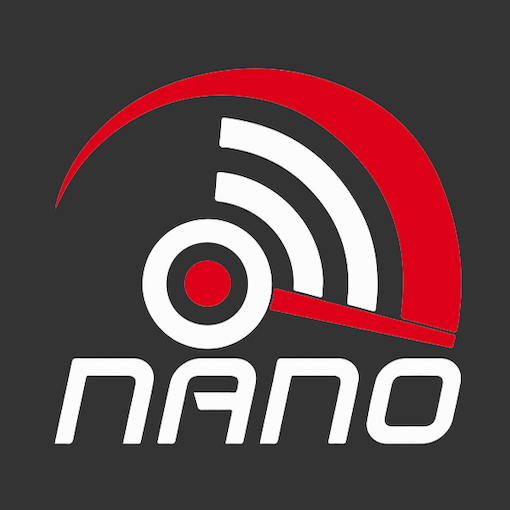

# ioBroker.wlanthermo-nano

  

**Tests:**: 

## wlanthermo-nano adapter for ioBroker

[WLANThermo Nano](https://github.com/WLANThermo-nano/WLANThermo_nano_Software/wiki "WLANThermo Nano"), the digital advantage for your barbecue sport

## Configuration

The adapter can be installed and configured within the admin interface.
Please enter IP-adress, username and password in the instance configuration.

Currenlty 1 device is supported, if you want to monitor a secode device please user en second instance.
(in future release mutliple devices by 1 adapter will be supported).

# Do not install from github for now, only by ioBroker admin ! (change in progress in repository)

## To-Do

* [ ] Optimize pitmaster settings, make states only writable in related modus otherwise read only
* [ ] allow multiple devices
* [ ] code cleanup

## Changelog

### 0.1.2  (in progress, not released !)
* (DutchmanNL) Support multiple devices

### 0.1.1
* (DutchmanNL) Code optimalisation
* (DutchmanNL) Implement state_attr.js to handle state options outside of source code
* (DutchmanNL) Optimised state creation in 1 function
* (DutchmanNL) Small cleanups

### 0.1.0
* (DutchmanNL) remove color settngs from pitmaster

### 0.0.9
* (DutchmanNL) optimize pid profile setting

### 0.0.8
* (DutchmanNL) fix post command for pitmaster

### 0.0.7
* (DutchmanNL) State unit fixes
* (DutchmanNL) start integration of pidmaster
* (DutchmanNL) rename  type  to modus for pitmaster

### 0.0.6
* (DutchmanNL) make type and alarm selectable with dropdown

### 0.0.5
* (DutchmanNL) add  capability to change sensors

### 0.0.4
* (DutchmanNL) Fix issue with password set
* (DutchmanNL) Implemented new states for config (reboot/update/checkupdate)
* (DutchmanNL) Change  configuration (way of ip-adress, also dyndns now supported)

### 0.0.3
* (DutchmanNL) implement secure storage of login credentials (required to enable setting changes later)

### 0.0.2
* (DutchmanNL) initial release

## License
MIT License

Copyright (c) 2019 DutchmanNL <rdrozda86@gmail.com>

Permission is hereby granted, free of charge, to any person obtaining a copy
of this software and associated documentation files (the "Software"), to deal
in the Software without restriction, including without limitation the rights
to use, copy, modify, merge, publish, distribute, sublicense, and/or sell
copies of the Software, and to permit persons to whom the Software is
furnished to do so, subject to the following conditions:

The above copyright notice and this permission notice shall be included in all
copies or substantial portions of the Software.

THE SOFTWARE IS PROVIDED "AS IS", WITHOUT WARRANTY OF ANY KIND, EXPRESS OR
IMPLIED, INCLUDING BUT NOT LIMITED TO THE WARRANTIES OF MERCHANTABILITY,
FITNESS FOR A PARTICULAR PURPOSE AND NONINFRINGEMENT. IN NO EVENT SHALL THE
AUTHORS OR COPYRIGHT HOLDERS BE LIABLE FOR ANY CLAIM, DAMAGES OR OTHER
LIABILITY, WHETHER IN AN ACTION OF CONTRACT, TORT OR OTHERWISE, ARISING FROM,
OUT OF OR IN CONNECTION WITH THE SOFTWARE OR THE USE OR OTHER DEALINGS IN THE
SOFTWARE.