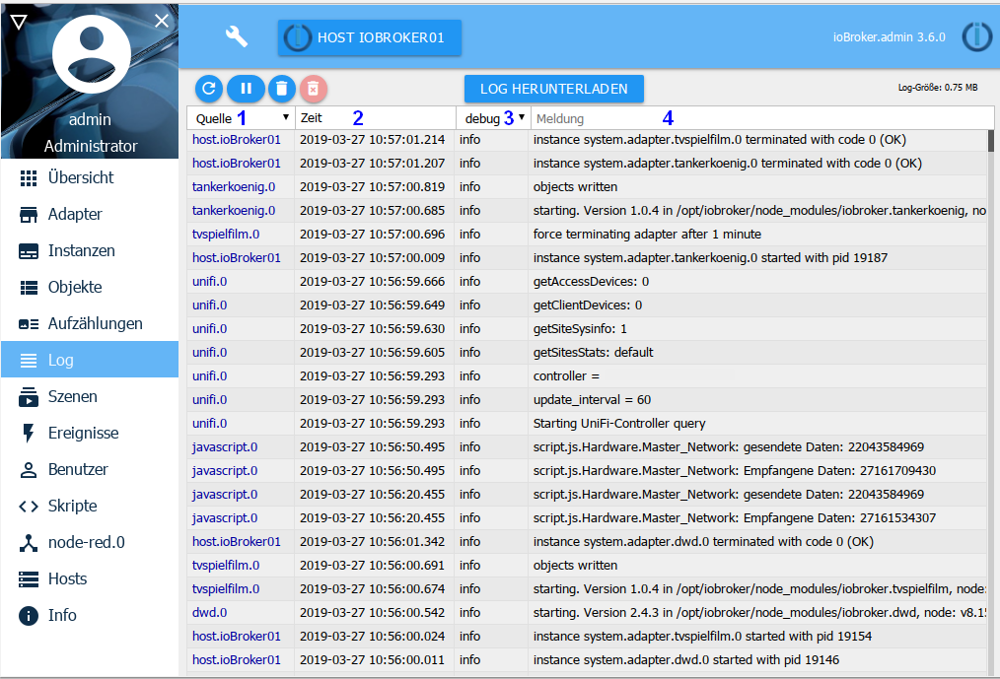

# The log page

Here the messages of the system are continuously output. The latest message is at the top.

## The title bar
The title bar contains icons for the most important processes. There is a context help for each icon. Just keep the mouse on the icon for a while.

### The icons in detail:
** 1.) Update log **

This button updates the list.

** 2.) Stop update **

By clicking on this button, the constant updating of the list is stopped.
Instead of the pause icon, the number of new messages that are not displayed now appears.

** 3.) Clear list **

By clicking on this icon, only the list on the screen will be deleted

** 4.) Clear log on host **

Clicking on this icon permanently deletes the entire log on the host.

** 5.) Download log ** With this button you can download a complete day log of the last days from the directory / opt / iobroker / logs:

You get the following screen: 

Since lines are often cut off in the log window, it is important to check if there is more information.

** 6.) Host List **

Only messages coming from the host set here will be displayed in the log. In multi-host environments, you can set the host to log here.

## The page content

On the page, the existing objects are tabulated.

The column headers 1 and 3 contain pulldown menus which serve as filter criteria, in column 4 a filter criterion can be freely entered

** 1.) Source **

With this pull-down menu the messages can be filtered according to the logging instance. In the menu, only the instances are displayed, to which there are also entries on the page.

** 2.) Time **

Here the timestamp of the message is listed. This column is not filterable.

** 3.) Displayed log level **

This menu is used to set the severity of the message. However, this is just a filter of the existing list.
In order to set logging for an instance at a certain level, this must be set on the Instances page.

Errors are displayed in red:

If there is an error on any host, the caption ***Log*** appears in red in the menu bar.

** 4.) Message **

In this column, the respective message is displayed, as far as it fits into the column.
The rest is cut off. With mouse-over you can still see the whole message.
To post in the forum please download the log and copy the message out there.