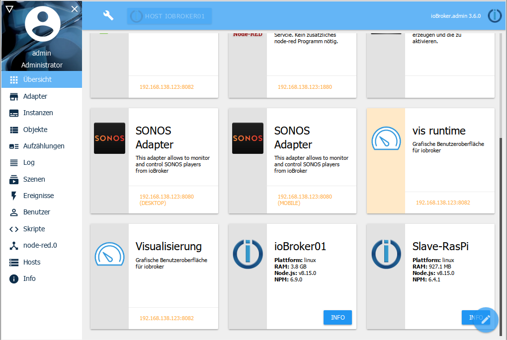
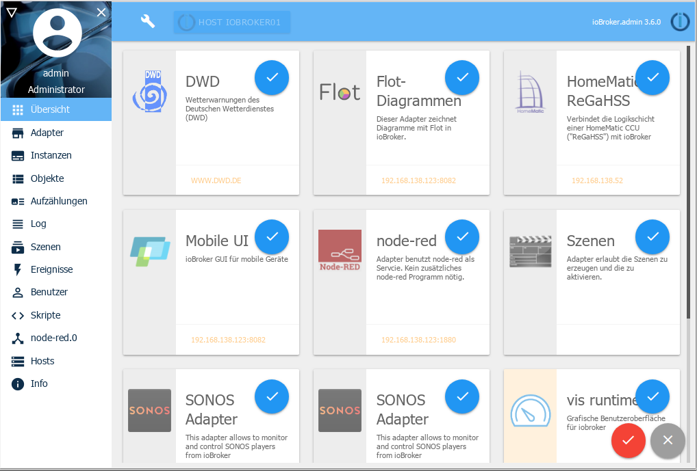

# The overview window
?> ***This is a wildcard*** .    Help with ioBroker and extend this article. Please note the [ioBroker style guide](community/styleguidedoc), so that the changes can be adopted more easily. ---

# The tab overview
Information about all adapters with their own web interface and the hosts is displayed here.

If you click on a tile, you will be redirected to the corresponding website whose address is located at the bottom of the tile.

At the very end, there is one tile left for each host in the system. For standalone installations this is **the** ioBroker server, for multihost installations this is the master and the slaves.

If you click on the information button on such a tile further information about the respective host appears:

The content of this tab can be customized according to your own wishes. To do this, click on the pencil icon on the bottom right:

unwanted tiles can then be ticked off. Then confirm the selection with the hook icon or cancel with the X.