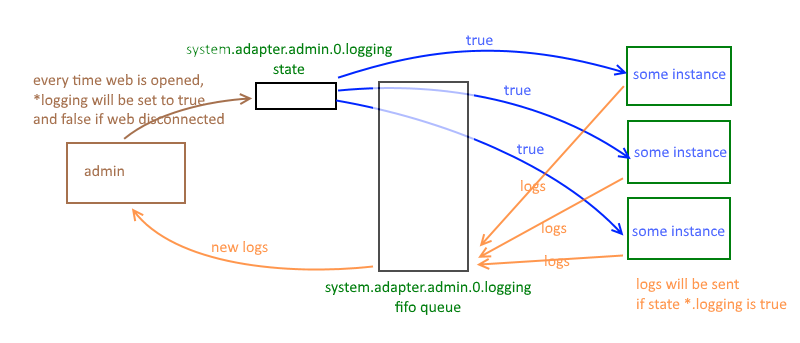

## Log Transporter

If you want to subscribe to certain or all logs of ioBroker adapters, you can use **logTransporter**. To activate in your adapter, add `"logTransporter": true` to the common structure of your `io-package.json`.
<br><br>
In your adapter code (like in the `main.js` file), you will then need to call `requireLog(true)` to activate. 
Once requireLog() is set to true, you can use `on('log', callback)` to subscribe to all new logs coming in from adapters. The callback function returns all logs with the following object (example):
```
{from:'testlog.0', message: 'testlog.0 (12504) adapter disabled', severity: 'error', ts:1585413238439}
```

Full example from a `main.js`:
```
    adapter.requireLog(true);
    adapter.on('log', function(logObject) {
        // Here we have the log in "logObject" and can handle it accordingly.
        const severity = logObject.severity; // the log level (severity): info, warn, error, etc.
        // ....
});
```

## Background information 

There is a special type of adapters, that consume logs. Normally all adapters write their messages into the log file with logger.
But some adapters must to show logs or to store them something else.

To create such a type of adapter it must have **logTransporter** flag in common structure.

If such a flag is present, the adapter.js creates automatically the special state for it - "system.adapter.adapterName.X.logging".
This variable must be set by logTransport adapter to true, when this adapter wants to receive logs.

"system.adapter.adapterName.X.logging" is fifo queue of redis type list.

Other adapters monitor all variables "*.logging" and write into according lists the log messages. 
The list is limited by 1000 messages (by default).

The logTransport instance receives the event "log" with message. 

To control "system.adapter.adapterName.X.logging" state the adapter must use *requireLog* function. 
E.g. ```adapter.requireLog(true);``` to enable receiving of logs.



The functionality is implemented in *adapter.js* and the developer should just set the common flag *logTransporter*
 and call *requireLog()*. 
 
The functionality for non-logTransport adapters is implemented in *adapter.js* and the developer must not care about it.
