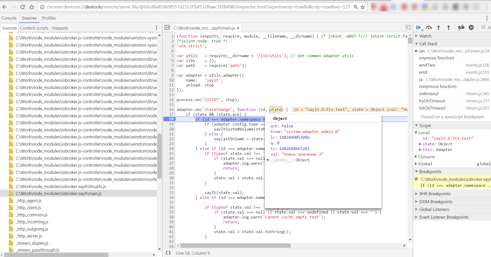

# Debugging adapters
Debug adapter with Chrome
Node.JS supports debugging with Chrome.

If you stop an adapter in the ioBroker and then start it from the console:

```
cd /opt/iobroker
iobroker stop sayit
node --inspect node_modules/iobroker.sayit/main.js --debug
```

Important is `-–inspect`

Then something like this is output:

```
Debugger listening on port 9229.
Warning: This is an experimental feature and could change at any time.
To start debugging, open the following URL in Chrome:
    chrome-devtools://devtools/remote/serve_file/@60cd6e859b9f557d2312f5bf532f6aec5f284980/inspector.html?experiments=true&v8only=true&ws=127.0.0.1:9229/9415dda6-0825-40ed-855c-83c6142e56e9
2016-12-27 15:23:02.637  - error: sayit.0 adapter disabled
starting. Version 1.3.1 in /opt/iobroker/node_modules/iobroker.sayit, node: v6.9.2
2016-12-27 15:23:02.647  - info: sayit.0 starting. Version 1.3.1 in /opt/iobroker/node_modules/iobroker.sayit, node: v6.9.2
Debugger attached.
```

Then you can debug with Chrome if you enter the output link in Chrome:



*Tested: Windows, Chrome 55, node.js 6.9.2*

### Remote debugging with Chrome
If iobroker does not run on the same computer as chrome, then the command is based on the example above:

```
node --inspect-brk=0.0.0.0:9229 node_modules/iobroker.sayit/main.js --debug
```

the parameter `--inspect-brk` ensures compared to above,

a breakpoint is set on the first line of your adapter right at the start of the debugger.

If you don't always want to copy the link to start the debug individually, you can also go to the following page in chrome:

```
chrome://inspect
```

then enter the IP address and port of your **ioBroker computer** just once via configure, just like with the inspect command.

The debug session is then displayed there after the command is started and can be started with a click.

The chrome debug options are fantastic.
You have all the options that you also know from **web debugging** breakpoints, also with conditions, watch, call stack, scope inspection, console output, etc.

Pictures and English description is located in [here](https://software.intel.com/en-us/xdk/articles/using-chrome-devtools-to-debug-your-remote-iot-nodejs-application)

If not already installed, the node inspector is still required on the iobroker computer:

```
npm install -g node-inspector
```

## Debugging with WebStorm
## Debugging with `Visual Studio Code`
If you open a directory with `VS Code`, then after opening an adapter directory (`File=>Open folder...` menu), you can then debug an adapter.

The configuration in the `.vscode/launch.js` file should look like this:

```
{
    "version": "0.2.0",
    "configurations": [
        {
            "type": "node",
            "request": "launch",
            "name": "Launch Program",
            "program": "${workspaceFolder}\\main.js",
            "args": ["--debug"]
        },
        {
            "name": "Attach to Process",
            "type": "node",
            "request": "attach",
            "address": "IO_BROKER_IP_ADDRESS",
            "port": 9229
          }
    ]
}
```

### Local debugging
After the adapter is stopped (`iobroker stop ADAPTER_NAME`), you can start the adapter in the VS code: 

After selecting `Launch Program` and clicking the `Play` button, the adapter is started and you can debug locally.

### Remote debugging
For this you should start the adapter on the ioBroker server specifically.

```
d /opt/iobroker
obroker stop ADAPTERNAME
ode --inspect-brk=0.0.0.0:9229 node_modules/iobroker.ADAPTERNAME/main.js --debug
```

Then you can connect `VS Code` to the process (`attach`).

