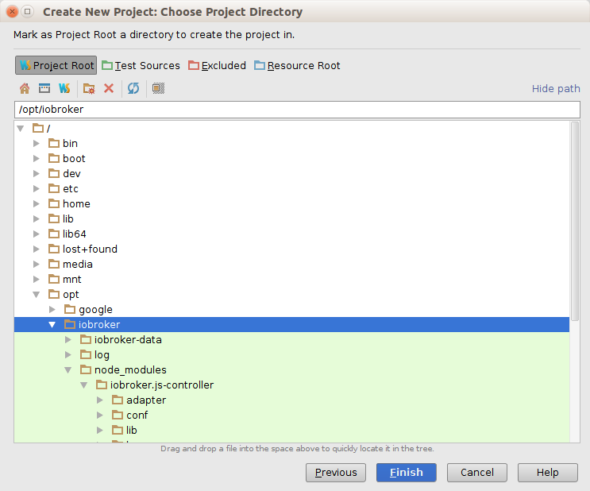

# WebStorm
On this page we will show how to install and setup an ioBroker development environment.
WebStorm is used for the main development, maybe Nodeclipse is an alternative IDE.
This documentation is like a "cook book" but without explanation about Javascript, NodeJS, HTML5 etc.

Feel free to extend the following information.

## Download and install WebStorm on Ubuntu 14.04
Goto the the Webpage from [jetBrains](https://www.jetbrains.com/webstorm/download/) and download WebStorm for your OS. We will focus on Ubuntu 14.04.
Go to the download directory and move the file to /opt directory with "mv WebStorm-9.0.3.tar.gz /opt/". Unzip/untar it "tar xvzf WebStorm-9.0.3.tar.gz. Open the  "WebStorm-139.1112/bin" and type "./webstorm.sh". Maybe you have to install the Java JDK...

### Install Java JDK
**This step does not required on Windows**

```
sudo apt-add-repository ppa:webupd8team/java
sudo apt-get update
sudo apt-get install oracle-java8-installer
```

### Install NodeJS

1. `sudo apt-get install nodejs` (don't do a ```sudo apt-get install node``` because node is not nodejs)
2. Create an alias "node" with the help of ```sudo ln -s /usr/bin/nodejs /usr/bin/node```

## Download of the newest ioBroker Sources and import into a WebStorm Project

1. Open a terminal and go to the /opt directory.
2. Create a new directory with "mkdir iobroker" and then execute "cd iobroker"
3. Install iobroker with "npm install iobroker"
4. Test it with "cd  node_modules/iobroker.js-controller/" and type "chmod +x iobroker" and later "node controller.js"
5. Open your Browser with "http://localhost:8081" you should see the ioBroker welcome screen.

  

6. Go to the terminal window and type `ctrl + c` to interrupt ioBroker

## Config WebStorm to run and debug the ioBroker

1. Open WebStorm with `./webstorm.sh`
2. Click `File->"New Project from existing files...`
3. Select the following...

  

4. Choose your ioBroker directory... (right mouse click on directory to set the project root)

   

5. Your new WebStorm- project should look like this...

  

### Create the "Run Configuration" ioBroker

1. Go to Run->"Edit Configuration..."


2. Select the "+" and add a NodeJS Config like on the picture below...


## How to start ioBroker from WebStorm

1. Start ioBroker with selecting...
    

2. You may ask yourself how to stop ioBroker? Open a Terminal inside WebStorm and type ...
    


## How to debug an ioBroker Adapter
In this chapter we will see how to debug a ioBroker Adapter like "iobroker.hmm".
First start ioBroker like mentioned before, please don't use the "debug mode". Use for ioBroker only the "run mode".
Install an Adapter like ioBroker.hmm from the commandline like this 


Configure the WebStorm "Debug settings" ...


Goto to the ioBroker Webpage http://localhost:8081 and install the iobroker.hmm Adapter:


After installing the adapter we have to disable the adapter instance...


...next


...at the end you should see this result:


Now back to WebStorm let us open the hmm.js file and set a breakpoint like this one:


Start bebugging the iobroker.hmm adapter:


When you stop at the first breakpoint you can control the next steps with 1) resume the program 2) step over:
