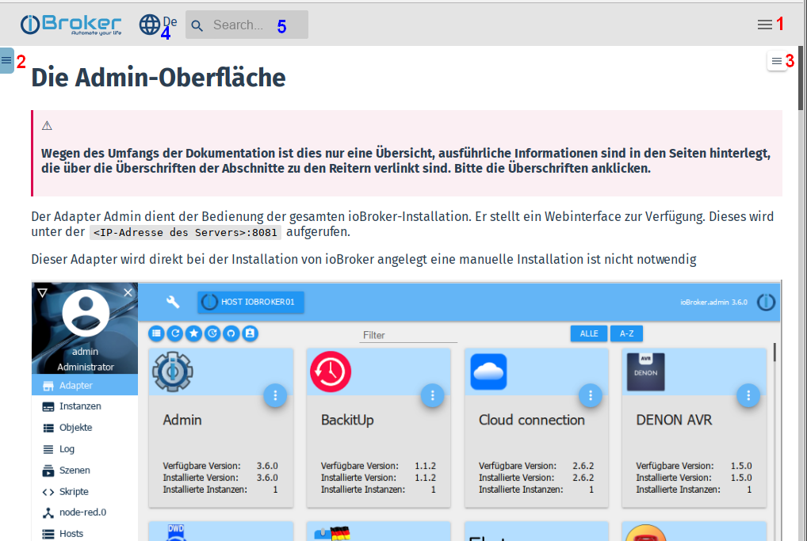

** This documentation is the central reference for all ioBroker users: **

# Use of the document
## Page structure
This page was created in a ***responsive design*** . This means that it will be displayed differently depending on the resolution of the reader (PC / tablet / mobile phone) for optimal readability.

Thus, at low (effective) resolutions, some controls are also hidden to make room for the main windows.

Therefore, it may well be that the current presentation differs from the screenshots.

### Different menus
To get the best possible overview, there are three different menus:

** 1.) Main Menu **

The main items of this menu are usually visible on the PC in the title bar of the page, the entire menu is hidden at low resolutions. Then it has to be opened by clicking on the burger icon:

After clicking on a menu item, the menu automatically closes to make more space for the content.

** 2.) Document Menu ** This menu is usually visible on the PC, but disappears at low resolutions. Then it has to be opened by clicking on the burger icon:

The top line contains a filter field. By entering a term, the entire menu tree is filtered by this term and only matching menu items are displayed.

Via the icon with the arrow, the menu can be hidden again to make more space for the content.

** 3.) Theme Menu **

In this menu the main topics of the selected article are displayed in order to be able to navigate faster to a searched point.

Via the icon with the **X** the menu can be hidden again.

### Other controls
** 4.) Language selection **

The website is multilingual. Gradually more languages will be added.
Some are automatically generated first, native speakers are invited to improve the lyrics.

The desired language can be selected on the globe icon.

This language list will be expanded if necessary.

** 5.) Search **

This field needs no explanation. Please use extensively!

---

* For beginners we recommend to read some basics about ioBroker first.

For more see chapter [introduction](#Einführung).

* On the [Download] (../../ download) page there are prepared images for different systems.

There are also detailed installation instructions for some hardware platforms.

* For all adapters, refer to the central [Adapter Reference] [../../ adapters].
* The creation of control rules is described in the section [Logic] [../ logic].

We are grateful for every helping hand. If you would like to further develop ioBroker, you will find information in [Developer section] [].

This documentation is constantly being expanded. If you think something is missing or better described, [help us] [] improve the documentation!