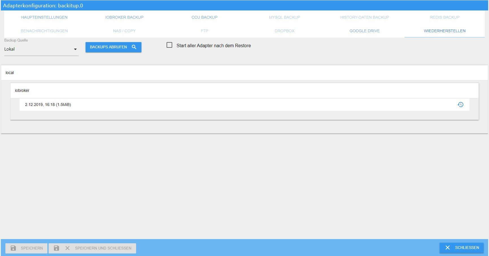
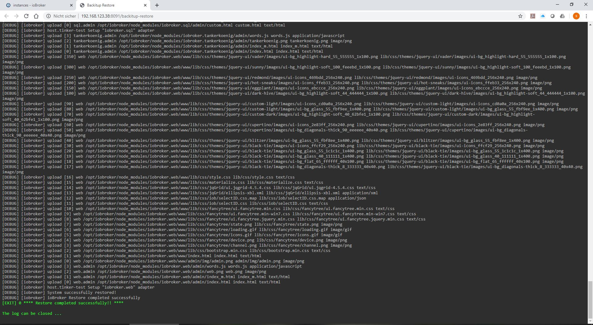

# Basics
How do you correctly restore the ioBroker installation on a Linux system?

### Preface:
Since some users find it very difficult to restore, step-by-step instructions for restoring after a crash, or after a hardware change, system change, or something else should help.

Basically, one can say one thing in advance: a restore can be done in a few minutes if executed correctly and nobody needs to be afraid of it.

In the end, all data is available again and a new system was set up.

### Preparation:
An executable ioBroker installation is essential for the preparation.

There are 2 ways to do this.
Either take a finished image from [Download area](https://www.iobroker.net/#de/download), set up your own Linux OS and install ioBroker according to this [manual](https://www.iobroker.net/#de/documentation/install/linux.md).

### Next Step
If the old system had saved the states and / or objects in Redis, the new system must first be equipped with the Redis server.

If you are not sure whether Redis was used and there is still access to the old system, then use the command `iobroker status` to get the required information. "When using Redis, the output looks like this:

```
iobroker is running on this host.

At least one iobroker host is running.

Objects type: redis
States  type: redis
```

If "redis" is written in Objects type and / or States type, you must install the Redis server on the new system.
If both types say "file", the Redis server is not required.

If you no longer have access to the old system and you don't know what exactly was configured before, then you should definitely install the Redis server in advance.

#### Redis installed:
To do this, go to the terminal by putty and execute the following commands:

```
sudo apt-get update
sudo apt-get install redis-server
sudo usermod -a -G redis iobroker
sudo reboot now
```

The next thing to do is to run the Installer Fix if you don't have all the rights on the system.
This step is only a recommendation and is not absolutely necessary.

```
curl -sL https://iobroker.net/fix.sh | bash –
```

With the small tool "htop" you can see all running processes very well, which is not only interesting for the restore but also very useful in general.
this is installed as follows:

Run the following command in the console:

```
sudo apt-get install htop
```

After this has been done, the actual restore can take place.

### Restore:
There are also 2 options:

#### **1. Automatic restore with backup **
Since no Linux knowledge is required here, and the whole thing is done via the Iobroker web interface, the variant of the automatic restore using [Backitup](https://github.com/simatec/ioBroker.backitup/blob/master/README.md) takes place first.

The adapter Backitup must be installed for this.
This is done via the "Adapter" tab. Search for Backitup there and install an instance using the (+).

Once the installation is complete, you save the "ioBroker backup" created previously by the old system on your new system with an sftp program such as FileZilla or WinSCP in the path / opt / iobroker / backups.

Backitup can also perform a restore from the NAS, Dropbox or Google Drive, but the local variant has the fewest possibilities for problems.

If you already have experience with mounting the NAS, this can also be used, especially since you can then directly access the existing directory of the old installation.
However, this tutorial refers to a locally stored backup.

If ioBroker Backup has been successfully saved, Backup is now opened and the "Restore" tab is opened.
There set the "backup source" to local and then save.


If ALL instances are to start automatically after the restore, the option “Start all adapters after the restore” must be activated and then saved.
If the backup is to be restored on another host, this option should not be used, as the IP addresses may have to be adjusted before starting the individual instances.

After saving, the existing backups can be called up on the local path using the "Retrieve backups" button.

The backup you just copied via FTP should appear in the list under “iobroker”.
Select this now.



After the selection there is a message that iobroker will be stopped for the restore and then restarted.


Here you started the actual recovery process.


Another tab will now open in your browser, in which you can follow the recovery process in the Backitup WebUI, just like on the console.


After the restoration has been successfully completed, you will also receive the message in the Restore's WebUi.



The recovery may take some time depending on the performance of the system and the size of the old ioBroker installation.
Normally the restore should be done after approx. 10-15 minutes and ioBroker should be started again automatically.


In very rare cases ioBroker does not start automatically after a restore.
If this is the case, you can start the iobroker manually with the following command via the console.

```
iobroker start
```

Now ioBroker should start again and the “Log” tab shows that all adapters that were installed on the old system are currently being reinstalled by the npm.

Here you have to be patient and just let iobroker do it.
In the instances you can see which adapters are gradually installed.
All adapters that are still being installed or on hold do not yet have an icon in the instances.
Please do not restart ioBroker, at most update the view with F5 every now and then until all instances are provided with an icon.

Depending on the size of the installation and the speed of your computer and the Internet connection, this can easily take 2-3 hours.

Congratulations, the newly installed system is now complete with all settings, scripts, visualizations, etc.

With Backitup there is now the possibility to restore further data, if this was backed up on the old system beforehand.
You can restore the Redis database, the Zigbee database, the mySql database and your history data with the same steps as described above.

The list of retrieved backups would then look like the example here.


*****************************************************************************************************************************************

#### **2. manual restore with the terminal commands**
First, a few commands have to be sent via Putty or something similar.

First a backup folder has to be created:

```
sudo mkdir /opt/iobroker/backups
```

Here, too, a sftp program such as FileZilla or WinSCP the backup created on the old system and possibly also Redis backup, zigbee backup etc.
in the folder / opt / iobroker / backups.

If states and objects were saved in the Redis DB, the saved Redis database should be restored here first.
If only the states were under Redis, this does not necessarily have to be in advance.

Once this is done, you stop your ioBroker as follows:

```
iobroker stop
```

Then please check whether everything has stopped with the following commands:

```
iobroker status
```

If all outputs are correct and iobroker has been stopped, the restore can now be carried out via the console with the following commands:

```
cd /opt/iobroker
iobroker restore <Dateiname eures Backups>
```

!> **It is very important that only one ioBroker backup can be restored using this method.
A Redis backup, Zigbee backup, mySql backup, or the history data cannot be created with this command**

Backitup is required for this, as these were specially created with Backitup.

This can now take a few minutes, depending on your system. The progress is displayed in the terminal.
When the restore is complete, restart ioBroker with the following command:

```
iobroker start
```

Here, too, all adapters are now reinstalled individually by ioBroker via npm.
This may take a while, depending on the size of your installation, internet speed, and system performance.
The current status can be tracked in the "Log" tab.

Now it is done and the system is reinstalled and all settings, scripts, visualizations, etc. restored.

### Conclusion:
Basically, both variants lead to the same result.
If you have little experience with terminal commands and feel unsafe, you are on the safe side with Backitup.

However, if you want to see exactly what is happening on your system, you should choose the manual variant via the console. Here you can see every single process in detail in the terminal.