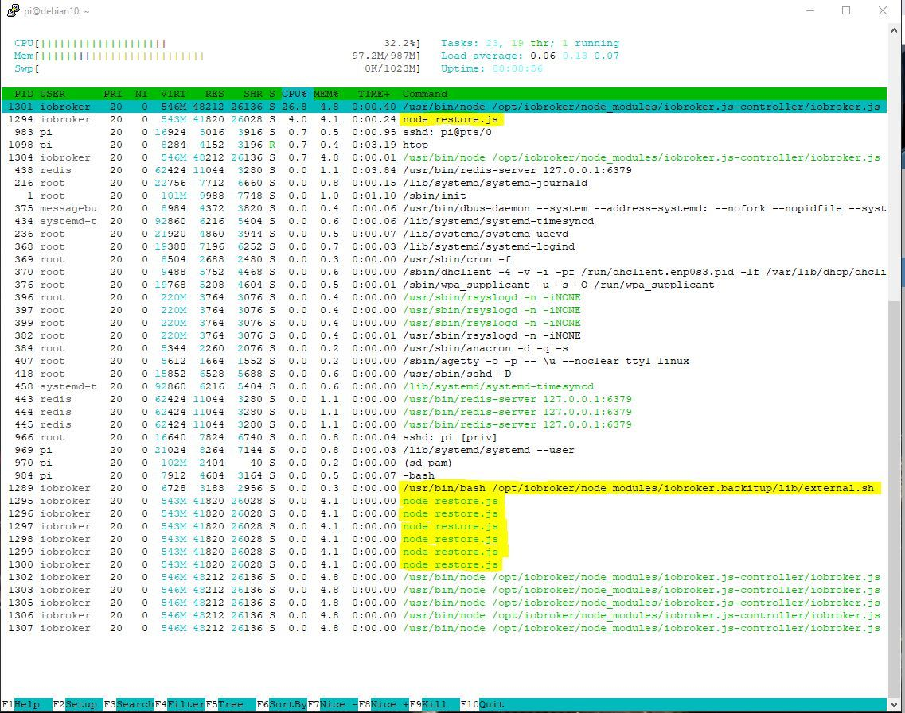

# Basics
How to properly restore ioBroker installation on a Linux system?

### Foreword:
Since some users with a Restore do very hard, here is a step by step instructions for the restore after a crash, or even after a hardware change, system change or other help.

In principle, one can say one thing in advance: a restore is done with the right execution in a few minutes and nobody needs to be afraid.

At the end, all data is available again and a new system has been set up.

### Preparation:
An executable ioBroker installation is absolutely necessary for the preparation.

To get this done, there are 2 ways.
Either take a finished image from [download area](https://www.iobroker.net/#de/download), set up your own Linux OS and install ioBroker after this [manual](https://www.iobroker.net/#de/documentation/install/linux.md).

### Next Step
If the old system had stored the states and / or objects in Redis, the new system must first be equipped with the Redis server.

If it is not sure if Redis has been used and still has access to the old system, then retrieve the required information with the command `iobroker status` "The output looks like this when using Redis:

```
iobroker is running on this host.

At least one iobroker host is running.

Objects type: redis
States  type: redis
```

If objects type and / or states type "redis", you must install the Redis server on the new system.
If both types are "file", then the Redis server is not needed.

If you no longer have access to the old system and you do not know what was previously configured, then install in any case the Redis server in advance.

#### Redis installed:
To go through the Putty in the terminal and execute the following commands:

```
sudo apt-get update
sudo apt-get install redis-server
sudo usermod -a -G redis iobroker
sudo reboot now
```

Next you should run through the installer fix times, if somewhere not all rights should fit on the system.
This step is only a recommendation and is not mandatory.

```
curl -sL https://iobroker.net/fix.sh | bash –
```

With the small tool "htop" you can see very well all running processes, which not only for the restore interesting but generally very useful.
this will be installed as follows:

In the console, run the following command:

```
sudo apt-get install htop
```

After this is done, it may come to the actual restore.

### Restore:
There are also 2 options:

#### **1. Automatic Restore with Backitup **
Since no Linux knowledge is required here, and the whole thing via the web interface of Iobroker is first the variant of the automatic restore using [backitup](https://github.com/simatec/ioBroker.backitup/blob/master/README.md).

To do this, the adapter Backitup must be installed.
This is done via the tab "Adapter". There look for Backitup and over the (+) install an instance.

When the installation is complete, you put your previously created from the old system "ioBroker Backup" on your new system with a sftp program such as FileZilla or WinSCP in the path / opt / iobroker / backups.

Backitup can also perform a restore from the NAS, Dropbox, or Google Drive, but the local variant has the least chance of problems.

If you already have experience with mounting from the NAS, this can also be used gladly, especially since then you can directly access the existing directory of the old installation.
However, this tutorial refers to a locally saved backup.

If ioBroker Backup was successfully saved, Backitup will now be opened and the "Restore" tab will open.
There, set the "Backup Source" to Local and save afterwards.


If ALL instances are to start automatically after the restore, the option "Start all adapters after the restore" has to be activated and saved afterwards.
If the backup is restored to another host, this option should not be used, as the IP addresses may need to be adjusted before starting each instance.

After saving, you can use the "Get backups" button to retrieve the existing backups on the local path.

The backup just copied via FTP should appear in the list under "iobroker".
Select this now.


After the selection, there is an indication that iobroker is stopped for the restore and then restarted.


Here you have started the actual recovery process.


This may take some time, depending on the performance of the system and the size of the old ioBroker installation.
Normally, the restore should be done after about 10-15 minutes and ioBroker restarted.


If the ad does not change, update the browser window from time to time with F5.

In very rare cases, ioBroker does not start automatically after Restore.
If this is the case or not sure if the restore is still running, you can use the installed htop tool to see if the restore is still running or already finished.
Just type ```htop``` in the terminal. The output should look something like this.



In the processes that can be displayed by htop **none** of the processes marked in the image are no longer available.
If this is the case, then stop htop with "F10" and execute the following command via the terminal.

```
iobroker start
```

Now ioBroker should start again and in the tab "Log" you can see that all the adapters that were installed on the old system are being re-installed by npm.

Here a little patience must be applied now and let iobroker simply make.
In the instances you can see which adapters are installed so gradually.
All adapters that are still in the installation or in the waiting loop do not have an icon in the instances yet.
Please do not restart ioBroker, at most occasionally update the view with F5 until all instances have an icon.

Depending on the size of the installation and speed of your computer and the Internet connection, this can easily take 2-3 hours.

Congratulations, now the newly installed system is done with all settings, scripts, visualizations, etc.

With Backitup there is still the possibility to restore further data, if it has been saved on the old system in advance.
You can restore the Redis database, the Zigbee database, the mySql database, and your history data using the same steps described above.

The list of retrieved backups would then look like this example.


*****************************************************************************************************************************************

#### **2. manual restore with the terminal commands**
First of all, a few commands have to be sent via Putty or something similar.

First, a backup folder must be created:

```
sudo mkdir /opt/iobroker/backups
```

Again, this will be followed by a sftp program such as FileZilla or WinSCP the backup created on the old system and possibly also Redis backup, zigbee backup etc.
stored in the folder / opt / iobroker / backups.

If states and objects were stored in the Redis DB, the backed up Redis database should be restored first.
If only the states ran under Redis, this need not necessarily be in advance.

Once this is done, you will stop your ioBroker as follows:

```
iobroker stop
```

Afterwards please check if everything is stopped with the following commands:

```
iobroker status
```

If all issues are correct and iobroker has been stopped, the following commands can be used to restore the console:

```
cd /opt/iobroker
iobroker restore <Dateiname eures Backups>
```

!> **However, it is very important that only an ioBroker backup can be restored with this method.
A Redis backup, Zigbee backup, mySql backup, or history data can not be created with this command**

Backitup is required for this because they were created specifically with Backitup.

This can now take a few minutes, depending on the system. The progress is displayed in the terminal.
When the restore is complete restart the following command ioBroker:

```
iobroker start
```

Again, all adapters will be reinstalled individually by ioBroker over npm.
This may take a while, depending on the size of your installation, the Internet speed, and the performance of the system.
The current status can be tracked in the "Log" tab.

Now it is done and the system is reinstalled and all settings, scripts, visualizations etc. are restored.

### Conclusion:
Basically, both variants lead to the same result.
If you have little experience with terminal commands and feel insecure, then you're on the safe side with Backitup.

However, if you want to see exactly what is happening on your system, you should choose the manual version via the console. Here you can see every single process in detail in the terminal.