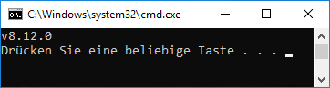
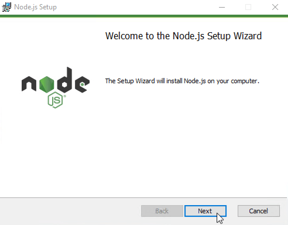

# Installation von ioBroker unter Windows

?> ***Dieser Artikel wird gerade erweitert***. 
     
   Hilf unserer ioBroker Community.  
   Bitte beachte den [ioBroker Style Guide](appendix/style_guide), 
   damit die Änderungen einfacher übernommen werden können.

Die folgende Anleitung führt schrittweise durch die Installation. Bitte keine Schritte
überspringen, da einige Befehle aufeinander aufbauen.

## 1. Voraussetzungen

!> Zuerst prüfen, ob das System alle notwendigen [Installationsvoraussetzungen]() 
erfüllt.

Für die Ausführung von ioBroker wird Node.js benötigt. Im Folgenden wird davon ausgegangen, 
dass auf dem PC weder Node.js noch ioBroker installiert ist. Ist ioBroker bereits installiert, 
bitte mit dem Abschnitt [Update]() fortfahren.

Um zu erkennen, ob Node.js installiert ist, wird mit der Tastenkombination 
<kbd>&#x229e; Windows</kbd> + <kbd>r</kbd> der `Ausführen`-Dialog geöffnet und 
dann dort der Befehl 
~~~
cmd.exe /C node -v & pause
~~~
eingegeben. Nach dem Bestätigen des Befehls erscheint ein Fenster.

  
*Node.js-Prüfung*

Es wird entweder eine Fehlermeldung oder die installierte Node.js-Version angezeigt. 

Wenn eine Node.js-Versionsnummer ausgegeben wird, ist zuerst zu prüfen, ob diese noch den
[Installationsvoraussetzungen]() entspricht. 

Lautet die Fehlermeldung 
`Der Befehl "node" ist entweder falsch geschrieben oder konnte nicht gefunden werden.`,
dann ist node.js nicht installiert und die Installation 
[kann direkt beginnen](#nodeinst).

## 2. Schnellstart

?> Diese Zusammenfassung der Installationsschritte ist für erfahrene ioBroker-Anwender
gedacht, die ioBroker schon mehrmals installiert haben. 

Einsteiger sollten der [detaillierten Anleitung](#nodeinst) folgen. 

* Node.js LTS-Version passend zur Windows-Variante (32-/64Bit) von [https://nodejs.org/en/download] 
   herunterladen und mit Standardeinstellungen installieren
* Kommandozeile `cmd.exe` als Administrator öffnen und die folgenden Kommandos der Reihe nach
  ausführen:
  ~~~cmd
  npm install --global windows-build-tools
  md C:\iobroker
  cd /d C:\iobroker
  npm install https://github.com/ioBroker/ioBroker/tarball/master
  npm install --production
  iobroker status  
  ~~~

## 3. Installation von Node.js

?> Es wird empfohlen, Node.js von dem Rechner aus herunterzuladen, auf dem es installiert 
   werden soll. Die Downloadwebseite von Node.js berücksichtigt automatisch, ob Windows
   als 32- oder 64Bit-Variante vorliegt.

1. Von der Webseite
   [https://nodejs.org/en/download](https://nodejs.org/en/download/) die aktuelle LTS Version 
   von Node.js herunterladen.

     
   *Download von Node.js*

1. Das heruntergeladene Node.js-Installationsprogramm mit einem Doppelklick starten. 
  
 ?> In der Regel steht das Programm im Ordner `Downloads` und folgt dem Namensschema
   `node-<Version>.msi`.  
     
1. Falls eine Meldung erscheint, dass die App keine überprüfte App aus dem Microsoft Store ist, 
   `Trotzdem installieren` auswählen.

1. Node.js mit den Standardeinstellungen installieren. Den Installationspfad nicht ändern. 
   Eventuelle erscheinende Sicherheitsabfragen bestätigen.
   
     
   *Node.js Installation*

## 3. Installation von ioBroker

?> ioBroker kann in einen frei wählbaren Ordner auf der lokalen Festplatte installiert
   werden. Wenn der Installationspfad Leerzeichen enthält, muss die vollständige 
   Pfadangabe bei allen Befehlen mit Anführungszeichen umschlossen werden.  
   Beispielbefehl: `dir "C:\ioBroker Testsystem"`.  

?> Der Standardinstallationsordner für ioBroker ist `C:\iobroker`.

1. Ein Kommandozeilenfenster als Administrator öffnen. Dazu mit der Tastenkombination
   <kbd>&#x229e; Windows</kbd> + <kbd>r</kbd> den `Ausführen`-Dialog öffnen und dort 
   den Befehl 
   ~~~cmd
   cmd
   ~~~
   eingeben. 
   
   Da das Kommandozeilenfenster als Administrator geöffnet werden muss, bitte die 
   Eingabe **nicht** mit `OK` sondern mit der Tastenkombination `Strg` + `Umschalt` +
   `Eingabetaste` abschließen. Es erfolgt eine Sicherheitsabfrage, die mit `Ja` oder
   der Eingabe des Administratorkennworts zu bestätigen ist.
   
 !> Die Titelzeile im schwarzen Kommandozeilenfenster, dass sich jetzt geöffnet hat, 
   muss mit dem Wort `Administrator:` beginnen. 

 ?> Manche ioBroker-Adapter enthalten Komponenten, die für Windows kompiliert 
   werden müssen. Deshalb werden vor der Installation von ioBroker die sogenannten 
   `windows-build-tools` installiert. Mehr Informationen zu den `windows-build-tools`
   sind [hier zu finden](https://github.com/felixrieseberg/windows-build-tools).

1. Die `windows-build-tools` werden mit dem folgenden Kommando installiert:
   ~~~cmd
   npm install --global windows-build-tools
   ~~~

1. Dann im Kommandozeilenfenster den Befehl zum Anlegen des Installationsordners
   ausführen:
   ~~~cmd
   md C:\iobroker
   ~~~

4. Jetzt kann das eigentliche ioBroker-Installationspaket installiert werden:
   ~~~cmd
   cd /d C:\iobroker
   npm install https://github.com/ioBroker/ioBroker/tarball/master
   ~~~

   Das Ergebnis sollte so aussehen:
   ~~~
   [...]
   ╭───────────────────────────────────────────────────────╮
   │ The iobroker files have been downloaded successfully. │
   │ To complete the installation, you need to run         │
   │                                                       │
   │                  npm i --production                   │
   │                                                       │
   ╰───────────────────────────────────────────────────────╯
   
   npm notice created a lockfile as package-lock.json. You should commit this file.
   npm WARN enoent ENOENT: no such file or directory, open 'C:\iobroker\package.json'
   npm WARN iobroker No description
   npm WARN iobroker No repository field.
   npm WARN iobroker No README data
   npm WARN iobroker No license field.

   + iobroker@1.3.0
   added 51 packages from 28 contributors and audited 83 packages in 6.937s
   found 0 vulnerabilities
   ~~~

1. Die ioBroker Installation wird mit den folgenden Befehlen abgeschlossen:
   ~~~cmd
   cd /d C:\iobroker
   npm install --production
   ~~~
   Der Installationsvorgang kann etwas dauern. Es können bei der Ausführung
   von npm einge rote Fehlermeldungen (gyp !ERR) im Zusammenhang mit
   dem Modul `unix-dgram` erscheinen. Diese Fehlermeldungen können
   ignoriert werden.

   Die letzten Zeilen der Installation sollten in etwa wie folgt enden:
   ~~~
   [...]
   Write "iobroker start" to start the ioBroker
   npm install node-windows@0.1.14 --production --save --prefix "C:/iobroker"
   ioBroker service installed. Write "serviceIoBroker start" to start the service and go to http://localhost:8081 to open the admin UI.
   To see the outputs do not start the service, but write "node node_modules/iobroker.js-controller/controller"
   npm WARN optional SKIPPING OPTIONAL DEPENDENCY: unix-dgram@0.2.3 (node_modules\unix-dgram):
   npm WARN optional SKIPPING OPTIONAL DEPENDENCY: unix-dgram@0.2.3 install: `node-gyp rebuild`
   npm WARN optional SKIPPING OPTIONAL DEPENDENCY: Exit status 1

   added 514 packages from 300 contributors and audited 1808 packages in 61.874s
   found 23 vulnerabilities (17 low, 6 high)
   run `npm audit fix` to fix them, or `npm audit` for details
   ~~~

6. Anschließend kann mit dem Befehl
   ~~~cmd
   iobroker status
   ~~~
   geprüft werden, ob ioBroker als Windows Dienst automatisch gestartet wurde.
   Die Antwort sollte
   ~~~
   iobroker is running 
   ~~~
   lauten.

 ?> Zukünftig wird ioBroker bei jedem Systemneustart im Hintergrund automatisch 
   gestartet.

1. Abschließend kann das Kommandozeilenfenster durch das Ausführen des Befehls
   ~~~
   exit
   ~~~
   geschlossen werden.

?> Die weitere Konfiguration erfolgt mit Hilfe des `Admin`-Adapters. Er wird mit einem
   Webbrowser und der Adresse [http://localhost:8081](http://localhost:8081)
   aufgerufen. Über das Netzwerk Die Konfiguration von ioBroker wird detailliert im Kapitel 
   [Konfiguration]() beschrieben.
   
?> Für Einsteiger wird jetzt die Ausführung des [Tutorials]() empfohlen. Hier wird 
   schrittweise die Administrationsoberfläche vorgestellt und wesentliche 
   Basiseinstellungen vorgenommen. 

## 4. Update
@@@ tbd @@@

## 5. Fehlersuche
@@@ tbd @@@
