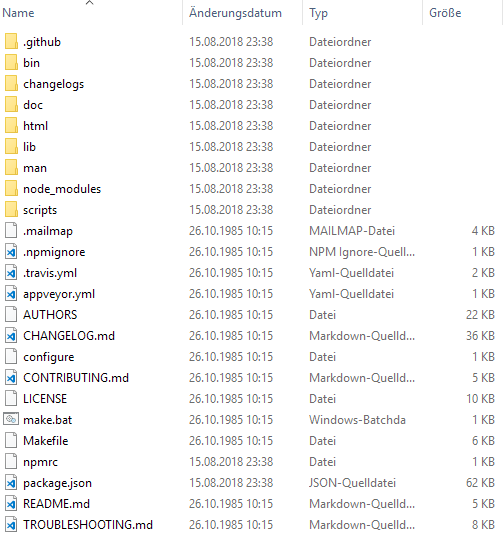

# Installation von ioBroker unter Windows

Die folgende Anleitung führt schrittweise durch die Installation. Bitte keine Schritte überspringen,
da einige Befehle aufeinander aufbauen.

## Voraussetzungen

!> Zuerst prüfen, ob das System alle notwendigen [Installationsvoraussetzungen]() 
erfüllt.

Für das spätere Ausführen von ioBroker ist die Installation einer JavaScript-
Laufzeitumgebung erforderlich. Sie heißt Nodejs und wird von der Node.js Foundation 
zur Verfügung gestellt. Wir gehen in dieser Anleitung davon aus, dass auf dem PC
noch kein Node.js installiert ist. 

*** Prüfung, ob Nodejs vorhanden und ggf. Sprung zu Update hier einbauen...

### Herunterladen von Nodejs

Je nach der installierten Windows Variante (32-/64Bit) ist die entsprechende 32- oder 64Bit Nodejs-Variante zu verwenden.

1. Welche Windows-Variante installiert ist erfährt man, indem man zuerst mit den 
   Tastenkombination  <kbd>&#x229e; Windows</kbd> + <kbd>r</kbd> den `Ausführen`-Dialog öffnet und 
   dort den Befehl 
   ~~~
   msinfo32
   ~~~
   eingibt. Nach der Bestätigung des Befehls erscheint das folgende Fenster:

     
   *Systeminformation*

   Im Beispiel sieht man, dass es sich hier um eine 64Bit-Installation (deutsch: `x64-basierter PC`,
   englisch: `x64-based PC`) handelt. Bei einer 32Bit-Windowsvariante würde hier `X86-basierter PC`
   beziehungsweise `X86-based PC` stehen.

1. Entsprechend der gefundenen Windows-Variante von der Webseite
   [https://nodejs.org/en/download/](https://nodejs.org/en/download/) die aktuelle 32- oder
   64Bit-LTS-Version von Node.js als .msi-Datei herunterladen.

     
   *Download von Node.js*

### Installieren von Nodejs

1. Das heruntergeladene Node.js-Installationsprogramm mit einem Doppelklick starten. 
   In der Regel steht das Programm im Ordner `Downloads` und folgt dem Namensschema `node-<Version>.msi`.  
     
1. Node.js mit den Standardeinstellungen installieren.  
   
     
   *Node.js Installation*

### Update des Node.js Paketmangers npm

!> `npm` ist ein <u>N</u>ode.js <u>P</u>aket<u>m</u>anager und dient zur Installation 
   von Programmen. Damit er funktioniert, ist direkt nach der Installation 
   von Node.js ein Update von `npm` erforderlich.

1. Ein Kommandozeilenfenster als Administrator öffen. Dazu mit den Tastenkombination 
   <kbd>&#x229e; Windows</kbd> + <kbd>r</kbd> den `Ausführen`-Dialog öffnen und dort 
   den Befehl 
   ~~~
   cmd
   ~~~
   eingeben. 
   
   Da das Kommandozeilenfenster als Administrator geöffnet werden muss, bitte die 
   die Eingabe **nicht** mit `OK` sondern mit der Tastenkombination `Strg` + `Umschalt` +
   `Eingabetaste` abschließen. Es erfolgt eine Sicherheitsabfrage, die mit `Ja` zu
   bestätigen ist.
   
1. Die Titelzeile im schwarzen Kommandozeilenfenster, dass sich jetzt geöffnet hat, muss mit 
   dem Wort `Administrator:` beginnen. Den folgenden Befehl einfügen und anschließend mit der
   <kbd>Eingabetaste</kbd> ausführen.
   ~~~
   npm install -g npm@latest
   ~~~

   Eine typisches Ergebnis des Befehls kann wie folgt aussehen:
   ~~~
   C:\Windows\system32>npm install -g npm@latest
   C:\Users\Admin\AppData\Roaming\npm\npm -> C:\Users\Admin\AppData\Roaming\npm\node_modules\npm\bin\npm-cli.js
   C:\Users\Admin\AppData\Roaming\npm\npx -> C:\Users\Admin\AppData\Roaming\npm\node_modules\npm\bin\npx-cli.js
   + npm@6.4.1
   added 387 packages in 16.219s
   ~~~
   
1. `npm` ist jetzt an zwei Orten installiert. Einmal im Node.js-Programmordner und
   einmal in einem Verzeichnis des aktuellen Windows-Benutzers. Da die Benutzer-Version
   neuer ist als die im Node.js-Ordner, überschreiben wir die Node.js-Version mit der
   Version aus dem Benutzerordner. 

1. Zuerst prüfen, ob npm wirklich in den beiden Ordner steht. Dazu mit der 
   Tastenkombination <kbd>&#x229e; Windows</kbd> + <kbd>e</kbd> ein Explorerfenster 
   öffnen. In der Adressleite den Pfad 
   ~~~
   %ProgramFiles%\nodejs\node_modules\npm
   ~~~
   eingeben und diesen öffnen. Hier sollten einige Dateien und Ordner enthalten sein:
   
     
   *npm-Dateien*
  
2. Anschließend im Explorerfenster jetzt den Pfad
   ~~~
   %APPDATA%\npm\node_modules\npm
   ~~~
   öffnen. Hier sollten ebenfalls wie oben Dateien und Ordner stehen.
   
3. Wenn alles so weit in Ornung ist, jetzt im Kommandozeilenfenster den folgenden Befehl ausführen:
   ~~~
   robocopy /r:0 /is /it "%ProgramFiles%\nodejs\node_modules\npm" "%APPDATA%\npm\node_modules\npm" npmrc
   ~~~
   
   Das gekürzte Ergebnis lautet:
   ~~~
   -------------------------------------------------------------------------------
   ROBOCOPY     ::     Robustes Dateikopieren für Windows
   -------------------------------------------------------------------------------
     Quelle : C:\Program Files\nodejs\node_modules\npm\
       Ziel : C:\Users\<Benutzer>\AppData\Roaming\npm\node_modules\npm\
    Dateien : npmrc
   -------------------------------------------------------------------------------

          Insgesamt    Kopiert Übersprungen Keine Übereinstimmung  FEHLER   Extras
   Verzeich.:     1          0            1                     0       0        0
     Dateien:     1          1            0                     0       0        0
       Bytes:    23         23            0                     0       0        0

   Geschwindigkeit:                1533 Bytes/Sek.
   Geschwindigkeit:               0.087 Megabytes/Min.
   ~~~
   
4. Dann im Kommandozeilenfenster den folgenden Befehl ausführen:
   ~~~
   robocopy /mir /zb /is /it /r:0 "%APPDATA%\npm\node_modules\npm" "%ProgramFiles%\nodejs\node_modules\npm" *.*
   ~~~
   
   Das Ergebnis lautet gekürzt:
   ~~~
   -------------------------------------------------------------------------------
   ROBOCOPY     ::     Robustes Dateikopieren für Windows
   -------------------------------------------------------------------------------
     Quelle : C:\Users\Admin\AppData\Roaming\npm\node_modules\npm\
       Ziel : C:\Program Files\nodejs\node_modules\npm\
    Dateien : *.*
   -------------------------------------------------------------------------------
    <lange Liste mit Dateien>
   -------------------------------------------------------------------------------

           Insgesamt   Kopiert Übersprungen Keine Übereinstimmung  FEHLER   Extras
    Verzeich.:   746       475          271                     0       0      799
      Dateien:  3630      3630            0                     0       0     3443
        Bytes: 16.27 m   16.27 m          0                     0       0  13.12 m
    
    Geschwindigkeit:             3396273 Bytes/Sek.
    Geschwindigkeit:             194.336 Megabytes/Min.
   ~~~
   Damit sind die beiden `npm`-Installationsorte auf die gleiche Version aktualisiert.

?> Das Update des Node.js-Paketmangers npm ist bei jeder Node.js-Nachinstallation 
   oder Node.js-Update zu wiederholen!

## Installation von ioBroker

   Abschließend das Kommandozeilenfenster durch das Ausführen des Befehls
   ~~~
   exit
   ~~~
   schließen.

### Dateispeicherorte

## Update

