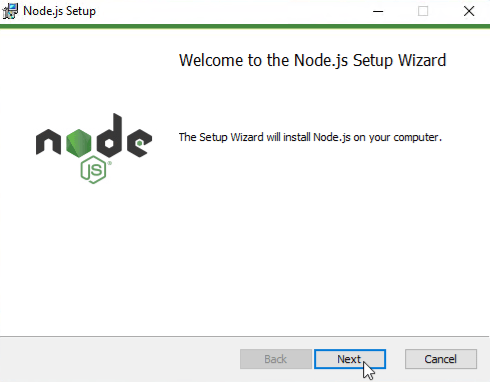

# Installation von ioBroker unter Windows

Die folgende Anleitung führt schrittweise durch die Installation. Bitte keine Schritte überspringen,
da einige Befehle aufeinander aufbauen.

## Voraussetzungen

!> Zuerst prüfen, ob das System alle notwendigen [Installationsvoraussetzungen]() 
erfüllt.

Für das spätere Ausführen von ioBroker ist die Installation der JavaScript-
Laufzeitumgebung Node.js erforderlich. Im folgenden wird davon ausgegangen, dass auf dem
PC weder Node.js noch ioBroker installiert ist. 

@@@ Prüfung, ob Nodejs/ioBroker vorhanden und ggf. Sprung zu Update hier einbauen @@@

## Installation von Node.js

### Herunterladen

?> Passend zur installierten Windows Variante (32-/64Bit) ist die entsprechende 32- oder 64Bit
   Node.js-Variante zu verwenden.

1. Welche Windows-Variante installiert ist, kann man erfahren, indem man zuerst mit den 
   Tastenkombination  <kbd>&#x229e; Windows</kbd> + <kbd>r</kbd> den `Ausführen`-Dialog öffnet und 
   dort den Befehl 
   ~~~
   msinfo32
   ~~~
   eingibt. Nach dem Bestätigen des Befehls erscheint das folgende Fenster:

     
   *Systeminformation*

 ?> Im Beispiel sieht man, dass es sich hier um eine 64Bit-Installation (deutsch: `x64-basierter PC`,
   englisch: `x64-based PC`) handelt. Bei einer 32Bit-Windowsvariante würde hier `X86-basierter PC`
   beziehungsweise `X86-based PC` stehen.

1. Entsprechend der gefundenen Windows-Variante jetzt von der Webseite
   [https://nodejs.org/en/download](https://nodejs.org/en/download/) die aktuelle LTS Version von Node.js in der 32- oder 64Bit-Variante als .msi-Datei herunterladen.

     
   *Download von Node.js*

### Installieren

1. Das heruntergeladene Node.js-Installationsprogramm mit einem Doppelklick starten. 
  
 ?> In der Regel steht das Programm im Ordner `Downloads` und folgt dem Namensschema
   `node-<Version>.msi`.  
     
1. Node.js mit den Standardeinstellungen installieren.  
   
     
   *Node.js Installation*

### Update des Paketmangers npm

?> `npm` ist ein <u>N</u>ode.js-<u>P</u>aket<u>m</u>anager und hilft bei der
   Verwaltung und Installation von Programmen. 
   
!> Damit `npm` funktioniert, ist direkt nach der Installation von Node.js
   ein Update von `npm` erforderlich.

1. Deshalb ein Kommandozeilenfenster als Administrator starten. Dazu mit der 
   Tastenkombination <kbd>&#x229e; Windows</kbd> + <kbd>r</kbd> den 
   `Ausführen`-Dialog öffnen und dort den Befehl 
   ~~~
   cmd
   ~~~
   eingeben. 
   
   Da das Kommandozeilenfenster als Administrator geöffnet werden muss, bitte die 
   Eingabe **nicht** mit `OK` sondern mit der Tastenkombination `Strg` + `Umschalt` +
   `Eingabetaste` abschließen. Es erfolgt eine Sicherheitsabfrage, die mit `Ja` oder
   der Eingabe des Administratorkennworts zu bestätigen ist.
   
 !> Die Titelzeile im schwarzen Kommandozeilenfenster, dass sich jetzt geöffnet hat, muss mit 
   dem Wort `Administrator:` beginnen.
   
2. Den folgenden Befehl einfügen und anschließend mit der <kbd>Eingabetaste</kbd> 
   ausführen.
   ~~~cmd
   npm install -g npm@latest
   ~~~

   Eine typisches Ergebnis des Befehls kann wie folgt aussehen:
   ~~~
   C:\Windows\system32>npm install -g npm@latest
   C:\Users\Admin\AppData\Roaming\npm\npm -> C:\Users\Admin\AppData\Roaming\npm\node_modules\npm\bin\npm-cli.js
   C:\Users\Admin\AppData\Roaming\npm\npx -> C:\Users\Admin\AppData\Roaming\npm\node_modules\npm\bin\npx-cli.js
   + npm@6.4.1
   added 387 packages in 16.219s
   ~~~
   
 ?> `npm` ist jetzt an zwei Orten installiert. Einmal im Node.js-Programmordner und
   einmal in einem Verzeichnis des aktuellen Windows-Benutzers. Da die Benutzer-Version
   von `npm` neuer ist als die im Node.js-Ordner, muss die Node.js-Version mit der
   Version aus dem Benutzerordner überschrieben werden. 

1. Zuerst prüfen, ob `npm` wirklich in den beiden Ordnern installiert ist. Dazu mit der 
   Tastenkombination <kbd>&#x229e; Windows</kbd> + <kbd>e</kbd> ein Explorerfenster 
   öffnen. In der Adresszeite den Pfad 
   ~~~
   %ProgramFiles%\nodejs\node_modules\npm
   ~~~
   eingeben. Hier sollten einige Dateien und Ordner enthalten sein:
   
     
   *npm-Dateien*
  
2. Anschließend im Explorerfenster jetzt den Pfad
   ~~~
   %APPDATA%\npm\node_modules\npm
   ~~~
   öffnen. Hier sollten ebenfalls wie oben Dateien und Ordner stehen.
   
3. Wenn alles so weit in Ordnung ist, im Kommandozeilenfenster den folgenden Befehl ausführen:
   ~~~cmd
   robocopy /r:0 /is /it "%ProgramFiles%\nodejs\node_modules\npm" "%APPDATA%\npm\node_modules\npm" npmrc
   ~~~
   
   Das gekürzte Ergebnis lautet:
   ~~~
   -------------------------------------------------------------------------------
   ROBOCOPY     ::     Robustes Dateikopieren für Windows
   -------------------------------------------------------------------------------
     Quelle : C:\Program Files\nodejs\node_modules\npm\
       Ziel : C:\Users\<Benutzer>\AppData\Roaming\npm\node_modules\npm\
    Dateien : npmrc
   -------------------------------------------------------------------------------

          Insgesamt    Kopiert Übersprungen Keine Übereinstimmung  FEHLER   Extras
   Verzeich.:     1          0            1                     0       0        0
     Dateien:     1          1            0                     0       0        0
       Bytes:    23         23            0                     0       0        0

   Geschwindigkeit:                1533 Bytes/Sek.
   Geschwindigkeit:               0.087 Megabytes/Min.
   ~~~
   
4. Jetzt im Kommandozeilenfenster den folgenden Befehl ausführen:
   ~~~cmd
   robocopy /mir /zb /is /it /r:0 "%APPDATA%\npm\node_modules\npm" "%ProgramFiles%\nodejs\node_modules\npm" *.*
   ~~~
   
   Das Ergebnis lautet gekürzt:
   ~~~
   -------------------------------------------------------------------------------
   ROBOCOPY     ::     Robustes Dateikopieren für Windows
   -------------------------------------------------------------------------------
     Quelle : C:\Users\Admin\AppData\Roaming\npm\node_modules\npm\
       Ziel : C:\Program Files\nodejs\node_modules\npm\
    Dateien : *.*
   -------------------------------------------------------------------------------
    <lange Liste mit Dateien>
   -------------------------------------------------------------------------------

           Insgesamt   Kopiert Übersprungen Keine Übereinstimmung  FEHLER   Extras
    Verzeich.:   746       475          271                     0       0      799
      Dateien:  3630      3630            0                     0       0     3443
        Bytes: 16.27 m   16.27 m          0                     0       0  13.12 m
    
    Geschwindigkeit:             3396273 Bytes/Sek.
    Geschwindigkeit:             194.336 Megabytes/Min.
   ~~~
   Damit sind die beiden `npm`-Installationsorte auf die gleiche Version aktualisiert.

!> Das Update des Node.js-Paketmangers `npm` ist bei jeder Node.js-Nachinstallation 
   und jedem Node.js-Update zu wiederholen!

## Installation von ioBroker

?> ioBroker kann in einen frei wählbaren Ordner auf der lokalen Festplatte installiert
   werden. Wenn der Installationspfad Leerzeichen enthält, muss die vollständige 
   Pfadangabe bei allen Befehlen mit Anführungszeichen umschlossen werden.  
   Beispielbefehl: `dir "C:\ioBroker Testsystem"`.  
    
   Der Standardinstallationsorder für ioBroker ist `C:\iobroker`.

1. Ein Kommandozeilenfenster als Administrator öffen. Dazu mit den Tastenkombination 
   <kbd>&#x229e; Windows</kbd> + <kbd>r</kbd> den `Ausführen`-Dialog öffnen und dort 
   den Befehl 
   ~~~cmd
   cmd
   ~~~
   eingeben. 
   
   Da das Kommandozeilenfenster als Administrator geöffnet werden muss, bitte die 
   Eingabe **nicht** mit `OK` sondern mit der Tastenkombination `Strg` + `Umschalt` +
   `Eingabetaste` abschließen. Es erfolgt eine Sicherheitsabfrage, die mit `Ja` oder
   der Eingabe des Administratorkennworts zu bestätigen ist.
   
 !> Die Titelzeile im schwarzen Kommandozeilenfenster, dass sich jetzt geöffnet hat, 
   muss mit dem Wort `Administrator:` beginnen. 
   
1. Im Kommandozeilenfenster die folgenden Befehle zum Anlegen des Installationsordners
   ausführen:
   ~~~cmd
   md C:\iobroker
   ~~~
   
 ?> Manche ioBroker-Adapter enthalten Komponenten, die für Windows kompiliert 
   werden müssen. Deshalb werden vor der Installation von ioBroker die sogenannten 
   `windows-build-tools` installiert. Mehr Informationen zu den `windows-build-tools`
   sind [hier zu finden](https://github.com/felixrieseberg/windows-build-tools).

1. Die `windows-build-tools` werden mit dem folgenden Kommando installiert:
   ~~~cmd
   npm install --global windows-build-tools
   ~~~

1. Jetzt kann das eigentliche ioBroker-Installationspaket installiert werden:
   ~~~cmd
   cd /d C:\iobroker
   npm install https://github.com/ioBroker/ioBroker/tarball/master
   ~~~

   Das Ergebnis sollte so aussehen:
   ~~~
   ╭───────────────────────────────────────────────────────╮
   │ The iobroker files have been downloaded successfully. │
   │ To complete the installation, you need to run         │
   │                                                       │
   │                  npm i --production                   │
   │                                                       │
   ╰───────────────────────────────────────────────────────╯
   
   npm notice created a lockfile as package-lock.json. You should commit this file.
   npm WARN enoent ENOENT: no such file or directory, open 'C:\iobroker\package.json'
   npm WARN iobroker No description
   npm WARN iobroker No repository field.
   npm WARN iobroker No README data
   npm WARN iobroker No license field.

   + iobroker@1.3.0
   added 51 packages from 28 contributors and audited 83 packages in 6.937s
   found 0 vulnerabilities
   ~~~

1. Die ioBroker Installation wird mit dem folgenden Komandos abgeschlossen:
   ~~~cmd
   cd /d C:\iobroker
   npm install --production
   ~~~
   Der Installationsvorgang kann etwas dauern.

   Die letzten Zeilen der Installation sollten in etwa wie folgt enden:
   ~~~
   [...]
   Write "iobroker start" to start the ioBroker
   npm install node-windows@0.1.14 --production --save --prefix "C:/iobroker"
   ioBroker service installed. Write "serviceIoBroker start" to start the service and go to http://localhost:8081 to open the admin UI.
   To see the outputs do not start the service, but write "node node_modules/iobroker.js-controller/controller"
   npm WARN optional SKIPPING OPTIONAL DEPENDENCY: unix-dgram@0.2.3 (node_modules\unix-dgram):
   npm WARN optional SKIPPING OPTIONAL DEPENDENCY: unix-dgram@0.2.3 install: `node-gyp rebuild`
   npm WARN optional SKIPPING OPTIONAL DEPENDENCY: Exit status 1

   added 514 packages from 300 contributors and audited 1808 packages in 61.874s
   found 23 vulnerabilities (17 low, 6 high)
   run `npm audit fix` to fix them, or `npm audit` for details
   ~~~

1. Anschließend kann mit dem Befehl
   ~~~cmd
   iobroker status
   ~~~
   geprüft werden, ob ioBroker als Windows Dienst automatisch gestartet wurde.
   Die Antwort sollte
   ~~~
   iobroker is running 
   ~~~
   lauten.

 ?> Zukünftig wird ioBroker bei jedem Systemneustart im Hintergrund automatisch 
   gestartet.

1. Abschließend kann das Kommandozeilenfenster durch das Ausführen des Befehls
   ~~~
   exit
   ~~~
   geschlossen werden.

?> Die weitere Konfiguration erfolgt mit Hilfe des `Admin`-Adapters. Er wird mit einem
   Webbrowser und der Adresse [http://localhost:8081](http://localhost:8081)
   beziehungsweise `http://<Names-oder-Adresse-des-Rechners>:8081`  aufgerufen.  
    
   Die weitere Konfiguration von ioBroker wird im Kapitel [Konfiguration]() beschrieben.

## Update
@@@ tbd @@@

## Fehlersuche
@@@ tbd @@@
