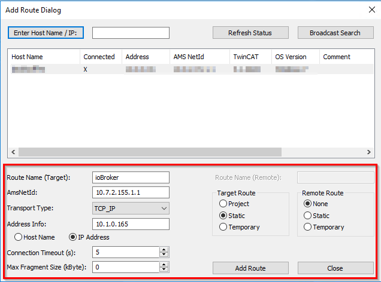

# IoBroker.beckhoff
Этот адаптер ioBroker реализует связь с системой управления Beckhof (TwinCAT 2 или 3) по протоколу ADS.
Протокол ADS реализован в каждом контроллере Beckhoff и может использоваться без лицензии.

Этот проект не имеет отношения к компании Beckhoff.

## Описание
### Условия
* Beckhoff с сетевым подключением, которое находится в сети, к которой может получить доступ ioBroker
    * Контроллеру должен быть назначен фиксированный IP-адрес
    * Контроллер должен быть доступен для проверки связи со стороны ioBroker
  * TwinCat 2 **кроме элементов управления BC** или TwinCat 3

### Конфигурация управления
1. В проекте должна быть активирована ADS. Для этого перейдите в конфигурацию задачи в контрольном проекте и установите флажок «Создать символы». Затем загрузите конфигурацию в контроллер и перезапустите его. Перезапуск необходим только при использовании TwinCat 2.

    

2. В контроллере должен быть создан статический маршрут. Маршрут должен совпадать с ioBroker (IP-адрес и AMS-Net-ID).

    Вот пример того, как это может выглядеть, если маршрут добавлен непосредственно в контроллер. Маршрут также можно добавить через инженерный калькулятор.

    

    Дополнительную информацию о маршрутизаторе TwinCat и системе управления в целом можно найти в [Информационная система Beckhoff](https://infosys.beckhoff.com/ "Beckhoff Information System").

3. В TwinCat 2 в элементе управления также должна быть создана структура. Затем добавьте структуру в таблицу глобальных переменных. Затем здесь можно создать все необходимые переменные. В этом случае обмен данными выполняется независимо между ADS и адаптером.

    ##### Поддерживаемые в настоящее время типы данных: BOOL, BYTE, WORD, DWORD, SINT, USINT, INT, UINT, DINT, UDINT, REAL, LREAL, STRING (80)
    ДОПОЛНИТЕЛЬНО: переменную можно создать непосредственно в таблице переменных без вложения с точным именем -> ioBrokerResync (верхний / нижний регистр и тип данных не имеет значения) -> Каждый раз, когда это значение изменяется, таблица переменных снова считывается в ioBroker .

3. При использовании TwinCat 3 в контроллере также должна быть создана таблица глобальных переменных. Затем здесь можно создать все необходимые переменные. В этом случае обмен данными выполняется независимо между ADS и адаптером.

    ##### Поддерживаемые в настоящее время типы данных: BOOL, BYTE, WORD, DWORD, SINT, USINT, INT, UINT, DINT, UDINT, REAL, LREAL, STRING (80)
    ДОПОЛНИТЕЛЬНО: переменную можно создать непосредственно в таблице переменных без вложения с точным именем -> ioBrokerResync (верхний / нижний регистр и тип данных не имеет значения) -> Каждый раз, когда это значение изменяется, таблица переменных снова считывается в ioBroker .

### Настройки адаптера
#### Twincat 3 и Twincat 2
1. Выберите версию среды выполнения.
2. Введите IP-адрес назначения и AMS-Net-ID.
3. Для TwinCat 2 введите имя экземпляра структуры из таблицы глобальных переменных.
4. Введите правильное имя таблицы переменных для TwinCat 3.
5. Остальные пункты обычно не нужно менять.

#### Twincat 2 <= v2.11.2240
Необходимо загрузить файл * .tpy из проекта ПЛК. -> Каждый раз, когда что-то изменяется в структуре, отвечающей за связь с ioBroker, этот файл необходимо загрузить снова.

### Обмен данными
- Как только переменная в контроллере изменяется, это значение автоматически переводится в соответствующее состояние в ioBroker.
- Если значение изменяется в ioBroker (важно: ACK должен иметь значение FALSE !!), оно автоматически передается контроллеру. Если значение принимается контроллером, ACK устанавливается в TRUE.

### Важный
1. Маршрутизатор TwinCAT AMS не допускает нескольких TCP-соединений с одного и того же хоста. Если два экземпляра устанавливаются с одного хоста на один и тот же маршрутизатор TwinCat, маршрутизатор автоматически закрывает первое соединение и отвечает только последнее.
2. Адаптер автоматически синхронизирует все переменные в ioBroker. Есть несколько способов запуска повторной синхронизации:
    - Если значение переменной Resyc изменяется (см. [Здесь] (# configuration-the-control))
    - Если контроллер не находится в режиме RUN дольше, чем интервал повторного подключения -> Затем таблица переменных повторно синхронизируется, когда контроллер переходит в режим RUN.
    - Когда проект загружен в контроллер. Исключение -> OnlineChange
    - При перезапуске адаптера.
3. «Синхронизация» или «чтение» не означает обмен значениями переменных, а скорее синхронизацию самих переменных и создание или удаление их в ioBroker.

## Changelog
### 1.4.0 (2021-01-25)

-   (dkleber89) Add LREAL Support

### 1.3.0 (2021-01-25)

-   (dkleber89) Set correct type for channels

### 1.2.2 (2020-05-30)

-   (dkleber89) Clear reconnectTimeout on Adapter unload;

### 1.2.1 (2020-04-20)

- (dkleber89) Add CI over Github Actions; Update Dependencies;

### 1.2.0 (2020-01-02)

- (dkleber89) Add Support for Strings with fixed length to 80 Chars

### 1.1.0 (2019-11-12)

- (dkleber89) Add Support for older TwinCat2 Systems with no autosync

### 1.0.7 (2019-10-25)

- (dkleber89) Add Support for Compact Mode -> JS Controller >= 2.0.0

### 1.0.6 (2019-08-11)

-   (dkleber89) Add check change of Datatype on resync

### 1.0.5 (2019-08-10)

-   (dkleber89) Eslint, Prettier with Airbnb Codestyle, CI adopted, little random changes in Project Structure

### 1.0.4 (2019-08-01)

-   (dkleber89) Increase depth of LOG details, Update dependency versions

### 1.0.2 (2019-05-18)

-   (Appollon77) Update testing for Node.js v12 in Appveyor und Travis

### 1.0.1 (2019-04-06)

-   (dkleber89) Random Bugfixes, Add some monitoring that States get correct Ack

## License

The MIT License (MIT)

Copyright (c) 2018-2021 dkleber89 <dkleber89@gmail.com>

Permission is hereby granted, free of charge, to any person obtaining a copy
of this software and associated documentation files (the "Software"), to deal
in the Software without restriction, including without limitation the rights
to use, copy, modify, merge, publish, distribute, sublicense, and/or sell
copies of the Software, and to permit persons to whom the Software is
furnished to do so, subject to the following conditions:

The above copyright notice and this permission notice shall be included in
all copies or substantial portions of the Software.

THE SOFTWARE IS PROVIDED "AS IS", WITHOUT WARRANTY OF ANY KIND, EXPRESS OR
IMPLIED, INCLUDING BUT NOT LIMITED TO THE WARRANTIES OF MERCHANTABILITY,
FITNESS FOR A PARTICULAR PURPOSE AND NONINFRINGEMENT. IN NO EVENT SHALL THE
AUTHORS OR COPYRIGHT HOLDERS BE LIABLE FOR ANY CLAIM, DAMAGES OR OTHER
LIABILITY, WHETHER IN AN ACTION OF CONTRACT, TORT OR OTHERWISE, ARISING FROM,
OUT OF OR IN CONNECTION WITH THE SOFTWARE OR THE USE OR OTHER DEALINGS IN
THE SOFTWARE.